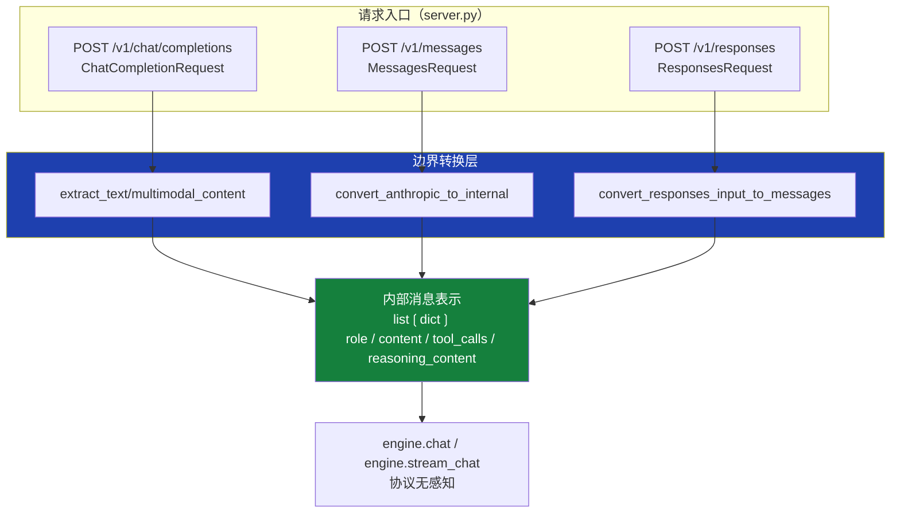
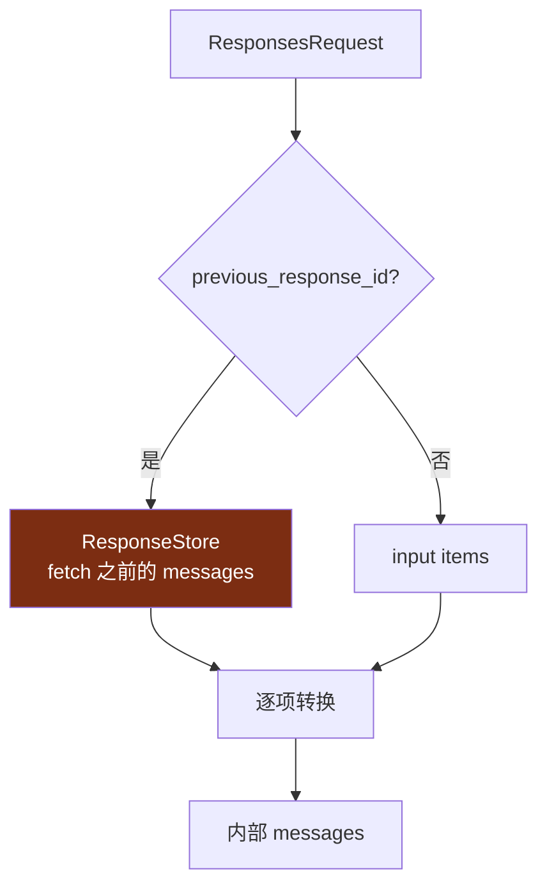
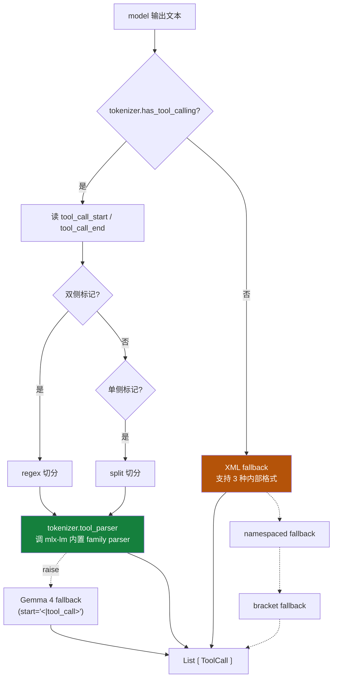
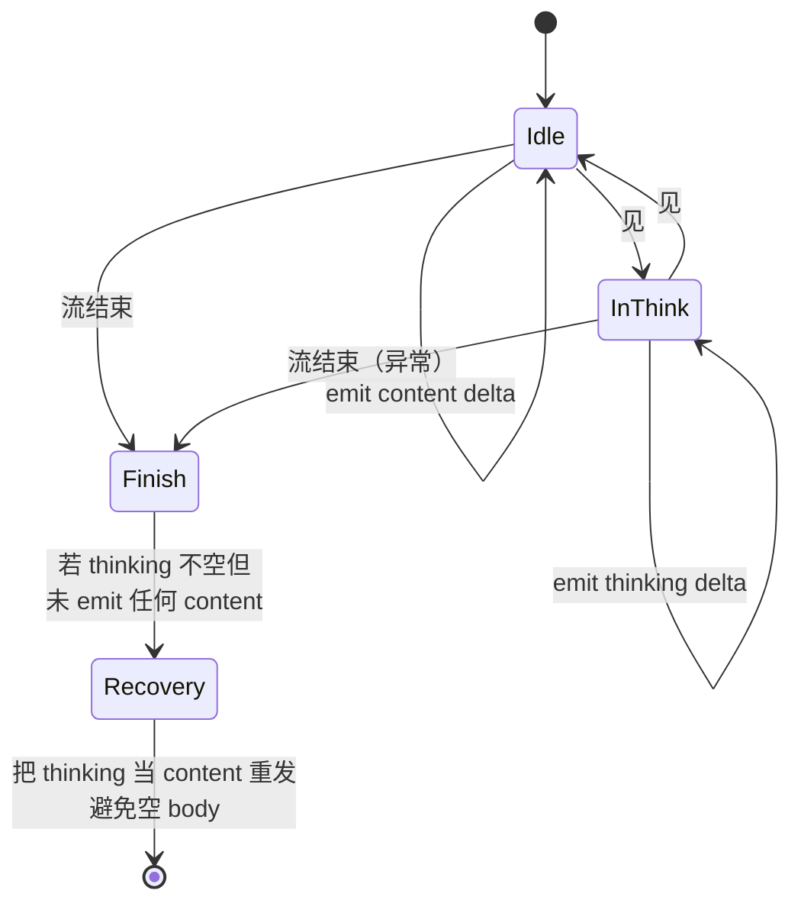
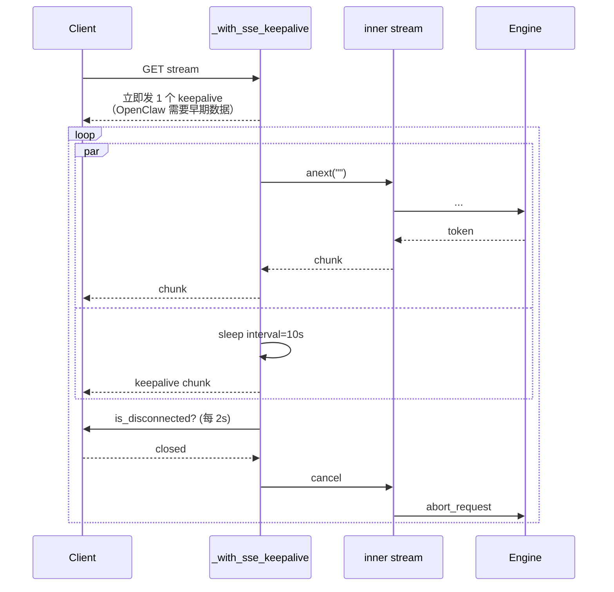

<details>
<summary>相关源文件</summary>

生成本页时使用的主要源文件：

- [omlx/server.py](../../../project-repos/omlx/omlx/server.py)
- [omlx/api/openai_models.py](../../../project-repos/omlx/omlx/api/openai_models.py)
- [omlx/api/anthropic_models.py](../../../project-repos/omlx/omlx/api/anthropic_models.py)
- [omlx/api/anthropic_utils.py](../../../project-repos/omlx/omlx/api/anthropic_utils.py)
- [omlx/api/responses_models.py](../../../project-repos/omlx/omlx/api/responses_models.py)
- [omlx/api/responses_utils.py](../../../project-repos/omlx/omlx/api/responses_utils.py)
- [omlx/api/tool_calling.py](../../../project-repos/omlx/omlx/api/tool_calling.py)
- [omlx/api/thinking.py](../../../project-repos/omlx/omlx/api/thinking.py)
- [omlx/api/grammar.py](../../../project-repos/omlx/omlx/api/grammar.py)
- [omlx/api/utils.py](../../../project-repos/omlx/omlx/api/utils.py)
- [omlx/api/embedding_models.py](../../../project-repos/omlx/omlx/api/embedding_models.py)
- [omlx/api/rerank_models.py](../../../project-repos/omlx/omlx/api/rerank_models.py)
- [omlx/api/audio_routes.py](../../../project-repos/omlx/omlx/api/audio_routes.py)

</details>

# API 兼容层

oMLX 同时支持三套互不兼容的 API schema：

- **OpenAI Chat Completions**（`/v1/chat/completions`）— 业界事实标准
- **Anthropic Messages**（`/v1/messages`）— Claude SDK 原生协议，Claude Code 用它
- **OpenAI Responses**（`/v1/responses`）— OpenAI 的新统一协议，Codex 用它

这三套协议在工具调用、流式事件、reasoning/thinking、多模态输入上每一处细节都不同。如果按每个协议各写一套推理路径，引擎逻辑会被复制三次，维护成本爆炸。oMLX 的解法是**协议适配器只在 server 边界存在**——三个 endpoint handler 把请求转成同一个内部消息表示（`list[dict]`，带统一的 role/content/tool_calls 字段），剩下的推理路径完全协议无关。

这一页解释这套协议桥接的具体机制：每个协议如何被解析、统一形式长什么样、工具调用怎么跨多种模型家族解析、thinking 如何在三个协议下统一表达。

## 三个协议，一条主路径



转回去也对称：engine 返回 token stream → 协议特定的 stream wrapper 按各自的 SSE 格式编码 → 客户端。

Sources: [omlx/server.py:2057-2413](../../../project-repos/omlx/omlx/server.py#L2057-L2413), [omlx/server.py:3404-3698](../../../project-repos/omlx/omlx/server.py#L3404-L3698), [omlx/server.py:3814-4694](../../../project-repos/omlx/omlx/server.py#L3814-L4694)

<details class="source-snippets">
<summary>引用源码</summary>

<!-- source-snippets:start -->

#### `omlx/server.py:2057-2413`

````python
@app.post("/v1/chat/completions")
async def create_chat_completion(
    request: ChatCompletionRequest,
    http_request: FastAPIRequest,
    _: bool = Depends(verify_api_key),
):
    """
    Create a chat completion.

    Structured output (JSON mode):
    ```json
    response_format={"type": "json_object"}
    ```

    Structured output (JSON Schema):
    ```json
    response_format={
        "type": "json_schema",
        "json_schema": {
            "name": "my_schema",
            "schema": {"type": "object", "properties": {...}}
        }
    }
    ```
    """
    # Log incoming request summary at debug, message content at trace
    logger.debug(f"Chat completion request received: model={request.model}, "
                 f"messages={len(request.messages)}, stream={request.stream}, "
                 f"max_tokens={request.max_tokens}, temp={request.temperature}")
    if logger.isEnabledFor(5):
        for i, msg in enumerate(request.messages):
            content_preview = str(msg.content)[:200] if msg.content else "(empty)"
            logger.log(5, "  Message[%d]: role=%s, content=%s...", i, msg.role, content_preview)

    # Block inference during quantization to prevent GPU Metal errors
    if _server_state.oq_manager and _server_state.oq_manager.is_quantizing:
        raise HTTPException(
            status_code=503,
            detail="Server is busy with oQ quantization. Please try again after quantization completes.",
        )

    load_start = time.perf_counter()
    engine = await get_engine_for_model(request.model)
    model_load_duration = time.perf_counter() - load_start

    # Resolve alias to real model ID for settings lookups
    resolved_model = resolve_model_id(request.model) or request.model

    # Get per-model settings
    max_tool_result_tokens = None
    merged_ct_kwargs = {}
    forced_keys: set[str] = set()
    reasoning_parser = None
    if _server_state.settings_manager:
        ms = _server_state.settings_manager.get_settings(resolved_model)
        max_tool_result_tokens = ms.max_tool_result_tokens
        reasoning_parser = ms.reasoning_parser
        if ms.chat_template_kwargs:
            merged_ct_kwargs.update(ms.chat_template_kwargs)
        forced_keys = set(ms.forced_ct_kwargs or [])
        # Dedicated enable_thinking toggle takes precedence over chat_template_kwargs
        if ms.enable_thinking is not None:
            merged_ct_kwargs["enable_thinking"] = ms.enable_thinking
        # preserve_thinking: keep <think> blocks in historical turns (Qwen 3.6+)
        if ms.preserve_thinking is not None:
            merged_ct_kwargs["preserve_thinking"] = ms.preserve_thinking
    # Per-request kwargs override model settings (except forced keys)
    if request.chat_template_kwargs:
        for k, v in request.chat_template_kwargs.items():
            if k not in forced_keys:
                merged_ct_kwargs[k] = v

    # Extract messages - different engines need different content handling.
    # Templates that expose message.reasoning_content natively (Qwen 3.6+)
    # get reasoning as a separate field; others fall back to <think> inlined
    # in content.
    _entry = get_engine_pool().get_entry(resolved_model)
    native_reasoning = bool(_entry and _entry.preserve_thinking_default is True)
    is_vlm = isinstance(engine, VLMBatchedEngine)
    extractor = getattr(engine, "message_extractor", None)
    if extractor is not None:
        messages = extractor(request.messages, max_tool_result_tokens, engine.tokenizer)
    elif is_vlm:
        # VLM: preserve image_url content parts for vision processing
        messages = extract_multimodal_content(
            request.messages,
            max_tool_result_tokens,
            engine.tokenizer,
            native_reasoning_content=native_reasoning,
        )
    else:
        messages = extract_text_content(
            request.messages,
            max_tool_result_tokens,
            engine.tokenizer,
            native_reasoning_content=native_reasoning,
        )

    # Detect and strip partial mode at the API boundary — exactly once,
    # before any chat template application.  The boolean result is forwarded
    # as an explicit parameter so the engine never has to re-derive it.
    is_partial = detect_and_strip_partial(messages)

    # Compile grammar for structured output (logit-level enforcement).
    # Grammar compilation needs the tokenizer, so ensure the engine is loaded.
    response_format = request.response_format
    if request.structured_outputs is not None or response_format:
        await engine.start()
    compiled_grammar = _compile_grammar_for_request(
        engine,
        structured_outputs=request.structured_outputs,
        response_format=response_format,
        chat_template_kwargs=merged_ct_kwargs or None,
        reasoning_parser=reasoning_parser,
    )
    # Fall back to prompt injection when grammar is not compiled
    if compiled_grammar is None and response_format:
        json_instruction = build_json_system_prompt(response_format)
        if json_instruction:
            messages = _inject_json_instruction(messages, json_instruction)
... snippet truncated ...
````

#### `omlx/server.py:3404-3698`

````python
@app.post("/v1/messages")
async def create_anthropic_message(
    request: AnthropicMessagesRequest,
    http_request: FastAPIRequest,
    _: bool = Depends(verify_api_key),
):
    """
    Create a message using Anthropic Messages API format.

    This endpoint provides compatibility with Anthropic's Messages API,
    allowing clients that use Anthropic SDK to work with oMLX.

    Example request:
    ```json
    {
        "model": "claude-3-sonnet",
        "max_tokens": 1024,
        "messages": [
            {"role": "user", "content": "Hello, how are you?"}
        ]
    }
    ```

    Streaming is supported with `stream: true`.
    """
    logger.debug(
        f"Anthropic Messages request: model={request.model}, "
        f"messages={len(request.messages)}, stream={request.stream}, "
        f"max_tokens={request.max_tokens}"
    )

    if _server_state.oq_manager and _server_state.oq_manager.is_quantizing:
        raise HTTPException(
            status_code=503,
            detail="Server is busy with oQ quantization. Please try again after quantization completes.",
        )

    engine = await get_engine_for_model(request.model)

    # Resolve alias to real model ID for settings lookups
    resolved_model = resolve_model_id(request.model) or request.model

    # Get per-model settings
    max_tool_result_tokens = None
    merged_ct_kwargs = {}
    forced_keys: set[str] = set()
    if _server_state.settings_manager:
        ms = _server_state.settings_manager.get_settings(resolved_model)
        max_tool_result_tokens = ms.max_tool_result_tokens
        if ms.chat_template_kwargs:
            merged_ct_kwargs.update(ms.chat_template_kwargs)
        forced_keys = set(ms.forced_ct_kwargs or [])
        # Dedicated enable_thinking toggle takes precedence over chat_template_kwargs
        if ms.enable_thinking is not None:
            merged_ct_kwargs["enable_thinking"] = ms.enable_thinking
        # preserve_thinking: keep <think> blocks in historical turns (Qwen 3.6+)
        if ms.preserve_thinking is not None:
            merged_ct_kwargs["preserve_thinking"] = ms.preserve_thinking
    # Per-request kwargs override model settings (except forced keys)
    if request.chat_template_kwargs:
        for k, v in request.chat_template_kwargs.items():
            if k not in forced_keys:
                merged_ct_kwargs[k] = v

    # Pass Anthropic thinking config to chat template (except forced keys)
    if hasattr(request, 'thinking') and request.thinking:
        if "enable_thinking" not in forced_keys:
            thinking_type = getattr(request.thinking, 'type', None)
            if thinking_type in ("enabled", "adaptive"):
                merged_ct_kwargs["enable_thinking"] = True
            elif thinking_type == "disabled":
                merged_ct_kwargs["enable_thinking"] = False

    logger.debug(
        f"Tool result truncation config: max_tokens={max_tool_result_tokens}, "
        f"has_tokenizer={engine.tokenizer is not None}"
    )

    # Convert Anthropic format to internal format
    # Harmony models need special handling to preserve tool format
    is_vlm = isinstance(engine, VLMBatchedEngine)
    _entry = get_engine_pool().get_entry(resolved_model)
    native_reasoning = bool(_entry and _entry.preserve_thinking_default is True)
    if engine.model_type == "gpt_oss":
        messages = convert_anthropic_to_internal_harmony(
            request, max_tool_result_tokens, engine.tokenizer
        )
    else:
        messages = convert_anthropic_to_internal(
            request, max_tool_result_tokens, engine.tokenizer,
            preserve_images=is_vlm,
            native_reasoning_content=native_reasoning,
        )

    # Apply model-specific message extraction (e.g. Gemma 4 converts
    # role=tool messages into tool_responses on assistant turns).
    extractor = getattr(engine, "message_extractor", None)
    if extractor is not None:
        messages = extractor(messages, max_tool_result_tokens, engine.tokenizer)

    # Detect and strip partial mode at the API boundary — exactly once.
    is_partial = detect_and_strip_partial(messages)

    # Prepare kwargs
    temperature, top_p, top_k, repetition_penalty, min_p, presence_penalty, frequency_penalty, max_tokens, xtc_probability, xtc_threshold = get_sampling_params(
        request.temperature, request.top_p, request.model,
        req_max_tokens=request.max_tokens,
    )

    chat_kwargs = {
        "max_tokens": max_tokens,
        "temperature": temperature,
        "top_p": top_p,
        "top_k": top_k,
        "min_p": min_p,
        "repetition_penalty": repetition_penalty,
        "presence_penalty": presence_penalty,
        "frequency_penalty": frequency_penalty,
        "xtc_probability": xtc_probability,
        "xtc_threshold": xtc_threshold,
... snippet truncated ...
````

#### `omlx/server.py:3814-4694`

```python
@app.post("/v1/responses")
async def create_response(
    request: ResponsesRequest,
    http_request: FastAPIRequest,
    _: bool = Depends(verify_api_key),
):
    """Create a response (OpenAI Responses API)."""
    if _server_state.oq_manager and _server_state.oq_manager.is_quantizing:
        raise HTTPException(
            status_code=503,
            detail="Server is busy with oQ quantization. Please try again after quantization completes.",
        )

    logger.debug(
        f"Responses API request: model={request.model}, stream={request.stream}"
    )

    load_start = time.perf_counter()
    engine = await get_engine_for_model(request.model)
    model_load_duration = time.perf_counter() - load_start

    resolved_model = resolve_model_id(request.model) or request.model

    current_input_messages = convert_responses_input_to_messages(request.input)

    # Build previous context from previous_response_id
    previous_messages = None
    if request.previous_response_id:
        previous_messages = _resolve_previous_response_messages(
            request.previous_response_id
        )

    # Convert Responses API input → internal messages
    messages = convert_responses_input_to_messages(
        request.input, request.instructions, previous_messages
    )

    # Convert tools: flat → nested
    openai_tools = convert_responses_tools(request.tools)

    # Get per-model settings
    max_tool_result_tokens = None
    merged_ct_kwargs = {}
    forced_keys: set[str] = set()
    reasoning_parser = None
    if _server_state.settings_manager:
        ms = _server_state.settings_manager.get_settings(resolved_model)
        max_tool_result_tokens = ms.max_tool_result_tokens
        reasoning_parser = ms.reasoning_parser
        if ms.chat_template_kwargs:
            merged_ct_kwargs.update(ms.chat_template_kwargs)
        forced_keys = set(ms.forced_ct_kwargs or [])
        # Dedicated enable_thinking toggle takes precedence over chat_template_kwargs
        if ms.enable_thinking is not None:
            merged_ct_kwargs["enable_thinking"] = ms.enable_thinking
        # preserve_thinking: keep <think> blocks in historical turns (Qwen 3.6+)
        if ms.preserve_thinking is not None:
            merged_ct_kwargs["preserve_thinking"] = ms.preserve_thinking

    # Note: extract_text_content/extract_harmony_messages/extract_multimodal_content
    # are NOT called here because convert_responses_input_to_messages() already
    # returns plain dicts in {"role": str, "content": str} format.
    # Those extract functions expect Pydantic Message objects from OpenAI/Anthropic requests.

    # Handle text.format (structured output)
    response_format = None
    compiled_grammar = None
    if request.text and request.text.format:
        fmt = request.text.format
        if fmt.type == "json_object":
            response_format = {"type": "json_object"}
        elif fmt.type == "json_schema":
            response_format = {
                "type": "json_schema",
                "json_schema": {
                    "name": fmt.name or "response",
                    "schema": fmt.schema_ or {},
                    "strict": fmt.strict or False,
                },
            }
        if response_format:
            from .api.openai_models import ResponseFormat

            await engine.start()
            rf = ResponseFormat(**response_format)
            compiled_grammar = _compile_grammar_for_request(
                engine, response_format=rf,
                chat_template_kwargs=merged_ct_kwargs or None,
                reasoning_parser=reasoning_parser,
            )
            if compiled_grammar is None:
                json_instruction = build_json_system_prompt(rf)
                if json_instruction:
                    messages = _inject_json_instruction(messages, json_instruction)
        else:
            compiled_grammar = None

    # Merge MCP tools
    effective_tools = openai_tools
    if _server_state.mcp_manager and openai_tools:
        effective_tools = _server_state.mcp_manager.get_merged_tools(openai_tools)

    # Convert tools for chat template
    tools_for_template = (
        convert_tools_for_template(effective_tools) if effective_tools else None
    )
    # Gemma 4 drops required params that lack descriptions — enrich them
    if tools_for_template and "gemma" in (resolved_model or "").lower():
        tools_for_template = enrich_tool_params_for_gemma4(tools_for_template)

    # Validate context window
    try:
        num_prompt_tokens = engine.count_chat_tokens(
            messages,
            tools_for_template,
            chat_template_kwargs=merged_ct_kwargs or None,
        )
    except Exception as e:
        err_name = type(e).__name__.lower()
        err_msg = str(e).lower()
... snippet truncated ...
```

<!-- source-snippets:end -->
</details>

## OpenAI Chat：标准入口

`POST /v1/chat/completions`（[server.py:2057](../../../project-repos/omlx/omlx/server.py#L2057)）是最主流的 endpoint。处理流程：

1. **API key 校验**（`verify_api_key`，[server.py:253-294](../../../project-repos/omlx/omlx/server.py#L253-L294)）— Bearer 或 `x-api-key` 头
2. **模型别名解析** — 用户用的 model id 可能是模型 alias，先映射到真实模型 id
3. **`get_engine`** — 拉对应引擎（VLM 走 VLMBatchedEngine，否则 BatchedEngine）
4. **消息提取** — VLM 走 `extract_multimodal_content` 保留 image_url，纯文本走 `extract_text_content`
5. **工具与 MCP 合并** — 用户 tools 跟 MCP manager 的 tools 合并成统一列表（[server.py:2178-2183](../../../project-repos/omlx/omlx/server.py#L2178-L2183)）
6. **Grammar 编译** — `response_format` 或 `structured_outputs` 配置 → xgrammar 编译
7. **构造 chat_kwargs** — sampling 参数、thinking budget、tools 全部塞进 dict
8. **`engine.chat(...)` 或 `stream_chat_completion(...)`** — 真正进入引擎

OpenAI Chat 的输入消息 schema 比较直接（[openai_models.py](../../../project-repos/omlx/omlx/api/openai_models.py)）：

```python
class Message:
    role: Literal["system", "user", "assistant", "tool"]
    content: Union[str, list[ContentPart]]   # text 或多模态
    tool_calls: Optional[list[ToolCall]]     # assistant turn
    tool_call_id: Optional[str]              # tool turn
```

`ContentPart` 可以是 `{type: "text", text: "..."}` 或 `{type: "image_url", image_url: {url}}`，url 接受 `https://`、`data:image/...;base64,...`、或本地文件路径。

Sources: [omlx/api/openai_models.py](../../../project-repos/omlx/omlx/api/openai_models.py), [omlx/api/utils.py:350,531](../../../project-repos/omlx/omlx/api/utils.py:350%2C531)

<details class="source-snippets">
<summary>引用源码</summary>

<!-- source-snippets:start -->

#### `omlx/api/openai_models.py`

```python
# SPDX-License-Identifier: Apache-2.0
# Adapted from vllm-mlx (https://github.com/vllm-project/vllm-mlx).
"""
Pydantic models for OpenAI-compatible API.

These models define the request and response schemas for:
- Chat completions
- Text completions
- Tool calling
- MCP (Model Context Protocol) integration
"""

import json
from typing import Any, Dict, List, Optional, Union

from pydantic import AliasChoices, BaseModel, Field, field_validator

from omlx.api.shared_models import (
    BaseUsage,
    IDPrefix,
    generate_id,
    get_unix_timestamp,
)


# =============================================================================
# Content Types
# =============================================================================

class ImageURL(BaseModel):
    """Image URL or base64 data URI for vision model input."""
    url: str  # "https://..." or "data:image/jpeg;base64,..."
    detail: Optional[str] = "auto"  # "low", "high", "auto"


class ContentPart(BaseModel):
    """
    A part of a message content array.

    Supports:
    - text: Plain text content
    - image_url: Image input for vision models
    """
    type: str  # "text" or "image_url"
    text: Optional[str] = None
    image_url: Optional[ImageURL] = None


# =============================================================================
# Messages
# =============================================================================

class Message(BaseModel):
    """
    A message in a chat conversation.

    Supports:
    - Simple text messages (role + content string)
    - Content array messages (role + content list with text parts)
    - Tool call messages (assistant with tool_calls)
    - Tool response messages (role="tool" with tool_call_id)
    """
    role: str
    content: Optional[Union[str, List[ContentPart], List[dict]]] = None
    # Reasoning/thinking content from <think> blocks (OpenAI reasoning_content field)
    reasoning_content: Optional[str] = None
    # For assistant messages with tool calls
    tool_calls: Optional[List[dict]] = None
    # For tool response messages (role="tool")
    tool_call_id: Optional[str] = None
    # Participant name, rendered into chat template (e.g. Kimi K2/K2.5 named assistants)
    name: Optional[str] = None
    # Continue from this message instead of starting a new turn (prefill / partial mode)
    partial: bool = False

    @field_validator("tool_calls", mode="before")
    @classmethod
    def _validate_tool_call_arguments(cls, v: Any) -> Any:
        """Validate arguments on each tool_call before the raw dict is stored.

        tool_calls is typed as List[dict] for flexibility, which bypasses
        FunctionCall's own validator. Re-run the same coercion here so
        malformed arguments surface as 422 instead of crashing the chat
        template on the next turn.
        """
        if not isinstance(v, list):
            return v
        for tc in v:
            if not isinstance(tc, dict):
                continue
            func = tc.get("function")
            if not isinstance(func, dict) or "arguments" not in func:
                continue
            func["arguments"] = _coerce_tool_call_arguments(func["arguments"])
        return v


# =============================================================================
# Tool Calling
# =============================================================================

def _coerce_tool_call_arguments(v: Any) -> str:
    """Normalize a tool_call.arguments value to a JSON-object string.

    Native tool-calling chat templates (Qwen3.5/3.6, GLM-4.x, MiniMax)
    iterate `arguments.items()`, which requires the echoed value to parse
    back into a dict. Rejecting malformed inputs here turns the silent 500
    in downstream template rendering into a clear 422 that tells the client
    what to fix. Dict inputs (non-spec but common) are coerced to JSON
    strings, empty/whitespace strings normalize to ``"{}"``, and any value
    that can't round-trip into a JSON object raises ValueError.
    """
    if isinstance(v, dict):
        return json.dumps(v, ensure_ascii=False)
    if not isinstance(v, str):
        raise ValueError(
            f"arguments must be a JSON-encoded string, got {type(v).__name__}. "
            "Per the OpenAI spec tool_call.arguments is a string containing JSON, "
            "not a dict/list/number. Example: '{\"location\": \"Tokyo\"}'."
        )
```

#### `omlx/api/utils.py:350,531`

> 未找到引用文件：`omlx/api/utils.py:350,531`

<!-- source-snippets:end -->
</details>

## Anthropic Messages：内容块协议

`POST /v1/messages`（[server.py:3404](../../../project-repos/omlx/omlx/server.py#L3404)）。Anthropic schema 跟 OpenAI 在三个维度上根本不同：

- **System 是顶层字段** 而不是 messages 列表中的角色
- **Content 是 typed block 数组**：`text` / `image` / `tool_use` / `tool_result` / `thinking` / `document`
- **Tool result 是单独的 content block 类型** 而不是单独的 message role

转换函数 `convert_anthropic_to_internal`（[anthropic_utils.py:124](../../../project-repos/omlx/omlx/api/anthropic_utils.py#L124)）处理：

| Anthropic 输入 | 内部表示 |
|---|---|
| `system: "..."` | `{role: "system", content: "..."}` 作为第一条 |
| `content: [{type: "text", text: "..."}, {type: "image", source: {...}}]` | text 拼接成 content；image 重打包成 data URL 后加入 `content` 列表 |
| `content: [{type: "tool_use", id, name, input}]` | message 中加 `tool_calls: [{id, function: {name, arguments}}]` |
| `content: [{type: "tool_result", tool_use_id, content}]` | 新 message `{role: "tool", content, tool_call_id}` |
| `content: [{type: "thinking", thinking: "..."}]` | `reasoning_content` 字段（Qwen 3.6+）或 inline `<think>...</think>` |

**Tool role 兼容性检查**：`_chat_template_supports_tool_role` 判定 chat template 是否接受 `role="tool"`——很多模型不支持，这时 tool result 被回退到 `role="user"` 包成自然语言。

**gpt-oss 专用路径**：`convert_anthropic_to_internal_harmony`（[anthropic_utils.py:355](../../../project-repos/omlx/omlx/api/anthropic_utils.py#L355)）。gpt-oss 用 Harmony 格式，它的 chat template 需要保留 `tool_calls` 字段、`tool` role 必须显式标注——所以 oMLX 给 gpt-oss 走单独转换路径，避免污染主路径。

输出 Anthropic 格式同样是边界转换：内部 message → Anthropic `content` block 列表。`message_start` 事件先返回输入 token 估算，然后 `content_block_start` → `content_block_delta` 流式发出，结束时 `message_delta + message_stop`。详见下文"流式 SSE"小节。

Sources: [omlx/api/anthropic_utils.py:66-355](../../../project-repos/omlx/omlx/api/anthropic_utils.py#L66-L355), [omlx/server.py:3404-3698](../../../project-repos/omlx/omlx/server.py#L3404-L3698)

<details class="source-snippets">
<summary>引用源码</summary>

<!-- source-snippets:start -->

#### `omlx/api/anthropic_utils.py:66-355`

```python
def _append_anthropic_image_part(image_parts: list[dict], block_dict: dict[str, Any]) -> None:
    """Convert Anthropic image blocks to OpenAI-style image_url parts."""
    source = block_dict.get("source", {})
    if source.get("type") == "base64":
        media_type = source.get("media_type", "image/jpeg")
        data = source.get("data", "")
        image_parts.append({
            "type": "image_url",
            "image_url": {
                "url": f"data:{media_type};base64,{data}",
            },
        })
    elif source.get("type") == "url":
        image_parts.append({
            "type": "image_url",
            "image_url": {
                "url": source.get("url", ""),
            },
        })


def _extract_images_from_tool_result_content(
    content: Any, image_parts: list[dict]
) -> None:
    """Extract image blocks from tool result content for VLM processing."""
    if isinstance(content, list):
        for item in content:
            if isinstance(item, dict) and item.get("type") == "image":
                _append_anthropic_image_part(image_parts, item)
    elif isinstance(content, dict) and content.get("type") == "image":
        _append_anthropic_image_part(image_parts, content)


def _build_message_from_parts(
    role: str,
    text_parts: list[str],
    image_parts: list[dict],
) -> dict[str, Any] | None:
    """Build a single internal message from accumulated text/image parts."""
    if image_parts:
        content_parts = list(image_parts)
        if text_parts:
            content_parts.append({
                "type": "text",
                "text": "\n".join(text_parts),
            })
        return {"role": role, "content": content_parts}

    if text_parts:
        return {"role": role, "content": "\n".join(text_parts)}

    return None

# =============================================================================
# Message Conversion: Anthropic -> Internal
# =============================================================================


def convert_anthropic_to_internal(
    request: MessagesRequest,
    max_tool_result_tokens: int | None = None,
    tokenizer: Any | None = None,
    preserve_images: bool = False,
    native_reasoning_content: bool = False,
) -> list[dict[str, Any]]:
    """
    Convert Anthropic Messages API format to internal format.

    Handles:
    - System message from separate 'system' field
    - Content blocks to text
    - Tool results and tool uses in message history
    - Image blocks (when preserve_images=True for VLM)

    Args:
        request: Anthropic MessagesRequest
        max_tool_result_tokens: Maximum token count for tool results.
        tokenizer: Tokenizer instance for token counting and truncation.
        preserve_images: If True, preserve image blocks as OpenAI image_url
            format for VLM processing.
        native_reasoning_content: If True, attach Anthropic ``thinking`` blocks
            as a ``reasoning_content`` field on assistant messages (Qwen 3.6+
            templates).  If False, inline each block as ``<think>...</think>``
            in the message content as a fallback.

    Returns:
        List of {"role": str, "content": str or list}
    """
    from .utils import _chat_template_supports_tool_role

    processed_messages: list[dict[str, Any]] = []
    native_tool_calling = bool(
        tokenizer and _chat_template_supports_tool_role(tokenizer)
    )

    # Handle system message (Anthropic has separate 'system' field)
    if request.system:
        system_text = _extract_system_text(request.system)
        if system_text:
            processed_messages.append({"role": "system", "content": system_text})

    # Process messages
    for msg in request.messages:
        role = msg.role
        content = msg.content

        if isinstance(content, str):
            # Simple text message
            processed_messages.append({"role": role, "content": content})
        elif isinstance(content, list):
            if native_tool_calling:
                if role == "assistant":
                    text_parts: list[str] = []
                    image_parts: list[dict] = []
                    tool_calls: list[dict] = []
                    thinking_parts: list[str] = []
                    for block in content:
                        block_dict = _content_block_to_dict(block)
                        if block_dict is None:
                            continue
... snippet truncated ...
```

#### `omlx/server.py:3404-3698`

````python
@app.post("/v1/messages")
async def create_anthropic_message(
    request: AnthropicMessagesRequest,
    http_request: FastAPIRequest,
    _: bool = Depends(verify_api_key),
):
    """
    Create a message using Anthropic Messages API format.

    This endpoint provides compatibility with Anthropic's Messages API,
    allowing clients that use Anthropic SDK to work with oMLX.

    Example request:
    ```json
    {
        "model": "claude-3-sonnet",
        "max_tokens": 1024,
        "messages": [
            {"role": "user", "content": "Hello, how are you?"}
        ]
    }
    ```

    Streaming is supported with `stream: true`.
    """
    logger.debug(
        f"Anthropic Messages request: model={request.model}, "
        f"messages={len(request.messages)}, stream={request.stream}, "
        f"max_tokens={request.max_tokens}"
    )

    if _server_state.oq_manager and _server_state.oq_manager.is_quantizing:
        raise HTTPException(
            status_code=503,
            detail="Server is busy with oQ quantization. Please try again after quantization completes.",
        )

    engine = await get_engine_for_model(request.model)

    # Resolve alias to real model ID for settings lookups
    resolved_model = resolve_model_id(request.model) or request.model

    # Get per-model settings
    max_tool_result_tokens = None
    merged_ct_kwargs = {}
    forced_keys: set[str] = set()
    if _server_state.settings_manager:
        ms = _server_state.settings_manager.get_settings(resolved_model)
        max_tool_result_tokens = ms.max_tool_result_tokens
        if ms.chat_template_kwargs:
            merged_ct_kwargs.update(ms.chat_template_kwargs)
        forced_keys = set(ms.forced_ct_kwargs or [])
        # Dedicated enable_thinking toggle takes precedence over chat_template_kwargs
        if ms.enable_thinking is not None:
            merged_ct_kwargs["enable_thinking"] = ms.enable_thinking
        # preserve_thinking: keep <think> blocks in historical turns (Qwen 3.6+)
        if ms.preserve_thinking is not None:
            merged_ct_kwargs["preserve_thinking"] = ms.preserve_thinking
    # Per-request kwargs override model settings (except forced keys)
    if request.chat_template_kwargs:
        for k, v in request.chat_template_kwargs.items():
            if k not in forced_keys:
                merged_ct_kwargs[k] = v

    # Pass Anthropic thinking config to chat template (except forced keys)
    if hasattr(request, 'thinking') and request.thinking:
        if "enable_thinking" not in forced_keys:
            thinking_type = getattr(request.thinking, 'type', None)
            if thinking_type in ("enabled", "adaptive"):
                merged_ct_kwargs["enable_thinking"] = True
            elif thinking_type == "disabled":
                merged_ct_kwargs["enable_thinking"] = False

    logger.debug(
        f"Tool result truncation config: max_tokens={max_tool_result_tokens}, "
        f"has_tokenizer={engine.tokenizer is not None}"
    )

    # Convert Anthropic format to internal format
    # Harmony models need special handling to preserve tool format
    is_vlm = isinstance(engine, VLMBatchedEngine)
    _entry = get_engine_pool().get_entry(resolved_model)
    native_reasoning = bool(_entry and _entry.preserve_thinking_default is True)
    if engine.model_type == "gpt_oss":
        messages = convert_anthropic_to_internal_harmony(
            request, max_tool_result_tokens, engine.tokenizer
        )
    else:
        messages = convert_anthropic_to_internal(
            request, max_tool_result_tokens, engine.tokenizer,
            preserve_images=is_vlm,
            native_reasoning_content=native_reasoning,
        )

    # Apply model-specific message extraction (e.g. Gemma 4 converts
    # role=tool messages into tool_responses on assistant turns).
    extractor = getattr(engine, "message_extractor", None)
    if extractor is not None:
        messages = extractor(messages, max_tool_result_tokens, engine.tokenizer)

    # Detect and strip partial mode at the API boundary — exactly once.
    is_partial = detect_and_strip_partial(messages)

    # Prepare kwargs
    temperature, top_p, top_k, repetition_penalty, min_p, presence_penalty, frequency_penalty, max_tokens, xtc_probability, xtc_threshold = get_sampling_params(
        request.temperature, request.top_p, request.model,
        req_max_tokens=request.max_tokens,
    )

    chat_kwargs = {
        "max_tokens": max_tokens,
        "temperature": temperature,
        "top_p": top_p,
        "top_k": top_k,
        "min_p": min_p,
        "repetition_penalty": repetition_penalty,
        "presence_penalty": presence_penalty,
        "frequency_penalty": frequency_penalty,
        "xtc_probability": xtc_probability,
        "xtc_threshold": xtc_threshold,
... snippet truncated ...
````

<!-- source-snippets:end -->
</details>

## OpenAI Responses：previous_response_id 链

Responses API 是 OpenAI 的新协议，Codex 默认用它。和 Chat 的关键差异：

- **`input` 是 typed item 数组**：`input_text` / `input_image` / `tool_call_output` / `tool_call`
- **`previous_response_id`**：携带之前一次 response 的 ID，服务端要从存储里把那次的输入+输出取回来拼成新的上下文
- **`text.format` + `reasoning`**：协议中明确区分文本格式和 reasoning 配置

转换函数 `convert_responses_input_to_messages`（[responses_utils.py:111](../../../project-repos/omlx/omlx/api/responses_utils.py#L111)）：



`ResponseStore`（在 ServerState 中实例化）是简单的内存 + 可选 SSD 持久化的 response 存储。每个 response 完成后存进去，下次 `previous_response_id` 命中时拉出来。

`input_image` 被规范化为 OpenAI 的 `image_url` 格式（[utils.py:119-189](../../../project-repos/omlx/omlx/api/utils.py#L119-L189)），跟 Chat 路径走同一套图像处理。

Sources: [omlx/api/responses_utils.py:111](../../../project-repos/omlx/omlx/api/responses_utils.py:111), [omlx/server.py:3814-4694](../../../project-repos/omlx/omlx/server.py#L3814-L4694)

<details class="source-snippets">
<summary>引用源码</summary>

<!-- source-snippets:start -->

#### `omlx/api/responses_utils.py:111`

> 未找到引用文件：`omlx/api/responses_utils.py:111`

#### `omlx/server.py:3814-4694`

```python
@app.post("/v1/responses")
async def create_response(
    request: ResponsesRequest,
    http_request: FastAPIRequest,
    _: bool = Depends(verify_api_key),
):
    """Create a response (OpenAI Responses API)."""
    if _server_state.oq_manager and _server_state.oq_manager.is_quantizing:
        raise HTTPException(
            status_code=503,
            detail="Server is busy with oQ quantization. Please try again after quantization completes.",
        )

    logger.debug(
        f"Responses API request: model={request.model}, stream={request.stream}"
    )

    load_start = time.perf_counter()
    engine = await get_engine_for_model(request.model)
    model_load_duration = time.perf_counter() - load_start

    resolved_model = resolve_model_id(request.model) or request.model

    current_input_messages = convert_responses_input_to_messages(request.input)

    # Build previous context from previous_response_id
    previous_messages = None
    if request.previous_response_id:
        previous_messages = _resolve_previous_response_messages(
            request.previous_response_id
        )

    # Convert Responses API input → internal messages
    messages = convert_responses_input_to_messages(
        request.input, request.instructions, previous_messages
    )

    # Convert tools: flat → nested
    openai_tools = convert_responses_tools(request.tools)

    # Get per-model settings
    max_tool_result_tokens = None
    merged_ct_kwargs = {}
    forced_keys: set[str] = set()
    reasoning_parser = None
    if _server_state.settings_manager:
        ms = _server_state.settings_manager.get_settings(resolved_model)
        max_tool_result_tokens = ms.max_tool_result_tokens
        reasoning_parser = ms.reasoning_parser
        if ms.chat_template_kwargs:
            merged_ct_kwargs.update(ms.chat_template_kwargs)
        forced_keys = set(ms.forced_ct_kwargs or [])
        # Dedicated enable_thinking toggle takes precedence over chat_template_kwargs
        if ms.enable_thinking is not None:
            merged_ct_kwargs["enable_thinking"] = ms.enable_thinking
        # preserve_thinking: keep <think> blocks in historical turns (Qwen 3.6+)
        if ms.preserve_thinking is not None:
            merged_ct_kwargs["preserve_thinking"] = ms.preserve_thinking

    # Note: extract_text_content/extract_harmony_messages/extract_multimodal_content
    # are NOT called here because convert_responses_input_to_messages() already
    # returns plain dicts in {"role": str, "content": str} format.
    # Those extract functions expect Pydantic Message objects from OpenAI/Anthropic requests.

    # Handle text.format (structured output)
    response_format = None
    compiled_grammar = None
    if request.text and request.text.format:
        fmt = request.text.format
        if fmt.type == "json_object":
            response_format = {"type": "json_object"}
        elif fmt.type == "json_schema":
            response_format = {
                "type": "json_schema",
                "json_schema": {
                    "name": fmt.name or "response",
                    "schema": fmt.schema_ or {},
                    "strict": fmt.strict or False,
                },
            }
        if response_format:
            from .api.openai_models import ResponseFormat

            await engine.start()
            rf = ResponseFormat(**response_format)
            compiled_grammar = _compile_grammar_for_request(
                engine, response_format=rf,
                chat_template_kwargs=merged_ct_kwargs or None,
                reasoning_parser=reasoning_parser,
            )
            if compiled_grammar is None:
                json_instruction = build_json_system_prompt(rf)
                if json_instruction:
                    messages = _inject_json_instruction(messages, json_instruction)
        else:
            compiled_grammar = None

    # Merge MCP tools
    effective_tools = openai_tools
    if _server_state.mcp_manager and openai_tools:
        effective_tools = _server_state.mcp_manager.get_merged_tools(openai_tools)

    # Convert tools for chat template
    tools_for_template = (
        convert_tools_for_template(effective_tools) if effective_tools else None
    )
    # Gemma 4 drops required params that lack descriptions — enrich them
    if tools_for_template and "gemma" in (resolved_model or "").lower():
        tools_for_template = enrich_tool_params_for_gemma4(tools_for_template)

    # Validate context window
    try:
        num_prompt_tokens = engine.count_chat_tokens(
            messages,
            tools_for_template,
            chat_template_kwargs=merged_ct_kwargs or None,
        )
    except Exception as e:
        err_name = type(e).__name__.lower()
        err_msg = str(e).lower()
... snippet truncated ...
```

<!-- source-snippets:end -->
</details>

## 内部消息表示

三个协议汇合到的内部表示长这样：

```python
[
    {"role": "system", "content": "..."},
    {"role": "user", "content": "..." 或 [text/image_url 列表]},
    {"role": "assistant", "content": "...", "tool_calls": [...]},
    {"role": "tool", "content": "...", "tool_call_id": "..."},
]
```

附加字段（按需出现）：

- `reasoning_content`：原生支持 thinking 的模型（Qwen 3.6+）
- `tool_calls`：assistant turn 的工具调用
- `tool_call_id`：tool turn 关联回 assistant 的哪个 call

这个表示直接喂给 mlx-lm/mlx-vlm 的 `apply_chat_template(messages, tools=tools, ...)`。模型 chat template 决定如何把它渲染成 prompt token。**协议适配在 server 边界完成，引擎对协议完全不感知**——这是这个设计的核心价值。

Sources: [omlx/api/utils.py:350-531](../../../project-repos/omlx/omlx/api/utils.py#L350-L531)

<details class="source-snippets">
<summary>引用源码</summary>

<!-- source-snippets:start -->

#### `omlx/api/utils.py:350-531`

```python
def extract_text_content(
    messages: List[Message],
    max_tool_result_tokens: int | None = None,
    tokenizer: Any | None = None,
    native_reasoning_content: bool = False,
) -> List[dict]:
    """
    Extract text content from OpenAI-format messages.

    Handles:
    - Simple text messages
    - Content arrays (extracts text parts only)
    - Tool call messages (assistant with tool_calls)
    - Tool response messages (role="tool")

    Args:
        messages: List of Message objects
        max_tool_result_tokens: Maximum token count for tool results.
        tokenizer: Tokenizer instance for token counting and truncation.
        native_reasoning_content: If True, pass ``reasoning_content`` through
            as a message-level field (Qwen 3.6+ templates).  If False, inline
            ``<think>...</think>`` into content as a fallback.

    Returns:
        List of {"role": str, "content": str}
    """
    processed_messages = []

    for msg in messages:
        role = msg.role
        content = msg.content

        # Reconstruct reasoning for historical assistant messages.  Native
        # mode passes reasoning as a separate field; fallback inlines it as
        # <think>...</think> in content.
        reasoning = getattr(msg, "reasoning_content", None)
        content, reasoning_out = _apply_reasoning_reconstruction(
            role, content, reasoning, native_reasoning_content
        )

        # Normalize "developer" role to "system" (OpenAI API compatibility)
        if role == "developer":
            role = "system"

        # Handle tool response messages (role="tool")
        if role == "tool":
            tool_call_id = getattr(msg, "tool_call_id", None) or ""
            # Convert list content to string if needed
            if isinstance(content, list):
                tool_content = _extract_text_from_content_list(content)
            else:
                tool_content = content if content else ""
            # Apply truncation if configured
            if max_tool_result_tokens and tokenizer and tool_content:
                from .anthropic_utils import truncate_tool_result

                tool_content = truncate_tool_result(
                    tool_content, max_tool_result_tokens, tokenizer
                )
            # Preserve structured format for models with native tool calling
            # so the chat template renders tool results in the model's native format
            if _chat_template_supports_tool_role(tokenizer):
                processed_messages.append(
                    {
                        "role": "tool",
                        "tool_call_id": tool_call_id,
                        "content": tool_content,
                    }
                )
            else:
                processed_messages.append(
                    {
                        "role": "user",  # mlx-lm expects user/assistant roles
                        "content": f"[Tool Result ({tool_call_id})]: {tool_content}",
                        _PRESERVE_BOUNDARY_KEY: True,
                    }
                )
            continue

        # Handle assistant messages with tool_calls
        if role == "assistant" and hasattr(msg, "tool_calls") and msg.tool_calls:
            if isinstance(content, list):
                content = _extract_text_from_content_list(content)
            msg_dict = {"role": role, "content": content if content else ""}
            if reasoning_out is not None:
                msg_dict["reasoning_content"] = reasoning_out
            if getattr(msg, "name", None):
                msg_dict["name"] = msg.name
            if getattr(msg, "partial", False):
                msg_dict["partial"] = True

            # Preserve structured tool_calls for models with native tool calling
            # so the chat template renders them in the model's native format.
            # Without this, models mimic text-formatted tool calls from history
            # instead of generating their native parseable format.
            if _chat_template_supports_tool_role(tokenizer):
                tool_calls_list = []
                for tc in msg.tool_calls:
                    if isinstance(tc, dict):
                        func = tc.get("function", {})
                        tool_calls_list.append(
                            {
                                "id": tc.get("id", ""),
                                "function": {
                                    "name": func.get("name", ""),
                                    "arguments": _try_parse_json(
                                        func.get("arguments", "{}")
                                    ),
                                },
                            }
                        )
                    else:
                        args_str = (
                            getattr(tc.function, "arguments", "{}")
                            if hasattr(tc, "function")
                            else "{}"
                        )
                        tool_calls_list.append(
                            {
                                "id": getattr(tc, "id", ""),
... snippet truncated ...
```

<!-- source-snippets:end -->
</details>

## 工具调用：8 种模型家族的解析

OpenAI tool calling 协议假定模型输出结构化 `{name, arguments}`。但本地模型用各种不同格式表达 tool call：

| 家族 | 格式 | 例子 |
|---|---|---|
| Llama / Qwen / DeepSeek | JSON `<tool_call>{...}</tool_call>` | `<tool_call>{"name": "get_weather", "arguments": {"city": "Tokyo"}}</tool_call>` |
| Qwen3.5+ | XML `<function=...>` | `<function=get_weather><parameter=city>Tokyo</parameter></function>` |
| Gemma | `<start_function_call>` | `<start_function_call>get_weather({"city": "Tokyo"})<end_function_call>` |
| GLM 4.7/5 | `<arg_key>/<arg_value>` | `get_weather<arg_key>city</arg_key><arg_value>Tokyo</arg_value>` |
| MiniMax | 命名空间 `<minimax:tool_call>` | `<minimax:tool_call><invoke name="get_weather">...</invoke></minimax:tool_call>` |
| Mistral | `[TOOL_CALLS]name[ARGS]{...}` | `[TOOL_CALLS]get_weather[ARGS]{"city":"Tokyo"}` |
| Kimi K2 | `<\|tool_calls_section_begin\|>` | （长 token 包裹） |
| Longcat | `<longcat_tool_call>` | 类似 namespaced XML |

`parse_tool_calls`（[tool_calling.py:378-582](../../../project-repos/omlx/omlx/api/tool_calling.py#L378-L582)）是中央调度器，按"tokenizer-first，然后格式 fallback"的策略：



实际处理路径有四层 fallback，每层覆盖一类格式：

1. **mlx-lm tool_parser**：通过 `tokenizer.has_tool_calling` 判定，读取标记符切分后调 mlx-lm 内建的 family parser（`json_tools` / `minimax_m2` / `function_gemma` / `glm47` / `qwen3_coder`）
2. **Gemma-4 fallback**：tokenizer 的标记是 `<|tool_call>` 时，处理裸字符串值和带冒号的函数名（`_parse_gemma4_tool_call_fallback`）
3. **XML fallback**：`_parse_xml_tool_calls`（[tool_calling.py:72-170](../../../project-repos/omlx/omlx/api/tool_calling.py#L72-L170)）识别 `<tool_call>` 包裹下的三种内部格式
4. **namespaced + bracket fallback**：处理 MiniMax 风格 和重建历史时用的文本化 `[Calling tool: name({...})]`

**gpt-oss 完全 bypass**：`engine.model_type == "gpt_oss"` 时（[server.py:2339-2351](../../../project-repos/omlx/omlx/server.py#L2339-L2351)），引擎自己已经从 Harmony 格式提取了 `output.tool_calls`，server 只需要包装成 `ToolCall` 对象赋新 ID。

**流式过滤**：`ToolCallStreamFilter`（[tool_calling.py:678](../../../project-repos/omlx/omlx/api/tool_calling.py#L678)）在流式输出时同步拦截 tool-call 控制 markup，避免把 `<tool_call>` 字符串泄露到客户端的 content delta。它跟踪 tokenizer-defined markers、命名空间 XML、bracket prefix，并 buffer 部分前缀避免跨 chunk 边界漏报。

Sources: [omlx/api/tool_calling.py:72-678](../../../project-repos/omlx/omlx/api/tool_calling.py#L72-L678)

<details class="source-snippets">
<summary>引用源码</summary>

<!-- source-snippets:start -->

#### `omlx/api/tool_calling.py:72-678`

```python
def _parse_xml_tool_calls(text: str) -> Tuple[str, Optional[List[ToolCall]]]:
    """
    Fallback parser for XML-based tool call formats.

    Handles models that use <tool_call>...</tool_call> XML format, including:
    - GLM format: <tool_call>func<arg_key>k</arg_key><arg_value>v</arg_value></tool_call>
    - Qwen/Llama format: <tool_call><function=name><parameter=key>value</parameter></function></tool_call>
    - Generic JSON: <tool_call>{"name": ..., "arguments": ...}</tool_call>

    Returns:
        Tuple of (cleaned_text, tool_calls or None)
    """
    tool_calls = []
    pattern = r"<tool_call>(.*?)</tool_call>"
    matches = re.findall(pattern, text, re.DOTALL)

    for match in matches:
        content = match.strip()
        try:
            # Try JSON format first: {"name": "func", "arguments": {...}}
            parsed = json.loads(content)
            name = parsed.get("name", "")
            arguments = parsed.get("arguments", {})
            tool_calls.append(
                ToolCall(
                    id=f"call_{uuid.uuid4().hex[:8]}",
                    type="function",
                    function=FunctionCall(
                        name=name,
                        arguments=_serialize_tool_call_arguments(arguments),
                    ),
                )
            )
            continue
        except (json.JSONDecodeError, AttributeError):
            pass

        # Qwen/Llama format: <function=name><parameter=key>value</parameter></function>
        func_match = re.match(r"<function=(\w+)>(.*?)</function>", content, re.DOTALL)
        if func_match:
            func_name = func_match.group(1)
            params_text = func_match.group(2)
            arguments = {}
            for pm in re.finditer(
                r"<parameter=(\w+)>\s*(.*?)\s*</parameter>", params_text, re.DOTALL
            ):
                key = pm.group(1)
                val = pm.group(2).strip()
                try:
                    arguments[key] = json.loads(val)
                except (json.JSONDecodeError, ValueError):
                    arguments[key] = val
            tool_calls.append(
                ToolCall(
                    id=f"call_{uuid.uuid4().hex[:8]}",
                    type="function",
                    function=FunctionCall(
                        name=func_name,
                        arguments=json.dumps(arguments, ensure_ascii=False),
                    ),
                )
            )
            continue

        # GLM XML format: func_name<arg_key>k</arg_key><arg_value>v</arg_value>...
        arg_keys = re.findall(r"<arg_key>(.*?)</arg_key>", content)
        arg_values = re.findall(r"<arg_value>(.*?)</arg_value>", content, re.DOTALL)
        if arg_keys:
            # Function name is the text before the first <arg_key>
            name_match = re.match(r"^(.*?)<arg_key>", content, re.DOTALL)
            func_name = (
                name_match.group(1).strip()
                if name_match
                else content.split("<")[0].strip()
            )
            arguments = {}
            for k, v in zip(arg_keys, arg_values):
                # Try to parse JSON values (arrays, objects, numbers, booleans)
                try:
                    arguments[k] = json.loads(v)
                except (json.JSONDecodeError, ValueError):
                    arguments[k] = v
            tool_calls.append(
                ToolCall(
                    id=f"call_{uuid.uuid4().hex[:8]}",
                    type="function",
                    function=FunctionCall(
                        name=func_name,
                        arguments=json.dumps(arguments, ensure_ascii=False),
                    ),
                )
            )

    if not tool_calls:
        return text, None

    # Remove tool call tags from text
    cleaned = re.sub(r"<tool_call>.*?</tool_call>", "", text, flags=re.DOTALL).strip()
    return cleaned, tool_calls


def _parse_namespaced_tool_calls(
    text: str, namespace: str
) -> Tuple[str, Optional[List[ToolCall]]]:
    """
    Parse namespaced tool call tags like <minimax:tool_call>...</minimax:tool_call>.

    Handles the <invoke name="func"><parameter name="key">value</parameter></invoke>
    format used by MiniMax and similar models.

    Returns:
        Tuple of (cleaned_text, tool_calls or None)
    """
    tool_calls = []
    tag_start = f"<{namespace}:tool_call>"
    tag_end = f"</{namespace}:tool_call>"
    pattern = re.escape(tag_start) + r"(.*?)" + re.escape(tag_end)
    matches = re.findall(pattern, text, re.DOTALL)

    for match in matches:
... snippet truncated ...
```

<!-- source-snippets:end -->
</details>

## Thinking / Reasoning：三协议表达统一

LLM 的 reasoning（"思考过程"）在三个协议下有三种表达：

- **OpenAI Chat**：assistant message 里加 `reasoning_content` 字段（Qwen 3.6+ 原生），或者把 `<think>...</think>` 嵌入 content 自然语言
- **Anthropic Messages**：独立的 `thinking` content block，跟 `text` block 并列
- **OpenAI Responses**：`reasoning` 顶层字段配置生成 + 输出里的 reasoning items

oMLX 的 `omlx/api/thinking.py` 提供统一的解析器和约束器：

`extract_thinking`（[thinking.py:29-96](../../../project-repos/omlx/omlx/api/thinking.py#L29-L96)）—非流式：

- 完整 `<think>...</think>` → 分离为 reasoning + content
- 仅开标签没闭合 → 把整段当 content，丢弃开标签
- prompt 已开 `<think>` 但模型直接吐 content → 走 native-reasoning fallback

`ThinkingParser`（[thinking.py:99-262](../../../project-repos/omlx/omlx/api/thinking.py#L99-L262)）—流式状态机：



异常恢复非常关键：模型偶尔会忘记发 `</think>`，整段 reasoning 会变成 thinking 状态下的内容。`finish()` 检测到这种情况会**把累积的 thinking 重 emit 为 content**，确保客户端不会收到一个 "空回答"。

`ThinkingBudgetProcessor`（[thinking.py:265](../../../project-repos/omlx/omlx/api/thinking.py#L265)）是个 logits processor，在 thinking token 计数到达 budget 时**强制注入 close-think 序列**。`_suppress_end` 阶段会阻止模型重复发 `</think>`。

**Anthropic 桥接**：`request.thinking.type ∈ {"enabled", "disabled", "adaptive"}` 映射到 `chat_template_kwargs.enable_thinking`（[server.py:3469-3475](../../../project-repos/omlx/omlx/server.py#L3469-L3475)）。`request.thinking.budget_tokens` 通过 `_resolve_thinking_budget` 转为 logits processor 配置。流式响应里 thinking 用 Anthropic 的 `content_block_start(type="thinking")` + `thinking_delta` 事件（[server.py:3171-3178](../../../project-repos/omlx/omlx/server.py#L3171-L3178)），跟 text 块用不同的 block index——Anthropic SDK 不接受同一 index 上类型变化。

Sources: [omlx/api/thinking.py:29-265](../../../project-repos/omlx/omlx/api/thinking.py#L29-L265), [omlx/server.py:3171-3178](../../../project-repos/omlx/omlx/server.py#L3171-L3178)

<details class="source-snippets">
<summary>引用源码</summary>

<!-- source-snippets:start -->

#### `omlx/api/thinking.py:29-265`

```python
def extract_thinking(
    text: str, start_in_thinking: bool = False
) -> Tuple[str, str]:
    """Extract thinking and content from complete text.

    Handles:
    - Normal: ``<think>reasoning</think>answer`` → ``("reasoning", "answer")``
    - No thinking: ``just answer`` → ``("", "just answer")``
    - Partial (no open tag): ``reasoning</think>answer`` → ``("reasoning", "answer")``
    - Empty think: ``<think></think>answer`` → ``("", "answer")``
    - Think only: ``<think>reasoning</think>`` → ``("reasoning", "")``
    - Malformed (open with no close): ``<think>everything…`` →
      ``("", "everything…")`` — recovery for V4-style models that
      occasionally skip the ``</think>`` boundary token. Without this
      fallback the entire body would be classified as thinking and the
      visible answer would be empty.
    - Native reasoning (``start_in_thinking=True``): when the prompt
      pre-opened ``<think>`` and generation contains no tags at all,
      the entire output is treated as thinking with empty content.

    Args:
        text: Complete model output text.
        start_in_thinking: If True, treat tag-free text as thinking
            (native-reasoning mode where the prompt pre-opens <think>).

    Returns:
        Tuple of (thinking_content, regular_content).
    """
    if not text:
        return ("", "")

    thinking_parts = []
    remaining = text

    # Extract all <think>...</think> blocks
    while True:
        match = _THINKING_PATTERN.search(remaining)
        if not match:
            break
        thinking_parts.append(match.group(1))
        remaining = remaining[:match.start()] + remaining[match.end():]

    if thinking_parts:
        thinking = "\n".join(thinking_parts).strip()
        return (thinking, remaining.strip())

    # Handle partial: content before </think> without <think> tag
    if '</think>' in text and '<think>' not in text:
        match = _THINKING_TAIL_PATTERN.match(text)
        if match:
            thinking = match.group(1).strip()
            remaining = text[match.end():].strip()
            return (thinking, remaining)

    # Malformed: <think> opened but never closed. Drop the open tag and
    # treat the remainder as content so the answer body is not empty.
    if '<think>' in text and '</think>' not in text:
        idx = text.index('<think>')
        before = text[:idx]
        after = text[idx + _OPEN_LEN:]
        return ("", (before + after).strip())

    # Native-reasoning fallback: prompt pre-opened <think>, generation
    # contains no tags at all — treat the whole output as thinking.
    if start_in_thinking and '<think>' not in text and '</think>' not in text:
        return (text.strip(), "")

    return ("", text)


class ThinkingParser:
    """Stateful streaming parser for separating <think>...</think> from content.

    Handles streaming chunks where tags may span multiple chunks.
    Returns (thinking_delta, content_delta) tuples for each feed() call.

    Example::

        parser = ThinkingParser()

        # Chunk 1: "<think>Let me"
        t, c = parser.feed("<think>Let me")
        # t = "Let me", c = ""

        # Chunk 2: " think</think>Answer"
        t, c = parser.feed(" think</think>Answer")
        # t = " think", c = "Answer"

        # Flush remaining
        t, c = parser.finish()
    """

    def __init__(self, start_in_thinking: bool = False):
        self._in_thinking: bool = start_in_thinking
        self._buffer: str = ""  # Buffer for potential partial tags
        # Recovery state for malformed thinking: when the prompt prepends
        # ``<think>`` and the model never emits ``</think>`` before EOS,
        # everything we streamed went out as thinking. The streamed events
        # cannot be retracted, so finish() emits the accumulated thinking
        # text once more as content — the client will show both panels but
        # the answer body is no longer empty.
        self._close_seen: bool = False
        self._thinking_accumulated: List[str] = []
        self._content_emitted: bool = False

    def feed(self, text: str) -> Tuple[str, str]:
        """Feed a text chunk, return (thinking_delta, content_delta).

        Args:
            text: New text chunk from model output.

        Returns:
            Tuple of (thinking_text, content_text) extracted from this chunk.
        """
        if not text:
            return ("", "")

        # Prepend any buffered partial tag content
        text = self._buffer + text
        self._buffer = ""
... snippet truncated ...
```

#### `omlx/server.py:3171-3178`

```python
                            yield create_content_block_start_event(
                                index=block_index, block_type="thinking"
                            )
                            thinking_block_started = True
                        yield create_thinking_delta_event(
                            index=block_index, thinking=thinking_delta
                        )

```

<!-- source-snippets:end -->
</details>

## Structured Output：grammar-constrained decoding

`response_format` 字段支持 JSON Schema / strict / vLLM 风格的 `structured_outputs`（json/regex/choice/grammar）。`omlx/api/grammar.py` 用 xgrammar 实现 grammar-constrained decoding：

```python
def _compile_grammar_for_request(...):
    compiler = create_grammar_compiler(tokenizer, vocab_size)  # 缓存
    if json_schema:
        grammar = compiler.compile_json_schema(schema)
    elif regex:
        grammar = compiler.compile_regex(regex)
    elif ebnf:
        grammar = compiler.compile_ebnf(ebnf)
    ...
```

运行时，`GrammarConstraintProcessor`（[grammar.py:55-141](../../../project-repos/omlx/omlx/api/grammar.py#L55-L141)）：

1. 让 `xgr.GrammarMatcher.fill_next_token_bitmask` 填充一个 vocab 大小的允许 token bitmask
2. `apply_token_bitmask_mlx` Metal kernel 把 bitmask apply 到 logits（被 mask 的 token logit 设为 -inf）
3. 支持 batch 模式，多请求时一次 fill 多个 mask

**Thinking + structured output 协同**：当 `reasoning_parser` 配置时（[server.py:2267-2275](../../../project-repos/omlx/omlx/server.py#L2267-L2275)），grammar 被包装成结构化标签 `[tag(<think>, any_text, </think>), constrained_schema]`——也就是 thinking 期间允许任意 token，thinking 结束后才走 schema 约束。这样模型可以"先思考再按 schema 输出"。同时自动设置 `thinking_budget` 让模型必须退出 reasoning。

Sources: [omlx/api/grammar.py:36-141](../../../project-repos/omlx/omlx/api/grammar.py#L36-L141), [omlx/server.py:2576+](../../../project-repos/omlx/omlx/server.py:2576+)

<details class="source-snippets">
<summary>引用源码</summary>

<!-- source-snippets:start -->

#### `omlx/api/grammar.py:36-141`

```python
def create_grammar_compiler(tokenizer, model):
    """Create an xgrammar GrammarCompiler for the given tokenizer and model.

    Returns None if vocab_size cannot be determined.
    """
    import xgrammar as xgr

    from ..utils.tokenizer import resolve_vocab_size, unwrap_tokenizer

    hf_tokenizer = unwrap_tokenizer(tokenizer)
    vocab_size = resolve_vocab_size(model)
    kwargs = {}
    if vocab_size is not None:
        kwargs["vocab_size"] = vocab_size

    tokenizer_info = xgr.TokenizerInfo.from_huggingface(hf_tokenizer, **kwargs)
    return xgr.GrammarCompiler(tokenizer_info)


class GrammarConstraintProcessor:
    """Logits processor that enforces grammar constraints via xgrammar bitmask.

    Args:
        compiled_grammar: An ``xgrammar.CompiledGrammar`` instance.  For
            thinking models this should already encode the thinking phase
            (compiled from a structural tag).
        vocab_size: Model vocabulary size (from model config, not tokenizer).
    """

    def __init__(self, compiled_grammar, vocab_size: int):
        import xgrammar as xgr
        from xgrammar.kernels.apply_token_bitmask_mlx import apply_token_bitmask_mlx

        self._matcher = xgr.GrammarMatcher(compiled_grammar)
        self._vocab_size = vocab_size
        self._apply_mask = apply_token_bitmask_mlx

        bitmask_width = (vocab_size + 31) // 32
        self._bitmask = np.full((1, bitmask_width), -1, dtype=np.int32)
        self._terminated = False
        self._first_call = True

    # ------------------------------------------------------------------
    # Per-request mode (original interface)
    # ------------------------------------------------------------------

    def __call__(self, tokens, logits: mx.array) -> mx.array:
        """Fill bitmask and apply to logits.

        Accept is handled by the monkey-patched GenerationBatch._step()
        which reads _next_tokens after sampling and calls accept_token().
        This method only fills the bitmask and applies it.
        """
        if self._terminated:
            return logits

        self._bitmask.fill(-1)
        self._matcher.fill_next_token_bitmask(self._bitmask)

        mx_bitmask = mx.array(self._bitmask)
        return self._apply_mask(mx_bitmask, logits, self._vocab_size)

    def accept_token(self, token_id: int) -> None:
        """Accept a generated token to advance matcher state."""
        if self._terminated:
            return
        if not self._matcher.accept_token(token_id):
            logger.warning("GrammarMatcher rejected token %d", token_id)
        if self._matcher.is_terminated():
            self._terminated = True

    # ------------------------------------------------------------------
    # Batched mode helpers
    # ------------------------------------------------------------------

    @property
    def matcher(self):
        """Return the underlying ``xgrammar.GrammarMatcher``."""
        return self._matcher

    @property
    def is_terminated(self) -> bool:
        return self._terminated

    def advance(self, tokens: mx.array) -> bool:
        """Accept the previous token and advance grammar state.

        Call this *instead of* ``__call__`` when using batched bitmask
        filling.  Returns ``True`` if the matcher is still active (not
        terminated) and should participate in the next
        ``batch_fill_next_token_bitmask`` call.
        """
        if self._terminated:
            return False

        if self._first_call:
            self._first_call = False
        elif len(tokens) > 0:
            last_token = int(tokens[-1])
            if not self._matcher.accept_token(last_token):
                logger.warning("GrammarMatcher rejected token %d", last_token)
            if self._matcher.is_terminated():
                self._terminated = True
                return False

        return True
```

#### `omlx/server.py:2576+`

> 未找到引用文件：`omlx/server.py:2576+`

<!-- source-snippets:end -->
</details>

## SSE Keepalive：协议感知的心跳

SSE 流式响应中需要 keepalive 防止反向代理（NGINX、CloudFront、客户端 SDK 内置超时）认为连接死了。但 OpenClaw、WorkBuddy 这类客户端的 SSE 解析器**只认协议事件**，不认 `: keep-alive` SSE 注释行。

`--sse-keepalive-mode` 提供三种模式（[server.py:1317-1452](../../../project-repos/omlx/omlx/server.py#L1317-L1452)）：

| Mode | Behavior | 适用场景 |
|---|---|---|
| `comment` | `: keep-alive\n\n` SSE 注释 | 传统 OpenAI SDK |
| `chunk` （默认） | 协议感知 no-op event | 严格解析的客户端 |
| `off` | 不发心跳 | 客户端能容忍长时间静默 |

`chunk` 模式根据 protocol 选不同的 no-op 事件（[server.py:1331-1355](../../../project-repos/omlx/omlx/server.py#L1331-L1355)）：

- `openai_chat`：空 chat completion chunk
- `openai_completion`：空 text completion chunk
- `anthropic`：`event: ping\ndata: {"type":"ping"}\n\n`
- `openai_responses`：不发（Responses 协议本身有 heartbeat）

`_with_sse_keepalive`（[server.py:1370-1452](../../../project-repos/omlx/omlx/server.py#L1370-L1452)）是 wrapping generator：



非流式响应也有类似机制：`_with_json_keepalive`（[server.py:1484-1534](../../../project-repos/omlx/omlx/server.py#L1484-L1534)）。它返回 `StreamingResponse(media_type="application/json")`，在 coroutine 计算期间持续发**前导空白字符**——JSON 解析器忽略前导空白，所以客户端收到完整 body 时仍然能 parse。这让 long prefill 不被客户端 read timeout 杀掉。

Sources: [omlx/server.py:1317-1534](../../../project-repos/omlx/omlx/server.py#L1317-L1534)

<details class="source-snippets">
<summary>引用源码</summary>

<!-- source-snippets:start -->

#### `omlx/server.py:1317-1534`

```python
_KEEPALIVE_COMMENT = ": keep-alive\n\n"
_KEEPALIVE_CHAT_CHUNK = (
    'data: {"id":"chatcmpl-keepalive","object":"chat.completion.chunk",'
    '"created":0,"model":"keepalive",'
    '"choices":[{"index":0,"delta":{"content":""},"finish_reason":null}]}\n\n'
)
_KEEPALIVE_COMPLETION_CHUNK = (
    'data: {"id":"cmpl-keepalive","object":"text_completion","created":0,'
    '"model":"keepalive",'
    '"choices":[{"index":0,"text":"","logprobs":null,"finish_reason":null}]}\n\n'
)
_KEEPALIVE_ANTHROPIC_PING = 'event: ping\ndata: {"type":"ping"}\n\n'


def _resolve_keepalive(protocol: str) -> Optional[str]:
    """Pick a wire-level keepalive frame for the given API protocol.

    Returns None when the configured mode disables keepalive for this protocol.
    Modes: "chunk" (default, protocol-aware), "comment" (legacy SSE comment),
    "off" (no keepalive). Some clients (e.g. OpenClaw / WorkBuddy) cannot parse
    SSE comment lines, so the chunk mode emits valid no-op events instead.
    """
    global_settings = _server_state.global_settings
    mode = "chunk"
    if global_settings is not None:
        mode = getattr(global_settings.server, "sse_keepalive_mode", "chunk")
    if mode == "off":
        return None
    if mode == "comment":
        return _KEEPALIVE_COMMENT
    if protocol == "openai_chat":
        return _KEEPALIVE_CHAT_CHUNK
    if protocol == "openai_completion":
        return _KEEPALIVE_COMPLETION_CHUNK
    if protocol == "anthropic":
        return _KEEPALIVE_ANTHROPIC_PING
    if protocol == "openai_responses":
        return None
    return None


async def _safe_anext(ait):
    """Wrapper for __anext__ that converts StopAsyncIteration to a sentinel.

    StopAsyncIteration cannot propagate through asyncio.Task (raises RuntimeError),
    so we catch it here and return a sentinel value instead.
    """
    try:
        return await ait.__anext__()
    except StopAsyncIteration:
        return _KEEPALIVE_SENTINEL


async def _with_sse_keepalive(
    generator: AsyncIterator[str],
    http_request: Optional["FastAPIRequest"] = None,
    interval: float = 10.0,
    disconnect_poll: float = 2.0,
    keepalive_chunk: Optional[str] = _KEEPALIVE_COMMENT,
) -> AsyncIterator[str]:
    """Wrap an SSE generator to send periodic keepalive frames.

    During long prefill (e.g. 90k tokens), no SSE events are emitted,
    causing clients with read timeouts (like Claude Code) to disconnect.
    This wrapper periodically yields a keepalive frame to hold the
    connection open. The frame format depends on caller-supplied
    keepalive_chunk: a legacy SSE comment, a protocol-aware no-op event,
    or None to disable emission entirely.

    When http_request is provided, also polls for client disconnect
    between prefill steps. This detects cancellation during long prefills
    where uvicorn's ASGI disconnect message is not delivered until after
    the generator yields.
    """
    ait = generator.__aiter__()
    task = None
    keepalive_elapsed = 0.0

    # Send initial keepalive immediately so clients with short read
    # timeouts (e.g. openclaw ~15s) don't disconnect during prefill.
    if keepalive_chunk is not None:
        yield keepalive_chunk

    try:
        while True:
            task = asyncio.ensure_future(_safe_anext(ait))
            keepalive_elapsed = 0.0
            while not task.done():
                # Use shorter poll interval for disconnect detection,
                # accumulate time for keepalive emission
                wait_time = disconnect_poll if http_request else interval
                done, _ = await asyncio.wait({task}, timeout=wait_time)
                if done:
                    break
                # Check for client disconnect
                if http_request is not None:
                    try:
                        disconnected = await http_request.is_disconnected()
                        if disconnected:
                            logger.info("Client disconnected during streaming (is_disconnected), cancelling")
                            task.cancel()
                            try:
                                await task
                            except (asyncio.CancelledError, StopAsyncIteration):
                                pass
                            return
                    except Exception as e:
                        logger.debug(f"is_disconnected() check failed: {e}")
                        pass  # is_disconnected() can fail if scope is already closed
                # Send keepalive at the configured interval
                keepalive_elapsed += wait_time
                if keepalive_elapsed >= interval:
                    keepalive_elapsed = 0.0
                    if keepalive_chunk is not None:
                        yield keepalive_chunk
            if task.done():
                try:
                    result = task.result()
                except Exception as e:
                    logger.error(f"SSE generator error: {e}")
... snippet truncated ...
```

<!-- source-snippets:end -->
</details>

## Claude Code 上下文缩放

Claude Code 内部有个 "auto-compact" 机制：当对话占满模型上下文窗口的某个比例（如 50%）时，自动压缩历史。这个比例硬编码到 Claude Code 客户端，假设的是 Claude 的 200K 窗口。

问题：你用 oMLX 后端跑一个 32K 窗口的本地模型，Claude Code 不会在 16K 时触发压缩——它要等到 100K 才触发，但你的模型早就 OOM 了。

oMLX 的解法是 `scale_anthropic_tokens`（[server.py:1050-1079](../../../project-repos/omlx/omlx/server.py#L1050-L1079)）：

```python
def scale_anthropic_tokens(token_count, model_id, cc):
    if not cc.context_scaling_enabled:
        return token_count
    actual = get_max_context_window(model_id)
    if not actual or actual >= cc.target_context_size:
        return token_count
    return int(token_count * cc.target_context_size / actual)
```

把模型实际窗口当 200K 缩放向上汇报。这样 Claude Code 在 oMLX 视角下"16K"看起来像 200K，触发 auto-compact，实际窗口安全。

应用点：

- 非流式 `/v1/messages` 的 prompt_tokens/completion_tokens/cached_tokens
- `count_tokens` endpoint
- 流式响应的 `message_start.usage.input_tokens`

这是一个 oMLX 跟 Claude Code 紧密协同才有的优化——纯协议合规性视角看是"撒谎"，但解决了一个真实的产品问题。

Sources: [omlx/server.py:1050-1079](../../../project-repos/omlx/omlx/server.py#L1050-L1079)

<details class="source-snippets">
<summary>引用源码</summary>

<!-- source-snippets:start -->

#### `omlx/server.py:1050-1079`

```python
def scale_anthropic_tokens(token_count: int, model_id: str | None = None) -> int:
    """
    Scale token count for Anthropic API response if context scaling is enabled.

    Adjusts reported token counts so that Claude Code's auto-compact
    triggers at the correct timing when using models with smaller context
    windows than the target (default 200k).

    Formula: scaled = token_count * (target_context_size / actual_context_size)

    Args:
        token_count: Original token count to scale.
        model_id: Model ID to get context window for.

    Returns:
        Scaled token count, or original if scaling not applicable.
    """
    global_settings = _server_state.global_settings
    if global_settings is None:
        return token_count

    cc = global_settings.claude_code
    if not cc.context_scaling_enabled:
        return token_count

    actual = get_max_context_window(model_id)
    if not actual or actual >= cc.target_context_size:
        return token_count

    return int(token_count * cc.target_context_size / actual)
```

<!-- source-snippets:end -->
</details>

## 嵌入与重排序：极简模式

`POST /v1/embeddings`（[server.py:1730](../../../project-repos/omlx/omlx/server.py#L1730)）和 `POST /v1/rerank`（[server.py:1846](../../../project-repos/omlx/omlx/server.py#L1846)）走 `EmbeddingEngine` / `RerankerEngine`。这两个 endpoint 比 chat 简单很多：

- 接受字符串数组或单字符串
- 一次 forward 返回结果
- 不需要 streaming
- 不需要 tool calling
- 不需要 thinking

Schema 定义在 [api/embedding_models.py](../../../project-repos/omlx/omlx/api/embedding_models.py) 和 [api/rerank_models.py](../../../project-repos/omlx/omlx/api/rerank_models.py)。Embedding response 兼容 OpenAI；Rerank response 兼容 Cohere/Jina（这两个是事实标准）。

Sources: [omlx/server.py:1730-1944](../../../project-repos/omlx/omlx/server.py#L1730-L1944)

<details class="source-snippets">
<summary>引用源码</summary>

<!-- source-snippets:start -->

#### `omlx/server.py:1730-1944`

````python
@app.post("/v1/embeddings")
async def create_embeddings(
    request: EmbeddingRequest,
    http_request: FastAPIRequest,
    _: bool = Depends(verify_api_key),
):
    """
    Create embeddings for input text(s).

    OpenAI-compatible endpoint for generating text embeddings.

    Example request:
    ```json
    {
        "model": "all-MiniLM-L6-v2",
        "input": ["Hello, world!", "How are you?"],
        "encoding_format": "float"
    }
    ```

    Supports:
    - Single text or list of texts
    - float or base64 encoding format
    - Optional dimension reduction (with renormalization)
    """
    oq_manager = getattr(_server_state, "oq_manager", None)
    if oq_manager and oq_manager.is_quantizing:
        raise HTTPException(
            status_code=503,
            detail="Server is busy with oQ quantization. Please try again after quantization completes.",
        )

    engine = await get_embedding_engine(request.model)

    if request.items is not None:
        embedding_inputs = normalize_embedding_items(request.items)
    elif request.input is not None:
        embedding_inputs = normalize_input(request.input)
    else:
        embedding_inputs = []

    if not embedding_inputs:
        raise HTTPException(status_code=400, detail="Input cannot be empty")

    async def _build_embeddings():
        start_time = time.perf_counter()
        try:
            output = await engine.embed(embedding_inputs)
        except ValueError as e:
            raise HTTPException(status_code=400, detail=str(e))
        except TypeError as e:
            raise HTTPException(status_code=400, detail=str(e))

        elapsed = time.perf_counter() - start_time
        logger.info(
            f"Embedding: {len(embedding_inputs)} inputs, {output.dimensions} dims, "
            f"{output.total_tokens} tokens in {elapsed:.3f}s"
        )
        get_server_metrics().record_request_complete(
            prompt_tokens=output.total_tokens,
            completion_tokens=0,
            cached_tokens=0,
            prefill_duration=elapsed,
            model_id=resolve_model_id(request.model) or request.model,
        )

        data = []
        for i, embedding in enumerate(output.embeddings):
            if request.dimensions and request.dimensions < len(embedding):
                embedding = truncate_embedding(embedding, request.dimensions)

            if request.encoding_format == "base64":
                formatted_embedding = encode_embedding_base64(embedding)
            else:
                formatted_embedding = embedding

            data.append(
                EmbeddingData(
                    index=i,
                    embedding=formatted_embedding,
                )
            )

        return EmbeddingResponse(
            data=data,
            model=request.model,
            usage=EmbeddingUsage(
                prompt_tokens=output.total_tokens,
                total_tokens=output.total_tokens,
            ),
        ).model_dump_json()

    return StreamingResponse(
        _with_json_keepalive(http_request, _build_embeddings()),
        media_type="application/json",
    )


# =============================================================================
# Rerank Endpoint
# =============================================================================


def normalize_documents(documents: list[str] | list[dict]) -> list[str]:
    """Normalize document input to list of strings."""
    result = []
    for doc in documents:
        if isinstance(doc, str):
            result.append(doc)
        elif isinstance(doc, dict):
            result.append(doc.get("text", ""))
        else:
            result.append(str(doc))
    return result


@app.post("/v1/rerank")
async def create_rerank(
    request: RerankRequest,
    _: bool = Depends(verify_api_key),
... snippet truncated ...
````

<!-- source-snippets:end -->
</details>

## 音频 endpoint：条件挂载

`audio_router` 只在 `mlx_audio` 可导入时挂载（[server.py:426-432](../../../project-repos/omlx/omlx/server.py#L426-L432)）。三个 endpoint（[audio_routes.py](../../../project-repos/omlx/omlx/api/audio_routes.py)）：

- `POST /v1/audio/transcriptions`（line 372）— STT，OpenAI 兼容，含 segments 时间戳
- `POST /v1/audio/speech`（line 481）— TTS，streaming SSE WAV chunks 每 0.2s 一个
- `POST /v1/audio/process`（line 571）— STS（语音增强/转换）

视频容器在入口被重命名为 `.m4a`，让 ffmpeg 从 content 检测格式而非依赖扩展名。

懒导入 `omlx.server._server_state` 避免循环 import；测试时可以 monkeypatch `_get_engine_pool`。

Sources: [omlx/api/audio_routes.py:60-571](../../../project-repos/omlx/omlx/api/audio_routes.py#L60-L571), [omlx/server.py:426-432](../../../project-repos/omlx/omlx/server.py#L426-L432)

<details class="source-snippets">
<summary>引用源码</summary>

<!-- source-snippets:start -->

#### `omlx/api/audio_routes.py:60-571`

```python
    from omlx.server import _server_state

    pool = _server_state.engine_pool
    if pool is None:
        raise HTTPException(status_code=503, detail="Server not initialized")
    return pool


def _resolve_model(model_id: str) -> str:
    """Resolve a model alias to its real model ID.

    Delegates to the same resolve_model_id used by LLM/chat endpoints,
    ensuring audio endpoints handle aliases consistently.
    """
    from omlx.server import resolve_model_id

    return resolve_model_id(model_id) or model_id


def _get_settings_manager():
    """Return the active ModelSettingsManager from server state, or None.

    Lazy import + defensive guard so the audio router stays usable in tests
    that don't bring up the full server state.
    """
    try:
        from omlx.server import _server_state
    except Exception:
        return None
    return getattr(_server_state, "settings_manager", None)


def _record_audio_request(model_id: str) -> None:
    """Record audio request count without treating bytes/chars as tokens."""
    try:
        get_server_metrics().record_request_complete(
            prompt_tokens=0,
            completion_tokens=0,
            cached_tokens=0,
            model_id=model_id,
        )
    except Exception as exc:
        logger.warning("Failed to record audio metrics for %s: %s", model_id, exc)


async def _read_upload(file: UploadFile) -> bytes:
    """Read an uploaded file in chunks, bailing early if it exceeds the limit."""
    chunks: list[bytes] = []
    total = 0
    while True:
        chunk = await file.read(1024 * 1024)  # 1 MB chunks
        if not chunk:
            break
        total += len(chunk)
        if total > MAX_AUDIO_UPLOAD_BYTES:
            raise HTTPException(
                status_code=413,
                detail=(
                    f"Audio file exceeds maximum allowed size "
                    f"({MAX_AUDIO_UPLOAD_BYTES} bytes)"
                ),
            )
        chunks.append(chunk)
    return b"".join(chunks)


def _decode_ref_audio_base64(request: AudioSpeechRequest) -> Optional[bytes]:
    """Validate and decode optional base64 ref_audio from a TTS request."""
    if request.ref_audio is None:
        return None

    if not request.ref_text:
        raise HTTPException(
            status_code=400,
            detail="'ref_text' is required when 'ref_audio' is provided "
            "(must be the transcript of the reference audio)",
        )
    if len(request.ref_audio) > MAX_REF_AUDIO_BASE64_BYTES:
        raise HTTPException(
            status_code=413,
            detail=(
                f"ref_audio exceeds maximum allowed size "
                f"({MAX_REF_AUDIO_BASE64_BYTES} bytes base64, "
                f"~60 seconds of audio)"
            ),
        )
    try:
        return base64.b64decode(request.ref_audio, validate=True)
    except Exception:
        raise HTTPException(
            status_code=400,
            detail="Invalid base64 encoding in 'ref_audio' field",
        )


def _write_ref_audio_tempfile(audio_bytes: Optional[bytes]) -> Optional[str]:
    """Persist decoded ref audio to a temp file if present."""
    if audio_bytes is None:
        return None
    tmp = tempfile.NamedTemporaryFile(delete=False, suffix=".wav")
    try:
        tmp.write(audio_bytes)
        return tmp.name
    finally:
        tmp.close()


def _cleanup_tempfile(path: Optional[str]) -> None:
    if path and os.path.exists(path):
        try:
            os.unlink(path)
        except OSError:
            pass


def _resolve_tts_streaming_interval(request: AudioSpeechRequest) -> float:
    """Return a native TTS streaming interval that is safe for mlx-audio."""
    if request.streaming_interval is None:
        return DEFAULT_NATIVE_TTS_STREAMING_INTERVAL_SECONDS

... snippet truncated ...
```

#### `omlx/server.py:426-432`

```python
try:
    import mlx_audio as _  # noqa: F401
    from .api.audio_routes import router as audio_router
    app.include_router(audio_router, dependencies=[Depends(verify_api_key)])
    del _
except ImportError:
    pass
```

<!-- source-snippets:end -->
</details>

## 适配器抽象：未来的 refactor 目标

`omlx/api/adapters/` 下有一组 `BaseAdapter` / `OpenAIAdapter` / `AnthropicAdapter` 类，定义了 `parse_request` / `format_response` / `format_stream_chunk` / `create_error_response` 接口。**但当前 server.py 并没有用这套抽象**——它直接调用各个 `convert_*` 工具函数。

这套适配器更像是一个"未来 refactor 的占位符"：如果某天有人想把 server.py 拆成"协议解析层 + 推理调度层"两个独立组件，这套接口就能派上用场。当前实现走直接调用路线是为了避免抽象成本。

Sources: [omlx/api/adapters/base.py:107-201](../../../project-repos/omlx/omlx/api/adapters/base.py#L107-L201)

<details class="source-snippets">
<summary>引用源码</summary>

<!-- source-snippets:start -->

#### `omlx/api/adapters/base.py:107-201`

```python
class BaseAdapter(ABC):
    """
    Abstract base class for API adapters.

    Adapters handle conversion between external API formats (OpenAI, Anthropic)
    and the internal request/response format used by the inference engine.
    """

    @property
    @abstractmethod
    def name(self) -> str:
        """Return the adapter name (e.g., 'openai', 'anthropic')."""
        pass

    @abstractmethod
    def parse_request(self, request: Any) -> InternalRequest:
        """
        Convert an external API request to internal format.

        Args:
            request: The external API request object.

        Returns:
            InternalRequest in unified format.
        """
        pass

    @abstractmethod
    def format_response(
        self,
        response: InternalResponse,
        request: Any,
    ) -> Any:
        """
        Convert an internal response to external API format.

        Args:
            response: The internal response object.
            request: The original external request (for context).

        Returns:
            Response in the external API format.
        """
        pass

    @abstractmethod
    def format_stream_chunk(
        self,
        chunk: StreamChunk,
        request: Any,
    ) -> str:
        """
        Format a streaming chunk for SSE output.

        Args:
            chunk: The stream chunk to format.
            request: The original external request (for context).

        Returns:
            SSE-formatted string.
        """
        pass

    @abstractmethod
    def format_stream_end(self, request: Any) -> str:
        """
        Format the stream end marker.

        Args:
            request: The original external request (for context).

        Returns:
            SSE-formatted end marker.
        """
        pass

    @abstractmethod
    def create_error_response(
        self,
        error: str,
        error_type: str = "server_error",
        status_code: int = 500,
    ) -> dict:
        """
        Create an error response in the adapter's format.

        Args:
            error: Error message.
            error_type: Type of error (e.g., "invalid_request_error").
            status_code: HTTP status code.

        Returns:
            Error response dict in the adapter's format.
        """
        pass
```

<!-- source-snippets:end -->
</details>

## 设计回顾：边界适配 vs 内部统一

回顾本页内容，能看到 oMLX 在 API 兼容性上的工程哲学：

- **协议差异在 server 边界吸收**：三个 endpoint handler 各写各的，没有强行抽象成"统一协议适配器"
- **内部表示极简**：`list[dict]` + 几个标准字段，让 engine 完全协议无感知
- **工具调用解析靠 mlx-lm + fallback 链**：8 个模型家族用一套调度器解析，fallback 顺序明确
- **Thinking 用统一的 parser + budget**：三个协议下都走同一套解析逻辑，输出时按协议各自包装
- **Keepalive 协议感知**：默认 `chunk` 模式让 OpenClaw 等严格客户端也能工作
- **Claude Code 上下文缩放**：跟客户端深度协同解决一个真实产品问题

这种"边界做厚 + 内部做薄"的取舍让 oMLX 能在不污染推理路径的情况下接住三套主流 API——这是它能被 Claude Code / Codex / 通用 OpenAI 客户端同时用的根本原因。

## 相关页面

- [系统架构](system-architecture.md) — FastAPI app 在进程中的位置
- [引擎系统与多模型](engine-system.md) — `extract_text/multimodal` 如何 dispatch 到 VLM
- [外部工具集成与 MCP](integrations-and-mcp.md) — Claude Code 如何用 Anthropic endpoint
- [模型管理与 Admin Dashboard](model-management.md) — 模型类型与 tool 解析的关系
