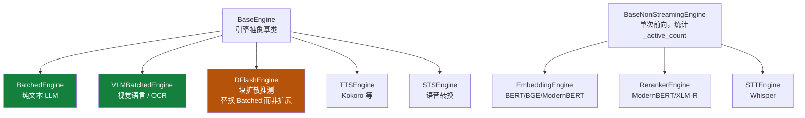
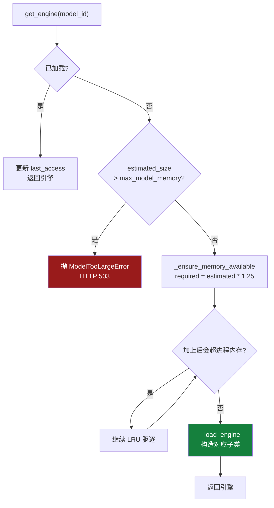
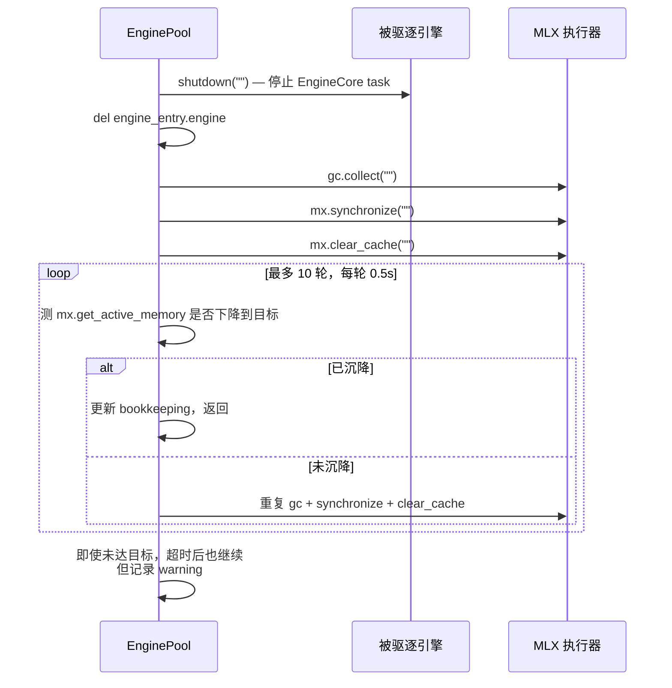
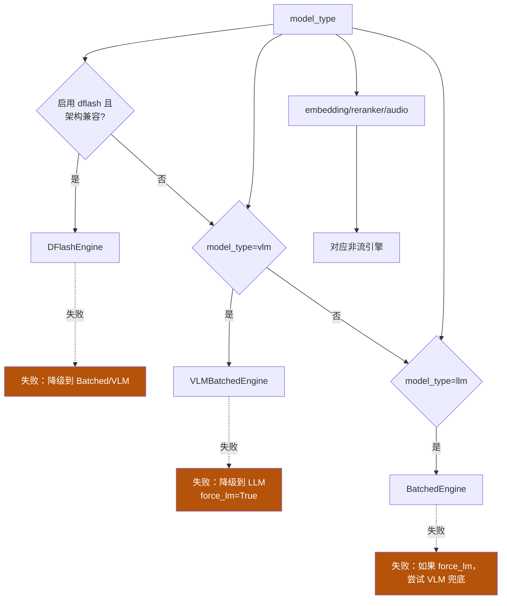
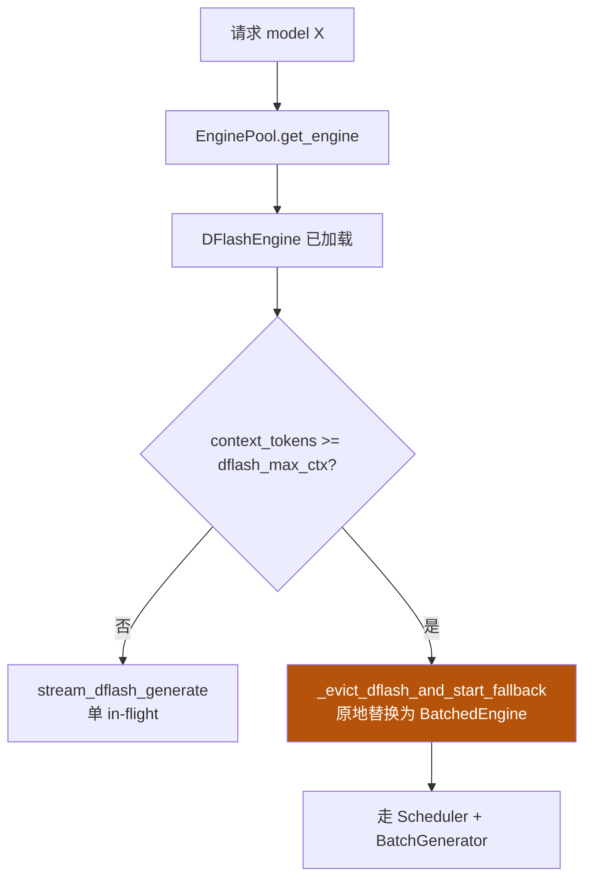

<details>
<summary>相关源文件</summary>

生成本页时使用的主要源文件：

- [omlx/engine_pool.py](../../../project-repos/omlx/omlx/engine_pool.py)
- [omlx/engine_core.py](../../../project-repos/omlx/omlx/engine_core.py)
- [omlx/engine/base.py](../../../project-repos/omlx/omlx/engine/base.py)
- [omlx/engine/batched.py](../../../project-repos/omlx/omlx/engine/batched.py)
- [omlx/engine/vlm.py](../../../project-repos/omlx/omlx/engine/vlm.py)
- [omlx/engine/dflash.py](../../../project-repos/omlx/omlx/engine/dflash.py)
- [omlx/engine/embedding.py](../../../project-repos/omlx/omlx/engine/embedding.py)
- [omlx/engine/reranker.py](../../../project-repos/omlx/omlx/engine/reranker.py)
- [omlx/engine/tts.py](../../../project-repos/omlx/omlx/engine/tts.py)
- [omlx/engine/stt.py](../../../project-repos/omlx/omlx/engine/stt.py)
- [omlx/engine/sts.py](../../../project-repos/omlx/omlx/engine/sts.py)

</details>

# 引擎系统与多模型

oMLX 不是"一个推理引擎"，而是"7 种模态对应 7 个引擎子类，统一在一个 `EnginePool` 之下被生命周期管理"。这种分类不是为了好看——每个引擎处理的输入形状、cache 类型、缓存策略、推测路径都不一样。让它们共享同一个抽象基类（`BaseEngine`）反而会污染基类。oMLX 的选择是：**最小公共接口 + 大量类型分支调用**。

本页解释引擎家族的层次、`EnginePool` 如何调度它们、加载/驱逐时的内存账单怎么算。

## 引擎家族全景

7 个具体引擎在 `omlx/engine/` 下：



每个引擎都通过 `loop.run_in_executor(get_mlx_executor(), ...)` 把模型加载和推理派发到**全局唯一**的 MLX 执行器线程。这意味着即使三个引擎并存，它们的 GPU 时间也是顺序切片——不是真正并行。

下表给出每种引擎的关键特征：

| 引擎 | 后端 | 流式 | 用 Scheduler | 推测 |
|---|---|---|---|---|
| `BatchedEngine` | mlx-lm + Scheduler | 是 | 是 | SpecPrefill / mlx-lm MTP |
| `VLMBatchedEngine` | mlx-vlm + Scheduler | 是 | 是 | VLM-MTP |
| `DFlashEngine` | dflash-mlx 自带 generate loop | 是 | **否**（自管理） | 内建 |
| `EmbeddingEngine` | mlx-embeddings | 否 | 否 | 否 |
| `RerankerEngine` | mlx-embeddings | 否 | 否 | 否 |
| `TTSEngine` | mlx-audio (Kokoro 等) | 部分（PCM chunk） | 否 | 否 |
| `STTEngine` | mlx-audio (Whisper) | 否 | 否 | 否 |
| `STSEngine` | mlx-audio | 否 | 否 | 否 |

注意 `DFlashEngine` 不用 `Scheduler`——dflash-mlx 自己实现了 prefix cache + verify + drafter 整套连续生成，oMLX 只在引擎层包装它。这就是为什么 dflash 路径要"替换"BatchedEngine 而非"扩展"。

Sources: [omlx/engine/base.py:252-361](../../../project-repos/omlx/omlx/engine/base.py#L252-L361), [omlx/engine/dflash.py:68-565](../../../project-repos/omlx/omlx/engine/dflash.py#L68-L565)

<details class="source-snippets">
<summary>引用源码</summary>

<!-- source-snippets:start -->

#### `omlx/engine/base.py:252-361`

```python
class BaseNonStreamingEngine(ABC):
    """Base class for non-streaming engines (embedding, reranker).

    These engines compute outputs in a single forward pass and don't
    support streaming or chat completion interfaces.
    """

    def __init__(self):
        self._active_count = 0
        self._active_lock = threading.Lock()
        self._activities: Dict[str, Dict[str, Any]] = {}

    def has_active_requests(self) -> bool:
        """Check if the engine has active in-flight requests."""
        with self._active_lock:
            return self._active_count > 0

    _ACTIVITY_RESERVED_KEYS = {
        "request_id",
        "kind",
        "detail",
        "started_at",
        "last_activity_at",
        "total_items",
    }

    def _sanitize_activity_metadata(
        self, metadata: Dict[str, Any] | None
    ) -> Dict[str, Any]:
        """Drop reserved activity keys from caller-provided metadata.

        Timing keys are owned by the tracker: _begin_activity sets them and
        _update_activity always advances last_activity_at to "now".
        """
        if not metadata:
            return {}
        return {
            key: value
            for key, value in metadata.items()
            if key not in self._ACTIVITY_RESERVED_KEYS
        }

    def _begin_activity(
        self,
        kind: str,
        detail: str | None = None,
        total_items: int | None = None,
        metadata: Dict[str, Any] | None = None,
    ) -> str:
        """Track a non-streaming operation for admin visibility."""
        activity_id = str(uuid.uuid4())
        now = time.monotonic()
        with self._active_lock:
            self._active_count += 1
            activity = {
                "request_id": activity_id,
                "kind": kind,
                "detail": detail or kind,
                "started_at": now,
                "last_activity_at": now,
                "total_items": total_items,
            }
            activity.update(self._sanitize_activity_metadata(metadata))
            self._activities[activity_id] = activity
        return activity_id

    def _update_activity(self, activity_id: str, **updates: Any) -> None:
        """Update tracked non-streaming operation metadata."""
        with self._active_lock:
            activity = self._activities.get(activity_id)
            if activity is None:
                return
            activity.update(self._sanitize_activity_metadata(updates))
            activity["last_activity_at"] = time.monotonic()

    def _end_activity(self, activity_id: str) -> bool:
        """End an activity and return True if cache should be cleared."""
        with self._active_lock:
            removed = self._activities.pop(activity_id, None)
            if removed is None:
                raise RuntimeError(
                    f"Activity {activity_id} ended more than once or was never started"
                )
            self._active_count -= 1
            if self._active_count < 0:
                raise RuntimeError("Active request count became negative")
            return self._active_count == 0

    def get_activity_snapshot(self) -> Dict[str, Any]:
        """Return active non-streaming operations for admin display."""
        now = time.monotonic()
        with self._active_lock:
            activities = []
            for activity in self._activities.values():
                item = dict(activity)
                started_at = item.pop("started_at", None)
                last_activity_at = item.pop("last_activity_at", None)
                item["elapsed_seconds"] = (
                    max(0.0, now - started_at) if started_at is not None else None
                )
                item["last_activity_age_seconds"] = (
                    max(0.0, now - last_activity_at)
                    if last_activity_at is not None
                    else None
                )
                activities.append(item)
            return {
                "active_requests": self._active_count,
                "activities": activities,
            }
```

#### `omlx/engine/dflash.py:68-565`

```python
class DFlashEngine(BaseEngine):
    """
    DFlash speculative decoding engine with optional batched fallback.

    For prompts within ``model_settings.dflash_max_ctx`` (or always, when the
    threshold is None), uses block diffusion speculative decoding for 3-4x
    faster generation. When the threshold is exceeded, evicts dflash models
    from memory and delegates to a fallback engine (BatchedEngine or
    VLMBatchedEngine) that provides paged cache, SSD cache, and continuous
    batching.
    """

    def __init__(
        self,
        model_name: str,
        draft_model_path: str,
        draft_quant_enabled: bool | None = None,
        draft_quant_weight_bits: int | None = None,
        draft_quant_activation_bits: int | None = None,
        draft_quant_group_size: int | None = None,
        model_settings: Any | None = None,
        fallback_engine_type: str = "batched",
        scheduler_config: Any | None = None,
        omlx_ssd_cache_dir: str | Path | None = None,
    ):
        self._model_name = model_name
        self._draft_model_path = draft_model_path
        self._draft_quant_enabled = draft_quant_enabled
        self._draft_quant_weight_bits = draft_quant_weight_bits
        self._draft_quant_activation_bits = draft_quant_activation_bits
        self._draft_quant_group_size = draft_quant_group_size
        self._model_settings = model_settings
        self._fallback_engine_type = fallback_engine_type
        self._scheduler_config = scheduler_config
        self._omlx_ssd_cache_dir = (
            Path(omlx_ssd_cache_dir) if omlx_ssd_cache_dir else None
        )

        self._target_model = None
        self._target_ops = None
        self._draft_model = None
        self._draft_backend = None
        self._tokenizer_obj = None
        self._executor_tokenizer = None
        self._loaded = False
        self._active_request = False
        self._model_type_str = None
        self._fallback_engine: BaseEngine | None = None
        self._in_fallback_mode = False
        self._runtime_context: Any | None = None
        self._dflash_prefix_cache: Any | None = None
        # Protocol-specific output parser factory (gemma4 / harmony).
        # Detected once in start() after the target model is loaded; None means
        # the streaming detokenizer is used as-is (qwen, llama, etc.).
        self._output_parser_factory: Any | None = None

        self._max_dflash_ctx = (
            getattr(model_settings, "dflash_max_ctx", None) if model_settings else None
        )
        self._in_memory_cache_enabled = (
            bool(getattr(model_settings, "dflash_in_memory_cache", True))
            if model_settings
            else True
        )
        self._in_memory_cache_max_entries = int(
            getattr(model_settings, "dflash_in_memory_cache_max_entries", 4)
            if model_settings
            else 4
        )
        self._in_memory_cache_max_bytes = int(
            getattr(model_settings, "dflash_in_memory_cache_max_bytes", 8 * 1024**3)
            if model_settings
            else 8 * 1024**3
        )
        self._ssd_cache_requested = (
            bool(getattr(model_settings, "dflash_ssd_cache", False))
            if model_settings
            else False
        )
        self._ssd_cache_max_bytes = int(
            getattr(model_settings, "dflash_ssd_cache_max_bytes", 20 * 1024**3)
            if model_settings
            else 20 * 1024**3
        )
        # None → let dflash-mlx pick its own default (window=1024, sink=64, verify="adaptive").
        # `getattr` returns None for missing attrs so older settings files keep working.
        self._draft_window_size = (
            getattr(model_settings, "dflash_draft_window_size", None)
            if model_settings
            else None
        )
        self._draft_sink_size = (
            getattr(model_settings, "dflash_draft_sink_size", None)
            if model_settings
            else None
        )
        self._verify_mode = (
            getattr(model_settings, "dflash_verify_mode", None)
            if model_settings
            else None
        )

    @property
    def model_name(self) -> str:
        return self._model_name

    @property
    def tokenizer(self) -> Any:
        return self._tokenizer_obj

    @property
    def model_type(self) -> str | None:
        return self._model_type_str

    @staticmethod
    def _build_quant_spec(
        weight_bits: int | None,
        activation_bits: int | None,
        group_size: int | None,
    ) -> str:
... snippet truncated ...
```

<!-- source-snippets:end -->
</details>

## EnginePool：多模型门面

`EnginePool` 是 server.py 的核心组件之一。它管理：

- 每个模型的 `EngineEntry`：包含引擎实例、`estimated_size`（字节）、`last_access`（时间戳）、`is_pinned`（用户标记常驻）
- LRU 驱逐策略
- TTL 自动卸载
- 进程内存防护与协作

请求路由的唯一入口是 `get_engine(model_id)`（[engine_pool.py:300](../../../project-repos/omlx/omlx/engine_pool.py#L300)）：



`_ensure_memory_available`（[engine_pool.py:354-378](../../../project-repos/omlx/omlx/engine_pool.py#L354-L378)）的 25% 头空间是关键——它预留 KV cache 增长空间，否则模型刚好塞下、KV 一长就 OOM。

`_find_lru_victim`（[engine_pool.py:449-475](../../../project-repos/omlx/omlx/engine_pool.py#L449-L475)）的两条排除规则：
1. **跳过 `is_pinned=True`**：用户在 admin UI 钉住的模型不会被自动驱逐
2. **跳过 `has_active_requests()`**：当前有 in-flight 请求的引擎不驱逐——即使它是最久未访问的

这意味着即使 LRU "选中" 的模型可能因为这些规则被跳过，找不到可驱逐目标时 `get_engine` 会**等待**而非强 abort。这是 oMLX 不杀 in-flight 请求哲学的延续。

Sources: [omlx/engine_pool.py:300-475](../../../project-repos/omlx/omlx/engine_pool.py#L300-L475)

<details class="source-snippets">
<summary>引用源码</summary>

<!-- source-snippets:start -->

#### `omlx/engine_pool.py:300-475`

```python
    async def get_engine(
        self, model_id: str, force_lm: bool = False,
    ) -> BaseEngine | EmbeddingEngine | RerankerEngine | STTEngine | STSEngine | TTSEngine:
        """
        Get or load engine for the specified model.

        This method implements pre-load memory checking:
        1. Check if model is already loaded → return immediately
        2. Check if model is too large for memory limit → raise error
        3. Evict LRU models until there's enough space
        4. Load the model
        5. Return the engine

        Args:
            model_id: The model ID to get engine for
            force_lm: Force loading as LM (BatchedEngine) even for VLM models.
                Useful for text-only tasks like accuracy benchmarks.

        Returns:
            The loaded engine (BaseEngine for LLM, EmbeddingEngine for embeddings)

        Raises:
            ModelNotFoundError: If model is not discovered
            ModelTooLargeError: If model exceeds memory limit
            InsufficientMemoryError: If can't free enough memory (all pinned)
            ModelLoadingError: If model is already being loaded
        """
        async with self._lock:
            entry = self._entries.get(model_id)
            if not entry:
                raise ModelNotFoundError(model_id, list(self._entries.keys()))

            # Already loaded - just update access time
            if entry.engine is not None:
                # If force_lm requested but current engine is VLM, unload and reload
                if force_lm and isinstance(entry.engine, VLMBatchedEngine):
                    logger.info(
                        f"Unloading VLM engine for {model_id} "
                        f"(force_lm=True, reloading as LM)"
                    )
                    await self._unload_engine(model_id)
                else:
                    entry.last_access = time.time()
                    return entry.engine

            # Check if model is too large for memory limit
            if (
                self._max_model_memory is not None
                and entry.estimated_size > self._max_model_memory
            ):
                raise ModelTooLargeError(
                    model_id, entry.estimated_size, self._max_model_memory
                )

            # Pre-load eviction: reserve 25% extra for KV cache headroom
            # so other models get evicted earlier, leaving room for context.
            # Always try to evict with headroom first. If all evictable models
            # are gone and the model still fits without headroom, allow it.
            # Skip entirely when model memory limit is disabled (None).
            # Audio engines (STT/TTS) don't use KV cache, so headroom is 0.
            if self._max_model_memory is not None:
                if entry.engine_type in ("audio_stt", "audio_tts", "audio_sts"):
                    kv_headroom = 0
                else:
                    kv_headroom = int(entry.estimated_size * 0.25)
                required_with_headroom = entry.estimated_size + kv_headroom
                try:
                    await self._ensure_memory_available(required_with_headroom)
                except InsufficientMemoryError:
                    # Can't fit with headroom even after evicting everything possible.
                    # Fall back to weights-only if that fits.
                    if self._current_model_memory + entry.estimated_size <= self._max_model_memory:
                        logger.info(
                            f"Loading {model_id} without KV headroom "
                            f"(need {format_size(required_with_headroom)}, "
                            f"available {format_size(self._max_model_memory - self._current_model_memory)})"
                        )
                    else:
                        await self._ensure_memory_available(entry.estimated_size)

            # Check process memory limit before loading.
            # Try evicting LRU models first to free actual Metal memory.
            # max_bytes <= 0 means enforcement is disabled (no limit).
            # max(active, phys_footprint) matches what jetsam sees and what
            # ProcessMemoryEnforcer uses, so load decisions are consistent.
            if self._process_memory_enforcer is not None:
                enforcer = self._process_memory_enforcer
                if enforcer.max_bytes > 0:
                    while True:
                        current = max(mx.get_active_memory(), get_phys_footprint())
                        projected = current + entry.estimated_size
                        if projected <= enforcer.max_bytes:
                            break
                        # Try to evict an LRU model to free memory
                        victim = self._find_lru_victim()
                        if victim is not None:
                            logger.info(
                                f"Evicting '{victim}' to fit '{model_id}' "
                                f"within process memory limit "
                                f"({format_size(projected)} > "
                                f"{format_size(enforcer.max_bytes)})"
                            )
                            await self._unload_engine(victim)
                            continue
                        # No more victims — cannot fit
                        raise InsufficientMemoryError(
                            required=entry.estimated_size,
                            current=current,
                            message=(
                                f"Cannot load {model_id}: projected memory "
                                f"{format_size(projected)} would exceed process "
                                f"limit {format_size(enforcer.max_bytes)} "
                                f"(current: {format_size(current)}, "
                                f"model: {format_size(entry.estimated_size)})"
                            ),
                        )

            # Now load the model
            await self._load_engine(model_id, force_lm=force_lm)

... snippet truncated ...
```

<!-- source-snippets:end -->
</details>

## 卸载的"内存沉降屏障"

卸载一个引擎不只是 `engine = None`。Metal buffer 池的释放是异步的——Python 引用为 0 不等于 GPU 内存马上回收。`_unload_engine`（[engine_pool.py:516-582](../../../project-repos/omlx/omlx/engine_pool.py#L516-L582)）专门解决这个问题：



成功标准：实际释放 ≥ `estimated_size − max(2GB, 5%)`（[engine_pool.py:565+](../../../project-repos/omlx/omlx/engine_pool.py#L565)）。低于这个就只更新内部 bookkeeping 但发警告。这种"接近成功也认为成功"的容忍度是必要的——Metal 内部碎片会让最终释放略小于 estimated。

Sources: [omlx/engine_pool.py:516-582](../../../project-repos/omlx/omlx/engine_pool.py#L516-L582)

<details class="source-snippets">
<summary>引用源码</summary>

<!-- source-snippets:start -->

#### `omlx/engine_pool.py:516-582`

```python
        # Memory settle barrier: poll actual freed memory instead of
        # trusting the cumulative _current_model_memory estimate.
        # Scale tolerance with model size: estimated_size includes a 5%
        # overhead factor (model_discovery.py) that may not be reflected in
        # actual freed memory. Use 2 GB floor for small models. See #768.
        settle_tolerance = max(2 * 1024**3, int(entry.estimated_size * 0.05))
        min_expected_freed = max(0, entry.estimated_size - settle_tolerance)
        settled = False
        for _settle_round in range(10):
            active_now = mx.get_active_memory()
            actual_freed = pre_unload_active - active_now
            if actual_freed >= min_expected_freed:
                settled = True
                logger.debug(
                    f"Settle round {_settle_round + 1} for '{model_id}': "
                    f"freed={format_size(actual_freed)} "
                    f"(need>={format_size(min_expected_freed)}) - settled"
                )
                break
            logger.debug(
                f"Settle round {_settle_round + 1} for '{model_id}': "
                f"freed={format_size(actual_freed)} "
                f"(need>={format_size(min_expected_freed)}) - retry"
            )
            await asyncio.sleep(0.5)
            gc.collect()
            await loop.run_in_executor(
                get_mlx_executor(), lambda: (mx.synchronize(), mx.clear_cache())
            )

        # Release memory tracking AFTER barrier
        self._current_model_memory -= entry.estimated_size

        if settled:
            logger.info(
                f"Unloaded model: {model_id}, "
                f"freed={format_size(actual_freed)} "
                f"(expected>={format_size(min_expected_freed)}), "
                f"active_memory: {format_size(active_now)} (settled)"
            )
        else:
            # Barrier timed out - try emergency reclaim
            logger.warning(
                f"Settle barrier timed out for '{model_id}': "
                f"freed={format_size(actual_freed)} "
                f"(need>={format_size(min_expected_freed)})"
            )
            for _ in range(3):
                gc.collect()
                await loop.run_in_executor(
                    get_mlx_executor(),
                    lambda: (mx.synchronize(), mx.clear_cache()),
                )
                await asyncio.sleep(1.0)
            active_after = mx.get_active_memory()
            if active_after > self._current_model_memory + 5 * 1024**3:
                logger.error(
                    f"Emergency reclaim failed for '{model_id}': "
                    f"active_memory={format_size(active_after)} "
                    f"exceeds safe threshold "
                    f"({format_size(self._current_model_memory + 5 * 1024**3)})"
                )
            else:
                logger.info(
                    f"Emergency reclaim succeeded: "
                    f"active_memory={format_size(active_after)}"
                )
```

<!-- source-snippets:end -->
</details>

## 加载的多级降级链

oMLX 接受用户给一个模型路径但不要求他指定模型类型。`_load_engine`（[engine_pool.py:706-800](../../../project-repos/omlx/omlx/engine_pool.py#L706-L800)）会：

1. 先用 `detect_model_type()` 判定类型（详见 [模型管理与 Admin Dashboard](model-management.md)）
2. 按类型实例化对应引擎
3. **加载失败时降级**

降级链：



降级的真实用例：

- 一个被标记为 VLM 的模型 sanitize 后视觉权重丢了（unsloth 的 8bit 文本-only quant 包），自动回落到 LLM 加载——用户的请求不再因为视觉路径报错。
- 一个 VLM 模型上下文超过 dflash 阈值时，`_evict_dflash_and_start_fallback`（[engine/dflash.py:329](../../../project-repos/omlx/omlx/engine/dflash.py#L329)）在原地把 dflash 引擎换成 `VLMBatchedEngine`，保持 model_id 不变——用户感受不到。

Sources: [omlx/engine_pool.py:706-800](../../../project-repos/omlx/omlx/engine_pool.py#L706-L800), [omlx/engine/dflash.py:329-565](../../../project-repos/omlx/omlx/engine/dflash.py#L329-L565)

<details class="source-snippets">
<summary>引用源码</summary>

<!-- source-snippets:start -->

#### `omlx/engine_pool.py:706-800`

```python
            _is_dflash_engine = engine is not None and type(engine).__name__ == "DFlashEngine"

            try:
                await engine.start()
            except Exception as start_error:
                if _is_dflash_engine:
                    # DFlash engine failed to start — fall back to the
                    # model's natural engine type (VLM or Batched)
                    logger.warning(
                        f"DFlash start failed for {model_id}: {start_error}. "
                        f"Falling back to {effective_type} engine."
                    )
                    try:
                        await engine.stop()
                    except Exception:
                        pass
                    gc.collect()
                    loop = asyncio.get_running_loop()
                    await loop.run_in_executor(
                        get_mlx_executor(),
                        lambda: (mx.synchronize(), mx.clear_cache()),
                    )

                    if effective_type == "vlm":
                        engine = VLMBatchedEngine(
                            model_name=entry.model_path,
                            trust_remote_code=trc,
                            scheduler_config=self._scheduler_config,
                            model_settings=model_settings,
                        )
                    else:
                        engine = BatchedEngine(
                            model_name=entry.model_path,
                            trust_remote_code=trc,
                            scheduler_config=self._scheduler_config,
                            model_settings=model_settings,
                        )
                    try:
                        await engine.start()
                    except Exception as fallback_error:
                        raise RuntimeError(
                            f"DFlash load failed: {start_error}; "
                            f"{effective_type} fallback also failed: {fallback_error}"
                        ) from start_error
                    logger.info(
                        f"Successfully loaded {model_id} as {effective_type} "
                        f"(fallback from DFlash)"
                    )

                elif force_lm and entry.engine_type == "vlm":
                    # force_lm created a BatchedEngine but mlx-lm can't
                    # load this VLM model — fall back to VLMBatchedEngine.
                    logger.warning(
                        f"LM loading failed for VLM model {model_id} "
                        f"(force_lm=True), falling back to VLM engine: "
                        f"{start_error}"
                    )
                    try:
                        await engine.stop()
                    except Exception:
                        pass
                    gc.collect()
                    loop = asyncio.get_running_loop()
                    await loop.run_in_executor(
                        get_mlx_executor(),
                        lambda: (mx.synchronize(), mx.clear_cache()),
                    )

                    engine = VLMBatchedEngine(
                        model_name=entry.model_path,
                        trust_remote_code=trc,
                        scheduler_config=self._scheduler_config,
                        model_settings=model_settings,
                    )
                    try:
                        await engine.start()
                    except Exception as fallback_error:
                        raise RuntimeError(
                            f"LM load failed (force_lm=True): {start_error}; "
                            f"VLM fallback also failed: {fallback_error}"
                        ) from start_error

                    logger.info(
                        f"Successfully loaded {model_id} as VLM "
                        f"(fallback from force_lm)"
                    )
                elif entry.engine_type == "vlm":
                    # VLM loading failed — fall back to LLM (BatchedEngine)
                    logger.warning(
                        f"VLM loading failed for {model_id}, "
                        f"falling back to LLM: {start_error}"
                    )
                    try:
                        await engine.stop()
                    except Exception:
```

#### `omlx/engine/dflash.py:329-565`

```python
    async def _evict_dflash_and_start_fallback(self) -> None:
        """Evict dflash models from memory, verify release, then start fallback engine."""
        from dflash_mlx.cache.manager import shutdown_runtime_cache_manager

        from ..engine_core import get_mlx_executor

        loop = asyncio.get_running_loop()
        pre_active = mx.get_active_memory()

        # Release dflash model and cache references
        shutdown_runtime_cache_manager()
        self._dflash_prefix_cache = None
        self._runtime_context = None
        self._target_model = None
        self._target_ops = None
        self._draft_model = None
        self._draft_backend = None
        self._executor_tokenizer = None
        self._output_parser_factory = None

        # Force memory reclaim with settle barrier
        gc.collect()
        await loop.run_in_executor(
            get_mlx_executor(),
            lambda: (mx.synchronize(), mx.clear_cache()),
        )

        # Poll for actual memory release (same pattern as engine_pool._unload_engine)
        for settle_round in range(10):
            active_now = mx.get_active_memory()
            freed = pre_active - active_now
            if freed > 0:
                logger.info(
                    f"DFlash models evicted: freed={freed / 1024**3:.2f}GB "
                    f"(round {settle_round + 1})"
                )
                break
            await asyncio.sleep(0.5)
            gc.collect()
            await loop.run_in_executor(
                get_mlx_executor(),
                lambda: (mx.synchronize(), mx.clear_cache()),
            )
        else:
            logger.warning("DFlash model eviction: memory settle timed out")

        # Start fallback engine
        if self._fallback_engine_type == "vlm":
            from .vlm import VLMBatchedEngine
            self._fallback_engine = VLMBatchedEngine(
                model_name=self._model_name,
                scheduler_config=self._scheduler_config,
                model_settings=self._model_settings,
            )
        else:
            from .batched import BatchedEngine
            self._fallback_engine = BatchedEngine(
                model_name=self._model_name,
                scheduler_config=self._scheduler_config,
                model_settings=self._model_settings,
            )
        await self._fallback_engine.start()
        self._in_fallback_mode = True
        logger.info(
            f"DFlash fallback engine started: {self._fallback_engine_type}"
        )

    async def stop(self) -> None:
        from dflash_mlx.cache.manager import shutdown_runtime_cache_manager

        if self._fallback_engine is not None:
            await self._fallback_engine.stop()
            self._fallback_engine = None
        try:
            shutdown_runtime_cache_manager()
        except Exception as exc:
            logger.debug(f"shutdown_runtime_cache_manager: {exc}")
        self._dflash_prefix_cache = None
        self._runtime_context = None
        self._target_model = None
        self._target_ops = None
        self._draft_model = None
        self._draft_backend = None
        self._tokenizer_obj = None
        self._executor_tokenizer = None
        self._output_parser_factory = None
        self._in_fallback_mode = False
        self._loaded = False
        logger.info("DFlashEngine stopped")

    def _apply_chat_template(
        self,
        messages: list[dict[str, Any]],
        tools: list[dict] | None = None,
        chat_template_kwargs: dict[str, Any] | None = None,
        is_partial: bool | None = None,
    ) -> str:
        """Apply chat template to messages.

        Args:
            messages: List of chat messages
            tools: Optional tool definitions
            chat_template_kwargs: Optional kwargs for the chat template
                (e.g. enable_thinking, reasoning_effort).
            is_partial: Explicit partial-mode signal from the API server.
                ``True``/``False`` — server has already decided; the ``partial``
                key is cleaned from message dicts but no detection is performed.
                ``None`` (default) — auto-detect from messages for backward
                compatibility with direct engine callers.
        """
        if hasattr(self._tokenizer_obj, "apply_chat_template"):
            if is_partial is None:
                is_partial = detect_and_strip_partial(messages)
            else:
                # Server already resolved partial; just clean residual keys
                # so the chat template never sees the non-standard field.
                for msg in messages:
                    msg.pop("partial", None)
            template_kwargs = {
                "tokenize": False,
... snippet truncated ...
```

<!-- source-snippets:end -->
</details>

## TTL 自动卸载

每个 `ModelSettings` 可以配 `idle_timeout`（秒）。`EnginePool.check_ttl_expirations`（[engine_pool.py:1012](../../../project-repos/omlx/omlx/engine_pool.py#L1012)）在后台定期跑：

```python
for entry in entries:
    if entry.has_active_requests():
        entry.last_access = now()  # 有活继续就刷新
        continue
    if entry.is_pinned: continue
    if (now() - entry.last_access) > entry.idle_timeout:
        unload(entry)
```

关键细节：`has_active_requests()` **会刷新 `last_access`**。这避免长时间运行的请求被错误判定为 idle。

用途：白天 pin 一个 4B 编辑模型 + 一个 30B 复杂任务模型，TTL = 600s。等夜里没人用了，30B 自动卸载留出内存给后台任务。早上回来 30B 重新加载——KV cache 跨重启复用，秒级 prefill。

Sources: [omlx/engine_pool.py:1012-1080](../../../project-repos/omlx/omlx/engine_pool.py#L1012-L1080)

<details class="source-snippets">
<summary>引用源码</summary>

<!-- source-snippets:start -->

#### `omlx/engine_pool.py:1012-1080`

```python
    async def check_ttl_expirations(
        self,
        settings_manager: ModelSettingsManager,
        global_idle_timeout_seconds: int | None = None,
    ) -> list[str]:
        """Check and unload models that have exceeded their TTL.

        Pinned models are skipped (TTL is ignored for pinned models).
        Models with active requests are skipped and their last_access is refreshed.
        Suppressed during benchmark runs via _suppress_ttl flag.

        Args:
            settings_manager: The settings manager to read TTL values from.
            global_idle_timeout_seconds: Global idle timeout fallback (None = no global TTL).

        Returns:
            List of model IDs that were unloaded.
        """
        if self._suppress_ttl:
            return []

        now = time.time()
        expired: list[str] = []

        async with self._lock:
            for model_id, entry in self._entries.items():
                if entry.engine is None or entry.is_loading or entry.is_pinned:
                    continue

                settings = settings_manager.get_settings(model_id)
                effective_ttl = settings.ttl_seconds
                if effective_ttl is None:
                    effective_ttl = global_idle_timeout_seconds
                if effective_ttl is None:
                    continue

                idle_time = now - entry.last_access
                if idle_time < effective_ttl:
                    continue

                # Check if model has active requests
                has_active = entry.engine.has_active_requests()

                if has_active:
                    entry.last_access = now
                    continue

                logger.info(
                    f"TTL expired for model '{model_id}' "
                    f"(idle {idle_time:.0f}s > ttl {effective_ttl}s)"
                )
                await self._unload_engine(model_id)
                expired.append(model_id)

        return expired
```

<!-- source-snippets:end -->
</details>

## BatchedEngine：LLM 默认路径

`BatchedEngine`（[engine/batched.py](../../../project-repos/omlx/omlx/engine/batched.py)）是文本 LLM 的标准实现。它的核心是包装一个 `AsyncEngineCore`，把 `chat()` / `stream_chat()` / `generate()` 等高层 API 转换为 `Request` 对象交给 EngineCore。

引擎初始化（简化版）：

```python
def __init__(self, model_path, scheduler_config, ...):
    self.model, self.tokenizer = mlx_lm.load(model_path)
    self.scheduler = Scheduler(model=self.model, tokenizer=self.tokenizer, config=scheduler_config)
    self.engine_core = AsyncEngineCore(scheduler=self.scheduler)
```

`stream_chat` 会构造一个 `Request` 包含 sampling params、tools、reasoning_parser，调用 `engine_core.add_request()` 并返回 async generator 持续 yield `RequestOutput`——上层包装成 SSE chunk。

每个 BatchedEngine 实例有自己的 Scheduler 和自己的分层 KV cache stack（通过 `CacheFactory.create_full_cache_stack`），互不干扰。这就是为什么多模型可以共享同一个 SSD 目录但不会污染——hash 里有 `model_name`。

Sources: [omlx/engine/batched.py](../../../project-repos/omlx/omlx/engine/batched.py)

<details class="source-snippets">
<summary>引用源码</summary>

<!-- source-snippets:start -->

#### `omlx/engine/batched.py`

```python
# SPDX-License-Identifier: Apache-2.0
"""
Batched engine for continuous batching with multiple concurrent users.

This engine wraps AsyncEngineCore to provide continuous batching
for better throughput when serving multiple concurrent requests.
"""

import copy
import logging
from collections.abc import AsyncIterator
from typing import Any

from ..api.tool_calling import convert_tools_for_template
from ..api.utils import clean_special_tokens, detect_and_strip_partial
from ..utils.tokenizer import get_tokenizer_config
from .base import BaseEngine, GenerationOutput

logger = logging.getLogger(__name__)


# Optional Harmony adapter import
try:
    from ..adapter.harmony import preprocess_harmony_messages

    HAS_HARMONY_ADAPTER = True
except ImportError:
    HAS_HARMONY_ADAPTER = False
    preprocess_harmony_messages = None  # type: ignore


class BatchedEngine(BaseEngine):
    """
    Batched engine for continuous batching.

    This engine provides better throughput when serving multiple
    concurrent users by batching requests together.
    """

    def __init__(
        self,
        model_name: str,
        trust_remote_code: bool = False,
        scheduler_config: Any | None = None,
        stream_interval: int = 1,
        enable_thinking: bool | None = None,
        model_settings: Any | None = None,
    ):
        """
        Initialize the batched engine.

        Args:
            model_name: HuggingFace model name or local path
            trust_remote_code: Whether to trust remote code
            scheduler_config: Optional scheduler configuration
            stream_interval: Tokens to batch before streaming (1=every token)
            enable_thinking: Enable thinking mode for reasoning models (passed to chat_template_kwargs)
            model_settings: Optional per-model settings for post-load transforms
        """
        self._model_name = model_name
        self._trust_remote_code = trust_remote_code
        self._scheduler_config = scheduler_config
        self._stream_interval = stream_interval
        self._enable_thinking = enable_thinking
        self._model_settings = model_settings

        self._model = None
        self._tokenizer = None
        self._engine = None
        self._loaded = False
        self._grammar_compiler = None
        self._grammar_compiler_init_attempted = False

    @property
    def model_name(self) -> str:
        """Get the model name."""
        return self._model_name

    @property
    def tokenizer(self) -> Any:
        """Get the tokenizer."""
        return self._tokenizer

    @property
    def model_type(self) -> str | None:
        """Get the model type from config (e.g., 'gpt_oss', 'llama', 'qwen2')."""
        if self._model is None:
            return None
        # Try different ways to access model_type
        try:
            if hasattr(self._model, "config"):
                config = self._model.config
                if hasattr(config, "model_type"):
                    model_type = config.model_type
                    return model_type if isinstance(model_type, str) else None
                elif isinstance(config, dict):
                    model_type = config.get("model_type")
                    return model_type if isinstance(model_type, str) else None
            if hasattr(self._model, "args"):
                args = self._model.args
                if hasattr(args, "model_type"):
                    model_type = args.model_type
                    return model_type if isinstance(model_type, str) else None
        except Exception as e:
            logger.debug(f"Error getting model_type: {e}")
        return None

    @property
    def message_extractor(self):
        """Return the model-specific message extractor function, or ``None``.

        ``None`` means the server should use its default extractor
        (``extract_text_content`` or ``extract_multimodal_content``).
        """
        try:
            from ..adapter.output_parser import detect_message_extractor

            model_config = None
            if self._model is not None and hasattr(self._model, "config"):
                cfg = self._model.config
```

<!-- source-snippets:end -->
</details>

## VLMBatchedEngine：在 BatchedEngine 上加多模态

`VLMBatchedEngine`（[engine/vlm.py](../../../project-repos/omlx/omlx/engine/vlm.py)）是 BatchedEngine 的多模态特化。差异：

- **加载用 mlx-vlm**：拉 mlx-vlm 的 `load` + `apply_chat_template`
- **额外 `VLMModelAdapter`**：包一层让 mlx-vlm 的模型在 Scheduler 的视角下行为像 mlx-lm 的模型
- **`VisionFeatureSSDCache`** ([engine/vlm.py:691-699](../../../project-repos/omlx/omlx/engine/vlm.py#L691-L699))：对同一张图的 vision tower 输出缓存到 SSD，跨请求复用
- **VLM-MTP drafter 支持** ([engine/vlm.py:811](../../../project-repos/omlx/omlx/engine/vlm.py#L811))：可启用 Qwen / Gemma 的 MTP 头作为 draft 模型

请求流程在 server.py 的 chat 路径有个判断（[server.py:2135-2153](../../../project-repos/omlx/omlx/server.py#L2135-L2153)）：

```python
is_vlm = isinstance(engine, VLMBatchedEngine)
if extractor := getattr(engine, "message_extractor", None):
    messages = extractor(request.messages, ...)
elif is_vlm:
    messages = extract_multimodal_content(...)
else:
    messages = extract_text_content(...)
```

VLM 的消息提取保留 `image_url` 部分，传递到 chat template 后由 mlx-vlm 的 processor 转成 tensor。`extract_text_content` 会过滤掉图像——错误模型 + 错误请求时不会崩，只是不看图。

Sources: [omlx/engine/vlm.py:691-811](../../../project-repos/omlx/omlx/engine/vlm.py#L691-L811), [omlx/server.py:2135-2153](../../../project-repos/omlx/omlx/server.py#L2135-L2153)

<details class="source-snippets">
<summary>引用源码</summary>

<!-- source-snippets:start -->

#### `omlx/engine/vlm.py:691-811`

```python
        vision_ssd_dir = None
        if self._scheduler_config and getattr(
            self._scheduler_config, "paged_ssd_cache_dir", None
        ):
            vision_ssd_dir = Path(self._scheduler_config.paged_ssd_cache_dir) / "vision_features"
        self._vision_cache = VisionFeatureSSDCache(
            cache_dir=vision_ssd_dir,
            max_memory_entries=20,
        )
        logger.info("Vision feature cache enabled (SSD: %s)", vision_ssd_dir or "disabled")

        # Extract tokenizer from processor with deep-copy for thread safety.
        # The processor keeps the original tokenizer for executor-thread work
        # (_prepare_vision_inputs / prepare_inputs), while this deep copy is
        # used exclusively on the event loop (apply_chat_template, encode).
        # Without separate Rust tokenizer backends, concurrent access causes
        # "RuntimeError: Already borrowed".
        # See: https://github.com/huggingface/tokenizers/issues/537
        if hasattr(self._processor, "tokenizer"):
            self._tokenizer = copy.deepcopy(self._processor.tokenizer)
        else:
            self._tokenizer = copy.deepcopy(self._processor)

        # Create VLM model adapter wrapping language_model.
        # mlx-vlm models now handle per-sequence mx.array offsets natively
        # and batched decode is fixed, so no separate mlx-lm decode model needed.
        self._adapter = VLMModelAdapter(self._vlm_model)

        # Patch mlx-vlm GatedDeltaNet to mirror mlx-lm fixes (cache.advance(S)
        # + mx.contiguous on cache[0]) that mlx-vlm e41cd25 still lacks.
        # Class-level monkey-patch — no-op when target classes are absent
        # or already fixed upstream.
        apply_gated_delta_advance_patch()
        # Patch mlx-vlm Qwen3_5Attention to use plain RoPE on text-only
        # inputs. Preserves mRoPE for genuine multimodal positions.
        apply_qwen3_5_attention_patch()

        # Create scheduler config
        scheduler_config = (
            copy.copy(self._scheduler_config) if self._scheduler_config
            else SchedulerConfig()
        )
        scheduler_config.model_name = self._model_name

        engine_config = EngineConfig(
            model_name=self._model_name,
            scheduler_config=scheduler_config,
            stream_interval=self._stream_interval,
        )

        # Create engine with adapter as the "model"
        # The adapter exposes .layers, .make_cache() for cache infrastructure
        self._engine = AsyncEngineCore(
            model=self._adapter,
            tokenizer=self._tokenizer,
            config=engine_config,
        )

        await self._engine.engine.start()

        # TurboQuant KV cache
        if self._model_settings is not None:
            tq_enabled = getattr(self._model_settings, "turboquant_kv_enabled", False)
            if tq_enabled:
                from ..patches.turboquant_attention import apply_turboquant_attention_patch
                apply_turboquant_attention_patch()
                tq_bits = float(getattr(self._model_settings, "turboquant_kv_bits", 4))
                self._engine.engine.scheduler._turboquant_kv_bits = tq_bits
                self._engine.engine.scheduler._turboquant_skip_last = getattr(
                    self._model_settings, "turboquant_skip_last", True
                )
                logger.info(f"TurboQuant KV cache enabled for VLM: {tq_bits} bits")

        # SpecPrefill: load draft model and pass to scheduler
        if self._model_settings is not None:
            specprefill_draft = getattr(self._model_settings, "specprefill_draft_model", None)
            specprefill_enabled = getattr(self._model_settings, "specprefill_enabled", False)
            if specprefill_enabled and specprefill_draft:
                try:
                    from mlx_lm import load as mlx_lm_load

                    from ..utils.model_loading import maybe_load_custom_quantization

                    def _load_draft():
                        from ..patches.mlx_lm_mtp import set_mtp_active

                        was_mtp = False
                        try:
                            from ..patches.mlx_lm_mtp import is_mtp_active

                            was_mtp = is_mtp_active()
                        except Exception:
                            pass
                        set_mtp_active(False)
                        try:
                            custom_loaded = maybe_load_custom_quantization(
                                specprefill_draft,
                                is_vlm=False,
                            )
                            if custom_loaded is not None:
                                draft_model, _ = custom_loaded
                                return draft_model
                            draft_model, _ = mlx_lm_load(specprefill_draft)
                            return draft_model
                        finally:
                            set_mtp_active(was_mtp)
                    draft_model = await loop.run_in_executor(get_mlx_executor(), _load_draft)
                    self._engine.engine.scheduler.set_specprefill_draft_model(
                        draft_model, draft_model_name=specprefill_draft
                    )
                    logger.info(f"SpecPrefill: draft model loaded ({specprefill_draft})")
                except Exception as e:
                    logger.error(f"SpecPrefill: draft model load failed: {e}")

        # Inject mlx-lm tool calling support into VLM tokenizer
        self._inject_tool_calling(self._tokenizer)

        self._loaded = True
        logger.info(f"VLMBatchedEngine loaded: {self._model_name}")

... snippet truncated ...
```

#### `omlx/server.py:2135-2153`

```python
    is_vlm = isinstance(engine, VLMBatchedEngine)
    extractor = getattr(engine, "message_extractor", None)
    if extractor is not None:
        messages = extractor(request.messages, max_tool_result_tokens, engine.tokenizer)
    elif is_vlm:
        # VLM: preserve image_url content parts for vision processing
        messages = extract_multimodal_content(
            request.messages,
            max_tool_result_tokens,
            engine.tokenizer,
            native_reasoning_content=native_reasoning,
        )
    else:
        messages = extract_text_content(
            request.messages,
            max_tool_result_tokens,
            engine.tokenizer,
            native_reasoning_content=native_reasoning,
        )
```

<!-- source-snippets:end -->
</details>

## DFlashEngine：替换式集成

`DFlashEngine`（[engine/dflash.py:68](../../../project-repos/omlx/omlx/engine/dflash.py#L68)）跟前两者最大的不同：**它不用 Scheduler**。

原因：dflash-mlx 自己实现了 prefix cache（L1 RAM + L2 SSD）、自己处理 draft + verify 循环、自己的 chunked prefill。oMLX 的 Scheduler 那套外部 prefill + paged-SSD 跟 dflash 的内置机制冲突。如果硬要把 dflash 套进 Scheduler，会出现"两个 cache 互相不知道对方存在"的混乱。

解决方案：DFlashEngine 直接调 dflash-mlx 的 `stream_dflash_generate` event iterator（[engine/dflash.py:565](../../../project-repos/omlx/omlx/engine/dflash.py#L565)），把它的事件流转换成 oMLX 的 `RequestOutput` 流。所有 GPU 操作仍然走 `loop.run_in_executor(get_mlx_executor(), ...)` 保证单线程序列化。

并发限制：dflash 跟连续批处理不兼容——单个 in-flight 请求。新请求来时排队。

上下文阈值降级：每个 DFlash 模型有 `dflash_max_ctx`（[engine/dflash.py](../../../project-repos/omlx/omlx/engine/dflash.py)）。当请求 + 历史 token 数超过这个值时，`_evict_dflash_and_start_fallback` 会**就地**把 dflash engine 卸了换成 `BatchedEngine`/`VLMBatchedEngine`，保持 `model_id` 不变。这是因为 dflash 在长上下文上效率劣于标准连续批处理。



这种"动态变身"的工程价值：用户对一个 model_id 提请求，系统在合适的工作负载下用合适的执行器，用户感受不到。

Sources: [omlx/engine/dflash.py:68-565](../../../project-repos/omlx/omlx/engine/dflash.py#L68-L565)

<details class="source-snippets">
<summary>引用源码</summary>

<!-- source-snippets:start -->

#### `omlx/engine/dflash.py:68-565`

```python
class DFlashEngine(BaseEngine):
    """
    DFlash speculative decoding engine with optional batched fallback.

    For prompts within ``model_settings.dflash_max_ctx`` (or always, when the
    threshold is None), uses block diffusion speculative decoding for 3-4x
    faster generation. When the threshold is exceeded, evicts dflash models
    from memory and delegates to a fallback engine (BatchedEngine or
    VLMBatchedEngine) that provides paged cache, SSD cache, and continuous
    batching.
    """

    def __init__(
        self,
        model_name: str,
        draft_model_path: str,
        draft_quant_enabled: bool | None = None,
        draft_quant_weight_bits: int | None = None,
        draft_quant_activation_bits: int | None = None,
        draft_quant_group_size: int | None = None,
        model_settings: Any | None = None,
        fallback_engine_type: str = "batched",
        scheduler_config: Any | None = None,
        omlx_ssd_cache_dir: str | Path | None = None,
    ):
        self._model_name = model_name
        self._draft_model_path = draft_model_path
        self._draft_quant_enabled = draft_quant_enabled
        self._draft_quant_weight_bits = draft_quant_weight_bits
        self._draft_quant_activation_bits = draft_quant_activation_bits
        self._draft_quant_group_size = draft_quant_group_size
        self._model_settings = model_settings
        self._fallback_engine_type = fallback_engine_type
        self._scheduler_config = scheduler_config
        self._omlx_ssd_cache_dir = (
            Path(omlx_ssd_cache_dir) if omlx_ssd_cache_dir else None
        )

        self._target_model = None
        self._target_ops = None
        self._draft_model = None
        self._draft_backend = None
        self._tokenizer_obj = None
        self._executor_tokenizer = None
        self._loaded = False
        self._active_request = False
        self._model_type_str = None
        self._fallback_engine: BaseEngine | None = None
        self._in_fallback_mode = False
        self._runtime_context: Any | None = None
        self._dflash_prefix_cache: Any | None = None
        # Protocol-specific output parser factory (gemma4 / harmony).
        # Detected once in start() after the target model is loaded; None means
        # the streaming detokenizer is used as-is (qwen, llama, etc.).
        self._output_parser_factory: Any | None = None

        self._max_dflash_ctx = (
            getattr(model_settings, "dflash_max_ctx", None) if model_settings else None
        )
        self._in_memory_cache_enabled = (
            bool(getattr(model_settings, "dflash_in_memory_cache", True))
            if model_settings
            else True
        )
        self._in_memory_cache_max_entries = int(
            getattr(model_settings, "dflash_in_memory_cache_max_entries", 4)
            if model_settings
            else 4
        )
        self._in_memory_cache_max_bytes = int(
            getattr(model_settings, "dflash_in_memory_cache_max_bytes", 8 * 1024**3)
            if model_settings
            else 8 * 1024**3
        )
        self._ssd_cache_requested = (
            bool(getattr(model_settings, "dflash_ssd_cache", False))
            if model_settings
            else False
        )
        self._ssd_cache_max_bytes = int(
            getattr(model_settings, "dflash_ssd_cache_max_bytes", 20 * 1024**3)
            if model_settings
            else 20 * 1024**3
        )
        # None → let dflash-mlx pick its own default (window=1024, sink=64, verify="adaptive").
        # `getattr` returns None for missing attrs so older settings files keep working.
        self._draft_window_size = (
            getattr(model_settings, "dflash_draft_window_size", None)
            if model_settings
            else None
        )
        self._draft_sink_size = (
            getattr(model_settings, "dflash_draft_sink_size", None)
            if model_settings
            else None
        )
        self._verify_mode = (
            getattr(model_settings, "dflash_verify_mode", None)
            if model_settings
            else None
        )

    @property
    def model_name(self) -> str:
        return self._model_name

    @property
    def tokenizer(self) -> Any:
        return self._tokenizer_obj

    @property
    def model_type(self) -> str | None:
        return self._model_type_str

    @staticmethod
    def _build_quant_spec(
        weight_bits: int | None,
        activation_bits: int | None,
        group_size: int | None,
    ) -> str:
... snippet truncated ...
```

<!-- source-snippets:end -->
</details>

## 非流式引擎：Embedding / Reranker

`EmbeddingEngine`（[engine/embedding.py:96](../../../project-repos/omlx/omlx/engine/embedding.py#L96)）和 `RerankerEngine`（[engine/reranker.py:97](../../../project-repos/omlx/omlx/engine/reranker.py#L97)）继承自 `BaseNonStreamingEngine`（[engine/base.py:252-361](../../../project-repos/omlx/omlx/engine/base.py#L252-L361)），它跟 `BaseEngine` 的关键差异是 `_active_count` 用 `threading.Lock` 维护——非流式引擎需要精确知道当前有几个请求在跑，以正确响应 `has_active_requests()`。

调用模式简单：

- `EmbeddingEngine.embed(texts)` → 一次 forward 返回 N×D float32 矩阵
- `RerankerEngine.rerank(query, documents)` → 一次 forward 返回 N 个相关性分数

没有 KV cache、没有连续批处理、没有 prefix cache——这些都是 generative 任务的概念。

特殊：`EmbeddingEngine` 兼容 mlx-embeddings + 一些把自回归模型当 embedding 用的方案。Qwen3-Embedding 这类没有 lm_head 的 CausalLM 直接用倒数第二层 hidden 当 embedding——`mlx_embeddings_compat.py` 的桥接代码处理这种边界情况。

Sources: [omlx/engine/embedding.py:96-200](../../../project-repos/omlx/omlx/engine/embedding.py#L96-L200), [omlx/engine/reranker.py:97-200](../../../project-repos/omlx/omlx/engine/reranker.py#L97-L200)

<details class="source-snippets">
<summary>引用源码</summary>

<!-- source-snippets:start -->

#### `omlx/engine/embedding.py:96-200`

```python
    async def embed(
        self,
        texts: Union[List[str], List[Dict[str, str]]],
        max_length: int = 512,
        padding: bool = True,
        truncation: bool = True,
    ) -> EmbeddingOutput:
        """
        Generate embeddings for input texts.

        Args:
            texts: List of input texts
            max_length: Maximum token length for each text
            padding: Whether to pad shorter sequences
            truncation: Whether to truncate longer sequences

        Returns:
            EmbeddingOutput with embeddings and token count
        """
        if self._model is None:
            raise RuntimeError("Engine not started. Call start() first.")

        model = self._model

        def _embed_sync():
            return model.embed(
                inputs=texts,
                max_length=max_length,
                padding=padding,
                truncation=truncation,
            )

        activity_id = self._begin_activity(
            "embedding",
            detail="Embedding",
            total_items=len(texts),
            metadata={"input_count": len(texts)},
        )
        try:
            loop = asyncio.get_running_loop()
            output = await loop.run_in_executor(get_mlx_executor(), _embed_sync)
            self._update_activity(
                activity_id,
                token_count=output.total_tokens,
                dimensions=output.dimensions,
            )
            return output
        finally:
            if self._end_activity(activity_id):
                loop = asyncio.get_running_loop()
                await loop.run_in_executor(
                    get_mlx_executor(),
                    lambda: (mx.synchronize(), mx.clear_cache()),
                )

    def get_stats(self) -> Dict[str, Any]:
        """Get engine statistics."""
        return {
            "model_name": self._model_name,
            "loaded": self._model is not None,
            "hidden_size": self.hidden_size,
        }

    def get_model_info(self) -> Dict[str, Any]:
        """Get information about the loaded model."""
        if self._model is None:
            return {"loaded": False, "model_name": self._model_name}
        return self._model.get_model_info()

    def __repr__(self) -> str:
        status = "running" if self._model is not None else "stopped"
        return f"<EmbeddingEngine model={self._model_name} status={status}>"
```

#### `omlx/engine/reranker.py:97-200`

```python
    async def rerank(
        self,
        query: "str | dict",
        documents: "list[str] | list[dict]",
        top_n: int | None = None,
        max_length: int | None = None,
    ) -> RerankOutput:
        """
        Rerank documents by relevance to the query.

        Args:
            query: The search query. String for text-only rerankers, or dict
                with 'text' and/or 'image' for multimodal rerankers.
            documents: List of documents. Strings or dicts with 'text' and/or
                'image' keys.
            top_n: Number of top results to return (None = all)
            max_length: Maximum token length for each query-document pair.
                If None, uses model-appropriate default (512 for encoder,
                8192 for CausalLM).

        Returns:
            RerankOutput with scores, sorted indices, and token count
        """
        if self._model is None:
            raise RuntimeError("Engine not started. Call start() first.")

        model = self._model

        def _rerank_sync():
            return model.rerank(
                query=query,
                documents=documents,
                max_length=max_length,
            )

        activity_id = self._begin_activity(
            "reranking",
            detail="Reranking",
            total_items=len(documents),
            metadata={"document_count": len(documents)},
        )
        try:
            loop = asyncio.get_running_loop()
            output = await loop.run_in_executor(
                get_mlx_executor(), _rerank_sync
            )
            self._update_activity(activity_id, token_count=output.total_tokens)

            # Apply top_n filtering if specified
            if top_n is not None and top_n < len(output.indices):
                top_indices = output.indices[:top_n]
                # Keep original scores but note which indices are in top_n
                return RerankOutput(
                    scores=output.scores,
                    indices=top_indices,
                    total_tokens=output.total_tokens,
                )

            return output
        finally:
            if self._end_activity(activity_id):
                loop = asyncio.get_running_loop()
                await loop.run_in_executor(
                    get_mlx_executor(),
                    lambda: (mx.synchronize(), mx.clear_cache()),
                )

    def get_stats(self) -> Dict[str, Any]:
        """Get engine statistics."""
        return {
            "model_name": self._model_name,
            "loaded": self._model is not None,
            "num_labels": self.num_labels,
        }

    def get_model_info(self) -> Dict[str, Any]:
        """Get information about the loaded model."""
        if self._model is None:
            return {"loaded": False, "model_name": self._model_name}
        return self._model.get_model_info()

    def __repr__(self) -> str:
        status = "running" if self._model is not None else "stopped"
        return f"<RerankerEngine model={self._model_name} status={status}>"
```

<!-- source-snippets:end -->
</details>

## 音频引擎：STT / TTS / STS

mlx-audio 是可选依赖（`pip install -e ".[audio]"`），所以 `audio_routes.py` 是**条件挂载**——只有 import 成功才注册 `/v1/audio/*` 路由（[server.py:426-432](../../../project-repos/omlx/omlx/server.py#L426-L432)）。

三类引擎对应三个抽象：

| 引擎 | 输入 | 输出 | 引擎实现细节 |
|---|---|---|---|
| `STTEngine` | 音频文件（含视频容器） | 文本 + 时间戳 | mlx-audio Whisper + faster-whisper 风格的 segment 切分 |
| `TTSEngine` | 文本 + ref voice | PCM WAV bytes | Kokoro / Vibe Voice 等，**支持流式**（每 0.2s 输出一个 chunk） |
| `STSEngine` | 音频 + 控制 | 音频（增强或转换） | `_detect_sts_family`（[engine/sts.py:54](../../../project-repos/omlx/omlx/engine/sts.py#L54)）按家族 dispatch 到 deepfilternet/mossformer2/sam-audio/lfm2 |

视频容器（`.mp4`/`.mkv`）在 audio_routes.py 中被重命名为 `.m4a` 后交给 mlx-audio，让 ffmpeg 自动从 content 检测格式（[audio_routes.py:372](../../../project-repos/omlx/omlx/api/audio_routes.py#L372)）。

Sources: [omlx/engine/stt.py](../../../project-repos/omlx/omlx/engine/stt.py), [omlx/engine/tts.py](../../../project-repos/omlx/omlx/engine/tts.py), [omlx/engine/sts.py:54](../../../project-repos/omlx/omlx/engine/sts.py:54), [omlx/server.py:426-432](../../../project-repos/omlx/omlx/server.py#L426-L432)

<details class="source-snippets">
<summary>引用源码</summary>

<!-- source-snippets:start -->

#### `omlx/engine/stt.py`

```python
# SPDX-License-Identifier: Apache-2.0
"""
STT (Speech-to-Text) engine for oMLX.

This module provides an engine for audio transcription using mlx-audio.
Unlike LLM engines, STT engines don't support streaming or chat completion.
mlx-audio is imported lazily inside start() to avoid module-level import errors
when mlx-audio is not installed.
"""

import asyncio
import gc
import logging
from typing import Any

import mlx.core as mx

from ..engine_core import get_mlx_executor
from .base import BaseNonStreamingEngine

logger = logging.getLogger(__name__)


# Lowercase full-names work for both Qwen3-ASR (its _build_prompt lowercases
# the supported-language list before lookup) and Whisper (its TO_LANGUAGE_CODE
# normalizer maps lowercase names to ISO codes). Capitalized names would break
# Whisper because `<|Chinese|>` is not a valid language token.
_ISO_TO_STT_LANG: dict[str, str] = {
    "zh": "chinese",
    "yue": "cantonese",
    "en": "english",
    "de": "german",
    "es": "spanish",
    "fr": "french",
    "it": "italian",
    "pt": "portuguese",
    "ru": "russian",
    "ko": "korean",
    "ja": "japanese",
}


def _normalize_stt_generate_language(language: str | None) -> str | None:
    """Map OpenAI-style ISO codes to language names accepted by mlx-audio backends."""
    if language is None:
        return None

    normalized = language.strip()
    if not normalized:
        return None

    return _ISO_TO_STT_LANG.get(normalized.lower(), normalized)


# ---------------------------------------------------------------------------
# Error helpers (#800): turn opaque mlx-audio/HF processor failures into
# actionable RuntimeErrors that tell users which file is missing and where
# to find a compatible variant.
# ---------------------------------------------------------------------------


_MISSING_PROCESSOR_HINTS = (
    "preprocessor_config.json",
    "feature extractor",
    "featureextractor",
)


def _looks_like_missing_processor(message: str) -> bool:
    """True if the error text from mlx-audio / HF points at a missing processor."""
    lowered = message.lower()
    return any(h in lowered for h in _MISSING_PROCESSOR_HINTS)


def _missing_processor_hint(model_name: str) -> str:
    return (
        f"STT model '{model_name}' is missing the HuggingFace processor / "
        "feature-extractor configuration (preprocessor_config.json and/or "
        "tokenizer files). MLX-converted repositories sometimes omit these. "
        "Fix: either use an HF-compatible variant of the model or copy "
        "preprocessor_config.json, tokenizer.json and special_tokens_map.json "
        "from the upstream HuggingFace repo into the local model directory."
    )


def _wrap_stt_load_error(model_name: str, exc: Exception) -> Exception:
    """Return a clearer exception for known mlx-audio STT load failures."""
    message = str(exc)
    if _looks_like_missing_processor(message):
        return RuntimeError(
            f"{_missing_processor_hint(model_name)} Original error: {message}"
        )
    return exc


def _validate_stt_processor(model_name: str, model: Any) -> None:
    """Fail fast if a Whisper-family mlx-audio model loaded without a processor."""
    module_name = type(model).__module__ or ""
    is_whisper_like = "whisper" in module_name.lower()
    if not is_whisper_like:
        return
    # mlx-audio Whisper attaches a HF processor to ``_processor``; it's set
    # to None when WhisperProcessor.from_pretrained() failed on load.
    if not hasattr(model, "_processor"):
        return
    if model._processor is not None:
        return
    raise RuntimeError(_missing_processor_hint(model_name))


class STTEngine(BaseNonStreamingEngine):
    """
    Engine for audio transcription (Speech-to-Text).

    This engine wraps mlx-audio STT models and provides async methods
    for integration with the oMLX server.

    Unlike BaseEngine, this doesn't support streaming or chat
    since transcription is computed in a single forward pass.
    """
```

#### `omlx/engine/tts.py`

```python
# SPDX-License-Identifier: Apache-2.0
"""
TTS (Text-to-Speech) engine for oMLX.

This module provides an engine for speech synthesis using mlx-audio.
Unlike LLM engines, TTS engines don't support streaming or chat completion.
mlx-audio is imported lazily inside start() to avoid module-level import errors
when mlx-audio is not installed.
"""

import asyncio
import gc
import logging
from collections.abc import AsyncIterator
from typing import Any, Dict, Optional

import mlx.core as mx
import numpy as np

from ..engine_core import get_mlx_executor
from .audio_utils import DEFAULT_SAMPLE_RATE as _DEFAULT_SAMPLE_RATE
from .audio_utils import audio_to_wav_bytes as _audio_to_wav_bytes
from .base import BaseNonStreamingEngine

logger = logging.getLogger(__name__)


class TTSEngine(BaseNonStreamingEngine):
    """
    Engine for speech synthesis (Text-to-Speech).

    This engine wraps mlx-audio TTS models and provides async methods
    for integration with the oMLX server.

    Unlike BaseEngine, this doesn't support streaming or chat
    since synthesis is computed in a single forward pass.
    """

    def __init__(self, model_name: str, **kwargs):
        """
        Initialize the TTS engine.

        Args:
            model_name: HuggingFace model name or local path
            **kwargs: Additional model-specific parameters
        """
        super().__init__()
        self._model_name = model_name
        self._model = None
        self._kwargs = kwargs

    @staticmethod
    def _audio_array_to_pcm_bytes(audio: Any) -> bytes:
        audio_array = np.array(audio).flatten()
        audio_array = np.clip(audio_array, -1.0, 1.0)
        return (audio_array * 32767).astype(np.int16).tobytes()

    @property
    def model_name(self) -> str:
        """Get the model name."""
        return self._model_name

    def supports_native_tts_streaming(self) -> bool:
        """Return whether the loaded model exposes model-native audio streaming."""
        if self._model is None:
            return False
        import inspect

        try:
            gen_params = inspect.signature(self._model.generate).parameters
        except (TypeError, ValueError):
            return False
        return "stream" in gen_params and "streaming_interval" in gen_params

    async def start(self) -> None:
        """Start the engine (load model if not loaded).

        Model loading runs on the global MLX executor to avoid Metal
        command buffer races with concurrent BatchGenerator steps.
        mlx-audio is imported here (lazily) to avoid module-level errors
        when the package is not installed.
        """
        if self._model is not None:
            return

        logger.info(f"Starting TTS engine: {self._model_name}")

        try:
            from mlx_audio.tts.utils import load_model as _load_model
        except ImportError as exc:
            raise ImportError(
                "mlx-audio is required for TTS inference. "
                'Install it with: pip install "omlx[audio]"'
            ) from exc

        model_name = self._model_name

        def _load_sync():
            try:
                return _load_model(model_name, strict=True)
            except ValueError as exc:
                if "Expected shape" not in str(exc):
                    raise
                # mlx-audio bug: sanitize() merges quantization scales into
                # weights before apply_quantization() can detect them, causing
                # shape mismatches for quantized models (e.g. VibeVoice 8-bit).
                # Retry with strict=False so mismatched layers are skipped.
                logger.warning(
                    "Strict weight loading failed for %s (likely quantized "
                    "model with mlx-audio compatibility issue), retrying "
                    "with strict=False: %s", model_name, exc,
                )
                return _load_model(model_name, strict=False)

        loop = asyncio.get_running_loop()
        self._model = await loop.run_in_executor(get_mlx_executor(), _load_sync)
        logger.info(f"TTS engine started: {self._model_name}")

    async def stop(self) -> None:
        """Stop the engine and cleanup resources."""
```

#### `omlx/engine/sts.py:54`

> 未找到引用文件：`omlx/engine/sts.py:54`

#### `omlx/server.py:426-432`

```python
try:
    import mlx_audio as _  # noqa: F401
    from .api.audio_routes import router as audio_router
    app.include_router(audio_router, dependencies=[Depends(verify_api_key)])
    del _
except ImportError:
    pass
```

<!-- source-snippets:end -->
</details>

## 引擎间的内存协作

回到 EnginePool。三种状况下它跟 ProcessMemoryEnforcer 协作（详见 [调度器与连续批处理](scheduler-and-batching.md) 中的内存防护章节）：

1. **`_propagate_memory_limit`**：enforcer 启动时把 soft/hard 字节限制推到 pool 里每个引擎的 scheduler 和 batch_generator
2. **`_admission_pause` 推送**：软压力时设置每个 scheduler 的 `_admission_paused`
3. **LRU 驱逐请求**：硬压力时 enforcer 调 `EnginePool.evict_lru_non_pinned()`，pool 找出 LRU 非 pin 的引擎，调 `_unload_engine` 走前面那个"内存沉降屏障"流程

设计回顾：`EnginePool` 不直接做内存监控，监控由 `ProcessMemoryEnforcer` 在专门线程负责；`EnginePool` 只做"被请求时做出动作"。这种关注点分离让两者可以独立演进——比如未来想换成 cgroup 限制或者 macOS Activity Monitor 集成时，只需要换 enforcer 实现。

Sources: [omlx/engine_pool.py](../../../project-repos/omlx/omlx/engine_pool.py), [omlx/process_memory_enforcer.py:201-216](../../../project-repos/omlx/omlx/process_memory_enforcer.py#L201-L216)

<details class="source-snippets">
<summary>引用源码</summary>

<!-- source-snippets:start -->

#### `omlx/engine_pool.py`

```python
# SPDX-License-Identifier: Apache-2.0
"""
Engine pool for oMLX multi-model serving.

This module manages multiple model engines with LRU-based eviction
when memory limits are exceeded. It supports:

- Pre-load memory checking to ensure models fit before loading
- LRU eviction of least recently used models
- Model pinning to keep specific models always loaded
- BatchedEngine for all LLM models (continuous batching)
"""

from __future__ import annotations

import asyncio
import gc
import logging
import time
from dataclasses import dataclass, field
from typing import TYPE_CHECKING, Literal

if TYPE_CHECKING:
    from .model_settings import ModelSettingsManager

import mlx.core as mx

from .engine import BaseEngine, BatchedEngine
from .engine.embedding import EmbeddingEngine
from .engine.reranker import RerankerEngine
from .engine.stt import STTEngine
from .engine.sts import STSEngine
from .engine.tts import TTSEngine
from .engine.vlm import VLMBatchedEngine
from .exceptions import (
    EnginePoolError,
    InsufficientMemoryError,
    ModelLoadingError,
    ModelNotFoundError,
    ModelTooLargeError,
)
from .model_discovery import DiscoveredModel, discover_models, format_size
from .engine_core import get_mlx_executor
from .scheduler import SchedulerConfig
from .utils.proc_memory import get_phys_footprint

logger = logging.getLogger(__name__)


@dataclass
class EngineEntry:
    """Per-model state in the engine pool."""

    model_id: str  # Directory name (e.g., "llama-3b")
    model_path: str  # Full path to model directory
    model_type: Literal["llm", "vlm", "embedding", "reranker", "audio_stt", "audio_tts", "audio_sts"]  # Model type
    engine_type: Literal["batched", "simple", "embedding", "reranker", "vlm", "audio_stt", "audio_tts", "audio_sts"]  # Engine type to use
    estimated_size: int  # Pre-calculated from safetensors (bytes)
    actual_size: int | None = None  # Observed process-memory delta after load settles
    config_model_type: str = ""  # Raw model_type from config.json (e.g., "deepseekocr_2")
    thinking_default: bool | None = None  # True if model thinks by default, False if not, None if unknown
    preserve_thinking_default: bool | None = None  # True when template supports preserve_thinking (Qwen 3.6+)
    engine: BaseEngine | EmbeddingEngine | RerankerEngine | STTEngine | STSEngine | TTSEngine | None = None  # Loaded engine instance
    last_access: float = 0.0  # Timestamp for LRU (0 if never loaded)
    is_loading: bool = False  # Prevent concurrent loads
    loading_started_at: float | None = None  # Timestamp when current load started
    is_pinned: bool = False  # Never evict if True
    abort_loading: bool = False  # Set by memory enforcer to abort in-progress load


class EnginePool:
    """
    Manages multiple model engines with LRU-based memory management.

    Features:
    - Pre-load memory checking (evict before load, not after)
    - LRU eviction when memory limit is exceeded
    - Model pinning to prevent eviction
    - Automatic engine type selection based on model type
    """

    def __init__(
        self,
        max_model_memory: int | None,
        scheduler_config: SchedulerConfig | None = None,
    ):
        """
        Initialize the engine pool.

        Args:
            max_model_memory: Maximum memory for loaded models in bytes,
                or None for no limit (disabled)
            scheduler_config: Configuration for BatchedEngine schedulers
        """
        self._entries: dict[str, EngineEntry] = {}
        self._lock = asyncio.Lock()
        self._max_model_memory = max_model_memory
        self._current_model_memory = 0
        self._scheduler_config = scheduler_config or SchedulerConfig()
        self._process_memory_enforcer: object | None = None  # Set by server
        self._settings_manager: object | None = None  # Set by server
        self._suppress_ttl: bool = False  # Suppress TTL during benchmarks
        self._load_seconds_per_gb_ema: float | None = None
        self._load_time_observations: int = 0

    @property
    def max_model_memory(self) -> int | None:
        """Maximum memory for loaded models in bytes, or None if disabled."""
        return self._max_model_memory

    @property
    def current_model_memory(self) -> int:
        """Current memory used by loaded models in bytes."""
        return self._current_model_memory

    @property
    def model_count(self) -> int:
        """Total number of discovered models."""
        return len(self._entries)

```

#### `omlx/process_memory_enforcer.py:201-216`

```python
    def _propagate_memory_limit(self) -> None:
        """Propagate soft/hard memory limits to schedulers for inline prefill checking."""
        hard_limit = self._get_hard_limit_bytes()
        admission_paused = self._pressure_level != "ok"
        for entry in self._engine_pool._entries.values():
            if entry.engine is not None:
                scheduler = getattr(entry.engine, "scheduler", None)
                if scheduler is not None:
                    scheduler._memory_limit_bytes = self._max_bytes
                    scheduler._memory_hard_limit_bytes = hard_limit
                    scheduler._prefill_memory_guard = self._prefill_memory_guard
                    scheduler._admission_paused = admission_paused
                    bg = getattr(scheduler, "batch_generator", None)
                    if bg is not None and hasattr(bg, "_memory_limit_bytes"):
                        bg._memory_limit_bytes = self._max_bytes
                        bg._memory_hard_limit_bytes = hard_limit
```

<!-- source-snippets:end -->
</details>

## 引擎设计的横切原则

回顾整套引擎家族，能看到几个一致的设计选择：

- **避免共同基类肿大**：`BaseEngine` 接口很薄（`chat` / `stream_chat` / `embed` / `rerank` 等），多模态/cache/推测特化都在子类
- **失败降级而非报错**：VLM 加载失败 → LLM；LLM 失败 → VLM 兜底；DFlash 上下文超阈 → BatchedEngine
- **生命周期由 Pool 集中管理**：每个 EngineEntry 都有 estimated_size + last_access + is_pinned，pool 用这些做决策
- **MLX 操作必须走单线程**：所有 `load` / `chat` / `clear_cache` 都通过 `get_mlx_executor()` 派发
- **不杀 in-flight 请求**：has_active_requests() 跳过驱逐；硬压力先 abort 释放 KV 再考虑卸载模型

这些原则让多模型 + 多模态 + 推测路径的复杂性可以被维护——任何新引擎类型都只需要按基类接口实现，加进 `_load_engine` 的 dispatch，剩下的 LRU/TTL/内存防护自动生效。

## 相关页面

- [系统架构](system-architecture.md) — 三层引擎栈在进程中的位置
- [调度器与连续批处理](scheduler-and-batching.md) — Scheduler 是 BatchedEngine/VLMBatchedEngine 的核心
- [推测解码三条路径](speculative-decoding.md) — DFlash 为何独立、MTP/SpecPrefill 如何嵌入
- [模型管理与 Admin Dashboard](model-management.md) — `detect_model_type` 如何决定走哪个引擎
