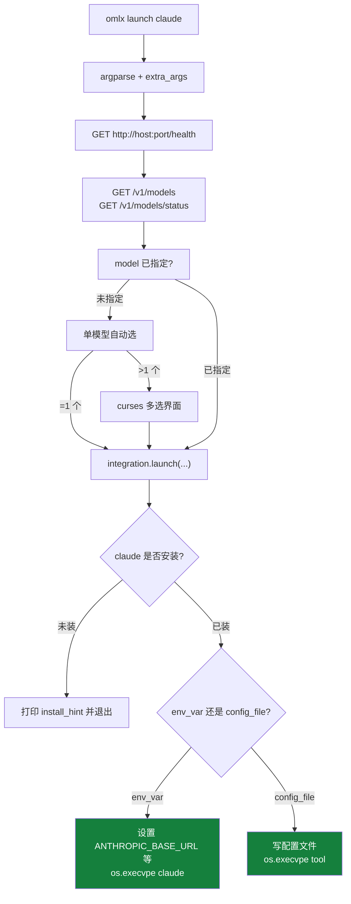
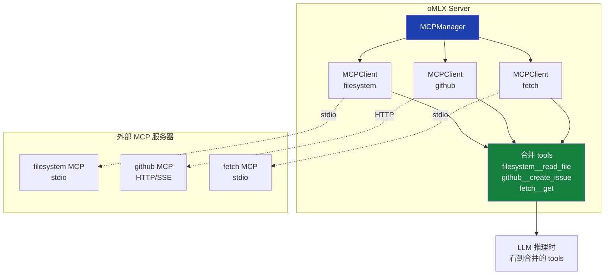

<details>
<summary>相关源文件</summary>

生成本页时使用的主要源文件：

- [omlx/cli.py](../../../project-repos/omlx/omlx/cli.py)
- [omlx/integrations/__init__.py](../../../project-repos/omlx/omlx/integrations/__init__.py)
- [omlx/integrations/base.py](../../../project-repos/omlx/omlx/integrations/base.py)
- [omlx/integrations/claude.py](../../../project-repos/omlx/omlx/integrations/claude.py)
- [omlx/integrations/codex.py](../../../project-repos/omlx/omlx/integrations/codex.py)
- [omlx/integrations/copilot.py](../../../project-repos/omlx/omlx/integrations/copilot.py)
- [omlx/integrations/opencode.py](../../../project-repos/omlx/omlx/integrations/opencode.py)
- [omlx/integrations/openclaw.py](../../../project-repos/omlx/omlx/integrations/openclaw.py)
- [omlx/integrations/hermes.py](../../../project-repos/omlx/omlx/integrations/hermes.py)
- [omlx/integrations/pi.py](../../../project-repos/omlx/omlx/integrations/pi.py)
- [omlx/mcp/client.py](../../../project-repos/omlx/omlx/mcp/client.py)
- [omlx/mcp/manager.py](../../../project-repos/omlx/omlx/mcp/manager.py)
- [omlx/mcp/config.py](../../../project-repos/omlx/omlx/mcp/config.py)
- [omlx/mcp/types.py](../../../project-repos/omlx/omlx/mcp/types.py)
- [omlx/mcp/executor.py](../../../project-repos/omlx/omlx/mcp/executor.py)
- [omlx/api/mcp_routes.py](../../../project-repos/omlx/omlx/api/mcp_routes.py)

</details>

# 外部工具集成与 MCP

把本地 LLM 接到 AI 编程工具的传统流程：找文档、改配置文件、设环境变量、重启工具、试错。每个工具一套——Claude Code 改 `~/.claude/...`、Codex 改 `~/.codex/config.toml`、Cursor、Copilot 各有各的玩法。这套折腾每次升级模型都要重做。

`omlx launch <tool>` 这个命令的工程价值是把"配置外部工具用本地模型"从**一小时**压缩到**一行**。它知道每个工具的配置文件格式、每个工具需要什么环境变量、怎么把模型对应到工具的概念（Claude 的"opus/sonnet/haiku"、Codex 的 reasoning effort、Hermes 的最小上下文要求）。

本页解释这套集成机制的设计，以及独立但相关的 MCP 客户端实现——后者让 oMLX 作为 MCP **client** 连接外部 MCP 服务器，把那些服务器的工具透明喂给本地 LLM。

## launch 命令的总流程

`omlx launch claude` 这一行命令背后的流程：



整个流程在 `launch_command`（[cli.py:277-398](../../../project-repos/omlx/omlx/cli.py#L277-L398)）。几个关键设计：

- **先 health check**：launch 前确保 oMLX 服务在跑。`0.0.0.0` 绑定地址自动重写成 `127.0.0.1` 作为 connect 地址（[cli.py:307-311](../../../project-repos/omlx/omlx/cli.py#L307-L311)）——`0.0.0.0` 是 bind 但不是 connect 地址。
- **预取 model status**：调 `/v1/models/status` 拿每个模型的 `max_context_window`、`max_tokens`、`model_type`。这些信息要传给集成，让 Hermes 这种需要最小上下文的工具能拒绝不合适的模型。
- **`extra_args` 转发**：`parse_known_args` 允许 `omlx launch claude -r --resume <id>` 把未识别参数透传给 `claude` 二进制（[cli.py:732-738](../../../project-repos/omlx/omlx/cli.py#L732-L738)）。这是为了支持工具自己的丰富命令行参数。

Sources: [omlx/cli.py:277-398](../../../project-repos/omlx/omlx/cli.py#L277-L398)

<details class="source-snippets">
<summary>引用源码</summary>

<!-- source-snippets:start -->

#### `omlx/cli.py:277-398`

```python
def launch_command(args, extra_args: list[str] | None = None):
    """Launch an external tool integrated with oMLX.

    extra_args are unknown CLI tokens forwarded to the underlying tool binary
    (e.g. ``-r`` / ``--resume <id>`` for Claude Code).
    """
    import requests

    from .integrations import get_integration, list_integrations
    from .settings import GlobalSettings

    tool_name = args.tool

    if tool_name == "list":
        print("Available integrations:")
        for integ in list_integrations():
            installed = "installed" if integ.is_installed() else "not installed"
            print(f"  {integ.name:12s} {integ.display_name} ({installed})")
        return

    integration = get_integration(tool_name)
    if integration is None:
        print(f"Unknown integration: {tool_name}")
        print("Available: " + ", ".join(i.name for i in list_integrations()))
        sys.exit(1)

    # Resolve host/port: CLI args > env vars > settings.json > defaults
    settings = GlobalSettings.load()
    host = args.host or settings.server.host
    port = args.port or settings.server.port

    # 0.0.0.0 is a valid bind address but not a valid connect address.
    # Fall back to localhost so launch can reach the server regardless
    # of which interface it was bound to.
    connect_host = host if host and host != "0.0.0.0" else "127.0.0.1"

    # Check if oMLX server is running
    base_url = f"http://{connect_host}:{port}"
    try:
        resp = requests.get(f"{base_url}/health", timeout=3)
        resp.raise_for_status()
    except Exception:
        print(f"oMLX server is not running at {base_url}")
        print("Start the server first: omlx serve")
        sys.exit(1)

    # Get API key: CLI args > settings.json > empty
    api_key = getattr(args, "api_key", None) or settings.auth.api_key or ""

    # Build headers for authenticated requests
    headers = {}
    if api_key:
        headers["Authorization"] = f"Bearer {api_key}"

    # Pre-fetch model status (context_window, max_tokens, model_type per model)
    models_status_map: dict[str, dict] = {}
    try:
        resp = requests.get(f"{base_url}/v1/models/status", headers=headers, timeout=5)
        if resp.ok:
            for m in resp.json().get("models", []):
                models_status_map[m["id"]] = m
    except Exception:
        pass

    # Determine model
    model = args.model
    if not model:
        # Fetch available models from server
        try:
            resp = requests.get(f"{base_url}/v1/models", headers=headers, timeout=5)
            resp.raise_for_status()
            data = resp.json()
            models = [
                m["id"]
                for m in data.get("data", [])
                if m.get("model_type") in ("llm", "vlm", None)
            ]
        except Exception:
            models = []

        if not models:
            print("No models available. Load a model first.")
            sys.exit(1)

        if len(models) == 1:
            model = models[0]
            print(f"Using model: {model}")
        else:
            models_info_list = [
                {"id": m_id, **models_status_map.get(m_id, {})}
                for m_id in models
            ]
            model = integration.select_model(
                models_info_list, integration.display_name
            )

    # Check if tool is installed
    if not integration.is_installed():
        print(f"{integration.display_name} is not installed.")
        print(f"Install: {integration.install_hint}")
        sys.exit(1)

    # Resolve model limits from pre-fetched status
    model_info = models_status_map.get(model, {})
    context_window = model_info.get("max_context_window")
    max_tokens = model_info.get("max_tokens")
    model_type = model_info.get("model_type")

    # Launch
    print(f"Launching {integration.display_name} with model {model}...")
    tools_profile = getattr(args, "tools_profile", "coding")
    integration.launch(
        port=port,
        api_key=api_key,
        model=model,
        host=connect_host,
        tools_profile=tools_profile,
        context_window=context_window,
        max_tokens=max_tokens,
        model_type=model_type,
... snippet truncated ...
```

<!-- source-snippets:end -->
</details>

## Integration 基类

`Integration` 是 dataclass（[integrations/base.py:14-136](../../../project-repos/omlx/omlx/integrations/base.py#L14-L136)）。每个集成都有 7 个字段：

| 字段 | 含义 |
|---|---|
| `name` | CLI 名（`claude` / `codex` / ...） |
| `display_name` | 用户可读（`Claude Code` / `Codex CLI` / ...） |
| `type` | `"env_var"` 还是 `"config_file"` |
| `install_check` | 检测是否安装的二进制名 |
| `install_hint` | 未安装时打印的命令（`npm install -g @anthropic-ai/claude-code`） |
| `launch` | 真正启动工具的回调 |
| `select_model` | 多模型时的交互式选择 |

基类提供几个共用 helper：

- **`_scrubbed_env`**：strip 掉 `PYTHONHOME` / `PYTHONPATH` / `PYTHONDONTWRITEBYTECODE`。这是因为 oMLX.app 是 bundled cpython 3.11，环境变量泄露给子进程会让 npm/node/cargo 的 Python 子进程认错解释器并 crash。
- **`select_model`**：用 curses 实现箭头键选择 + numbered input fallback。在没有 TTY 时（IDE 启动）回落到 numbered input。
- **`_write_json_config(path, updater)`**：read-modify-write，写之前会创建 timestamped `.bak`。如果文件不存在则从 `{}` 开始。这套 helper 让 config_file 类集成不需要每个都重写"读取/合并/写入/备份"逻辑。

每个集成在 `integrations/__init__.py:12-20` 的 `INTEGRATIONS` 字典注册。`get_integration(name)` 跟 `list_integrations()` 是公共 API。

Sources: [omlx/integrations/base.py:14-136](../../../project-repos/omlx/omlx/integrations/base.py#L14-L136), [omlx/integrations/__init__.py:12-20](../../../project-repos/omlx/omlx/integrations/__init__.py#L12-L20)

<details class="source-snippets">
<summary>引用源码</summary>

<!-- source-snippets:start -->

#### `omlx/integrations/base.py:14-136`

```python
@dataclass
class Integration:
    """Base integration definition."""

    name: str  # "codex", "opencode", "openclaw", "hermes", "pi"
    display_name: str  # "Codex", "OpenCode", "OpenClaw", "Hermes Agent", "Pi"
    type: str  # "env_var" or "config_file"
    install_check: str  # binary name to check with `which`
    install_hint: str  # installation instructions

    def get_command(
        self, port: int, api_key: str, model: str, host: str = "127.0.0.1"
    ) -> str:
        """Generate the command string for clipboard/display."""
        raise NotImplementedError

    def configure(self, port: int, api_key: str, model: str, host: str = "127.0.0.1") -> None:
        """Configure the tool (write config files, etc.)."""
        pass

    def launch(self, port: int, api_key: str, model: str, host: str = "127.0.0.1", **kwargs) -> None:
        """Configure and launch the tool."""
        raise NotImplementedError

    def is_installed(self) -> bool:
        """Check if the tool binary is available."""
        return shutil.which(self.install_check) is not None

    def _scrubbed_env(self) -> dict[str, str]:
        """Return an os.environ copy with bundled-Python vars removed.

        oMLX.app sets PYTHONHOME/PYTHONPATH to its bundled cpython-3.11.
        Launched tools spawn their own Python subprocesses; if they inherit
        these they crash with init_fs_encoding errors.
        """
        env = os.environ.copy()
        for key in ("PYTHONHOME", "PYTHONPATH", "PYTHONDONTWRITEBYTECODE"):
            env.pop(key, None)
        return env

    def select_model(
        self, models_info: list[dict], tool_name: str | None = None
    ) -> str:
        """Select a model interactively.

        Shows a curses arrow-key picker when running in a TTY; falls back to
        numbered terminal selection when curses is unavailable (e.g. native
        Windows Python) or stdout is not a TTY.

        Returns the selected model id (empty string when models_info is empty).
        """
        if not models_info:
            return ""

        if len(models_info) == 1:
            return models_info[0]["id"]

        name = tool_name or "Tool"

        if sys.stdout.isatty():
            try:
                return _select_model_curses(models_info, name)
            except ImportError:
                # Stdlib curses missing (e.g. native windows python).
                pass
            except Exception:
                # Curses init/runtime failure (dumb terminal, no terminfo
                # entry, broken pipe, etc.). Fall through to numbered.
                pass

        # Fallback: numbered terminal selection
        print("Available models:")
        for i, m in enumerate(models_info, 1):
            ctx = m.get("max_context_window")
            ctx_str = f"  [{ctx:,} ctx]" if ctx else ""
            print(f"  {i}. {m['id']}{ctx_str}")
        while True:
            try:
                choice = input("Select model number: ").strip()
                idx = int(choice) - 1
                if 0 <= idx < len(models_info):
                    return models_info[idx]["id"]
                print(f"Please enter 1-{len(models_info)}")
            except (ValueError, EOFError):
                print(f"Please enter 1-{len(models_info)}")

    def _write_json_config(
        self,
        config_path: Path,
        updater: callable,
    ) -> None:
        """Read, update, and write a JSON config file with backup.

        Args:
            config_path: Path to the config file.
            updater: Function that takes existing config dict and modifies it in-place.
        """
        existing: dict = {}
        if config_path.exists():
            try:
                existing = json.loads(config_path.read_text(encoding="utf-8"))
            except (json.JSONDecodeError, OSError) as e:
                print(f"Warning: could not parse {config_path}: {e}")
                print("Creating new config file.")
                existing = {}

            # Create timestamped backup
            timestamp = int(time.time())
            backup = config_path.with_suffix(f".{timestamp}.bak")
            try:
                shutil.copy2(config_path, backup)
                print(f"Backup: {backup}")
            except OSError as e:
                print(f"Warning: could not create backup: {e}")

        updater(existing)

        config_path.parent.mkdir(parents=True, exist_ok=True)
        config_path.write_text(
            json.dumps(existing, indent=2, ensure_ascii=False) + "\n",
... snippet truncated ...
```

#### `omlx/integrations/__init__.py:12-20`

```python
INTEGRATIONS: dict[str, Integration] = {
    "claude": ClaudeCodeIntegration(),
    "codex": CodexIntegration(),
    "opencode": OpenCodeIntegration(),
    "openclaw": OpenClawIntegration(),
    "hermes": HermesIntegration(),
    "pi": PiIntegration(),
    "copilot": CopilotIntegration(),
}
```

<!-- source-snippets:end -->
</details>

## 两种集成范式

7 个集成分成两组：**env_var** 直接用环境变量启动工具（不改任何配置文件）；**config_file** 改工具的 dotfile 配置。下表展示每个的策略：

| 工具 | 类型 | 配置点 | 关键变量/字段 |
|---|---|---|---|
| **claude** | env_var | 环境变量 | `ANTHROPIC_BASE_URL`, `ANTHROPIC_AUTH_TOKEN`, `ANTHROPIC_DEFAULT_{OPUS,SONNET,HAIKU}_MODEL`, `CLAUDE_CODE_AUTO_COMPACT_WINDOW`, `API_TIMEOUT_MS=3000000` |
| **copilot** | env_var | 环境变量 | `COPILOT_PROVIDER_BASE_URL`, `COPILOT_PROVIDER_TYPE=openai`, `COPILOT_PROVIDER_WIRE_API=responses`, `COPILOT_MODEL` |
| **codex** | config_file | `~/.codex/config.toml` | `[model_providers.omlx]` + `model`, `model_provider`, `model_reasoning_effort="high"` if thinking |
| **opencode** | config_file | `~/.config/opencode/opencode.json` | `provider.omlx` + `npm: @ai-sdk/openai-compatible`, 模型项含 modalities |
| **openclaw** | config_file | `~/.openclaw/openclaw.json` + `exec-approvals.json` | 含 `onboard --non-interactive`、`gateway-token omlx` |
| **hermes** | config_file | `~/.hermes/config.yaml` | `providers.omlx` + `model.provider=omlx`，**强制最小 64K 上下文** |
| **pi** | config_file | `~/.pi/agent/models.json` + `settings.json` | 双 JSON 写 provider + defaults |

`type` 字段在 `Integration` dataclass 中（[integrations/base.py:32](../../../project-repos/omlx/omlx/integrations/base.py#L32)）。两种范式各有优劣：

- **env_var 优点**：用户工具的配置文件保持原貌，一次性启动后退出，下次想用别的就再 launch 一次
- **config_file 优点**：用户启动工具的方式不变（直接敲 `codex` 而不是 `omlx launch codex`），配置一次性持久化

Claude Code 用 env_var 因为它原生支持环境变量覆盖；Codex 必须改 TOML 因为它的 model provider 注册只支持配置文件。

Sources: [omlx/integrations/](../../../project-repos/omlx/omlx/integrations), [omlx/integrations/claude.py](../../../project-repos/omlx/omlx/integrations/claude.py), [omlx/integrations/codex.py](../../../project-repos/omlx/omlx/integrations/codex.py)

<details class="source-snippets">
<summary>引用源码</summary>

<!-- source-snippets:start -->

#### `omlx/integrations/`

> 引用目标是目录，无法展开源码片段：`omlx/integrations/`

#### `omlx/integrations/claude.py`

```python
"""Claude Code integration."""

from __future__ import annotations

import os
import shutil
from pathlib import Path

from omlx.integrations.base import Integration
from omlx.utils.install import get_cli_prefix


class ClaudeCodeIntegration(Integration):
    """Claude Code integration using ANTHROPIC_BASE_URL env vars."""

    def __init__(self):
        super().__init__(
            name="claude",
            display_name="Claude Code",
            type="env_var",
            install_check="claude",
            install_hint="npm install -g @anthropic-ai/claude-code",
        )

    def get_command(
        self, port: int, api_key: str, model: str, host: str = "127.0.0.1"
    ) -> str:
        return f"{get_cli_prefix()} launch claude"

    def _find_claude_binary(self) -> str:
        """Find the claude binary in PATH or ~/.claude/local/."""
        if shutil.which("claude"):
            return "claude"
        local = Path.home() / ".claude" / "local" / "claude"
        if local.exists():
            return str(local)
        return "claude"

    def launch(
        self,
        port: int,
        api_key: str,
        model: str,
        host: str = "127.0.0.1",
        context_window: int | None = None,
        extra_args: list[str] | None = None,
        **kwargs,
    ) -> None:
        env = self._scrubbed_env()
        env["ANTHROPIC_BASE_URL"] = f"http://{host}:{port}"
        # Use the actual omlx API key so Claude Code authenticates correctly.
        # Fallback to "omlx" only when no API key is configured (open server).
        env["ANTHROPIC_AUTH_TOKEN"] = api_key or "omlx"
        env["ANTHROPIC_API_KEY"] = ""
        env["CLAUDE_CODE_ATTRIBUTION_HEADER"] = "0"
        # Large timeout for local model inference (model loading + generation).
        env["API_TIMEOUT_MS"] = "3000000"
        # Disable telemetry and non-essential background traffic.
        env["CLAUDE_CODE_DISABLE_NONESSENTIAL_TRAFFIC"] = "1"

        if model:
            env["ANTHROPIC_DEFAULT_OPUS_MODEL"] = model
            env["ANTHROPIC_DEFAULT_SONNET_MODEL"] = model
            env["ANTHROPIC_DEFAULT_HAIKU_MODEL"] = model
            env["CLAUDE_CODE_SUBAGENT_MODEL"] = model

        if context_window:
            env["CLAUDE_CODE_AUTO_COMPACT_WINDOW"] = str(context_window)

        binary = self._find_claude_binary()
        argv = [binary, *(extra_args or [])]
        print(f"Launching Claude Code with model {model}...")
        if context_window:
            print(f"Auto-compact window: {context_window:,} tokens")
        os.execvpe(binary, argv, env)
```

#### `omlx/integrations/codex.py`

```python
"""Codex (OpenAI Codex CLI) integration."""

from __future__ import annotations

import os
import re
import shutil
import time
from pathlib import Path

from omlx.integrations.base import Integration
from omlx.utils.install import get_cli_prefix


class CodexIntegration(Integration):
    """Codex integration that configures ~/.codex/config.toml for oMLX."""

    CONFIG_PATH = Path.home() / ".codex" / "config.toml"

    def __init__(self):
        super().__init__(
            name="codex",
            display_name="Codex",
            type="config_file",
            install_check="codex",
            install_hint="npm install -g @openai/codex",
        )

    def get_command(
        self, port: int, api_key: str, model: str, host: str = "127.0.0.1"
    ) -> str:
        return (
            f"{get_cli_prefix()} "
            f"launch codex --model {model or 'select-a-model'}"
        )

    def configure(self, port: int, api_key: str, model: str, host: str = "127.0.0.1") -> None:
        config_path = self.CONFIG_PATH
        config_path.parent.mkdir(parents=True, exist_ok=True)

        existing_content = ""
        if config_path.exists():
            # Create backup
            timestamp = int(time.time())
            backup = config_path.with_suffix(f".{timestamp}.bak")
            try:
                shutil.copy2(config_path, backup)
                existing_content = config_path.read_text(encoding="utf-8")
                print(f"Backup: {backup}")
            except OSError as e:
                print(f"Warning: could not create backup or read config: {e}")

        # Parse existing config lines to preserve other settings
        lines = existing_content.splitlines()
        new_lines = []
        in_any_section = False
        in_omlx_section = False
        
        # Keys to override at the top level
        top_level_overrides = {
            "model": f'"{model or "select-a-model"}"',
            "model_provider": '"omlx"'
        }
        
        # If it is a reasoning model, add reasoning effort
        is_reasoning = bool(re.search(r'\b(thinking|o1|o3|r1)\b', (model or "").lower()))
        if is_reasoning:
            top_level_overrides["model_reasoning_effort"] = '"high"'

        # Keys managed by oMLX that should be removed when not applicable
        managed_keys = {"model_reasoning_effort"} - set(top_level_overrides.keys())

        seen_keys = set()

        for line in lines:
            stripped = line.strip()
            if stripped.startswith("[") and stripped.endswith("]"):
                in_any_section = True
                in_omlx_section = (stripped == "[model_providers.omlx]")

            # Handle top-level keys
            if not in_any_section and "=" in stripped:
                key = stripped.split("=")[0].strip()
                if key in top_level_overrides:
                    new_lines.append(f"{key} = {top_level_overrides[key]}")
                    seen_keys.add(key)
                    continue
                if key in managed_keys:
                    continue
            
            # Skip old oMLX section
            if in_omlx_section:
                continue
                
            new_lines.append(line)

        # Add missing top-level keys
        for key, val in top_level_overrides.items():
            if key not in seen_keys:
                new_lines.insert(0, f"{key} = {val}")

        # Append new oMLX provider section
        new_lines.append("\n[model_providers.omlx]")
        new_lines.append('name = "oMLX"')
        new_lines.append(f'base_url = "http://{host}:{port}/v1"')
        new_lines.append('env_key = "OMLX_API_KEY"')

        config_path.write_text("\n".join(new_lines) + "\n", encoding="utf-8")
        print(f"Config updated: {config_path}")

    def launch(
        self,
        port: int,
        api_key: str,
        model: str,
        host: str = "127.0.0.1",
        extra_args: list[str] | None = None,
        **kwargs,
    ) -> None:
        self.configure(port, api_key, model, host=host)
```

<!-- source-snippets:end -->
</details>

## Claude Code 集成的细节

Claude Code 是最复杂的集成，因为：

- 它原生支持 Anthropic API，oMLX 直接喂 `/v1/messages` 即可
- 但它有 4 个模型 slot（`opus` / `sonnet` / `haiku` / `subagent`），每个都可以独立配置
- 它的 auto-compact 阈值跟上下文窗口绑定

`claude.launch` 做这些事（[integrations/claude.py](../../../project-repos/omlx/omlx/integrations/claude.py)）：

```python
env["ANTHROPIC_BASE_URL"] = f"http://{host}:{port}"
env["ANTHROPIC_AUTH_TOKEN"] = api_key or "dummy"
env["ANTHROPIC_DEFAULT_OPUS_MODEL"] = model       # 都设成同一个
env["ANTHROPIC_DEFAULT_SONNET_MODEL"] = model
env["ANTHROPIC_DEFAULT_HAIKU_MODEL"] = model
env["CLAUDE_CODE_SUBAGENT_MODEL"] = model
env["CLAUDE_CODE_AUTO_COMPACT_WINDOW"] = str(context_window)
env["API_TIMEOUT_MS"] = "3000000"  # 50 min，长 prefill 防超时
os.execvpe("claude", ["claude"] + extra_args, env)
```

`CLAUDE_CODE_AUTO_COMPACT_WINDOW` 跟 server.py 的 `scale_anthropic_tokens` 配合：客户端按真实窗口触发 compact，server 端按缩放后的 token 数汇报，整体上 Claude Code 体感跟使用 Anthropic 官方服务一致。

`os.execvpe` 而非 `subprocess.Popen` 是关键——它**替换当前进程**让 Claude Code 直接接管终端，没有中间层。Ctrl-C 等信号直达 Claude Code。

Sources: [omlx/integrations/claude.py](../../../project-repos/omlx/omlx/integrations/claude.py), [omlx/server.py:1050-1079](../../../project-repos/omlx/omlx/server.py#L1050-L1079)

<details class="source-snippets">
<summary>引用源码</summary>

<!-- source-snippets:start -->

#### `omlx/integrations/claude.py`

```python
"""Claude Code integration."""

from __future__ import annotations

import os
import shutil
from pathlib import Path

from omlx.integrations.base import Integration
from omlx.utils.install import get_cli_prefix


class ClaudeCodeIntegration(Integration):
    """Claude Code integration using ANTHROPIC_BASE_URL env vars."""

    def __init__(self):
        super().__init__(
            name="claude",
            display_name="Claude Code",
            type="env_var",
            install_check="claude",
            install_hint="npm install -g @anthropic-ai/claude-code",
        )

    def get_command(
        self, port: int, api_key: str, model: str, host: str = "127.0.0.1"
    ) -> str:
        return f"{get_cli_prefix()} launch claude"

    def _find_claude_binary(self) -> str:
        """Find the claude binary in PATH or ~/.claude/local/."""
        if shutil.which("claude"):
            return "claude"
        local = Path.home() / ".claude" / "local" / "claude"
        if local.exists():
            return str(local)
        return "claude"

    def launch(
        self,
        port: int,
        api_key: str,
        model: str,
        host: str = "127.0.0.1",
        context_window: int | None = None,
        extra_args: list[str] | None = None,
        **kwargs,
    ) -> None:
        env = self._scrubbed_env()
        env["ANTHROPIC_BASE_URL"] = f"http://{host}:{port}"
        # Use the actual omlx API key so Claude Code authenticates correctly.
        # Fallback to "omlx" only when no API key is configured (open server).
        env["ANTHROPIC_AUTH_TOKEN"] = api_key or "omlx"
        env["ANTHROPIC_API_KEY"] = ""
        env["CLAUDE_CODE_ATTRIBUTION_HEADER"] = "0"
        # Large timeout for local model inference (model loading + generation).
        env["API_TIMEOUT_MS"] = "3000000"
        # Disable telemetry and non-essential background traffic.
        env["CLAUDE_CODE_DISABLE_NONESSENTIAL_TRAFFIC"] = "1"

        if model:
            env["ANTHROPIC_DEFAULT_OPUS_MODEL"] = model
            env["ANTHROPIC_DEFAULT_SONNET_MODEL"] = model
            env["ANTHROPIC_DEFAULT_HAIKU_MODEL"] = model
            env["CLAUDE_CODE_SUBAGENT_MODEL"] = model

        if context_window:
            env["CLAUDE_CODE_AUTO_COMPACT_WINDOW"] = str(context_window)

        binary = self._find_claude_binary()
        argv = [binary, *(extra_args or [])]
        print(f"Launching Claude Code with model {model}...")
        if context_window:
            print(f"Auto-compact window: {context_window:,} tokens")
        os.execvpe(binary, argv, env)
```

#### `omlx/server.py:1050-1079`

```python
def scale_anthropic_tokens(token_count: int, model_id: str | None = None) -> int:
    """
    Scale token count for Anthropic API response if context scaling is enabled.

    Adjusts reported token counts so that Claude Code's auto-compact
    triggers at the correct timing when using models with smaller context
    windows than the target (default 200k).

    Formula: scaled = token_count * (target_context_size / actual_context_size)

    Args:
        token_count: Original token count to scale.
        model_id: Model ID to get context window for.

    Returns:
        Scaled token count, or original if scaling not applicable.
    """
    global_settings = _server_state.global_settings
    if global_settings is None:
        return token_count

    cc = global_settings.claude_code
    if not cc.context_scaling_enabled:
        return token_count

    actual = get_max_context_window(model_id)
    if not actual or actual >= cc.target_context_size:
        return token_count

    return int(token_count * cc.target_context_size / actual)
```

<!-- source-snippets:end -->
</details>

## Codex 集成：TOML 行解析

Codex 的配置是 `~/.codex/config.toml`，需要在不破坏用户其它配置的前提下插入或更新 `[model_providers.omlx]`。`codex.launch` 用**行解析**而非 toml 库：

```python
# 伪代码
lines = read_file(toml_path).splitlines()
new_lines = []
in_omlx_block = False
for line in lines:
    if line.startswith("[model_providers.omlx]"):
        in_omlx_block = True
        continue  # 跳过旧块的开头
    if in_omlx_block and line.startswith("["):
        in_omlx_block = False  # 旧块结束
    if not in_omlx_block:
        new_lines.append(line)
# 在末尾追加新块
new_lines.append("[model_providers.omlx]")
new_lines.append(f'name = "oMLX local"')
new_lines.append(f'base_url = "http://{host}:{port}/v1"')
new_lines.append(f'wire_api = "responses"')
# top-level 字段
new_lines.append(f'model = "{model}"')
new_lines.append(f'model_provider = "omlx"')
if re.search(r"\b(thinking|o1|o3|r1)\b", model, re.I):
    new_lines.append('model_reasoning_effort = "high"')
write_file(toml_path, "\n".join(new_lines))
```

为什么用行解析而不是 toml 库？两个原因：

1. **保留用户的注释和顺序**：toml 库 round-trip 会丢失注释
2. **避免 toml 依赖**：oMLX 不想给 launch 命令加一个额外依赖

`model_reasoning_effort = "high"` 的自动设置是个细节——名字包含 `thinking` / `o1` / `o3` / `r1` 的模型自动开启 reasoning 模式。这避免用户每次手动配。

Sources: [omlx/integrations/codex.py](../../../project-repos/omlx/omlx/integrations/codex.py)

<details class="source-snippets">
<summary>引用源码</summary>

<!-- source-snippets:start -->

#### `omlx/integrations/codex.py`

```python
"""Codex (OpenAI Codex CLI) integration."""

from __future__ import annotations

import os
import re
import shutil
import time
from pathlib import Path

from omlx.integrations.base import Integration
from omlx.utils.install import get_cli_prefix


class CodexIntegration(Integration):
    """Codex integration that configures ~/.codex/config.toml for oMLX."""

    CONFIG_PATH = Path.home() / ".codex" / "config.toml"

    def __init__(self):
        super().__init__(
            name="codex",
            display_name="Codex",
            type="config_file",
            install_check="codex",
            install_hint="npm install -g @openai/codex",
        )

    def get_command(
        self, port: int, api_key: str, model: str, host: str = "127.0.0.1"
    ) -> str:
        return (
            f"{get_cli_prefix()} "
            f"launch codex --model {model or 'select-a-model'}"
        )

    def configure(self, port: int, api_key: str, model: str, host: str = "127.0.0.1") -> None:
        config_path = self.CONFIG_PATH
        config_path.parent.mkdir(parents=True, exist_ok=True)

        existing_content = ""
        if config_path.exists():
            # Create backup
            timestamp = int(time.time())
            backup = config_path.with_suffix(f".{timestamp}.bak")
            try:
                shutil.copy2(config_path, backup)
                existing_content = config_path.read_text(encoding="utf-8")
                print(f"Backup: {backup}")
            except OSError as e:
                print(f"Warning: could not create backup or read config: {e}")

        # Parse existing config lines to preserve other settings
        lines = existing_content.splitlines()
        new_lines = []
        in_any_section = False
        in_omlx_section = False
        
        # Keys to override at the top level
        top_level_overrides = {
            "model": f'"{model or "select-a-model"}"',
            "model_provider": '"omlx"'
        }
        
        # If it is a reasoning model, add reasoning effort
        is_reasoning = bool(re.search(r'\b(thinking|o1|o3|r1)\b', (model or "").lower()))
        if is_reasoning:
            top_level_overrides["model_reasoning_effort"] = '"high"'

        # Keys managed by oMLX that should be removed when not applicable
        managed_keys = {"model_reasoning_effort"} - set(top_level_overrides.keys())

        seen_keys = set()

        for line in lines:
            stripped = line.strip()
            if stripped.startswith("[") and stripped.endswith("]"):
                in_any_section = True
                in_omlx_section = (stripped == "[model_providers.omlx]")

            # Handle top-level keys
            if not in_any_section and "=" in stripped:
                key = stripped.split("=")[0].strip()
                if key in top_level_overrides:
                    new_lines.append(f"{key} = {top_level_overrides[key]}")
                    seen_keys.add(key)
                    continue
                if key in managed_keys:
                    continue
            
            # Skip old oMLX section
            if in_omlx_section:
                continue
                
            new_lines.append(line)

        # Add missing top-level keys
        for key, val in top_level_overrides.items():
            if key not in seen_keys:
                new_lines.insert(0, f"{key} = {val}")

        # Append new oMLX provider section
        new_lines.append("\n[model_providers.omlx]")
        new_lines.append('name = "oMLX"')
        new_lines.append(f'base_url = "http://{host}:{port}/v1"')
        new_lines.append('env_key = "OMLX_API_KEY"')

        config_path.write_text("\n".join(new_lines) + "\n", encoding="utf-8")
        print(f"Config updated: {config_path}")

    def launch(
        self,
        port: int,
        api_key: str,
        model: str,
        host: str = "127.0.0.1",
        extra_args: list[str] | None = None,
        **kwargs,
    ) -> None:
        self.configure(port, api_key, model, host=host)
```

<!-- source-snippets:end -->
</details>

## OpenClaw 集成的特殊性

OpenClaw 跟其它工具有两个独特之处：

- **首次启动需要 onboarding 流程**：默认要交互式确认风险、选择 gateway
- **有独立的 daemon 进程**

`openclaw.launch` 处理这些：

```python
# 1. 写主配置和审批文件
_write_json_config(openclaw_json, lambda c: c.update({
    "providers": {"omlx": {...}}
}))
_write_json_config(approvals_json, lambda c: c.update({...}))

# 2. 非交互式 onboard
subprocess.run([
    "openclaw", "onboard",
    "--non-interactive",
    "--accept-risk",
    "--auth-choice", "skip",
    "--gateway-token", "omlx"
])

# 3. 重启 daemon
subprocess.run(["openclaw", "daemon", "restart"])

# 4. 启动 gateway（后台）
subprocess.Popen(["openclaw", "gateway", "start"])

# 5. exec 进 TUI
os.execvpe("openclaw", ["openclaw", "tui"], env)
```

整个流程对用户透明——一行 `omlx launch openclaw` 跑完，TUI 已经在跑且连上了本地模型。

Sources: [omlx/integrations/openclaw.py](../../../project-repos/omlx/omlx/integrations/openclaw.py)

<details class="source-snippets">
<summary>引用源码</summary>

<!-- source-snippets:start -->

#### `omlx/integrations/openclaw.py`

```python
"""OpenClaw integration."""

from __future__ import annotations

import json
import os
import socket
import subprocess
import sys
import time
from pathlib import Path

from omlx.integrations.base import Integration
from omlx.utils.install import get_cli_prefix

DEFAULT_GATEWAY_PORT = 18789


class OpenClawIntegration(Integration):
    """OpenClaw integration that writes ~/.openclaw/openclaw.json."""

    CONFIG_PATH = Path.home() / ".openclaw" / "openclaw.json"

    def __init__(self):
        super().__init__(
            name="openclaw",
            display_name="OpenClaw",
            type="config_file",
            install_check="openclaw",
            install_hint="npm install -g openclaw",
        )

    def get_command(
        self, port: int, api_key: str, model: str, host: str = "127.0.0.1"
    ) -> str:
        return (
            f"{get_cli_prefix()} "
            f"launch openclaw --model {model or 'select-a-model'}"
        )

    def configure(
        self,
        port: int,
        api_key: str,
        model: str,
        host: str = "127.0.0.1",
        tools_profile: str = "coding",
    ) -> None:
        def updater(config: dict) -> None:
            config.setdefault("models", {}).setdefault("providers", {})
            provider_config = {
                "baseUrl": f"http://{host}:{port}/v1",
                "apiKey": api_key or "omlx",
                "api": "openai-completions",
            }
            if model:
                provider_config["models"] = [
                    {
                        "id": model,
                        "name": model,
                        "api": "openai-completions",
                        "reasoning": False,
                        "input": ["text"],
                        "cost": {
                            "input": 0,
                            "output": 0,
                            "cacheRead": 0,
                            "cacheWrite": 0,
                        },
                        "contextWindow": 131072,
                        "maxTokens": 8192,
                    }
                ]
            config["models"]["providers"]["omlx"] = provider_config

            # Set as default model
            if model:
                config.setdefault("agents", {}).setdefault(
                    "defaults", {}
                ).setdefault("model", {})
                config["agents"]["defaults"]["model"]["primary"] = f"omlx/{model}"

            # Set tools profile
            config.setdefault("tools", {})
            config["tools"]["profile"] = tools_profile

        self._write_json_config(self.CONFIG_PATH, updater)

    def _gateway_info(self) -> tuple[str, int]:
        """Read gateway token and port from OpenClaw config."""
        token = ""
        port = DEFAULT_GATEWAY_PORT
        try:
            data = json.loads(self.CONFIG_PATH.read_text())
            gw = data.get("gateway", {})
            if p := gw.get("port"):
                port = int(p)
            auth = gw.get("auth", {})
            if t := auth.get("token"):
                token = t
        except Exception:
            pass
        return token, port

    @staticmethod
    def _port_open(host: str, port: int) -> bool:
        """Check if a TCP port is accepting connections."""
        try:
            with socket.create_connection((host, port), timeout=0.5):
                return True
        except OSError:
            return False

    @staticmethod
    def _wait_for_port(host: str, port: int, timeout: float = 30.0) -> bool:
        """Wait until a TCP port is accepting connections."""
        deadline = time.monotonic() + timeout
        while time.monotonic() < deadline:
            try:
                with socket.create_connection((host, port), timeout=0.5):
```

<!-- source-snippets:end -->
</details>

## Hermes 集成的最小上下文强制

Hermes Agent 有个独特要求：最小上下文 64K，因为它的 agent loop 在每轮迭代都会注入 system prompt + 全部 context。低于 64K 的模型用 Hermes 会出现"上下文不够装下 system prompt"的错误。

`hermes.launch` 做了一个 guard：

```python
HERMES_MIN_CONTEXT_LENGTH = 64000
if context_window and context_window < HERMES_MIN_CONTEXT_LENGTH:
    print(f"Warning: model has {context_window} context, Hermes needs {HERMES_MIN_CONTEXT_LENGTH}")
    print("Continue anyway? [y/N]")
    if input() != "y":
        sys.exit(1)
```

这是一个跟产品深度协同的体验设计——比直接报错更友好，但避免了"启动后崩溃"的糟糕用户体验。

Sources: [omlx/integrations/hermes.py](../../../project-repos/omlx/omlx/integrations/hermes.py)

<details class="source-snippets">
<summary>引用源码</summary>

<!-- source-snippets:start -->

#### `omlx/integrations/hermes.py`

```python
"""Hermes Agent integration."""

from __future__ import annotations

import os
import shutil
import time
from pathlib import Path

import yaml

from omlx.integrations.base import Integration
from omlx.utils.install import get_cli_prefix

HERMES_MIN_CONTEXT_LENGTH = 64_000


class HermesIntegration(Integration):
    """Hermes Agent integration that writes ~/.hermes/config.yaml."""

    CONFIG_PATH = Path.home() / ".hermes" / "config.yaml"

    def __init__(self):
        super().__init__(
            name="hermes",
            display_name="Hermes Agent",
            type="config_file",
            install_check="hermes",
            install_hint=(
                "curl -fsSL "
                "https://raw.githubusercontent.com/NousResearch/hermes-agent/main/scripts/install.sh "
                "| bash"
            ),
        )

    def get_command(
        self, port: int, api_key: str, model: str, host: str = "127.0.0.1"
    ) -> str:
        return (
            f"{get_cli_prefix()} "
            f"launch hermes --model {model or 'select-a-model'}"
        )

    def _read_config(self, config_path: Path) -> dict:
        existing: dict = {}
        if not config_path.exists():
            return existing

        try:
            loaded = yaml.safe_load(config_path.read_text(encoding="utf-8"))
        except (OSError, yaml.YAMLError) as e:
            print(f"Warning: could not parse {config_path}: {e}")
            print("Creating new config file.")
            return existing

        if loaded is None:
            return existing
        if not isinstance(loaded, dict):
            print(f"Warning: {config_path} does not contain a YAML object.")
            print("Creating new config file.")
            return existing
        return loaded

    @staticmethod
    def _create_backup(config_path: Path) -> None:
        if not config_path.exists():
            return

        timestamp = int(time.time())
        backup = config_path.with_suffix(f".{timestamp}.bak")
        try:
            shutil.copy2(config_path, backup)
            print(f"Backup: {backup}")
        except OSError as e:
            print(f"Warning: could not create backup: {e}")

    def configure(
        self,
        port: int,
        api_key: str,
        model: str,
        host: str = "127.0.0.1",
        context_window: int | None = None,
        max_tokens: int | None = None,
    ) -> None:
        config_path = self.CONFIG_PATH
        config = self._read_config(config_path)
        self._create_backup(config_path)

        providers = config.setdefault("providers", {})
        if not isinstance(providers, dict):
            providers = {}
            config["providers"] = providers

        provider_config = providers.get("omlx", {})
        if not isinstance(provider_config, dict):
            provider_config = {}
        provider_config.update(
            {
                "name": "oMLX",
                "base_url": f"http://{host}:{port}/v1",
                "api_key": api_key or "omlx",
                "api_mode": "chat_completions",
            }
        )
        if model:
            provider_config["default_model"] = model
        providers["omlx"] = provider_config

        model_config = config.get("model", {})
        if not isinstance(model_config, dict):
            model_config = {}
        for stale_key in ("base_url", "api_key", "api", "api_mode", "transport"):
            model_config.pop(stale_key, None)
        model_config["provider"] = "omlx"
        if model:
            model_config["default"] = model
        if context_window is not None:
            if context_window < HERMES_MIN_CONTEXT_LENGTH:
                print(
```

<!-- source-snippets:end -->
</details>

## MCP 客户端架构

MCP 是另一条完全独立的集成路径。重要事实：**oMLX 是 MCP 客户端而非服务端**。



模型每次推理都"看到"所有 MCP 服务器暴露的工具，但**oMLX 不自动执行工具**——它只是把工具描述喂给模型，让模型决定调用，再把模型生成的 tool_call 原样返回给客户端。客户端（Claude Code、Cursor 等）真正负责执行。

为什么不在 server 侧自动执行？两个原因：

1. **安全边界**：工具执行涉及文件系统/网络/git 等，应该由用户控制的客户端决定权限
2. **协议清晰**：让 server 保持"无副作用的推理服务"语义

不过 server 也提供了 `POST /v1/mcp/execute`（[api/mcp_routes.py](../../../project-repos/omlx/omlx/api/mcp_routes.py)）作为带外执行接口——客户端可以选择把 tool_call 拿来通过这个 endpoint 调用，但这是 opt-in 的。

Sources: [omlx/mcp/manager.py](../../../project-repos/omlx/omlx/mcp/manager.py), [omlx/api/mcp_routes.py](../../../project-repos/omlx/omlx/api/mcp_routes.py)

<details class="source-snippets">
<summary>引用源码</summary>

<!-- source-snippets:start -->

#### `omlx/mcp/manager.py`

```python
# SPDX-License-Identifier: Apache-2.0
# Adapted from vllm-mlx (https://github.com/vllm-project/vllm-mlx).
"""
MCP Client Manager for handling multiple MCP server connections.
"""

import asyncio
import logging
from typing import Any, Dict, List, Optional

from .client import MCPClient
from .tools import merge_tools, mcp_tools_to_openai, openai_call_to_mcp
from .types import (
    MCPConfig,
    MCPServerStatus,
    MCPTool,
    MCPToolResult,
)

logger = logging.getLogger(__name__)


class MCPClientManager:
    """
    Manages multiple MCP server connections.

    Provides a unified interface for:
    - Connecting to multiple MCP servers
    - Discovering and aggregating tools
    - Executing tool calls
    - Managing connection lifecycle
    """

    def __init__(self, config: MCPConfig):
        """
        Initialize MCP Client Manager.

        Args:
            config: MCP configuration with server definitions
        """
        self.config = config
        self._clients: Dict[str, MCPClient] = {}
        self._started = False
        self._lock = asyncio.Lock()

        # Create clients for each server
        for name, server_config in config.servers.items():
            self._clients[name] = MCPClient(server_config)

    @property
    def is_started(self) -> bool:
        """Check if manager has been started."""
        return self._started

    async def start(self):
        """
        Start the manager and connect to all enabled servers.

        Connections are made in parallel for faster startup.
        """
        async with self._lock:
            if self._started:
                return

            logger.info(f"Starting MCP client manager with {len(self._clients)} servers")

            # Connect to all servers in parallel
            tasks = [
                client.connect()
                for client in self._clients.values()
                if client.config.enabled
            ]

            if tasks:
                results = await asyncio.gather(*tasks, return_exceptions=True)

                # Log results
                for client, result in zip(
                    [c for c in self._clients.values() if c.config.enabled],
                    results,
                ):
                    if isinstance(result, Exception):
                        logger.error(f"Failed to connect to '{client.name}': {result}")
                    elif result:
                        logger.info(f"Connected to '{client.name}'")

            self._started = True

            # Log summary
            connected = sum(1 for c in self._clients.values() if c.is_connected)
            total_tools = sum(len(c.tools) for c in self._clients.values())
            logger.info(
                f"MCP manager started: {connected}/{len(self._clients)} servers, "
                f"{total_tools} tools available"
            )

    async def stop(self):
        """Stop the manager and disconnect from all servers."""
        async with self._lock:
            if not self._started:
                return

            logger.info("Stopping MCP client manager")

            # Disconnect from all servers in parallel
            tasks = [client.disconnect() for client in self._clients.values()]
            if tasks:
                await asyncio.gather(*tasks, return_exceptions=True)

            self._started = False
            logger.info("MCP client manager stopped")

    def get_all_tools(self) -> List[MCPTool]:
        """
        Get all tools from all connected servers.

        Returns:
            List of MCPTool instances
        """
        tools = []
```

#### `omlx/api/mcp_routes.py`

```python
# SPDX-License-Identifier: Apache-2.0
"""
MCP (Model Context Protocol) API routes.

This module provides FastAPI routes for MCP tool management:
- GET /v1/mcp/tools - List available MCP tools
- GET /v1/mcp/servers - List MCP server status
- POST /v1/mcp/execute - Execute an MCP tool
"""

from fastapi import APIRouter, HTTPException

from .openai_models import (
    MCPExecuteRequest,
    MCPExecuteResponse,
    MCPServerInfo,
    MCPServersResponse,
    MCPToolInfo,
    MCPToolsResponse,
)

router = APIRouter(prefix="/v1/mcp", tags=["mcp"])


# Callback function to get MCP manager (set by server.py)
_get_mcp_manager = None


def set_mcp_manager_getter(getter):
    """
    Set the callback function to get MCP manager.

    Args:
        getter: A callable that returns the MCP manager instance or None
    """
    global _get_mcp_manager
    _get_mcp_manager = getter


def _get_manager():
    """Get the MCP manager instance."""
    if _get_mcp_manager is None:
        return None
    return _get_mcp_manager()


@router.get("/tools")
async def list_mcp_tools() -> MCPToolsResponse:
    """List all available MCP tools."""
    manager = _get_manager()
    if manager is None:
        return MCPToolsResponse(tools=[], count=0)

    tools = []
    for tool in manager.get_all_tools():
        tools.append(MCPToolInfo(
            name=tool.full_name,
            description=tool.description,
            server=tool.server_name,
            parameters=tool.input_schema,
        ))

    return MCPToolsResponse(tools=tools, count=len(tools))


@router.get("/servers")
async def list_mcp_servers() -> MCPServersResponse:
    """Get status of all MCP servers."""
    manager = _get_manager()
    if manager is None:
        return MCPServersResponse(servers=[])

    servers = []
    for status in manager.get_server_status():
        servers.append(MCPServerInfo(
            name=status.name,
            state=status.state.value,
            transport=status.transport.value,
            tools_count=status.tools_count,
            error=status.error,
        ))

    return MCPServersResponse(servers=servers)


@router.post("/execute")
async def execute_mcp_tool(request: MCPExecuteRequest) -> MCPExecuteResponse:
    """Execute an MCP tool."""
    manager = _get_manager()
    if manager is None:
        raise HTTPException(
            status_code=503,
            detail="MCP not configured. Start server with --mcp-config"
        )

    result = await manager.execute_tool(
        request.tool_name,
        request.arguments,
    )

    return MCPExecuteResponse(
        tool_name=result.tool_name,
        content=result.content,
        is_error=result.is_error,
        error_message=result.error_message,
    )
```

<!-- source-snippets:end -->
</details>

## MCP 配置文件格式

oMLX 的 MCP 配置兼容 Claude Desktop 格式（[mcp/config.py:118](../../../project-repos/omlx/omlx/mcp/config.py#L118)）：

```json
{
  "mcpServers": {
    "filesystem": {
      "command": "npx",
      "args": ["-y", "@modelcontextprotocol/server-filesystem", "/Users/me"]
    },
    "github": {
      "url": "https://my-mcp.example.com/sse",
      "transport": "sse"
    }
  }
}
```

或 oMLX 自己的 `servers` 键也认。`load_mcp_config` 的搜索顺序：

1. 显式 `--mcp-config` 路径
2. `OMLX_MCP_CONFIG` 环境变量
3. `./mcp.json` / `./mcp.yaml`
4. `~/.config/omlx/mcp.{json,yaml}`

这套 fallback 让用户可以直接复用已有的 Claude Desktop MCP 配置，不需要重写一份。

`MCPTransport` 枚举（[mcp/types.py](../../../project-repos/omlx/omlx/mcp/types.py)）支持三种 transport：

| Transport | 通信方式 | 适用场景 |
|---|---|---|
| `STDIO` | 子进程 stdin/stdout | 本地 MCP 服务（filesystem / git / fetch / shell） |
| `SSE` | HTTP + Server-Sent Events | 远程 MCP 服务 |
| `STREAMABLE_HTTP` | HTTP + streamable response | 新版 MCP 协议 |

每种 transport 在 `MCPClient`（[mcp/client.py](../../../project-repos/omlx/omlx/mcp/client.py)）有对应的连接方法。连接成功后调 `session.initialize()` → `session.list_tools()` 拿工具列表存为 `MCPTool[]`。

Sources: [omlx/mcp/config.py:118](../../../project-repos/omlx/omlx/mcp/config.py:118), [omlx/mcp/types.py](../../../project-repos/omlx/omlx/mcp/types.py), [omlx/mcp/client.py](../../../project-repos/omlx/omlx/mcp/client.py)

<details class="source-snippets">
<summary>引用源码</summary>

<!-- source-snippets:start -->

#### `omlx/mcp/config.py:118`

> 未找到引用文件：`omlx/mcp/config.py:118`

#### `omlx/mcp/types.py`

```python
# SPDX-License-Identifier: Apache-2.0
# Adapted from vllm-mlx (https://github.com/vllm-project/vllm-mlx).
"""
Type definitions for MCP client support.
"""

from dataclasses import dataclass, field
from enum import Enum
from typing import Any, Dict, List, Literal, Optional


class MCPTransport(str, Enum):
    """Supported MCP transport types."""
    STDIO = "stdio"
    SSE = "sse"
    STREAMABLE_HTTP = "streamable-http"


class MCPServerState(str, Enum):
    """MCP server connection states."""
    DISCONNECTED = "disconnected"
    CONNECTING = "connecting"
    CONNECTED = "connected"
    ERROR = "error"


@dataclass
class MCPServerConfig:
    """Configuration for a single MCP server."""

    name: str
    transport: MCPTransport = MCPTransport.STDIO

    # For stdio transport
    command: Optional[str] = None
    args: Optional[List[str]] = None
    env: Optional[Dict[str, str]] = None

    # For SSE transport
    url: Optional[str] = None

    # For streamable-http transport
    headers: Optional[Dict[str, str]] = None

    # Common options
    enabled: bool = True
    timeout: float = 30.0

    def __post_init__(self):
        """Validate configuration."""
        if isinstance(self.transport, str):
            self.transport = MCPTransport(self.transport)

        if self.transport == MCPTransport.STDIO:
            if not self.command:
                raise ValueError(f"MCP server '{self.name}': stdio transport requires 'command'")
        elif self.transport == MCPTransport.SSE:
            if not self.url:
                raise ValueError(f"MCP server '{self.name}': sse transport requires 'url'")
        elif self.transport == MCPTransport.STREAMABLE_HTTP:
            if not self.url:
                raise ValueError(f"MCP server '{self.name}': streamable-http transport requires 'url'")


@dataclass
class MCPConfig:
    """Root configuration for MCP client."""

    servers: Dict[str, MCPServerConfig] = field(default_factory=dict)
    max_tool_calls: int = 10
    default_timeout: float = 30.0

    @classmethod
    def from_dict(cls, data: Dict[str, Any]) -> "MCPConfig":
        """Create config from dictionary."""
        servers = {}
        for name, server_data in data.get("servers", {}).items():
            server_data["name"] = name
            servers[name] = MCPServerConfig(**server_data)

        return cls(
            servers=servers,
            max_tool_calls=data.get("max_tool_calls", 10),
            default_timeout=data.get("default_timeout", 30.0),
        )


@dataclass
class MCPTool:
    """Normalized tool representation from MCP server."""

    server_name: str
    name: str
    description: str
    input_schema: Dict[str, Any] = field(default_factory=dict)

    @property
    def full_name(self) -> str:
        """Get namespaced tool name (server__tool)."""
        return f"{self.server_name}__{self.name}"

    def to_openai_format(self) -> Dict[str, Any]:
        """Convert to OpenAI function calling format."""
        return {
            "type": "function",
            "function": {
                "name": self.full_name,
                "description": self.description,
                "parameters": self.input_schema,
            }
        }


@dataclass
class MCPToolResult:
    """Result from a tool execution."""

    tool_name: str
    content: Any
    is_error: bool = False
```

#### `omlx/mcp/client.py`

```python
# SPDX-License-Identifier: Apache-2.0
# Adapted from vllm-mlx (https://github.com/vllm-project/vllm-mlx).
"""
MCP client for connecting to individual MCP servers.
"""

import asyncio
import logging
import time
from typing import Any, Dict, List, Optional

from .types import (
    MCPServerConfig,
    MCPServerState,
    MCPServerStatus,
    MCPTool,
    MCPToolResult,
    MCPTransport,
)

logger = logging.getLogger(__name__)


class MCPClient:
    """
    Client for connecting to a single MCP server.

    Supports both stdio and SSE transports.
    """

    def __init__(self, config: MCPServerConfig):
        """
        Initialize MCP client.

        Args:
            config: Server configuration
        """
        self.config = config
        self._session = None
        self._read = None
        self._write = None
        self._tools: List[MCPTool] = []
        self._state = MCPServerState.DISCONNECTED
        self._error: Optional[str] = None
        self._last_connected: Optional[float] = None
        self._lock = asyncio.Lock()

    @property
    def name(self) -> str:
        """Get server name."""
        return self.config.name

    @property
    def state(self) -> MCPServerState:
        """Get current connection state."""
        return self._state

    @property
    def is_connected(self) -> bool:
        """Check if connected to server."""
        return self._state == MCPServerState.CONNECTED

    @property
    def tools(self) -> List[MCPTool]:
        """Get discovered tools."""
        return self._tools

    def get_status(self) -> MCPServerStatus:
        """Get server status."""
        return MCPServerStatus(
            name=self.name,
            state=self._state,
            transport=self.config.transport,
            tools_count=len(self._tools),
            error=self._error,
            last_connected=self._last_connected,
        )

    async def connect(self) -> bool:
        """
        Connect to the MCP server.

        Returns:
            True if connection successful, False otherwise
        """
        async with self._lock:
            if self._state == MCPServerState.CONNECTED:
                return True

            if not self.config.enabled:
                logger.info(f"MCP server '{self.name}' is disabled")
                return False

            self._state = MCPServerState.CONNECTING
            self._error = None

            try:
                if self.config.transport == MCPTransport.STDIO:
                    await self._connect_stdio()
                elif self.config.transport == MCPTransport.SSE:
                    await self._connect_sse()
                elif self.config.transport == MCPTransport.STREAMABLE_HTTP:
                    await self._connect_streamable_http()
                else:
                    raise ValueError(f"Unknown transport: {self.config.transport}")

                # Initialize session
                await self._initialize_session()

                # Discover tools
                await self._discover_tools()

                self._state = MCPServerState.CONNECTED
                self._last_connected = time.time()
                logger.info(
                    f"Connected to MCP server '{self.name}' "
                    f"({len(self._tools)} tools available)"
                )
                return True

```

<!-- source-snippets:end -->
</details>

## 工具命名空间：双下划线 server__tool

多个 MCP 服务器可能各自有同名工具（`read_file` 在 filesystem 和 docker 都有）。`MCPTool.full_name = f"{server}__{tool}"`（[mcp/types.py](../../../project-repos/omlx/omlx/mcp/types.py)）用**双下划线**做命名空间分隔。

为什么是双下划线？因为：

- 单下划线 `_` 在工具名里太常见（`get_user`, `list_files`），会跟服务器名混淆
- `:` 或 `.` 不是 JSON Schema 友好的标识符
- 双下划线在程序员视觉上明显，且不会出现在大多数工具名中

转 OpenAI tool 格式后：

```json
{
  "type": "function",
  "function": {
    "name": "filesystem__read_file",
    "description": "Read contents of a file",
    "parameters": {...}
  }
}
```

模型回 `tool_call` 时，oMLX 的 `MCPManager.execute_tool(full_name, args)` 用 `__` 分隔 server 和 tool（[mcp/manager.py](../../../project-repos/omlx/omlx/mcp/manager.py)）。如果模型生成的工具名没有命名空间前缀，manager 会扫描所有服务器找匹配。

Sources: [omlx/mcp/types.py](../../../project-repos/omlx/omlx/mcp/types.py), [omlx/mcp/manager.py](../../../project-repos/omlx/omlx/mcp/manager.py)

<details class="source-snippets">
<summary>引用源码</summary>

<!-- source-snippets:start -->

#### `omlx/mcp/types.py`

```python
# SPDX-License-Identifier: Apache-2.0
# Adapted from vllm-mlx (https://github.com/vllm-project/vllm-mlx).
"""
Type definitions for MCP client support.
"""

from dataclasses import dataclass, field
from enum import Enum
from typing import Any, Dict, List, Literal, Optional


class MCPTransport(str, Enum):
    """Supported MCP transport types."""
    STDIO = "stdio"
    SSE = "sse"
    STREAMABLE_HTTP = "streamable-http"


class MCPServerState(str, Enum):
    """MCP server connection states."""
    DISCONNECTED = "disconnected"
    CONNECTING = "connecting"
    CONNECTED = "connected"
    ERROR = "error"


@dataclass
class MCPServerConfig:
    """Configuration for a single MCP server."""

    name: str
    transport: MCPTransport = MCPTransport.STDIO

    # For stdio transport
    command: Optional[str] = None
    args: Optional[List[str]] = None
    env: Optional[Dict[str, str]] = None

    # For SSE transport
    url: Optional[str] = None

    # For streamable-http transport
    headers: Optional[Dict[str, str]] = None

    # Common options
    enabled: bool = True
    timeout: float = 30.0

    def __post_init__(self):
        """Validate configuration."""
        if isinstance(self.transport, str):
            self.transport = MCPTransport(self.transport)

        if self.transport == MCPTransport.STDIO:
            if not self.command:
                raise ValueError(f"MCP server '{self.name}': stdio transport requires 'command'")
        elif self.transport == MCPTransport.SSE:
            if not self.url:
                raise ValueError(f"MCP server '{self.name}': sse transport requires 'url'")
        elif self.transport == MCPTransport.STREAMABLE_HTTP:
            if not self.url:
                raise ValueError(f"MCP server '{self.name}': streamable-http transport requires 'url'")


@dataclass
class MCPConfig:
    """Root configuration for MCP client."""

    servers: Dict[str, MCPServerConfig] = field(default_factory=dict)
    max_tool_calls: int = 10
    default_timeout: float = 30.0

    @classmethod
    def from_dict(cls, data: Dict[str, Any]) -> "MCPConfig":
        """Create config from dictionary."""
        servers = {}
        for name, server_data in data.get("servers", {}).items():
            server_data["name"] = name
            servers[name] = MCPServerConfig(**server_data)

        return cls(
            servers=servers,
            max_tool_calls=data.get("max_tool_calls", 10),
            default_timeout=data.get("default_timeout", 30.0),
        )


@dataclass
class MCPTool:
    """Normalized tool representation from MCP server."""

    server_name: str
    name: str
    description: str
    input_schema: Dict[str, Any] = field(default_factory=dict)

    @property
    def full_name(self) -> str:
        """Get namespaced tool name (server__tool)."""
        return f"{self.server_name}__{self.name}"

    def to_openai_format(self) -> Dict[str, Any]:
        """Convert to OpenAI function calling format."""
        return {
            "type": "function",
            "function": {
                "name": self.full_name,
                "description": self.description,
                "parameters": self.input_schema,
            }
        }


@dataclass
class MCPToolResult:
    """Result from a tool execution."""

    tool_name: str
    content: Any
    is_error: bool = False
```

#### `omlx/mcp/manager.py`

```python
# SPDX-License-Identifier: Apache-2.0
# Adapted from vllm-mlx (https://github.com/vllm-project/vllm-mlx).
"""
MCP Client Manager for handling multiple MCP server connections.
"""

import asyncio
import logging
from typing import Any, Dict, List, Optional

from .client import MCPClient
from .tools import merge_tools, mcp_tools_to_openai, openai_call_to_mcp
from .types import (
    MCPConfig,
    MCPServerStatus,
    MCPTool,
    MCPToolResult,
)

logger = logging.getLogger(__name__)


class MCPClientManager:
    """
    Manages multiple MCP server connections.

    Provides a unified interface for:
    - Connecting to multiple MCP servers
    - Discovering and aggregating tools
    - Executing tool calls
    - Managing connection lifecycle
    """

    def __init__(self, config: MCPConfig):
        """
        Initialize MCP Client Manager.

        Args:
            config: MCP configuration with server definitions
        """
        self.config = config
        self._clients: Dict[str, MCPClient] = {}
        self._started = False
        self._lock = asyncio.Lock()

        # Create clients for each server
        for name, server_config in config.servers.items():
            self._clients[name] = MCPClient(server_config)

    @property
    def is_started(self) -> bool:
        """Check if manager has been started."""
        return self._started

    async def start(self):
        """
        Start the manager and connect to all enabled servers.

        Connections are made in parallel for faster startup.
        """
        async with self._lock:
            if self._started:
                return

            logger.info(f"Starting MCP client manager with {len(self._clients)} servers")

            # Connect to all servers in parallel
            tasks = [
                client.connect()
                for client in self._clients.values()
                if client.config.enabled
            ]

            if tasks:
                results = await asyncio.gather(*tasks, return_exceptions=True)

                # Log results
                for client, result in zip(
                    [c for c in self._clients.values() if c.config.enabled],
                    results,
                ):
                    if isinstance(result, Exception):
                        logger.error(f"Failed to connect to '{client.name}': {result}")
                    elif result:
                        logger.info(f"Connected to '{client.name}'")

            self._started = True

            # Log summary
            connected = sum(1 for c in self._clients.values() if c.is_connected)
            total_tools = sum(len(c.tools) for c in self._clients.values())
            logger.info(
                f"MCP manager started: {connected}/{len(self._clients)} servers, "
                f"{total_tools} tools available"
            )

    async def stop(self):
        """Stop the manager and disconnect from all servers."""
        async with self._lock:
            if not self._started:
                return

            logger.info("Stopping MCP client manager")

            # Disconnect from all servers in parallel
            tasks = [client.disconnect() for client in self._clients.values()]
            if tasks:
                await asyncio.gather(*tasks, return_exceptions=True)

            self._started = False
            logger.info("MCP client manager stopped")

    def get_all_tools(self) -> List[MCPTool]:
        """
        Get all tools from all connected servers.

        Returns:
            List of MCPTool instances
        """
        tools = []
```

<!-- source-snippets:end -->
</details>

## MCPManager 的并行连接 + 工具合并

`MCPManager.connect_all()` 用 `asyncio.gather` **并行**连接所有启用的 MCP 服务器（[mcp/manager.py](../../../project-repos/omlx/omlx/mcp/manager.py)）。这避免了串行连接时一个慢服务器阻塞其它服务器。

任意服务器连接失败**不会阻塞 server 启动**——失败的标记为 `ERROR` 状态，其它服务器照常工作。Admin dashboard 的 `/v1/mcp/servers` 显示每个的状态。

工具合并：`get_merged_tools(user_tools)`（[mcp/manager.py](../../../project-repos/omlx/omlx/mcp/manager.py)）把 MCP 所有 tools + 用户在请求里 explicitly 提供的 tools 合并成单一 list。冲突时**用户工具优先**——这保证用户可以"覆盖" MCP 工具的定义。

在 server.py 的每个 chat path（[server.py:2178-2183](../../../project-repos/omlx/omlx/server.py#L2178-L2183), [server.py:3549-3564](../../../project-repos/omlx/omlx/server.py#L3549-L3564), [server.py:3911-3914](../../../project-repos/omlx/omlx/server.py#L3911-L3914)）：

```python
tools = request.tools or []
if mcp_manager:
    tools = mcp_manager.get_merged_tools(tools)
chat_kwargs["tools"] = tools
```

这意味着 OpenAI、Anthropic、Responses 三个协议下，MCP 工具都自动可用，无需客户端做任何额外配置。

Sources: [omlx/mcp/manager.py](../../../project-repos/omlx/omlx/mcp/manager.py), [omlx/server.py:2178-2183](../../../project-repos/omlx/omlx/server.py#L2178-L2183)

<details class="source-snippets">
<summary>引用源码</summary>

<!-- source-snippets:start -->

#### `omlx/mcp/manager.py`

```python
# SPDX-License-Identifier: Apache-2.0
# Adapted from vllm-mlx (https://github.com/vllm-project/vllm-mlx).
"""
MCP Client Manager for handling multiple MCP server connections.
"""

import asyncio
import logging
from typing import Any, Dict, List, Optional

from .client import MCPClient
from .tools import merge_tools, mcp_tools_to_openai, openai_call_to_mcp
from .types import (
    MCPConfig,
    MCPServerStatus,
    MCPTool,
    MCPToolResult,
)

logger = logging.getLogger(__name__)


class MCPClientManager:
    """
    Manages multiple MCP server connections.

    Provides a unified interface for:
    - Connecting to multiple MCP servers
    - Discovering and aggregating tools
    - Executing tool calls
    - Managing connection lifecycle
    """

    def __init__(self, config: MCPConfig):
        """
        Initialize MCP Client Manager.

        Args:
            config: MCP configuration with server definitions
        """
        self.config = config
        self._clients: Dict[str, MCPClient] = {}
        self._started = False
        self._lock = asyncio.Lock()

        # Create clients for each server
        for name, server_config in config.servers.items():
            self._clients[name] = MCPClient(server_config)

    @property
    def is_started(self) -> bool:
        """Check if manager has been started."""
        return self._started

    async def start(self):
        """
        Start the manager and connect to all enabled servers.

        Connections are made in parallel for faster startup.
        """
        async with self._lock:
            if self._started:
                return

            logger.info(f"Starting MCP client manager with {len(self._clients)} servers")

            # Connect to all servers in parallel
            tasks = [
                client.connect()
                for client in self._clients.values()
                if client.config.enabled
            ]

            if tasks:
                results = await asyncio.gather(*tasks, return_exceptions=True)

                # Log results
                for client, result in zip(
                    [c for c in self._clients.values() if c.config.enabled],
                    results,
                ):
                    if isinstance(result, Exception):
                        logger.error(f"Failed to connect to '{client.name}': {result}")
                    elif result:
                        logger.info(f"Connected to '{client.name}'")

            self._started = True

            # Log summary
            connected = sum(1 for c in self._clients.values() if c.is_connected)
            total_tools = sum(len(c.tools) for c in self._clients.values())
            logger.info(
                f"MCP manager started: {connected}/{len(self._clients)} servers, "
                f"{total_tools} tools available"
            )

    async def stop(self):
        """Stop the manager and disconnect from all servers."""
        async with self._lock:
            if not self._started:
                return

            logger.info("Stopping MCP client manager")

            # Disconnect from all servers in parallel
            tasks = [client.disconnect() for client in self._clients.values()]
            if tasks:
                await asyncio.gather(*tasks, return_exceptions=True)

            self._started = False
            logger.info("MCP client manager stopped")

    def get_all_tools(self) -> List[MCPTool]:
        """
        Get all tools from all connected servers.

        Returns:
            List of MCPTool instances
        """
        tools = []
```

#### `omlx/server.py:2178-2183`

```python
    # Merge MCP tools with user-provided tools
    effective_tools = request.tools
    if _server_state.mcp_manager:
        # Convert Pydantic ToolDefinition models to dicts for merge_tools
        user_tools_dicts = [t.model_dump() for t in request.tools] if request.tools else None
        effective_tools = _server_state.mcp_manager.get_merged_tools(user_tools_dicts)
```

<!-- source-snippets:end -->
</details>

## MCP HTTP 路由

`omlx/api/mcp_routes.py` 暴露三个 endpoint：

| 路由 | 用途 |
|---|---|
| `GET /v1/mcp/tools` | 列出所有 MCP 工具（OpenAI tool 格式） |
| `GET /v1/mcp/servers` | 列出 MCP 服务器状态（CONNECTED/ERROR/CONNECTING/DISCONNECTED） |
| `POST /v1/mcp/execute` | 带外执行某个 MCP 工具，返回结果 |

依赖注入用 getter 模式：server.py 启动时调 `set_mcp_manager_getter(get_mcp_manager)`（[server.py:420](../../../project-repos/omlx/omlx/server.py#L420)），mcp_routes 通过这个 getter 拿到 manager 实例。这避免了 mcp_routes 直接 import server.py 造成的循环依赖。

`POST /v1/mcp/execute` 允许工具调用脱离推理上下文。典型用法：客户端先调 `/v1/chat/completions` 拿到 tool_call，然后调 `/v1/mcp/execute` 执行，最后把结果作为 tool message 加进下一轮 chat completion。

Sources: [omlx/api/mcp_routes.py](../../../project-repos/omlx/omlx/api/mcp_routes.py)

<details class="source-snippets">
<summary>引用源码</summary>

<!-- source-snippets:start -->

#### `omlx/api/mcp_routes.py`

```python
# SPDX-License-Identifier: Apache-2.0
"""
MCP (Model Context Protocol) API routes.

This module provides FastAPI routes for MCP tool management:
- GET /v1/mcp/tools - List available MCP tools
- GET /v1/mcp/servers - List MCP server status
- POST /v1/mcp/execute - Execute an MCP tool
"""

from fastapi import APIRouter, HTTPException

from .openai_models import (
    MCPExecuteRequest,
    MCPExecuteResponse,
    MCPServerInfo,
    MCPServersResponse,
    MCPToolInfo,
    MCPToolsResponse,
)

router = APIRouter(prefix="/v1/mcp", tags=["mcp"])


# Callback function to get MCP manager (set by server.py)
_get_mcp_manager = None


def set_mcp_manager_getter(getter):
    """
    Set the callback function to get MCP manager.

    Args:
        getter: A callable that returns the MCP manager instance or None
    """
    global _get_mcp_manager
    _get_mcp_manager = getter


def _get_manager():
    """Get the MCP manager instance."""
    if _get_mcp_manager is None:
        return None
    return _get_mcp_manager()


@router.get("/tools")
async def list_mcp_tools() -> MCPToolsResponse:
    """List all available MCP tools."""
    manager = _get_manager()
    if manager is None:
        return MCPToolsResponse(tools=[], count=0)

    tools = []
    for tool in manager.get_all_tools():
        tools.append(MCPToolInfo(
            name=tool.full_name,
            description=tool.description,
            server=tool.server_name,
            parameters=tool.input_schema,
        ))

    return MCPToolsResponse(tools=tools, count=len(tools))


@router.get("/servers")
async def list_mcp_servers() -> MCPServersResponse:
    """Get status of all MCP servers."""
    manager = _get_manager()
    if manager is None:
        return MCPServersResponse(servers=[])

    servers = []
    for status in manager.get_server_status():
        servers.append(MCPServerInfo(
            name=status.name,
            state=status.state.value,
            transport=status.transport.value,
            tools_count=status.tools_count,
            error=status.error,
        ))

    return MCPServersResponse(servers=servers)


@router.post("/execute")
async def execute_mcp_tool(request: MCPExecuteRequest) -> MCPExecuteResponse:
    """Execute an MCP tool."""
    manager = _get_manager()
    if manager is None:
        raise HTTPException(
            status_code=503,
            detail="MCP not configured. Start server with --mcp-config"
        )

    result = await manager.execute_tool(
        request.tool_name,
        request.arguments,
    )

    return MCPExecuteResponse(
        tool_name=result.tool_name,
        content=result.content,
        is_error=result.is_error,
        error_message=result.error_message,
    )
```

<!-- source-snippets:end -->
</details>

## ToolExecutor：服务端执行的可选 helper

`MCPManager.execute_tool` 是单工具执行接口。多工具串行/并行执行用 `ToolExecutor`（[mcp/executor.py:18-196](../../../project-repos/omlx/omlx/mcp/executor.py#L18-L196)）：

```python
executor = ToolExecutor(manager, max_parallel=5)

# 验证工具是否存在
valid, errors = executor.extract_and_validate(tool_calls, available_tools)

# 并行/串行执行
results = await executor.execute_batch(valid, parallel=True)

# 转 OpenAI tool message 格式
messages = executor.execute_and_format(tool_calls)
```

这套 helper 不是 oMLX 自己用——admin dashboard 的"测试工具"功能用它，客户端 SDK 也可以引用。让 MCP 工具执行成为可复用的库代码。

Sources: [omlx/mcp/executor.py:18-196](../../../project-repos/omlx/omlx/mcp/executor.py#L18-L196)

<details class="source-snippets">
<summary>引用源码</summary>

<!-- source-snippets:start -->

#### `omlx/mcp/executor.py:18-196`

```python
class ToolExecutor:
    """
    Handles execution of tool calls from model responses.

    Provides utilities for:
    - Extracting tool calls from responses
    - Executing multiple tool calls (parallel or sequential)
    - Formatting results for conversation
    """

    def __init__(
        self,
        manager: MCPClientManager,
        max_parallel: int = 5,
        default_timeout: Optional[float] = None,
    ):
        """
        Initialize tool executor.

        Args:
            manager: MCP client manager
            max_parallel: Maximum parallel tool executions
            default_timeout: Default timeout for tool calls
        """
        self.manager = manager
        self.max_parallel = max_parallel
        self.default_timeout = default_timeout or manager.config.default_timeout

    async def execute_tool_calls(
        self,
        tool_calls: List[Dict[str, Any]],
        parallel: bool = True,
    ) -> List[Tuple[MCPToolResult, str]]:
        """
        Execute multiple tool calls.

        Args:
            tool_calls: List of OpenAI tool call objects
            parallel: Execute in parallel (True) or sequential (False)

        Returns:
            List of (MCPToolResult, tool_call_id) tuples
        """
        if not tool_calls:
            return []

        if parallel:
            return await self._execute_parallel(tool_calls)
        else:
            return await self._execute_sequential(tool_calls)

    async def _execute_parallel(
        self,
        tool_calls: List[Dict[str, Any]],
    ) -> List[Tuple[MCPToolResult, str]]:
        """Execute tool calls in parallel with concurrency limit."""
        semaphore = asyncio.Semaphore(self.max_parallel)

        async def execute_with_semaphore(tool_call: Dict[str, Any]):
            async with semaphore:
                result = await self.manager.execute_tool_call(
                    tool_call,
                    timeout=self.default_timeout,
                )
                call_id = tool_call.get("id", "")
                return (result, call_id)

        tasks = [execute_with_semaphore(tc) for tc in tool_calls]
        results = await asyncio.gather(*tasks, return_exceptions=True)

        # Handle exceptions
        processed = []
        for i, result in enumerate(results):
            call_id = tool_calls[i].get("id", "")
            if isinstance(result, Exception):
                processed.append((
                    MCPToolResult(
                        tool_name=tool_calls[i].get("function", {}).get("name", ""),
                        content=None,
                        is_error=True,
                        error_message=str(result),
                    ),
                    call_id,
                ))
            else:
                processed.append(result)

        return processed

    async def _execute_sequential(
        self,
        tool_calls: List[Dict[str, Any]],
    ) -> List[Tuple[MCPToolResult, str]]:
        """Execute tool calls sequentially."""
        results = []
        for tool_call in tool_calls:
            try:
                result = await self.manager.execute_tool_call(
                    tool_call,
                    timeout=self.default_timeout,
                )
                call_id = tool_call.get("id", "")
                results.append((result, call_id))
            except Exception as e:
                call_id = tool_call.get("id", "")
                results.append((
                    MCPToolResult(
                        tool_name=tool_call.get("function", {}).get("name", ""),
                        content=None,
                        is_error=True,
                        error_message=str(e),
                    ),
                    call_id,
                ))
        return results

    async def execute_and_format(
        self,
        tool_calls: List[Dict[str, Any]],
        parallel: bool = True,
... snippet truncated ...
```

<!-- source-snippets:end -->
</details>

## 设计回顾

两套集成机制——`omlx launch` 集成和 MCP——表面看不相关，但工程哲学一致：

- **降低用户操作成本**：launch 把 1 小时的配置变成一条命令；MCP 把每个 LLM 单独写工具支持变成 server 自动注入
- **不破坏外部工具的常规使用方式**：env_var 集成保持工具配置原貌；config_file 集成做 `.bak` 备份；MCP 客户端用 Claude Desktop 兼容格式
- **拒绝隐式自动化**：MCP 不自动执行工具（安全边界）；launch 在 Hermes 这种有上下文要求的工具上要求用户确认
- **协议清晰**：env_var 跟 config_file 是两种范式，不强行抽象成一个"统一集成接口"

最终的用户体验：装好 oMLX、启动服务、`omlx launch claude` ——本地 LLM 配合 Claude Code 跑起来了。这就是"本地模型可日常使用"的工程闭环。

## 相关页面

- [API 兼容层](api-compatibility.md) — `/v1/messages` / `/v1/responses` 等 endpoint 的协议细节
- [项目概览](overview.md) — launch + MCP 在整体定位中的位置
- [模型管理与 Admin Dashboard](model-management.md) — `model_status` 字段的来源
- [系统架构](system-architecture.md) — MCPManager 在进程中的位置
