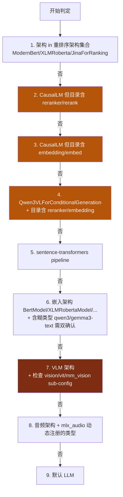
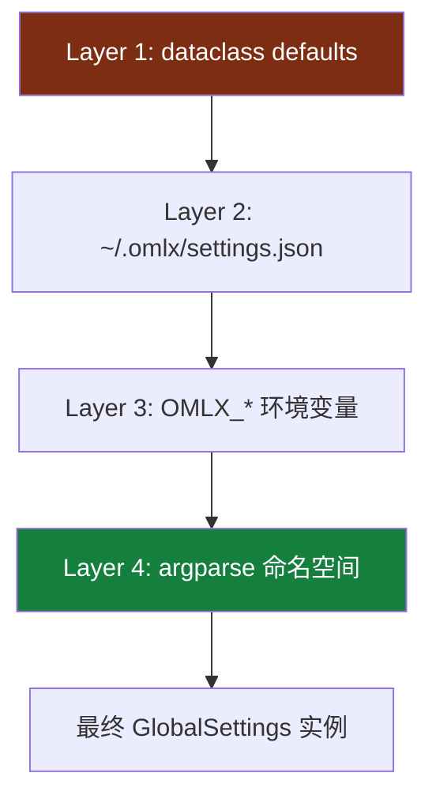

<details>
<summary>相关源文件</summary>

生成本页时使用的主要源文件：

- [omlx/model_discovery.py](../../../project-repos/omlx/omlx/model_discovery.py)
- [omlx/model_registry.py](../../../project-repos/omlx/omlx/model_registry.py)
- [omlx/model_settings.py](../../../project-repos/omlx/omlx/model_settings.py)
- [omlx/model_profiles.py](../../../project-repos/omlx/omlx/model_profiles.py)
- [omlx/settings.py](../../../project-repos/omlx/omlx/settings.py)
- [omlx/config.py](../../../project-repos/omlx/omlx/config.py)
- [omlx/admin/routes.py](../../../project-repos/omlx/omlx/admin/routes.py)
- [omlx/admin/auth.py](../../../project-repos/omlx/omlx/admin/auth.py)
- [omlx/admin/benchmark.py](../../../project-repos/omlx/omlx/admin/benchmark.py)
- [omlx/admin/hf_downloader.py](../../../project-repos/omlx/omlx/admin/hf_downloader.py)
- [omlx/admin/ms_downloader.py](../../../project-repos/omlx/omlx/admin/ms_downloader.py)
- [omlx/admin/vendor_deps.py](../../../project-repos/omlx/omlx/admin/vendor_deps.py)

</details>

# 模型管理与 Admin Dashboard

oMLX 不让用户手动告诉系统"我装了什么模型、是什么类型"。它扫描 `~/.omlx/models/`（或自定义路径），对每个子目录运行一套类型检测决策树，把模型分到 LLM/VLM/OCR/embedding/reranker/STT/TTS/STS 七类之一。这是必须自动的——本地用户不会逐个标注，且同一个 model_type 配置可能跑出完全不同的实际架构（一个 `Qwen3VLForConditionalGeneration` 既可能是 VLM 也可能是 reranker，靠目录名"reranker"字样区分）。

本页解释三个相关但独立的子系统：模型自动发现与分类、配置体系的四层优先级、Admin Dashboard 的工程实现（含 i18n 和离线友好的依赖管理）。

## 模型发现：从目录到 ModelInfo

`discover_models()`（[model_discovery.py:772-857](../../../project-repos/omlx/omlx/model_discovery.py#L772-L857)）支持四种目录布局：

| 布局 | 例子 |
|---|---|
| Flat | `~/models/Qwen3-7B/config.json` |
| Organized | `~/models/Qwen/Qwen3-7B/config.json` |
| HF Hub cache | `~/models/models--Qwen--Qwen3-7B/snapshots/<hash>/...` |
| Single-model | `--model-dir ~/models/Qwen3-7B`（指向单模型目录本身） |

HF Hub cache 布局解析靠 `_resolve_hf_cache_entry`（[model_discovery.py:688-709](../../../project-repos/omlx/omlx/model_discovery.py#L688-L709)），通过 `refs/main` 找当前活跃 snapshot。`discover_models_from_dirs` 合并多个 `--model-dir` 时**首位胜出**——同名模型在第一个 dir 找到就不再查后续 dir。

LoRA / PEFT adapter 目录被 `_is_adapter_dir`（检测 `adapter_config.json`）显式跳过，避免被误认为模型。

Sources: [omlx/model_discovery.py:688-857](../../../project-repos/omlx/omlx/model_discovery.py#L688-L857)

<details class="source-snippets">
<summary>引用源码</summary>

<!-- source-snippets:start -->

#### `omlx/model_discovery.py:688-857`

```python
def _resolve_hf_cache_entry(path: Path) -> tuple[Path, str] | None:
    """Resolve an HF Hub cache entry (models--Org--Name/) to its active snapshot.

    Returns (snapshot_path, model_name) or None if not a valid HF cache entry.
    """
    name = path.name
    if not name.startswith("models--") or name.count("--") < 2:
        return None

    # "models--Org--Name" → "Name"
    model_name = name.split("--", 2)[2]

    try:
        commit_hash = (path / "refs" / "main").read_text().strip()
    except OSError:
        return None

    snapshot = path / "snapshots" / commit_hash
    if not snapshot.is_dir():
        return None

    return snapshot, model_name


def _register_model(
    models: dict[str, DiscoveredModel],
    model_dir: Path,
    model_id: str,
) -> None:
    """Try to register a single model directory into the models dict."""
    try:
        if _is_unsupported_model(model_dir):
            logger.info(f"Skipping unsupported model: {model_id}")
            return

        model_type = detect_model_type(model_dir)
        if model_type == "embedding":
            engine_type: EngineType = "embedding"
        elif model_type == "reranker":
            engine_type = "reranker"
        elif model_type == "vlm":
            engine_type = "vlm"
        elif model_type == "audio_stt":
            engine_type = "audio_stt"
        elif model_type == "audio_tts":
            engine_type = "audio_tts"
        elif model_type == "audio_sts":
            engine_type = "audio_sts"
        else:
            engine_type = "batched"
        estimated_size = estimate_model_size(model_dir)

        # Read raw config model_type for sub-type detection (e.g., OCR models)
        config_model_type = ""
        try:
            import json
            with open(model_dir / "config.json") as f:
                config_model_type = json.load(f).get("model_type", "")
        except Exception:
            pass

        thinking_default = detect_thinking_default(model_dir)
        preserve_thinking_default = detect_preserve_thinking(model_dir)

        models[model_id] = DiscoveredModel(
            model_id=model_id,
            model_path=str(model_dir),
            model_type=model_type,
            engine_type=engine_type,
            estimated_size=estimated_size,
            config_model_type=config_model_type,
            thinking_default=thinking_default,
            preserve_thinking_default=preserve_thinking_default,
        )

        size_gb = estimated_size / (1024**3)
        logger.info(
            f"Discovered model: {model_id} "
            f"(type: {model_type}, engine: {engine_type}, size: {size_gb:.2f}GB)"
        )
    except Exception as e:
        logger.error(f"Failed to discover model {model_id}: {e}")


def discover_models(model_dir: Path) -> dict[str, DiscoveredModel]:
    """
    Scan model directory with two-level discovery.

    Supports both flat and organized directory layouts:

    Flat (one level):
        model_dir/
        ├── llama-3b/          → model_id: "llama-3b"
        │   ├── config.json
        │   └── *.safetensors
        └── qwen-7b/           → model_id: "qwen-7b"

    Organized (two levels):
        model_dir/
        ├── mlx-community/
        │   ├── llama-3b/      → model_id: "llama-3b"
        │   └── qwen-7b/       → model_id: "qwen-7b"
        └── Qwen/
            └── Qwen3-8B/      → model_id: "Qwen3-8B"

    If a first-level subdirectory has config.json, it's treated as a model.
    Otherwise, its children are scanned for models (organization folder).

    Args:
        model_dir: Path to directory containing model subdirectories

    Returns:
        Dictionary mapping model_id to DiscoveredModel
    """
    if not model_dir.exists():
        raise ValueError(f"Model directory does not exist: {model_dir}")

    if not model_dir.is_dir():
        raise ValueError(f"Model directory is not a directory: {model_dir}")

... snippet truncated ...
```

<!-- source-snippets:end -->
</details>

## 类型检测：9 层决策树

`detect_model_type()`（[model_discovery.py:398-553](../../../project-repos/omlx/omlx/model_discovery.py#L398-L553)）是 oMLX 最关键的"魔术"之一。9 层 if/elif，每层赢家的优先级最高：



几个非显然的层级值得展开讲：

**Layer 2-4：目录名启发式**。Qwen3-Reranker 跟普通 Qwen3-7B 的 `config.json` **完全相同**——只有 directory name 是唯一的区分器。`_is_causal_lm_reranker` 检测目录名包含 `"reranker"` 或 `"rerank"` 字符串就判定 reranker。Qwen3-Embedding 同理。这是一个"显然不优雅但必须如此"的妥协——上游模型作者没有在 config 中标注用途。

**Layer 6：歧义类型双确认**。`AMBIGUOUS_EMBEDDING_MODEL_TYPES = {"qwen3", "gemma3-text", ...}`。这些 model_type 既可能是 embedding 也可能是 LLM。oMLX 只在 model_type **和** 架构都匹配 embedding 时才判定 embedding，否则 fallthrough 到 LLM。

**Layer 7：VLM 与"文本-only 量化"陷阱**。`unsloth/gemma-4-31b-it-MLX-8bit` 这种包保留了 VLM 架构名（`Gemma4Vision...`）但删除了 vision 配置——视觉部分跑不起来。`_has_vision_subconfig()`（[model_discovery.py:375-395](../../../project-repos/omlx/omlx/model_discovery.py#L375-L395)）检查三种字段（`vision_config` / `vit_config` / `mm_vision_tower`），任何一个有就判定 VLM；都没有则 fallthrough 到 LLM 当文本模型用。

**Layer 8：动态音频类型**。`mlx_audio.{stt,tts,sts}.utils.MODEL_REMAPPING` 在 oMLX import 时**动态读取**（[model_discovery.py:188-240](../../../project-repos/omlx/omlx/model_discovery.py#L188-L240)），不存在静态 hardcode 集合。这样 mlx-audio 升级支持新模型时，oMLX 不需要改代码就能识别。`mlx_audio` 缺失时用 fallback 静态集合。

Sources: [omlx/model_discovery.py:398-553](../../../project-repos/omlx/omlx/model_discovery.py#L398-L553), [omlx/model_discovery.py:188-395](../../../project-repos/omlx/omlx/model_discovery.py#L188-L395)

<details class="source-snippets">
<summary>引用源码</summary>

<!-- source-snippets:start -->

#### `omlx/model_discovery.py:398-553`

```python
def detect_model_type(model_path: Path) -> ModelType:
    """
    Detect model type from config.json.

    Checks:
    1. architectures field for reranker-specific classes (SequenceClassification)
    2. CausalLM-based reranker/embedding detection (architecture + directory name)
    3. sentence-transformers pipeline detection via modules.json
    4. architectures field for embedding-specific classes
    5. model_type field against known embedding types (unambiguous only)
    6. VLM detection via architectures, model_type, or vision sub-config
       presence (``vision_config`` / ``vit_config`` / non-empty
       ``mm_vision_tower`` — see :func:`_has_vision_subconfig`)
    7. Audio model detection (STT/TTS/STS)

    Args:
        model_path: Path to model directory

    Returns:
        Model type: "llm", "vlm", "embedding", "reranker", "audio_stt", "audio_tts", or "audio_sts"
    """
    config_path = model_path / "config.json"
    if not config_path.exists():
        return "llm"

    try:
        with open(config_path) as f:
            config = json.load(f)
    except (json.JSONDecodeError, IOError):
        return "llm"

    # Check architectures field for reranker first (more specific)
    architectures = config.get("architectures", [])
    for arch in architectures:
        if arch in RERANKER_ARCHITECTURES:
            return "reranker"

    # Check for CausalLM-based rerankers (e.g., Qwen3-Reranker).
    # These use a standard CausalLM architecture but are fine-tuned for reranking
    # via yes/no logit scoring. Detected by architecture + model directory name hint.
    for arch in architectures:
        if arch in CAUSAL_LM_RERANKER_ARCHITECTURES:
            if _is_causal_lm_reranker(model_path):
                return "reranker"

    # Check for CausalLM-based embeddings (e.g., Qwen3-Embedding).
    # These use a standard CausalLM architecture but are fine-tuned for embeddings
    # and ship without lm_head weights. Detected by architecture + directory name hint.
    for arch in architectures:
        if arch in CAUSAL_LM_EMBEDDING_ARCHITECTURES:
            if _is_causal_lm_embedding(model_path):
                return "embedding"

    # Check for multimodal (VLM-based) rerankers and embeddings.
    # Same architecture string as VLM chat models; distinguished by the
    # directory name heuristic. Must come before VLM detection below so
    # the reranker/embedding hint wins over default VLM classification.
    for arch in architectures:
        if arch in MULTIMODAL_RERANKER_ARCHITECTURES and _is_causal_lm_reranker(model_path):
            return "reranker"
        if arch in MULTIMODAL_EMBEDDING_ARCHITECTURES and _is_causal_lm_embedding(model_path):
            return "embedding"

    if _has_sentence_transformers_embedding_pipeline(model_path):
        return "embedding"

    # Check architectures field for embedding (before model_type to avoid
    # false positives from ambiguous model types like qwen3, gemma3-text)
    for arch in architectures:
        if arch in EMBEDDING_ARCHITECTURES:
            return "embedding"

    # Check model_type field for unambiguous embedding types
    model_type = config.get("model_type", "")
    # Normalize: replace hyphens with underscores and lowercase
    normalized_type = model_type.lower().replace("-", "_")

    if normalized_type in EMBEDDING_MODEL_TYPES or model_type in EMBEDDING_MODEL_TYPES:
        return "embedding"

    # Ambiguous embedding types (have both embedding and LLM variants):
    # only classified as embedding if architecture matched above
    if (
        normalized_type in AMBIGUOUS_EMBEDDING_MODEL_TYPES
        or model_type in AMBIGUOUS_EMBEDDING_MODEL_TYPES
    ):
        logger.info(
            f"Model type '{model_type}' has both embedding and LLM variants, "
            f"but architecture {architectures} is not an embedding architecture "
            "— treating as LLM"
        )

    # Check for VLM: architectures field
    # Some text-only quants (e.g., unsloth/gemma-4-31b-it-MLX-8bit) keep the VLM
    # architecture name but strip vision_config and vision weights.
    # For model families known to have text-only variants, require evidence
    # of a vision sub-config — see :func:`_has_vision_subconfig` for the
    # three keys we accept (``vision_config``, ``vit_config``,
    # ``mm_vision_tower``).
    for arch in architectures:
        if arch in VLM_ARCHITECTURES:
            if normalized_type in VLM_MODEL_TYPES and not _has_vision_subconfig(config):
                logger.info(
                    f"Architecture '{arch}' is a VLM architecture but no "
                    "vision_config / vit_config / mm_vision_tower found — "
                    "treating as LLM (text-only quant)"
                )
                break
            return "vlm"

    # Check for VLM: model_type field (only if vision capabilities are present)
    # Some model families (e.g., qwen3_5_moe) have both VLM and text-only variants.
    # Text-only quants won't carry a vision sub-config.
    if normalized_type in VLM_MODEL_TYPES:
        if _has_vision_subconfig(config):
            return "vlm"
        logger.info(
            f"Model type '{model_type}' is in VLM_MODEL_TYPES but no "
            "vision_config / vit_config / mm_vision_tower found — "
            "treating as LLM (text-only quant)"
... snippet truncated ...
```

#### `omlx/model_discovery.py:188-395`

```python
def _build_audio_detection_sets():
    """Build STT/TTS/STS model-type sets from mlx-audio at import time.

    Returns (stt_types, tts_types, sts_types) where each is a set of
    model_type strings that should trigger audio detection.
    """
    try:
        from pathlib import Path as _P

        import mlx_audio as _mla

        _base = _P(_mla.__file__).parent

        def _dir_names(subdir: str) -> set:
            d = _base / subdir / "models"
            if d.is_dir():
                return {p.name for p in d.iterdir()
                        if p.is_dir() and not p.name.startswith("__")}
            return set()

        # TTS: MODEL_REMAPPING keys + model dir names
        from mlx_audio.tts.utils import MODEL_REMAPPING as _tts_remap
        tts = set(_tts_remap.keys()) | _dir_names("tts")

        # STT: MODEL_REMAPPING keys + model dir names
        from mlx_audio.stt.utils import MODEL_REMAPPING as _stt_remap
        stt = set(_stt_remap.keys()) | _dir_names("stt")

        # STS: model dir names only (no unified utils/remapping)
        sts = _dir_names("sts")

        # Strip base-LLM names that collide with audio model dirs
        tts -= _LLM_TYPE_COLLISIONS
        stt -= _LLM_TYPE_COLLISIONS

        logger.debug(
            "Audio detection sets loaded from mlx-audio: "
            "STT=%d, TTS=%d, STS=%d", len(stt), len(tts), len(sts),
        )
        return stt, tts, sts

    except Exception:
        logger.debug("mlx-audio not available — using static audio detection sets")
        # Static fallback so model discovery still works without mlx-audio
        _stt = {"whisper", "qwen3_asr", "parakeet", "qwen2_audio"}
        _tts = {"qwen3_tts", "kokoro", "chatterbox", "vibevoice", "vibevoice_streaming", "kugelaudio", "audiodit"}
        _sts = {"deepfilternet", "mossformer2_se", "sam_audio", "lfm_audio"}
        return _stt, _tts, _sts


AUDIO_STT_MODEL_TYPES, AUDIO_TTS_MODEL_TYPES, AUDIO_STS_MODEL_TYPES = (
    _build_audio_detection_sets()
)

# Architecture-based detection — these are checked before model_type and
# are always static because architecture strings are stable identifiers.
AUDIO_STT_ARCHITECTURES = {
    "WhisperForConditionalGeneration",
    "Qwen3ASRForConditionalGeneration",
    "ParakeetForCTC",
    "Qwen2AudioForConditionalGeneration",
}

AUDIO_TTS_ARCHITECTURES = {
    "KokoroForConditionalGeneration",
    "Qwen3TTSForConditionalGeneration",
    "ChatterboxForConditionalGeneration",
    "VibeVoiceForConditionalGeneration",
    "VibeVoiceStreamingForConditionalGenerationInference",
    "KugelAudioForConditionalGeneration",
}

AUDIO_STS_ARCHITECTURES = {
    "DeepFilterNetModel",
    "MossFormer2SEModel",
    "SAMAudio",
    "LFM2AudioModel",
}


@dataclass
class DiscoveredModel:
    """Information about a discovered model."""

    model_id: str  # Directory name (e.g., "llama-3b")
    model_path: str  # Full path to model directory
    model_type: ModelType  # "llm", "vlm", "embedding", or "reranker"
    engine_type: EngineType  # "batched", "vlm", "embedding", or "reranker"
    estimated_size: int  # Estimated memory usage in bytes
    config_model_type: str = ""  # Raw model_type from config.json (e.g., "deepseekocr_2")
    thinking_default: bool | None = None  # True if model thinks by default, False if not, None if unknown
    preserve_thinking_default: bool | None = None  # True when template supports preserve_thinking (Qwen 3.6+)


def _is_unsupported_model(model_path: Path) -> bool:
    """
    Check if model is an unsupported type that should be skipped during discovery.

    Audio models (STT/TTS) are NOT unsupported — they are detected as
    "audio_stt" or "audio_tts" by detect_model_type() and served via
    their own engine types.

    Only checks top-level config fields. Multimodal models with nested
    audio_config/tts_config (e.g., MiniCPM-o) are not affected.
    """
    config_path = model_path / "config.json"
    if not config_path.exists():
        return False

    try:
        with open(config_path) as f:
            config = json.load(f)
    except (json.JSONDecodeError, IOError):
        return False

    architectures = config.get("architectures", [])
    for arch in architectures:
        if arch in UNSUPPORTED_ARCHITECTURES:
            return True

... snippet truncated ...
```

<!-- source-snippets:end -->
</details>

## Thinking 检测：基于 chat template

模型支持 `<think>` 标签吗？默认开启还是关闭？这两个问题靠 chat template 自动检测（[model_discovery.py:556-633](../../../project-repos/omlx/omlx/model_discovery.py#L556-L633)）：

| 模板模式 | 含义 |
|---|---|
| `<no_think>` | Qwen 风格：thinking 默认 **ON**，禁用要显式 `enable_thinking=false` |
| `` | Gemma 风格：thinking 默认 **OFF**，启用要 `enable_thinking=true` |

`detect_preserve_thinking` 进一步处理 Qwen 3.6+ 的特殊情况：模板会"剥离历史 turn 中的 `<think>` 块"以省 token。但这会破坏 KV prefix cache——同样的 prompt 历史在不同时刻的拼接结果不同。`preserve_thinking=True` 默认强制保留，让前缀缓存可复用。

这两个检测让 oMLX 自动配置 sampling defaults，用户不需要手动告诉系统"这个模型应该开 thinking"。

Sources: [omlx/model_discovery.py:556-633](../../../project-repos/omlx/omlx/model_discovery.py#L556-L633)

<details class="source-snippets">
<summary>引用源码</summary>

<!-- source-snippets:start -->

#### `omlx/model_discovery.py:556-633`

```python
def detect_thinking_default(model_path: Path) -> bool | None:
    """Detect whether a model's chat template enables thinking by default.

    Inspects the Jinja chat template for ``enable_thinking`` references and
    determines the default behaviour:

    * **True** — model thinks by default (e.g. Qwen 3.x: only suppresses
      thinking when ``enable_thinking is false``).
    * **False** — model suppresses thinking by default (e.g. Gemma 4: only
      enables thinking when ``enable_thinking`` is truthy,
      ``default(false)``).
    * **None** — template does not reference ``enable_thinking`` (model has
      no thinking toggle).
    """
    # Try standalone Jinja file first, then tokenizer_config.json
    template_text = None
    jinja_path = model_path / "chat_template.jinja"
    if jinja_path.exists():
        with contextlib.suppress(OSError):
            template_text = jinja_path.read_text(encoding="utf-8")

    if template_text is None:
        tc_path = model_path / "tokenizer_config.json"
        if tc_path.exists():
            try:
                with open(tc_path) as f:
                    tc = json.load(f)
                template_text = tc.get("chat_template")
            except Exception:
                pass

    if not template_text or "enable_thinking" not in template_text:
        return None

    # Heuristic: if the template only disables thinking when explicitly
    # ``enable_thinking is false``, then thinking is ON by default.
    # If the template requires ``enable_thinking`` to be truthy or uses
    # ``default(false)``, then thinking is OFF by default.
    if "enable_thinking is false" in template_text:
        return True  # ON by default (Qwen pattern)
    if "default(false)" in template_text or "enable_thinking)" in template_text:
        return False  # OFF by default (Gemma pattern)

    return None


def detect_preserve_thinking(model_path: Path) -> bool | None:
    """Detect whether a model's chat template supports ``preserve_thinking``.

    Qwen 3.6+ templates strip ``<think>`` blocks from historical assistant
    turns by default and only keep them when ``preserve_thinking`` is true.
    Stripping breaks KV prefix cache reuse, so we default to True when the
    template supports this flag.

    Returns:
        True if the template references ``preserve_thinking`` (should be
        enabled), None otherwise (template has no such flag).
    """
    template_text = None
    jinja_path = model_path / "chat_template.jinja"
    if jinja_path.exists():
        with contextlib.suppress(OSError):
            template_text = jinja_path.read_text(encoding="utf-8")

    if template_text is None:
        tc_path = model_path / "tokenizer_config.json"
        if tc_path.exists():
            try:
                with open(tc_path) as f:
                    tc = json.load(f)
                template_text = tc.get("chat_template")
            except Exception:
                pass

    if not template_text or "preserve_thinking" not in template_text:
        return None

    return True
```

<!-- source-snippets:end -->
</details>

## 全局配置的四层优先级

`GlobalSettings`（[settings.py:691-718](../../../project-repos/omlx/omlx/settings.py#L691-L718)）由 17 个 sub-dataclass 组成：`ServerSettings`、`ModelSettings`、`MemorySettings`、`SchedulerSettings`、`CacheSettings`、`AuthSettings`、`MCPSettings`、`HuggingFaceSettings`、`ModelScopeSettings`、`NetworkSettings`、`SamplingSettings`、`LoggingSettings`、`ClaudeCodeSettings`、`IntegrationSettings`、`UISettings`、`ModelIdleTimeoutSettings`。

`GlobalSettings.load()`（[settings.py:720-758](../../../project-repos/omlx/omlx/settings.py#L720-L758)）走四层优先级：



每层覆盖前一层。CLI 在最上层——这是用户在终端敲的命令，理应最权威。

代码实现：

- **Layer 2** `_load_from_file()`（[settings.py:760-818](../../../project-repos/omlx/omlx/settings.py#L760-L818)）：按 section dispatch，未出现的 section 保持 defaults。**Schema 版本号** `"1.0"` 为未来 migration 留口子。
- **Layer 3** `_apply_env_overrides()`（[settings.py:820-907](../../../project-repos/omlx/omlx/settings.py#L820-L907)）：读 `OMLX_HOST` / `OMLX_PORT` / `OMLX_MODEL_DIR`（逗号分隔）/ `OMLX_MAX_MODEL_MEMORY` / `OMLX_API_KEY` / `OMLX_HTTP_PROXY` 等。类型转换有 defensive `try/except + log warning`。
- **Layer 4** `_apply_cli_overrides(args)`：用 `hasattr(args, ...) and args.x is not None` 判定。argparse 默认值都是 None，所以 `is not None` 等价于"用户显式指定"。

`OMLX_SECRET_KEY` 是特例——auth.py 自己读 env，优先级**高于** settings 文件，因为 secret key 不应该被持久化到 JSON。

Sources: [omlx/settings.py:691-907](../../../project-repos/omlx/omlx/settings.py#L691-L907)

<details class="source-snippets">
<summary>引用源码</summary>

<!-- source-snippets:start -->

#### `omlx/settings.py:691-907`

```python
class GlobalSettings:
    """
    Global settings for oMLX.

    Combines all settings sections and provides methods for:
    - Loading from file with CLI/env overrides
    - Saving to file
    - Directory management
    - Validation
    """

    base_path: Path = field(default_factory=lambda: DEFAULT_BASE_PATH)
    server: ServerSettings = field(default_factory=ServerSettings)
    model: ModelSettings = field(default_factory=ModelSettings)
    memory: MemorySettings = field(default_factory=MemorySettings)
    scheduler: SchedulerSettings = field(default_factory=SchedulerSettings)
    cache: CacheSettings = field(default_factory=CacheSettings)
    auth: AuthSettings = field(default_factory=AuthSettings)
    mcp: MCPSettings = field(default_factory=MCPSettings)
    huggingface: HuggingFaceSettings = field(default_factory=HuggingFaceSettings)
    modelscope: ModelScopeSettings = field(default_factory=ModelScopeSettings)
    network: NetworkSettings = field(default_factory=NetworkSettings)
    sampling: SamplingSettings = field(default_factory=SamplingSettings)
    logging: LoggingSettings = field(default_factory=LoggingSettings)
    claude_code: ClaudeCodeSettings = field(default_factory=ClaudeCodeSettings)
    integrations: IntegrationSettings = field(default_factory=IntegrationSettings)
    ui: UISettings = field(default_factory=UISettings)
    idle_timeout: ModelIdleTimeoutSettings = field(default_factory=ModelIdleTimeoutSettings)

    @classmethod
    def load(
        cls,
        base_path: str | Path | None = None,
        cli_args: Any | None = None,
    ) -> GlobalSettings:
        """
        Load settings with priority hierarchy: CLI > env > file > defaults.

        Args:
            base_path: Base directory for oMLX (default: ~/.omlx).
            cli_args: Argparse namespace with CLI arguments.

        Returns:
            Loaded GlobalSettings instance.
        """
        # Resolve base path
        if base_path:
            resolved_base = Path(base_path).expanduser().resolve()
        else:
            resolved_base = DEFAULT_BASE_PATH

        # Start with defaults
        settings = cls(base_path=resolved_base)

        # Load from file if exists
        settings_file = resolved_base / "settings.json"
        if settings_file.exists():
            settings._load_from_file(settings_file)
            logger.debug(f"Loaded settings from {settings_file}")

        # Apply environment variable overrides
        settings._apply_env_overrides()

        # Apply CLI argument overrides
        if cli_args:
            settings._apply_cli_overrides(cli_args)

        return settings

    def _load_from_file(self, path: Path) -> None:
        """
        Load settings from a JSON file.

        Args:
            path: Path to the settings JSON file.
        """
        try:
            with open(path, encoding="utf-8") as f:
                data = json.load(f)

            # Check version for future migrations
            version = data.get("version", "1.0")
            if version != SETTINGS_VERSION:
                logger.info(
                    f"Settings file version {version} differs from "
                    f"current {SETTINGS_VERSION}, migrating..."
                )

            # Load each section
            if "server" in data:
                self.server = ServerSettings.from_dict(data["server"])
            if "model" in data:
                self.model = ModelSettings.from_dict(data["model"])
            if "memory" in data:
                self.memory = MemorySettings.from_dict(data["memory"])
            if "scheduler" in data:
                self.scheduler = SchedulerSettings.from_dict(data["scheduler"])
            if "cache" in data:
                self.cache = CacheSettings.from_dict(data["cache"])
            if "auth" in data:
                self.auth = AuthSettings.from_dict(data["auth"])
            if "mcp" in data:
                self.mcp = MCPSettings.from_dict(data["mcp"])
            if "huggingface" in data:
                self.huggingface = HuggingFaceSettings.from_dict(data["huggingface"])
            if "modelscope" in data:
                self.modelscope = ModelScopeSettings.from_dict(data["modelscope"])
            if "network" in data:
                self.network = NetworkSettings.from_dict(data["network"])
            if "sampling" in data:
                self.sampling = SamplingSettings.from_dict(data["sampling"])
            if "logging" in data:
                self.logging = LoggingSettings.from_dict(data["logging"])
            if "claude_code" in data:
                self.claude_code = ClaudeCodeSettings.from_dict(data["claude_code"])
            if "integrations" in data:
                self.integrations = IntegrationSettings.from_dict(
                    data["integrations"]
                )
            if "ui" in data:
... snippet truncated ...
```

<!-- source-snippets:end -->
</details>

## "auto" 字面量与解析

几个关键 settings 接受 `"auto"` 字面量：

| Setting | "auto" 解析 |
|---|---|
| `max_model_memory` | 90% × (total RAM − adaptive reserve)，reserve 是 `clamp(20% × total, 2GB, 8GB)` |
| `max_process_memory` | total RAM − 8GB |
| `paged_ssd_cache_max_size` | 10% of SSD capacity |
| `hot_cache_max_size` | 0（默认不启用） |

`config.parse_size()`（[config.py:18-50](../../../project-repos/omlx/omlx/config.py#L18-L50)）解析 `"32GB"` / `"100MB"` / 原始 bytes 等格式。`"disabled"` 是另一种特殊值，意味着关掉对应限制。

`ModelSettings.get_max_model_memory_bytes()`（[settings.py:174-189](../../../project-repos/omlx/omlx/settings.py#L174-L189)）实现"auto"的解析。`_adaptive_system_reserve` 让 reserve 大小跟 RAM 总量挂钩——256GB 的 Mac Pro 不应该只留 2GB，96GB 的 MBP 不应该留 8GB 全用上。

`max_model_memory_bytes = total_ram * 0.9 - clamp(total_ram * 0.2, 2GB, 8GB)` 在 16GB Mac Mini 上是 `14.4GB - 2GB = 12.4GB`，在 256GB Mac Pro 上是 `230.4GB - 8GB = 222.4GB`——可用空间随 RAM 自适应。

Sources: [omlx/settings.py:174-189](../../../project-repos/omlx/omlx/settings.py#L174-L189), [omlx/config.py:18-50](../../../project-repos/omlx/omlx/config.py#L18-L50)

<details class="source-snippets">
<summary>引用源码</summary>

<!-- source-snippets:start -->

#### `omlx/settings.py:174-189`

```python
    def get_max_model_memory_bytes(self) -> int | None:
        """
        Get max model memory in bytes, or None if disabled.

        Returns:
            Max model memory in bytes (90% of usable RAM if "auto"),
            or None if disabled (no limit).
        """
        value = self.max_model_memory.strip().lower()
        if value == "disabled":
            return None
        if value == "auto":
            total = get_system_memory()
            reserve = _adaptive_system_reserve(total)
            return max(1 * 1024**3, int((total - reserve) * 0.9))
        return parse_size(self.max_model_memory)
```

#### `omlx/config.py:18-50`

```python
def parse_size(size_str: str) -> int:
    """
    Parse a human-readable size string to bytes.

    Args:
        size_str: Size string like "100GB", "50MB", "1TB".

    Returns:
        Size in bytes.
    """
    size_str = size_str.strip().upper()

    units = {
        "B": 1,
        "KB": 1024,
        "MB": 1024**2,
        "GB": 1024**3,
        "TB": 1024**4,
    }

    for unit, multiplier in units.items():
        if size_str.endswith(unit):
            try:
                value = float(size_str[: -len(unit)])
                return int(value * multiplier)
            except ValueError:
                pass

    # Try parsing as plain number (bytes)
    try:
        return int(size_str)
    except ValueError:
        raise ValueError(f"Invalid size string: {size_str}")
```

<!-- source-snippets:end -->
</details>

## 每模型配置

`ModelSettings`（[model_settings.py:32-244](../../../project-repos/omlx/omlx/model_settings.py#L32-L244)）是**每模型**的覆盖层，存在 `~/.omlx/model_settings.json`。它的字段全部 `Optional`，`None` 表示用全局默认。

```python
@dataclass
class ModelSettings:
    sampling: Optional[SamplingParams] = None   # 推断时的温度/top_k 等
    chat_template_kwargs: Optional[dict] = None  # enable_thinking 等
    alias: Optional[str] = None                  # /v1/models 显示的别名
    model_type_override: Optional[str] = None    # 强制类型 llm/vlm
    idle_timeout: Optional[int] = None           # 闲置 N 秒自动卸载
    pinned: bool = False                          # 不被 LRU 驱逐
    mtp_enabled: bool = False
    dflash_enabled: bool = False
    vlm_mtp_enabled: bool = False
    turboquant_kv_enabled: bool = False
    ...
```

`__post_init__`（[model_settings.py:182-200](../../../project-repos/omlx/omlx/model_settings.py#L182-L200)）做关键 cross-check：四个推测路径互斥，至多一个为 True。这避免用户在 UI 上误开多个加速路径冲突。

`ModelSettingsManager` 还合并 `model_profiles.json`（共享 profile 模板）和 `global_templates.json`（默认值），让用户可以"把一组 sampling 参数命名为 profile"再批量应用。

Sources: [omlx/model_settings.py:32-244](../../../project-repos/omlx/omlx/model_settings.py#L32-L244)

<details class="source-snippets">
<summary>引用源码</summary>

<!-- source-snippets:start -->

#### `omlx/model_settings.py:32-244`

```python
class ModelSettings:
    """Per-model configuration settings.

    Attributes:
        max_context_window: Maximum prompt token count before rejection (None = use global default).
        max_tokens: Maximum number of tokens to generate (None = use global default).
        temperature: Sampling temperature (None = use global default).
        top_p: Nucleus sampling probability (None = use global default).
        top_k: Top-k sampling parameter (None = use global default).
        min_p: Minimum probability threshold (None = use global default).
        repetition_penalty: Repetition penalty (None = use default 1.0, i.e. disabled).
        presence_penalty: Presence penalty (None = use global default).
        force_sampling: Force sampling even with temperature=0.
        max_tool_result_tokens: Maximum tokens in tool result (None = use global default).
        chat_template_kwargs: Extra chat template keyword arguments.
        forced_ct_kwargs: Keys in chat_template_kwargs that cannot be overridden.
        ttl_seconds: Auto-unload after idle seconds (None = no TTL).
        model_type_override: "llm", "vlm", "embedding", "reranker", or None (auto-detect).
        model_alias: API-visible alternative to the directory name.
        index_cache_freq: IndexCache: every Nth layer keeps indexer (DSA models only).
        enable_thinking: Explicit toggle for thinking/reasoning mode (None = auto).
        thinking_budget_enabled: Whether a thinking token budget is active.
        thinking_budget_tokens: Max tokens for thinking/reasoning.
        reasoning_parser: xgrammar builtin name: "qwen", "harmony", "llama", etc.
        turboquant_kv_enabled: Enable TurboQuant KV cache compression.
        turboquant_kv_bits: TurboQuant bit depth (2/2.5/3/3.5/4/6/8).
        turboquant_skip_last: Skip last KVCache layer to prevent corruption.
        specprefill_enabled: Enable SpecPrefill (experimental sparse prefill for MoE).
        specprefill_draft_model: Path to draft model for SpecPrefill.
        specprefill_keep_pct: Keep rate for SpecPrefill (0.1–0.5).
        specprefill_threshold: Min tokens to trigger SpecPrefill.
        dflash_enabled: Enable DFlash speculative decoding.
        dflash_draft_model: Path/repo for DFlash draft checkpoint.
        dflash_draft_quant_enabled: Enable draft model quantization.
        dflash_draft_quant_weight_bits: Quantization weight bits (2, 4, 8).
        dflash_draft_quant_activation_bits: Quantization activation bits (16, 32).
        dflash_draft_quant_group_size: Quantization group size (32, 64, 128).
        dflash_max_ctx: Token threshold to fall back to BatchedEngine (None = unlimited).
        dflash_in_memory_cache: Enable DFlash L1 (RAM) prefix cache.
        dflash_in_memory_cache_max_entries: L1 cache max entries (default 4, matches dflash balanced profile).
        dflash_in_memory_cache_max_bytes: L1 cache byte budget.
        dflash_ssd_cache: Enable DFlash L2 (SSD) prefix cache spill (uses omlx SSD cache dir).
        dflash_ssd_cache_max_bytes: L2 (SSD) disk budget; dflash evicts oldest entries when exceeded.
        dflash_draft_window_size: Draft model sliding-attention window (None = dflash default 1024).
            Helps stabilise acceptance rate on long-context prompts.
        dflash_draft_sink_size: Attention-sink tokens always kept regardless of window
            (None = dflash default 64).
        dflash_verify_mode: Verifier algorithm — "dflash", "adaptive", "ddtree", or "off"
            (None = dflash default "adaptive"). "adaptive" can shrink block size when
            acceptance drops.
        mtp_enabled: Enable native multi-token prediction (mlx-lm PR 990 / PR 15 monkey-patch).
            When True, the BatchGenerator uses an MTP draft+verify path for single-request
            decoding. Compatible model_types: qwen3_5*, qwen3_6*, deepseek_v4*. Mutually
            exclusive with dflash_enabled and turboquant_kv_enabled. Concurrent requests on
            the same model fall back to standard continuous batching automatically.
        vlm_mtp_enabled: Enable VLM MTP speculative decoding via an external assistant
            drafter (mlx-vlm 191d7c8+). Target = Gemma4 VLM body, drafter must be a
            "gemma4_assistant" model.
        vlm_mtp_draft_model: Path/repo of the assistant drafter (e.g. "gemma-4-26B-A4B-it-assistant").
        vlm_mtp_draft_block_size: Tokens drafted per round (None = mlx-vlm default).
        is_pinned: Keep model loaded in memory.
        is_default: Use this model when no model is specified.
        display_name: Human-readable name for UI display.
        description: Optional description of the model.
        active_profile_name: Name of the currently-applied profile (None = no profile).
    """

    # Sampling parameters (None means use global default)
    max_context_window: Optional[int] = None
    max_tokens: Optional[int] = None
    temperature: Optional[float] = None
    top_p: Optional[float] = None
    top_k: Optional[int] = None
    repetition_penalty: Optional[float] = None
    min_p: Optional[float] = None
    presence_penalty: Optional[float] = None
    force_sampling: bool = False
    max_tool_result_tokens: Optional[int] = None
    chat_template_kwargs: Optional[Dict[str, Any]] = None
    forced_ct_kwargs: Optional[list[str]] = None  # Keys that cannot be overridden by API requests
    ttl_seconds: Optional[int] = None  # Auto-unload after idle seconds (None = no TTL)
    model_type_override: Optional[str] = None  # "llm", "vlm", "embedding", "reranker", or None (auto-detect)
    model_alias: Optional[str] = None  # API-visible name (alternative to directory name)
    index_cache_freq: Optional[int] = None  # IndexCache: every Nth layer keeps indexer (DSA models only)
    enable_thinking: Optional[bool] = None  # Explicit toggle for thinking/reasoning mode (None = auto)
    preserve_thinking: Optional[bool] = None  # Keep <think> blocks in historical turns (None = auto, True when template supports it)
    thinking_budget_enabled: bool = False
    thinking_budget_tokens: Optional[int] = None
    reasoning_parser: Optional[str] = None  # xgrammar builtin name: "qwen", "harmony", "llama", etc.

    # TurboQuant KV cache (mlx-vlm backend)
    turboquant_kv_enabled: bool = False
    turboquant_kv_bits: float = 4  # 2, 2.5, 3, 3.5, 4, 6, 8
    turboquant_skip_last: bool = True  # Skip last KVCache layer (prevents corruption on sensitive models)

    # SpecPrefill (experimental: attention-based sparse prefill for MoE models)
    specprefill_enabled: bool = False
    specprefill_draft_model: Optional[str] = None  # Path to draft model (must share tokenizer)
    specprefill_keep_pct: Optional[float] = None  # Keep rate (0.1-0.5, default 0.2)
    specprefill_threshold: Optional[int] = None  # Min tokens to trigger (default 8192)

    # DFlash (block diffusion speculative decoding)
    dflash_enabled: bool = False
    dflash_draft_model: Optional[str] = None  # Path/repo for DFlash draft checkpoint
    dflash_draft_quant_enabled: Optional[bool] = None
    dflash_draft_quant_weight_bits: Optional[int] = None  # 2, 4, 8
    dflash_draft_quant_activation_bits: Optional[int] = None  # 16, 32
    dflash_draft_quant_group_size: Optional[int] = None  # 32, 64, 128
    dflash_max_ctx: Optional[int] = None  # None = unlimited; trigger BatchedEngine fallback when prompt_len >= this
    # DFlash prefix cache (private to dflash; separate from omlx tiered cache because
    # snapshots include draft model GDN state and target hidden chunks omlx never tracks)
    dflash_in_memory_cache: bool = True
    dflash_in_memory_cache_max_entries: int = 4  # Matches dflash balanced profile default
    dflash_in_memory_cache_max_bytes: int = 8 * 1024 * 1024 * 1024  # 8 GiB (balanced profile default)
    dflash_ssd_cache: bool = False  # Requires in-memory cache and an omlx paged SSD cache dir
    dflash_ssd_cache_max_bytes: int = 20 * 1024 * 1024 * 1024  # 20 GiB L2 disk budget
    # DFlash runtime tuning knobs. None = let dflash-mlx pick its own DEFAULT_RUNTIME_CONFIG
    # value (currently window=1024, sink=64, verify_mode="adaptive"). Surfaced for long-context
    # agentic workloads where acceptance drops on the default sliding window.
    dflash_draft_window_size: Optional[int] = None
... snippet truncated ...
```

<!-- source-snippets:end -->
</details>

## Admin Dashboard：单文件 FastAPI sub-app

`omlx/admin/` 是个自包含的子 app，挂载在主 FastAPI 上。`routes.py` 5491 行，是这部分的 control plane。设计哲学：

- **每个 action 都有 Pydantic 模型**（[admin/routes.py:58-340](../../../project-repos/omlx/omlx/admin/routes.py#L58-L340)）做请求验证
- **"apply" helper 函数**（[routes.py:493-895](../../../project-repos/omlx/omlx/admin/routes.py#L493-L895)）支持运行时改设置而不重启——改 log level、改 model dirs、改 cache 大小、改 sampling 默认值都立即生效
- **依赖注入隔离**：`set_admin_getters`（[routes.py:974-997](../../../project-repos/omlx/omlx/admin/routes.py#L974-L997)）把 `ServerState`/`EnginePool`/`ModelSettingsManager`/`GlobalSettings` 通过 getter 注入，让 admin routes 在测试中可单独 mock

主要 endpoint：

| 路由 | 功能 |
|---|---|
| `GET /admin/dashboard` | 仪表盘 HTML |
| `POST /api/login` | 登录 |
| `POST /api/setup-api-key` | 首次设置 API key |
| `GET /admin/chat` | 内置聊天界面 |
| `POST /api/models/{id}/load` | 手动加载 |
| `POST /api/models/{id}/unload` | 手动卸载 |
| `POST /api/models/{id}/pin` | 钉住模型 |
| `POST /api/settings/global` | 修改全局设置 |
| `POST /api/settings/model/{id}` | 修改每模型设置 |
| `POST /api/benchmark/start` | 启动 benchmark 任务 |
| `POST /api/accuracy/start` | 启动准确率评估 |
| `POST /api/oq/start` | 启动 oQ 量化 |
| `POST /api/download/hf` | HF 模型下载 |

Sources: [omlx/admin/routes.py:58-997](../../../project-repos/omlx/omlx/admin/routes.py#L58-L997)

<details class="source-snippets">
<summary>引用源码</summary>

<!-- source-snippets:start -->

#### `omlx/admin/routes.py:58-997`

```python
class LoginRequest(BaseModel):
    """Request model for admin login."""

    api_key: str
    remember: bool = False


class SetupApiKeyRequest(BaseModel):
    """Request model for initial API key setup."""

    api_key: str
    api_key_confirm: str


class CreateSubKeyRequest(BaseModel):
    """Request model for creating a sub API key."""

    key: str
    name: str = ""


class DeleteSubKeyRequest(BaseModel):
    """Request model for deleting a sub API key."""

    key: str


class CacheProbeRequest(BaseModel):
    """Request model for probing per-prompt cache state.

    Tokenizes a chat message list with the target model's tokenizer, then
    classifies each block's location in the cache hierarchy:
    - Hot SSD (in-RAM copy of SSD cache, ready to mount without disk read)
    - Disk SSD (persisted only, needs disk read to reuse)
    - Cold (fully uncached — would require full prefill)
    """

    model_id: str
    messages: list[dict[str, Any]]
    tools: list[dict[str, Any]] | None = None
    chat_template_kwargs: dict[str, Any] | None = None


class ModelSettingsRequest(BaseModel):
    """Request model for updating per-model settings."""

    model_alias: str | None = None
    model_type_override: str | None = None
    max_context_window: int | None = None
    max_tokens: int | None = None
    temperature: float | None = None
    top_p: float | None = None
    top_k: int | None = None
    repetition_penalty: float | None = None
    min_p: float | None = None
    presence_penalty: float | None = None
    force_sampling: bool | None = None
    max_tool_result_tokens: int | None = None
    chat_template_kwargs: dict[str, Any] | None = None
    forced_ct_kwargs: list[str] | None = None
    ttl_seconds: int | None = None
    index_cache_freq: int | None = None
    enable_thinking: bool | None = None
    thinking_budget_enabled: bool | None = None
    thinking_budget_tokens: int | None = None
    # TurboQuant KV cache (mlx-vlm backend)
    turboquant_kv_enabled: bool | None = None
    turboquant_kv_bits: float | None = None
    # SpecPrefill (experimental)
    specprefill_enabled: bool | None = None
    specprefill_draft_model: str | None = None
    specprefill_keep_pct: float | None = None
    specprefill_threshold: int | None = None
    # DFlash (block diffusion speculative decoding)
    dflash_enabled: bool | None = None
    dflash_draft_model: str | None = None
    dflash_draft_quant_enabled: bool | None = None
    dflash_draft_quant_weight_bits: int | None = None
    dflash_draft_quant_activation_bits: int | None = None
    dflash_draft_quant_group_size: int | None = None
    dflash_max_ctx: int | None = None
    dflash_in_memory_cache: bool | None = None
    dflash_in_memory_cache_max_entries: int | None = None
    dflash_in_memory_cache_max_bytes: int | None = None
    dflash_ssd_cache: bool | None = None
    dflash_ssd_cache_max_bytes: int | None = None
    dflash_draft_window_size: int | None = None
    dflash_draft_sink_size: int | None = None
    dflash_verify_mode: str | None = None
    # Native MTP (mlx-lm PR 990 / PR 15 monkey-patch)
    mtp_enabled: bool | None = None
    # VLM MTP speculative decoding via external assistant drafter (mlx-vlm 191d7c8+)
    vlm_mtp_enabled: bool | None = None
    vlm_mtp_draft_model: str | None = None
    vlm_mtp_draft_block_size: int | None = None
    reasoning_parser: str | None = None
    is_pinned: bool | None = None
    is_default: bool | None = None
    # Security: per-model opt-in for trust_remote_code (issue #926)
    trust_remote_code: bool | None = None


class CreateProfileRequest(BaseModel):
    """Request body for creating a per-model profile."""
    name: str
    display_name: str
    description: str | None = None
    settings: dict[str, Any] = Field(default_factory=dict)
    also_save_as_template: bool = False
    source_template: str | None = None


class UpdateProfileRequest(BaseModel):
    """Request body for updating/renaming a per-model profile."""
    new_name: str | None = None
    display_name: str | None = None
    description: str | None = None
    settings: dict[str, Any] | None = None
    source_template: str | None = None
    also_save_as_template: bool = False
... snippet truncated ...
```

<!-- source-snippets:end -->
</details>

## Admin 认证：双时长 + 二次解码

`omlx/admin/auth.py`：用 `itsdangerous.URLSafeTimedSerializer` 给 session cookie 签名。

Secret key 优先级：

1. `OMLX_SECRET_KEY` 环境变量
2. `init_auth(secret_key=...)` 参数
3. 随机 `secrets.token_hex(32)`——这是 fail-closed 行为：用户没显式配置时 secret 每次重启都变，所有 session 失效

两种 session 时长：

- `SESSION_MAX_AGE = 86400`（24h）— 默认
- `REMEMBER_ME_MAX_AGE = 2592000`（30d）— 用户勾"记住我"

**有趣的双解码**（[auth.py:94-107](../../../project-repos/omlx/omlx/admin/auth.py#L94-L107)）：单个 secret 同时给两种 max_age 用。`remember` 标志被编码到 JWT payload 里。验证流程：

```python
# 1. 无过期解码，只为读 remember 字段
data = serializer.loads(cookie, max_age=None)
remember = data.get("remember", False)

# 2. 用对应 max_age 再次验证
max_age = REMEMBER_ME_MAX_AGE if remember else SESSION_MAX_AGE
data = serializer.loads(cookie, max_age=max_age)  # 真正校验过期
```

这避免了用两个 secret key 或 cookie 里 plain text 写 expiry。

Sub-keys 设计：`verify_any_api_key`（[auth.py:136-159](../../../project-repos/omlx/omlx/admin/auth.py#L136-L159)）允许多个 API key 同时有效（主 + 多个子 key），但**子 key 不能登录 admin** ——登录走 `verify_api_key` 只认主 key。这让团队场景下可以给同事发 sub-key 用 API，但他们不能进 admin 改设置。

Sources: [omlx/admin/auth.py:25-239](../../../project-repos/omlx/omlx/admin/auth.py#L25-L239)

<details class="source-snippets">
<summary>引用源码</summary>

<!-- source-snippets:start -->

#### `omlx/admin/auth.py:25-239`

```python
SECRET_KEY = os.environ.get("OMLX_SECRET_KEY") or secrets.token_hex(32)

# Initialize the serializer for creating and verifying session tokens
_serializer = URLSafeTimedSerializer(SECRET_KEY)

# Global settings getter (set by init_auth)
_get_global_settings = None


def init_auth(secret_key: str, global_settings_getter=None) -> None:
    """Initialize authentication with a persistent secret key.

    Should be called during server startup with the secret key from settings.
    Environment variable OMLX_SECRET_KEY takes priority if set.

    Args:
        secret_key: The secret key from settings.json for signing tokens.
        global_settings_getter: Optional callable that returns GlobalSettings.
    """
    global _serializer, SECRET_KEY, _get_global_settings
    # Environment variable takes priority over settings
    key = os.environ.get("OMLX_SECRET_KEY") or secret_key
    SECRET_KEY = key
    _serializer = URLSafeTimedSerializer(key)
    if global_settings_getter is not None:
        _get_global_settings = global_settings_getter


def create_session_token(remember: bool = False) -> str:
    """Create a signed session token for admin authentication.

    Args:
        remember: If True, the token payload includes a remember flag
                  for extended session duration (30 days).

    Returns:
        A URL-safe signed token string containing admin session data.

    Example:
        >>> token = create_session_token()
        >>> verify_session_token(token)
        True
    """
    payload = {"admin": True, "remember": remember}
    return _serializer.dumps(payload)


def verify_session_token(token: str, max_age: int = SESSION_MAX_AGE) -> bool:
    """Verify and decode a session token.

    The max_age is determined by the token's remember flag:
    - remember=True: 30 days
    - remember=False (default): 24 hours

    Args:
        token: The signed session token to verify.
        max_age: Maximum age of the token in seconds. Defaults to 24 hours.
                 This is overridden by the token's remember flag.

    Returns:
        True if the token is valid and not expired, False otherwise.

    Example:
        >>> token = create_session_token()
        >>> verify_session_token(token)
        True
        >>> verify_session_token("invalid_token")
        False
    """
    try:
        # First load without max_age check to read the remember flag
        data = _serializer.loads(token, max_age=None)
        if data.get("admin", False) is not True:
            return False

        # Determine the appropriate max_age based on remember flag
        effective_max_age = (
            REMEMBER_ME_MAX_AGE if data.get("remember", False) else max_age
        )

        # Re-validate with the correct max_age
        data = _serializer.loads(token, max_age=effective_max_age)
        return data.get("admin", False) is True
    except (BadSignature, SignatureExpired):
        return False


def verify_api_key(api_key: str, server_api_key: str) -> bool:
    """Verify an API key using constant-time comparison.

    This function uses secrets.compare_digest to prevent timing attacks
    when comparing the provided API key with the server's API key.

    Args:
        api_key: The API key provided by the client.
        server_api_key: The server's configured API key.

    Returns:
        True if the API keys match, False otherwise.

    Example:
        >>> verify_api_key("secret123", "secret123")
        True
        >>> verify_api_key("wrong", "secret123")
        False
    """
    if not api_key or not server_api_key:
        return False
    return secrets.compare_digest(api_key, server_api_key)


def verify_any_api_key(api_key: str, main_key: str, sub_keys: list) -> bool:
    """Verify an API key against the main key and all sub keys.

    Uses constant-time comparison for each key to prevent timing attacks.
    Checks the main key first, then iterates through sub keys.

    Args:
        api_key: The API key provided by the client.
        main_key: The server's main API key.
... snippet truncated ...
```

<!-- source-snippets:end -->
</details>

## Jinja2 模板与 i18n

模板用 Jinja2（FastAPI 的 `Jinja2Templates`）。布局：

- `templates/base.html` — 共享 layout，按 `current_lang` 条件加载 Noto Sans CJK CSS 防止非 CJK 用户白白多加载字体
- `templates/dashboard.html` — 主 SPA，含 6 个 tab：`_status` / `_settings` / `_models` / `_logs` / `_bench` / `_bench_accuracy`，用 Alpine.js 控制
- `templates/dashboard/_modal_model_settings.html` — 模型设置弹窗

i18n 用扁平 dot-notation 键（`login.setup.heading`）。Locale 文件在 `i18n/{en,es,fr,ja,ko,ru,zh,zh-TW}.json`。`_refresh_i18n_globals()`（[routes.py:945-957](../../../project-repos/omlx/omlx/admin/routes.py#L945-L957)）在切换语言时重新绑定 Jinja 的 `t` 函数——**完整模板重渲染**而非客户端动态翻译。同时 locale dict 被序列化到 `locale_json` 让客户端 JS 翻译动态字符串。

English 始终是 fallback（[routes.py:924-933](../../../project-repos/omlx/omlx/admin/routes.py#L924-L933)），任何 key 在当前 locale 找不到时 fallthrough。

Sources: [omlx/admin/routes.py:924-997](../../../project-repos/omlx/omlx/admin/routes.py#L924-L997)

<details class="source-snippets">
<summary>引用源码</summary>

<!-- source-snippets:start -->

#### `omlx/admin/routes.py:924-997`

```python
def _load_locale(language: str) -> dict:
    """Load locale dict for a given language code. Falls back to en on error."""
    path = _i18n_dir / f"{language}.json"
    try:
        return json.loads(path.read_text(encoding="utf-8"))
    except Exception:
        try:
            return json.loads((_i18n_dir / "en.json").read_text(encoding="utf-8"))
        except Exception:
            return {}


def _make_t(locale: dict):
    """Return a Jinja2-compatible t() function for the given locale dict."""

    def t(key: str) -> str:
        return locale.get(key, key)

    return t


def _refresh_i18n_globals() -> None:
    """Reload i18n globals from current settings. Called on startup and language change."""
    lang = "en"
    try:
        settings = _get_global_settings() if _get_global_settings else None
        if settings:
            lang = settings.ui.language
    except Exception:
        pass
    locale = _load_locale(lang)
    templates.env.globals["t"] = _make_t(locale)
    templates.env.globals["locale_json"] = json.dumps(locale, ensure_ascii=False)
    templates.env.globals["current_lang"] = lang


# =============================================================================
# State Getters (set by server.py)
# =============================================================================

_get_server_state = None
_get_engine_pool = None
_get_settings_manager = None
_get_global_settings = None
_hf_downloader = None
_ms_downloader = None
_oq_manager = None
_hf_uploader = None


def set_admin_getters(
    state_getter,
    pool_getter,
    settings_manager_getter,
    global_settings_getter,
):
    """
    Set the getter functions for accessing server state.

    This function must be called during server initialization to provide
    access to the server state objects.

    Args:
        state_getter: Function that returns the ServerState instance.
        pool_getter: Function that returns the EnginePool instance.
        settings_manager_getter: Function that returns the ModelSettingsManager.
        global_settings_getter: Function that returns the GlobalSettings.
    """
    global _get_server_state, _get_engine_pool, _get_settings_manager, _get_global_settings
    _get_server_state = state_getter
    _get_engine_pool = pool_getter
    _get_settings_manager = settings_manager_getter
    _get_global_settings = global_settings_getter
    _refresh_i18n_globals()
```

<!-- source-snippets:end -->
</details>

## 完全离线友好的前端依赖

最值得一提的设计是 `vendor_deps.py`（[admin/vendor_deps.py](../../../project-repos/omlx/omlx/admin/vendor_deps.py)）——把所有前端依赖打包进 admin/static/ 而不依赖 CDN：

| 依赖 | 版本 | 用途 |
|---|---|---|
| Alpine.js | 3.14.8 | 客户端 reactivity |
| Lucide icons | — | 图标 |
| Marked + marked-highlight | — | Markdown 渲染 |
| Highlight.js | + Python/JS/Bash/JSON | 代码高亮 |
| KaTeX | 0.16.9 + 20 字体 | 数学公式 |
| Inter | 6 weights | 主字体 |
| Noto Sans SC/TC/KR/JP | 3 weights × 4 | CJK 字体 |

`vendor_deps.py` 在 build/dev 时下载这些资源，生成 `@font-face` CSS（[vendor_deps.py:156-227](../../../project-repos/omlx/omlx/admin/vendor_deps.py#L156-L227)）。运行时**零 CDN 依赖**——用户在无网络环境（飞机上、内网）也能用 admin。

Tailwind 同样无 Node.js 化：`build_css.py` 下载 Tailwind v3.4.17 的 platform-specific **standalone 二进制**（[admin/build_css.py:23-53](../../../project-repos/omlx/omlx/admin/build_css.py#L23-L53)）。`omlx.app` bundle 内嵌已编译的 `tailwind.css`，避免运行时编译。

这个设计的工程价值：oMLX 作为 `.dmg` 分发给非工程用户，那些用户不需要 npm/Node.js，也不会有"加载远程脚本失败"的崩溃。

Sources: [omlx/admin/vendor_deps.py:156-227](../../../project-repos/omlx/omlx/admin/vendor_deps.py#L156-L227), [omlx/admin/build_css.py:23-53](../../../project-repos/omlx/omlx/admin/build_css.py#L23-L53)

<details class="source-snippets">
<summary>引用源码</summary>

<!-- source-snippets:start -->

#### `omlx/admin/vendor_deps.py:156-227`

```python
    # Generate @font-face CSS
    css_path = inter_dir / "inter.css"
    if css_path.exists():
        print("  [skip] inter.css (already exists)")
        return

    print("  [generate] inter.css")
    css_parts = []
    for weight in INTER_WEIGHTS:
        css_parts.append(f"""@font-face {{
  font-family: 'Inter';
  font-style: normal;
  font-weight: {weight};
  font-display: swap;
  src: url('./inter-latin-{weight}-normal.woff2') format('woff2');
  unicode-range: U+0000-00FF, U+0131, U+0152-0153, U+02BB-02BC, U+02C6, U+02DA,
    U+02DC, U+0304, U+0308, U+0329, U+2000-206F, U+20AC, U+2122, U+2191, U+2193,
    U+2212, U+2215, U+FEFF, U+FFFD;
}}""")
    css_path.write_text("\n\n".join(css_parts) + "\n")


# =========================================================================
# CJK fonts (SIL Open Font License)
# =========================================================================
CJK_FONTS = {
    # (font_family, fontsource_id, subset, dir_name, file_prefix)
    "noto-sans-sc": ("Noto Sans SC", "noto-sans-sc", "chinese-simplified", "NotoSansSC"),
    "noto-sans-tc": ("Noto Sans TC", "noto-sans-tc", "chinese-traditional", "NotoSansTC"),
    "noto-sans-kr": ("Noto Sans KR", "noto-sans-kr", "korean", "NotoSansKR"),
    "noto-sans-jp": ("Noto Sans JP", "noto-sans-jp", "japanese", "NotoSansJP"),
}
CJK_WEIGHTS = {400: "Regular", 500: "Medium", 700: "Bold"}
CJK_FONT_BASE = "https://cdn.jsdelivr.net/fontsource/fonts"


def download_cjk_fonts() -> None:
    """Download CJK font files (Noto Sans SC/TC/KR/JP) and create @font-face CSS."""
    print("\n=== CJK Fonts ===")
    for dir_name, (family, fontsource_id, subset, prefix) in CJK_FONTS.items():
        font_dir = STATIC / "fonts" / dir_name
        font_dir.mkdir(parents=True, exist_ok=True)

        for weight, weight_name in CJK_WEIGHTS.items():
            filename = f"{prefix}-{weight_name}.woff2"
            url = f"{CJK_FONT_BASE}/{fontsource_id}@latest/{subset}-{weight}-normal.woff2"
            _download(url, font_dir / filename)

        # Generate @font-face CSS
        css_path = font_dir / f"{dir_name}.css"
        if css_path.exists():
            print(f"  [skip] {dir_name}.css (already exists)")
            continue

        print(f"  [generate] {dir_name}.css")
        comment = {
            "noto-sans-sc": "Simplified Chinese",
            "noto-sans-tc": "Traditional Chinese",
            "noto-sans-kr": "Korean",
            "noto-sans-jp": "Japanese",
        }[dir_name]
        css_parts = [f"/* {family} - {comment} */"]
        for weight, weight_name in CJK_WEIGHTS.items():
            css_parts.append(f"""@font-face {{
  font-family: '{family}';
  font-style: normal;
  font-weight: {weight};
  font-display: swap;
  src: url('{prefix}-{weight_name}.woff2') format('woff2');
}}""")
        css_path.write_text("\n".join(css_parts) + "\n")

```

#### `omlx/admin/build_css.py:23-53`

```python
def get_binary_name() -> str:
    """Get platform-specific Tailwind CLI binary name."""
    machine = platform.machine().lower()
    system = platform.system().lower()
    if system == "darwin":
        arch = "arm64" if machine == "arm64" else "x64"
        return f"tailwindcss-macos-{arch}"
    elif system == "linux":
        arch = "arm64" if "aarch64" in machine else "x64"
        return f"tailwindcss-linux-{arch}"
    raise RuntimeError(f"Unsupported platform: {system} {machine}")


def ensure_binary() -> Path:
    """Download Tailwind standalone CLI if not present."""
    binary_name = get_binary_name()
    binary_path = ADMIN_DIR / binary_name

    if binary_path.exists():
        return binary_path

    url = (
        f"https://github.com/tailwindlabs/tailwindcss/releases/download/"
        f"{TAILWIND_VERSION}/{binary_name}"
    )
    print(f"Downloading Tailwind CSS {TAILWIND_VERSION}...")
    print(f"  {url}")
    urllib.request.urlretrieve(url, binary_path)
    binary_path.chmod(0o755)
    print(f"  Saved to {binary_path}")
    return binary_path
```

<!-- source-snippets:end -->
</details>

## HuggingFace / ModelScope 下载器

Admin Dashboard 有"模型市场"功能：搜索 HF/ModelScope 上的 MLX 模型，一键下载。`hf_downloader.py` 和 `ms_downloader.py` 实现。

关键细节（[admin/hf_downloader.py:215-253](../../../project-repos/omlx/omlx/admin/hf_downloader.py#L215-L253)）：HF API 返回的 `safetensors.total` 是**参数个数**而非字节数。oMLX 自己用 `_DTYPE_BYTES` 查表把参数数 × 字节宽度算成 bytes，否则会显示错误的预计大小。

排序：`MIN_DOWNLOADS = 100` 过滤掉冷门模型推荐。`most_params` / `least_params` / `largest` / `smallest` 不能直接传给 HF API（不支持按大小排序），所以走 `downloads` 排序拿一批后在 Python 端按计算后的 size 排（[hf_downloader.py:257-266](../../../project-repos/omlx/omlx/admin/hf_downloader.py#L257-L266)）。

Sources: [omlx/admin/hf_downloader.py:215-266](../../../project-repos/omlx/omlx/admin/hf_downloader.py#L215-L266)

<details class="source-snippets">
<summary>引用源码</summary>

<!-- source-snippets:start -->

#### `omlx/admin/hf_downloader.py:215-266`

```python
def _calc_safetensors_disk_size(safetensors: dict) -> int:
    """Calculate actual disk size in bytes from safetensors parameters.

    safetensors.total is the parameter count, not bytes.
    We need to multiply each dtype's parameter count by its byte width.
    """
    params = safetensors.get("parameters", {})
    if not params:
        return 0
    return sum(count * _DTYPE_BYTES.get(dtype, 1) for dtype, count in params.items())


def _format_model_size(size_bytes: int) -> str:
    """Format model size in bytes to a human-readable string."""
    if size_bytes < 1024**2:
        return f"{size_bytes / 1024:.1f} KB"
    elif size_bytes < 1024**3:
        return f"{size_bytes / 1024**2:.1f} MB"
    else:
        return f"{size_bytes / 1024**3:.1f} GB"


def _format_param_count(total_params: int) -> str:
    """Format parameter count to a human-readable string (e.g., 7.0B, 13.0B)."""
    if total_params >= 1e12:
        return f"{total_params / 1e12:.1f}T"
    if total_params >= 1e9:
        return f"{total_params / 1e9:.1f}B"
    if total_params >= 1e6:
        return f"{total_params / 1e6:.1f}M"
    return str(total_params)


def _get_param_count(safetensors: dict) -> int:
    """Get total parameter count from safetensors metadata."""
    params = safetensors.get("parameters", {})
    if not params:
        return 0
    return sum(params.values())


# HF API sort field mapping for search.
_SORT_MAP = {
    "trending": "trendingScore",
    "downloads": "downloads",
    "created": "createdAt",
    "updated": "lastModified",
    "most_params": "downloads",  # fetch by downloads, re-sort in Python
    "least_params": "downloads",  # fetch by downloads, re-sort in Python
    "largest": "downloads",  # fetch by downloads, re-sort by size in Python
    "smallest": "downloads",  # fetch by downloads, re-sort by size in Python
}
```

<!-- source-snippets:end -->
</details>

## 基准测试上传与 Cloudflare 防御

Admin 提供一键 benchmark：测 prefill / generation tokens/s。Performance 数据可以上传到 [omlx.ai/benchmarks](https://omlx.ai/benchmarks) 公开榜（[admin/benchmark.py:381-423](../../../project-repos/omlx/omlx/admin/benchmark.py#L381-L423)）。

`_sanitize_upload_error` 检测 Cloudflare challenge 响应（`cf-mitigated: challenge` header 或 body 含 `"just a moment"` / `"cf-chl"`），返回一行 "Upload blocked by Cloudflare" 而非把 5KB 的 CF interstitial HTML 灌进 dashboard。这种"知道哪些错误用户看了没用"的细节工程，是产品体验的关键。

Sources: [omlx/admin/benchmark.py:381-423](../../../project-repos/omlx/omlx/admin/benchmark.py#L381-L423)

<details class="source-snippets">
<summary>引用源码</summary>

<!-- source-snippets:start -->

#### `omlx/admin/benchmark.py:381-423`

```python
def _sanitize_upload_error(resp: Any) -> str:
    """Extract a user-presentable error string from a failed upload response.

    Avoids dumping raw HTML bodies (e.g. Cloudflare's "Just a moment..."
    challenge interstitial) into the dashboard's red-x error column.
    Detects CF mitigation specifically so users get actionable context
    instead of a 5KB markup blob.

    Resolution order:
    1. Cloudflare challenge — header ``cf-mitigated: challenge`` is
       authoritative; a body sniff for "just a moment" / "cf-chl" covers
       edge transports that strip the header.
    2. JSON envelope — the omlx.ai API's normal error shape; extract
       ``error`` / ``detail`` / ``message`` if present, truncated.
    3. Plain-text body — short responses only; HTML-looking bodies are
       collapsed to a one-line "non-JSON response (N bytes)" hint.
    4. Fallback to the bare HTTP status code.
    """
    headers = getattr(resp, "headers", {}) or {}
    cf_mitigated = str(headers.get("cf-mitigated", "")).lower()
    body = getattr(resp, "text", "") or ""
    status = getattr(resp, "status_code", "?")

    body_head = body[:512].lower()
    if cf_mitigated == "challenge" or "just a moment" in body_head or "cf-chl" in body_head:
        return (
            f"Upload blocked by Cloudflare (HTTP {status}). "
            f"This is a server-side issue with omlx.ai — retry later or "
            f"report it to the maintainer."
        )

    try:
        data = resp.json()
        msg = data.get("error") or data.get("detail") or data.get("message")
        if msg:
            return str(msg)[:300]
    except Exception:
        pass

    text = body.strip()
    if "<" in text and ">" in text:
        return f"HTTP {status} — unexpected non-JSON response ({len(body)} bytes)"
    return text[:300] or f"HTTP {status}"
```

<!-- source-snippets:end -->
</details>

## 设计回顾

回顾本页内容，能看到 oMLX 在模型管理与 admin 上的几个一致原则：

- **自动 > 显式**：模型类型靠 9 层决策树识别，用户不需要手动标注
- **fallback 链**：歧义类型双确认；目录名启发式；mlx-audio 动态注册
- **配置四层优先级**：defaults → file → env → CLI，CLI 始终最权威
- **离线友好**：admin 前端零 CDN；Tailwind standalone binary；vendor_deps 全部本地
- **运行时可调整**：所有 settings 都能通过 admin 改而不重启服务
- **失败前置防御**：四种推测路径互斥校验在 `__post_init__`，避免运行时崩溃
- **小细节工程**：Cloudflare interstitial 检测、Noto CJK 条件加载、HF API 字段语义校正

这些原则让 oMLX 既能作为开发者工具用（命令行 + admin 调优），又能作为最终用户产品分发（DMG 装机即用）。

## 相关页面

- [引擎系统与多模型](engine-system.md) — `detect_model_type` 决定走哪个引擎
- [系统架构](system-architecture.md) — admin sub-app 在主 FastAPI 中的挂载方式
- [oQ 数据驱动混合精度量化](oq-quantization.md) — admin 中的 oQ 任务编排
- [macOS App 打包与部署](packaging-and-deployment.md) — admin 前端静态资源如何被打包到 .app
