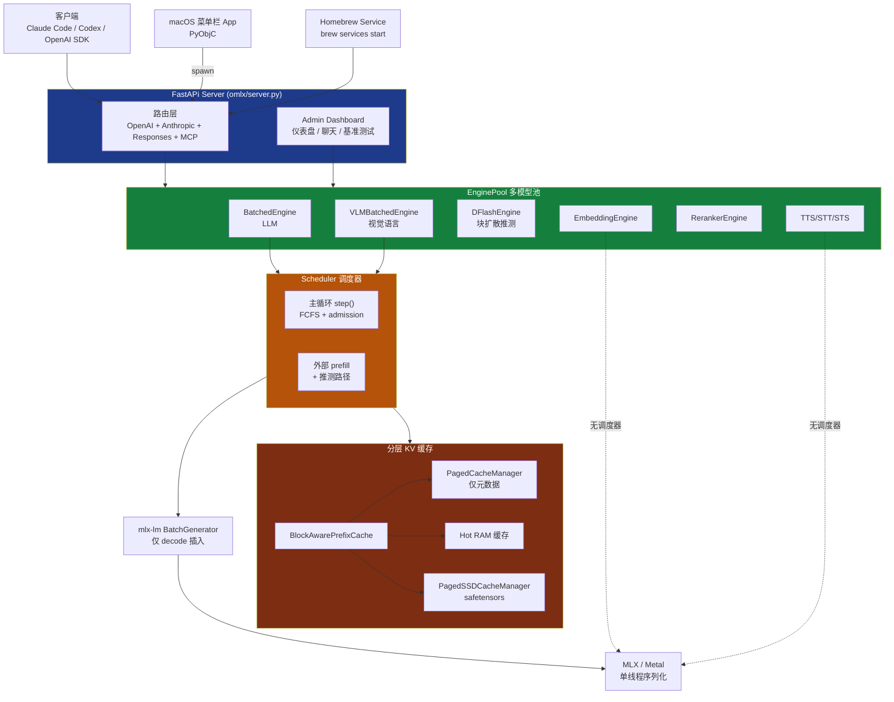

<details>
<summary>相关源文件</summary>

生成本页时使用的主要源文件：

- [README.md](../../../project-repos/omlx/README.md)
- [README.zh.md](../../../project-repos/omlx/README.zh.md)
- [pyproject.toml](../../../project-repos/omlx/pyproject.toml)
- [omlx/__init__.py](../../../project-repos/omlx/omlx/__init__.py)
- [omlx/cli.py](../../../project-repos/omlx/omlx/cli.py)

</details>

# 项目概览

在 Apple Silicon 上跑本地 LLM 这件事，几年下来仍然是一个"要么便利、要么可控，不能两者兼得"的赛道。LM Studio 装好就用，但你看不到也调不动它的 KV 缓存策略；llama.cpp 给你所有旋钮，但你得自己写 launcher、自己接 OpenAI API、自己解决多模型常驻问题；vLLM 在云端是标准答案，但它的 CUDA 块管理在 Mac 上根本跑不起来。

**oMLX 的切入点是一句话：把 vLLM 的连续批处理 + 分页 KV 缓存搬到 MLX，并在此之上做一件 vLLM 在云端做不到的事——把热的块留在 RAM、冷的块卸到 SSD、跨会话甚至跨重启复用前缀缓存。** 作者 [`jundot`](https://github.com/jundot/omlx) 在 README 顶端那段引文里说得很直白："I wanted to pin everyday models in memory, auto-swap heavier ones on demand, set context limits — and manage it all from a menu bar."

它不是一个新的推理内核。底层依赖钉死的 `mlx-lm@ed1fca4`、`mlx-vlm@f96138e`、`mlx-embeddings@32981fa`、`dflash-mlx@1ba6713` 四个上游（[pyproject.toml:30-80](../../../project-repos/omlx/pyproject.toml#L30-L80)）。它把工程力气全部花在**让本地 LLM 服务可以像生产推理系统那样被运营**这件事上。

## 从一个真实的痛点说起

README 引文里有一段话是整个项目的设计原点：

> **"oMLX persists KV cache across a hot in-memory tier and cold SSD tier — even when context changes mid-conversation, all past context stays cached and reusable across requests."**

翻译成工程语言：用 Claude Code、Codex 跑本地模型时，每一轮对话的上下文都在变长，但前 80% 的内容是不变的。vLLM 的 paged cache + prefix sharing 解决了"同进程内多请求共享前缀"，但解决不了"重启服务后从头重算 prefill"——而本地模型每次 `prefill 10K tokens` 可能要 30 秒。

oMLX 的解决方案：把分页 cache 的块**全部**落到 SSD safetensors，进程里只保留块元数据。RAM 里维护一个可配置大小的 hot 缓存做读取加速。链式 SHA-256 哈希唯一标识每个 64-token 块，命中即从盘上恢复，未命中才重算（[omlx/cache/paged_cache.py:78-119](../../../project-repos/omlx/omlx/cache/paged_cache.py#L78-L119)）。重启服务后，旧的对话发新一轮请求时，prefix 仍然命中 SSD，TTFT 从 30 秒降到秒级。

这是整个项目最核心的工程价值。其它所有特性——多模型 LRU 池、Anthropic 协议适配、9 个外部工具集成、自带量化、菜单栏 app——都是围绕"让本地推理服务可以被当成生产服务用"展开的衍生物。

## 核心能力全景

下面这 6 块能力是 oMLX 给用户提供的**直接可感知**的价值，每条都对应一段具体实现而不是 marketing copy：

- **分层 KV 缓存（Hot RAM + Cold SSD）**：默认 100 GB SSD 容量、可配 `--hot-cache-max-size` 的 RAM 镜像，跨重启复用。100% paged-SSD-only 模式：进程内零 KV 数据驻留，全部由 mlx-lm BatchGenerator 自己管理在 GPU 上的活跃 KV，oMLX 只管理"可恢复的历史"（[omlx/cache/factory.py:8-11](../../../project-repos/omlx/omlx/cache/factory.py#L8-L11)）。
- **多模型 + LRU 驱逐 + TTL + Pin**：一个进程可以同时载入 LLM、VLM、OCR、embedding、reranker、TTS/STT/STS 共 7 类引擎，由 `EnginePool` 根据 `--max-model-memory` 自动驱逐最久未访问的模型（含 25% KV 头空间保留）（[omlx/engine_pool.py:300-415](../../../project-repos/omlx/omlx/engine_pool.py#L300-L415)）。
- **三套 API 兼容（OpenAI + Anthropic + Responses）**：`POST /v1/chat/completions`、`POST /v1/messages`、`POST /v1/responses` 共享同一个内部消息表示，每个请求体被转换成相同的 `list[dict]` 后才进引擎。结果是：Claude Code 接 Anthropic 协议、Codex 接 OpenAI Responses 协议、其它工具接 OpenAI Chat 协议，都能落到同一台服务（[omlx/server.py:2057,3404,3814](../../../project-repos/omlx/omlx/server.py#L2057)）。
- **9 个外部工具一键集成**：`omlx launch <tool>` 自动写 Claude Code 的环境变量、Codex 的 `~/.codex/config.toml`、OpenClaw 的非交互 onboard、Hermes 的 YAML、Pi 的双 JSON——把"配置本地模型给 AI 编程工具"从一小时变成一个命令（[omlx/integrations/](../../../project-repos/omlx/omlx/integrations/)）。
- **MCP 客户端**：oMLX 是 **MCP client 而非 server**——它连接外部 MCP 服务器，把那些服务器暴露的工具以 OpenAI function-tool 格式合并到每次推理请求中，命名空间用 `server__tool` 做隔离（[omlx/mcp/manager.py](../../../project-repos/omlx/omlx/mcp/manager.py), [omlx/mcp/types.py](../../../project-repos/omlx/omlx/mcp/types.py)）。可直接复用 Claude Desktop 已有的 mcp.json。
- **数据驱动的 oQ 量化**：自带的混合精度量化算法，按层测敏感度后分配 2-8 bit，与 mlx-lm 的固定规则量化区分开。在 RAM 装不下源模型时自动构建 4-bit proxy 测敏感度，保证消费级 Mac 也能跑（[omlx/oq.py:2280-2310](../../../project-repos/omlx/omlx/oq.py#L2280-L2310), [docs/oQ_Quantization.md](../../../project-repos/omlx/docs/oQ_Quantization.md)）。

## 架构鸟瞰

下图给出最高层次的组件关系。每一块都有专门的页面深挖，本图只用于建立空间感。



四层结构从上到下：**客户端协议 → 多模型池 → 调度器 → mlx-lm + MLX**。横切的 Cache Stack 服务于 Scheduler，分层管理热数据与冷数据。所有 MLX/Metal 操作在一个进程内**单线程序列化**——这是 oMLX 跟 vLLM 最大的架构差异，原因详见 [系统架构](system-architecture.md)。

Sources: [omlx/__init__.py:1-56](../../../project-repos/omlx/omlx/__init__.py#L1-L56), [omlx/cli.py:494-748](../../../project-repos/omlx/omlx/cli.py#L494-L748), [README.md:303-326](../../../project-repos/omlx/README.md#L303-L326)

<details class="source-snippets">
<summary>引用源码</summary>

<!-- source-snippets:start -->

#### `omlx/__init__.py:1-56`

```python
# SPDX-License-Identifier: Apache-2.0
"""
omlx: LLM inference server, optimized for your Mac

This package provides native Apple Silicon GPU acceleration using
Apple's MLX framework and mlx-lm for LLMs.

Features:
- Continuous batching via vLLM-style scheduler
- OpenAI-compatible API server
- Paged KV cache with prefix sharing
- Tiered cache (GPU + paged SSD offloading)
"""

from omlx._version import __version__

# Continuous batching engine (core functionality, no torch required)
from omlx.request import Request, RequestOutput, RequestStatus, SamplingParams
from omlx.scheduler import Scheduler, SchedulerConfig, SchedulerOutput
from omlx.engine_core import EngineCore, AsyncEngineCore, EngineConfig
from omlx.cache.prefix_cache import BlockAwarePrefixCache
from omlx.cache.paged_cache import PagedCacheManager, CacheBlock, BlockTable
from omlx.cache.stats import PrefixCacheStats, PagedCacheStats
from omlx.model_registry import get_registry, ModelOwnershipError

# Backward compatibility alias
CacheStats = PagedCacheStats

__all__ = [
    # Request management
    "Request",
    "RequestOutput",
    "RequestStatus",
    "SamplingParams",
    # Scheduler
    "Scheduler",
    "SchedulerConfig",
    "SchedulerOutput",
    # Engine
    "EngineCore",
    "AsyncEngineCore",
    "EngineConfig",
    # Model registry
    "get_registry",
    "ModelOwnershipError",
    # Prefix cache (paged SSD-only)
    "BlockAwarePrefixCache",
    # Paged cache (memory efficiency)
    "PagedCacheManager",
    "CacheBlock",
    "BlockTable",
    "PagedCacheStats",
    "CacheStats",  # Backward compatibility alias
    # Version
    "__version__",
]
```

#### `omlx/cli.py:494-748`

```python
def main():
    parser = argparse.ArgumentParser(
        description="omlx: Production-ready LLM server for Apple Silicon",
        formatter_class=argparse.RawDescriptionHelpFormatter,
        epilog="""
Examples:
  omlx serve mlx-community/Llama-3.2-3B-Instruct-4bit --port 8000
  omlx launch codex --model qwen3.5
        """,
    )
    subparsers = parser.add_subparsers(dest="command", help="Commands")

    # Serve command (multi-model)
    serve_parser = subparsers.add_parser(
        "serve",
        help="Start multi-model OpenAI-compatible server",
        formatter_class=argparse.RawDescriptionHelpFormatter,
        description="""
Start a multi-model inference server with LRU-based memory management.

Models are discovered from subdirectories of --model-dir. Each subdirectory
should contain a valid model with config.json and *.safetensors files.

Example directory structure:
  /path/to/models/
  ├── llama-3b/           → model_id: "llama-3b"
  │   ├── config.json
  │   └── model.safetensors
  ├── qwen-7b/            → model_id: "qwen-7b"
  └── mistral-7b/         → model_id: "mistral-7b"
""",
    )

    # Required arguments
    serve_parser.add_argument(
        "--model-dir",
        type=str,
        default=None,
        help="Directory containing model subdirectories (default: ~/.omlx/models)",
    )
    serve_parser.add_argument(
        "--max-model-memory",
        type=str,
        default=None,
        help="Maximum memory for loaded models (e.g., 32GB, 'disabled'). Default: 80%% of system memory.",
    )
    serve_parser.add_argument(
        "--max-process-memory",
        type=str,
        default=None,
        help=(
            "Max total process memory as percentage of system RAM (10-99%%), "
            "'auto' (RAM - 8GB), or 'disabled'. Default: auto."
        ),
    )

    # Server options
    serve_parser.add_argument("--host", type=str, default=None, help="Host to bind (default: 127.0.0.1)")
    serve_parser.add_argument("--port", type=int, default=None, help="Port to bind (default: 8000)")
    serve_parser.add_argument(
        "--log-level",
        type=str,
        choices=["trace", "debug", "info", "warning", "error"],
        default=None,
        help="Log level (default: info). trace includes full message content",
    )
    serve_parser.add_argument(
        "--sse-keepalive-mode",
        type=str,
        choices=["chunk", "comment", "off"],
        default=None,
        help="SSE keepalive emission mode (default: chunk). 'chunk' emits "
        "protocol-aware no-op events compatible with strict clients like "
        "OpenClaw / WorkBuddy; 'comment' emits the legacy ': keep-alive' SSE "
        "comment; 'off' disables keepalive entirely",
    )

    # Scheduler options (for BatchedEngine)
    serve_parser.add_argument(
        "--max-concurrent-requests",
        type=int,
        default=None,
        help="Max requests processed simultaneously. Higher values increase throughput but use more memory. (default: 8)",
    )

    # paged SSD cache options
    serve_parser.add_argument(
        "--paged-ssd-cache-dir",
        type=str,
        default=None,
        help="Directory for paged SSD cache storage (enables oMLX prefix cache)",
    )
    serve_parser.add_argument(
        "--paged-ssd-cache-max-size",
        type=str,
        default=None,
        help="Maximum paged SSD cache size (e.g., '100GB', '50GB'). Default: 100GB",
    )
    serve_parser.add_argument(
        "--hot-cache-max-size",
        type=str,
        default=None,
        help="Maximum in-memory hot cache size (e.g., '8GB', '4GB'). Default: 0 (disabled)",
    )
    serve_parser.add_argument(
        "--no-cache",
        action="store_true",
        help="Disable oMLX paged SSD cache. mlx-lm BatchGenerator still manages KV states internally.",
    )
    serve_parser.add_argument(
        "--initial-cache-blocks",
        type=int,
        default=None,
        help="Number of cache blocks to pre-allocate at startup (default: 256). "
        "Higher values reduce dynamic allocation overhead for large contexts.",
    )

    # MCP options
    serve_parser.add_argument(
        "--mcp-config",
... snippet truncated ...
```

#### `README.md:303-326`

````markdown
<details>
<summary>Architecture</summary>

```
FastAPI Server (OpenAI / Anthropic API)
    │
    ├── EnginePool (multi-model, LRU eviction, TTL, manual load/unload)
    │   ├── BatchedEngine (LLMs, continuous batching)
    │   ├── VLMEngine (vision-language models)
    │   ├── EmbeddingEngine
    │   └── RerankerEngine
    │
    ├── ProcessMemoryEnforcer (total memory limit, TTL checks)
    │
    ├── Scheduler (FCFS, configurable concurrency)
    │   └── mlx-lm BatchGenerator
    │
    └── Cache Stack
        ├── PagedCacheManager (GPU, block-based, CoW, prefix sharing)
        ├── Hot Cache (in-memory tier, write-back)
        └── PagedSSDCacheManager (SSD cold tier, safetensors format)
```

</details>
````

<!-- source-snippets:end -->
</details>

## 技术栈数据点

- **运行时**：Python 3.11+（强制，因为 venvstacks 打包基于 cpython-3.11.10），macOS 15.0+（Sequoia 及以上），Apple Silicon M1/M2/M3/M4
- **核心推理**：`mlx>=0.31.2` + `mlx-lm@ed1fca4`（钉版到 v0.31.3 的一个特定 commit）
- **多模态**：`mlx-vlm@f96138e`（含 Gemma4 MTP server batching、speculative utils refactor）
- **嵌入与排序**：`mlx-embeddings@32981fa`
- **推测解码**：`dflash-mlx@1ba6713`（Apple Silicon 上的块扩散推测）
- **服务框架**：FastAPI 0.108+、uvicorn 0.23+
- **代码体量**：`omlx/scheduler.py` 6191 行单文件、`omlx/server.py` 4700+ 行、`omlx/oq.py` 3351 行。整个 `omlx/` 包 324 个 Python 文件
- **测试**：`tests/` 目录下 ~140 个测试文件，`pytest -m "not slow"` 是默认开发测试入口

dependencies 的 git-pin 不是偷懒——每个 pin 都对应**上游尚未合入但 oMLX 已经依赖**的特性。例如 `mlx-lm@ed1fca4` 修了 thread-local generation stream + ArraysCache batch dim bug + think token None safety；`dflash-mlx@1ba6713` 含 Qwen thinking/GDN exactness fix + fp16 draft on old Apple chips。这种"锁住上游 + 在自己仓库写 patch 桥接缺口"的工程哲学贯穿整个项目，详见 [评估、上游 Patch 与质量保障](testing-and-patches.md)。

## 与同类方案的差异化

| 方案 | 多模型并发 | 跨重启缓存 | 兼容 API | 推测解码 | 自带量化 | 平台 |
|---|---|---|---|---|---|---|
| Ollama | 1（顺序） | 否 | OpenAI Chat | 否 | GGUF 固定规则 | 跨平台 |
| LM Studio | 1（顺序） | 否 | OpenAI Chat | 否 | 否 | 跨平台 |
| llama.cpp server | 1 | 否 | OpenAI 部分 | 是（draft model） | GGUF 固定规则 | 跨平台 |
| MLX-LM CLI | 1 | 否 | 无 | 实验性 | mlx_lm.quantize | macOS |
| vllm-mlx | 单模型 | 否 | OpenAI 部分 | 否 | 否 | macOS |
| **oMLX** | **多模型 + LRU** | **是（SSD safetensors）** | **OpenAI + Anthropic + Responses** | **3 条路径** | **oQ 数据驱动** | macOS |

差异化定位很清晰：**做 Mac 上的"完整推理服务"，而不是单次推理工具**。这也是为什么它带 menubar app、Homebrew service、auto-update、admin dashboard 这些"看起来超出推理引擎范畴"的东西——本地推理要进入日常使用，工程闭环必须做完。

## 阅读路线推荐

根据你要做什么，挑一条线读：

- **想理解架构怎么搭起来的** → [系统架构](system-architecture.md) → [调度器与连续批处理](scheduler-and-batching.md) → [引擎系统与多模型](engine-system.md)
- **想理解为什么 KV 缓存能跨重启复用** → [分层 KV 缓存](tiered-kv-cache.md)
- **想接入 Claude Code / Codex / 自己的客户端** → [API 兼容层](api-compatibility.md) → [外部工具集成与 MCP](integrations-and-mcp.md)
- **想给本地模型做量化** → [oQ 数据驱动混合精度量化](oq-quantization.md)
- **想自己打包 / 部署 / 改菜单栏 app** → [macOS App 打包与部署](packaging-and-deployment.md)
- **关心模型如何被发现、配置如何分层** → [模型管理与 Admin Dashboard](model-management.md)
- **想理解推测解码三条路径在哪里分叉** → [推测解码三条路径](speculative-decoding.md)
- **想知道为什么需要这么多 patches** → [评估、上游 Patch 与质量保障](testing-and-patches.md)

## 项目元信息

- **License**：Apache 2.0
- **作者**：[junkim.dot@gmail.com](mailto:junkim.dot@gmail.com)（[omlx.ai/me](https://omlx.ai/me)）
- **致谢链路**：MLX (Apple) → mlx-lm (Apple) → mlx-vlm (Blaizzy) → vllm-mlx (waybarrios) → **oMLX**。作者明确说 oMLX 始于 vllm-mlx v0.1.0，"evolved significantly with multi-model serving, tiered KV caching, VLM with full paged cache support, an admin panel, and a macOS menu bar app"（[README.md:370-378](../../../project-repos/omlx/README.md#L370-L378)）。

## 相关页面

- [系统架构](system-architecture.md) — 三层引擎栈、单线程模型、外部 prefill 范式
- [分层 KV 缓存](tiered-kv-cache.md) — 链式哈希、safetensors 持久化、跨重启复用机制
- [API 兼容层](api-compatibility.md) — 三套协议如何共享同一推理路径
