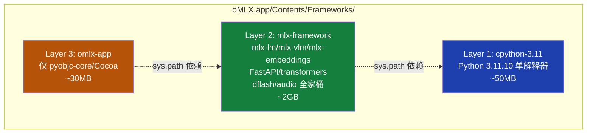
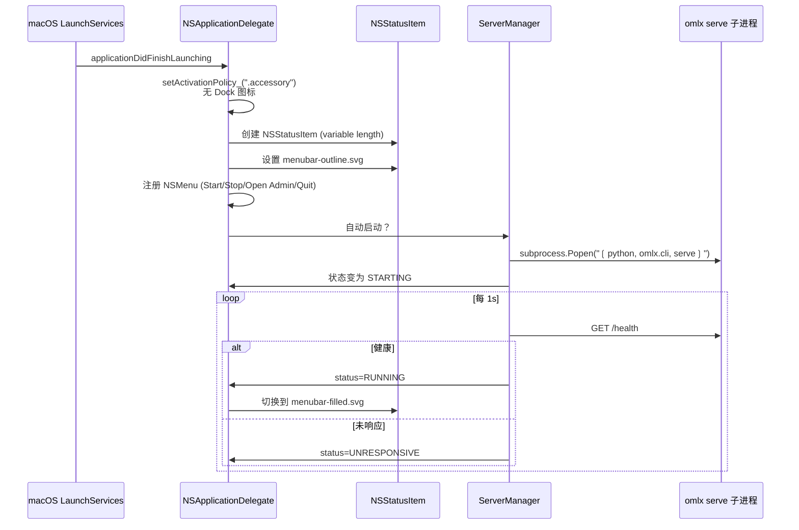
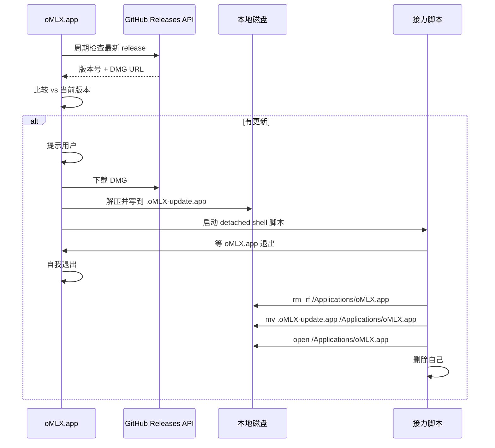
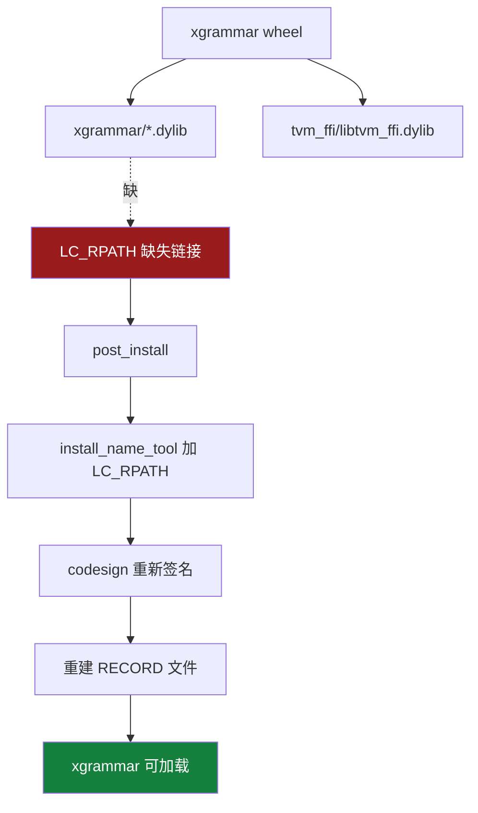
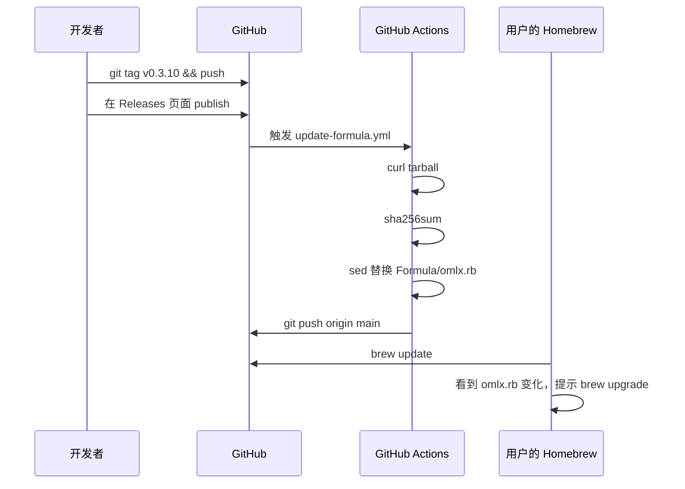

<details>
<summary>相关源文件</summary>

生成本页时使用的主要源文件：

- [packaging/README.md](../../../project-repos/omlx/packaging/README.md)
- [packaging/build.py](../../../project-repos/omlx/packaging/build.py)
- [packaging/venvstacks.toml](../../../project-repos/omlx/packaging/venvstacks.toml)
- [packaging/omlx_app/app.py](../../../project-repos/omlx/packaging/omlx_app/app.py)
- [packaging/omlx_app/server_manager.py](../../../project-repos/omlx/packaging/omlx_app/server_manager.py)
- [packaging/omlx_app/__main__.py](../../../project-repos/omlx/packaging/omlx_app/__main__.py)
- [packaging/omlx_app/preferences.py](../../../project-repos/omlx/packaging/omlx_app/preferences.py)
- [packaging/omlx_app/updater.py](../../../project-repos/omlx/packaging/omlx_app/updater.py)
- [Formula/omlx.rb](../../../project-repos/omlx/Formula/omlx.rb)
- [.github/workflows/update-formula.yml](../../../project-repos/omlx/.github/workflows/update-formula.yml)
- [omlx/cli.py](../../../project-repos/omlx/omlx/cli.py)

</details>

# macOS App 打包与部署

把一个 Python 服务变成 `.dmg` 分发给非工程用户是个让人头大的工程问题。Python 解释器要内嵌、依赖要冷冻、代码签名、公证、菜单栏 app 要原生、用户 PATH 里能用 CLI、auto-update 要工作、macOS Tahoe 的 ControlCenter 还会偷偷禁用菜单栏图标。每个细节都可能让用户的"第一次启动"翻车。

oMLX 用 [venvstacks](https://venvstacks.lmstudio.ai) 把这套问题分层解决。它的核心思想是**分层 venv**——把 Python 运行时、重型依赖（MLX/transformers）、应用代码三层分开打包，让升级时只更新需要变的那一层。

本页解释 oMLX 的 macOS 打包结构、菜单栏 app 的 PyObjC 实现、Homebrew Formula 的特殊处理，以及为什么 macOS 26（Tahoe）让菜单栏可见性变成了一个需要专门 diagnose 命令的问题。

## venvstacks 三层结构

`packaging/venvstacks.toml` 定义三层环境：



每层都是一个**可重定位的 venv**，靠 `sys.path` 注入实现层间依赖。venvstacks 的好处：

- **升级粒度细**：oMLX 代码改了不用重新打包 2GB 的 Framework 层；MLX 升级时不用碰 cpython 层
- **每层独立 lock**：用 `uv` 锁版本，跨平台/跨架构可复现
- **磁盘共享**：多个 App 共用同一个 framework 层（理论上，oMLX 目前没用此特性）

`build.py` 在 build 时（[packaging/build.py:493-572](../../../project-repos/omlx/packaging/build.py#L493-L572)）：

1. `build_local_wheels()`：先把 git-pin 的依赖（mlx-lm/mlx-vlm/dflash-mlx）打成 wheel——避免 venvstacks lock 时去拉 git，且 git ref 删除时仍能 build
2. `_create_resolved_toml(version_map)`：把 git URL 重写成 version pin，让 uv lock 可复现
3. `venvstacks lock` + `_lock_with_sdist_retry`：lock 失败（sdist-only 包没有 wheel）时自动 sdist 再 retry
4. `venvstacks build`：构建三层 venv
5. `venvstacks local-export`：导出成 flat 目录树
6. **特殊处理**——下面详述

Sources: [packaging/venvstacks.toml](../../../project-repos/omlx/packaging/venvstacks.toml), [packaging/build.py:493-572](../../../project-repos/omlx/packaging/build.py#L493-L572)

<details class="source-snippets">
<summary>引用源码</summary>

<!-- source-snippets:start -->

#### `packaging/venvstacks.toml`

```toml
# oMLX venvstacks configuration
# Build portable macOS app with MLX bundled

[[runtimes]]
name = "cpython-3.11"
python_implementation = "cpython@3.11.10"
requirements = []
platforms = [
    "macosx_arm64",
]

[[frameworks]]
name = "mlx-framework"
runtime = "cpython-3.11"
requirements = [
    # Core MLX
    "mlx==0.31.2",
    # mlx-lm from commit (ed1fca4, v0.31.3) - aligned with pyproject.toml
    "mlx-lm @ git+https://github.com/ml-explore/mlx-lm@ed1fca4cef15a824c5f1702c80f70b4cffc8e4dd",
    # regex for mlx-lm's Gemma 4 tool parser (uses recursive patterns)
    "regex",
    # mlx-embeddings from latest commit (32981fa) - aligned with pyproject.toml
    "mlx-embeddings @ git+https://github.com/Blaizzy/mlx-embeddings@32981fa4e8064ed664b52071789dd18271fe4206",
    # Server dependencies
    "fastapi>=0.100.0",
    "uvicorn>=0.23.0",
    # Tokenizers and transformers (aligned with pyproject.toml)
    # mlx-vlm custom processors bypass HF AutoProcessor, so torch is not required
    "transformers>=5.0.0",
    "tokenizers>=0.19.0",
    "huggingface-hub>=0.23.0",
    # Other dependencies
    "numpy>=1.24.0",
    "tqdm>=4.66.0",
    "pyyaml>=6.0",
    "itsdangerous>=2.0",
    "jinja2>=3.0",
    "sentencepiece",
    "tiktoken",
    "protobuf",
    "requests>=2.28.0",
    # SOCKS proxy support (used by httpx via huggingface-hub)
    "socksio>=1.0.0",
    "psutil>=5.9.0",
    "jsonschema>=4.0.0",
    "tabulate>=0.9.0",
    # MCP support
    "mcp>=1.0.0",
    # Harmony format parser for gpt-oss models
    "openai-harmony",
    # mlx-vlm from commit (f96138e) - aligned with pyproject.toml
    "mlx-vlm @ git+https://github.com/Blaizzy/mlx-vlm@f96138eef1f5ce7fb5d97f8dd41a664a195b5659",
    # dflash-mlx v0.1.7 (1ba6713) — bstnxbt repo. Qwen thinking/GDN exactness fix, GQA SDPA reshape, DDTree + CopySpec decode path, prefix cache identity hardening, fp16 draft on old Apple chips
    "dflash-mlx @ git+https://github.com/bstnxbt/dflash-mlx@1ba671372b289c025b435c1a13aabb4bfb80b183",
    "Pillow>=9.0.0",
    # ModelScope SDK for downloading models from ModelScope Hub
    "modelscope>=1.10.0",
    # python-multipart needed by audio routes (File/Form uploads)
    "python-multipart>=0.0.5",
    # mlx-audio runtime deps (mlx-audio itself installed --no-deps in build.py)
    "scipy>=1.11.0",
    "librosa>=0.10.0",
    "miniaudio>=1.59",
    "numba>=0.59.0",
    "pyloudnorm>=0.1.0",
    "sounddevice>=0.4.6",
    # mlx-audio [tts] extra deps
    "misaki>=0.9.4",
    "num2words>=0.5.14",
    "spacy>=3.8.4",
    "phonemizer-fork>=3.3.2",
    "espeakng-loader>=0.2.4",
    # mlx-audio [stt] extra deps
    # transformers 5.x's tokenization_mistral_common imports ReasoningEffort
    # which only exists in mistral-common>=1.10. Without this floor, the
    # resolver lands on 1.9.x and WhisperProcessor.from_pretrained() silently
    # fails (#1072, #1116).
    "mistral-common[audio]>=1.10",
    # mlx-audio [sts] extra deps
    "webrtcvad>=2.0.10",
    # NOTE: mlx-audio is built from git and installed with --no-deps in build.py
    # because mlx-audio pins mlx-lm==0.31.1 which conflicts with our git-pinned mlx-lm (v0.31.3)
]
platforms = [
    "macosx_arm64",
]
# Exclude cv2's duplicate dylibs (same libs already provided by Pillow/PIL)
dynlib_exclude = [
    "cv2/.dylibs/libavif*",
    "cv2/.dylibs/liblcms2*",
    "cv2/.dylibs/libpng16*",
    "cv2/.dylibs/libtiff*",
    "cv2/.dylibs/libfreetype*",
    "cv2/.dylibs/libharfbuzz*",
    "cv2/.dylibs/liblzma*",
    "cv2/.dylibs/libxcb*",
    "cv2/.dylibs/libXau*",
]

[[applications]]
name = "omlx-app"
launch_module = "omlx_app"
frameworks = ["mlx-framework"]
requirements = [
    # PyObjC for native macOS menubar app
    "pyobjc-core>=10.0",
    "pyobjc-framework-Cocoa>=10.0",
]
platforms = [
    "macosx_arm64",
]

[tool.uv]
exclude-newer = "2026-04-23T00:00:00Z"
environments = [
    "sys_platform == 'darwin' and platform_machine == 'arm64'",
]
```

#### `packaging/build.py:493-572`

```python
def build_venvstacks():
    """Build venvstacks layers."""
    print("\n[1/4] Building venvstacks layers...")

    _check_git_commit_sync()

    # Step 1: Build wheels from git-pinned packages
    version_map = build_local_wheels()

    # Step 2: Create resolved toml (git URLs → version pins)
    if version_map:
        print("\n  Resolving git requirements to version pins...")
        resolved_toml = _create_resolved_toml(version_map)
    else:
        resolved_toml = SCRIPT_DIR / "venvstacks.toml"

    # Local wheels args
    local_wheels_args = []
    if WHEELS_DIR.exists() and any(WHEELS_DIR.glob("*.whl")):
        local_wheels_args = ["--local-wheels", str(WHEELS_DIR)]

    # Step 3: Lock environments (always re-lock to match current wheels)
    # If lock fails due to sdist-only packages (no pre-built wheel on PyPI),
    # _lock_with_sdist_retry() builds them locally and retries automatically.
    print("\n  Locking environments...")
    lock_cmd = [
        "pipx", "run", "venvstacks", "lock",
        str(resolved_toml),
    ] + local_wheels_args
    if version_map:
        # Force re-lock when git packages changed (hashes will differ)
        lock_cmd += ["--reset-lock", "*"]
    else:
        lock_cmd += ["--if-needed"]
    _lock_with_sdist_retry(lock_cmd)

    # Step 4: Build environments
    print("\n  Building environments (this may take a while)...")
    run_cmd([
        "pipx", "run", "venvstacks", "build",
        str(resolved_toml),
        "--no-lock",
    ] + local_wheels_args)

    # Step 5: Export to local directory for app bundle
    print("\n  Exporting environments...")
    if EXPORT_DIR.exists():
        shutil.rmtree(EXPORT_DIR)

    run_cmd([
        "pipx", "run", "venvstacks", "local-export",
        str(resolved_toml),
        "--output-dir", str(EXPORT_DIR),
    ])

    # Cleanup temporary toml
    if version_map and resolved_toml.exists():
        resolved_toml.unlink()

    # Install mlx-audio separately: build wheel from git, install --no-deps.
    # mlx-audio pins mlx-lm==0.31.1 which conflicts with our git-pinned mlx-lm,
    # so it can't go through venvstacks' uv resolver.
    _install_mlx_audio(EXPORT_DIR)

    # Install paroquant --no-deps. The official [mlx] extra requires
    # torchvision which the mlx load path doesn't actually use; verified
    # end-to-end on 0.1.14. All real deps (mlx, mlx-lm, mlx-vlm, numpy,
    # huggingface_hub) are already in the framework layer.
    _install_paroquant(EXPORT_DIR)

    # Bundle spacy language model for Kokoro TTS.
    # misaki's en.G2P tries spacy.cli.download() at runtime, which fails in
    # the code-signed app bundle (read-only site-packages).
    _install_spacy_model(EXPORT_DIR)

    # Strip large packages that are only needed for model conversion / data
    # loading, not inference. Saves ~780 MB in the app bundle.
    _strip_unused_packages(EXPORT_DIR)

    return EXPORT_DIR
```

<!-- source-snippets:end -->
</details>

## 三个特殊安装路径

build.py 里有三个不能走 venvstacks 标准流程的依赖：

### mlx-audio（`--no-deps`）

mlx-audio 在 `pyproject.toml` 写了 `mlx-lm==0.31.1`，但 oMLX 钉的是 mlx-lm@ed1fca4（v0.31.3）。让 uv 解析会冲突。

解决方案（[build.py:605-610](../../../project-repos/omlx/packaging/build.py#L605-L610)）：单独把 mlx-audio wheel 用 `pip install --no-deps` 装到 framework 层 site-packages。所有依赖手工处理，但 mlx-lm 版本约束被绕过。

### paroquant（去掉 torchvision）

paroquant 的官方 `[mlx]` extra pulls torchvision（~500MB），但 paroquant 的 load 路径**根本不调 torchvision**——只是 import 时被 transitively 加载。oMLX 用同样的 `--no-deps` 技巧装 paroquant 主包，不装 torchvision。

### spacy 语言模型

mlx-audio 的 TTS 部分（kokoro / vibevoice）用 misaki 做 G2P（grapheme-to-phoneme）。Misaki 的 `en.G2P` 在第一次调用时执行 `spacy.cli.download()` 拉英语模型——而 code-signed `.app` 内不能写网络下载的文件（沙箱）。

`_install_spacy_model`（[build.py](../../../project-repos/omlx/packaging/build.py)）在 build 时就把 spacy 语言模型装进 framework 层，运行时 misaki 找到现成的就不下载。

### `_strip_unused_packages`：省 780MB

mlx-audio 的依赖里有大量"模型转换才用到、推理不用"的包（numba、scipy、librosa 等的某些子模块）。`_strip_unused_packages` 在 build 后扫描 framework 层，按 hardcoded 列表删掉这些包。total 省下约 780MB。

这些细节展示了一个事实：**打包大型 Python 服务给最终用户，是无数小妥协的累积**。每个 `--no-deps` / `_install_*` / `_strip_*` 都对应一个真实的 build 失败或 runtime crash。

Sources: [packaging/build.py:605-610](../../../project-repos/omlx/packaging/build.py#L605-L610)

<details class="source-snippets">
<summary>引用源码</summary>

<!-- source-snippets:start -->

#### `packaging/build.py:605-610`

```python

    import zipfile
    for whl in audio_wheels.glob("*.whl"):
        print(f"    Installing {whl.name} (--no-deps)")
        with zipfile.ZipFile(whl) as zf:
            zf.extractall(fw_site)
```

<!-- source-snippets:end -->
</details>

## App Bundle 结构

最终的 `oMLX.app` 内部结构（[build.py:920+](../../../project-repos/omlx/packaging/build.py#L920) 的 `create_app_bundle`）：

```text
oMLX.app/Contents/
├── Info.plist                # bundle 元数据
├── MacOS/
│   ├── oMLX                  # C launcher 二进制
│   ├── python3               # libpython 启动器（macOS 要求）
│   └── omlx-cli              # bash launcher：设 PYTHONHOME/PATH 后跑 omlx.cli
├── Resources/
│   ├── omlx_app/             # 菜单栏 app Python 源码
│   ├── omlx/                 # 服务源码（剔除 tests/examples）
│   ├── _engine_commits.json  # mlx-lm 等的 commit SHA
│   └── AppIcon.icns
├── lib/
│   └── libpython3.11.dylib → ../Frameworks/cpython-3.11/lib/libpython3.11.dylib
└── Frameworks/
    ├── cpython-3.11/
    ├── framework-mlx-framework/
    └── app-omlx-app/
```

几个关键设计：

- **C launcher** (`MacOS/oMLX`)：用 `_create_c_launcher`（[build.py:752](../../../project-repos/omlx/packaging/build.py#L752)）编译的小 C 程序。它的工作是设置环境变量后 `execve` 调到 Python。为什么要 C？macOS LaunchServices 启动 .app 时调用的是 `MacOS/<BundleExecutable>`，这个二进制必须是真二进制不能是脚本，且 PyInstaller 之类的方案体积太大。
- **`MacOS/python3`** 是 `Frameworks/cpython-3.11/bin/python3` 的拷贝。macOS 要求 bundle executable 位于 `MacOS/`，所以必须在这复制一份。
- **`omlx-cli`** 是 bash 脚本，让用户 `/Applications/oMLX.app/Contents/MacOS/omlx-cli serve` 可以工作——这是 brew install 的 `omlx` 命令的别名目标。
- **`lib/libpython3.11.dylib` 符号链接**：bundle 内自己装的 libpython 必须在两个位置可见——某些 Python C 扩展会用 `lib/` 而非 `Frameworks/`。

Sources: [packaging/build.py:752-1100](../../../project-repos/omlx/packaging/build.py#L752-L1100)

<details class="source-snippets">
<summary>引用源码</summary>

<!-- source-snippets:start -->

#### `packaging/build.py:752-1100`

```python
def _create_c_launcher(macos_dir: Path, app_name: str):
    """Compile a native Mach-O launcher binary for macOS menubar app startup.

    A compiled binary (not a bash script) is required as CFBundleExecutable
    so that macOS LaunchServices properly grants WindowServer GUI access
    to the process.

    On macOS Tahoe, exec-trampoline launchers (CFBundleExecutable -> launcher
    -> exec python3) can end up in a NotVisible state for status bar apps.
    To avoid this, the launcher initializes Python in-process via Py_BytesMain
    instead of replacing itself with exec().

    The launcher:
    - Detects both Python/ (release) and Frameworks/ (dev) directories
    - Sets PYTHONHOME, PYTHONPATH, PYTHONDONTWRITEBYTECODE
    - Loads bundled libpython3.11.dylib and calls Py_BytesMain("-m omlx_app")
    - Shows an error dialog via osascript if startup fails
    """
    launcher_c = macos_dir / "_launcher.c"
    launcher_c.write_text(r'''
#include <stdio.h>
#include <stdlib.h>
#include <string.h>
#include <unistd.h>
#include <limits.h>
#include <errno.h>
#include <dlfcn.h>
#include <mach-o/dyld.h>

typedef int (*py_bytes_main_fn)(int, char **);

static void show_error(const char *msg) {
    char cmd[2048];
    snprintf(cmd, sizeof(cmd),
        "osascript -e 'display dialog \"%s\" buttons {\"OK\"} "
        "default button 1 with icon stop with title \"oMLX\"'",
        msg);
    system(cmd);
}

int main(int argc, char *argv[]) {
    char exe_buf[PATH_MAX];
    char resolved[PATH_MAX];
    uint32_t size = sizeof(exe_buf);

    if (_NSGetExecutablePath(exe_buf, &size) != 0) {
        show_error("Failed to get executable path.");
        return 1;
    }
    if (!realpath(exe_buf, resolved)) {
        show_error("Failed to resolve executable path.");
        return 1;
    }

    /* Trim executable name to get MacOS/ directory */
    char *slash = strrchr(resolved, '/');
    if (!slash) { show_error("Invalid path."); return 1; }
    *slash = '\0';
    char macos_dir[PATH_MAX];
    strncpy(macos_dir, resolved, sizeof(macos_dir) - 1);

    /* Trim MacOS to get Contents/ directory */
    slash = strrchr(resolved, '/');
    if (!slash) { show_error("Invalid bundle structure."); return 1; }
    *slash = '\0';
    char contents_dir[PATH_MAX];
    strncpy(contents_dir, resolved, sizeof(contents_dir) - 1);

    /* Detect Python layer directory: Python/ (release) or Frameworks/ (dev) */
    char layers_dir[PATH_MAX];
    snprintf(layers_dir, sizeof(layers_dir), "%s/Python", contents_dir);
    if (access(layers_dir, F_OK) != 0) {
        snprintf(layers_dir, sizeof(layers_dir), "%s/Frameworks", contents_dir);
        if (access(layers_dir, F_OK) != 0) {
            show_error("Python runtime not found in app bundle.");
            return 1;
        }
    }

    /* Set PYTHONHOME */
    char pythonhome[PATH_MAX];
    snprintf(pythonhome, sizeof(pythonhome), "%s/cpython-3.11", layers_dir);
    setenv("PYTHONHOME", pythonhome, 1);

    /* Set PYTHONPATH */
    char pythonpath[PATH_MAX * 4];
    snprintf(pythonpath, sizeof(pythonpath),
        "%s/Resources:%s/app-omlx-app/lib/python3.11/site-packages:"
        "%s/framework-mlx-framework/lib/python3.11/site-packages",
        contents_dir, layers_dir, layers_dir);
    setenv("PYTHONPATH", pythonpath, 1);

    /* Prevent .pyc generation at runtime */
    setenv("PYTHONDONTWRITEBYTECODE", "1", 1);

    /* Ensure bundled python3 exists (used later by server subprocesses). */
    char python_bin[PATH_MAX];
    snprintf(python_bin, sizeof(python_bin), "%s/python3", macos_dir);
    if (access(python_bin, X_OK) != 0) {
        show_error("Python executable not found in app bundle.");
        return 1;
    }

    /* Load bundled libpython and run -m omlx_app in-process (no exec trampoline). */
    char libpython[PATH_MAX];
    snprintf(libpython, sizeof(libpython), "%s/lib/libpython3.11.dylib", contents_dir);
    void *py = dlopen(libpython, RTLD_NOW | RTLD_GLOBAL);
    if (!py) {
        char err[1024];
        snprintf(err, sizeof(err), "Failed to load libpython: %s", dlerror());
        show_error(err);
        return 1;
    }

    py_bytes_main_fn py_bytes_main = (py_bytes_main_fn)dlsym(py, "Py_BytesMain");
    if (!py_bytes_main) {
        char err[1024];
        snprintf(err, sizeof(err), "Failed to resolve Py_BytesMain: %s", dlerror());
        show_error(err);
        return 1;
... snippet truncated ...
```

<!-- source-snippets:end -->
</details>

## Info.plist 与菜单栏可见性

`Info.plist` 几个关键字段：

| 字段 | 值 | 含义 |
|---|---|---|
| `CFBundleIdentifier` | `com.omlx.app` | 全系统唯一标识 |
| `LSMinimumSystemVersion` | `15.0` | 至少 macOS Sequoia |
| `LSArchitecturePriority` | `[arm64]` | 仅 Apple Silicon |
| `NSPrincipalClass` | `NSApplication` | 让系统识别为标准 AppKit 应用 |
| ~~`LSUIElement`~~ | **不设置** | **关键** |

不设置 `LSUIElement` 是工程上的关键选择（[build.py:1037-1040](../../../project-repos/omlx/packaging/build.py#L1037-L1040) 注释明确说明）：

- `LSUIElement = true` 让 app 没有 Dock 图标，但**会触发 macOS Sonoma+ 的 ControlCenter 把 NSStatusItem 默认隐藏**（issue #725）
- 通过运行时调 `setActivationPolicy_(.accessory)` 实现"无 Dock 图标"的效果，**而非通过 Info.plist 声明**——这样 ControlCenter 不知道这是个隐藏式 app

结果：默认 oMLX 没有 Dock 图标但菜单栏图标会显示。在 Tahoe（macOS 26.x）上 ControlCenter 仍然可能把第三方 app 的 status item 移到"More Menu Bar Items"区，但至少图标存在，用户可以手动恢复。

Sources: [packaging/build.py:1037-1040](../../../project-repos/omlx/packaging/build.py#L1037-L1040)

<details class="source-snippets">
<summary>引用源码</summary>

<!-- source-snippets:start -->

#### `packaging/build.py:1037-1040`

```python
    # NOTE: do NOT add LSUIElement here. Dock icon visibility is controlled
    # at runtime via setActivationPolicy_ in app.py. Combining LSUIElement
    # with runtime policy switching causes ControlCenter to block the
    # NSStatusItem (menubar icon) on macOS Sonoma+. See issue #725.
```

<!-- source-snippets:end -->
</details>

## 菜单栏 App：PyObjC 直调

`packaging/omlx_app/` 是菜单栏 app 源码。**不用 rumps**，直接调 AppKit。

```python
from AppKit import (
    NSApp, NSMenu, NSStatusBar, NSStatusItem,
    NSApplicationActivationPolicyAccessory,
    NSVariableStatusItemLength,
    NSVisualEffectView,
    NSAlert, ...
)
```

为什么不用 rumps？两个原因：

1. **rumps 不支持 NSAlert / NSVisualEffectView**——这俩用于现代 macOS UI 的 first-party 部件
2. **rumps 内置 mainloop 不兼容 oMLX 的子进程管理需求**——oMLX 需要在 NSRunLoop 同一线程里 spawn server subprocess

直接调 PyObjC 写出来的 app 100% 是 native AppKit 行为，跟 Apple 自己的菜单栏 app 视觉一致。

主要组件（[packaging/omlx_app/](../../../project-repos/omlx/packaging/omlx_app/)）：

| 文件 | 职责 |
|---|---|
| `__main__.py` | 入口；crash handler 写 `~/Library/Application Support/oMLX/crash.log` |
| `app.py` | NSApplicationDelegate + NSStatusItem |
| `server_manager.py` | 启动/停止/监控服务子进程 |
| `preferences.py` | 偏好设置窗口（NSVisualEffectView sidebar 风格） |
| `welcome.py` | 首次启动 3 步向导 |
| `widgets.py` | `PastableSecureTextField` 等定制组件 |
| `updater.py` | GitHub Releases auto-update |

`app.py` 的核心是 NSApplicationDelegate：



`ServerStatus` 枚举（[server_manager.py](../../../project-repos/omlx/packaging/omlx_app/server_manager.py)）：`STOPPED` / `STARTING` / `RUNNING` / `STOPPING` / `ERROR` / `UNRESPONSIVE`。状态变化会驱动 NSStatusItem 切换图标——`UNRESPONSIVE` 时用一个红点叠加。

`PortConflict` 类记录端口已被占用的情况：包含占用 pid 和 "是否另一个 oMLX 实例" 的标志。"端口被占用" 在本地服务很常见——双击两次 .app 就会冲突。

`get_bundled_python()` 通过**三个 fallback** 找到 bundle 内的 Python：sys.executable → bundle path/Frameworks → `os.path` 推断。这是因为菜单栏 app 启动时 sys.executable 是 C launcher 不是 Python。

Sources: [packaging/omlx_app/app.py](../../../project-repos/omlx/packaging/omlx_app/app.py), [packaging/omlx_app/server_manager.py](../../../project-repos/omlx/packaging/omlx_app/server_manager.py)

<details class="source-snippets">
<summary>引用源码</summary>

<!-- source-snippets:start -->

#### `packaging/omlx_app/app.py`

```python
"""
oMLX Native Menubar Application using PyObjC.

A native macOS menubar app for managing the oMLX LLM inference server.
"""

import logging
import os
import platform
import plistlib
import subprocess
import time
import webbrowser
from datetime import datetime
from decimal import Decimal, InvalidOperation, ROUND_HALF_UP
from pathlib import Path
from typing import Optional

import objc
import requests

from omlx._version import __version__
from AppKit import (
    NSAlert,
    NSAlertFirstButtonReturn,
    NSAlertSecondButtonReturn,
    NSAlertThirdButtonReturn,
    NSApp,
    NSAppearanceNameDarkAqua,
    NSApplication,
    NSApplicationActivationPolicyAccessory,
    NSApplicationActivationPolicyRegular,
    NSAttributedString,
    NSBundle,
    NSColor,
    NSFloatingWindowLevel,
    NSFont,
    NSFontAttributeName,
    NSForegroundColorAttributeName,
    NSImage,
    NSLinkAttributeName,
    NSMenu,
    NSMenuItem,
    NSMutableParagraphStyle,
    NSParagraphStyleAttributeName,
    NSRightTabStopType,
    NSStatusBar,
    NSTextField,
    NSTextTab,
    NSTextAlignmentCenter,
    NSVariableStatusItemLength,
    NSView,
    NSWorkspace,
)
from Foundation import (
    NSData,
    NSMutableAttributedString,
    NSObject,
    NSRunLoop,
    NSRunLoopCommonModes,
    NSTimer,
    NSURL,
)

from omlx.utils.release_check import select_latest_stable_release

from .config import ServerConfig, resolve_local_server_base_url
from .server_manager import PortConflict, ServerManager, ServerStatus

logger = logging.getLogger(__name__)


def _find_matching_dmg(assets: list[dict]) -> str | None:
    """Select the DMG asset matching the current macOS version.

    DMG filenames follow the pattern: oMLX-0.2.10-macos15-sequoia_260210.dmg
    Matches 'macosNN' from filename against the running OS major version.
    Falls back to the single DMG if only one is available.
    """
    mac_ver = platform.mac_ver()[0]  # e.g., "15.3.1" or "26.0"
    os_major = mac_ver.split(".")[0]  # e.g., "15" or "26"
    os_tag = f"macos{os_major}"  # e.g., "macos15" or "macos26"

    dmg_assets = [a for a in assets if a.get("name", "").endswith(".dmg")]

    # Exact OS match
    for asset in dmg_assets:
        name = asset["name"]
        if f"-{os_tag}-" in name or f"-{os_tag}_" in name:
            return asset["browser_download_url"]

    # Fallback: single DMG release (no platform tag or only one DMG)
    if len(dmg_assets) == 1:
        return dmg_assets[0]["browser_download_url"]

    return None


class OMLXAppDelegate(NSObject):
    """Main application delegate for oMLX menubar app."""

    def init(self):
        self = objc.super(OMLXAppDelegate, self).init()
        if self is None:
            return None

        self.config = ServerConfig.load()
        self.server_manager = ServerManager(self.config)
        self.status_item = None
        self.menu = None
        self.health_timer = None
        self.welcome_controller = None
        self.preferences_controller = None
        self._cached_stats: Optional[dict] = None
        self._cached_alltime_stats: Optional[dict] = None
        self._last_stats_fetch: float = 0
        self._admin_session: Optional[requests.Session] = None
        self._icon_outline: Optional[NSImage] = None
        self._icon_filled: Optional[NSImage] = None
        self._update_info: Optional[dict] = None
```

#### `packaging/omlx_app/server_manager.py`

```python
"""Server process management for oMLX menubar app."""

import logging
import os
import signal
import socket
import subprocess
import sys
import threading
import time
from dataclasses import dataclass
from enum import Enum
from pathlib import Path
from typing import Callable, Optional, Union

import requests

from .config import (
    ServerConfig,
    get_log_path,
    resolve_local_server_base_url,
    resolve_local_server_health_url,
    tcp_probe_connection_targets,
)

logger = logging.getLogger(__name__)


class ServerStatus(Enum):
    STOPPED = "stopped"
    STARTING = "starting"
    RUNNING = "running"
    STOPPING = "stopping"
    ERROR = "error"
    UNRESPONSIVE = "unresponsive"


@dataclass
class PortConflict:
    """Returned by start() when the port is already in use."""
    pid: Optional[int]
    is_omlx: bool


def get_bundled_python() -> str:
    """Get the path to the bundled Python executable."""
    exe = Path(sys.executable)

    # Normal case: running under bundled python directly.
    if exe.name == "python3":
        return str(exe)

    # Menubar launcher case: sys.executable may be .../Contents/MacOS/oMLX.
    candidate = exe.with_name("python3")
    if candidate.exists():
        return str(candidate)

    # Fallback to current executable if layout is unexpected.
    return sys.executable


class ServerManager:
    """Manages the oMLX server process lifecycle."""

    def __init__(self, config: ServerConfig):
        self.config = config
        self._process: Optional[subprocess.Popen] = None
        self._status = ServerStatus.STOPPED
        self._error_message: Optional[str] = None
        self._log_file_handle = None
        self._status_callback: Optional[Callable[[ServerStatus], None]] = None
        self._health_check_thread: Optional[threading.Thread] = None
        self._stop_health_check = threading.Event()
        self._adopted = False

        # Persistent session for health checks. Reused across every poll so
        # the underlying TCP connection is kept alive instead of opening a
        # fresh socket per check (which lands in TIME_WAIT and, under server
        # slowdown, can exhaust the host's ephemeral port range).
        self._health_session = requests.Session()
        self._health_session.trust_env = False

        # Health check failure tracking
        self._consecutive_health_failures: int = 0
        self._max_health_failures: int = 3  # 3 consecutive failures → UNRESPONSIVE

        # Auto-restart (only when process actually exits)
        self._max_auto_restarts: int = 3
        self._auto_restart_count: int = 0
        self._last_healthy_time: float = 0.0
        self._stable_threshold: float = 60.0  # Reset counter after 60s of stable running

    @property
    def status(self) -> ServerStatus:
        return self._status

    @property
    def error_message(self) -> Optional[str]:
        return self._error_message

    def set_status_callback(self, callback: Callable[[ServerStatus], None]) -> None:
        self._status_callback = callback

    def _update_status(self, status: ServerStatus, error: Optional[str] = None) -> None:
        self._status = status
        self._error_message = error
        if self._status_callback:
            try:
                self._status_callback(status)
            except Exception as e:
                logger.error(f"Status callback error: {e}")

    def _get_health_url(self) -> str:
        return resolve_local_server_health_url(
            self.config.get_server_bind_host(), self.config.port
        )

    def get_api_url(self) -> str:
        return resolve_local_server_base_url(
            self.config.get_server_bind_host(), self.config.port
```

<!-- source-snippets:end -->
</details>

## 偏好设置窗口的 native 设计

`preferences.py` 的窗口用 `NSVisualEffectView(material=NSVisualEffectMaterialSidebar)`——这是 macOS Settings.app 用的同款半透明侧栏。视觉上跟系统设置完全一致，不是常见的"自绘 UI"。

```python
class PreferencesWindowController(NSObject):
    def init(self):
        # 双栏布局：左侧 sidebar (NSVisualEffectView) + 右侧 content
        sidebar = NSVisualEffectView.alloc().init()
        sidebar.setMaterial_(NSVisualEffectMaterialSidebar)
        ...
```

启动时启动行为通过写 `~/Library/LaunchAgents/com.omlx.app.plist` 实现。toggle 后写文件，系统重启 launchd reload 即生效。

`PastableSecureTextField`（[widgets.py](../../../project-repos/omlx/packaging/omlx_app/widgets.py)）是 NSSecureTextField 的 PyObjC 子类——重写 `performKeyEquivalent_` 让 Cmd+V 工作。原版 NSSecureTextField 在 macOS 某些版本上忽略 Cmd+V，必须手动从 `NSPasteboard.generalPasteboard()` 读。同样的 fix 应用到 API key 输入。

Sources: [packaging/omlx_app/preferences.py](../../../project-repos/omlx/packaging/omlx_app/preferences.py), [packaging/omlx_app/widgets.py](../../../project-repos/omlx/packaging/omlx_app/widgets.py)

<details class="source-snippets">
<summary>引用源码</summary>

<!-- source-snippets:start -->

#### `packaging/omlx_app/preferences.py`

```python
"""Settings window for oMLX app settings - modern macOS native design."""

import logging
import plistlib
import shutil
from pathlib import Path
from typing import Callable, Optional

import objc
from AppKit import (
    NSAlert,
    NSAlertFirstButtonReturn,
    NSAlertStyleCritical,
    NSAlertStyleWarning,
    NSApp,
    NSBackingStoreBuffered,
    NSBezelStyleRounded,
    NSBox,
    NSBoxCustom,
    NSBoxSeparator,
    NSButton,
    NSButtonTypeSwitch,
    NSColor,
    NSControlStateValueOff,
    NSControlStateValueOn,
    NSFont,
    NSImage,
    NSMakeRect,
    NSOpenPanel,
    NSTextField,
    NSView,
    NSVisualEffectBlendingModeBehindWindow,
    NSVisualEffectMaterialSidebar,
    NSVisualEffectView,
    NSWindow,
    NSWindowStyleMaskClosable,
    NSWindowStyleMaskTitled,
)
from Foundation import NSObject

from .widgets import PastableSecureTextField

logger = logging.getLogger(__name__)

LAUNCH_AGENT_LABEL = "com.omlx.app"
LAUNCH_AGENT_DIR = Path.home() / "Library" / "LaunchAgents"
LAUNCH_AGENT_PLIST = LAUNCH_AGENT_DIR / f"{LAUNCH_AGENT_LABEL}.plist"

WINDOW_WIDTH = 520
WINDOW_HEIGHT = 606


class PreferencesWindowController(NSObject):
    """Controller for the Settings window - modern macOS design."""

    def initWithConfig_serverManager_onSave_(
        self, config, server_manager, on_save_callback
    ):
        self = objc.super(PreferencesWindowController, self).init()
        if self is None:
            return None
        self.config = config
        self.server_manager = server_manager
        self.on_save: Optional[Callable] = on_save_callback
        self.show_welcome: Optional[Callable] = None
        self.window = None
        self.launch_at_login_checkbox = None
        self.auto_start_checkbox = None
        self.base_path_label = None
        self.model_dir_label = None
        self.port_field = None
        self.api_key_secure = None
        self.api_key_plain = None
        self._api_key_visible = False
        self._eye_btn = None
        self._original_base_path = config.base_path
        return self

    def _create_card(self) -> NSBox:
        """Create a modern card-style box."""
        box = NSBox.alloc().init()
        box.setBoxType_(NSBoxCustom)
        box.setTransparent_(False)
        box.setFillColor_(NSColor.controlBackgroundColor())
        box.setCornerRadius_(10)
        box.setBorderWidth_(0)
        return box

    def _create_separator(self) -> NSBox:
        """Create a 1px separator line."""
        sep = NSBox.alloc().init()
        sep.setBoxType_(NSBoxSeparator)
        return sep

    def showWindow(self):
        """Create and show the settings window."""
        # Sync from server settings.json (Web admin changes)
        self.config.sync_from_server_settings()

        style = NSWindowStyleMaskTitled | NSWindowStyleMaskClosable
        frame = NSMakeRect(0, 0, WINDOW_WIDTH, WINDOW_HEIGHT)
        self.window = NSWindow.alloc().initWithContentRect_styleMask_backing_defer_(
            frame, style, NSBackingStoreBuffered, False
        )
        self.window.setTitle_("oMLX Settings")
        self.window.center()
        self.window.setReleasedWhenClosed_(False)

        # Visual effect background layer
        effect_view = NSVisualEffectView.alloc().initWithFrame_(
            NSMakeRect(0, 0, WINDOW_WIDTH, WINDOW_HEIGHT)
        )
        effect_view.setMaterial_(NSVisualEffectMaterialSidebar)
        effect_view.setBlendingMode_(NSVisualEffectBlendingModeBehindWindow)
        self.window.setContentView_(effect_view)

        # Content container on top of blur
        container = NSView.alloc().initWithFrame_(
            NSMakeRect(0, 0, WINDOW_WIDTH, WINDOW_HEIGHT)
        )
```

#### `packaging/omlx_app/widgets.py`

```python
"""Custom AppKit widgets for oMLX app."""

from AppKit import (
    NSCommandKeyMask,
    NSPasteboard,
    NSPasteboardTypeString,
    NSSecureTextField,
)


class PastableSecureTextField(NSSecureTextField):
    """NSSecureTextField subclass that supports Cmd+V paste.

    PyObjC's NSSecureTextField does not handle paste from clipboard.
    This subclass intercepts Cmd+V and reads from the system pasteboard.
    """

    def performKeyEquivalent_(self, event):
        if event.modifierFlags() & NSCommandKeyMask:
            chars = event.charactersIgnoringModifiers()
            if chars == "v":
                pasteboard = NSPasteboard.generalPasteboard()
                string = pasteboard.stringForType_(NSPasteboardTypeString)
                if string:
                    self.setStringValue_(string)
                    return True
        return super().performKeyEquivalent_(event)
```

<!-- source-snippets:end -->
</details>

## Auto-update：detach 脚本接力

`updater.py` 的 auto-update 流程（[packaging/omlx_app/updater.py](../../../project-repos/omlx/packaging/omlx_app/updater.py)）：



为什么需要 detach 脚本？因为 `oMLX.app` 不能自己删除自己——文件正在被 macOS 持有。所以需要一个外部脚本作为接力：等当前实例退出后做替换。

`get_app_bundle_path()` 用 `NSBundle.mainBundle().bundlePath()` 读取自身路径——比 `sys.executable` 推断可靠。

Sources: [packaging/omlx_app/updater.py](../../../project-repos/omlx/packaging/omlx_app/updater.py)

<details class="source-snippets">
<summary>引用源码</summary>

<!-- source-snippets:start -->

#### `packaging/omlx_app/updater.py`

```python
"""
Auto-update module for oMLX macOS app.

Downloads DMG from GitHub releases, stages the new app bundle,
and performs swap + relaunch via a detached shell script.
"""

import logging
import os
import shutil
import subprocess
import tempfile
import threading
from pathlib import Path
from typing import Callable, Optional

import requests

logger = logging.getLogger(__name__)


class UpdateError(Exception):
    """Auto-update failure."""

    pass


class AppUpdater:
    """Handles downloading, installing, and relaunching the app."""

    STAGED_APP_NAME = ".oMLX-update.app"

    def __init__(
        self,
        dmg_url: str,
        version: str,
        on_progress: Optional[Callable[[str], None]] = None,
        on_error: Optional[Callable[[str], None]] = None,
        on_ready: Optional[Callable[[], None]] = None,
    ):
        self.dmg_url = dmg_url
        self.version = version
        self._on_progress = on_progress
        self._on_error = on_error
        self._on_ready = on_ready
        self._cancelled = False

    @staticmethod
    def get_app_bundle_path() -> Path:
        """Get the path of the currently running .app bundle."""
        from AppKit import NSBundle

        bundle = NSBundle.mainBundle()
        return Path(bundle.bundlePath())

    @staticmethod
    def is_writable(app_path: Path) -> bool:
        """Check if we can write to the app's parent directory."""
        return os.access(str(app_path.parent), os.W_OK)

    @staticmethod
    def cleanup_staged_app():
        """Remove leftover staged app from a previous update attempt."""
        try:
            app_path = AppUpdater.get_app_bundle_path()
            staged = app_path.parent / AppUpdater.STAGED_APP_NAME
            if staged.exists():
                shutil.rmtree(staged)
                logger.info("Cleaned up leftover staged update")
        except Exception as e:
            logger.debug(f"Staged app cleanup failed: {e}")

    def start(self):
        """Start the update process in a background thread."""
        thread = threading.Thread(target=self._run, daemon=True)
        thread.start()

    def cancel(self):
        """Cancel the update process."""
        self._cancelled = True

    def _progress(self, msg: str):
        if self._on_progress:
            self._on_progress(msg)

    def _error(self, msg: str):
        if self._on_error:
            self._on_error(msg)

    def _run(self):
        """Background thread: download -> mount -> stage -> signal ready."""
        tmp_dir = None
        mount_point = None
        try:
            app_path = self.get_app_bundle_path()

            if not self.is_writable(app_path):
                raise UpdateError(
                    f"Cannot write to {app_path.parent}. "
                    "Please move oMLX.app to a writable location."
                )

            # Download DMG
            self._progress("Downloading update...")
            tmp_dir = Path(tempfile.mkdtemp(prefix="omlx-update-"))
            dmg_path = tmp_dir / f"oMLX-{self.version}.dmg"
            self._download_dmg(dmg_path)

            if self._cancelled:
                return

            # Mount DMG
            self._progress("Preparing update...")
            mount_point = self._mount_dmg(dmg_path)

            # Find oMLX.app in mounted volume
            new_app = self._find_app_in_volume(mount_point)

            # Stage: copy new app next to current app
            staged_app = app_path.parent / self.STAGED_APP_NAME
```

<!-- source-snippets:end -->
</details>

## Homebrew Formula

`Formula/omlx.rb` 是 Ruby DSL 描述的 Homebrew formula：

```ruby
class Omlx < Formula
  desc "LLM inference, optimized for your Mac"
  homepage "https://github.com/jundot/omlx"
  url "https://github.com/jundot/omlx/archive/refs/tags/v0.3.9.tar.gz"
  sha256 "<auto-updated>"
  license "Apache-2.0"

  depends_on "python@3.11"

  def install
    # 用 venv + pip install -e .
  end

  def post_install
    # xgrammar wheel 后处理
    ...
  end

  service do
    run [opt_bin/"omlx", "serve"]
    keep_alive true
    log_path var/"log/omlx.log"
    ...
  end
end
```

`brew services start omlx` 让 brew 注册成 launchd 服务，崩溃自动重启。

`post_install` 的存在是因为 xgrammar wheel 有个"bug"：它的 `.dylib` 引用 `@rpath/libtvm_ffi.dylib` 但 LC_RPATH 没指向 tvm_ffi 的 lib 目录。



Homebrew 在 install 时会**清理 RECORD 文件**（每个 wheel 的元数据），让 brew uninstall 知道删哪些文件。但重新签名+加 rpath 后 RECORD 里的 hash 不再匹配真实文件——所以 post_install 在最后重建 RECORD 文件。

这是个工程细节叠 buff 的例子：上游 wheel 有 bug → install_name_tool 修 → 签名失效 → codesign 重签 → RECORD 失效 → 重建 RECORD。每一步都有理由。

Sources: [Formula/omlx.rb](../../../project-repos/omlx/Formula/omlx.rb)

<details class="source-snippets">
<summary>引用源码</summary>

<!-- source-snippets:start -->

#### `Formula/omlx.rb`

```
class Omlx < Formula
  desc "LLM inference server optimized for Apple Silicon"
  homepage "https://github.com/jundot/omlx"
  url "https://github.com/jundot/omlx/archive/refs/tags/v0.3.9.tar.gz"
  sha256 "a284543988a4ba1e498a347e2a89225c19f34fce12f5f2e3765778d0aeaf139e"
  license "Apache-2.0"

  head "https://github.com/jundot/omlx.git", branch: "main"

  option "with-grammar", "Install xgrammar for structured output (requires torch, ~2GB)"

  depends_on "rust" => :build
  depends_on "python@3.11"
  depends_on :macos
  depends_on arch: :arm64

  # mlx-audio pins mlx-lm==0.31.1 which conflicts with omlx's git-pinned
  # mlx-lm. Fetch source separately so we can patch the pin before install.
  resource "mlx-audio" do
    url "https://github.com/Blaizzy/mlx-audio.git",
      revision: "51753266e0a4f766fd5e6fbc46652224efc23981"
  end

  service do
    run [opt_bin/"omlx", "serve"]
    keep_alive true
    working_dir var
    log_path var/"log/omlx.log"
    error_log_path var/"log/omlx.log"
    environment_variables PATH: std_service_path_env
  end

  def install
    # Create venv with pip so dependency resolution works properly
    system "python3.11", "-m", "venv", libexec

    # Build Rust-based packages from source with headerpad to prevent
    # Homebrew dylib ID fixup failure (Mach-O header too small for absolute paths).
    # tokenizers is excluded: its wheel ships a stable-ABI .abi3.so that does
    # not need Homebrew's dylib ID rewrite, and building from source fails on
    # macOS 15+ due to PyO3 linker errors (missing Python symbols at link time).
    ENV.append "LDFLAGS", "-Wl,-headerpad_max_install_names"

    # Install omlx (with optional grammar extra for structured output)
    install_spec = build.with?("grammar") ? "#{buildpath}[grammar]" : buildpath.to_s
    system libexec/"bin/pip", "install", "--no-binary", "pydantic-core,rpds-py,tiktoken", install_spec

    # Install mlx-audio with patched mlx-lm pin to avoid version conflict
    resource("mlx-audio").stage do
      inreplace "pyproject.toml", '"mlx-lm==0.31.1"', '"mlx-lm>=0.31.1"'
      system libexec/"bin/pip", "install", ".[all]"
    end

    # python-multipart is declared in omlx's [audio] extra, not in mlx-audio
    system libexec/"bin/pip", "install", "python-multipart>=0.0.5"

    bin.install_symlink Dir[libexec/"bin/omlx"]
  end

  # Patch the macOS arm64 xgrammar wheel so its native binding loads.
  # The 0.1.32+ wheel ships libxgrammar_bindings.dylib with
  # @rpath/libtvm_ffi.dylib but no LC_RPATH pointing at where tvm_ffi
  # installs its native lib, and the dist-info is missing a RECORD
  # entry for the dylib so tvm_ffi's manifest-based lookup fails.
  # Both manifest as RuntimeError("Cannot find library: ...") at
  # `import xgrammar`, which crashes /admin/api/grammar/parsers and
  # hides the Reasoning Parser dropdown. Tracking upstream:
  # jundot/omlx#1005.
  #
  # Runs in post_install rather than install because Homebrew's
  # post-install "Cleaning" step deletes every dist-info/RECORD file
  # in the keg as part of its relocation pass (RECORD hashes become
  # invalid once brew rewrites Mach-O install names). Anything we
  # write to RECORD inside `def install` is wiped before the user
  # sees it.
  def post_install
    return unless build.with?("grammar")

    ohai "Patching xgrammar macOS arm64 wheel"
    py = libexec/"bin/python"
    site = Utils.safe_popen_read(py, "-c",
                                 "import site; print(site.getsitepackages()[0])").chomp
    tvmlib = Utils.safe_popen_read(py, "-c",
      "import os, tvm_ffi; print(os.path.join(os.path.dirname(tvm_ffi.__file__), 'lib'))").chomp
    dylib = "#{site}/xgrammar/libxgrammar_bindings.dylib"
    dist_dirs = Dir["#{site}/xgrammar-*.dist-info"]

    ohai "  site=#{site}"
    ohai "  tvmlib=#{tvmlib}"
    ohai "  dylib=#{dylib} (exists? #{File.exist?(dylib)})"
    ohai "  dist-info=#{dist_dirs.inspect}"

    odie "xgrammar dylib not found at #{dylib}" unless File.exist?(dylib)
    odie "xgrammar dist-info not found under #{site}" if dist_dirs.empty?

    # Patch 1: add tvm_ffi/lib to the dylib's rpath, then re-codesign so
    # macOS will load the modified dylib.
    rpaths = Utils.safe_popen_read("/usr/bin/otool", "-l", dylib)
    if rpaths.include?(tvmlib)
      ohai "  rpath already points at tvm_ffi/lib"
    else
      ohai "  adding rpath -> #{tvmlib}"
      system "/usr/bin/install_name_tool", "-add_rpath", tvmlib, dylib
      system "/usr/bin/codesign", "--force", "--sign", "-", dylib
    end

    # Patch 2: ensure RECORD lists the dylib so tvm_ffi's manifest-based
    # lookup finds it. Brew's clean pass already deleted every RECORD by
    # the time post_install runs, so we always (re)create one.
    record = "#{dist_dirs.first}/RECORD"
    if File.exist?(record) && File.read(record).include?("libxgrammar_bindings.dylib")
      ohai "  RECORD already lists the dylib"
    else
      ohai "  writing dylib entry to #{record}"
      File.open(record, "a") { |f| f.puts "xgrammar/libxgrammar_bindings.dylib,," }
    end

    # Verify the patch took. Failing here is much less confusing than
    # the user discovering it later via a 500 from the admin route.
    ohai "  verifying import xgrammar..."
```

<!-- source-snippets:end -->
</details>

## 自动 Formula 更新

`.github/workflows/update-formula.yml` 是仅有的 CI workflow。触发条件：release published。动作：

1. 计算新 tag 的 tarball SHA256
2. `sed` 替换 `Formula/omlx.rb` 里的 `url` 和 `sha256` 行
3. 提交回 main

整套 release 流程：



单一 workflow——没有 build CI、没有 release CI。`build.py` 和 DMG 生成都是开发者本机跑。这是项目阶段决定的——一个人维护的项目，CI 复杂度跟价值不成正比。

Sources: [github/workflows/update-formula.yml](../../../project-repos/omlx/.github/workflows/update-formula.yml)

<details class="source-snippets">
<summary>引用源码</summary>

<!-- source-snippets:start -->

#### `github/workflows/update-formula.yml`

```yaml
name: Update Homebrew formula

on:
  release:
    types: [published]

permissions:
  contents: write

jobs:
  update-formula:
    runs-on: ubuntu-latest
    steps:
      - uses: actions/checkout@v4
        with:
          ref: main

      - name: Extract version from tag
        id: version
        run: echo "version=${GITHUB_REF_NAME#v}" >> "$GITHUB_OUTPUT"

      - name: Calculate sha256
        id: sha
        run: |
          sha=$(curl -sL "https://github.com/${{ github.repository }}/archive/refs/tags/${GITHUB_REF_NAME}.tar.gz" | shasum -a 256 | cut -d' ' -f1)
          echo "sha256=$sha" >> "$GITHUB_OUTPUT"

      - name: Update formula
        run: |
          sed -i 's|url "https://github.com/.*/archive/refs/tags/v.*\.tar\.gz"|url "https://github.com/${{ github.repository }}/archive/refs/tags/${GITHUB_REF_NAME}.tar.gz"|' Formula/omlx.rb
          sed -i 's|sha256 ".*"|sha256 "${{ steps.sha.outputs.sha256 }}"|' Formula/omlx.rb

      - name: Commit and push
        run: |
          git config user.name "github-actions[bot]"
          git config user.email "github-actions[bot]@users.noreply.github.com"
          git add Formula/omlx.rb
          git diff --cached --quiet && echo "no changes" && exit 0
          git commit -m "formula: bump to ${{ steps.version.outputs.version }}"
          git push
```

<!-- source-snippets:end -->
</details>

## 菜单栏诊断命令

macOS 26（Tahoe）的 ControlCenter 比之前版本更激进——经常把第三方 NSStatusItem 隐藏到 "Menu Bar Items" 折叠区。oMLX 因此加了 `omlx diagnose menubar` 命令（[cli.py:401-481](../../../project-repos/omlx/omlx/cli.py#L401-L481)）：

```bash
$ omlx diagnose menubar
oMLX menubar diagnostics
========================================
macOS:          26.1
Bundle ID:      com.omlx.app
App installed:  yes
Menubar app:    running
PID:            12345
Log dir:        ~/Library/Application Support/oMLX/logs

Recent visibility log entries (last 10):
  [menubar.log] NSStatusItem isVisible=true frame=(0,0,16,22)
  [menubar.log] ControlCenter probe ok

If the icon is missing on macOS Tahoe (26.x):
  1. Open System Settings > Menu Bar
     open 'x-apple.systempreferences:com.apple.ControlCenter-Settings.extension?MenuBar'
  2. Find 'oMLX' and set it to 'Show in Menu Bar'
  3. If oMLX isn't in the list, quit the menubar app and relaunch oMLX.app

Note: Apple's sandbox policy prevents third-party apps from
programmatically re-enabling their own menubar visibility on Tahoe.
```

这个命令收集：

- macOS 版本
- 安装路径是否存在
- `pgrep omlx_app` 检查菜单栏 app 是否运行
- 读最近的 `menubar.log` 找 visibility 探针记录

然后打印**可执行的修复步骤**——包括"打开 System Settings > Menu Bar"的 URL scheme，让用户一键跳到正确的设置页。

注释里那句"Apple's sandbox policy prevents third-party apps from programmatically re-enabling..."是个无奈：oMLX 没法自己解决这个问题，只能告诉用户怎么手动恢复。

Sources: [omlx/cli.py:401-481](../../../project-repos/omlx/omlx/cli.py#L401-L481)

<details class="source-snippets">
<summary>引用源码</summary>

<!-- source-snippets:start -->

#### `omlx/cli.py:401-481`

```python
def diagnose_menubar() -> int:
    """Diagnose why the oMLX menubar icon might be missing.

    Reports macOS version, app install path, running menubar process, and the
    most recent visibility warning from the log. Prints manual recovery steps
    since Tahoe's ControlCenter doesn't expose a public API to re-enable a
    hidden status item.
    """
    import platform
    import subprocess
    from pathlib import Path

    print("oMLX menubar diagnostics")
    print("=" * 40)

    mac_ver = platform.mac_ver()[0] or "unknown"
    print(f"macOS:          {mac_ver}")
    print(f"Bundle ID:      com.omlx.app")

    app_path = Path("/Applications/oMLX.app")
    print(f"App installed:  {'yes' if app_path.exists() else 'NO (install DMG first)'}")

    try:
        res = subprocess.run(
            ["pgrep", "-af", "omlx_app"],
            capture_output=True, text=True, timeout=5,
        )
        running = bool(res.stdout.strip())
        print(f"Menubar app:    {'running' if running else 'NOT running'}")
        if running:
            first_line = res.stdout.strip().splitlines()[0]
            pid = first_line.split()[0] if first_line else "?"
            print(f"PID:            {pid}")
    except (subprocess.SubprocessError, FileNotFoundError) as e:
        print(f"Menubar app:    check failed ({e})")

    log_dir = Path.home() / "Library" / "Application Support" / "oMLX" / "logs"
    # menubar.log captures the visibility probe (frame + isVisible);
    # server.log may carry fallback warnings for older builds.
    log_candidates = [log_dir / "menubar.log", log_dir / "server.log"]
    print(f"Log dir:        {log_dir}")

    hits: list[tuple[str, str]] = []
    for path in log_candidates:
        if not path.exists():
            continue
        try:
            with open(path, "rb") as f:
                f.seek(0, 2)
                size = f.tell()
                f.seek(max(0, size - 131072))
                tail = f.read().decode("utf-8", errors="replace")
        except OSError as e:
            print(f"Could not read {path.name}: {e}")
            continue
        for ln in tail.splitlines():
            if (
                "menubar visibility probe" in ln
                or "NSStatusItem" in ln
                or "ControlCenter" in ln
                or "Menu Bar" in ln
            ):
                hits.append((path.name, ln))

    if hits:
        print("\nRecent visibility log entries (last 10):")
        for src, ln in hits[-10:]:
            print(f"  [{src}] {ln}")
    else:
        print("\nNo visibility log entries found (app may not have probed yet).")

    print()
    print("If the icon is missing on macOS Tahoe (26.x):")
    print("  1. Open System Settings > Menu Bar")
    print("     open 'x-apple.systempreferences:com.apple.ControlCenter-Settings.extension?MenuBar'")
    print("  2. Find 'oMLX' and set it to 'Show in Menu Bar'")
    print("  3. If oMLX isn't in the list, quit the menubar app and relaunch oMLX.app")
    print()
    print("Note: Apple's sandbox policy prevents third-party apps from")
    print("programmatically re-enabling their own menubar visibility on Tahoe.")
    return 0
```

<!-- source-snippets:end -->
</details>

## 设计回顾

回顾打包系统的整体设计：

- **venvstacks 分层**：让升级粒度可控，每层独立 lock 可复现
- **三个特殊路径**：mlx-audio `--no-deps`、paroquant 去 torchvision、spacy 模型预装——每个都是为了规避 build 失败
- **`_strip_unused_packages`**：省 780MB 让 DMG 更小
- **C launcher + bash launcher**：让 macOS LaunchServices + 用户 PATH 都能工作
- **PyObjC 直调 AppKit**：native UX，不依赖 rumps 等中间层
- **detach 脚本接力 update**：解决"app 不能自己删自己"
- **post_install 修 xgrammar**：上游 wheel 的 bug 自己接住
- **`omlx diagnose menubar`**：把 OS 层面的问题用清晰的可读步骤暴露给用户

每个设计都是真实生产经验的产物。一个能在用户机器上跑稳的 macOS app，往往是这种"无数小妥协 + 周到错误处理"堆出来的。

## 相关页面

- [系统架构](system-architecture.md) — 主进程生命周期跟菜单栏 app 的关系
- [模型管理与 Admin Dashboard](model-management.md) — admin 静态资源如何被打包到 Resources/omlx
- [项目概览](overview.md) — Homebrew / DMG / 源码三条安装路径
- [评估、上游 Patch 与质量保障](testing-and-patches.md) — 依赖钉版策略与打包的关系
