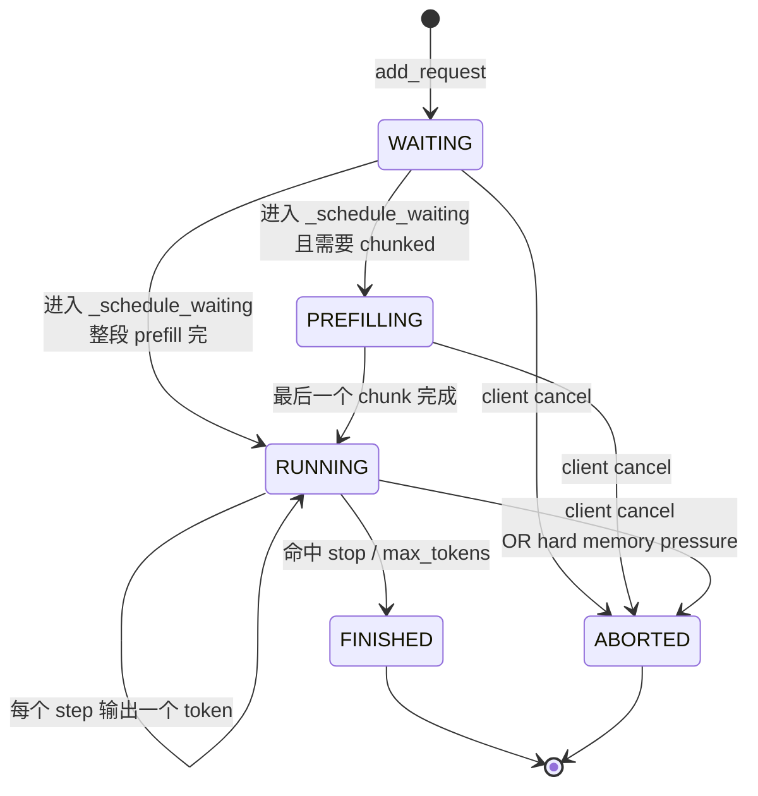
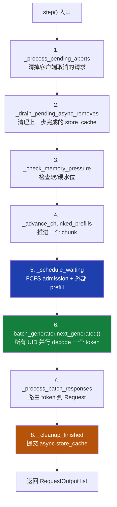
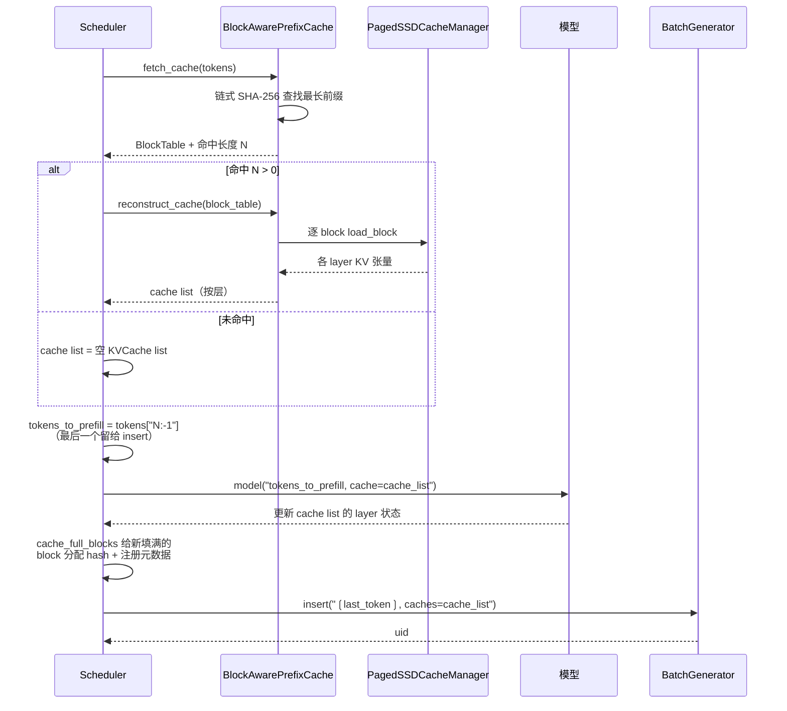
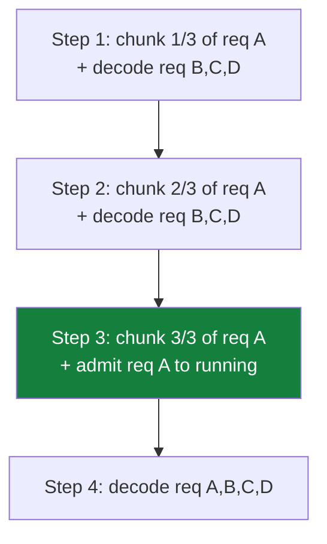
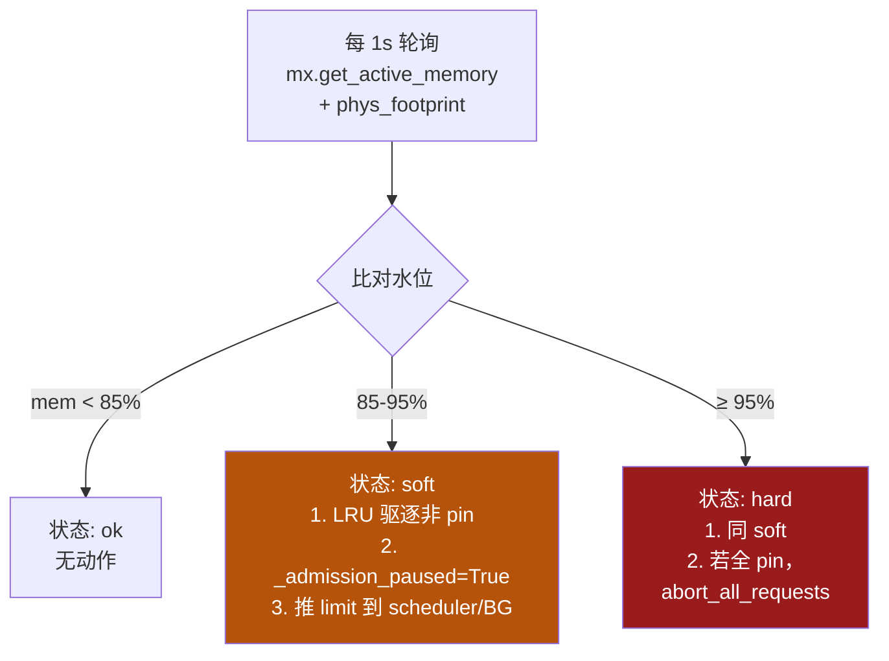
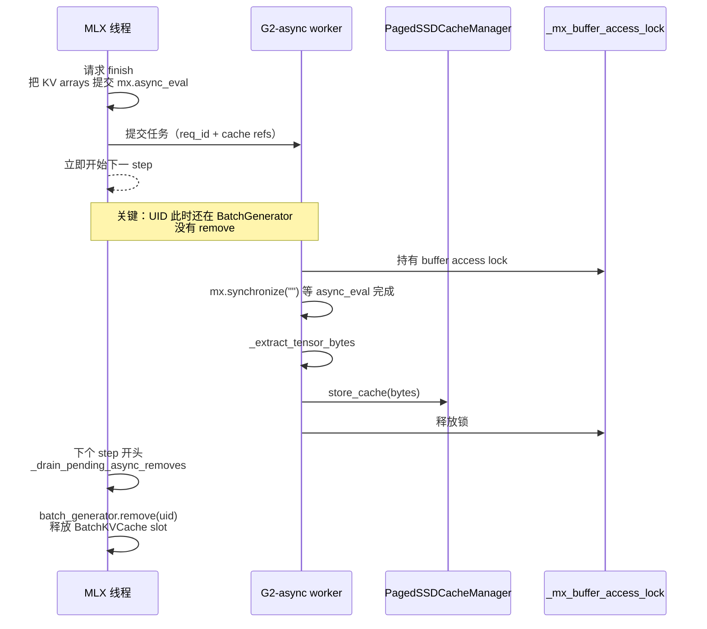
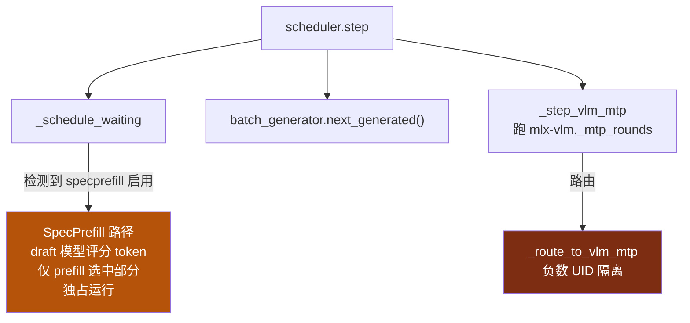

<details>
<summary>相关源文件</summary>

生成本页时使用的主要源文件：

- [omlx/scheduler.py](../../../project-repos/omlx/omlx/scheduler.py)
- [omlx/engine_core.py](../../../project-repos/omlx/omlx/engine_core.py)
- [omlx/request.py](../../../project-repos/omlx/omlx/request.py)
- [omlx/process_memory_enforcer.py](../../../project-repos/omlx/omlx/process_memory_enforcer.py)
- [omlx/memory_monitor.py](../../../project-repos/omlx/omlx/memory_monitor.py)

</details>

# 调度器与连续批处理

`omlx/scheduler.py` 是整个项目最长的单文件，6191 行。这个体量本身就提示了一个事实：**oMLX 把 vLLM 的调度逻辑+ paged cache 协议 + 推测解码三条路径 + 内存防护 + 异步 store-cache 全部塞进了一个类**。

为什么没拆？读完后会理解——这些东西强耦合到很难拆。Scheduler 必须同时知道：哪个请求正在 prefill 的第几个 chunk、哪个 cache block 被哪些请求引用、当前 GPU 显存还剩多少、是否有 SpecPrefill draft 在进行、batch generator 内部哪些 UID 还活着。任何切分都会引入跨模块状态同步，而 GPU 操作要求单线程，跨线程同步反而更复杂。

本页解释这个庞然大物的核心循环、admission 决策、外部 prefill 的实现细节，以及 in-flight 内存防护。

## 核心数据结构与状态

每个被加载的模型对应一个 `Scheduler` 实例（[scheduler.py:628](../../../project-repos/omlx/omlx/scheduler.py#L628)），内部维护几个关键集合：

| 字段 | 类型 | 用途 |
|---|---|---|
| `self.waiting` | `deque[Request]` | 等待 admission 的 FCFS 队列 |
| `self.running` | `list[Request]` | 已 admit 正在 decode 的请求 |
| `self.prefilling` | `deque[Request]` | chunked prefill 进行中的请求 |
| `self.request_id_to_uid` | `dict[str, int]` | oMLX 请求 ID → mlx-lm BatchGenerator UID |
| `self.uid_to_request_id` | `dict[int, str]` | 反向映射 |
| `self.batch_generator` | `BatchGenerator` | mlx-lm 的连续批处理器 |
| `self.block_aware_cache` | `BlockAwarePrefixCache` | 分层 KV 缓存的入口 |
| `self._pending_aborts` | `set[str]` | 待处理的 abort 请求 |
| `self._admission_paused` | `bool` | 由 ProcessMemoryEnforcer 推送的软压力开关 |

请求的状态机定义在 [request.py:90](../../../project-repos/omlx/omlx/request.py#L90)：



`Request` 类持有 prompt tokens、sampling params、生成 token 缓冲、stop 检测状态机、cache block table（如果命中 prefix cache）等。`__lt__` 方法用了 `priority` 字段（[request.py:229-233](../../../project-repos/omlx/omlx/request.py#L229-L233)）但仅在 priority queue 模式下生效——默认 FCFS 仍是 `popleft`。

Sources: [omlx/scheduler.py:628-828](../../../project-repos/omlx/omlx/scheduler.py#L628-L828), [omlx/request.py:90-233](../../../project-repos/omlx/omlx/request.py#L90-L233)

<details class="source-snippets">
<summary>引用源码</summary>

<!-- source-snippets:start -->

#### `omlx/scheduler.py:628-828`

```python
class Scheduler:
    """
    Scheduler for continuous batching using mlx-lm BatchGenerator.

    This scheduler manages the lifecycle of requests:
    1. Requests arrive and are added to the waiting queue
    2. Scheduler moves requests from waiting to running (via BatchGenerator)
    3. BatchGenerator processes all running requests together
    4. Finished requests are removed and outputs returned

    .. note::

       ``_DEFERRED_CLEAR_DELAY`` controls how many generation steps to wait
       after the last request completion before calling ``mx.clear_cache()``.
       Immediate clearing races with IOKit's asynchronous ``completeMemory()``
       callbacks, causing 'prepare count underflow' kernel panics (#435).
       8 steps (~10-40 ms at typical generation speeds) gives IOKit ample
       time to process those callbacks while still reclaiming Metal buffers
       fast enough to prevent TTFT spikes (#411).

    The key insight is that mlx-lm's BatchGenerator already implements
    continuous batching at the token level, so we use it as the backend.
    """

    _DEFERRED_CLEAR_DELAY: int = 8

    def __init__(
        self,
        model: Any,
        tokenizer: Any,
        config: SchedulerConfig | None = None,
    ):
        """
        Initialize the scheduler.

        Args:
            model: The MLX model
            tokenizer: The tokenizer
            config: Scheduler configuration
        """
        self.model = model
        # Deep-copy the tokenizer so the scheduler owns an independent Rust
        # tokenizer backend.  Without this, concurrent access from the asyncio
        # event loop (encode/apply_chat_template in engine handlers) and the
        # MLX executor thread (scheduler.step) causes
        # "RuntimeError: Already borrowed" from the HuggingFace tokenizers
        # Rust RefCell.  See: https://github.com/huggingface/tokenizers/issues/537
        self.tokenizer = copy.deepcopy(tokenizer)
        self.config = copy.copy(config) if config else SchedulerConfig()

        # Load additional EOS tokens from generation_config.json.
        # Some models (e.g. GLM-4.6V) define multiple EOS tokens there
        # that are not in tokenizer.eos_token_id.
        self._generation_config_eos: set[int] | None = (
            self._load_generation_config_eos()
        )

        # For strict RotatingKVCache reuse, align paged cache block size to
        # the model's rotating window size when paged cache is enabled.
        self._align_block_size_with_rotating_window()
        # For ArraysCache-only models (no RotatingKVCache), use a larger block
        # size to reduce boundary snapshot overhead during prefill.
        self._enlarge_block_size_for_arrays_cache()

        # TurboQuant KV cache (set by engine if model_settings has it enabled)
        self._turboquant_kv_bits: float | None = None
        self._turboquant_skip_last: bool = True

        # Request management - following vLLM's design
        self.waiting: deque[Request] = deque()  # Waiting queue (FCFS)
        self.running: dict[str, Request] = {}  # Running requests by ID
        # Chunked prefill queue: requests whose prefill spans multiple steps.
        # Populated when chunked_prefill=True and prompt exceeds prefill_step_size.
        self.prefilling: deque[Request] = deque()
        self._prefill_states: dict[str, _PrefillState] = {}
        self.requests: dict[str, Request] = {}  # All requests by ID
        self.finished_req_ids: set[str] = set()  # Recently finished

        # Thread-safe set for deferred aborts (main thread → executor thread)
        # CPython GIL guarantees set.add() and `x in set` are atomic.
        self._pending_abort_ids: set[str] = set()

        # Lock-free admin snapshot. Published at the end of each step() while
        # the engine thread is the sole writer of running/waiting; the admin
        # endpoint reads the dict reference atomically (GIL) and never iterates
        # the live mutable structures.
        self._admin_snapshot: dict[str, Any] = {
            "running_by_id": {},
            "waiting": [],
        }

        # Memory limits for inline prefill checking.
        # Set by ProcessMemoryEnforcer; propagated to BatchGenerator.
        self._memory_limit_bytes: int = 0  # soft limit
        self._memory_hard_limit_bytes: int = 0  # hard limit (system_ram - 4GB)
        self._prefill_memory_guard: bool = False  # set by ProcessMemoryEnforcer
        # Set to True by ProcessMemoryEnforcer when phys_footprint crosses
        # soft_threshold. Schedulers stop admitting new prefills while this is
        # set; in-flight requests proceed.
        self._admission_paused: bool = False

        # SpecPrefill: draft model for attention-based sparse prefill
        self._specprefill_draft_model: Any | None = None
        # Track active specprefill request for RoPE cleanup
        self._specprefill_active_request_id: str | None = None

        # VLM MTP: gemma4_assistant drafter attached by VLMBatchedEngine.
        # When set, eligible requests bypass mlx-lm BatchGenerator for decode
        # and run through mlx-vlm's _mtp_rounds round loop instead.
        self._vlm_mtp_drafter: VLMMTPDrafter | None = None
        # Active vlm_mtp decode generators keyed by synthesized negative uid
        # (negative to make collision with BatchGenerator uids impossible).
        self._vlm_mtp_active: dict[int, _VLMMTPDecodeState] = {}
        self._vlm_mtp_next_uid: int = -1
        # Per-request settings snapshot for vlm_mtp routing (block size etc.).
        # Injected by VLMBatchedEngine.set_vlm_mtp_drafter alongside the drafter.
        self._vlm_mtp_draft_block_size: int | None = None

        # Phase timing instrumentation for cache-on overhead diagnostics.
        # Accumulated wall-time per phase + invocation count, dumped at request
... snippet truncated ...
```

#### `omlx/request.py:90-233`

```python
@dataclass
class Request:
    """
    Represents a single inference request in the scheduling system.

    Adapted from vLLM's Request class with simplifications for MLX backend.

    Attributes:
        request_id: Unique identifier for this request
        prompt: The input prompt (string or token ids)
        prompt_token_ids: Tokenized prompt
        sampling_params: Parameters for generation
        arrival_time: When the request was received
        status: Current status of the request
        num_prompt_tokens: Number of tokens in the prompt
        num_computed_tokens: Number of tokens processed so far
        output_token_ids: Generated token ids
        output_text: Generated text (decoded)
    """

    request_id: str
    prompt: Union[str, List[int]]
    sampling_params: SamplingParams
    arrival_time: float = field(default_factory=time.monotonic)
    priority: int = 0  # Lower is higher priority

    # Set after tokenization
    prompt_token_ids: Optional[List[int]] = None
    num_prompt_tokens: int = 0

    # Generation state
    status: RequestStatus = RequestStatus.WAITING
    num_computed_tokens: int = 0
    output_token_ids: List[int] = field(default_factory=list)
    output_text: str = ""
    generation_started_at: Optional[float] = None
    last_activity_at: Optional[float] = None

    # For BatchGenerator integration
    batch_uid: Optional[int] = None  # UID assigned by BatchGenerator

    # Prefix cache fields
    prompt_cache: Optional[List[Any]] = None  # Cached KV state from prefix cache
    cached_tokens: int = 0  # Number of tokens retrieved from cache
    remaining_tokens: Optional[List[int]] = None  # Tokens still needing processing

    # Paged cache fields (for BlockAwarePrefixCache)
    block_table: Optional["BlockTable"] = None  # Block table for paged cache
    shared_prefix_blocks: int = 0  # Number of shared prefix blocks

    # Multimodal content (images, video)
    images: Optional[List[Any]] = None
    videos: Optional[List[Any]] = None

    # VLM (Vision-Language Model) fields
    vlm_inputs_embeds: Optional[Any] = None  # Pre-computed vision+text embeddings (mx.array)
    vlm_extra_kwargs: Optional[Dict[str, Any]] = None  # Model-specific kwargs (e.g., position_ids)
    vlm_image_hash: Optional[str] = None  # SHA256 hash of images for prefix cache
    vlm_cache_key_start: int = 0  # Token index where image-specific cache keying starts
    vlm_cache_key_ranges: Optional[List[Tuple[int, str]]] = None  # [(token_start, cumulative_image_hash)]
    rope_deltas: float = 0.0  # Per-request mRoPE position delta (set after VLM prefill)

    @property
    def vlm_extra_keys_for_cache(self) -> Optional[Tuple[str, ...]]:
        """Whole-request image hash wrapped as extra_keys tuple."""
        if self.vlm_image_hash:
            return (self.vlm_image_hash,)
        return None

    @property
    def vlm_extra_key_token_start_for_cache(self) -> Optional[int]:
        """Token index where image-specific cache keying begins."""
        if self.vlm_image_hash:
            return self.vlm_cache_key_start
        return None

    @property
    def vlm_extra_key_ranges_for_cache(
        self,
    ) -> Optional[List[Tuple[int, Tuple[str, ...]]]]:
        """Segmented VLM cache key ranges for per-image-turn keying."""
        if not self.vlm_cache_key_ranges:
            return None
        return [(start, (image_hash,)) for start, image_hash in self.vlm_cache_key_ranges]

    # Metadata
    finish_reason: Optional[str] = None

    # Reasoning model support (for models with <think> tags)
    needs_think_prefix: bool = False    # True if prompt ends with <think> token
    think_prefix_sent: bool = False     # Track if prefix already sent

    # Harmony model support (gpt-oss models)
    is_harmony_model: bool = False      # True if model uses Harmony format

    # SpecPrefill (sparse prefill for MoE models)
    specprefill_indices: Optional[Any] = None  # mx.array of selected token indices
    specprefill_total_tokens: int = 0  # Original total token count (M)
    specprefill_position_offset: int = 0  # RoPE offset = M - N
    specprefill_system_end: int = 0  # Token index where system prompt ends

    # Cache corruption recovery
    cache_corruption_retries: int = 0   # Per-request corruption retry counter

    @property
    def num_output_tokens(self) -> int:
        """Number of output tokens generated so far."""
        return len(self.output_token_ids)

    @property
    def num_tokens(self) -> int:
        """Total number of tokens (prompt + output)."""
        return self.num_prompt_tokens + self.num_output_tokens

    @property
    def max_tokens(self) -> int:
        """Maximum output tokens for this request."""
        return self.sampling_params.max_tokens

    def is_finished(self) -> bool:
... snippet truncated ...
```

<!-- source-snippets:end -->
</details>

## 主循环：Scheduler.step

Scheduler 的核心是 `step()` 方法（[scheduler.py:5441](../../../project-repos/omlx/omlx/scheduler.py#L5441)）。`EngineCore._engine_loop`（[engine_core.py:188](../../../project-repos/omlx/omlx/engine_core.py#L188)）在有请求时不断调用 `await loop.run_in_executor(_mlx_executor, scheduler.step)`。每个 step 内部按顺序执行 7 件事：



整个流程的耗时大头在 step 6（GPU decode），约占总时间 95% 以上。其它步骤都是 CPU 操作，但任何一步出错都会让整个 step 失败——所以每一步都有自己的 try/except 包围。

Sources: [omlx/scheduler.py:5441-5550](../../../project-repos/omlx/omlx/scheduler.py#L5441-L5550), [omlx/engine_core.py:188-238](../../../project-repos/omlx/omlx/engine_core.py#L188-L238)

<details class="source-snippets">
<summary>引用源码</summary>

<!-- source-snippets:start -->

#### `omlx/scheduler.py:5441-5550`

```python
    def step(self) -> SchedulerOutput:
        """
        Execute one scheduling step with automatic error recovery.

        This method:
        1. Schedules waiting requests into the batch
        2. Runs one generation step via BatchGenerator
        3. Processes outputs and handles finished requests
        4. On cache corruption: clears all cache and reschedules requests
           for re-prefill (no error raised to caller)

        Returns:
            SchedulerOutput with results of this step
        """
        output = SchedulerOutput()

        # Process pending aborts FIRST (thread-safe with hybrid executor)
        self._process_pending_aborts()

        # Drain async store_cache completions from prior steps. Each completed
        # entry triggers the deferred batch_generator.remove(uid) on the
        # inference thread. Inflight entries are left for a later step.
        self._drain_pending_async_removes()

        # Check memory pressure and evict if needed (tiered cache)
        if self.memory_monitor is not None:
            self._check_memory_pressure()

        try:
            # Advance in-flight chunked prefills (one chunk per request).
            # Must run before _schedule_waiting() so that completing prefills
            # are inserted into BatchGenerator before the decode step.
            chunked_scheduled: list[Request] = []
            chunked_rejected: list[RequestOutput] = []
            if self.prefilling:
                self._advance_chunked_prefills(chunked_scheduled, chunked_rejected)

            # Schedule waiting requests
            scheduled, rejected = self._schedule_waiting()
            # Merge chunked-prefill completions into the scheduled list.
            if chunked_scheduled:
                scheduled = chunked_scheduled + scheduled
            output.scheduled_request_ids = [r.request_id for r in scheduled]
            output.num_scheduled_tokens = sum(r.num_prompt_tokens for r in scheduled)
            if chunked_rejected:
                output.outputs.extend(chunked_rejected)
                output.has_work = True
            if rejected:
                output.outputs.extend(rejected)
                output.has_work = True

            # Run generation step if we have running requests.
            # Use next_generated() which returns only GenerationBatch.Response
            # objects (prefill is handled externally before insert).
            if (self.batch_generator is not None or self._vlm_mtp_active) and self.running:
                if self.batch_generator is not None:
                    responses = list(self.batch_generator.next_generated())
                else:
                    responses = []
                # Drive vlm_mtp generators alongside BatchGenerator. Order
                # matters only for log determinism; _process_batch_responses
                # is per-uid.
                if self._vlm_mtp_active:
                    responses.extend(self._step_vlm_mtp())
                output.has_work = True

                if responses:
                    outputs, finished_ids = self._process_batch_responses(responses)
                    output.outputs = outputs
                    output.finished_request_ids = finished_ids
                    self._cleanup_finished(finished_ids)

                    # Periodic Metal allocator cleanup during long decodes.
                    # mx.random.categorical inside the sampler allocates a
                    # tiny scalar via gumbel → uniform on every call.
                    # omlx ships its own non-compiled sampler
                    # (omlx/utils/sampling.py) so that RNG state actually
                    # advances in the server, but the trade-off is that
                    # those scalars accumulate in the IOGPU residency set
                    # — macOS aborts at ~4096 entries. Long contexts
                    # (50k+) decoding thousands of tokens hit that limit
                    # mid-stream. Synchronise the generation stream first
                    # so any in-flight Metal command buffer that still
                    # references buffers we're about to drop has
                    # completed; the allocator only releases pool entries
                    # whose ref count is zero, but the sync guarantees
                    # there is no race window. Decode-only path —
                    # next_generated() returns nothing during prefill, so
                    # we never disrupt prefill activation buffers.
                    self._tokens_since_clear_cache = (
                        getattr(self, "_tokens_since_clear_cache", 0)
                        + len(responses)
                    )
                    if self._tokens_since_clear_cache >= 1024:
                        _sync_and_clear_cache()
                        self._tokens_since_clear_cache = 0

        except _PrefillAbortedError:
            # Prefill was interrupted by a pending abort.
            # BatchGenerator is in an inconsistent state (partial
            # prefill), so reset it entirely. Pending aborts will
            # be processed at the start of the next step().
            self.batch_generator = None
            self._current_sampler_params = None
            self._boundary_cache_snapshots.clear()
            if self._boundary_snapshot_store is not None:
                self._boundary_snapshot_store.cleanup_all()
            self._boundary_snapshot_required = None
            # Move any running requests back to waiting so they
            # can be rescheduled with a fresh BatchGenerator.
```

#### `omlx/engine_core.py:188-238`

```python
    async def _engine_loop(self) -> None:
        """Main engine loop - runs scheduler steps on the MLX executor.

        All scheduler steps run on _mlx_executor (single-worker thread) to
        guarantee that MLX GPU operations are never concurrent.  VLM vision
        encoding also runs on the same executor, so inline scheduler.step()
        on the event loop would race with vision mx.eval() and segfault.
        """
        loop = asyncio.get_running_loop()

        step_interval = self.config.step_interval
        stream_interval = self.config.stream_interval
        use_simple_streaming = (stream_interval == 1)

        while self._running:
            try:
                if self.scheduler.has_requests():
                    output = await loop.run_in_executor(
                        self._mlx_executor, self.scheduler.step
                    )
                    self._steps_executed += 1

                    # Fast path: distribute outputs to collectors
                    outputs = output.outputs
                    if outputs:
                        collectors = self._output_collectors
                        states = self._stream_states
                        events = self._finished_events

                        for req_output in outputs:
                            rid = req_output.request_id
                            collector = collectors.get(rid)

                            if collector is not None:
                                # Optimized: skip stream_interval check when interval=1
                                if use_simple_streaming:
                                    collector.put(req_output)
                                else:
                                    state = states.get(rid)
                                    if state and state.should_send(
                                        req_output.completion_tokens,
                                        req_output.finished
                                    ):
                                        collector.put(req_output)
                                        state.mark_sent(req_output.completion_tokens)

                            if req_output.finished:
                                event = events.get(rid)
                                if event:
                                    event.set()
                                # Note: cleanup is handled by stream_outputs() finally block
```

<!-- source-snippets:end -->
</details>

## Admission：_schedule_waiting

Admission 是整个 scheduler 最复杂的子流程。`_schedule_waiting`（[scheduler.py:4277](../../../project-repos/omlx/omlx/scheduler.py#L4277)）的伪代码：

```python
def _schedule_waiting(self):
    while self.waiting and len(self.running) < max_num_seqs:
        if self._admission_paused: break
        if mx.get_active_memory() > _memory_limit_bytes: break

        req = self.waiting.popleft()

        # 预检：估算这个请求的 prefill 内存峰值
        if not self._preflight_memory_check(req):
            self.waiting.appendleft(req)  # 退回队首
            break

        # 同质性检查：VLM 与 text、cache-hit 与 cache-miss、SpecPrefill 不能混批
        if not self._is_compatible_with_batch(req):
            self.waiting.appendleft(req)
            break

        # 外部 prefill
        cache_list = self._do_external_prefill(req)

        # 把"最后一个 token" 给 BatchGenerator 作为 decode 入口
        uid = self.batch_generator.insert(
            [req.last_token],
            caches=[cache_list],
            samplers=[req.sampler],
            ...
        )

        self.request_id_to_uid[req.request_id] = uid
        self.running.append(req)
```

几个非显然的约束：

- **每次只 admit 一个**：循环边界是 `while waiting and running < max_num_seqs`，但任何一次失败（内存、同质性）都 `break`——不是 `continue`。这避免一个不能 admit 的请求阻塞它后面的请求时反复尝试。
- **同质性 gate**：[scheduler.py:4373-4419](../../../project-repos/omlx/omlx/scheduler.py#L4373-L4419) 列出四种隔离：(a) VLM 不能跟 text 一起 batch（多模态 input shape 不同），(b) cache-hit 不能跟 cache-miss 一起（前者跳 prefill），(c) SpecPrefill draft 必须独占（draft 模型加载占资源），(d) chunked prefill 跟普通 prefill 隔离。
- **`_preflight_memory_check`**：[scheduler.py:4229-4275](../../../project-repos/omlx/omlx/scheduler.py#L4229-L4275)。估算逻辑包含 SDPA 矩阵峰值（`head_dim > 128` 时 mlx-lm 会 fallback 到 materialized attention，内存翻倍）+ KV 增长。这个估算保守是为了避免请求中途 OOM。

Sources: [omlx/scheduler.py:4277-4419](../../../project-repos/omlx/omlx/scheduler.py#L4277-L4419), [omlx/scheduler.py:4229-4275](../../../project-repos/omlx/omlx/scheduler.py#L4229-L4275)

<details class="source-snippets">
<summary>引用源码</summary>

<!-- source-snippets:start -->

#### `omlx/scheduler.py:4277-4419`

```python
    def _schedule_waiting(
        self,
    ) -> tuple[list["Request"], list[RequestOutput]]:
        """
        Move requests from waiting queue to running.

        Each request is prefilled externally before being inserted into
        BatchGenerator, so prefill_batch_size=1 is always used. Cache
        status homogeneity tracking is kept for safety since it affects
        how we handle the existing_cache argument.

        Returns:
            Tuple of (scheduled requests, rejected error outputs)
        """
        scheduled = []
        rejected_outputs: list[RequestOutput] = []

        # Track cache status of first scheduled request to ensure homogeneity
        # None = not determined yet, True = has cache, False = no cache
        batch_cache_status: bool | None = None
        # Track VLM status: VLM and text-only requests cannot be in the same prefill batch
        # None = not determined yet, True = VLM request, False = text-only request
        batch_vlm_status: bool | None = None
        # Track SpecPrefill: these requests must be alone (RoPE patching affects whole model)
        batch_specprefill_status: bool | None = None

        while self.waiting and len(self.running) < self.config.max_num_seqs:
            # Admission pause: set by ProcessMemoryEnforcer when phys
            # crosses soft_threshold. New prefills wait; in-flight requests
            # continue. First request always passes (self.running is empty)
            # so admission can recover by completing the current generation.
            if self._admission_paused and self.running:
                logger.debug(
                    "Admission paused by memory pressure, %d running",
                    len(self.running),
                )
                break

            # Generation memory guard: when requests are already running,
            # defer scheduling if memory pressure is high to prevent
            # Metal allocation failures during batch_generator.next().
            # First request always passes (self.running is empty).
            if (
                self._prefill_memory_guard
                and self._memory_limit_bytes > 0
                and self.running
            ):
                current = max(mx.get_active_memory(), get_phys_footprint())
                if current > self._memory_limit_bytes:
                    logger.debug(
                        "Generation memory guard: deferring scheduling "
                        "(%s > %s), %d running",
                        current,
                        self._memory_limit_bytes,
                        len(self.running),
                    )
                    break

            request = self.waiting.popleft()

            # Ensure we have a batch generator
            self._ensure_batch_generator(request.sampling_params)

            if self.batch_generator is None:
                # Put back and try again later
                self.waiting.appendleft(request)
                break

            # Determine tokens to process and cache to use
            # Note: Don't use `remaining_tokens or prompt_token_ids` because empty list
            # is falsy in Python. For exact cache match, remaining_tokens=[] but we should
            # pass just the last token so BatchGenerator can start generation.
            if (
                request.remaining_tokens is not None
                and len(request.remaining_tokens) == 0
            ):
                # Exact cache match - pass only last token for generation kickoff
                tokens_to_process = request.prompt_token_ids[-1:]
            elif request.remaining_tokens:
                tokens_to_process = request.remaining_tokens
            else:
                tokens_to_process = request.prompt_token_ids
            cache_to_use = request.prompt_cache  # May be None

            # Validate cache before using it
            if cache_to_use is not None and not self._validate_cache(cache_to_use):
                logger.debug(
                    f"Request {request.request_id}: invalid cache detected, "
                    f"proceeding without cache"
                )
                cache_to_use = None
                request.prompt_cache = None
                request.cached_tokens = 0
                request.remaining_tokens = request.prompt_token_ids
                tokens_to_process = request.prompt_token_ids

            # SpecPrefill requests must be alone in the batch (RoPE patching
            # affects the entire model). Also block scheduling if another
            # specprefill request is already running (offset RoPE active).
            request_is_specprefill = request.specprefill_indices is not None
            if (
                self._specprefill_active_request_id is not None
                and not request_is_specprefill
            ):
                # A specprefill request is running — defer all others until it finishes
                self.waiting.appendleft(request)
                break
            if batch_specprefill_status is None:
                batch_specprefill_status = request_is_specprefill
            elif batch_specprefill_status != request_is_specprefill:
                self.waiting.appendleft(request)
                break
            if request_is_specprefill and len(scheduled) > 0:
                # SpecPrefill request must be alone
                self.waiting.appendleft(request)
                break

            # Check VLM status homogeneity: VLM and text-only requests use
            # different prefill paths (embeddings vs token IDs)
            request_is_vlm = request.vlm_inputs_embeds is not None
... snippet truncated ...
```

#### `omlx/scheduler.py:4229-4275`

```python
    def _preflight_memory_check(self, request: "Request") -> str | None:
        """
        Estimate whether prefill would exceed memory limits.

        Computes worst-case peak memory for the last prefill chunk
        (model weights + KV cache + SDPA attention matrix) and rejects
        if it would exceed the hard limit.

        For head_dim > 128, MLX SDPA uses a fallback that materializes
        the full attention matrix [B, n_q, chunk, kv_len] in float32.
        For head_dim <= 128, MLX uses a fused kernel with O(n) memory.

        Returns:
            Error message string if request should be rejected, None if OK.
        """
        if not self._prefill_memory_guard:
            return None
        if self._memory_hard_limit_bytes <= 0:
            return None
        if self.memory_monitor is None:
            return None

        prompt_tokens = request.num_prompt_tokens
        cached_tokens = request.cached_tokens or 0
        new_tokens = max(prompt_tokens - cached_tokens, 0)

        if new_tokens == 0:
            return None

        peak = self.memory_monitor.estimate_prefill_peak_bytes(
            new_tokens, self.config.prefill_step_size, cached_tokens=cached_tokens
        )
        if peak == 0:
            return None  # can't estimate, skip

        current = max(mx.get_active_memory(), get_phys_footprint())

        if current + peak > self._memory_hard_limit_bytes:
            from .utils.hardware import format_bytes

            return (
                f"Prefill would require ~{format_bytes(current + peak)} peak "
                f"(current {format_bytes(current)} + KV+SDPA {format_bytes(peak)}) "
                f"but limit is {format_bytes(self._memory_hard_limit_bytes)}. "
                f"Reduce context length or increase --max-process-memory."
            )
        return None
```

<!-- source-snippets:end -->
</details>

## 外部 prefill 的具体动作

`_do_external_prefill`（[scheduler.py:4676-4811](../../../project-repos/omlx/omlx/scheduler.py#L4676-L4811)）是 prefill 路径的核心：



每一步都有非显然的细节：

- **`fetch_cache` 是两层查找**：先 `paged_cache.find_shared_prefix`（chain-hash lookup），再 `_find_best_prefix_match` 走 `_prefix_index`。两个索引存在意义是：前者是请求级元数据池，后者是经过 `(prefix_len, block_ids)` 编码的快速最长前缀匹配器（[prefix_cache.py:2317-2350](../../../project-repos/omlx/omlx/cache/prefix_cache.py#L2317-L2350)）。
- **`reconstruct_cache` 是真正的 SSD I/O 点**：之前 fetch 只看元数据，到这里才真去 SSD 读 bytes。命中的块通过 `_promote_to_hot_cache` 加入 RAM 热缓存以加速后续读取。
- **`cache_full_blocks`**：[paged_cache.py:900-954](../../../project-repos/omlx/omlx/cache/paged_cache.py#L900-L954)。给新填满的 block 计算链式 hash 并注册——这样下次有请求带同样前缀就能命中。
- **`batch_generator.insert([last_token], ...)`**：[scheduler.py:4811](../../../project-repos/omlx/omlx/scheduler.py#L4811)。把仅含一个 token 的"prompt"和已经 prefill 好的 cache 一起塞进 mlx-lm，让它从首个 decode step 开始。这就是"外部 prefill + 仅 decode 插入"的具体含义。

Sources: [omlx/scheduler.py:4676-4811](../../../project-repos/omlx/omlx/scheduler.py#L4676-L4811), [omlx/cache/paged_cache.py:900-954](../../../project-repos/omlx/omlx/cache/paged_cache.py#L900-L954)

<details class="source-snippets">
<summary>引用源码</summary>

<!-- source-snippets:start -->

#### `omlx/scheduler.py:4676-4811`

```python
            # External prefill: process tokens[0:N-1] outside BatchGenerator.
            # Only the last token goes to insert() for the first decode step.
            # SpecPrefill already handled its own prefill above, so skip for those.
            if request.specprefill_indices is None and len(tokens_to_process) > 1:
                vlm_embeds = None
                if request.vlm_inputs_embeds is not None:
                    vlm_embeds = (
                        request.vlm_inputs_embeds,
                        request.vlm_extra_kwargs or {},
                        request.cached_tokens,
                    )

                # Chunked prefill: non-VLM prompts longer than one step are
                # spread across multiple step() calls. The first chunk is run
                # here; subsequent chunks run in _advance_chunked_prefills().
                if (
                    self.config.chunked_prefill
                    and vlm_embeds is None
                    and len(tokens_to_process) > self.config.prefill_step_size + 1
                ):
                    sm = self._build_state_machine(request)
                    per_row_lps = list(logits_processors) if logits_processors else []
                    state = self._begin_prefill(request, tokens_to_process, cache_to_use)
                    state.sampler = sampler
                    state.sm = sm
                    state.per_row_lps = per_row_lps

                    try:
                        done = self._step_prefill_chunk(state)
                    except _PrefillAbortedError:
                        raise

                    if done:
                        self._emit_final_boundary_if_needed(state)
                        _sync_and_clear_cache()
                        get_prefill_tracker().remove(request.request_id)
                        self._insert_prefilled_request(request, state, scheduled)
                    else:
                        self.prefilling.append(request)
                        self._prefill_states[request.request_id] = state
                    continue  # Skip normal prefill + insert path

                # Normal (non-chunked) full prefill path.
                # Assign a temporary UID so progress callbacks can map
                # uid→request_id during external prefill. Replaced by the
                # real UID returned from insert().
                temp_uid = id(request)  # unique, won't collide with BatchGenerator UIDs
                self.request_id_to_uid[request.request_id] = temp_uid
                self.uid_to_request_id[temp_uid] = request.request_id

                prefilled_cache, last_token = self._do_external_prefill(
                    request,
                    tokens_to_process,
                    cache_to_use,
                    vlm_embeds=vlm_embeds,
                )

                # Clean up temp UID mapping
                del self.uid_to_request_id[temp_uid]
                del self.request_id_to_uid[request.request_id]

                # Prefill complete: remove from progress tracker so dashboard
                # shows "generating" instead of "PP" during decode.
                get_prefill_tracker().remove(request.request_id)

                cache_to_use = prefilled_cache
                tokens_to_process = last_token

            # Capture per-request mRoPE rope_deltas for decode.
            # Prefer _captured_rope_deltas from per-request extra_kwargs
            # (set during get_input_embeddings), since the global
            # _rope_deltas may be stale when explicit position_ids are used.
            if request.vlm_inputs_embeds is not None:
                extra = request.vlm_extra_kwargs or {}
                captured = extra.get("_captured_rope_deltas")
                if captured is not None:
                    if hasattr(captured, "item"):
                        request.rope_deltas = float(captured.item())
                    else:
                        request.rope_deltas = float(captured)
                elif hasattr(self.model, "get_last_rope_deltas"):
                    request.rope_deltas = self.model.get_last_rope_deltas()

            # Build per-request state machine for stop tokens
            sm = self._build_state_machine(request)

            # Set random seed for reproducible generation (best-effort).
            # This affects global MLX random state, so concurrent requests
            # may interfere. Matches OpenAI's best-effort seed semantics.
            if request.sampling_params.seed is not None:
                mx.random.seed(request.sampling_params.seed)

            # NOTE: TurboQuant KV conversion is not applied during prefill.
            # See _do_external_prefill() comment for rationale (#771).

            # VLM MTP routing: if a gemma4_assistant drafter is attached, run
            # an extra last-token forward to capture hidden + shared_kv_states,
            # sample the first bonus, and hand the request to a vlm_mtp
            # generator instead of BatchGenerator. Falls through on any
            # eligibility issue so other speculative paths stay intact.
            if self._vlm_mtp_drafter is not None and cache_to_use is not None:
                vlm_mtp_uid = self._route_to_vlm_mtp(
                    request, cache_to_use, tokens_to_process, sampler, sm
                )
                if vlm_mtp_uid is not None:
                    self.request_id_to_uid[request.request_id] = vlm_mtp_uid
                    self.uid_to_request_id[vlm_mtp_uid] = request.request_id
                    now = time.monotonic()
                    request.batch_uid = vlm_mtp_uid
                    request.status = RequestStatus.RUNNING
                    request.generation_started_at = now
                    request.last_activity_at = now
                    self.running[request.request_id] = request
                    scheduled.append(request)
                    self.total_prompt_tokens += request.num_prompt_tokens
                    logger.debug(
                        f"Scheduled request {request.request_id} via vlm_mtp "
                        f"(uid={vlm_mtp_uid}, {request.num_prompt_tokens} prompt tokens)"
                    )
                    continue
... snippet truncated ...
```

#### `omlx/cache/paged_cache.py:900-954`

```python
    def cache_full_blocks(
        self,
        blocks: List[CacheBlock],
        token_ids: List[int],
        num_cached_blocks: int,
        num_full_blocks: int,
        extra_keys: Optional[Tuple[Any, ...]] = None,
    ) -> None:
        """
        Cache full blocks for prefix caching (vLLM style).

        Computes chain hashes and adds blocks to the cache.

        Args:
            blocks: All blocks for the request
            token_ids: All token IDs for the request
            num_cached_blocks: Number of blocks already cached
            num_full_blocks: Number of full blocks to cache
            extra_keys: Additional keys for hash (e.g., VLM image hash)
        """
        if not self.enable_caching:
            return

        if num_cached_blocks >= num_full_blocks:
            return

        with self._lock:
            # Get parent hash from last cached block
            parent_hash = None
            if num_cached_blocks > 0:
                parent_hash = blocks[num_cached_blocks - 1].block_hash

            for i in range(num_cached_blocks, num_full_blocks):
                block = blocks[i]
                if block.block_hash is not None:
                    parent_hash = block.block_hash
                    continue  # Already cached

                # Get tokens for this block
                start = i * self.block_size
                end = start + self.block_size
                block_tokens = token_ids[start:end]

                # Compute chain hash
                block_hash = compute_block_hash(
                    parent_hash, block_tokens,
                    extra_keys=extra_keys, model_name=self.model_name,
                )
                block.block_hash = block_hash
                block.token_count = len(block_tokens)

                # Add to cache
                self.cached_block_hash_to_block.insert(block_hash, block)

                parent_hash = block_hash
```

<!-- source-snippets:end -->
</details>

## Chunked Prefill 的并行调度

当一个请求的 prompt 长到一次 prefill 会撑爆显存时，Scheduler 把它放进 `self.prefilling` deque，每个 step 推进**一个 chunk**。关键代码在 `_advance_chunked_prefills`（[scheduler.py:4691-4716](../../../project-repos/omlx/omlx/scheduler.py#L4691-L4716)）：



巧妙之处：**chunked prefill 跟 decode 并存在同一个 step**——chunk 的 forward pass 跟 decode 的 forward pass 都在同一个 mlx-lm 调用里完成。这让 TTFT 极大降低，因为其它已经 decode 的请求不会被新请求的 prefill 阻塞。代价是 chunk-boundary 上若有 `RotatingKVCache`，需要写 boundary snapshot 到 SSD，下一个 chunk 再读回——见 [分层 KV 缓存](tiered-kv-cache.md) 中关于 `BoundarySnapshotSSDStore` 的描述。

Sources: [omlx/scheduler.py:4691-4716](../../../project-repos/omlx/omlx/scheduler.py#L4691-L4716)

<details class="source-snippets">
<summary>引用源码</summary>

<!-- source-snippets:start -->

#### `omlx/scheduler.py:4691-4716`

```python
                if (
                    self.config.chunked_prefill
                    and vlm_embeds is None
                    and len(tokens_to_process) > self.config.prefill_step_size + 1
                ):
                    sm = self._build_state_machine(request)
                    per_row_lps = list(logits_processors) if logits_processors else []
                    state = self._begin_prefill(request, tokens_to_process, cache_to_use)
                    state.sampler = sampler
                    state.sm = sm
                    state.per_row_lps = per_row_lps

                    try:
                        done = self._step_prefill_chunk(state)
                    except _PrefillAbortedError:
                        raise

                    if done:
                        self._emit_final_boundary_if_needed(state)
                        _sync_and_clear_cache()
                        get_prefill_tracker().remove(request.request_id)
                        self._insert_prefilled_request(request, state, scheduled)
                    else:
                        self.prefilling.append(request)
                        self._prefill_states[request.request_id] = state
                    continue  # Skip normal prefill + insert path
```

<!-- source-snippets:end -->
</details>

## 内存防护的双水位 + 软暂停

`ProcessMemoryEnforcer`（[process_memory_enforcer.py:37](../../../project-repos/omlx/omlx/process_memory_enforcer.py#L37)）在独立线程每秒轮询：

```
mem = max(mx.get_active_memory(), get_phys_footprint())
soft_watermark = 0.85 * max_bytes
hard_watermark = 0.95 * max_bytes
```

三种状态、三套响应（[process_memory_enforcer.py:254-393](../../../project-repos/omlx/omlx/process_memory_enforcer.py#L254-L393)）：

| 状态 | 触发条件 | 动作 |
|---|---|---|
| `ok` | mem < soft | 无动作 |
| `soft` | soft ≤ mem < hard | LRU 驱逐非 pin 模型；`_admission_paused = True` 推到每个 scheduler，新 prefill 不再 admit；in-flight 请求继续 |
| `hard` | mem ≥ hard | 同 soft，**外加**：若所有 loaded 都 pin，调最后一个非 pin 的 `abort_all_requests()` 释放 KV blocks（不卸载模型） |

软暂停的传播机制：`_propagate_memory_limit`（[process_memory_enforcer.py:201-216](../../../project-repos/omlx/omlx/process_memory_enforcer.py#L201-L216)）会把 soft/hard 字节数推到 (a) 每个 `Scheduler._memory_limit_bytes` 和 `_memory_hard_limit_bytes`、(b) 每个 `BatchGenerator._memory_limit_bytes`。这意味着 mlx-lm 内部也会感知到。



设计哲学：**绝不 kill 进程，绝不软退化**。这是本地服务跟云端 vLLM 不同的地方——本地服务的用户希望"再差也别让我重启服务"，所以 in-flight 请求只在硬水位+无非 pin 模型可驱逐时才会被 abort，而且会附带明确错误消息（[engine_core.py:408-419](../../../project-repos/omlx/omlx/engine_core.py#L408-L419)）。

Sources: [omlx/process_memory_enforcer.py:37-393](../../../project-repos/omlx/omlx/process_memory_enforcer.py#L37-L393), [omlx/scheduler.py:4308-4313](../../../project-repos/omlx/omlx/scheduler.py#L4308-L4313)

<details class="source-snippets">
<summary>引用源码</summary>

<!-- source-snippets:start -->

#### `omlx/process_memory_enforcer.py:37-393`

```python
class ProcessMemoryEnforcer:
    """
    Background task that enforces process-level memory limits.

    Polls mx.get_active_memory() every poll_interval seconds and unloads
    LRU models from EnginePool when the limit is exceeded.
    """

    def __init__(
        self,
        engine_pool: EnginePool,
        max_bytes: int,
        poll_interval: float = 1.0,
        settings_manager: ModelSettingsManager | None = None,
        prefill_memory_guard: bool = True,
        global_settings: GlobalSettings | None = None,
        soft_threshold: float = 0.85,
        hard_threshold: float = 0.95,
    ):
        """
        Initialize the process memory enforcer.

        Args:
            engine_pool: The engine pool to evict models from.
            max_bytes: Maximum allowed process memory in bytes (compared
                against max(mx.get_active_memory(), phys_footprint)).
            poll_interval: Seconds between memory checks.
            settings_manager: Optional settings manager for TTL checks.
            prefill_memory_guard: Whether to enable pre-flight memory
                estimation to reject requests that would exceed limits.
            global_settings: Optional global settings for idle timeout.
            soft_threshold: Fraction of max_bytes that triggers soft action
                (LRU non-pinned eviction + admission pause; in-flight allowed).
            hard_threshold: Fraction of max_bytes that triggers hard action
                (also abort in-flight when all loaded models are pinned).
        """
        self._engine_pool = engine_pool
        self._max_bytes = max_bytes
        self._poll_interval = poll_interval
        self._settings_manager = settings_manager
        self._prefill_memory_guard = prefill_memory_guard
        self._global_settings = global_settings
        self._soft_threshold = soft_threshold
        self._hard_threshold = hard_threshold
        self._task: asyncio.Task | None = None
        self._running = False
        # Most recently observed pressure level, consumed by scheduler /
        # admission control. Updated on every poll iteration.
        self._pressure_level: str = "ok"

    @property
    def max_bytes(self) -> int:
        """Maximum allowed Metal memory in bytes."""
        return self._max_bytes

    @max_bytes.setter
    def max_bytes(self, value: int) -> None:
        old = self._max_bytes
        self._max_bytes = value
        if self._running:
            self._propagate_memory_limit()
            self._set_metal_memory_limit()
        logger.info(
            f"Process memory limit changed: "
            f"{_format_gb(old)} -> {_format_gb(value)}"
        )

    @property
    def is_running(self) -> bool:
        """Whether the enforcement loop is active."""
        return self._running

    def start(self) -> None:
        """Start the background enforcement loop."""
        if self._running:
            return
        self._running = True
        self._propagate_memory_limit()
        self._set_metal_memory_limit()
        self._task = asyncio.create_task(self._enforcement_loop())
        logger.info(
            f"Process memory enforcer started "
            f"(limit: {_format_gb(self._max_bytes)}, "
            f"interval: {self._poll_interval}s)"
        )

    def _get_hard_limit_bytes(self) -> int:
        """Hard limit for inline prefill check: system_ram - 4GB.

        Returns 0 if enforcement is disabled (max_bytes <= 0).
        Always >= max_bytes so prefill gets headroom above the soft limit.

        Note: this is the absolute system ceiling for the scheduler's prefill
        check, distinct from the enforcer's own soft/hard watermarks
        (`_soft_bytes` / `_hard_bytes`) which trigger LRU eviction.
        """
        if self._max_bytes <= 0:
            return 0
        from .settings import get_system_memory

        return max(get_system_memory() - 4 * 1024**3, self._max_bytes)

    @property
    def _soft_bytes(self) -> int:
        """Soft watermark: max_bytes * soft_threshold."""
        if self._max_bytes <= 0:
            return 0
        return int(self._max_bytes * self._soft_threshold)

    @property
    def _hard_bytes(self) -> int:
        """Hard watermark: max_bytes * hard_threshold."""
        if self._max_bytes <= 0:
            return 0
        return int(self._max_bytes * self._hard_threshold)

    def _current_usage_bytes(self) -> int:
        """Process memory usage as seen by macOS jetsam.

        Combines MLX-reported active memory and the kernel phys_footprint
... snippet truncated ...
```

#### `omlx/scheduler.py:4308-4313`

```python
            if self._admission_paused and self.running:
                logger.debug(
                    "Admission paused by memory pressure, %d running",
                    len(self.running),
                )
                break
```

<!-- source-snippets:end -->
</details>

## Async store-cache：finished 之后才落盘

当一个请求 finished 时，它最后一个块的 KV 还在 mlx-lm 的 BatchGenerator 内部。如果同步把这些 KV bytes 提取出来调 `block_aware_cache.store_cache`，会阻塞 inference 线程的下一个 step——对一个 28 GB 上下文的模型，一次提取可能要几十毫秒到几秒。

oMLX 的方案：**异步 store + 延迟 remove**。`_cleanup_finished`（[scheduler.py:5081](../../../project-repos/omlx/omlx/scheduler.py#L5081)）提交一个后台任务到专用的单 worker `ThreadPoolExecutor`（命名 `"G2-async"`，[scheduler.py:752-828](../../../project-repos/omlx/omlx/scheduler.py#L752-L828)）：



两个细节决定这套机制的安全性：

- **延迟 remove**：`batch_generator.remove(uid)` 不在 finish 时立即调用，而是延迟到**下一个 step 的开头** `_drain_pending_async_removes` 才执行。这保证 G2 worker 在读 KV buffer 期间，对应的 BatchKVCache slot 不会被复用——避免读到已被覆盖的内存。
- **_mx_buffer_access_lock**：G2 worker 和主线程的 `mx.clear_cache()` 调用通过 `_mx_buffer_access_lock`（[scheduler.py:1054-1072](../../../project-repos/omlx/omlx/scheduler.py#L1054-L1072)）互斥。`mx.clear_cache()` 会把 Metal buffer 池里的空闲块释放，如果 G2 worker 正在读某个 buffer，这次 clear 会让它读到无效内存。这个锁同时也阻塞内存防护线程触发的 clear。

代价：post-finish 到 SSD 落盘有几十毫秒到几秒延迟。在这段时间窗口内，如果同样的 prefix 再次到来，会触发"miss → re-prefill"，但这是可接受的——下次再来就会命中。

Sources: [omlx/scheduler.py:1020-1080](../../../project-repos/omlx/omlx/scheduler.py#L1020-L1080), [omlx/scheduler.py:752-828](../../../project-repos/omlx/omlx/scheduler.py#L752-L828), [omlx/scheduler.py:5081](../../../project-repos/omlx/omlx/scheduler.py:5081)

<details class="source-snippets">
<summary>引用源码</summary>

<!-- source-snippets:start -->

#### `omlx/scheduler.py:1020-1080`

```python
    def _async_store_cache_worker(
        self,
        request_id: str,
        token_sequence_to_store: list[int],
        cache_to_store: list[Any],
        model_cache_config: Any | None,
        intermediate_snapshots: dict[int, list[Any]] | None,
        extra_keys: tuple[Any, ...] | None,
        extra_key_token_start: int | None,
        extra_key_ranges: list[tuple[int, tuple[Any, ...]]] | None,
    ) -> None:
        """Run store_cache + paged_cache cleanup off the inference thread.

        Pre-conditions enforced by the caller (_cleanup_finished):
        - mx.async_eval() was called on the inference thread for all
          KV cache arrays, dispatching materialization asynchronously
          without blocking the inference thread. async_eval completes
          Metal command enqueueing before returning, so all commands
          are submitted by the time executor.submit() runs.
        - This worker calls mx.synchronize() (global barrier — waits
          all streams) to ensure materialization is complete before
          extracting tensor bytes. Stream-scoped sync is not possible
          here because generation_stream is thread-local to the
          inference thread.
        - bfloat16 view+eval inside _extract_tensor_bytes runs on this
          worker's default mx stream, isolated from generation_stream;
          the underlying buffer is read-only at this point.
        - batch_generator.remove(uid) is deferred until this worker
          completes (handled by _drain_pending_async_removes).

        paged_cache_manager and block_aware_cache rely on
        threading.RLock so concurrent access from main and worker is safe.
        """
        try:
            # Hold _mx_buffer_access_lock across the worker's mx-buffer
            # access. store_cache eventually drives _extract_tensor_bytes,
            # which reads raw bytes via the buffer protocol; serializing
            # against inference-thread mx.clear_cache / mx.synchronize calls
            # prevents a SIGABRT when those reclaim the underlying Metal
            # buffer pool mid-read (#1106).
            with _mx_buffer_access_lock:
                with self._phase_timer("store_cache_worker_sync"):
                    mx.synchronize()
                block_table = self.block_aware_cache.store_cache(
                    request_id,
                    token_sequence_to_store,
                    cache_to_store,
                    model_cache_config=model_cache_config,
                    boundary_snapshots=intermediate_snapshots,
                    extra_keys=extra_keys,
                    extra_key_token_start=extra_key_token_start,
                    extra_key_ranges=extra_key_ranges,
                )
            if block_table is None and self.paged_cache_manager is not None:
                block_table = self.paged_cache_manager.get_block_table(request_id)
            if block_table and self.paged_cache_manager is not None:
                self.paged_cache_manager.release_for_eviction(block_table.block_ids)
            if self.block_aware_cache is not None:
                self.block_aware_cache.clear_request_entry(request_id)
        except Exception as e:
            logger.warning("Async store_cache failed for %s: %s", request_id, e)
```

#### `omlx/scheduler.py:752-828`

```python
        # Async store_cache executor (G2-async). Offloads the post-finish
        # bulk memcpy (28GB+ per 32k request) off the inference thread so
        # response streaming isn't blocked by it.
        self._store_cache_executor: concurrent.futures.ThreadPoolExecutor | None = None
        # Pending (uid, request_id, future) entries waiting for async store
        # to finish before batch_generator.remove() can safely run. Drained
        # at the start of every step.
        self._pending_async_removes: deque = deque()
        # Track in-flight store futures per request_id for lookup wait /
        # shutdown wait.
        self._inflight_store_futures: dict[str, concurrent.futures.Future] = {}

        # Mapping between our request IDs and BatchGenerator UIDs
        self.request_id_to_uid: dict[str, int] = {}
        self.uid_to_request_id: dict[int, str] = {}

        # BatchGenerator - the actual batching engine
        self.batch_generator: BatchGenerator | None = None
        self._current_sampler_params: tuple | None = None
        # Boundary cache snapshots for stateful non-sliceable caches (e.g., ArraysCache).
        # request_id -> {token_count -> snapshot_cache_or_None}
        # Multiple snapshots per request to support per-block ArraysCache state storage.
        # Values are None when offloaded to SSD via _boundary_snapshot_store.
        self._boundary_cache_snapshots: dict[str, dict[int, Any]] = {}
        # Lazy detection flag: True/False once determined, None before first check.
        self._boundary_snapshot_required: bool | None = None
        # SSD store for offloading boundary snapshots (initialized in _init_tiered_cache).
        self._boundary_snapshot_store: BoundarySnapshotSSDStore | None = None

        # paged SSD cache for KV state persistence (oMLX only supports paged SSD-based caching)
        self.paged_cache_manager: PagedCacheManager | None = None
        self.block_aware_cache: BlockAwarePrefixCache | None = None
        self.paged_ssd_cache_manager: PagedSSDCacheManager | None = None
        self._cache_rate_tracker = CacheRateTracker()
        self.memory_monitor: MemoryMonitor | None = None

        # Initialize paged SSD cache if paged_ssd_cache_dir is specified
        if self.config.paged_ssd_cache_dir:
            # Calculate max_blocks automatically if not specified
            if self.config.max_cache_blocks is not None:
                max_blocks = self.config.max_cache_blocks
            else:
                max_blocks = self._calculate_max_blocks()

            # Initialize paged cache manager for block metadata
            self.paged_cache_manager = PagedCacheManager(
                block_size=self.config.paged_cache_block_size,
                max_blocks=max_blocks,
                model_name=self.config.model_name,
                initial_blocks=self.config.initial_cache_blocks,
            )
            self.block_aware_cache = BlockAwarePrefixCache(
                model=model,
                paged_cache_manager=self.paged_cache_manager,
            )

            # Initialize paged SSD cache
            self._init_tiered_cache()

            # Set cold restore callback for prefix cache
            if self.paged_ssd_cache_manager is not None:
                self.block_aware_cache.set_cold_restore_callback(
                    self._restore_block_from_cold
                )
                logger.info(
                    f"paged SSD cache enabled: {self.config.paged_ssd_cache_dir}, "
                    f"block_size={self.config.paged_cache_block_size}, "
                    f"max_blocks={max_blocks}"
                )

            # Async store_cache executor: single worker so submissions are
            # serialized (matches the original synchronous order) and we
            # never have two stores racing on the same paged_ssd index.
            self._store_cache_executor = concurrent.futures.ThreadPoolExecutor(
                max_workers=1,
                thread_name_prefix="omlx-store-cache",
            )
```

#### `omlx/scheduler.py:5081`

> 未找到引用文件：`omlx/scheduler.py:5081`

<!-- source-snippets:end -->
</details>

## 推测解码三条路径在 step 中的注入点

推测解码不是独立的"分支"，而是在 step 的不同位置嵌入：



DFlash 不在这里——它替换了整个 `BatchedEngine`，自己跑独立的 stream generation event loop，详见 [推测解码三条路径](speculative-decoding.md)。

Sources: [omlx/scheduler.py:3465-3650](../../../project-repos/omlx/omlx/scheduler.py#L3465-L3650), [omlx/scheduler.py:4469-4673](../../../project-repos/omlx/omlx/scheduler.py#L4469-L4673), [omlx/scheduler.py:5503](../../../project-repos/omlx/omlx/scheduler.py:5503)

<details class="source-snippets">
<summary>引用源码</summary>

<!-- source-snippets:start -->

#### `omlx/scheduler.py:3465-3650`

```python
    def _route_to_vlm_mtp(
        self,
        request: Request,
        prefilled_cache: list[Any],
        last_tokens: list[int],
        sampler: Callable[[Any], Any],
        state_machine: Any,
    ) -> int | None:
        """Bypass BatchGenerator and stand up a vlm_mtp generator instead.

        Runs the final forward on ``last_tokens`` with ``return_hidden=True``
        and ``return_shared_kv=True`` so the drafter has the targets it
        needs, samples the first bonus token from the resulting logits, and
        returns a synthesized uid that ``step()`` will drive.

        Returns ``None`` if the eligibility check fails at the last second
        (drafter missing, language model lacks rollback hook, etc.) so the
        caller can fall back to the normal BatchGenerator path.
        """
        drafter = self._vlm_mtp_drafter
        if drafter is None:
            return None

        # Gemma4AssistantDraftModel keeps ``_shared_kv`` / ``_input_embed`` on
        # the module instance, so multiple in-flight ``_mtp_rounds`` generators
        # share one drafter and effectively serialize on it: each round has
        # to ``set_shared_kv`` for its own request before ``draft_block`` runs.
        # Output stays correct because target-side verify is the source of
        # truth in speculative decoding (a stale-drafter round just rejects
        # everything and falls back to a target-only step), but the
        # per-request tok/s is roughly halved under concurrency. Empirically
        # at 4 concurrent, vlm_mtp gives ~14 tok/s each vs BatchGenerator's
        # ~27 tok/s each — BG's batched matmul beats serialized speculative
        # rounds. So we route only the first eligible request through
        # vlm_mtp and let subsequent concurrent requests fall back. A future
        # commit can swap this gate for true batched MTP via
        # ``_mtp_rounds_batch`` if and when omlx prefill exposes batched
        # hidden/shared_kv outputs.
        if self._vlm_mtp_active:
            logger.info(
                "vlm_mtp routing skipped for %s: drafter is busy with %d "
                "request(s); falling back to BatchGenerator",
                request.request_id,
                len(self._vlm_mtp_active),
            )
            return None

        lm = getattr(self.model, "_language_model", None)
        if lm is None or not hasattr(lm, "rollback_speculative_cache"):
            logger.warning(
                "vlm_mtp toggle on but model lacks _language_model with "
                "rollback_speculative_cache (model=%s); falling back to "
                "standard decode for request %s",
                type(self.model).__name__,
                request.request_id,
            )
            return None

        if not last_tokens:
            logger.warning(
                "vlm_mtp routing skipped: last_tokens empty for request %s",
                request.request_id,
            )
            return None

        last_arr = mx.array(last_tokens)[None]  # (1, len_last)
        try:
            with mx.stream(generation_stream):
                out = lm(
                    last_arr,
                    cache=prefilled_cache,
                    return_hidden=True,
                    return_shared_kv=True,
                )
                mx.eval([c.state for c in prefilled_cache])
        except Exception as e:
            logger.warning(
                "vlm_mtp final-prefill forward failed (%s); falling back "
                "to standard decode for request %s",
                e,
                request.request_id,
            )
            return None

        logits = out.logits[:, -1, :]
        first_bonus_arr = sampler(logits)  # mx.array shape [1]
        mx.eval(first_bonus_arr)

        hidden_states = out.hidden_states
        if isinstance(hidden_states, list):
            hidden = hidden_states[-1]
        else:
            hidden = hidden_states
        # Slice to last position so the drafter sees a [B, 1, H] tensor
        # regardless of how many tokens this forward processed.
        if hidden.shape[1] > 1:
            hidden = hidden[:, -1:, :]

        # Combine base stop tokens (EOS, Harmony, generation_config) with
        # request-specific stop_token_ids — same shape as _build_state_machine.
        eos_ids: set[int] = self._get_stop_tokens()
        if request.sampling_params.stop_token_ids:
            eos_ids.update(request.sampling_params.stop_token_ids)

        try:
            generator = run_vlm_mtp_decode(
                target_language_model=lm,
                drafter=drafter,
                prompt_cache=prefilled_cache,
                hidden=hidden,
                shared_kv_states=out.shared_kv_states,
                first_bonus=int(first_bonus_arr.item()),
                max_tokens=request.sampling_params.max_tokens,
                sampler=sampler,
                draft_block_size=self._vlm_mtp_draft_block_size,
                token_dtype=mx.int32,
                eos_token_ids=eos_ids or None,
            )
        except Exception as e:
            logger.warning(
... snippet truncated ...
```

#### `omlx/scheduler.py:4469-4673`

```python
            if request.specprefill_indices is not None:
                tracker = get_prefill_tracker()
                model_id = os.path.basename(self.config.model_name.rstrip("/"))
                total_pp = 0
                try:
                    from .patches.specprefill import (
                        _find_attention_layers,
                        _get_attn_module,
                        _OffsetAdjustedRoPE,
                        cleanup_rope,
                        sparse_prefill,
                    )

                    t0 = time.monotonic()

                    sp_cache = make_prompt_cache(self.model)
                    all_tokens = tokens_to_process
                    sys_count = getattr(request, "_specprefill_system_tokens", 0)

                    # Register tracker entry so the dashboard shows the PP
                    # indicator throughout sys + sparse prefill. Denominator
                    # mirrors the last-token removal applied below so the bar
                    # ends cleanly at 100%.
                    sel_list_pre = request.specprefill_indices.tolist()
                    m_pre = len(all_tokens) - sys_count
                    n_eff = len(sel_list_pre) - (
                        1 if (m_pre - 1) in sel_list_pre else 0
                    )
                    total_pp = sys_count + n_eff
                    tracker.update(request.request_id, 0, total_pp, model_id)

                    def _check_specprefill_abort(processed: int) -> None:
                        if request.request_id in self._pending_abort_ids:
                            logger.info(
                                f"SpecPrefill interrupted at {processed}/{total_pp} "
                                f"tokens: request aborted"
                            )
                            tracker.remove(request.request_id)
                            self.waiting.appendleft(request)
                            raise _PrefillAbortedError([], processed)

                    # Phase 1: system prompt full prefill (if not cached)
                    if sys_count > 0:
                        sys_arr = mx.array(all_tokens[:sys_count])
                        step = self.config.prefill_step_size
                        sys_processed = 0
                        spec_sparse_extra = {
                            "prompt_tokens": request.num_prompt_tokens,
                            "system_tokens": request.specprefill_system_end,
                            "conversation_tokens": request.num_prompt_tokens - request.specprefill_system_end,
                            "cached_tokens": request.cached_tokens,
                            "scored_tokens": m_pre,
                            "selected_tokens": n_eff,
                            "keep_percent": round(n_eff / m_pre * 100)
                            if m_pre > 0
                            else 0,
                        }
                        while sys_arr.size > step:
                            _check_specprefill_abort(sys_processed)
                            tracker.update(
                                request.request_id,
                                sys_processed,
                                total_pp,
                                model_id,
                                phase="specprefill_system",
                                detail="system prompt prefill",
                                extra=spec_sparse_extra,
                            )
                            self.model(sys_arr[:step][None], cache=sp_cache)
                            mx.eval([c.state for c in sp_cache])
                            sys_processed += step
                            _check_specprefill_abort(sys_processed)
                            tracker.update(
                                request.request_id,
                                min(sys_processed, total_pp - 1),
                                total_pp,
                                model_id,
                                phase="specprefill_system",
                                detail="system prompt prefill",
                                extra=spec_sparse_extra,
                            )
                            sys_arr = sys_arr[step:]
                            # Use _sync_and_clear_cache() instead of bare
                            # mx.clear_cache() to flush the generation_stream
                            # before releasing Metal buffers.  A bare call here
                            # can race with in-flight command buffers submitted
                            # by the preceding mx.eval(), triggering the same
                            # 'completeMemory() prepare count underflow' kernel
                            # panic that #435 fixed elsewhere (#557).
                            _sync_and_clear_cache()
                        if sys_arr.size > 0:
                            _check_specprefill_abort(sys_processed)
                            final_sys = int(sys_arr.size)
                            tracker.update(
                                request.request_id,
                                sys_processed,
                                total_pp,
                                model_id,
                                phase="specprefill_system",
                                detail="system prompt prefill",
                                extra=spec_sparse_extra,
                            )
                            self.model(sys_arr[None], cache=sp_cache)
                            mx.eval([c.state for c in sp_cache])
                            sys_processed += final_sys
                            _check_specprefill_abort(sys_processed)
                            tracker.update(
                                request.request_id,
                                min(sys_processed, total_pp - 1),
                                total_pp,
                                model_id,
                                phase="specprefill_system",
                                detail="system prompt prefill",
                                extra=spec_sparse_extra,
                            )
                        logger.info(
                            f"SpecPrefill: system prompt {sys_count} tokens full prefill"
                        )

                    # Phase 2: conversation sparse prefill
... snippet truncated ...
```

#### `omlx/scheduler.py:5503`

> 未找到引用文件：`omlx/scheduler.py:5503`

<!-- source-snippets:end -->
</details>

## Per-Engine 配置：SchedulerConfig

每个 `Scheduler` 实例由一个 `SchedulerConfig` 配置（[scheduler.py:525](../../../project-repos/omlx/omlx/scheduler.py#L525)）。常用字段：

| 字段 | 默认 | 含义 |
|---|---|---|
| `max_num_seqs` | 256 | running 并发上限。`--max-concurrent-requests` 对应这个 |
| `paged_ssd_cache_dir` | None | 不设则禁用 SSD cache |
| `paged_ssd_cache_max_size` | 100 GB | SSD 容量 |
| `hot_cache_max_size` | 0 | RAM hot cache 大小，0 禁用 |
| `policy` | FCFS | 也有 PRIORITY 选项但 dispatcher 没用 |
| `enable_specprefill` | False | SpecPrefill 推测稀疏 prefill |
| `enable_chunked_prefill` | True | chunked prefill |
| `chunked_prefill_chunk_size` | 由模型决定 | 每 chunk token 数 |

`SchedulerConfig` 的字段会被 `cli.serve_command` 从 `GlobalSettings.to_scheduler_config()` 构造（[cli.py:199-223](../../../project-repos/omlx/omlx/cli.py#L199-L223)），CLI flag 覆盖 settings 覆盖默认值。

Sources: [omlx/scheduler.py:525-560](../../../project-repos/omlx/omlx/scheduler.py#L525-L560)

<details class="source-snippets">
<summary>引用源码</summary>

<!-- source-snippets:start -->

#### `omlx/scheduler.py:525-560`

```python
    max_num_seqs: int = 256
    # Maximum tokens to process per step (for prefill chunking)
    max_num_batched_tokens: int = 8192
    # Scheduling policy
    policy: SchedulingPolicy = SchedulingPolicy.FCFS
    # BatchGenerator settings (passed directly to mlx-lm)
    completion_batch_size: int = 32
    prefill_step_size: int = 2048
    # When True, long prefills are processed one chunk per step() call,
    # interleaved with decode steps for already-running requests. This
    # reduces TTFT for concurrent requests but adds per-step overhead.
    chunked_prefill: bool = False

    # Paged cache settings (internal defaults)
    paged_cache_block_size: int = 256  # Tokens per block
    max_cache_blocks: int | None = (
        None  # Auto-calculated from available KV cache memory
    )
    initial_cache_blocks: int = (
        256  # Starting blocks (grows dynamically to max_cache_blocks)
    )

    # paged SSD cache settings (oMLX only supports paged SSD-based caching)
    # When paged_ssd_cache_dir is set, oMLX stores KV cache on paged SSD for prefix reuse.
    # When None, no oMLX caching (mlx-lm BatchGenerator manages KV internally).
    paged_ssd_cache_dir: str | None = (
        None  # Path for paged SSD cache storage (None = disabled)
    )
    hot_cache_only: bool = False
    paged_ssd_cache_max_size: int = 100 * 1024 * 1024 * 1024  # 100GB default
    hot_cache_max_size: int = 0  # In-memory hot cache size in bytes (0 = disabled)

    # Model identification (for cache isolation between different models)
    model_name: str = ""  # OpenAI API model name (e.g., "mlx-community/Llama-3.2-3B")

    # GC/cleanup settings (memory optimization)
```

<!-- source-snippets:end -->
</details>

## 失败模式与可观察性

Scheduler 的健康度通过几个信号暴露：

- **`SchedulerQueueFullError`**：waiting 满（> `max_num_seqs * 4`）抛 503 + Retry-After。客户端 SDK（OpenAI/Anthropic SDK）通常会自动重试。
- **`_admission_paused`**：可在 admin /api/status 看到。持续 paused > 30s 通常意味着 `--max-process-memory` 设太低或某个模型膨胀。
- **`mx.get_active_memory()` 飙升 vs phys_footprint**：两者差距大意味着 Metal buffer 池没释放干净，可能需要更频繁的 `mx.clear_cache()`。
- **G2 worker 队列堆积**：通过 `omlx.cache.observability.CacheRateTracker` 的 `ssd_writes/min` 反推。

服务日志在 `~/.omlx/logs/server.log`，关键事件（admission pause/resume、LRU 驱逐、abort）都有 INFO 级日志。

Sources: [omlx/scheduler.py:3268-3275](../../../project-repos/omlx/omlx/scheduler.py#L3268-L3275)

<details class="source-snippets">
<summary>引用源码</summary>

<!-- source-snippets:start -->

#### `omlx/scheduler.py:3268-3275`

```python
        max_waiting = max(self.config.max_num_seqs * 4, 32)
        if len(self.waiting) >= max_waiting:
            from .exceptions import SchedulerQueueFullError

            raise SchedulerQueueFullError(
                current_depth=len(self.waiting),
                max_depth=max_waiting,
            )
```

<!-- source-snippets:end -->
</details>

## 设计决策回顾

为什么 scheduler.py 是 6191 行？因为它必须同时处理：

- **FCFS admission** + 同质性 gate + 内存预检三种入队拒绝
- **外部 prefix-cache 复用** + chunked prefill + 三种推测路径四种 prefill 模式
- **decode 路径** + 多种 stop 检测 + thinking token 处理 + tool-call 解析
- **post-finish async store-cache** + 延迟 remove + buffer access lock
- **内存软/硬水位** 双触发 + LRU 驱逐 + admission pause

每个能力单独看都不复杂，但它们之间的状态同步（特别是异步 store 和 BatchGenerator UID 生命周期）需要紧耦合的代码。拆成多个类会引入大量跨类锁，反而更难懂。

未来如果要切分，最自然的边界是：
1. `RequestAdmissionController`（waiting、_schedule_waiting、preflight、同质性）
2. `BatchExecutionEngine`（_advance_chunked_prefills、external prefill、BatchGenerator integration）
3. `OutputDispatcher`（_process_batch_responses、stop 检测、async store-cache）
4. 推测路径作为可插拔模块

但这是重构话题，当前实现是务实的——它工作得很好。

## 相关页面

- [系统架构](system-architecture.md) — 单 MLX 线程约束、外部 prefill 范式
- [分层 KV 缓存](tiered-kv-cache.md) — `BlockAwarePrefixCache.fetch/reconstruct/store` 的内部
- [引擎系统与多模型](engine-system.md) — Scheduler 在每个 engine 中的实例化
- [推测解码三条路径](speculative-decoding.md) — SpecPrefill / VLM-MTP / DFlash 注入点
