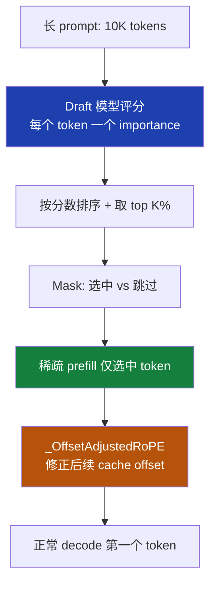
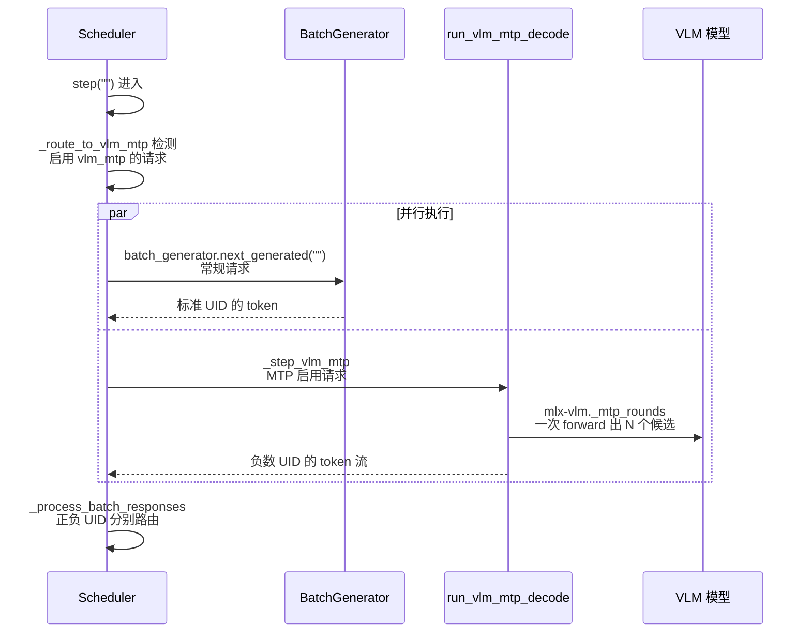
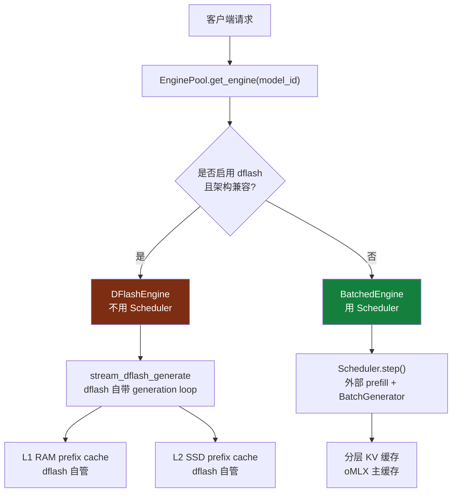

<details>
<summary>相关源文件</summary>

生成本页时使用的主要源文件：

- [omlx/scheduler.py](../../../project-repos/omlx/omlx/scheduler.py)
- [omlx/engine/dflash.py](../../../project-repos/omlx/omlx/engine/dflash.py)
- [omlx/speculative/vlm_mtp.py](../../../project-repos/omlx/omlx/speculative/vlm_mtp.py)
- [omlx/patches/specprefill.py](../../../project-repos/omlx/omlx/patches/specprefill.py)
- [omlx/patches/mlx_lm_mtp/__init__.py](../../../project-repos/omlx/omlx/patches/mlx_lm_mtp/__init__.py)
- [omlx/patches/mlx_vlm_mtp/__init__.py](../../../project-repos/omlx/omlx/patches/mlx_vlm_mtp/__init__.py)

</details>

# 推测解码三条路径

推测解码（speculative decoding）的核心思路是用便宜的方法生成多个候选 token，再用昂贵的模型一次性验证，从而把 N 次顺序 forward 摊薄成一次。这套思路在云端 GPU 上已经成熟，但在 Apple Silicon 上有三个独立的工程实现路径，每个解决的问题不同。

oMLX 同时支持这三条路径，并且**它们注入 Scheduler 的位置完全不一样**：

| 路径 | 集成层 | 加速对象 | 上游来源 |
|---|---|---|---|
| **SpecPrefill** | Scheduler 的 prefill 阶段 | 长 prompt 的 prefill | arXiv 2502.02789 + vllm-mlx PR #180 |
| **VLM-MTP** | Scheduler 的 step 阶段 | VLM 的 decode | mlx-vlm + omlx 桥接 |
| **DFlash** | 完全替换 Scheduler | LLM/VLM 的整段生成 | dflash-mlx |

这种"三条路径并存而非合一"的设计，本身就是工程现实——三种推测技术解决的是不同问题，强行套进一个统一接口反而会牺牲各自的优化空间。

## SpecPrefill：稀疏 prefill

长 prompt 的 prefill 是本地推理的最大痛点之一。10K tokens 的 prefill 在 M3 上可能要 20 秒——用户从按下回车到看到第一个 token，整个体验是断裂的。

SpecPrefill 的洞察：**不是所有 prompt token 都同等重要**。用一个小 draft 模型给每个 token 算"重要性分数"，target 模型只 prefill 评分最高的 top-K%——剩下的 token 的 cache 位置用 0 填，加上 RoPE 偏移修正后，target 模型在 decode 时仍然能产出正确的下一个 token。



**关键实现细节**（[scheduler.py:4469-4673](../../../project-repos/omlx/omlx/scheduler.py#L4469-L4673), [patches/specprefill.py](../../../project-repos/omlx/omlx/patches/specprefill.py)）：

- **`_OffsetAdjustedRoPE`**：在 attention 层 patch 上去的 RoPE 替代品。原始 RoPE 用每个 token 的位置编码，但稀疏 prefill 后位置不连续——`_OffsetAdjustedRoPE` 保留每个**保留 token 的原始位置**，跳过的位置以 0 填充。这样后续 decode 时位置编码仍然准确。
- **独占运行**：SpecPrefill 启用时整个 batch 只能有一个请求（`_specprefill_active_request_id` 锁），原因是 draft 模型本身占资源，无法跟其它请求共享 prefill 路径。
- **draft 模型加载**：SpecPrefill 启用需要在配置里指定 `specprefill_draft_model`——一个小型的 LLM，例如 Qwen3-0.6B 给 Qwen3-7B 当 draft。两者必须用相同 tokenizer。

收益场景：8K+ 的 prompt + 中等大小 target 模型。短 prompt 上反而会变慢，因为 draft 模型的评分开销 + RoPE 调整成本超过省下的 prefill 时间。

Sources: [omlx/scheduler.py:4469-4673](../../../project-repos/omlx/omlx/scheduler.py#L4469-L4673), [omlx/patches/specprefill.py](../../../project-repos/omlx/omlx/patches/specprefill.py)

<details class="source-snippets">
<summary>引用源码</summary>

<!-- source-snippets:start -->

#### `omlx/scheduler.py:4469-4673`

```python
            if request.specprefill_indices is not None:
                tracker = get_prefill_tracker()
                model_id = os.path.basename(self.config.model_name.rstrip("/"))
                total_pp = 0
                try:
                    from .patches.specprefill import (
                        _find_attention_layers,
                        _get_attn_module,
                        _OffsetAdjustedRoPE,
                        cleanup_rope,
                        sparse_prefill,
                    )

                    t0 = time.monotonic()

                    sp_cache = make_prompt_cache(self.model)
                    all_tokens = tokens_to_process
                    sys_count = getattr(request, "_specprefill_system_tokens", 0)

                    # Register tracker entry so the dashboard shows the PP
                    # indicator throughout sys + sparse prefill. Denominator
                    # mirrors the last-token removal applied below so the bar
                    # ends cleanly at 100%.
                    sel_list_pre = request.specprefill_indices.tolist()
                    m_pre = len(all_tokens) - sys_count
                    n_eff = len(sel_list_pre) - (
                        1 if (m_pre - 1) in sel_list_pre else 0
                    )
                    total_pp = sys_count + n_eff
                    tracker.update(request.request_id, 0, total_pp, model_id)

                    def _check_specprefill_abort(processed: int) -> None:
                        if request.request_id in self._pending_abort_ids:
                            logger.info(
                                f"SpecPrefill interrupted at {processed}/{total_pp} "
                                f"tokens: request aborted"
                            )
                            tracker.remove(request.request_id)
                            self.waiting.appendleft(request)
                            raise _PrefillAbortedError([], processed)

                    # Phase 1: system prompt full prefill (if not cached)
                    if sys_count > 0:
                        sys_arr = mx.array(all_tokens[:sys_count])
                        step = self.config.prefill_step_size
                        sys_processed = 0
                        spec_sparse_extra = {
                            "prompt_tokens": request.num_prompt_tokens,
                            "system_tokens": request.specprefill_system_end,
                            "conversation_tokens": request.num_prompt_tokens - request.specprefill_system_end,
                            "cached_tokens": request.cached_tokens,
                            "scored_tokens": m_pre,
                            "selected_tokens": n_eff,
                            "keep_percent": round(n_eff / m_pre * 100)
                            if m_pre > 0
                            else 0,
                        }
                        while sys_arr.size > step:
                            _check_specprefill_abort(sys_processed)
                            tracker.update(
                                request.request_id,
                                sys_processed,
                                total_pp,
                                model_id,
                                phase="specprefill_system",
                                detail="system prompt prefill",
                                extra=spec_sparse_extra,
                            )
                            self.model(sys_arr[:step][None], cache=sp_cache)
                            mx.eval([c.state for c in sp_cache])
                            sys_processed += step
                            _check_specprefill_abort(sys_processed)
                            tracker.update(
                                request.request_id,
                                min(sys_processed, total_pp - 1),
                                total_pp,
                                model_id,
                                phase="specprefill_system",
                                detail="system prompt prefill",
                                extra=spec_sparse_extra,
                            )
                            sys_arr = sys_arr[step:]
                            # Use _sync_and_clear_cache() instead of bare
                            # mx.clear_cache() to flush the generation_stream
                            # before releasing Metal buffers.  A bare call here
                            # can race with in-flight command buffers submitted
                            # by the preceding mx.eval(), triggering the same
                            # 'completeMemory() prepare count underflow' kernel
                            # panic that #435 fixed elsewhere (#557).
                            _sync_and_clear_cache()
                        if sys_arr.size > 0:
                            _check_specprefill_abort(sys_processed)
                            final_sys = int(sys_arr.size)
                            tracker.update(
                                request.request_id,
                                sys_processed,
                                total_pp,
                                model_id,
                                phase="specprefill_system",
                                detail="system prompt prefill",
                                extra=spec_sparse_extra,
                            )
                            self.model(sys_arr[None], cache=sp_cache)
                            mx.eval([c.state for c in sp_cache])
                            sys_processed += final_sys
                            _check_specprefill_abort(sys_processed)
                            tracker.update(
                                request.request_id,
                                min(sys_processed, total_pp - 1),
                                total_pp,
                                model_id,
                                phase="specprefill_system",
                                detail="system prompt prefill",
                                extra=spec_sparse_extra,
                            )
                        logger.info(
                            f"SpecPrefill: system prompt {sys_count} tokens full prefill"
                        )

                    # Phase 2: conversation sparse prefill
... snippet truncated ...
```

#### `omlx/patches/specprefill.py`

```python
# SPDX-License-Identifier: Apache-2.0
"""SpecPrefill: Attention-based sparse prefill for MLX.

Reduces TTFT on long prompts by using a small draft model to identify
important tokens, then prefilling only those tokens on the target model
while preserving original positional encoding via manual RoPE.

Based on arxiv.org/abs/2502.02789 and waybarrios/vllm-mlx PR #180.

Pipeline:
  1. score_tokens()  — draft model scores token importance via attention
  2. select_chunks() — chunk-based top-K% selection
  3. sparse_prefill() — target prefill with manual RoPE at original positions
  4. cleanup_rope()  — restore original RoPE after generation

Design notes:
  - RoPE is relative: Q_m @ K_p^T depends only on (m - p). Selected keys
    stored contiguously in cache with correct RoPE angles produce correct
    attention during decode.
  - After sparse prefill of N tokens from M total, cache.offset = N but
    decode needs position M. _OffsetAdjustedRoPE adds (M - N) to each offset.
"""

from __future__ import annotations

import inspect
import logging
import math
from typing import Any, Callable, Dict, List, Optional, Tuple

import mlx.core as mx

logger = logging.getLogger(__name__)


# ===========================================================================
# Token importance scoring (draft model)
# ===========================================================================


class _AttentionCapture:
    """Wraps attention to capture post-RoPE query vectors during lookahead.

    Delegates to the original attention module while recording queries
    for importance scoring.
    """

    def __init__(self, original, buf_idx, query_buffer, query_extractor):
        self._original = original
        self._buf_idx = buf_idx
        self._query_buffer = query_buffer
        self._query_extractor = query_extractor

    def __call__(self, x, mask=None, cache=None, **kwargs):
        if kwargs and _accepts_extractor_kwargs(self._query_extractor, kwargs):
            queries = self._query_extractor(self._original, x, cache, **kwargs)
        else:
            # Backward compatibility for custom extractors with the older
            # (attn, x, cache) signature.
            queries = self._query_extractor(self._original, x, cache)
        self._query_buffer[self._buf_idx].append(queries)
        return self._original(x, mask=mask, cache=cache, **kwargs)

    def __getattr__(self, name):
        return getattr(self._original, name)


# ---------------------------------------------------------------------------
# Query extractors (architecture-specific scoring only)
# ---------------------------------------------------------------------------


def _accepts_extractor_kwargs(extractor, kwargs) -> bool:
    """Whether a query extractor accepts the supplied keyword arguments."""
    try:
        params = inspect.signature(extractor).parameters.values()
    except (TypeError, ValueError):
        return True

    for param in params:
        if param.kind == inspect.Parameter.VAR_KEYWORD:
            return True

    accepted = {
        param.name
        for param in params
        if param.kind
        in (
            inspect.Parameter.POSITIONAL_OR_KEYWORD,
            inspect.Parameter.KEYWORD_ONLY,
        )
    }
    return set(kwargs).issubset(accepted)


def _qwen35_extract_queries(attn, x, cache=None, **kwargs):
    """Qwen3.5: gate split + q_norm + RoPE."""
    B, L, D = x.shape
    q_out = attn.q_proj(x)
    queries, _gate = mx.split(
        q_out.reshape(B, L, attn.num_attention_heads, -1), 2, axis=-1
    )
    queries = attn.q_norm(queries).transpose(0, 2, 1, 3)
    if cache is not None:
        queries = attn.rope(queries, offset=cache.offset)
    else:
        queries = attn.rope(queries)
    return queries


def _qwen36_extract_queries(attn, x, cache=None, **kwargs):
    """Qwen3.6 MoE / non-gated q_norm models: q_proj + q_norm + RoPE."""
    B, L, _ = x.shape
    n_heads = getattr(
        attn,
        "num_attention_heads",
        getattr(attn, "n_heads", getattr(attn, "num_heads", None)),
    )
    queries = attn.q_proj(x).reshape(B, L, n_heads, -1)
    queries = attn.q_norm(queries).transpose(0, 2, 1, 3)
```

<!-- source-snippets:end -->
</details>

## VLM-MTP：视觉模型的多 token 预测

Multi-Token Prediction（MTP）是另一种思路：让模型一次性预测**下面 N 个 token**，再用主模型的 K=1 forward 一次性验证。Qwen3.5+ 和 Gemma 4 系列的 VLM 都在头部嵌入了 MTP 头——`mtp_forward` 调用一次返回多个 token 的 logits。

oMLX 把这个能力封装在 `omlx/speculative/vlm_mtp.py` 的 `run_vlm_mtp_decode`，并通过 Scheduler 的 `_route_to_vlm_mtp` 接入（[scheduler.py:3465](../../../project-repos/omlx/omlx/scheduler.py#L3465)）。



设计上的微妙点：

- **负数 UID 隔离**：mlx-lm 的 BatchGenerator 用正整数 UID 管理活跃请求。MTP 路径要避免跟 BG 的 UID 冲突，所以 oMLX 给每个 MTP 请求合成一个**负数 UID**。这样在 `_process_batch_responses` 里通过符号就能 dispatch。
- **single-drafter 互斥**：同一时间只允许一个 MTP drafter 运行（虽然支持多请求多 drafter 在理论上行，工程上单 drafter 简单且性能足够）。这是 `_step_vlm_mtp` 内部的串行化。
- **跟常规请求共存**：MTP 请求和非 MTP 请求可以**同一个 step 内**并行处理——只是它们走不同路径。这避免了 SpecPrefill 那种"独占" 的限制。

收益场景：VLM 的 decode 阶段。对 VLM 来说，每个 token forward 都要带视觉特征通过 backbone，开销大；MTP 一次 forward 出 4-8 个候选，加速比 1.5-3 倍很常见。

Sources: [omlx/speculative/vlm_mtp.py](../../../project-repos/omlx/omlx/speculative/vlm_mtp.py), [omlx/scheduler.py:3465-3650](../../../project-repos/omlx/omlx/scheduler.py#L3465-L3650), [omlx/scheduler.py:5503](../../../project-repos/omlx/omlx/scheduler.py:5503)

<details class="source-snippets">
<summary>引用源码</summary>

<!-- source-snippets:start -->

#### `omlx/speculative/vlm_mtp.py`

```python
# SPDX-License-Identifier: Apache-2.0
"""Wrapper that delegates Gemma4-style VLM MTP decode to mlx-vlm helpers.

Background
==========

mlx-vlm 191d7c8 added a Multi-Token Prediction (MTP) speculative decoding
path for Gemma 4 with an external assistant drafter (model_type
``gemma4_assistant``). f96138e (PR #1169) then moved the core round loop
out of ``mlx_vlm.generate`` and into ``mlx_vlm.speculative.utils``, where
``_mtp_rounds`` / ``_mtp_rounds_batch`` now live. The functions still
operate on plain ``mx.array`` state plus an ``mlx_lm`` ``KVCache`` list,
so omlx can reuse them without porting the algorithm.

This module hides the mlx-vlm internal symbols behind a small, typed
interface. Anything that needs to change when mlx-vlm rev's its MTP API
should be contained here.

What this wrapper assumes about callers
=======================================

The caller has already run prefill on the target VLM (with
``return_hidden=True`` and ``return_shared_kv=True``) and holds:

- ``prompt_cache``: list of mlx-lm cache objects post-prefill.
- ``hidden``: last layer hidden state at the final prompt token
  ``[B, 1, H]``.
- ``shared_kv_states``: dict of ``layer_type -> (K, V)`` snapshots.
- ``first_bonus``: token sampled from the post-prefill logits.

The wrapper itself does not touch omlx scheduler state — it only yields
generated tokens.
"""

from __future__ import annotations

import logging
from typing import Any, Callable, Generator, List, Optional, Set, Union

import mlx.core as mx
import mlx.nn as nn

from mlx_vlm.speculative import load_drafter as _vlm_load_drafter

# PR #1169 (f96138e) moved the MTP round loop helpers from ``mlx_vlm.generate``
# into ``mlx_vlm.speculative.utils``. Import directly from the new location —
# the symbols are still ``_``-prefixed but this is now their canonical home.
from mlx_vlm.speculative.utils import _mtp_rounds, _mtp_rounds_batch  # noqa: SLF001

logger = logging.getLogger(__name__)


# What model_type strings count as a gemma4 assistant drafter. Kept as a
# tuple so we can extend if upstream adds related drafter kinds later.
GEMMA4_ASSISTANT_MODEL_TYPES: tuple[str, ...] = ("gemma4_assistant",)


class VLMMTPDrafter:
    """Holds a loaded drafter together with the metadata omlx needs.

    ``model.reset(target)`` is intentionally NOT called here: mlx-vlm's
    ``_mtp_rounds`` / ``_mtp_rounds_batch`` call it themselves at the
    start of every round-loop entry, so adding an extra reset would just
    duplicate the bind step (and could mask a target-model swap).
    """

    def __init__(self, model: nn.Module, draft_kind: str, source_path: str) -> None:
        self.model = model
        self.draft_kind = draft_kind
        self.source_path = source_path


def load_vlm_mtp_drafter(path: str) -> Optional[VLMMTPDrafter]:
    """Load a Gemma4 assistant drafter; return None and log if the artifact
    is the wrong kind. Soft-fails so a misconfigured toggle does not crash
    model loading."""
    try:
        drafter_model, resolved_kind = _vlm_load_drafter(path, kind=None)
    except Exception as e:
        logger.warning(
            "VLM MTP drafter load failed for %r: %s — toggle will be ignored",
            path,
            e,
        )
        return None

    if resolved_kind != "mtp":
        logger.warning(
            "VLM MTP drafter %r resolved to kind=%r (expected 'mtp') — "
            "toggle will be ignored. Only gemma4_assistant drafters are "
            "supported at this time.",
            path,
            resolved_kind,
        )
        return None

    model_type = _read_model_type(drafter_model)
    if model_type not in GEMMA4_ASSISTANT_MODEL_TYPES:
        logger.warning(
            "VLM MTP drafter %r has model_type=%r (expected one of %s) — "
            "toggle will be ignored.",
            path,
            model_type,
            GEMMA4_ASSISTANT_MODEL_TYPES,
        )
        return None

    logger.info(
        "VLM MTP drafter loaded: path=%s kind=%s model_type=%s",
        path,
        resolved_kind,
        model_type,
    )
    return VLMMTPDrafter(drafter_model, resolved_kind, path)


def _read_model_type(drafter: nn.Module) -> Optional[str]:
    """Best-effort lookup of the drafter's HF model_type."""
    config = getattr(drafter, "config", None)
    if config is None:
```

#### `omlx/scheduler.py:3465-3650`

```python
    def _route_to_vlm_mtp(
        self,
        request: Request,
        prefilled_cache: list[Any],
        last_tokens: list[int],
        sampler: Callable[[Any], Any],
        state_machine: Any,
    ) -> int | None:
        """Bypass BatchGenerator and stand up a vlm_mtp generator instead.

        Runs the final forward on ``last_tokens`` with ``return_hidden=True``
        and ``return_shared_kv=True`` so the drafter has the targets it
        needs, samples the first bonus token from the resulting logits, and
        returns a synthesized uid that ``step()`` will drive.

        Returns ``None`` if the eligibility check fails at the last second
        (drafter missing, language model lacks rollback hook, etc.) so the
        caller can fall back to the normal BatchGenerator path.
        """
        drafter = self._vlm_mtp_drafter
        if drafter is None:
            return None

        # Gemma4AssistantDraftModel keeps ``_shared_kv`` / ``_input_embed`` on
        # the module instance, so multiple in-flight ``_mtp_rounds`` generators
        # share one drafter and effectively serialize on it: each round has
        # to ``set_shared_kv`` for its own request before ``draft_block`` runs.
        # Output stays correct because target-side verify is the source of
        # truth in speculative decoding (a stale-drafter round just rejects
        # everything and falls back to a target-only step), but the
        # per-request tok/s is roughly halved under concurrency. Empirically
        # at 4 concurrent, vlm_mtp gives ~14 tok/s each vs BatchGenerator's
        # ~27 tok/s each — BG's batched matmul beats serialized speculative
        # rounds. So we route only the first eligible request through
        # vlm_mtp and let subsequent concurrent requests fall back. A future
        # commit can swap this gate for true batched MTP via
        # ``_mtp_rounds_batch`` if and when omlx prefill exposes batched
        # hidden/shared_kv outputs.
        if self._vlm_mtp_active:
            logger.info(
                "vlm_mtp routing skipped for %s: drafter is busy with %d "
                "request(s); falling back to BatchGenerator",
                request.request_id,
                len(self._vlm_mtp_active),
            )
            return None

        lm = getattr(self.model, "_language_model", None)
        if lm is None or not hasattr(lm, "rollback_speculative_cache"):
            logger.warning(
                "vlm_mtp toggle on but model lacks _language_model with "
                "rollback_speculative_cache (model=%s); falling back to "
                "standard decode for request %s",
                type(self.model).__name__,
                request.request_id,
            )
            return None

        if not last_tokens:
            logger.warning(
                "vlm_mtp routing skipped: last_tokens empty for request %s",
                request.request_id,
            )
            return None

        last_arr = mx.array(last_tokens)[None]  # (1, len_last)
        try:
            with mx.stream(generation_stream):
                out = lm(
                    last_arr,
                    cache=prefilled_cache,
                    return_hidden=True,
                    return_shared_kv=True,
                )
                mx.eval([c.state for c in prefilled_cache])
        except Exception as e:
            logger.warning(
                "vlm_mtp final-prefill forward failed (%s); falling back "
                "to standard decode for request %s",
                e,
                request.request_id,
            )
            return None

        logits = out.logits[:, -1, :]
        first_bonus_arr = sampler(logits)  # mx.array shape [1]
        mx.eval(first_bonus_arr)

        hidden_states = out.hidden_states
        if isinstance(hidden_states, list):
            hidden = hidden_states[-1]
        else:
            hidden = hidden_states
        # Slice to last position so the drafter sees a [B, 1, H] tensor
        # regardless of how many tokens this forward processed.
        if hidden.shape[1] > 1:
            hidden = hidden[:, -1:, :]

        # Combine base stop tokens (EOS, Harmony, generation_config) with
        # request-specific stop_token_ids — same shape as _build_state_machine.
        eos_ids: set[int] = self._get_stop_tokens()
        if request.sampling_params.stop_token_ids:
            eos_ids.update(request.sampling_params.stop_token_ids)

        try:
            generator = run_vlm_mtp_decode(
                target_language_model=lm,
                drafter=drafter,
                prompt_cache=prefilled_cache,
                hidden=hidden,
                shared_kv_states=out.shared_kv_states,
                first_bonus=int(first_bonus_arr.item()),
                max_tokens=request.sampling_params.max_tokens,
                sampler=sampler,
                draft_block_size=self._vlm_mtp_draft_block_size,
                token_dtype=mx.int32,
                eos_token_ids=eos_ids or None,
            )
        except Exception as e:
            logger.warning(
... snippet truncated ...
```

#### `omlx/scheduler.py:5503`

> 未找到引用文件：`omlx/scheduler.py:5503`

<!-- source-snippets:end -->
</details>

## mlx-lm MTP：纯文本 LLM 的版本

mlx-lm 的 MTP 头（PR #990，已被 oMLX 通过 `omlx/patches/mlx_lm_mtp/` patch 拉进）跟 VLM-MTP 思路相同，但实现在 mlx-lm 侧——Scheduler 不需要专门路由，而是通过 patch 让 mlx-lm 的 `GenerationBatch.next()` 内部就完成 draft + verify。

`omlx/patches/mlx_lm_mtp/__init__.py` 注入：

- **`mtp_forward` 方法**：给 Qwen3.5 / DeepSeek-V4-Flash 等支持 MTP 的模型类添加，返回多个候选的 logits
- **enhance `__call__`**：让标准 forward 同时返回 hidden states + logits，避免 MTP draft 之后还要再跑一次 forward 拿 hidden state
- **嵌入 BatchGenerator.next()**：在 mlx-lm 的连续批处理内部完成 draft → verify → 接受/拒绝循环

跟 VLM-MTP 的差异：

| 维度 | mlx-lm MTP | VLM-MTP |
|---|---|---|
| 集成位置 | mlx-lm 内部（透明） | omlx scheduler（显式） |
| 并发支持 | 仅当 batch 中只有一个请求时启用 | 多个 VLM 请求各自跑 MTP |
| 路由 | 不需要 | 负数 UID 隔离 |
| 实现仓库 | mlx-lm 上游 PR #990 + omlx patch | omlx 自己 |

为什么 mlx-lm MTP 只在"单请求"时启用？因为 mlx-lm BatchGenerator 的批量内 KV cache 没有针对 MTP 的并发优化——多请求 + MTP 会导致 KV cache 错位。oMLX 不是不想加速并发场景，而是 mlx-lm 上游目前还没解决这个问题，所以 patch 保持保守。

Sources: [omlx/patches/mlx_lm_mtp/__init__.py](../../../project-repos/omlx/omlx/patches/mlx_lm_mtp/__init__.py)

<details class="source-snippets">
<summary>引用源码</summary>

<!-- source-snippets:start -->

#### `omlx/patches/mlx_lm_mtp/__init__.py`

```python
# SPDX-License-Identifier: Apache-2.0
"""Native MTP (Multi-Token Prediction) monkey-patches for mlx-lm.

This package adapts two upstream PRs into runtime monkey-patches:

- ml-explore/mlx-lm#990 — Qwen3.5 / Qwen3.6 native MTP heads (dense + MoE)
- Blaizzy/mlx-lm#15    — DeepSeek-V4-Flash native MTP heads

Both PRs follow the same shape: a model gains an extra ``mtp`` module + a
``mtp_forward`` method and an enhanced ``__call__`` that returns hidden
states alongside logits. A separate ``mtp_generate_step`` generator drives
the draft/verify loop using those hooks.

This package implements the model-side hooks as in-place monkey-patches and
folds the draft/verify loop into mlx-lm's ``GenerationBatch.next()`` so the
existing oMLX paged + prefix + SSD cache stack keeps working unchanged.

Activation gate: caller (utils/model_loading.py) checks
``model_settings.mtp_enabled`` and the model's ``config.json`` for MTP
heads + a supported ``model_type`` before invoking ``apply_mlx_lm_mtp_patch``.
The patches are idempotent.

Concurrency model: the BatchGenerator patch only takes the MTP path when
exactly one sequence is active in the generation batch. Concurrent requests
fall through to the standard continuous-batching path.
"""

from __future__ import annotations

import logging

logger = logging.getLogger(__name__)

_PATCHED = False

# Process-wide flag read by the patched ``Model.__init__`` (Qwen3.5/3.6 +
# DeepSeek-V4) to decide whether to attach the MTP head module. Caller
# (``utils/model_loading.py::maybe_apply_pre_load_patches``) sets this
# right before ``mlx_lm.load()`` runs based on ``model_settings.mtp_enabled``.
# Default False keeps newly-loaded models MTP-free unless explicitly opted in.
_MTP_ACTIVE = False


def set_mtp_active(active: bool) -> None:
    """Toggle whether subsequent ``mlx_lm.load()`` calls attach the MTP head.

    Affects ``self.mtp`` attachment in patched ``Model.__init__`` (and
    DeepSeek-V4 equivalent) and is checked by BatchGenerator's
    ``_is_mtp_eligible`` (via the presence of the ``mtp`` attribute).
    Single-thread MLX executor serializes loads, so this is race-free.
    """
    global _MTP_ACTIVE
    _MTP_ACTIVE = bool(active)


def is_mtp_active() -> bool:
    return _MTP_ACTIVE


def apply_mlx_lm_mtp_patch() -> bool:
    """Apply the model-side and BatchGenerator monkey-patches.

    Idempotent. Must be invoked before ``mlx_lm.load()`` so the patched
    ``__init__`` / ``sanitize`` / ``from_dict`` paths see MTP weights.

    Returns:
        True if the patch is now active (newly applied or already applied
        on a previous call). False if a sub-step refused to apply (mlx-lm
        not importable, missing prerequisite patch, etc.).
    """
    global _PATCHED
    if _PATCHED:
        return True

    from . import batch_generator, cache_rollback, deepseek_v4_model, qwen35_model

    if not cache_rollback.apply():
        return False
    if not qwen35_model.apply():
        # Qwen models are the main target; if the qwen patch refuses we
        # still continue so DeepSeek-V4 users aren't blocked.
        logger.debug("Qwen3.5/3.6 MTP patch did not apply (likely import error)")
    if not deepseek_v4_model.apply():
        logger.debug("DeepSeek-V4 MTP patch did not apply (likely missing base patch)")
    if not batch_generator.apply():
        logger.warning(
            "BatchGenerator MTP dispatch patch failed; MTP path will be inactive"
        )
        return False

    _PATCHED = True
    logger.info("mlx-lm MTP patch applied (PR 990 + PR 15)")
    return True
```

<!-- source-snippets:end -->
</details>

## DFlash：块扩散推测

DFlash（[dflash-mlx](https://github.com/bstnxbt/dflash-mlx)）走完全不同的技术路线：**块扩散推测**。基本思路：

1. Draft 模型一次性生成 N 个 token 序列（一个"块"）
2. Target 模型用一次 forward verify 整个块
3. 比较 logits，找出第一个分歧的位置 K
4. 接受 [0, K) 这 K 个 token，从 K+1 重新开始

跟 token-by-token 的推测解码不同，块扩散更适合**长生成、模式化输出**（如代码生成）的场景。draft 错的 token 越靠后，平均加速比越高。

oMLX 对 dflash 的集成是**替换式**而非嵌入式（详见 [引擎系统与多模型](engine-system.md)）：



**集成代价**：DFlash 跟 oMLX 主 cache 系统完全独立，所以同一个模型用 dflash 跑产生的 KV 不能给 BatchedEngine 用——切换执行器时缓存要重建。这是为什么 `_evict_dflash_and_start_fallback` 在切换时要清空 dflash 自己的 cache。

**单 in-flight 限制**：dflash 不支持连续批处理，所以 DFlashEngine 每次只跑一个请求，多请求排队。

**上下文阈值**：每个模型有个 `dflash_max_ctx`，超过这个上下文长度时 dflash 的加速反而劣于标准批处理，所以 omlx 在原地切换到 BatchedEngine（[engine/dflash.py:329](../../../project-repos/omlx/omlx/engine/dflash.py#L329)）。

Sources: [omlx/engine/dflash.py:68-565](../../../project-repos/omlx/omlx/engine/dflash.py#L68-L565)

<details class="source-snippets">
<summary>引用源码</summary>

<!-- source-snippets:start -->

#### `omlx/engine/dflash.py:68-565`

```python
class DFlashEngine(BaseEngine):
    """
    DFlash speculative decoding engine with optional batched fallback.

    For prompts within ``model_settings.dflash_max_ctx`` (or always, when the
    threshold is None), uses block diffusion speculative decoding for 3-4x
    faster generation. When the threshold is exceeded, evicts dflash models
    from memory and delegates to a fallback engine (BatchedEngine or
    VLMBatchedEngine) that provides paged cache, SSD cache, and continuous
    batching.
    """

    def __init__(
        self,
        model_name: str,
        draft_model_path: str,
        draft_quant_enabled: bool | None = None,
        draft_quant_weight_bits: int | None = None,
        draft_quant_activation_bits: int | None = None,
        draft_quant_group_size: int | None = None,
        model_settings: Any | None = None,
        fallback_engine_type: str = "batched",
        scheduler_config: Any | None = None,
        omlx_ssd_cache_dir: str | Path | None = None,
    ):
        self._model_name = model_name
        self._draft_model_path = draft_model_path
        self._draft_quant_enabled = draft_quant_enabled
        self._draft_quant_weight_bits = draft_quant_weight_bits
        self._draft_quant_activation_bits = draft_quant_activation_bits
        self._draft_quant_group_size = draft_quant_group_size
        self._model_settings = model_settings
        self._fallback_engine_type = fallback_engine_type
        self._scheduler_config = scheduler_config
        self._omlx_ssd_cache_dir = (
            Path(omlx_ssd_cache_dir) if omlx_ssd_cache_dir else None
        )

        self._target_model = None
        self._target_ops = None
        self._draft_model = None
        self._draft_backend = None
        self._tokenizer_obj = None
        self._executor_tokenizer = None
        self._loaded = False
        self._active_request = False
        self._model_type_str = None
        self._fallback_engine: BaseEngine | None = None
        self._in_fallback_mode = False
        self._runtime_context: Any | None = None
        self._dflash_prefix_cache: Any | None = None
        # Protocol-specific output parser factory (gemma4 / harmony).
        # Detected once in start() after the target model is loaded; None means
        # the streaming detokenizer is used as-is (qwen, llama, etc.).
        self._output_parser_factory: Any | None = None

        self._max_dflash_ctx = (
            getattr(model_settings, "dflash_max_ctx", None) if model_settings else None
        )
        self._in_memory_cache_enabled = (
            bool(getattr(model_settings, "dflash_in_memory_cache", True))
            if model_settings
            else True
        )
        self._in_memory_cache_max_entries = int(
            getattr(model_settings, "dflash_in_memory_cache_max_entries", 4)
            if model_settings
            else 4
        )
        self._in_memory_cache_max_bytes = int(
            getattr(model_settings, "dflash_in_memory_cache_max_bytes", 8 * 1024**3)
            if model_settings
            else 8 * 1024**3
        )
        self._ssd_cache_requested = (
            bool(getattr(model_settings, "dflash_ssd_cache", False))
            if model_settings
            else False
        )
        self._ssd_cache_max_bytes = int(
            getattr(model_settings, "dflash_ssd_cache_max_bytes", 20 * 1024**3)
            if model_settings
            else 20 * 1024**3
        )
        # None → let dflash-mlx pick its own default (window=1024, sink=64, verify="adaptive").
        # `getattr` returns None for missing attrs so older settings files keep working.
        self._draft_window_size = (
            getattr(model_settings, "dflash_draft_window_size", None)
            if model_settings
            else None
        )
        self._draft_sink_size = (
            getattr(model_settings, "dflash_draft_sink_size", None)
            if model_settings
            else None
        )
        self._verify_mode = (
            getattr(model_settings, "dflash_verify_mode", None)
            if model_settings
            else None
        )

    @property
    def model_name(self) -> str:
        return self._model_name

    @property
    def tokenizer(self) -> Any:
        return self._tokenizer_obj

    @property
    def model_type(self) -> str | None:
        return self._model_type_str

    @staticmethod
    def _build_quant_spec(
        weight_bits: int | None,
        activation_bits: int | None,
        group_size: int | None,
    ) -> str:
... snippet truncated ...
```

<!-- source-snippets:end -->
</details>

## 三条路径的对照表

| 维度 | SpecPrefill | mlx-lm MTP | VLM-MTP | DFlash |
|---|---|---|---|---|
| 加速哪个阶段 | Prefill | Decode | Decode | Prefill + Decode |
| 是否支持并发 | 否 | 单请求 | 多请求 | 否 |
| 是否用 Scheduler | 是（嵌入） | 是（patch） | 是（嵌入） | 否（替换） |
| 是否兼容 paged KV cache | 是 | 是 | 是 | 否（自带 cache） |
| Draft 模型来源 | 用户配置 | 模型内置头 | 模型内置头 | 用户配置 |
| 多模态支持 | 否 | 否 | 是 | 是 |
| 最佳负载 | 长 prompt + 短输出 | 文本对话 | VLM 对话 | 代码生成长输出 |
| 启用方式 | per-engine 配置 | model_settings | model_settings | model_settings |

最关键的事实：**这四种推测互斥**。`ModelSettings.__post_init__`（[model_settings.py:182-200](../../../project-repos/omlx/omlx/model_settings.py#L182-L200)）显式校验 `mtp_enabled ⊕ dflash_enabled ⊕ vlm_mtp_enabled ⊕ turboquant_kv_enabled` 至多一个为 True。用户在 admin UI 切换某个推测路径时会自动清除其它路径。

Sources: [omlx/model_settings.py:182-200](../../../project-repos/omlx/omlx/model_settings.py#L182-L200)

<details class="source-snippets">
<summary>引用源码</summary>

<!-- source-snippets:start -->

#### `omlx/model_settings.py:182-200`

```python
    def __post_init__(self) -> None:
        # Native MTP is mutually exclusive with DFlash (also speculative) and
        # TurboQuant KV (patches the same attention path). Reject combos at
        # construction time so the conflict surfaces in the admin UI / API
        # rather than at model load.
        if self.mtp_enabled and self.dflash_enabled:
            raise ValueError(
                "mtp_enabled and dflash_enabled cannot both be True; choose one "
                "speculative-decoding path per model"
            )
        if self.mtp_enabled and self.turboquant_kv_enabled:
            raise ValueError(
                "mtp_enabled and turboquant_kv_enabled cannot both be True; "
                "TurboQuant patches the attention path that MTP relies on"
            )
        # vlm_mtp wraps mlx-vlm's MTP loop and bypasses mlx-lm BatchGenerator
        # at decode time, so it cannot coexist with any other speculative path
        # or with TurboQuant (which mutates the same cache objects).
        if self.vlm_mtp_enabled:
```

<!-- source-snippets:end -->
</details>

## TurboQuant KV：可叠加的"半推测"

`turboquant_kv_enabled` 出现在上面互斥表里，但它其实不是推测解码——它是 KV cache 的低位量化。叠在 turboquant_kv 上是为了让 attention 直接从量化 KV 上算，省掉 dequant。

`omlx/patches/turboquant_attention.py` 把 mlx-lm 的 `scaled_dot_product_attention` 替换为一个能识别 `TurboQuantKVCache` 的版本，直接调 turboquant 的 `cache.decode_attention()` Metal kernel。这跟推测解码无关，但占用同一个互斥位是因为它跟 MTP/DFlash 共用 attention 路径——不能同时开启。

`omlx/turboquant_kv.py` 实现 `TurboQuantKVCache` 类，每个 KV value 量化到 4 bit（或更少），节省 KV 内存 4-8 倍。代价是计算精度略有损失，长上下文上可能出现退化。

Sources: [omlx/turboquant_kv.py](../../../project-repos/omlx/omlx/turboquant_kv.py), [omlx/patches/turboquant_attention.py](../../../project-repos/omlx/omlx/patches/turboquant_attention.py)

<details class="source-snippets">
<summary>引用源码</summary>

<!-- source-snippets:start -->

#### `omlx/turboquant_kv.py`

```python
# SPDX-License-Identifier: Apache-2.0
"""TurboQuant KV cache — thin wrapper around mlx_vlm.turboquant.

Core implementation (codecs, Metal kernels, TurboQuantKVCache) lives in
mlx-vlm.  This module re-exports the public API and adds
BatchTurboQuantKVCache (inherits TurboQuantKVCache) for omlx's
continuous-batching scheduler.
"""

from __future__ import annotations

import logging
import math
from typing import List, Optional

import mlx.core as mx
from mlx_lm.models.cache import (
    KVCache,
    _BaseCache,
    create_attention_mask,
    create_causal_mask,
    dynamic_roll,
)
from mlx_vlm.turboquant import (
    TurboQuantKVCache,
    TurboQuantMSEState,
    TurboQuantProdState,
    TurboQuantPolarState,
    TurboQuantPolarProdState,
    TurboQuantSplitState,
    _build_codec,
    _concat_state,
    _slice_state,
    _slice_state_range,
    _state_length,
    _state_nbytes,
    _allocate_state_like,
    _write_state,
    _reserve_state_capacity,
    _QuantizedStateProxy,
    _validate_bits,
    turboquant_enabled,
)

logger = logging.getLogger(__name__)

__all__ = [
    "TurboQuantKVCache",
    "BatchTurboQuantKVCache",
    "turboquant_enabled",
]


# ---------------------------------------------------------------------------
# Codec rebuild for SSD cache reconstruction
# ---------------------------------------------------------------------------


def _infer_head_dim(state, bits: int) -> int:
    """Infer head_dim from a TQ quantized state's packed tensor width.

    MSEState.indices has shape (..., packed_width) where
    packed_width = ceil(head_dim * bits / 32).
    """
    if isinstance(state, TurboQuantMSEState):
        packed_width = state.indices.shape[-1]
    elif isinstance(state, TurboQuantProdState):
        packed_width = state.mse_indices.shape[-1]
        bits = max(bits - 1, 1)
    else:
        raise TypeError(f"Cannot infer head_dim from state type: {type(state).__name__}")
    return packed_width * 32 // bits


def _rebuild_codecs(tq_cache: TurboQuantKVCache, key_state, value_state) -> None:
    """Rebuild TQ codecs deterministically from (head_dim, bits, seed).

    TQ codecs (rotation matrices, codebooks) are fully determined by
    (head_dim, bits, seed) for integer bit-widths — no data dependency.
    This allows rebuilding codecs without the original fp16 tensors,
    which is needed when reconstructing from SSD cache.
    """
    bits = tq_cache.bits
    seed = tq_cache.seed
    fractional = not math.isclose(bits, round(bits), abs_tol=1e-6)
    key_bits = int(math.floor(bits) if fractional else bits)
    val_bits = int(math.ceil(bits) if fractional else bits)

    head_dim = _infer_head_dim(key_state, key_bits)

    dummy = mx.zeros((1, 1, 1, head_dim))
    tq_cache.key_codec = _build_codec(dummy, key_bits, mode="mse", seed=seed)
    tq_cache.value_codec = _build_codec(dummy, val_bits, mode="mse", seed=seed + 1)


# ---------------------------------------------------------------------------
# Batch-level state helpers (axis-0 operations)
# ---------------------------------------------------------------------------

def _filter_state(state, indices):
    """Index-select along batch dimension (axis 0)."""
    if state is None:
        return None
    if isinstance(state, TurboQuantMSEState):
        return TurboQuantMSEState(state.norms[indices], state.indices[indices])
    if isinstance(state, TurboQuantProdState):
        return TurboQuantProdState(
            state.norms[indices], state.mse_indices[indices],
            state.residual_norms[indices], state.qjl_signs[indices],
        )
    if isinstance(state, TurboQuantPolarState):
        return TurboQuantPolarState(
            state.radii[indices],
            tuple(level[indices] for level in state.level_indices),
        )
    if isinstance(state, TurboQuantPolarProdState):
        return TurboQuantPolarProdState(
            state.norms[indices], _filter_state(state.polar_state, indices),
            state.residual_norms[indices], state.qjl_signs[indices],
        )
```

#### `omlx/patches/turboquant_attention.py`

```python
# SPDX-License-Identifier: Apache-2.0
"""Patch scaled_dot_product_attention to support TurboQuantKVCache.

When TurboQuantKVCache is detected, routes attention to:
  - Decode (L=1): cache.decode_attention() — Metal kernel, no dequant
  - Prefill (L>1): cache.prefill_attention() fast path, fallback to
    dequantize + mx.fast.scaled_dot_product_attention
"""

import logging
from typing import Optional

import mlx.core as mx

logger = logging.getLogger(__name__)

_PATCHED = False


def apply_turboquant_attention_patch() -> bool:
    """Monkey-patch mlx-lm's scaled_dot_product_attention for TurboQuant."""
    global _PATCHED
    if _PATCHED:
        return False

    try:
        from mlx_lm.models import base as mlx_base
    except ImportError:
        return False

    original_sdpa = mlx_base.scaled_dot_product_attention

    def patched_sdpa(
        queries,
        keys,
        values,
        cache,
        scale: float,
        mask: Optional[mx.array],
        sinks: Optional[mx.array] = None,
    ) -> mx.array:
        from mlx_vlm.turboquant import TurboQuantKVCache as _TQCache
        from ..turboquant_kv import BatchTurboQuantKVCache

        # Detect underlying TQ cache (may be wrapped by proxy objects)
        real_cache = cache
        if hasattr(cache, "_cache") and not isinstance(
            cache, (_TQCache, BatchTurboQuantKVCache)
        ):
            real_cache = cache._cache

        if isinstance(real_cache, (_TQCache, BatchTurboQuantKVCache)):
            if queries.shape[-2] == 1:
                return real_cache.decode_attention(
                    queries,
                    keys_state=keys,
                    values_state=values,
                    scale=scale,
                    mask=mask,
                )
            # Prefill: try quantized fast path, fallback to dequantize+SDPA
            result = real_cache.prefill_attention(
                queries, scale=scale, mask=mask,
            )
            if result is not None:
                return result
            dequantized_keys, dequantized_values = real_cache.dequantize()
            return mx.fast.scaled_dot_product_attention(
                queries,
                dequantized_keys.astype(queries.dtype),
                dequantized_values.astype(queries.dtype),
                scale=scale,
                mask=mask,
            )

        return original_sdpa(queries, keys, values, cache, scale, mask, sinks)

    # Patch the module attribute
    mlx_base.scaled_dot_product_attention = patched_sdpa

    # Also patch any model modules that already imported it locally
    # Covers both mlx_lm (LLM) and mlx_vlm (VLM) model modules
    import sys
    for mod_name, mod in list(sys.modules.items()):
        if mod is None:
            continue
        if not (mod_name.startswith("mlx_lm.models.") or mod_name.startswith("mlx_vlm.models.")):
            continue
        if hasattr(mod, "scaled_dot_product_attention"):
            func = getattr(mod, "scaled_dot_product_attention")
            if func is original_sdpa or func is not patched_sdpa:
                setattr(mod, "scaled_dot_product_attention", patched_sdpa)

    # Also patch mlx_vlm.models.base if loaded
    try:
        from mlx_vlm.models import base as vlm_base
        if hasattr(vlm_base, "scaled_dot_product_attention"):
            vlm_base.scaled_dot_product_attention = patched_sdpa
    except ImportError:
        pass

    _PATCHED = True
    logger.info("TurboQuant attention patch applied")
    return True
```

<!-- source-snippets:end -->
</details>

## 工程视角的取舍

为什么 oMLX 没有把这四条推测路径合并成统一抽象？

**短答案**：它们的状态空间互不相同。

- SpecPrefill 修改 attention 的 RoPE，要求 patch model module
- MTP 修改 model forward 接口，要求模型类支持 mtp_forward
- DFlash 完全替换生成 loop，要求 engine 替换
- TurboQuant 修改 cache type，要求 attention 适配

如果硬要写一个 `SpeculativeStrategy` 抽象基类，它的接口要囊括"模型修改/cache 类型/调度路径"三个维度的所有组合，最终变成一个万能但极其复杂的类。当前的"分散实现 + 互斥校验"反而更清晰——每条路径独立演进，新加一种推测时只需要在 `ModelSettings` 加一个 bool 字段和 `__post_init__` 的互斥检查。

这是 oMLX 在多个子系统都采用的工程哲学：**强类型化的边界 + 简单的互斥规则 > 过度抽象的统一接口**。

## 相关页面

- [调度器与连续批处理](scheduler-and-batching.md) — SpecPrefill / VLM-MTP 在 Scheduler 中的注入点
- [引擎系统与多模型](engine-system.md) — DFlashEngine 为何独立、替换式集成
- [评估、上游 Patch 与质量保障](testing-and-patches.md) — `omlx/patches/specprefill.py` 等的来源与维护方式
- [模型管理与 Admin Dashboard](model-management.md) — `ModelSettings` 的推测互斥校验
