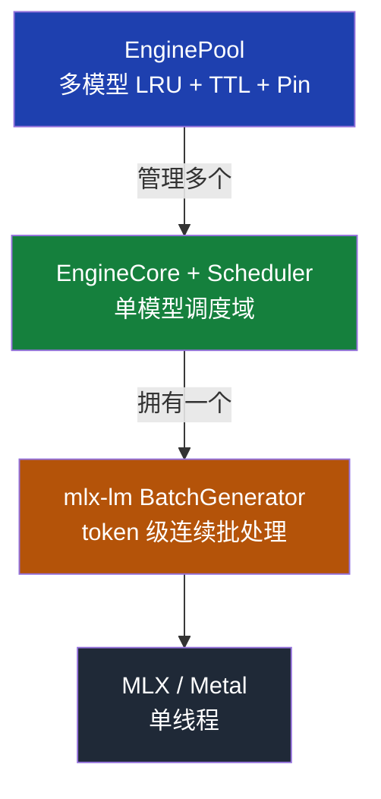
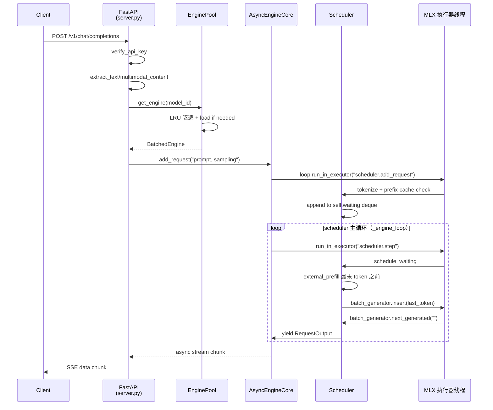
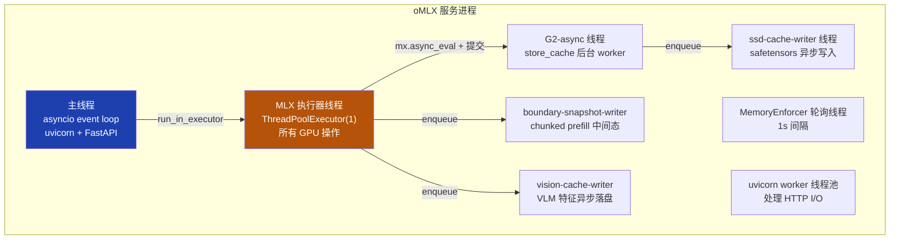
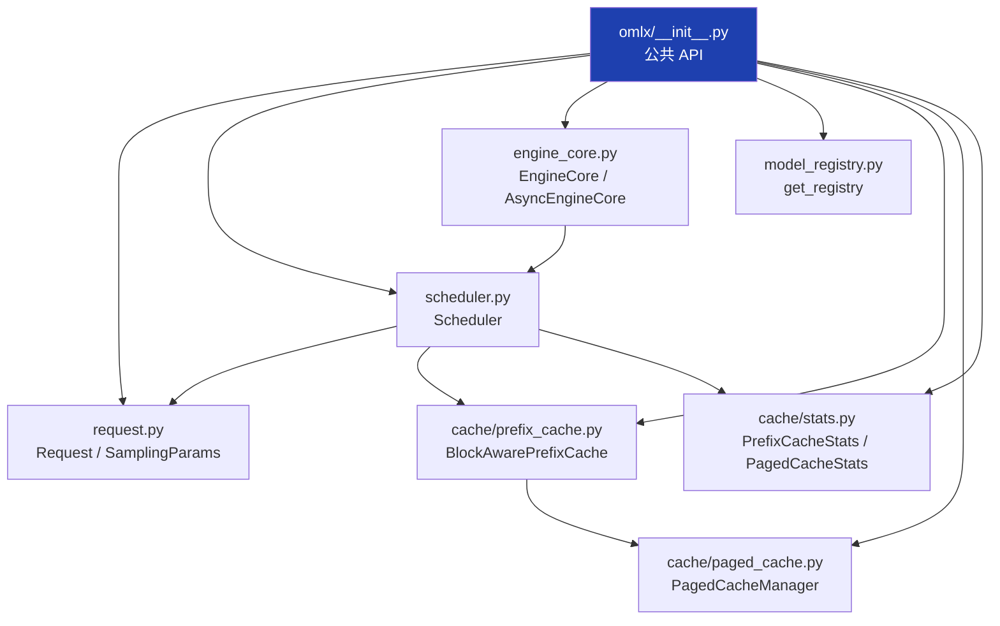
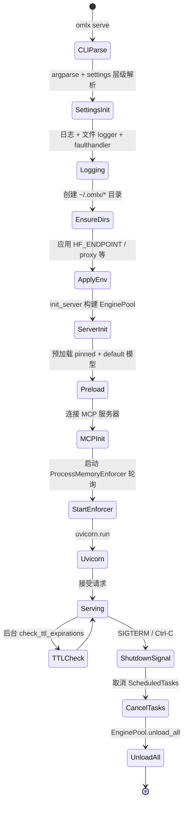

<details>
<summary>相关源文件</summary>

生成本页时使用的主要源文件：

- [omlx/__init__.py](../../../project-repos/omlx/omlx/__init__.py)
- [omlx/server.py](../../../project-repos/omlx/omlx/server.py)
- [omlx/engine_core.py](../../../project-repos/omlx/omlx/engine_core.py)
- [omlx/engine_pool.py](../../../project-repos/omlx/omlx/engine_pool.py)
- [omlx/scheduler.py](../../../project-repos/omlx/omlx/scheduler.py)
- [omlx/request.py](../../../project-repos/omlx/omlx/request.py)
- [omlx/cli.py](../../../project-repos/omlx/omlx/cli.py)

</details>

# 系统架构

oMLX 的整体设计可以归结为一个核心约束：**所有 MLX/Metal 操作必须在同一个进程内、同一个 OS 线程上执行**。这个约束不是因为偷懒，而是因为 `mlx-lm.generate.generation_stream` 是一个**模块级 Metal stream**——若多线程同时调用 GPU 内核，Metal 命令缓冲区会出现竞态，在 M4 上甚至会引发内核 panic（[omlx/cli.py:243-247](../../../project-repos/omlx/omlx/cli.py#L243-L247) 注释中的 "issue #300"，以及 [engine_core.py:35-61](../../../project-repos/omlx/omlx/engine_core.py#L35-L61) 注释中的 "issue #85"）。

这一条约束几乎决定了所有上层的架构选择：单一 MLX 执行器线程、引擎间隐式排队、外部 prefill + 仅 decode 插入、async store-cache 必须用专门的 buffer access lock。本页解释这套设计是怎么从约束出发反推出来的。

## 三层引擎栈

从顶向下，oMLX 的核心运行时栈由三层组成：



- **底层（mlx-lm BatchGenerator）**：上游能力，做 token 级连续批处理。所有活跃 UID（用户 ID）的下一个 token 在每一次 `next_generated()` 调用中并行产出。
- **中层（`EngineCore` + `Scheduler`）**：oMLX 的核心。每个被加载的模型对应**一个** `EngineCore` asyncio task 和**一个** `Scheduler` 实例。这一层负责请求排队、admission、prefix-cache 查询、prefill 编排、推测解码路径分流、async store-cache。
- **顶层（`EnginePool`）**：多模型门面。客户端的请求按 `model` 字段路由到对应引擎；若未加载则 LRU 驱逐其它引擎来腾内存。

**关键事实**：所有 `EngineCore` 共享**同一个** `ThreadPoolExecutor(max_workers=1)`（`get_mlx_executor()`，[omlx/engine_core.py:64](../../../project-repos/omlx/omlx/engine_core.py#L64)），所有调度器的 `step()`、所有 `model.load()`、所有 `mx.clear_cache()` 都通过 `loop.run_in_executor(_mlx_executor, ...)` 提交到这个线程。这意味着即使三个模型同时活跃，它们的 GPU 时间也是顺序切片，不会真正并行。

Sources: [omlx/__init__.py:1-56](../../../project-repos/omlx/omlx/__init__.py#L1-L56), [omlx/engine_core.py:35-64](../../../project-repos/omlx/omlx/engine_core.py#L35-L64)

<details class="source-snippets">
<summary>引用源码</summary>

<!-- source-snippets:start -->

#### `omlx/__init__.py:1-56`

```python
# SPDX-License-Identifier: Apache-2.0
"""
omlx: LLM inference server, optimized for your Mac

This package provides native Apple Silicon GPU acceleration using
Apple's MLX framework and mlx-lm for LLMs.

Features:
- Continuous batching via vLLM-style scheduler
- OpenAI-compatible API server
- Paged KV cache with prefix sharing
- Tiered cache (GPU + paged SSD offloading)
"""

from omlx._version import __version__

# Continuous batching engine (core functionality, no torch required)
from omlx.request import Request, RequestOutput, RequestStatus, SamplingParams
from omlx.scheduler import Scheduler, SchedulerConfig, SchedulerOutput
from omlx.engine_core import EngineCore, AsyncEngineCore, EngineConfig
from omlx.cache.prefix_cache import BlockAwarePrefixCache
from omlx.cache.paged_cache import PagedCacheManager, CacheBlock, BlockTable
from omlx.cache.stats import PrefixCacheStats, PagedCacheStats
from omlx.model_registry import get_registry, ModelOwnershipError

# Backward compatibility alias
CacheStats = PagedCacheStats

__all__ = [
    # Request management
    "Request",
    "RequestOutput",
    "RequestStatus",
    "SamplingParams",
    # Scheduler
    "Scheduler",
    "SchedulerConfig",
    "SchedulerOutput",
    # Engine
    "EngineCore",
    "AsyncEngineCore",
    "EngineConfig",
    # Model registry
    "get_registry",
    "ModelOwnershipError",
    # Prefix cache (paged SSD-only)
    "BlockAwarePrefixCache",
    # Paged cache (memory efficiency)
    "PagedCacheManager",
    "CacheBlock",
    "BlockTable",
    "PagedCacheStats",
    "CacheStats",  # Backward compatibility alias
    # Version
    "__version__",
]
```

#### `omlx/engine_core.py:35-64`

```python
def _init_mlx_thread() -> None:
    """Replace generation_stream with a thread-local stream on the executor thread.

    mlx-lm's module-level ``generation_stream`` is created at import time in
    whichever thread imported it first (the main thread at server startup).
    Arrays produced inside ``with mx.stream(generation_stream):`` blocks carry
    that stream reference.  If the stream was created on the main thread,
    subsequent ``.item()`` / ``mx.synchronize()`` calls from the executor
    thread fail with "There is no Stream(gpu, 0) in current thread".

    Fix: create a thread-local stream HERE and replace the module-level
    ``generation_stream`` in mlx_lm.generate and omlx.scheduler.
    """
    import sys
    import mlx.core as mx

    stream = mx.new_thread_local_stream(mx.default_device())

    gen_mod = sys.modules.get("mlx_lm.generate")
    if gen_mod is not None:
        gen_mod.generation_stream = stream

    sched_mod = sys.modules.get("omlx.scheduler")
    if sched_mod is not None:
        sched_mod.generation_stream = stream

    logger.info(f"MLX executor thread initialized: generation_stream = {stream}")


def get_mlx_executor() -> concurrent.futures.ThreadPoolExecutor:
```

<!-- source-snippets:end -->
</details>

## 从 HTTP 请求到 token 输出

下面这张序列图给出**一个 `/v1/chat/completions` 请求**从进入到首 token 返回的完整路径，所有标注的文件 + 行号均可定位：



序列图里的关键反直觉点：**prefill 不在 `BatchGenerator` 内部发生**。Scheduler 在 `_schedule_waiting` 里手动处理 `tokens[0:N-1]`，只把**最后一个 token** 交给 `batch_generator.insert()` 作为首个 decode step 的输入。这就是 [scheduler.py:4676](../../../project-repos/omlx/omlx/scheduler.py#L4676) 注释 "External prefill: process tokens[0:N-1] outside BatchGenerator" 的含义。

Sources: [omlx/server.py:2057-2413](../../../project-repos/omlx/omlx/server.py#L2057-L2413), [omlx/engine_core.py:188-238](../../../project-repos/omlx/omlx/engine_core.py#L188-L238), [omlx/scheduler.py:4676-4811](../../../project-repos/omlx/omlx/scheduler.py#L4676-L4811)

<details class="source-snippets">
<summary>引用源码</summary>

<!-- source-snippets:start -->

#### `omlx/server.py:2057-2413`

````python
@app.post("/v1/chat/completions")
async def create_chat_completion(
    request: ChatCompletionRequest,
    http_request: FastAPIRequest,
    _: bool = Depends(verify_api_key),
):
    """
    Create a chat completion.

    Structured output (JSON mode):
    ```json
    response_format={"type": "json_object"}
    ```

    Structured output (JSON Schema):
    ```json
    response_format={
        "type": "json_schema",
        "json_schema": {
            "name": "my_schema",
            "schema": {"type": "object", "properties": {...}}
        }
    }
    ```
    """
    # Log incoming request summary at debug, message content at trace
    logger.debug(f"Chat completion request received: model={request.model}, "
                 f"messages={len(request.messages)}, stream={request.stream}, "
                 f"max_tokens={request.max_tokens}, temp={request.temperature}")
    if logger.isEnabledFor(5):
        for i, msg in enumerate(request.messages):
            content_preview = str(msg.content)[:200] if msg.content else "(empty)"
            logger.log(5, "  Message[%d]: role=%s, content=%s...", i, msg.role, content_preview)

    # Block inference during quantization to prevent GPU Metal errors
    if _server_state.oq_manager and _server_state.oq_manager.is_quantizing:
        raise HTTPException(
            status_code=503,
            detail="Server is busy with oQ quantization. Please try again after quantization completes.",
        )

    load_start = time.perf_counter()
    engine = await get_engine_for_model(request.model)
    model_load_duration = time.perf_counter() - load_start

    # Resolve alias to real model ID for settings lookups
    resolved_model = resolve_model_id(request.model) or request.model

    # Get per-model settings
    max_tool_result_tokens = None
    merged_ct_kwargs = {}
    forced_keys: set[str] = set()
    reasoning_parser = None
    if _server_state.settings_manager:
        ms = _server_state.settings_manager.get_settings(resolved_model)
        max_tool_result_tokens = ms.max_tool_result_tokens
        reasoning_parser = ms.reasoning_parser
        if ms.chat_template_kwargs:
            merged_ct_kwargs.update(ms.chat_template_kwargs)
        forced_keys = set(ms.forced_ct_kwargs or [])
        # Dedicated enable_thinking toggle takes precedence over chat_template_kwargs
        if ms.enable_thinking is not None:
            merged_ct_kwargs["enable_thinking"] = ms.enable_thinking
        # preserve_thinking: keep <think> blocks in historical turns (Qwen 3.6+)
        if ms.preserve_thinking is not None:
            merged_ct_kwargs["preserve_thinking"] = ms.preserve_thinking
    # Per-request kwargs override model settings (except forced keys)
    if request.chat_template_kwargs:
        for k, v in request.chat_template_kwargs.items():
            if k not in forced_keys:
                merged_ct_kwargs[k] = v

    # Extract messages - different engines need different content handling.
    # Templates that expose message.reasoning_content natively (Qwen 3.6+)
    # get reasoning as a separate field; others fall back to <think> inlined
    # in content.
    _entry = get_engine_pool().get_entry(resolved_model)
    native_reasoning = bool(_entry and _entry.preserve_thinking_default is True)
    is_vlm = isinstance(engine, VLMBatchedEngine)
    extractor = getattr(engine, "message_extractor", None)
    if extractor is not None:
        messages = extractor(request.messages, max_tool_result_tokens, engine.tokenizer)
    elif is_vlm:
        # VLM: preserve image_url content parts for vision processing
        messages = extract_multimodal_content(
            request.messages,
            max_tool_result_tokens,
            engine.tokenizer,
            native_reasoning_content=native_reasoning,
        )
    else:
        messages = extract_text_content(
            request.messages,
            max_tool_result_tokens,
            engine.tokenizer,
            native_reasoning_content=native_reasoning,
        )

    # Detect and strip partial mode at the API boundary — exactly once,
    # before any chat template application.  The boolean result is forwarded
    # as an explicit parameter so the engine never has to re-derive it.
    is_partial = detect_and_strip_partial(messages)

    # Compile grammar for structured output (logit-level enforcement).
    # Grammar compilation needs the tokenizer, so ensure the engine is loaded.
    response_format = request.response_format
    if request.structured_outputs is not None or response_format:
        await engine.start()
    compiled_grammar = _compile_grammar_for_request(
        engine,
        structured_outputs=request.structured_outputs,
        response_format=response_format,
        chat_template_kwargs=merged_ct_kwargs or None,
        reasoning_parser=reasoning_parser,
    )
    # Fall back to prompt injection when grammar is not compiled
    if compiled_grammar is None and response_format:
        json_instruction = build_json_system_prompt(response_format)
        if json_instruction:
            messages = _inject_json_instruction(messages, json_instruction)
... snippet truncated ...
````

#### `omlx/engine_core.py:188-238`

```python
    async def _engine_loop(self) -> None:
        """Main engine loop - runs scheduler steps on the MLX executor.

        All scheduler steps run on _mlx_executor (single-worker thread) to
        guarantee that MLX GPU operations are never concurrent.  VLM vision
        encoding also runs on the same executor, so inline scheduler.step()
        on the event loop would race with vision mx.eval() and segfault.
        """
        loop = asyncio.get_running_loop()

        step_interval = self.config.step_interval
        stream_interval = self.config.stream_interval
        use_simple_streaming = (stream_interval == 1)

        while self._running:
            try:
                if self.scheduler.has_requests():
                    output = await loop.run_in_executor(
                        self._mlx_executor, self.scheduler.step
                    )
                    self._steps_executed += 1

                    # Fast path: distribute outputs to collectors
                    outputs = output.outputs
                    if outputs:
                        collectors = self._output_collectors
                        states = self._stream_states
                        events = self._finished_events

                        for req_output in outputs:
                            rid = req_output.request_id
                            collector = collectors.get(rid)

                            if collector is not None:
                                # Optimized: skip stream_interval check when interval=1
                                if use_simple_streaming:
                                    collector.put(req_output)
                                else:
                                    state = states.get(rid)
                                    if state and state.should_send(
                                        req_output.completion_tokens,
                                        req_output.finished
                                    ):
                                        collector.put(req_output)
                                        state.mark_sent(req_output.completion_tokens)

                            if req_output.finished:
                                event = events.get(rid)
                                if event:
                                    event.set()
                                # Note: cleanup is handled by stream_outputs() finally block
```

#### `omlx/scheduler.py:4676-4811`

```python
            # External prefill: process tokens[0:N-1] outside BatchGenerator.
            # Only the last token goes to insert() for the first decode step.
            # SpecPrefill already handled its own prefill above, so skip for those.
            if request.specprefill_indices is None and len(tokens_to_process) > 1:
                vlm_embeds = None
                if request.vlm_inputs_embeds is not None:
                    vlm_embeds = (
                        request.vlm_inputs_embeds,
                        request.vlm_extra_kwargs or {},
                        request.cached_tokens,
                    )

                # Chunked prefill: non-VLM prompts longer than one step are
                # spread across multiple step() calls. The first chunk is run
                # here; subsequent chunks run in _advance_chunked_prefills().
                if (
                    self.config.chunked_prefill
                    and vlm_embeds is None
                    and len(tokens_to_process) > self.config.prefill_step_size + 1
                ):
                    sm = self._build_state_machine(request)
                    per_row_lps = list(logits_processors) if logits_processors else []
                    state = self._begin_prefill(request, tokens_to_process, cache_to_use)
                    state.sampler = sampler
                    state.sm = sm
                    state.per_row_lps = per_row_lps

                    try:
                        done = self._step_prefill_chunk(state)
                    except _PrefillAbortedError:
                        raise

                    if done:
                        self._emit_final_boundary_if_needed(state)
                        _sync_and_clear_cache()
                        get_prefill_tracker().remove(request.request_id)
                        self._insert_prefilled_request(request, state, scheduled)
                    else:
                        self.prefilling.append(request)
                        self._prefill_states[request.request_id] = state
                    continue  # Skip normal prefill + insert path

                # Normal (non-chunked) full prefill path.
                # Assign a temporary UID so progress callbacks can map
                # uid→request_id during external prefill. Replaced by the
                # real UID returned from insert().
                temp_uid = id(request)  # unique, won't collide with BatchGenerator UIDs
                self.request_id_to_uid[request.request_id] = temp_uid
                self.uid_to_request_id[temp_uid] = request.request_id

                prefilled_cache, last_token = self._do_external_prefill(
                    request,
                    tokens_to_process,
                    cache_to_use,
                    vlm_embeds=vlm_embeds,
                )

                # Clean up temp UID mapping
                del self.uid_to_request_id[temp_uid]
                del self.request_id_to_uid[request.request_id]

                # Prefill complete: remove from progress tracker so dashboard
                # shows "generating" instead of "PP" during decode.
                get_prefill_tracker().remove(request.request_id)

                cache_to_use = prefilled_cache
                tokens_to_process = last_token

            # Capture per-request mRoPE rope_deltas for decode.
            # Prefer _captured_rope_deltas from per-request extra_kwargs
            # (set during get_input_embeddings), since the global
            # _rope_deltas may be stale when explicit position_ids are used.
            if request.vlm_inputs_embeds is not None:
                extra = request.vlm_extra_kwargs or {}
                captured = extra.get("_captured_rope_deltas")
                if captured is not None:
                    if hasattr(captured, "item"):
                        request.rope_deltas = float(captured.item())
                    else:
                        request.rope_deltas = float(captured)
                elif hasattr(self.model, "get_last_rope_deltas"):
                    request.rope_deltas = self.model.get_last_rope_deltas()

            # Build per-request state machine for stop tokens
            sm = self._build_state_machine(request)

            # Set random seed for reproducible generation (best-effort).
            # This affects global MLX random state, so concurrent requests
            # may interfere. Matches OpenAI's best-effort seed semantics.
            if request.sampling_params.seed is not None:
                mx.random.seed(request.sampling_params.seed)

            # NOTE: TurboQuant KV conversion is not applied during prefill.
            # See _do_external_prefill() comment for rationale (#771).

            # VLM MTP routing: if a gemma4_assistant drafter is attached, run
            # an extra last-token forward to capture hidden + shared_kv_states,
            # sample the first bonus, and hand the request to a vlm_mtp
            # generator instead of BatchGenerator. Falls through on any
            # eligibility issue so other speculative paths stay intact.
            if self._vlm_mtp_drafter is not None and cache_to_use is not None:
                vlm_mtp_uid = self._route_to_vlm_mtp(
                    request, cache_to_use, tokens_to_process, sampler, sm
                )
                if vlm_mtp_uid is not None:
                    self.request_id_to_uid[request.request_id] = vlm_mtp_uid
                    self.uid_to_request_id[vlm_mtp_uid] = request.request_id
                    now = time.monotonic()
                    request.batch_uid = vlm_mtp_uid
                    request.status = RequestStatus.RUNNING
                    request.generation_started_at = now
                    request.last_activity_at = now
                    self.running[request.request_id] = request
                    scheduled.append(request)
                    self.total_prompt_tokens += request.num_prompt_tokens
                    logger.debug(
                        f"Scheduled request {request.request_id} via vlm_mtp "
                        f"(uid={vlm_mtp_uid}, {request.num_prompt_tokens} prompt tokens)"
                    )
                    continue
... snippet truncated ...
```

<!-- source-snippets:end -->
</details>

## 为什么要外部 prefill

直接用 `BatchGenerator` 的内建 prefill 不行吗？理论上行，但会丢掉四个能力：

| 能力 | 内建 prefill 能否做 | 外部 prefill 怎么做的 |
|---|---|---|
| Prefix cache 复用 | 不能——BatchGenerator 不知道 oMLX 的 paged cache | Scheduler 先调 `BlockAwarePrefixCache.fetch_cache(tokens)`，命中后 `reconstruct_cache()` 从 SSD 重建 KV layer 数据，再把构造好的 cache list 传给 `batch_generator.insert(..., caches=[...])` |
| 分块 prefill（chunked prefill） | 不能 | Scheduler 把 chunked prefill 请求放进 `self.prefilling` deque，`_advance_chunked_prefills` 每步推进一个 chunk，期间继续 decode 其它请求，TTFT 下降 |
| Mid-prefill abort | 不能 | Scheduler 的 chunked 路径可以在每个 chunk 后检查 `_pending_aborts`，及时释放资源 |
| SpecPrefill / VLM-MTP 推测注入 | 不能 | 这两条路径完全在 Scheduler 这一层实现，独立于 BatchGenerator |

代价是 Scheduler 自己要做 prefill 的内存核算（`_preflight_memory_check`，[scheduler.py:4229-4275](../../../project-repos/omlx/omlx/scheduler.py#L4229-L4275)）、自己处理 boundary snapshot（针对 `RotatingKVCache` / `ArraysCache` 这种"非 sliceable"的有状态 cache），以及自己维护 chunked prefill 的运行队列。`scheduler.py` 长达 6191 行的体量，大半是这套外部 prefill 机器在堆。

Sources: [omlx/scheduler.py:4676-4811](../../../project-repos/omlx/omlx/scheduler.py#L4676-L4811), [omlx/scheduler.py:4691-4716](../../../project-repos/omlx/omlx/scheduler.py#L4691-L4716)

<details class="source-snippets">
<summary>引用源码</summary>

<!-- source-snippets:start -->

#### `omlx/scheduler.py:4676-4811`

```python
            # External prefill: process tokens[0:N-1] outside BatchGenerator.
            # Only the last token goes to insert() for the first decode step.
            # SpecPrefill already handled its own prefill above, so skip for those.
            if request.specprefill_indices is None and len(tokens_to_process) > 1:
                vlm_embeds = None
                if request.vlm_inputs_embeds is not None:
                    vlm_embeds = (
                        request.vlm_inputs_embeds,
                        request.vlm_extra_kwargs or {},
                        request.cached_tokens,
                    )

                # Chunked prefill: non-VLM prompts longer than one step are
                # spread across multiple step() calls. The first chunk is run
                # here; subsequent chunks run in _advance_chunked_prefills().
                if (
                    self.config.chunked_prefill
                    and vlm_embeds is None
                    and len(tokens_to_process) > self.config.prefill_step_size + 1
                ):
                    sm = self._build_state_machine(request)
                    per_row_lps = list(logits_processors) if logits_processors else []
                    state = self._begin_prefill(request, tokens_to_process, cache_to_use)
                    state.sampler = sampler
                    state.sm = sm
                    state.per_row_lps = per_row_lps

                    try:
                        done = self._step_prefill_chunk(state)
                    except _PrefillAbortedError:
                        raise

                    if done:
                        self._emit_final_boundary_if_needed(state)
                        _sync_and_clear_cache()
                        get_prefill_tracker().remove(request.request_id)
                        self._insert_prefilled_request(request, state, scheduled)
                    else:
                        self.prefilling.append(request)
                        self._prefill_states[request.request_id] = state
                    continue  # Skip normal prefill + insert path

                # Normal (non-chunked) full prefill path.
                # Assign a temporary UID so progress callbacks can map
                # uid→request_id during external prefill. Replaced by the
                # real UID returned from insert().
                temp_uid = id(request)  # unique, won't collide with BatchGenerator UIDs
                self.request_id_to_uid[request.request_id] = temp_uid
                self.uid_to_request_id[temp_uid] = request.request_id

                prefilled_cache, last_token = self._do_external_prefill(
                    request,
                    tokens_to_process,
                    cache_to_use,
                    vlm_embeds=vlm_embeds,
                )

                # Clean up temp UID mapping
                del self.uid_to_request_id[temp_uid]
                del self.request_id_to_uid[request.request_id]

                # Prefill complete: remove from progress tracker so dashboard
                # shows "generating" instead of "PP" during decode.
                get_prefill_tracker().remove(request.request_id)

                cache_to_use = prefilled_cache
                tokens_to_process = last_token

            # Capture per-request mRoPE rope_deltas for decode.
            # Prefer _captured_rope_deltas from per-request extra_kwargs
            # (set during get_input_embeddings), since the global
            # _rope_deltas may be stale when explicit position_ids are used.
            if request.vlm_inputs_embeds is not None:
                extra = request.vlm_extra_kwargs or {}
                captured = extra.get("_captured_rope_deltas")
                if captured is not None:
                    if hasattr(captured, "item"):
                        request.rope_deltas = float(captured.item())
                    else:
                        request.rope_deltas = float(captured)
                elif hasattr(self.model, "get_last_rope_deltas"):
                    request.rope_deltas = self.model.get_last_rope_deltas()

            # Build per-request state machine for stop tokens
            sm = self._build_state_machine(request)

            # Set random seed for reproducible generation (best-effort).
            # This affects global MLX random state, so concurrent requests
            # may interfere. Matches OpenAI's best-effort seed semantics.
            if request.sampling_params.seed is not None:
                mx.random.seed(request.sampling_params.seed)

            # NOTE: TurboQuant KV conversion is not applied during prefill.
            # See _do_external_prefill() comment for rationale (#771).

            # VLM MTP routing: if a gemma4_assistant drafter is attached, run
            # an extra last-token forward to capture hidden + shared_kv_states,
            # sample the first bonus, and hand the request to a vlm_mtp
            # generator instead of BatchGenerator. Falls through on any
            # eligibility issue so other speculative paths stay intact.
            if self._vlm_mtp_drafter is not None and cache_to_use is not None:
                vlm_mtp_uid = self._route_to_vlm_mtp(
                    request, cache_to_use, tokens_to_process, sampler, sm
                )
                if vlm_mtp_uid is not None:
                    self.request_id_to_uid[request.request_id] = vlm_mtp_uid
                    self.uid_to_request_id[vlm_mtp_uid] = request.request_id
                    now = time.monotonic()
                    request.batch_uid = vlm_mtp_uid
                    request.status = RequestStatus.RUNNING
                    request.generation_started_at = now
                    request.last_activity_at = now
                    self.running[request.request_id] = request
                    scheduled.append(request)
                    self.total_prompt_tokens += request.num_prompt_tokens
                    logger.debug(
                        f"Scheduled request {request.request_id} via vlm_mtp "
                        f"(uid={vlm_mtp_uid}, {request.num_prompt_tokens} prompt tokens)"
                    )
                    continue
... snippet truncated ...
```

#### `omlx/scheduler.py:4691-4716`

```python
                if (
                    self.config.chunked_prefill
                    and vlm_embeds is None
                    and len(tokens_to_process) > self.config.prefill_step_size + 1
                ):
                    sm = self._build_state_machine(request)
                    per_row_lps = list(logits_processors) if logits_processors else []
                    state = self._begin_prefill(request, tokens_to_process, cache_to_use)
                    state.sampler = sampler
                    state.sm = sm
                    state.per_row_lps = per_row_lps

                    try:
                        done = self._step_prefill_chunk(state)
                    except _PrefillAbortedError:
                        raise

                    if done:
                        self._emit_final_boundary_if_needed(state)
                        _sync_and_clear_cache()
                        get_prefill_tracker().remove(request.request_id)
                        self._insert_prefilled_request(request, state, scheduled)
                    else:
                        self.prefilling.append(request)
                        self._prefill_states[request.request_id] = state
                    continue  # Skip normal prefill + insert path
```

<!-- source-snippets:end -->
</details>

## 进程内的执行器图谱

oMLX 进程中实际跑着多个线程，但只有一个干 MLX 活的。下图展示了主进程的线程拓扑：



工程上必须警惕的点：

- **MLX 执行器线程** 是单例（`get_mlx_executor()`，[engine_core.py:64](../../../project-repos/omlx/omlx/engine_core.py#L64)），且**所有 EngineCore 共享**。三个模型同时跑也只用一个线程跑 GPU。
- **SSD writer 线程** 用纯 Python 的 safetensors writer（`_write_safetensors_no_mx`，[cache/paged_ssd_cache.py:257-308](../../../project-repos/omlx/omlx/cache/paged_ssd_cache.py#L257-L308)），不调用任何 Metal API——这是必须的，因为从后台线程调 Metal 会死锁。
- **G2-async**：post-finish 的 `store_cache` 在专门的单 worker 线程做（[scheduler.py:752-828](../../../project-repos/omlx/omlx/scheduler.py#L752-L828)），用 `mx.async_eval()` + 单独的 `_mx_buffer_access_lock` 与 `mx.clear_cache()` 互斥，避免后台 worker 在读 GPU buffer 时 GPU 缓存被清。
- **uvicorn worker 线程池** 只处理 HTTP I/O，不调用 MLX。所有 endpoint handler 都通过 `await engine.add_request(...)` 把 GPU 工作派发到 MLX 执行器。

Sources: [omlx/engine_core.py:35-64](../../../project-repos/omlx/omlx/engine_core.py#L35-L64), [omlx/scheduler.py:752-828](../../../project-repos/omlx/omlx/scheduler.py#L752-L828), [omlx/scheduler.py:1054-1072](../../../project-repos/omlx/omlx/scheduler.py#L1054-L1072), [omlx/cache/paged_ssd_cache.py:257-308](../../../project-repos/omlx/omlx/cache/paged_ssd_cache.py#L257-L308)

<details class="source-snippets">
<summary>引用源码</summary>

<!-- source-snippets:start -->

#### `omlx/engine_core.py:35-64`

```python
def _init_mlx_thread() -> None:
    """Replace generation_stream with a thread-local stream on the executor thread.

    mlx-lm's module-level ``generation_stream`` is created at import time in
    whichever thread imported it first (the main thread at server startup).
    Arrays produced inside ``with mx.stream(generation_stream):`` blocks carry
    that stream reference.  If the stream was created on the main thread,
    subsequent ``.item()`` / ``mx.synchronize()`` calls from the executor
    thread fail with "There is no Stream(gpu, 0) in current thread".

    Fix: create a thread-local stream HERE and replace the module-level
    ``generation_stream`` in mlx_lm.generate and omlx.scheduler.
    """
    import sys
    import mlx.core as mx

    stream = mx.new_thread_local_stream(mx.default_device())

    gen_mod = sys.modules.get("mlx_lm.generate")
    if gen_mod is not None:
        gen_mod.generation_stream = stream

    sched_mod = sys.modules.get("omlx.scheduler")
    if sched_mod is not None:
        sched_mod.generation_stream = stream

    logger.info(f"MLX executor thread initialized: generation_stream = {stream}")


def get_mlx_executor() -> concurrent.futures.ThreadPoolExecutor:
```

#### `omlx/scheduler.py:752-828`

```python
        # Async store_cache executor (G2-async). Offloads the post-finish
        # bulk memcpy (28GB+ per 32k request) off the inference thread so
        # response streaming isn't blocked by it.
        self._store_cache_executor: concurrent.futures.ThreadPoolExecutor | None = None
        # Pending (uid, request_id, future) entries waiting for async store
        # to finish before batch_generator.remove() can safely run. Drained
        # at the start of every step.
        self._pending_async_removes: deque = deque()
        # Track in-flight store futures per request_id for lookup wait /
        # shutdown wait.
        self._inflight_store_futures: dict[str, concurrent.futures.Future] = {}

        # Mapping between our request IDs and BatchGenerator UIDs
        self.request_id_to_uid: dict[str, int] = {}
        self.uid_to_request_id: dict[int, str] = {}

        # BatchGenerator - the actual batching engine
        self.batch_generator: BatchGenerator | None = None
        self._current_sampler_params: tuple | None = None
        # Boundary cache snapshots for stateful non-sliceable caches (e.g., ArraysCache).
        # request_id -> {token_count -> snapshot_cache_or_None}
        # Multiple snapshots per request to support per-block ArraysCache state storage.
        # Values are None when offloaded to SSD via _boundary_snapshot_store.
        self._boundary_cache_snapshots: dict[str, dict[int, Any]] = {}
        # Lazy detection flag: True/False once determined, None before first check.
        self._boundary_snapshot_required: bool | None = None
        # SSD store for offloading boundary snapshots (initialized in _init_tiered_cache).
        self._boundary_snapshot_store: BoundarySnapshotSSDStore | None = None

        # paged SSD cache for KV state persistence (oMLX only supports paged SSD-based caching)
        self.paged_cache_manager: PagedCacheManager | None = None
        self.block_aware_cache: BlockAwarePrefixCache | None = None
        self.paged_ssd_cache_manager: PagedSSDCacheManager | None = None
        self._cache_rate_tracker = CacheRateTracker()
        self.memory_monitor: MemoryMonitor | None = None

        # Initialize paged SSD cache if paged_ssd_cache_dir is specified
        if self.config.paged_ssd_cache_dir:
            # Calculate max_blocks automatically if not specified
            if self.config.max_cache_blocks is not None:
                max_blocks = self.config.max_cache_blocks
            else:
                max_blocks = self._calculate_max_blocks()

            # Initialize paged cache manager for block metadata
            self.paged_cache_manager = PagedCacheManager(
                block_size=self.config.paged_cache_block_size,
                max_blocks=max_blocks,
                model_name=self.config.model_name,
                initial_blocks=self.config.initial_cache_blocks,
            )
            self.block_aware_cache = BlockAwarePrefixCache(
                model=model,
                paged_cache_manager=self.paged_cache_manager,
            )

            # Initialize paged SSD cache
            self._init_tiered_cache()

            # Set cold restore callback for prefix cache
            if self.paged_ssd_cache_manager is not None:
                self.block_aware_cache.set_cold_restore_callback(
                    self._restore_block_from_cold
                )
                logger.info(
                    f"paged SSD cache enabled: {self.config.paged_ssd_cache_dir}, "
                    f"block_size={self.config.paged_cache_block_size}, "
                    f"max_blocks={max_blocks}"
                )

            # Async store_cache executor: single worker so submissions are
            # serialized (matches the original synchronous order) and we
            # never have two stores racing on the same paged_ssd index.
            self._store_cache_executor = concurrent.futures.ThreadPoolExecutor(
                max_workers=1,
                thread_name_prefix="omlx-store-cache",
            )
```

#### `omlx/scheduler.py:1054-1072`

```python
            # Hold _mx_buffer_access_lock across the worker's mx-buffer
            # access. store_cache eventually drives _extract_tensor_bytes,
            # which reads raw bytes via the buffer protocol; serializing
            # against inference-thread mx.clear_cache / mx.synchronize calls
            # prevents a SIGABRT when those reclaim the underlying Metal
            # buffer pool mid-read (#1106).
            with _mx_buffer_access_lock:
                with self._phase_timer("store_cache_worker_sync"):
                    mx.synchronize()
                block_table = self.block_aware_cache.store_cache(
                    request_id,
                    token_sequence_to_store,
                    cache_to_store,
                    model_cache_config=model_cache_config,
                    boundary_snapshots=intermediate_snapshots,
                    extra_keys=extra_keys,
                    extra_key_token_start=extra_key_token_start,
                    extra_key_ranges=extra_key_ranges,
                )
```

#### `omlx/cache/paged_ssd_cache.py:257-308`

```python
def _write_safetensors_no_mx(
    path: str,
    tensors_raw: dict[str, tuple[bytes, str, list[int]]],
    metadata: dict[str, str] | None = None,
) -> int:
    """Write a safetensors file without any mx/Metal API calls.

    Safe to call from background threads. Produces files fully compatible
    with mx.load(path, return_metadata=True).

    The safetensors binary format:
      [8 bytes: header_size as little-endian uint64]
      [header_size bytes: JSON header]
      [remaining bytes: concatenated tensor data]

    Args:
        path: Output file path (must include .safetensors extension).
        tensors_raw: Dict of {name: (raw_bytes, dtype_str, shape)}.
        metadata: Optional string-to-string metadata dict.

    Returns:
        Total file size in bytes.
    """
    offset = 0
    header_tensors = {}
    all_data = []

    for name, (raw, dtype_str, shape) in tensors_raw.items():
        header_tensors[name] = {
            "dtype": dtype_str,
            "shape": shape,
            "data_offsets": [offset, offset + len(raw)],
        }
        all_data.append(raw)
        offset += len(raw)

    header_dict = dict(header_tensors)
    if metadata:
        header_dict["__metadata__"] = metadata

    header_json = json.dumps(header_dict, separators=(",", ":")).encode("utf-8")
    # Safetensors spec: header must be 8-byte aligned
    pad = (8 - len(header_json) % 8) % 8
    header_json += b" " * pad

    with open(path, "wb") as f:
        f.write(struct.pack("<Q", len(header_json)))
        f.write(header_json)
        for d in all_data:
            f.write(d)

    return 8 + len(header_json) + offset
```

<!-- source-snippets:end -->
</details>

## 模块依赖关系

`omlx/__init__.py` 暴露的公共 API 揭示了核心模块之间的依赖方向：



`engine_pool.py` 不在公共 API 里——它是 `server.py` 的内部组件。`server.py` 也不在公共 API 里，因为 oMLX 包既可作为库使用（仅引擎 + cache），也可以作为服务运行（serve 命令）。这种切分让二次开发者可以直接 import `EngineCore` + `Scheduler` 跑自己的 wrapper，不需要拉起整个 FastAPI 服务。

Sources: [omlx/__init__.py:14-56](../../../project-repos/omlx/omlx/__init__.py#L14-L56)

<details class="source-snippets">
<summary>引用源码</summary>

<!-- source-snippets:start -->

#### `omlx/__init__.py:14-56`

```python

from omlx._version import __version__

# Continuous batching engine (core functionality, no torch required)
from omlx.request import Request, RequestOutput, RequestStatus, SamplingParams
from omlx.scheduler import Scheduler, SchedulerConfig, SchedulerOutput
from omlx.engine_core import EngineCore, AsyncEngineCore, EngineConfig
from omlx.cache.prefix_cache import BlockAwarePrefixCache
from omlx.cache.paged_cache import PagedCacheManager, CacheBlock, BlockTable
from omlx.cache.stats import PrefixCacheStats, PagedCacheStats
from omlx.model_registry import get_registry, ModelOwnershipError

# Backward compatibility alias
CacheStats = PagedCacheStats

__all__ = [
    # Request management
    "Request",
    "RequestOutput",
    "RequestStatus",
    "SamplingParams",
    # Scheduler
    "Scheduler",
    "SchedulerConfig",
    "SchedulerOutput",
    # Engine
    "EngineCore",
    "AsyncEngineCore",
    "EngineConfig",
    # Model registry
    "get_registry",
    "ModelOwnershipError",
    # Prefix cache (paged SSD-only)
    "BlockAwarePrefixCache",
    # Paged cache (memory efficiency)
    "PagedCacheManager",
    "CacheBlock",
    "BlockTable",
    "PagedCacheStats",
    "CacheStats",  # Backward compatibility alias
    # Version
    "__version__",
]
```

<!-- source-snippets:end -->
</details>

## 主进程生命周期



启动阶段几个关键点：

- **配置解析层级**：`GlobalSettings.load()` 顺序为 defaults → `~/.omlx/settings.json` → `OMLX_*` 环境变量 → CLI flags，CLI 优先级最高（[settings.py:720-907](../../../project-repos/omlx/omlx/settings.py#L720-L907)）。
- **MLX 缓存上限设置高位**：[cli.py:243-248](../../../project-repos/omlx/omlx/cli.py#L243-L248) 把 `mx.set_cache_limit(total_mem)` 设为总内存——目的是让 Metal 分配器不要在 cache 满时立即 release buffer，避免 M4 上的内核 panic。
- **`faulthandler.enable`**：[cli.py:155-158](../../../project-repos/omlx/omlx/cli.py#L155-L158) 把所有线程的 traceback 在 SIGABRT/SIGSEGV/SIGFPE/SIGBUS 时 dump 到 `~/.omlx/logs/crash.log`，配合"单一 MLX 线程"约束，让 Metal crash 可被事后定位。
- **MCP 初始化**：在 `lifespan` 启动阶段并行连接所有 MCP 服务器，失败的连接不阻塞服务启动。

Sources: [omlx/cli.py:57-273](../../../project-repos/omlx/omlx/cli.py#L57-L273), [omlx/server.py:297-408](../../../project-repos/omlx/omlx/server.py#L297-L408)

<details class="source-snippets">
<summary>引用源码</summary>

<!-- source-snippets:start -->

#### `omlx/cli.py:57-273`

```python
def serve_command(args):
    """Start the OpenAI-compatible multi-model server."""
    import logging
    import os
    import uvicorn

    from ._version import __version__
    from .settings import init_settings, get_settings
    from .logging_config import configure_file_logging, AdminStatsAccessFilter

    try:
        from ._build_info import build_number
    except ImportError:
        build_number = None

    # Print version banner
    print(f"\033[33moMLX - LLM inference, optimized for your Mac\033[0m")
    print(f"\033[33m├─ https://github.com/jundot/omlx\033[0m")
    if build_number:
        print(f"\033[33m├─ Version: {__version__}\033[0m")
        print(f"\033[33m└─ Build: {build_number}\033[0m")
    else:
        print(f"\033[33m└─ Version: {__version__}\033[0m")
    print()

    # Initialize global settings first (to get log_level from file if not specified)
    settings = init_settings(base_path=args.base_path, cli_args=args)

    # Register TRACE level (5) — includes full message content
    TRACE = 5
    logging.addLevelName(TRACE, "TRACE")

    # Configure logging (use settings value which has proper priority)
    level_name = settings.server.log_level.upper()
    log_level = TRACE if level_name == "TRACE" else getattr(logging, level_name, logging.INFO)
    logging.basicConfig(
        level=log_level,
        format="%(asctime)s - %(name)s - %(levelname)s - %(message)s",
    )
    # Set omlx loggers
    for name in ["omlx", "omlx.scheduler", "omlx.paged_ssd_cache",
                 "omlx.memory_monitor", "omlx.paged_cache", "omlx.prefix_cache",
                 "omlx.engine_pool", "omlx.model_discovery"]:
        logging.getLogger(name).setLevel(log_level)

    # Suppress repetitive admin stats access logs
    logging.getLogger("uvicorn.access").addFilter(AdminStatsAccessFilter())

    # Suppress noisy third-party loggers unless trace level
    if log_level > TRACE:
        logging.getLogger("httpcore").setLevel(logging.INFO)
        logging.getLogger("httpx").setLevel(logging.INFO)

    # Ensure required directories exist
    settings.ensure_directories()

    # Apply HuggingFace endpoint if configured
    if settings.huggingface.endpoint:
        os.environ["HF_ENDPOINT"] = settings.huggingface.endpoint

    # Apply ModelScope endpoint if configured
    if settings.modelscope.endpoint:
        os.environ["MODELSCOPE_DOMAIN"] = settings.modelscope.endpoint

    # Apply proxy/TLS settings if configured
    if settings.network.http_proxy:
        os.environ["HTTP_PROXY"] = settings.network.http_proxy
        os.environ["http_proxy"] = settings.network.http_proxy
    if settings.network.https_proxy:
        os.environ["HTTPS_PROXY"] = settings.network.https_proxy
        os.environ["https_proxy"] = settings.network.https_proxy
    if settings.network.no_proxy:
        os.environ["NO_PROXY"] = settings.network.no_proxy
        os.environ["no_proxy"] = settings.network.no_proxy
    if settings.network.ca_bundle:
        os.environ["REQUESTS_CA_BUNDLE"] = settings.network.ca_bundle
        os.environ["SSL_CERT_FILE"] = settings.network.ca_bundle

    # Save CLI args to settings.json if non-default values provided
    if _has_cli_overrides(args):
        try:
            settings.save()
            print("Saved CLI arguments to settings.json")
        except Exception as e:
            print(f"Warning: Failed to save settings: {e}")

    # Configure file logging (writes to {base_path}/logs/server.log)
    log_dir = settings.logging.get_log_dir(settings.base_path)
    configure_file_logging(
        log_dir=log_dir,
        level=settings.server.log_level,
        include_request_id=True,
        retention_days=settings.logging.retention_days,
    )
    print(f"Log directory: {log_dir}")

    # Enable native crash diagnostics (SIGABRT, SIGSEGV, SIGFPE, SIGBUS).
    # On Metal/MLX crashes (#511, #520), this dumps all Python thread
    # tracebacks to the server log before the process terminates.
    crash_log_path = log_dir / "crash.log"
    _crash_file = open(crash_log_path, "a")
    faulthandler.enable(file=_crash_file, all_threads=True)

    # Validate settings
    errors = settings.validate()
    if errors:
        for error in errors:
            print(f"Configuration error: {error}")
        sys.exit(1)

    # Import server and config
    from .server import app, init_server
    from .config import parse_size

    model_dirs = settings.model.get_model_dirs(settings.base_path)
    print(f"Base path: {settings.base_path}")
    print(f"Model directories: {', '.join(str(d) for d in model_dirs)}")
    print(f"Max model memory: {settings.model.max_model_memory}")
    print(f"Max process memory: {settings.memory.max_process_memory}")

... snippet truncated ...
```

#### `omlx/server.py:297-408`

```python
@asynccontextmanager
async def lifespan(app: FastAPI):
    """FastAPI lifespan for startup/shutdown events."""
    # Startup: Auto-populate server aliases for the admin dashboard
    # so users get sensible hostname/IP options for API URL hints
    # without manual configuration. Only runs when the persisted list
    # is empty so user-curated aliases are never overwritten.
    if (
        _server_state.global_settings is not None
        and not _server_state.global_settings.server.server_aliases
    ):
        try:
            from .utils.network import detect_server_aliases

            detected = detect_server_aliases(
                host=_server_state.global_settings.server.host
            )
            if detected:
                _server_state.global_settings.server.server_aliases = detected
                try:
                    _server_state.global_settings.save()
                except Exception as save_exc:  # pragma: no cover - filesystem race
                    logger.warning(
                        "Auto-detected server aliases but could not persist: %s",
                        save_exc,
                    )
                logger.info("Auto-detected server aliases: %s", detected)
        except Exception as exc:  # pragma: no cover - never block startup
            logger.warning("Server alias auto-detection failed: %s", exc)

    # Startup: Preload pinned models
    if _server_state.engine_pool is not None:
        await _server_state.engine_pool.preload_pinned_models()

    # Start process memory enforcer if configured
    if (
        _server_state.global_settings is not None
        and _server_state.engine_pool is not None
    ):
        max_bytes = _server_state.global_settings.memory.get_max_process_memory_bytes()
        if max_bytes is not None:
            from .process_memory_enforcer import ProcessMemoryEnforcer

            enforcer = ProcessMemoryEnforcer(
                engine_pool=_server_state.engine_pool,
                max_bytes=max_bytes,
                settings_manager=_server_state.settings_manager,
                prefill_memory_guard=_server_state.global_settings.memory.prefill_memory_guard,
                global_settings=_server_state.global_settings,
                soft_threshold=_server_state.global_settings.memory.soft_threshold,
                hard_threshold=_server_state.global_settings.memory.hard_threshold,
            )
            _server_state.process_memory_enforcer = enforcer
            _server_state.engine_pool._process_memory_enforcer = enforcer
            enforcer.start()

    # Start TTL-only checker if process memory enforcer is not running
    # (enforcer already includes TTL checks in its polling loop)
    ttl_task = None
    if _server_state.process_memory_enforcer is None and _server_state.engine_pool is not None:
        async def _ttl_check_loop():
            while True:
                try:
                    if _server_state.settings_manager is not None:
                        await _server_state.engine_pool.check_ttl_expirations(
                            _server_state.settings_manager,
                            global_idle_timeout_seconds=_server_state.global_settings.idle_timeout.idle_timeout_seconds
                            if _server_state.global_settings else None,
                        )
                except asyncio.CancelledError:
                    break
                except Exception as e:
                    logger.error(f"TTL check error: {e}")
                await asyncio.sleep(1.0)

        ttl_task = asyncio.create_task(_ttl_check_loop())

    # Initialize MCP if config provided
    # Priority: env var > settings.json
    mcp_config = os.environ.get("OMLX_MCP_CONFIG")
    if not mcp_config and _server_state.global_settings:
        mcp_config = _server_state.global_settings.mcp.config_path
    if mcp_config:
        await init_mcp(mcp_config)

    yield

    # Shutdown: Save all-time stats, stop TTL task, process memory enforcer, etc.
    get_server_metrics().save_alltime()
    if ttl_task is not None:
        ttl_task.cancel()
        try:
            await ttl_task
        except asyncio.CancelledError:
            pass
    if _server_state.process_memory_enforcer is not None:
        await _server_state.process_memory_enforcer.stop()
        if _server_state.engine_pool is not None:
            _server_state.engine_pool._process_memory_enforcer = None
        logger.info("Process memory enforcer stopped")
    if _server_state.hf_downloader is not None:
        await _server_state.hf_downloader.shutdown()
        logger.info("HF Downloader stopped")
    if _server_state.ms_downloader is not None:
        await _server_state.ms_downloader.shutdown()
        logger.info("MS Downloader stopped")
    if _server_state.mcp_manager is not None:
        await _server_state.mcp_manager.stop()
        logger.info("MCP manager stopped")
    if _server_state.engine_pool is not None:
        await _server_state.engine_pool.shutdown()
        logger.info("Engine pool shutdown")
```

<!-- source-snippets:end -->
</details>

## 内存防护的三层闸门

oMLX 对内存的防护是**三层闸门**而不是单点限制——任何一层都可能在请求生命周期的某个时刻把一个新请求挡在外面：

1. **进入引擎池前（pool 层）**：`EnginePool.get_engine()` 在加载新模型前，检查 `估算大小 * 1.25 > max_model_memory` → 抛 `ModelTooLargeError`，HTTP 503（[engine_pool.py:354-378](../../../project-repos/omlx/omlx/engine_pool.py#L354-L378)）。
2. **进入调度队列前（admission 层）**：`Scheduler.add_request` 检查 `len(waiting) > max_num_seqs*4` → 抛 `SchedulerQueueFullError`，HTTP 503 + Retry-After（[scheduler.py:3268-3275](../../../project-repos/omlx/omlx/scheduler.py#L3268-L3275)）。
3. **进入 prefill 前（preflight 层）**：`_schedule_waiting` 每次出队请求时检查实时 GPU 显存 + `_preflight_memory_check` 估算 SDPA + KV 峰值，超出硬上限的请求被 skip（不删除，下一轮再试）（[scheduler.py:4229-4275](../../../project-repos/omlx/omlx/scheduler.py#L4229-L4275)）。

此外还有一个**软压力暂停**机制：`ProcessMemoryEnforcer` 每秒轮询，发现进入软水位（85% 上限）时把 `_admission_paused = True` 推给所有 scheduler，新的 prefill 被卡住，进行中的请求不动；进入硬水位（95% 上限）时 LRU 驱逐非 pin 模型，如果都 pin 了就 `abort_all_requests` 释放 KV blocks。

**关键设计选择**：oMLX **不通过 kill 进程或杀掉 in-flight 请求来释放内存**。最坏情况是 in-flight 被 abort，但客户端会收到清晰的错误消息——"Request aborted: process memory limit exceeded. Increase --max-process-memory ..."（[engine_core.py:408-419](../../../project-repos/omlx/omlx/engine_core.py#L408-L419)）。

详细机制见 [调度器与连续批处理](scheduler-and-batching.md) 中的"内存防护"章节。

Sources: [omlx/engine_pool.py:354-378](../../../project-repos/omlx/omlx/engine_pool.py#L354-L378), [omlx/scheduler.py:3268-3275](../../../project-repos/omlx/omlx/scheduler.py#L3268-L3275), [omlx/process_memory_enforcer.py:254-393](../../../project-repos/omlx/omlx/process_memory_enforcer.py#L254-L393)

<details class="source-snippets">
<summary>引用源码</summary>

<!-- source-snippets:start -->

#### `omlx/engine_pool.py:354-378`

```python
            # Pre-load eviction: reserve 25% extra for KV cache headroom
            # so other models get evicted earlier, leaving room for context.
            # Always try to evict with headroom first. If all evictable models
            # are gone and the model still fits without headroom, allow it.
            # Skip entirely when model memory limit is disabled (None).
            # Audio engines (STT/TTS) don't use KV cache, so headroom is 0.
            if self._max_model_memory is not None:
                if entry.engine_type in ("audio_stt", "audio_tts", "audio_sts"):
                    kv_headroom = 0
                else:
                    kv_headroom = int(entry.estimated_size * 0.25)
                required_with_headroom = entry.estimated_size + kv_headroom
                try:
                    await self._ensure_memory_available(required_with_headroom)
                except InsufficientMemoryError:
                    # Can't fit with headroom even after evicting everything possible.
                    # Fall back to weights-only if that fits.
                    if self._current_model_memory + entry.estimated_size <= self._max_model_memory:
                        logger.info(
                            f"Loading {model_id} without KV headroom "
                            f"(need {format_size(required_with_headroom)}, "
                            f"available {format_size(self._max_model_memory - self._current_model_memory)})"
                        )
                    else:
                        await self._ensure_memory_available(entry.estimated_size)
```

#### `omlx/scheduler.py:3268-3275`

```python
        max_waiting = max(self.config.max_num_seqs * 4, 32)
        if len(self.waiting) >= max_waiting:
            from .exceptions import SchedulerQueueFullError

            raise SchedulerQueueFullError(
                current_depth=len(self.waiting),
                max_depth=max_waiting,
            )
```

#### `omlx/process_memory_enforcer.py:254-393`

```python
    async def _check_and_enforce(self) -> None:
        """Check current memory and enforce 2-watermark policy.

        Pressure levels:
        - ok (current < soft): no action, ensure admission unpaused.
        - soft (soft <= current < hard): LRU non-pinned eviction + signal
          schedulers to pause new admissions (in-flight requests proceed).
        - hard (current >= hard): full enforcement — LRU evict, abort
          in-flight when only pinned remain, abort in-progress model loads.

        Pressure target on recovery is the soft threshold (always evict
        back below soft to avoid oscillation when single eviction lands
        just under hard).
        """
        if self._max_bytes <= 0:
            self._pressure_level = "ok"
            return

        current = self._current_usage_bytes()
        soft = self._soft_bytes
        hard = self._hard_bytes
        prev_level = self._pressure_level

        if current < soft:
            new_level = "ok"
        elif current < hard:
            new_level = "soft"
        else:
            new_level = "hard"

        # Update cached level and propagate admission_paused immediately so
        # the scheduler stops admitting new prefills before we start evicting.
        if new_level != prev_level:
            self._pressure_level = new_level
            self._propagate_memory_limit()
            logger.info(
                f"Memory pressure level: {prev_level} -> {new_level} "
                f"(current={_format_gb(current)}, "
                f"soft={_format_gb(soft)}, hard={_format_gb(hard)})"
            )

        if new_level == "ok":
            return

        # Recover below soft regardless of level — prevents oscillation
        # at the boundary.
        target = soft

        async with self._engine_pool._lock:
            while self._current_usage_bytes() > target:
                victim = self._engine_pool._find_lru_victim()
                if victim is not None:
                    loaded_non_pinned = [
                        mid
                        for mid, e in self._engine_pool._entries.items()
                        if e.engine is not None and not e.is_pinned
                    ]
                    if len(loaded_non_pinned) > 1:
                        # Multiple non-pinned: evict LRU victim cleanly.
                        # abort_all_requests is fired before _unload_engine
                        # so clients receive proper error responses instead
                        # of silent disconnect.
                        entry = self._engine_pool._entries.get(victim)
                        if entry and entry.engine is not None:
                            if hasattr(entry.engine, "abort_all_requests"):
                                aborted = await entry.engine.abort_all_requests()
                                if aborted > 0:
                                    logger.warning(
                                        f"Aborted {aborted} requests on "
                                        f"'{victim}' before eviction"
                                    )
                        logger.warning(
                            f"Evicting model '{victim}' (pressure={new_level})"
                        )
                        await self._engine_pool._unload_engine(victim)
                        continue

                    # Only one non-pinned model remains.
                    if new_level == "hard":
                        # Abort in-flight requests, keep model loaded —
                        # frees KV blocks so short-context follow-ups work.
                        entry = self._engine_pool._entries.get(victim)
                        if entry and entry.engine is not None:
                            if hasattr(entry.engine, "abort_all_requests"):
                                aborted = await entry.engine.abort_all_requests()
                                if aborted > 0:
                                    logger.warning(
                                        f"Aborted {aborted} requests on "
                                        f"'{victim}' due to hard memory "
                                        f"pressure (model kept loaded)"
                                    )
                    # soft: leave in-flight alone — admission pause already
                    # signaled, eviction can't help further without aborts.
                    break

                # No non-pinned victim. All loaded models are pinned.
                if new_level == "hard":
                    # Hard only: abort any in-progress model loads.
                    aborted_any = False
                    for entry in self._engine_pool._entries.values():
                        if entry.is_loading and not entry.abort_loading:
                            logger.warning(
                                f"Aborting in-progress load of "
                                f"'{entry.model_id}' (hard memory pressure)"
                            )
                            entry.abort_loading = True
                            aborted_any = True
                    if not aborted_any:
                        has_loaded = any(
                            e.engine is not None
                            for e in self._engine_pool._entries.values()
                        )
                        if has_loaded:
                            logger.warning(
                                "Hard memory pressure but all loaded models "
                                "are pinned and no loads in progress."
                            )
                        else:
                            logger.warning(
                                "Hard memory pressure but no models loaded."
... snippet truncated ...
```

<!-- source-snippets:end -->
</details>

## 把一切串起来的设计哲学

读完上面这些模块图，能看到 oMLX 在做架构决策时的几个一以贯之的原则：

- **可观察 > 难调度的并发**：单线程 MLX 是为了避免 Metal 竞态，代价是模型间无真正并行。但出问题时 stack trace 是确定的，crash log 是可读的。
- **可恢复 > 速度优先**：所有 KV 数据落 SSD（甚至带版本号 `_CACHE_FORMAT_VERSION = "3"`），重启后能复用。代价是每次 prefix-cache 命中都要一次 SSD I/O，但用 RAM hot cache 缓解。
- **协议适配在边界**：OpenAI、Anthropic、Responses 三套 schema 在 server 边界转成统一的内部消息表示后才进引擎。引擎内部完全不感知"我在为哪个协议服务"。
- **依赖钉版 + 自己 patch**：四个上游库都 pin 到 commit，缺失的能力用 `omlx/patches/` 单独维护，每个 patch 都是 idempotent 的——升级上游时一个个删 patch 就能验证回归。
- **生产能力做透**：菜单栏 app、Homebrew service、auto-update、admin dashboard、9 个工具集成、MCP——做一个"能 daily-driving"的服务，不只是推理引擎。

后续每一页都是这套哲学在某个子系统上的具体落地。

## 相关页面

- [项目概览](overview.md) — 为什么有 oMLX、与同类方案的差异
- [分层 KV 缓存](tiered-kv-cache.md) — paged-SSD-only 设计与跨重启复用
- [调度器与连续批处理](scheduler-and-batching.md) — Scheduler 主循环、admission、外部 prefill 细节
- [引擎系统与多模型](engine-system.md) — EnginePool LRU + 7 种 engine 子类
