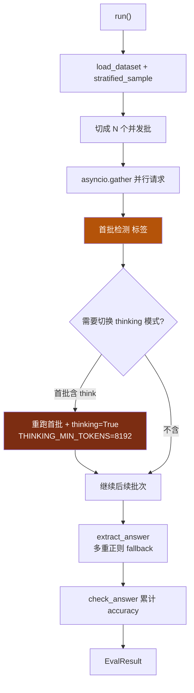
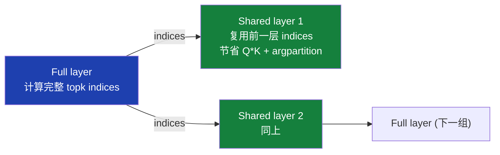
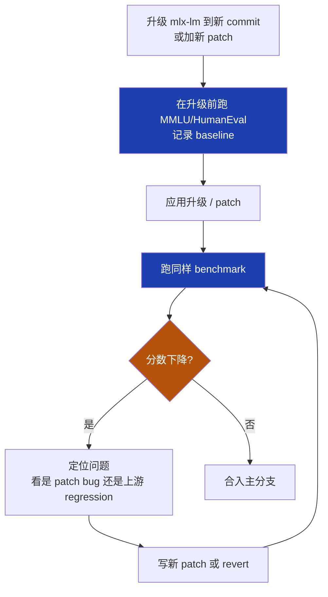

<details>
<summary>相关源文件</summary>

生成本页时使用的主要源文件：

- [omlx/eval/base.py](../../../project-repos/omlx/omlx/eval/base.py)
- [omlx/eval/__init__.py](../../../project-repos/omlx/omlx/eval/__init__.py)
- [omlx/eval/mmlu.py](../../../project-repos/omlx/omlx/eval/mmlu.py)
- [omlx/eval/humaneval.py](../../../project-repos/omlx/omlx/eval/humaneval.py)
- [omlx/patches/__init__.py](../../../project-repos/omlx/omlx/patches/__init__.py)
- [omlx/patches/turboquant_attention.py](../../../project-repos/omlx/omlx/patches/turboquant_attention.py)
- [omlx/patches/qwen3_5_attention.py](../../../project-repos/omlx/omlx/patches/qwen3_5_attention.py)
- [omlx/patches/qwen3_6_nested_visual.py](../../../project-repos/omlx/omlx/patches/qwen3_6_nested_visual.py)
- [omlx/patches/gated_delta_advance.py](../../../project-repos/omlx/omlx/patches/gated_delta_advance.py)
- [omlx/patches/index_cache.py](../../../project-repos/omlx/omlx/patches/index_cache.py)
- [omlx/patches/specprefill.py](../../../project-repos/omlx/omlx/patches/specprefill.py)
- [omlx/patches/deepseek_v4/__init__.py](../../../project-repos/omlx/omlx/patches/deepseek_v4/__init__.py)
- [omlx/patches/mlx_lm_mtp/__init__.py](../../../project-repos/omlx/omlx/patches/mlx_lm_mtp/__init__.py)
- [omlx/patches/mlx_vlm_mtp/__init__.py](../../../project-repos/omlx/omlx/patches/mlx_vlm_mtp/__init__.py)
- [omlx/admin/accuracy_benchmark.py](../../../project-repos/omlx/omlx/admin/accuracy_benchmark.py)
- [pyproject.toml](../../../project-repos/omlx/pyproject.toml)

</details>

# 评估、上游 Patch 与质量保障

oMLX 项目的依赖钉到上游 commit 的策略（mlx-lm@ed1fca4、mlx-vlm@f96138e、mlx-embeddings@32981fa、dflash-mlx@1ba6713）造成一个工程现象：**oMLX 比上游跑得快，但上游也在动**。每次上游发新版本时，会带来新的 bug fix 也会引入新的 bug，oMLX 需要决定哪些升级、哪些保持现状、哪些自己 patch。

`omlx/patches/` 是这套策略的具体执行。每个 patch 都对应一个具体的"上游 bug 或缺失能力"，文件顶部注释通常会引用上游 PR 号或 issue 号。`omlx/eval/` 是另一面：16 个 benchmark 让 oMLX 在升级依赖时能快速回归测试模型质量是否退化。这两个机制配合，让 oMLX 能在依赖不稳定的生态里维持稳定。

本页解释 oMLX 的评估套件、每个 patch 的来源与必要性，以及它们之间如何配合形成质量保障。

## 评估套件：16 个 benchmark

`omlx/eval/__init__.py` 注册的 benchmark（[eval/__init__.py:27-44](../../../project-repos/omlx/omlx/eval/__init__.py#L27-L44)）：

| 类型 | Benchmark | 用途 |
|---|---|---|
| 综合能力 | MMLU / MMLU-Pro | 通识知识 + 推理 |
| 多语言通识 | KMMLU / CMMLU / JMMLU | 韩中日 MMLU |
| 常识推理 | HellaSwag / Winogrande | 常识 + 共指 |
| 真理倾向 | TruthfulQA | 抗误导 |
| 推理 | ARC Challenge | 科学问答 |
| 数学 | GSM8K / MathQA | 推理 + 计算 |
| 代码 | HumanEval / MBPP / LiveCodeBench | 代码生成与执行 |
| 偏见 | BBQ | 偏见检测 |
| 安全 | SafetyBench | 拒答与安全 |

数据集**全部本地化**（`omlx/eval/data/*.jsonl`）。`omlx/eval/datasets.py` 提供 `load_jsonl + stratified_sample` 共享加载器——例如 MMLU 的 partial-sample 跑保留各 subject 比例：

```python
sample_size = 500  # 用户配置
items = stratified_sample(all_mmlu_items, sample_size, key="subject")
# 结果：各 subject 按比例采样，不会某个 subject 完全缺失
```

这避免了"随机采样让某些 subject 0 题"的统计陷阱。

Sources: [omlx/eval/__init__.py:27-44](../../../project-repos/omlx/omlx/eval/__init__.py#L27-L44), [omlx/eval/datasets.py](../../../project-repos/omlx/omlx/eval/datasets.py)

<details class="source-snippets">
<summary>引用源码</summary>

<!-- source-snippets:start -->

#### `omlx/eval/__init__.py:27-44`

```python
BENCHMARKS: dict[str, type[BaseBenchmark]] = {
    "mmlu": MMLUBenchmark,
    "mmlu_pro": MMLUProBenchmark,
    "kmmlu": KMMLUBenchmark,
    "cmmlu": CMMLUBenchmark,
    "jmmlu": JMMLUBenchmark,
    "hellaswag": HellaSwagBenchmark,
    "truthfulqa": TruthfulQABenchmark,
    "arc_challenge": ARCChallengeBenchmark,
    "winogrande": WinograndeBenchmark,
    "gsm8k": GSM8KBenchmark,
    "mathqa": MathQABenchmark,
    "humaneval": HumanEvalBenchmark,
    "mbpp": MBPPBenchmark,
    "livecodebench": LiveCodeBenchBenchmark,
    "bbq": BBQBenchmark,
    "safetybench": SafetyBenchBenchmark,
}
```

#### `omlx/eval/datasets.py`

```python
# SPDX-License-Identifier: Apache-2.0
"""Dataset loading and sampling utilities.

All benchmark datasets are bundled in eval/data/ as JSONL files.
All sampling uses a fixed seed for deterministic, reproducible results
so that different models are always evaluated on the same questions.
"""

import json
import logging
import random
from pathlib import Path

logger = logging.getLogger(__name__)

# Fixed seed for all sampling — ensures identical question sets across models
SAMPLE_SEED = 42


def load_jsonl(path: Path) -> list[dict]:
    """Load a JSONL file into a list of dicts."""
    items = []
    with open(path, "r", encoding="utf-8") as f:
        for line in f:
            line = line.strip()
            if line:
                items.append(json.loads(line))
    return items


def deterministic_sample(items: list[dict], n: int) -> list[dict]:
    """Sample n items with a fixed seed for reproducibility.

    Always returns the same subset for the same input data,
    enabling fair comparison across different models.
    """
    if n >= len(items):
        return items
    rng = random.Random(SAMPLE_SEED)
    return rng.sample(items, n)


def stratified_sample(
    items: list[dict], n: int, key: str
) -> list[dict]:
    """Stratified sampling: proportional representation from each category.

    Uses a fixed seed so the same questions are always selected.

    Args:
        items: Full dataset.
        n: Target sample size.
        key: Dict key for the category field.

    Returns:
        Stratified sample of size <= n.
    """
    if n >= len(items):
        return items

    rng = random.Random(SAMPLE_SEED)

    # Group by category
    groups: dict[str, list[dict]] = {}
    for item in items:
        cat = item.get(key, "unknown")
        groups.setdefault(cat, []).append(item)

    # Calculate proportional allocation
    total = len(items)
    sampled: list[dict] = []
    remaining = n

    sorted_cats = sorted(groups.keys())
    for i, cat in enumerate(sorted_cats):
        group = groups[cat]
        if i == len(sorted_cats) - 1:
            count = remaining
        else:
            count = max(1, round(len(group) / total * n))
            count = min(count, remaining, len(group))

        selected = rng.sample(group, min(count, len(group)))
        sampled.extend(selected)
        remaining -= len(selected)

        if remaining <= 0:
            break

    return sampled
```

<!-- source-snippets:end -->
</details>

## BaseBenchmark：评估的协议层

`BaseBenchmark`（[eval/base.py](../../../project-repos/omlx/omlx/eval/base.py)）是抽象基类，定义评估的协议：

```python
class BaseBenchmark(ABC):
    @abstractmethod
    def load_dataset(self) -> list[dict]: ...

    @abstractmethod
    def format_prompt(self, item: dict) -> str: ...

    @abstractmethod
    def extract_answer(self, response: str) -> str: ...

    @abstractmethod
    def check_answer(self, prediction: str, gold: str) -> bool: ...

    async def run(self, model, sample_size, parallel) -> EvalResult:
        # 通用编排逻辑：批量请求、聚合分数
        ...
```

`run()`（[eval/base.py:215-342](../../../project-repos/omlx/omlx/eval/base.py#L215-L342)）做几件重要事：



**Auto-thinking detection**（[eval/base.py:264-282](../../../project-repos/omlx/omlx/eval/base.py#L264-L282)）：oMLX 评估时如果模型自发输出 `<think>` 但当前 `enable_thinking=False`，会自动切换到 thinking 模式重跑首批。`THINKING_MIN_TOKENS=8192` 防止 thinking 占满 budget 没空间输出答案。这避免了"用户用了 thinking 模型但忘记开 enable_thinking 导致评估 0 分"的乌龙。

**Harmony 特例**（[eval/base.py:188-191](../../../project-repos/omlx/omlx/eval/base.py#L188-L191)）：gpt-oss 用 Harmony 协议，analysis channel 可能消耗整个 budget 而 final channel 没空间。所以 max_tokens 自动 ×4 至少 8192。

**答案提取三层 fallback**（`_extract_mc_answer`，[eval/base.py:96-128](../../../project-repos/omlx/omlx/eval/base.py#L96-L128)）：

1. 优先匹配 `answer is X` / `answer: X` 正则的**最后一次**出现（避免 5-shot prompt 里的示例答案被错认）
2. fallback：扫描全文最后一个 word-boundary 单字母
3. final fallback：取第一个字符

代码提取（`_extract_last_code_block`，[eval/base.py:130-165](../../../project-repos/omlx/omlx/eval/base.py#L130-L165)）：取**最后一个** ```` ```python ```` 代码块——模型经常先草稿再正式提交，最后一个才是答案。

Sources: [omlx/eval/base.py:96-342](../../../project-repos/omlx/omlx/eval/base.py#L96-L342)

<details class="source-snippets">
<summary>引用源码</summary>

<!-- source-snippets:start -->

#### `omlx/eval/base.py:96-342`

````python
    @staticmethod
    def _extract_mc_answer(response: str, valid_letters: list[str]) -> str:
        """Extract multiple choice answer from response.

        Strategy:
        1. Look for explicit "answer is X" / "answer: X" patterns (last match)
        2. Fall back to last valid letter in response
        3. Case-insensitive
        """
        response_upper = response.strip().upper()
        pattern_letters = "".join(valid_letters)

        # 1. Look for "answer is X", "answer: X", "answer X" patterns — use LAST match
        answer_patterns = re.findall(
            r"(?:answer\s*(?:is|:)\s*)([" + pattern_letters + r"])\b",
            response_upper,
        )
        if answer_patterns:
            return answer_patterns[-1]

        # 2. Fall back to last valid letter with word boundary
        all_matches = re.findall(
            r"\b([" + pattern_letters + r"])\b",
            response_upper,
        )
        if all_matches:
            return all_matches[-1]

        # 3. Check first character
        if response.strip() and response.strip()[0].upper() in valid_letters:
            return response.strip()[0].upper()

        return ""

    @staticmethod
    def _extract_last_code_block(response: str) -> str:
        """Extract the LAST code block from model response.

        Uses last match to avoid picking up drafts/examples.
        Falls back to line-by-line detection if no code blocks found.
        """
        response = response.strip()

        # Find ALL python code blocks, use LAST
        blocks = re.findall(r"```python\s*\n(.*?)```", response, re.DOTALL)
        if blocks:
            return blocks[-1].strip()

        # Generic code blocks
        blocks = re.findall(r"```\s*\n(.*?)```", response, re.DOTALL)
        if blocks:
            return blocks[-1].strip()

        # Line-by-line fallback
        lines = response.split("\n")
        code_lines = []
        in_code = False
        for line in lines:
            if not in_code and (
                line.startswith("def ")
                or line.startswith("class ")
                or line.startswith("import ")
                or line.startswith("from ")
                or line.startswith("#")
            ):
                in_code = True
            if in_code:
                code_lines.append(line)

        return "\n".join(code_lines) if code_lines else response

    @staticmethod
    def _strip_think_tags(text: str) -> str:
        """Remove <think>...</think> blocks from model output."""
        return re.sub(r"<think>.*?</think>", "", text, flags=re.DOTALL).strip()

    async def _eval_single(
        self, engine: Any, item: dict, index: int,
        sampling_kwargs: Optional[dict] = None,
        enable_thinking: bool = False,
    ) -> tuple[int, dict, str, str, str]:
        """Evaluate a single item.

        Returns (index, item, response_text, prompt_text, raw_text).
        raw_text is the unstripped output for auto-detection of thinking tags.
        """
        messages = self.format_prompt(item)
        prompt_text = "\n".join(m.get("content", "") for m in messages)
        kwargs = dict(sampling_kwargs or {})
        # Force benchmark-controlled params (override model settings)
        max_tokens = self.get_max_tokens()
        # Harmony models (gpt_oss) use analysis + final channels;
        # analysis can consume the entire budget before final is emitted
        if getattr(engine, "model_type", None) == "gpt_oss":
            max_tokens = max(max_tokens * 4, 8192)
        elif enable_thinking:
            max_tokens = min(
                max(max_tokens, THINKING_MIN_TOKENS), THINKING_MAX_TOKENS
            )
        kwargs["max_tokens"] = max_tokens
        kwargs["temperature"] = 0.0
        kwargs["presence_penalty"] = 0.0
        kwargs["repetition_penalty"] = 1.0
        # Merge enable_thinking into any existing chat_template_kwargs
        ct_kwargs = kwargs.pop("chat_template_kwargs", {}) or {}
        ct_kwargs["enable_thinking"] = enable_thinking
        kwargs["chat_template_kwargs"] = ct_kwargs
        try:
            output = await engine.chat(
                messages=messages,
                **kwargs,
            )
            raw_text = output.text
            text = self._strip_think_tags(raw_text)
            return index, item, text, prompt_text, raw_text
        except Exception as e:
            logger.warning(f"Engine error on question {index}: {e}")
            return index, item, "", prompt_text, ""

    async def run(
... snippet truncated ...
````

<!-- source-snippets:end -->
</details>

## Admin 中的准确率评估编排

`omlx/admin/accuracy_benchmark.py` 是评估在 admin 中的前端。它有几个工程价值的设计：

- **SSE 事件流**：每个题目完成发一个 `progress` event，UI 实时显示。用 `asyncio.Queue` 解耦推理任务和 UI 推送
- **服务端队列**：用户可以连续提交多个模型评估，accuracy_benchmark 维护 `_queue` + `_queue_running` 标志，自动 sequential 跑完
- **TTL 保护**：评估期间设置 `engine_pool._suppress_ttl` 让模型不会因为太久没 chat 请求而被自动卸载（accuracy bench 的请求模式跟 chat 不同）
- **持久化累计结果**：`_accumulated_results` 一直保留到用户显式 reset——意味着关浏览器 tab 不丢，多个模型的评估结果在 UI 上累积可比较

这种"长跑任务 + 流式进度 + 队列编排"的设计模式跟 oQ 量化的 OQManager 几乎一模一样——两者其实可以抽象成统一的 "长任务运行器" 类。当前是两份独立代码，未来若有第三个类似任务（如自定义 fine-tuning），可能会重构。

Sources: [omlx/admin/accuracy_benchmark.py](../../../project-repos/omlx/omlx/admin/accuracy_benchmark.py)

<details class="source-snippets">
<summary>引用源码</summary>

<!-- source-snippets:start -->

#### `omlx/admin/accuracy_benchmark.py`

```python
# SPDX-License-Identifier: Apache-2.0
"""Accuracy benchmark execution logic for oMLX admin panel.

Orchestrates MMLU, HellaSwag, TruthfulQA, GSM8K, and LiveCodeBench
evaluations with real-time progress reporting via SSE events.

Supports server-side queue and persistent result accumulation.
Results survive browser close and persist until explicitly reset.
"""

import asyncio
import logging
import time
import uuid
from dataclasses import dataclass, field
from typing import Any, Optional

from pydantic import BaseModel, field_validator

logger = logging.getLogger(__name__)

# Module-level storage for active benchmark runs
_accuracy_runs: dict[str, "AccuracyBenchmarkRun"] = {}

# Accumulated results — persists until explicit reset
_accumulated_results: list[dict] = []

# Server-side queue
_queue: list["AccuracyBenchmarkRequest"] = []
_queue_running: bool = False
_current_run_id: Optional[str] = None
_current_model: Optional[str] = None
_engine_pool_ref: Any = None

VALID_BENCHMARKS = [
    "mmlu", "mmlu_pro", "kmmlu", "cmmlu", "jmmlu",
    "hellaswag", "truthfulqa", "arc_challenge", "winogrande",
    "gsm8k", "mathqa", "humaneval", "mbpp", "livecodebench",
    "bbq", "safetybench",
]


class AccuracyBenchmarkRequest(BaseModel):
    """Request model for starting an accuracy benchmark."""

    model_id: str
    benchmarks: dict[str, int]  # name -> sample_size (0 = full dataset)
    batch_size: int = 1
    enable_thinking: bool = False

    @field_validator("batch_size")
    @classmethod
    def validate_batch_size(cls, v: int) -> int:
        if v not in (1, 2, 4, 8, 16, 32):
            raise ValueError("batch_size must be 1, 2, 4, 8, 16, or 32")
        return v

    @field_validator("benchmarks")
    @classmethod
    def validate_benchmarks(cls, v: dict[str, int]) -> dict[str, int]:
        if not v:
            raise ValueError("At least one benchmark is required")
        for name, size in v.items():
            if name not in VALID_BENCHMARKS:
                raise ValueError(
                    f"Invalid benchmark '{name}'. Must be one of {VALID_BENCHMARKS}"
                )
            if size < 0:
                raise ValueError(f"Sample size for '{name}' must be >= 0")
        return v


@dataclass
class AccuracyBenchmarkRun:
    """Tracks the state of a running accuracy benchmark."""

    bench_id: str
    request: AccuracyBenchmarkRequest
    status: str = "running"  # running, completed, cancelled, error
    queue: asyncio.Queue = field(default_factory=asyncio.Queue)
    task: Optional[asyncio.Task] = None
    results: list[dict] = field(default_factory=list)
    error_message: str = ""
    last_progress: Optional[dict] = None  # last progress event for reconnect


# --- Run management ---


def get_run(bench_id: str) -> Optional[AccuracyBenchmarkRun]:
    """Get an accuracy benchmark run by ID."""
    return _accuracy_runs.get(bench_id)


def create_run(request: AccuracyBenchmarkRequest) -> AccuracyBenchmarkRun:
    """Create a new accuracy benchmark run."""
    bench_id = str(uuid.uuid4())[:8]
    run = AccuracyBenchmarkRun(bench_id=bench_id, request=request)
    _accuracy_runs[bench_id] = run
    return run


def cleanup_old_runs() -> None:
    """Remove completed/errored runs to prevent memory leaks."""
    to_remove = []
    for bid, run in _accuracy_runs.items():
        if run.status in ("completed", "cancelled", "error"):
            to_remove.append(bid)
    for bid in to_remove:
        del _accuracy_runs[bid]


# --- Accumulated results ---


def get_accumulated_results() -> list[dict]:
    """Get all accumulated benchmark results."""
    return _accumulated_results


```

<!-- source-snippets:end -->
</details>

## Patches 体系：与上游的边界

`omlx/patches/` 里 8 个 patch + 3 个子目录，每个解决一个具体的上游缺口。设计原则：

- **idempotent**：每个 patch 模块顶部有 `_patched_classes = set()` 之类的标记，重复 apply 不出错
- **opt-in 触发**：在 model load 时根据 model_type/config 决定要不要 apply，与 model 无关的进程不会执行
- **自检上游已 fix 时跳过**：通过 inspect.getsource 或属性检测判断上游是否合入

下表汇总每个 patch：

| Patch | 修哪个上游问题 | 触发条件 |
|---|---|---|
| `turboquant_attention.py` | mlx-lm SDPA 不识别 TurboQuantKVCache | cache class 检测 |
| `qwen3_5_attention.py` | mlx-vlm 的 Qwen3.5 attention 对纯文本用 mRoPE 导致 prefix cache 失效 | 模型架构匹配 + 纯文本 input |
| `qwen3_6_nested_visual.py` | mlx-vlm sanitize_key 把 333 个 visual 参数当垃圾丢掉 | Qwen3.6 嵌套 visual checkpoint |
| `gated_delta_advance.py` | mlx-vlm 的 GatedDeltaNet 漏掉 mlx-lm 已修的 buffer leak 和 lengths slice | Qwen3.5/3.6 mlx-vlm 路径 |
| `index_cache.py` | DeepSeek/GLM DSA 邻接层重算 topk indices | model_type 含 DSA |
| `specprefill.py` | 实现 SpecPrefill 整套（不是修上游，是新增能力） | enable_specprefill |
| `deepseek_v4/` | mlx-lm PR #1192 没合入 | model_type=deepseek_v4 |
| `mlx_lm_mtp/` | mlx-lm PR #990 + Blaizzy PR #15 没合入 | mtp_enabled |
| `mlx_vlm_mtp/` | mlx-vlm sanitize 把 MTP 头权重丢了 | vlm_mtp_enabled |

下面对几个关键 patch 单独展开。

Sources: [omlx/patches/__init__.py](../../../project-repos/omlx/omlx/patches/__init__.py), [omlx/patches/](../../../project-repos/omlx/omlx/patches)

<details class="source-snippets">
<summary>引用源码</summary>

<!-- source-snippets:start -->

#### `omlx/patches/__init__.py`

```python
# SPDX-License-Identifier: Apache-2.0
"""Post-load model patches for performance optimization and correctness."""
```

#### `omlx/patches/`

> 引用目标是目录，无法展开源码片段：`omlx/patches/`

<!-- source-snippets:end -->
</details>

## qwen3_5_attention：mRoPE 跟 prefix cache 的微妙冲突

mlx-vlm 的 `Qwen3_5Attention` 类默认用 **mRoPE**（multimodal RoPE）——即使输入是纯文本。mRoPE 跟普通 RoPE 数学上等价（当三个 position section 同值时），但**数值实现**通过 prefix-cache 路径时会有微小数值偏差。

这种偏差在每次 forward 单独跑时看不出来，但**当 KV cache 是从 SSD 重建的**——重建过程涉及 dequant + slice + concat——数值偏差会累积放大。结果：

- 全新 forward：模型正确输出
- 同样 prompt 走 prefix cache 重建路径：12 次测试 10 次跟全新 forward 不一致

`omlx/patches/qwen3_5_attention.py` 的 patch：**纯文本输入用普通 RoPE，多模态输入保留 mRoPE**。`get_rope_for_input(input)` 检测 input 是否含视觉 token，dispatch 到对应实现。

这是一个非常深的 bug——bug 不在 mlx-vlm，也不在 oMLX 的 cache 模块，而在两者数值表现的细微不一致。只有同时维护 prefix cache 复用和 multi-model 的项目才会撞到。

Sources: [omlx/patches/qwen3_5_attention.py](../../../project-repos/omlx/omlx/patches/qwen3_5_attention.py)

<details class="source-snippets">
<summary>引用源码</summary>

<!-- source-snippets:start -->

#### `omlx/patches/qwen3_5_attention.py`

```python
# SPDX-License-Identifier: Apache-2.0
"""Patch mlx-vlm Qwen3_5Attention to use plain RoPE on text-only inputs.

Background
----------
mlx-lm's Qwen3.5/3.6 path uses ``Qwen3NextAttention`` which applies plain
1D RoPE with ``self.rope(x, offset=cache.offset)``. That path is correct
under prefix-cache restore (verified by Qwen3.6-35B-A3B-oQ4 cached-length
sweep 12/12 PASS on the mlx-lm engine).

mlx-vlm's ``Qwen3_5Attention`` always uses multimodal RoPE (mRoPE) with
``apply_multimodal_rotary_pos_emb``, even on text-only inputs. mRoPE is
mathematically equivalent to plain RoPE when all three position-id
sections carry identical values, but the mRoPE numerics under prefix-cache
restore on the mlx-vlm path produce greedy divergence (10/12 FAIL on the
same sweep).

This patch replaces ``Qwen3_5Attention.__call__`` with a body that
- detects text-only inputs (position_ids sections all equal, or no
  position_ids passed) and applies plain RoPE matching the mlx-lm flow
- preserves the original mRoPE branch when position_ids carries
  genuinely multimodal positions (so vision input still works)

Patch target (current upstream): mlx-vlm e41cd25
- ``mlx_vlm.models.qwen3_5.language.Qwen3_5Attention``

The companion file ``gated_delta_advance.py`` patches the GatedDeltaNet
of the same module.
"""

from __future__ import annotations

import logging
import threading
from typing import Any, Optional

try:
    import mlx.core as mx
    import mlx.nn as nn

    HAS_MLX = True
except ImportError:
    HAS_MLX = False

logger = logging.getLogger(__name__)


_patched_classes: set[int] = set()
_call_counter = {"plain": 0, "mrope": 0, "forced": 0}


# Thread-local force-plain flag.  VLMModelAdapter sets this around forward
# calls during text-only decode so the patch can skip the per-layer
# ``mx.all(...).item()`` probes inside ``_is_text_only_position_ids``.
# Each .item() forces a GPU→CPU sync; with 40-64 layers and two probes
# per call, that adds 5-10 ms per generated token (Qwen tg slowdown
# observed in `/tmp/omlx_bench/results_omlx*.json`).
_local = threading.local()


def _is_force_text_only() -> bool:
    return bool(getattr(_local, "force_text_only", False))


class force_text_only_rope:
    """Context manager that forces ``use_plain=True`` in patched Qwen3_5Attention.

    Reentry-safe via depth counter so nested decode calls inside the same
    thread (e.g. chunked prefill that loops the language model) don't drop
    the flag prematurely.  Single-thread executor in ``engine_core`` makes
    races impossible, but threading.local keeps it safe under any caller.
    """

    def __enter__(self):
        _local.depth = getattr(_local, "depth", 0) + 1
        _local.force_text_only = True
        return self

    def __exit__(self, exc_type, exc, tb):
        depth = getattr(_local, "depth", 1) - 1
        _local.depth = depth
        if depth <= 0:
            _local.force_text_only = False
            _local.depth = 0
        return False


def _rotate_half(x):
    """Same as mlx-vlm's rotate_half — split last dim in half, [-x2, x1]."""
    half = x.shape[-1] // 2
    x1 = x[..., :half]
    x2 = x[..., half:]
    return mx.concatenate([-x2, x1], axis=-1)


def _is_text_only_position_ids(position_ids: "mx.array") -> bool:
    """Return True if position_ids is a text-only mRoPE tensor (all 3 sections
    identical), or doesn't have the multimodal triplet shape at all.

    Triggers a small mx.eval via .item() once per attention call, but this
    is an O(L) reduction so the overhead per layer is negligible compared
    to the matmul cost."""
    if position_ids.ndim < 3 or position_ids.shape[0] != 3:
        return True
    p0 = position_ids[0]
    p1 = position_ids[1]
    p2 = position_ids[2]
    same_01 = mx.all(p0 == p1).item()
    if not bool(same_01):
        return False
    same_12 = mx.all(p1 == p2).item()
    return bool(same_12)


def _build_replacement_call():
    """Construct the replacement Qwen3_5Attention.__call__."""

    def __call__(
        self,
        x: "mx.array",
```

<!-- source-snippets:end -->
</details>

## qwen3_6_nested_visual：333 个参数静默丢失

Qwen3.6-35B-A3B 的 HF checkpoint 把视觉权重嵌套在 `model.language_model.visual.*` 路径下。mlx-vlm 的 `sanitize_key` 用 if/elif：

```python
if key.startswith("model.language_model"):
    return key.replace("model.language_model", "model")
elif key.startswith("model.visual"):
    return key.replace("model.visual", "vision_tower")
```

因为 `model.language_model.visual.*` 先匹配第一个分支被重写成 `model.visual.*`，然后**第二个分支永远不会被检查**——它检查的是原始 key 而非 transformation 后的 key。结果：333 个 visual 参数被当成普通 backbone 参数加载，最终因为 shape 不匹配被 mlx-vlm 静默丢弃。

`omlx/patches/qwen3_6_nested_visual.py` 包一层 `Model.sanitize`：在 mlx-vlm 调用前先 remap `language_model.model.visual.* → vision_tower.*`。

**自检机制**：patch 在 apply 前先 `inspect.getsource(mlx_vlm.models.Qwen3_6_MoE.Model.sanitize)`，如果发现源码已经包含修正后的 remap 规则，**skip apply** 并记录 INFO 日志。这样上游修复后 oMLX 自动停止 patching。

Sources: [omlx/patches/qwen3_6_nested_visual.py](../../../project-repos/omlx/omlx/patches/qwen3_6_nested_visual.py)

<details class="source-snippets">
<summary>引用源码</summary>

<!-- source-snippets:start -->

#### `omlx/patches/qwen3_6_nested_visual.py`

```python
# SPDX-License-Identifier: Apache-2.0
"""Patch mlx-vlm's qwen3_5_moe VLM sanitize for Qwen3.6's nested visual layout.

Qwen3.6-35B-A3B's HF checkpoint nests the ViT weights inside the language
model submodule: `model.language_model.visual.*` instead of the flat
`model.visual.*` layout that other Qwen VLMs use. mlx-vlm's sanitize_key
uses if/elif: it matches `model.language_model` first, rewrites to
`language_model.model`, and the `model.visual -> vision_tower` branch
never fires. Result: keys land at `language_model.model.visual.*`, which
the instantiated `Qwen3_5MoeForConditionalGeneration` model class does
not have (its ViT lives at `self.vision_tower`). 333 visual params get
silently dropped on load and any image input produces garbage.

The mlx_vlm_mtp runtime sanitize (omlx/patches/mlx_vlm_mtp) re-implements
the same if/elif shape, so the bug also carries through mtp_enabled=True.

This patch wraps `Model.sanitize` on mlx-vlm's `qwen3_5_moe` module to
remap `language_model.model.visual.* -> vision_tower.*` after the
original sanitize runs. Wired from
``omlx.utils.model_loading.maybe_apply_pre_load_patches`` (after
``apply_mlx_vlm_mtp_runtime_patch`` so it covers whichever sanitize the
class currently has) and from ``omlx.oq._build_model_sanitizer``.

Self-guards: if upstream mlx-vlm adds the rule itself, source inspection
picks up ``language_model.model.visual.`` or ``vision_tower.`` and the
patch skips.
"""

from __future__ import annotations

import logging

logger = logging.getLogger(__name__)

_NESTED_PREFIX = "language_model.model.visual."
_TARGET_PREFIX = "vision_tower."


def _rewrite_key(key: str) -> str:
    if key.startswith(_NESTED_PREFIX):
        return _TARGET_PREFIX + key[len(_NESTED_PREFIX) :]
    return key


def _make_patched_sanitize(original_sanitize):
    # mlx-vlm's Model.sanitize is an instance method: def sanitize(self, weights).
    # Preserve that signature so the bound-method call site keeps working.
    def patched_sanitize(self, weights):
        sanitized = original_sanitize(self, weights)
        remapped = 0
        out: dict = {}
        for k, v in sanitized.items():
            new_k = _rewrite_key(k)
            if new_k != k:
                remapped += 1
            out[new_k] = v
        if remapped:
            logger.info(
                "qwen3_6_nested_visual: remapped %d tensor keys "
                "'language_model.model.visual.*' -> 'vision_tower.*'",
                remapped,
            )
        return out

    patched_sanitize._omlx_nested_visual_wrapped = True
    return patched_sanitize


def apply_qwen3_6_nested_visual_patch() -> bool:
    """Install the sanitize wrapper on mlx-vlm's Qwen3_5MoE VLM Model class.

    Idempotent: skips if the current ``Model.sanitize`` already carries the
    ``_omlx_nested_visual_wrapped`` marker. Uses a function-attribute marker
    instead of a module-level flag so that if another patch replaces
    ``Model.sanitize`` (e.g. MTP runtime), this wrapper can re-apply.
    """
    try:
        from mlx_vlm.models.qwen3_5_moe import qwen3_5_moe as qwen3_5_moe_module
    except ImportError:
        logger.debug("qwen3_6_nested_visual: mlx_vlm.models.qwen3_5_moe not available")
        return False

    model_cls = getattr(qwen3_5_moe_module, "Model", None)
    if model_cls is None:
        logger.debug("qwen3_6_nested_visual: Model class not found on module")
        return False

    original_sanitize = getattr(model_cls, "sanitize", None)
    if original_sanitize is None:
        logger.debug("qwen3_6_nested_visual: Model has no sanitize attr")
        return False

    if getattr(original_sanitize, "_omlx_nested_visual_wrapped", False):
        return False

    try:
        import inspect

        source = inspect.getsource(original_sanitize)
        if _NESTED_PREFIX in source or _TARGET_PREFIX in source:
            logger.debug(
                "qwen3_6_nested_visual: upstream sanitize already handles "
                "nested visual; skipping"
            )
            return False
    except (OSError, TypeError):
        pass

    model_cls.sanitize = _make_patched_sanitize(original_sanitize)
    logger.info("qwen3_6_nested_visual: patched mlx_vlm.qwen3_5_moe Model.sanitize")
    return True
```

<!-- source-snippets:end -->
</details>

## deepseek_v4：整个模型的 monkey-patch

DeepSeek-V4-Flash 在 mlx-lm 上游有 PR #1192，但 oMLX 钉的 mlx-lm 版本（v0.31.3 / ed1fca4）早于这个 PR。oMLX 需要支持 V4-Flash，但又不想升级整个 mlx-lm（升级会牵动其它已经稳定的代码）。

解决方案：把 PR #1192 的全部内容**搬进 omlx/patches/deepseek_v4/**，作为外挂模块。`__init__.py` 做的事情：

1. **注入 PoolingCache / BatchPoolingCache** 到 `mlx_lm.models.cache.__dict__`
2. **注册 `mlx_lm.models.deepseek_v4` 到 `sys.modules`**——这样 mlx-lm 的 `getattr(models, "deepseek_v4")` 能找到模块
3. **替换 `mlx_lm.utils.load_model`**——为 V4 添加 FP8 fallback
4. **替换 `mlx_lm.models.cache._make_cache`**——支持 V4 的 cache 类型
5. **wrap `AutoTokenizer.from_pretrained`**——transformers 5.x 处理 V4 tokenizer 的 PR #45643 还没发布

总结：把一个上游 PR 的内容封装成 5 个 monkey-patch，让 V4-Flash 在不升级 mlx-lm 的前提下能跑。

`__init__.py` 顶部注释明确说：

> Once mlx-lm merges PR 1192 upstream this package can be removed in a single delete.

这是 oMLX 处理"上游有解但还没合入"的标准模板：在自己仓库做一个 self-contained patch，注释里写明对应上游 PR，未来 PR 合入时一键删除。

Sources: [omlx/patches/deepseek_v4/__init__.py](../../../project-repos/omlx/omlx/patches/deepseek_v4/__init__.py)

<details class="source-snippets">
<summary>引用源码</summary>

<!-- source-snippets:start -->

#### `omlx/patches/deepseek_v4/__init__.py`

```python
# SPDX-License-Identifier: Apache-2.0
"""DeepSeek V4 monkey-patch for mlx-lm v0.31.3.

Brings PR 1192 (https://github.com/ml-explore/mlx-lm/pull/1192) into omlx
without modifying the pinned mlx-lm. The patch:

1. Injects ``PoolingCache`` and ``BatchPoolingCache`` into
   ``mlx_lm.models.cache``.
2. Registers ``mlx_lm.models.hyper_connection`` and
   ``mlx_lm.models.deepseek_v4`` modules in ``sys.modules`` so the
   built-in ``importlib.import_module(f"mlx_lm.models.{model_type}")``
   path used by ``_get_classes`` finds them.
3. Replaces ``mlx_lm.utils.load_model`` with a copy that handles
   ``F8_E8M0`` dtype fallback and the DeepSeek V4 ``fp8`` quant_method.
4. Replaces ``mlx_lm.generate._make_cache`` with a copy aware of
   ``PoolingCache`` → ``BatchPoolingCache`` conversion.
5. Wraps ``mlx_lm.tokenizer_utils.AutoTokenizer`` with a fallback that
   retries with an empty ``PreTrainedConfig()`` when transformers does
   not yet recognize the ``deepseek_v4`` model_type (PR 45643 was
   merged 2026-05-02 but is missing from transformers <=5.7.0). This
   adopts PR 1189's tokenizer-fallback strategy.
6. Registers omlx-side cache handlers for the two new cache classes so
   prefix-cache / SSD-cache state extraction does not silently fall
   through to ``DefaultCacheHandler``.

The whole patch is gated on ``model_type == "deepseek_v4"`` in
``config.json``; other models pay zero cost.

Once mlx-lm merges PR 1192 upstream this package can be removed in a
single delete (along with the conditional dispatch in
``omlx/utils/model_loading.py`` and ``omlx/engine/batched.py``).
"""

from __future__ import annotations

import importlib.util
import logging
import sys
from pathlib import Path

logger = logging.getLogger(__name__)

PR_HEAD_SHA = "5c10538136b9038b9626c134612b08afc18d697a"
PR_URL = "https://github.com/ml-explore/mlx-lm/pull/1192"

_APPLIED = False


def _inject_cache_extras() -> None:
    """Add PoolingCache + BatchPoolingCache as attributes of mlx_lm.models.cache.

    Same setattr pattern used by turboquant_attention.py for
    ``scaled_dot_product_attention``. Idempotent.
    """
    import mlx_lm.models.cache as _cache_mod

    if hasattr(_cache_mod, "PoolingCache") and hasattr(_cache_mod, "BatchPoolingCache"):
        return

    from . import cache_extras as _extras

    _cache_mod.PoolingCache = _extras.PoolingCache
    _cache_mod.BatchPoolingCache = _extras.BatchPoolingCache
    # Also expose at __dict__ level so callers that reload the module
    # after the patch (e.g. ``from mlx_lm.models.cache import PoolingCache``)
    # see them too.
    _cache_mod.__dict__["PoolingCache"] = _extras.PoolingCache
    _cache_mod.__dict__["BatchPoolingCache"] = _extras.BatchPoolingCache

    # Reattach the classes' __module__ so any class-name introspection
    # (e.g. type(c).__module__) matches what mlx-lm code expects.
    _extras.PoolingCache.__module__ = "mlx_lm.models.cache"
    _extras.BatchPoolingCache.__module__ = "mlx_lm.models.cache"

    logger.info("PoolingCache / BatchPoolingCache injected into mlx_lm.models.cache")


def _register_module(qualname: str, file_name: str) -> None:
    """Load a local file as if it were ``qualname`` (e.g. mlx_lm.models.deepseek_v4).

    Sets ``__package__`` to ``mlx_lm.models`` so relative imports inside
    the loaded file (``from .cache import PoolingCache``,
    ``from .hyper_connection import HyperConnection``) resolve through
    the real mlx_lm package — *not* through omlx.

    Idempotent.
    """
    if qualname in sys.modules:
        return

    here = Path(__file__).parent
    file_path = here / file_name
    spec = importlib.util.spec_from_file_location(qualname, str(file_path))
    if spec is None or spec.loader is None:
        raise ImportError(f"Could not create spec for {qualname} from {file_path}")
    module = importlib.util.module_from_spec(spec)
    module.__package__ = "mlx_lm.models"
    sys.modules[qualname] = module
    spec.loader.exec_module(module)
    logger.info("Registered %s from %s", qualname, file_path.name)


def _register_cache_handlers() -> None:
    """Register PoolingCache / BatchPoolingCache handlers in omlx CacheTypeRegistry."""
    from omlx.cache.type_registry import CacheTypeRegistry

    from .cache_handlers import BatchPoolingCacheHandler, PoolingCacheHandler

    CacheTypeRegistry.register(PoolingCacheHandler())
    CacheTypeRegistry.register(BatchPoolingCacheHandler())
    logger.info("PoolingCacheHandler + BatchPoolingCacheHandler registered")


def apply_deepseek_v4_patch() -> bool:
    """Apply the DeepSeek V4 patch to mlx-lm. Idempotent.

    Must run *before* ``mlx_lm.load()`` encounters a deepseek_v4 model.

    Returns ``True`` if the patch was freshly applied, ``False`` if already
    applied or if mlx-lm is not importable.
```

<!-- source-snippets:end -->
</details>

## index_cache：算法层面的优化补丁

`index_cache.py` 不是修 bug，而是引入一个**算法层面的优化**：基于 IndexCache 论文（arXiv:2603.12201）的 DSA 层优化。



DeepSeek V3.2 / GLM-MoE-DSA 的 attention 用 sparse attention pattern——每层只让 query 关注 top-K token。论文观察到：**邻接层的 top-K indices 重叠 70-100%**。所以可以把层标为 "Full" / "Shared"：Full 层正常计算 topk，Shared 层直接复用前一层 indices。省下的是 Q*K 的相似度矩阵 + argpartition 操作。

`omlx/patches/index_cache.py` patch 进入 mlx-lm 的 attention 路径，在 model_type ∈ {`deepseek_v32`, `glm_moe_dsa`} 时自动启用。**这是 oMLX 自己研究 + 实现的优化，不是 backport 上游的**。这种"在 patches/ 加入新算法"的模式让 oMLX 可以快速试验前沿优化而不等上游接受。

Sources: [omlx/patches/index_cache.py](../../../project-repos/omlx/omlx/patches/index_cache.py)

<details class="source-snippets">
<summary>引用源码</summary>

<!-- source-snippets:start -->

#### `omlx/patches/index_cache.py`

```python
# SPDX-License-Identifier: Apache-2.0
"""IndexCache: skip redundant indexer computation in DSA layers.

Based on the IndexCache paper (arXiv:2603.12201) by THUDM/Z.ai.
Adjacent layers in DeepSeek Sparse Attention share 70-100% of selected
tokens.  By reusing topk indices from a "Full" layer in subsequent
"Shared" layers we skip the expensive Q*K attention + argpartition in
the Indexer while keeping the indexer KV cache up to date.

Supported model types: deepseek_v32, glm_moe_dsa
"""

from __future__ import annotations

import logging
from typing import Any, Optional

try:
    import mlx.core as mx

    HAS_MLX = True
except ImportError:
    HAS_MLX = False

logger = logging.getLogger(__name__)

# Sentinel for supported model types
_SUPPORTED_MODEL_TYPES = {"deepseek_v32", "glm_moe_dsa"}

# Track whether the class-level patch has been applied
_class_patch_applied = False


def _get_model_type(model: Any) -> str | None:
    """Extract model_type string from a loaded mlx-lm model."""
    for attr in ("model_type", "args"):
        obj = getattr(model, attr, None)
        if obj is None:
            continue
        if isinstance(obj, str):
            return obj
        mt = getattr(obj, "model_type", None)
        if isinstance(mt, str):
            return mt
    return None


def _build_layer_pattern(num_layers: int, freq: int) -> list[bool]:
    """Build per-layer Full/Shared pattern.

    Returns a list of booleans where True = Full (compute indexer),
    False = Shared (reuse cached indices).
    Layer 0 is always Full.
    """
    pattern = []
    for i in range(num_layers):
        pattern.append(i % freq == 0)
    return pattern


def _update_indexer_cache_only(indexer: Any, x: Any, cache: Any) -> None:
    """Update the indexer KV cache without computing attention scores.

    This runs only the K projection path of the Indexer so future Full
    layers have correct keys.  Q projection, Q*K attention, and
    argpartition are all skipped.
    """
    b, s, _ = x.shape
    k = indexer.wk(x)
    k = indexer.k_norm(k)
    k = mx.reshape(k, (b, 1, s, indexer.head_dim))

    offset = cache.offset if cache is not None else 0
    k_pe, k_nope = mx.split(k, [indexer.rope_head_dim], axis=-1)
    k_pe = indexer.rope(k_pe, offset=offset)
    k = mx.concatenate([k_pe, k_nope], axis=-1)

    if cache is not None:
        cache.update_and_fetch(k, mx.zeros([b, 1, s, 0]))


def _make_patched_attention_call(original_call):
    """Create a patched __call__ for DeepseekV32Attention.

    The patched version checks for _ic_is_full flag:
    - If absent or True: run the original indexer (Full layer)
    - If False: skip indexer, reuse cached topk_indices (Shared layer)
    """
    from mlx_lm.models.base import scaled_dot_product_attention

    def patched_call(
        self,
        x: mx.array,
        mask: Optional[mx.array] = None,
        cache: Optional[Any] = None,
    ) -> mx.array:
        # If this instance has no IndexCache flags, run original
        if not hasattr(self, "_ic_is_full"):
            return original_call(self, x, mask, cache)

        B, L, D = x.shape

        qr = self.q_a_layernorm(self.q_a_proj(x))
        q = self.q_b_proj(qr)

        q = q.reshape(B, L, self.num_heads, self.q_head_dim).transpose(0, 2, 1, 3)
        q_nope, q_pe = mx.split(q, [self.qk_nope_head_dim], axis=-1)
        compressed_kv = self.kv_a_proj_with_mqa(x)
        compressed_kv, k_pe = mx.split(
            compressed_kv, [self.kv_lora_rank], axis=-1
        )
        k_pe = k_pe.reshape(B, L, 1, self.qk_rope_head_dim).transpose(
            0, 2, 1, 3
        )
        kv_latent = self.kv_a_layernorm(compressed_kv)

        offset = cache[0].offset if cache is not None else 0
        q_pe = self.rope(q_pe, offset)
        k_pe = self.rope(k_pe, offset)

```

<!-- source-snippets:end -->
</details>

## mlx_lm_mtp：兼具修补和新增的混合 patch

`mlx_lm_mtp/__init__.py` 同时做两件事：

1. **bring up** mlx-lm 的 MTP 头支持（PR #990，未合入主线）—给 Qwen3.5、DeepSeek-V4-Flash 注入 `mtp_forward` 方法
2. **enhance** mlx-lm 的 `__call__` —让 forward 同时返回 hidden states 和 logits（避免 draft 后再算一次 forward 拿 hidden）

第二项不是 bug 修复也不是新功能——是为了配合 oMLX 的 MTP 路径专门的"性能优化 patch"。如果不加这个 enhancement，每次 MTP draft 后要再跑一次 model.forward 拿 hidden，开销翻倍。

`mlx_lm_mtp` 的 patch 也演示了一个细节：**只在 batch 中只有一个 sequence 时启用 MTP**（[mlx_lm_mtp/__init__.py](../../../project-repos/omlx/omlx/patches/mlx_lm_mtp/__init__.py)）。原因是 mlx-lm BatchGenerator 的多请求 KV cache 在 MTP 路径下会错位——这是 mlx-lm 上游的限制，oMLX 不打算 patch（要 patch 这个就要重写整个 BatchGenerator）。

Sources: [omlx/patches/mlx_lm_mtp/__init__.py](../../../project-repos/omlx/omlx/patches/mlx_lm_mtp/__init__.py)

<details class="source-snippets">
<summary>引用源码</summary>

<!-- source-snippets:start -->

#### `omlx/patches/mlx_lm_mtp/__init__.py`

```python
# SPDX-License-Identifier: Apache-2.0
"""Native MTP (Multi-Token Prediction) monkey-patches for mlx-lm.

This package adapts two upstream PRs into runtime monkey-patches:

- ml-explore/mlx-lm#990 — Qwen3.5 / Qwen3.6 native MTP heads (dense + MoE)
- Blaizzy/mlx-lm#15    — DeepSeek-V4-Flash native MTP heads

Both PRs follow the same shape: a model gains an extra ``mtp`` module + a
``mtp_forward`` method and an enhanced ``__call__`` that returns hidden
states alongside logits. A separate ``mtp_generate_step`` generator drives
the draft/verify loop using those hooks.

This package implements the model-side hooks as in-place monkey-patches and
folds the draft/verify loop into mlx-lm's ``GenerationBatch.next()`` so the
existing oMLX paged + prefix + SSD cache stack keeps working unchanged.

Activation gate: caller (utils/model_loading.py) checks
``model_settings.mtp_enabled`` and the model's ``config.json`` for MTP
heads + a supported ``model_type`` before invoking ``apply_mlx_lm_mtp_patch``.
The patches are idempotent.

Concurrency model: the BatchGenerator patch only takes the MTP path when
exactly one sequence is active in the generation batch. Concurrent requests
fall through to the standard continuous-batching path.
"""

from __future__ import annotations

import logging

logger = logging.getLogger(__name__)

_PATCHED = False

# Process-wide flag read by the patched ``Model.__init__`` (Qwen3.5/3.6 +
# DeepSeek-V4) to decide whether to attach the MTP head module. Caller
# (``utils/model_loading.py::maybe_apply_pre_load_patches``) sets this
# right before ``mlx_lm.load()`` runs based on ``model_settings.mtp_enabled``.
# Default False keeps newly-loaded models MTP-free unless explicitly opted in.
_MTP_ACTIVE = False


def set_mtp_active(active: bool) -> None:
    """Toggle whether subsequent ``mlx_lm.load()`` calls attach the MTP head.

    Affects ``self.mtp`` attachment in patched ``Model.__init__`` (and
    DeepSeek-V4 equivalent) and is checked by BatchGenerator's
    ``_is_mtp_eligible`` (via the presence of the ``mtp`` attribute).
    Single-thread MLX executor serializes loads, so this is race-free.
    """
    global _MTP_ACTIVE
    _MTP_ACTIVE = bool(active)


def is_mtp_active() -> bool:
    return _MTP_ACTIVE


def apply_mlx_lm_mtp_patch() -> bool:
    """Apply the model-side and BatchGenerator monkey-patches.

    Idempotent. Must be invoked before ``mlx_lm.load()`` so the patched
    ``__init__`` / ``sanitize`` / ``from_dict`` paths see MTP weights.

    Returns:
        True if the patch is now active (newly applied or already applied
        on a previous call). False if a sub-step refused to apply (mlx-lm
        not importable, missing prerequisite patch, etc.).
    """
    global _PATCHED
    if _PATCHED:
        return True

    from . import batch_generator, cache_rollback, deepseek_v4_model, qwen35_model

    if not cache_rollback.apply():
        return False
    if not qwen35_model.apply():
        # Qwen models are the main target; if the qwen patch refuses we
        # still continue so DeepSeek-V4 users aren't blocked.
        logger.debug("Qwen3.5/3.6 MTP patch did not apply (likely import error)")
    if not deepseek_v4_model.apply():
        logger.debug("DeepSeek-V4 MTP patch did not apply (likely missing base patch)")
    if not batch_generator.apply():
        logger.warning(
            "BatchGenerator MTP dispatch patch failed; MTP path will be inactive"
        )
        return False

    _PATCHED = True
    logger.info("mlx-lm MTP patch applied (PR 990 + PR 15)")
    return True
```

<!-- source-snippets:end -->
</details>

## 依赖钉版的"分级"策略

回头看 `pyproject.toml` 的 dependency 列表（[pyproject.toml:30-80](../../../project-repos/omlx/pyproject.toml#L30-L80)），oMLX 对依赖采用**分级**钉版：

| 等级 | 例子 | 钉法 |
|---|---|---|
| **Pinned to commit** | mlx-lm@ed1fca4, mlx-vlm@f96138e, mlx-embeddings@32981fa, dflash-mlx@1ba6713 | 完整 git URL + SHA |
| **Min version** | mlx>=0.31.2, transformers>=5.0.0, mistral-common>=1.10 | `>=` |
| **Latest acceptable** | tiktoken, protobuf, pyyaml | 无版本约束 |
| **Optional extras** | xgrammar, mcp, modelscope, mlx-audio, paroquant | 在 `[project.optional-dependencies]` |

钉到 commit 的都是**正在快速迭代且 oMLX 强依赖特定 fix 的核心**。`mlx-lm@ed1fca4` 的注释写明："thread-local generation stream + ArraysCache batch dim fixes + think token None safety"——这三个 fix oMLX 必须有，但上游版本号还没发。

`mistral-common>=1.10` 的注释更长（[pyproject.toml:42-48](../../../project-repos/omlx/pyproject.toml#L42-L48)）：transformers 5.x 的 `tokenization_mistral_common` 模块 import `ReasoningEffort`（mistral-common 1.10 才加），但 audio extras 拉的 mlx-audio[stt] 会传递性拉 1.9.x，导致 Whisper processor "Processor not found" 静默失败。所以 base dependency 显式 pin >=1.10。

这种**注释级**的版本约束让其他维护者明白每个 pin 的来由——若哪天可以放开，注释里写的 reproduction 步骤也是验证手段。

Sources: [pyproject.toml:30-100](../../../project-repos/omlx/pyproject.toml#L30-L100)

<details class="source-snippets">
<summary>引用源码</summary>

<!-- source-snippets:start -->

#### `pyproject.toml:30-100`

```toml
dependencies = [
    "mlx>=0.31.2",
    # mlx-lm from commit (ed1fca4, v0.31.3) - thread-local generation stream + ArraysCache batch dim fixes + think token None safety
    "mlx-lm @ git+https://github.com/ml-explore/mlx-lm@ed1fca4cef15a824c5f1702c80f70b4cffc8e4dd",
    # regex for mlx-lm's Gemma 4 tool parser (uses recursive patterns)
    "regex",
    # mlx-embeddings from latest commit (32981fa)
    "mlx-embeddings @ git+https://github.com/Blaizzy/mlx-embeddings@32981fa4e8064ed664b52071789dd18271fe4206",
    # mlx-vlm custom processors bypass HF AutoProcessor, so torch is not required
    "transformers>=5.0.0",
    # transformers 5.x's tokenization_mistral_common module imports
    # ReasoningEffort from mistral_common (added in 1.10). The audio extras
    # transitively pull mistral-common via mlx-audio[stt], which historically
    # resolved to 1.9.x and broke WhisperProcessor.from_pretrained() with a
    # silent "Processor not found" on every Whisper model. Pinning the
    # minimum here ensures resolution lands on a compatible version even
    # without the audio extra installed.
    # See pmarreck/omlx#1 for full repro and root cause.
    "mistral-common>=1.10",
    "tokenizers>=0.19.0",
    "huggingface-hub>=0.23.0",
    "numpy>=1.24.0",
    "tqdm>=4.66.0",
    "pyyaml>=6.0",
    "itsdangerous>=2.0",
    "jinja2>=3.0",
    "sentencepiece",
    "tiktoken",
    "protobuf",
    "requests>=2.28.0",
    # SOCKS proxy support (used by httpx via huggingface-hub)
    "socksio>=1.0.0",
    "tabulate>=0.9.0",
    # Resource monitoring
    "psutil>=5.9.0",
    # Server
    "fastapi>=0.108.0",
    "uvicorn>=0.23.0",
    # python-multipart is needed by audio_routes.py (File/Form uploads), which
    # server.py unconditionally imports regardless of the [audio] extra.
    "python-multipart>=0.0.5",
    # JSON Schema validation for structured output
    "jsonschema>=4.0.0",
    # Harmony format parser for gpt-oss models
    "openai-harmony",
    # mlx-vlm from commit (f96138e) - Gemma4 MTP server batching (PR #1166), speculative utils refactor (PR #1169), Qwen native MTP drafter, MiniCPM-V 4.6
    "mlx-vlm @ git+https://github.com/Blaizzy/mlx-vlm@f96138eef1f5ce7fb5d97f8dd41a664a195b5659",
    "Pillow>=9.0.0",
    # dflash-mlx v0.1.7 (1ba6713) — bstnxbt repo. Qwen thinking/GDN exactness fix, GQA SDPA reshape, DDTree + CopySpec decode path, prefix cache identity hardening, fp16 draft on old Apple chips
    "dflash-mlx @ git+https://github.com/bstnxbt/dflash-mlx@1ba671372b289c025b435c1a13aabb4bfb80b183",
]

[project.optional-dependencies]
grammar = [
    # Grammar-constrained decoding for structured output (requires torch ~2GB)
    "xgrammar>=0.1.32",
]
mcp = [
    "mcp>=1.0.0",
]
modelscope = [
    "modelscope>=1.10.0",
]
audio = [
    # mlx-audio from commit (5175326) with tts/stt/sts extras
    # tts extra: misaki, num2words, spacy, phonemizer-fork, espeakng-loader, sentencepiece
    # stt extra: tiktoken, mistral-common[audio]
    # sts extra: tts deps + stt deps + webrtcvad
    "mlx-audio[tts,stt,sts] @ git+https://github.com/Blaizzy/mlx-audio@51753266e0a4f766fd5e6fbc46652224efc23981",
]
paroquant = [
```

<!-- source-snippets:end -->
</details>

## uv override-dependencies：解析冲突的逃生口

```toml
[tool.uv]
override-dependencies = [
    "mlx-lm @ git+https://github.com/ml-explore/mlx-lm@ed1fca4cef15a824c5f1702c80f70b4cffc8e4dd",
]
```

这条配置是关键：mlx-audio 在自己 metadata 里写 `mlx-lm==0.31.1`，跟 oMLX 钉的 0.31.3 commit 冲突。如果不 override，`uv sync` 会拒绝解析。`override-dependencies` 让 uv "无视下游约束，强制用 override 的版本"。

Pip 没有等价机制——所以 oMLX 用 uv 而不是 pip 做 lock。pyproject.toml 同时维护 `optional-dependencies` 和 `dependency-groups`——前者给 pip 用，后者给 uv 用，两者要保持一致。

Sources: [pyproject.toml:148-153](../../../project-repos/omlx/pyproject.toml#L148-L153)

<details class="source-snippets">
<summary>引用源码</summary>

<!-- source-snippets:start -->

#### `pyproject.toml:148-153`

```toml
[tool.uv]
# mlx-lm is pinned to a git commit; override transitive pins
# (e.g. mlx-audio → mlx-lm==0.31.1) so the resolver accepts it.
override-dependencies = [
    "mlx-lm @ git+https://github.com/ml-explore/mlx-lm@ed1fca4cef15a824c5f1702c80f70b4cffc8e4dd",
]
```

<!-- source-snippets:end -->
</details>

## Patch 与 Eval 配合形成质量保障闭环

每次 oMLX 升级一个上游 commit 或加一个 patch，逻辑是：



这个闭环让 oMLX 在依赖快速变化的生态里保持稳定——评估套件是 patch 体系的安全网。

Patch 体系是质量保障的另一面：**主动接住上游的 bug**，让用户不需要等上游修复就能用新特性。两者配合，让 oMLX 能在"依赖钉版"和"持续支持新模型"之间维持平衡。

## 设计回顾

整套质量保障体系有几个一以贯之的原则：

- **不 fork 上游，写 patch**：每个 patch 都是 idempotent + 自检，未来上游合入后能一键删
- **依赖钉到 commit + 文档化原因**：注释里写明每个 pin 的来由，让其他维护者能判断何时可以放开
- **评估套件本地化**：不依赖外部 API，离线可跑
- **Auto-thinking + Harmony 特例**：评估时自适应模型行为，避免"配置错误导致评估错"
- **stratified sample**：评估时保留 subject 分布，让 partial-run 的分数仍有可比性
- **Admin 中的长任务编排**：accuracy_benchmark 跟 oq_manager 用同样的 pattern——SSE 进度 + 队列 + 防 TTL 卸载
- **自检上游已 fix**：patch 在 apply 前先检查上游源码，避免双重 patch 出问题

oMLX 在这个层面的工程深度是项目的稳定性根基——很多 LLM 工具不做这套，结果上游一升级就崩。oMLX 通过 patch + eval + 钉版三件套，把"前沿支持"和"生产稳定"两个看似冲突的目标同时拿下。

## 相关页面

- [推测解码三条路径](speculative-decoding.md) — SpecPrefill / MTP patch 的具体应用
- [oQ 数据驱动混合精度量化](oq-quantization.md) — TurboQuant patch 的来源
- [系统架构](system-architecture.md) — patch 在加载时机的注入点
- [模型管理与 Admin Dashboard](model-management.md) — admin accuracy benchmark 的 UI 入口
- [macOS App 打包与部署](packaging-and-deployment.md) — 依赖钉版与 venvstacks build 的关系
