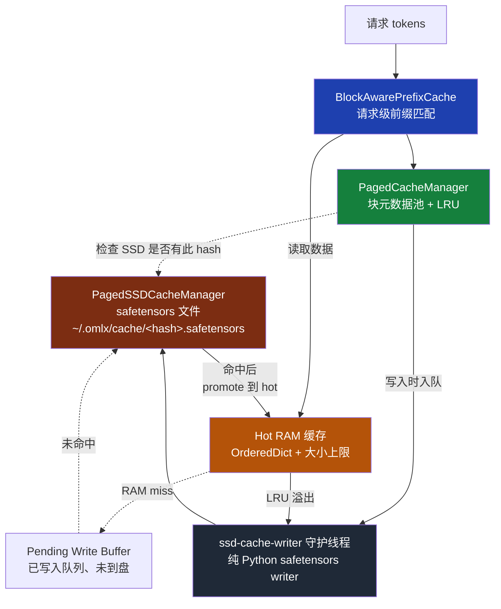
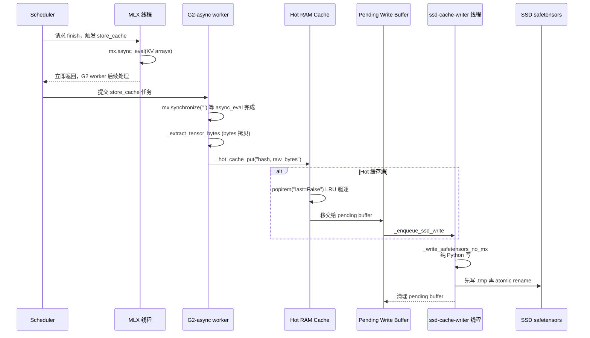
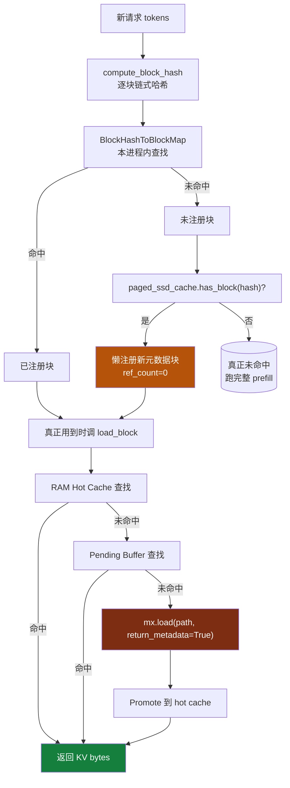
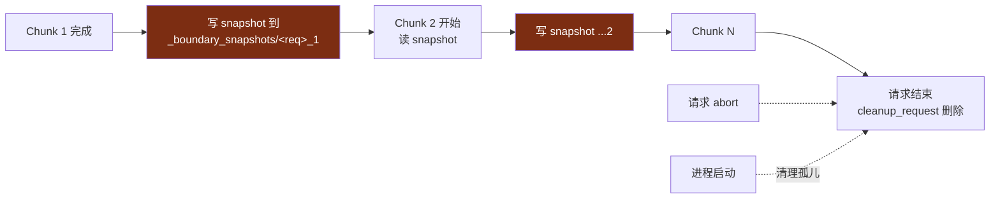
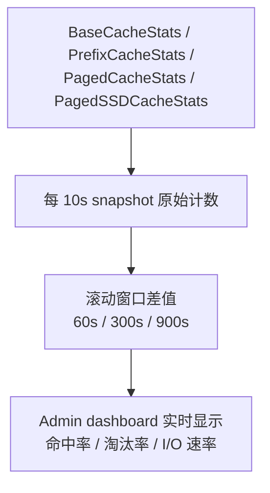

<details>
<summary>相关源文件</summary>

生成本页时使用的主要源文件：

- [omlx/cache/__init__.py](../../../project-repos/omlx/omlx/cache/__init__.py)
- [omlx/cache/interface.py](../../../project-repos/omlx/omlx/cache/interface.py)
- [omlx/cache/paged_cache.py](../../../project-repos/omlx/omlx/cache/paged_cache.py)
- [omlx/cache/paged_ssd_cache.py](../../../project-repos/omlx/omlx/cache/paged_ssd_cache.py)
- [omlx/cache/hybrid_cache.py](../../../project-repos/omlx/omlx/cache/hybrid_cache.py)
- [omlx/cache/prefix_cache.py](../../../project-repos/omlx/omlx/cache/prefix_cache.py)
- [omlx/cache/tiered_manager.py](../../../project-repos/omlx/omlx/cache/tiered_manager.py)
- [omlx/cache/factory.py](../../../project-repos/omlx/omlx/cache/factory.py)
- [omlx/cache/vision_feature_cache.py](../../../project-repos/omlx/omlx/cache/vision_feature_cache.py)
- [omlx/cache/boundary_snapshot_store.py](../../../project-repos/omlx/omlx/cache/boundary_snapshot_store.py)
- [omlx/cache/type_registry.py](../../../project-repos/omlx/omlx/cache/type_registry.py)

</details>

# 分层 KV 缓存

vLLM 的 paged KV cache 在云端 GPU 上跑得很好，但搬到本地 Mac 服务上有两个独特问题：

**问题一**：单台 Mac 的统一内存不够装下"全部活跃模型 + 全部历史 KV"。云端可以靠机器横向扩展，本地不行。

**问题二**：本地服务会**重启**——升级、崩溃恢复、用户主动关机。云端 vLLM 假设进程长期常驻；本地服务每次重启都意味着所有历史 KV 蒸发。当你在用 Claude Code 和本地 LLM 配合写代码时，一次重启就让所有对话的 prefill 重新开始——可能是几十秒的卡顿。

oMLX 的回答是**paged-SSD-only 架构**：进程内**只**保留块元数据（block hash + 引用计数 + LRU 指针），KV 张量数据**全部**落 SSD safetensors，进程退出后整套缓存仍然存在。RAM 里维护一个可配大小的 hot 缓存做读取加速，但它不是数据的"主存储"——它是缓存的缓存。

本页解释这套设计的具体机制：块如何被哈希、如何被持久化、跨重启如何被找回、热冷数据如何流动。

## 设计倒置：进程是缓存的访问者，不是拥有者

读完源码会发现一个反直觉的事实：`PagedCacheManager` 这个类**不持有任何 KV 张量数据**。它只有 `CacheBlock` 元数据（block_id、ref_count、block_hash、双向链表指针）（[paged_cache.py:135-137](../../../project-repos/omlx/omlx/cache/paged_cache.py#L135-L137)）。



这意味着加载一个 100GB 的历史缓存进程内只占元数据空间（~MB 级）。代价是每次命中都需要从 SSD 读出对应 block——这个代价由 hot RAM 缓存大幅缓解。SSD 端的写入则由后台守护线程异步执行，对推理路径几乎透明。

Sources: [omlx/cache/factory.py:8-11](../../../project-repos/omlx/omlx/cache/factory.py#L8-L11), [omlx/cache/paged_cache.py:135-137](../../../project-repos/omlx/omlx/cache/paged_cache.py#L135-L137)

<details class="source-snippets">
<summary>引用源码</summary>

<!-- source-snippets:start -->

#### `omlx/cache/factory.py:8-11`

```python
Note: oMLX only supports paged SSD-based caching. Memory KV cache is managed
by mlx-lm's BatchGenerator. When paged SSD cache is disabled, no oMLX caching
is performed.
"""
```

#### `omlx/cache/paged_cache.py:135-137`

```python
    NOTE: In paged SSD-only mode, blocks do NOT store cache_data in GPU memory.
    All KV cache data is stored on paged SSD via PagedSSDCacheManager, and only
    loaded when needed for inference via BatchGenerator.
```

<!-- source-snippets:end -->
</details>

## 链式 SHA-256 哈希：块的身份证

块如何被唯一标识？答案是 vLLM v1 的**链式哈希**机制，但 oMLX 在 hash 内容里加入了 `model_name`，从而隔离不同模型的缓存：

```python
def compute_block_hash(model_name, parent_hash, token_ids, extra_keys):
    return sha256(model_name || parent_hash || str(tuple(token_ids)) || extra_keys)
```

这个公式有几个非显然的特性：

- **链式**：block `i` 的 hash 依赖 block `i-1` 的 hash，从而**block `i` 的 hash 隐含了 token 序列 `[0, i*block_size)`** 的全部信息。这让前缀查找变成 O(blocks) 而不是 O(tokens)。
- **模型隔离**：同样的 token 序列在不同模型下产生不同 hash，因此两个模型共用同一 SSD 缓存目录也不会互相污染。
- **extra_keys 通配**：VLM 模型可以用图像 hash 作为 extra_keys，让多模态 prompt 也走前缀缓存。

`compute_block_hash` 定义在 [paged_cache.py:78-119](../../../project-repos/omlx/omlx/cache/paged_cache.py#L78-L119)。`BlockHashToBlockMap` ([paged_cache.py:378-443](../../../project-repos/omlx/omlx/cache/paged_cache.py#L378-L443)) 是一个 `{hash: {block_id: CacheBlock}}` 索引，让"给定 hash 找 block"变成 O(1)。

Sources: [omlx/cache/paged_cache.py:78-119](../../../project-repos/omlx/omlx/cache/paged_cache.py#L78-L119), [omlx/cache/paged_cache.py:378-443](../../../project-repos/omlx/omlx/cache/paged_cache.py#L378-L443)

<details class="source-snippets">
<summary>引用源码</summary>

<!-- source-snippets:start -->

#### `omlx/cache/paged_cache.py:78-119`

```python
def compute_block_hash(
    parent_hash: Optional[BlockHash],
    token_ids: List[int],
    extra_keys: Optional[Tuple[Any, ...]] = None,
    model_name: Optional[str] = None,
) -> BlockHash:
    """
    Compute hash for a block based on its content and parent block.

    This enables prefix caching by creating a chain of hashes where
    each block's hash depends on all previous blocks (similar to vLLM).

    Args:
        parent_hash: Hash of the previous block, or None for first block
        token_ids: Token IDs in this block
        extra_keys: Additional keys (e.g., LoRA, multimodal)
        model_name: Model name for cache isolation between different models

    Returns:
        Content-based hash for this block
    """
    hasher = hashlib.sha256()

    # Include model name first to isolate caches between different models
    if model_name:
        hasher.update(model_name.encode("utf-8"))

    # Include parent hash for chain
    if parent_hash:
        hasher.update(parent_hash)
    else:
        # Use fixed seed for reproducibility
        hasher.update(b"omlx-root")

    # Include token content
    hasher.update(bytes(str(tuple(token_ids)), "utf-8"))

    # Include extra keys if present
    if extra_keys:
        hasher.update(bytes(str(extra_keys), "utf-8"))

    return BlockHash(hasher.digest())
```

#### `omlx/cache/paged_cache.py:378-443`

```python
class BlockHashToBlockMap:
    """
    Cache mapping block hashes to blocks for prefix caching.

    Follows vLLM's design where the same hash can map to multiple
    blocks (for different KV cache groups in hybrid models).
    """

    def __init__(self) -> None:
        self._cache: Dict[BlockHash, CacheBlock | Dict[int, CacheBlock]] = {}

    def get_block(self, block_hash: BlockHash) -> Optional[CacheBlock]:
        """Get any block with the given hash."""
        blocks = self._cache.get(block_hash)
        if blocks is None:
            return None
        if isinstance(blocks, CacheBlock):
            return blocks
        if isinstance(blocks, dict):
            return next(iter(blocks.values()))
        return None

    def insert(self, block_hash: BlockHash, block: CacheBlock) -> None:
        """Insert a block into the cache."""
        existing = self._cache.get(block_hash)
        if existing is None:
            self._cache[block_hash] = block
        elif isinstance(existing, CacheBlock):
            self._cache[block_hash] = {
                existing.block_id: existing,
                block.block_id: block,
            }
        elif isinstance(existing, dict):
            existing[block.block_id] = block

    def pop(self, block_hash: BlockHash, block_id: int) -> Optional[CacheBlock]:
        """Remove and return a specific block from the cache."""
        blocks = self._cache.pop(block_hash, None)
        if blocks is None:
            return None

        if isinstance(blocks, CacheBlock):
            if blocks.block_id == block_id:
                return blocks
            # Wrong block ID, put it back
            self._cache[block_hash] = blocks
            return None

        if isinstance(blocks, dict):
            block = blocks.pop(block_id, None)
            if blocks:  # Still has other blocks
                self._cache[block_hash] = blocks
            return block

        return None

    def __len__(self) -> int:
        return len(self._cache)

    def clear(self) -> None:
        self._cache.clear()


# =============================================================================
# BlockTable - Per-request block mapping
# =============================================================================
```

<!-- source-snippets:end -->
</details>

## 块大小：64 而不是 256

`PagedCacheManager.__init__` 默认 `block_size=64`（[paged_cache.py:505](../../../project-repos/omlx/omlx/cache/paged_cache.py#L505)），`CacheConfig.block_size=64`（[factory.py:41](../../../project-repos/omlx/omlx/cache/factory.py#L41)）。`prefix_cache.py:53` 的 class docstring 写"256"是过期注释，实际值看 init 参数。

为什么是 64？这是一个工程权衡：

- **更小的 block_size（如 16）**：前缀复用粒度更细，但每个块的元数据开销更高，且 mlx-lm 的内部 KV 在 batch 维度上以 block_size 对齐效率更好。
- **更大的 block_size（如 256）**：每个块覆盖的 token 更多，SSD I/O 更少，但前缀命中率下降——一个 250-token 的对话 prefix 只能命中 0 个块。

64 是 oMLX 的折中选择，且在某些模型（RotatingKVCache）下会被动态调整：`_align_block_size_with_rotating_window`（[scheduler.py:1204](../../../project-repos/omlx/omlx/scheduler.py#L1204)）会把 block_size 对齐到 RotatingKVCache 的窗口大小。这是因为 RotatingKVCache 是"不可切片"的——它持有的状态不能按任意位置裁剪，必须落在窗口边界上。

Sources: [omlx/cache/paged_cache.py:505](../../../project-repos/omlx/omlx/cache/paged_cache.py:505), [omlx/cache/factory.py:41](../../../project-repos/omlx/omlx/cache/factory.py:41), [omlx/scheduler.py:1204](../../../project-repos/omlx/omlx/scheduler.py:1204)

<details class="source-snippets">
<summary>引用源码</summary>

<!-- source-snippets:start -->

#### `omlx/cache/paged_cache.py:505`

> 未找到引用文件：`omlx/cache/paged_cache.py:505`

#### `omlx/cache/factory.py:41`

> 未找到引用文件：`omlx/cache/factory.py:41`

#### `omlx/scheduler.py:1204`

> 未找到引用文件：`omlx/scheduler.py:1204`

<!-- source-snippets:end -->
</details>

## 三层数据流：写入路径

当一个请求完成、KV 需要持久化时，数据要从 GPU 出发，经过三层异步缓冲，最终落到 SSD。下图给出完整路径：



设计上的几个关键点：

- **`mx.async_eval` 不阻塞 inference 线程**：MLX 线程提交 async eval 后立即返回，G2 worker 负责 sync 等结果。这让 in-flight 的下一个 token 可以立刻开始 decode，post-finish 的 KV 落盘异步进行（[scheduler.py:1020-1080](../../../project-repos/omlx/omlx/scheduler.py#L1020-L1080)）。
- **`_extract_tensor_bytes` 在 G2 worker 而非 MLX 线程**：bytes 拷贝是 CPU 工作，不需要 GPU 时间，移到 worker 后 MLX 线程可全力跑下一个 step。
- **Pure-Python safetensors writer**：`_write_safetensors_no_mx`（[paged_ssd_cache.py:257-308](../../../project-repos/omlx/omlx/cache/paged_ssd_cache.py#L257-L308)）**不调用任何 Metal API**——这是 hard requirement。从 background 线程调 Metal 会死锁（[paged_ssd_cache.py:1696-1700](../../../project-repos/omlx/omlx/cache/paged_ssd_cache.py#L1696-L1700) 注释明确说明）。所以 writer 拿到的是已经 `mx.synchronize()` 后的 raw bytes，写盘走 `os.write` 而非任何 mx 调用。
- **原子 rename**：`<hash>.tmp.safetensors` 写完再 `os.rename` 到 `<hash>.safetensors`——避免崩溃时留下半写文件污染下次启动。
- **BF16 直接落 raw bytes**：safetensors 格式没有原生 BF16 numpy dtype，所以 `_extract_tensor_bytes` 直接抽出张量字节（[paged_ssd_cache.py:206](../../../project-repos/omlx/omlx/cache/paged_ssd_cache.py#L206)），header 里标注 `dtype="BF16"`，读取时反向解析。

Sources: [omlx/cache/paged_ssd_cache.py:257-308](../../../project-repos/omlx/omlx/cache/paged_ssd_cache.py#L257-L308), [omlx/cache/paged_ssd_cache.py:993-1091](../../../project-repos/omlx/omlx/cache/paged_ssd_cache.py#L993-L1091), [omlx/scheduler.py:1020-1080](../../../project-repos/omlx/omlx/scheduler.py#L1020-L1080)

<details class="source-snippets">
<summary>引用源码</summary>

<!-- source-snippets:start -->

#### `omlx/cache/paged_ssd_cache.py:257-308`

```python
def _write_safetensors_no_mx(
    path: str,
    tensors_raw: dict[str, tuple[bytes, str, list[int]]],
    metadata: dict[str, str] | None = None,
) -> int:
    """Write a safetensors file without any mx/Metal API calls.

    Safe to call from background threads. Produces files fully compatible
    with mx.load(path, return_metadata=True).

    The safetensors binary format:
      [8 bytes: header_size as little-endian uint64]
      [header_size bytes: JSON header]
      [remaining bytes: concatenated tensor data]

    Args:
        path: Output file path (must include .safetensors extension).
        tensors_raw: Dict of {name: (raw_bytes, dtype_str, shape)}.
        metadata: Optional string-to-string metadata dict.

    Returns:
        Total file size in bytes.
    """
    offset = 0
    header_tensors = {}
    all_data = []

    for name, (raw, dtype_str, shape) in tensors_raw.items():
        header_tensors[name] = {
            "dtype": dtype_str,
            "shape": shape,
            "data_offsets": [offset, offset + len(raw)],
        }
        all_data.append(raw)
        offset += len(raw)

    header_dict = dict(header_tensors)
    if metadata:
        header_dict["__metadata__"] = metadata

    header_json = json.dumps(header_dict, separators=(",", ":")).encode("utf-8")
    # Safetensors spec: header must be 8-byte aligned
    pad = (8 - len(header_json) % 8) % 8
    header_json += b" " * pad

    with open(path, "wb") as f:
        f.write(struct.pack("<Q", len(header_json)))
        f.write(header_json)
        for d in all_data:
            f.write(d)

    return 8 + len(header_json) + offset
```

#### `omlx/cache/paged_ssd_cache.py:993-1091`

```python
    def _writer_loop(self) -> None:
        """Background writer that drains the write queue.

        Runs in a dedicated daemon thread. Writes full safetensors files
        using pure Python I/O (no mx/Metal API calls), then atomically
        renames temp files to their final paths.

        This is safe because save_block() extracts tensor data as raw bytes
        on the inference thread (Metal-safe), and this thread only performs
        standard file I/O operations.
        """
        while True:
            try:
                item = self._write_queue.get(timeout=1.0)
            except queue.Empty:
                # Exit if shutdown was requested and queue is empty
                if self._writer_shutdown.is_set():
                    break
                continue

            if item is None:  # Sentinel for shutdown
                break

            # Unlink task: tuple ('unlink', file_path). Used to defer LRU file
            # deletion off the inference thread (see _enforce_size_limit_for_new_block).
            # Sequential queue processing prevents race with subsequent writes
            # to the same block_hash (write tasks always queued after unlink).
            if isinstance(item[0], str) and item[0] == "unlink":
                _, unlink_path = item
                try:
                    if unlink_path.exists():
                        unlink_path.unlink()
                        self._stats["evictions"] += 1
                        logger.debug(f"Evicted SSD cache file (async): {unlink_path}")
                except FileNotFoundError:
                    pass
                except Exception as e:
                    logger.warning(f"Failed to delete evicted file {unlink_path}: {e}")
                continue

            block_hash, tensors_raw, metadata, file_path = item
            temp_path = None

            try:
                # Write safetensors file using pure Python (no mx/Metal API)
                file_path.parent.mkdir(parents=True, exist_ok=True)
                temp_path = file_path.with_name(file_path.stem + "_tmp.safetensors")
                actual_size = _write_safetensors_no_mx(
                    str(temp_path), tensors_raw, metadata
                )

                # Atomic rename to final path
                os.rename(str(temp_path), str(file_path))

                # Update index with actual file size
                self._index.update_file_size(block_hash, actual_size)

                # Check if block was evicted while write was pending
                if not self._index.contains(block_hash):
                    logger.debug(
                        f"Block {block_hash.hex()[:16]} evicted during write, "
                        f"cleaning up file"
                    )
                    try:
                        file_path.unlink()
                    except Exception:
                        pass

            except Exception as e:
                if isinstance(e, OSError) and e.errno in (
                    errno.ENOSPC,
                    errno.EDQUOT,
                ):
                    logger.warning(
                        f"SSD cache disk full, cannot write block "
                        f"{block_hash.hex()[:16]}: {e}"
                    )
                else:
                    logger.error(
                        f"Background write failed for " f"{block_hash.hex()[:16]}: {e}"
                    )
                self._stats["errors"] += 1
                # Remove from index since file wasn't written
                self._index.remove(block_hash)
                # Clean up temp and final files
                for p in (temp_path, file_path):
                    try:
                        if p is not None and isinstance(p, Path) and p.exists():
                            p.unlink()
                    except Exception:
                        pass
            finally:
                # Remove from pending write tracking
                with self._pending_write_hashes_lock:
                    self._pending_write_hashes.discard(block_hash)
                    self._pending_write_buffers.pop(block_hash, None)
                # When hot cache is disabled, remove temporary read buffer entry
                if not self._hot_cache_enabled:
                    self._hot_cache_remove(block_hash)
```

#### `omlx/scheduler.py:1020-1080`

```python
    def _async_store_cache_worker(
        self,
        request_id: str,
        token_sequence_to_store: list[int],
        cache_to_store: list[Any],
        model_cache_config: Any | None,
        intermediate_snapshots: dict[int, list[Any]] | None,
        extra_keys: tuple[Any, ...] | None,
        extra_key_token_start: int | None,
        extra_key_ranges: list[tuple[int, tuple[Any, ...]]] | None,
    ) -> None:
        """Run store_cache + paged_cache cleanup off the inference thread.

        Pre-conditions enforced by the caller (_cleanup_finished):
        - mx.async_eval() was called on the inference thread for all
          KV cache arrays, dispatching materialization asynchronously
          without blocking the inference thread. async_eval completes
          Metal command enqueueing before returning, so all commands
          are submitted by the time executor.submit() runs.
        - This worker calls mx.synchronize() (global barrier — waits
          all streams) to ensure materialization is complete before
          extracting tensor bytes. Stream-scoped sync is not possible
          here because generation_stream is thread-local to the
          inference thread.
        - bfloat16 view+eval inside _extract_tensor_bytes runs on this
          worker's default mx stream, isolated from generation_stream;
          the underlying buffer is read-only at this point.
        - batch_generator.remove(uid) is deferred until this worker
          completes (handled by _drain_pending_async_removes).

        paged_cache_manager and block_aware_cache rely on
        threading.RLock so concurrent access from main and worker is safe.
        """
        try:
            # Hold _mx_buffer_access_lock across the worker's mx-buffer
            # access. store_cache eventually drives _extract_tensor_bytes,
            # which reads raw bytes via the buffer protocol; serializing
            # against inference-thread mx.clear_cache / mx.synchronize calls
            # prevents a SIGABRT when those reclaim the underlying Metal
            # buffer pool mid-read (#1106).
            with _mx_buffer_access_lock:
                with self._phase_timer("store_cache_worker_sync"):
                    mx.synchronize()
                block_table = self.block_aware_cache.store_cache(
                    request_id,
                    token_sequence_to_store,
                    cache_to_store,
                    model_cache_config=model_cache_config,
                    boundary_snapshots=intermediate_snapshots,
                    extra_keys=extra_keys,
                    extra_key_token_start=extra_key_token_start,
                    extra_key_ranges=extra_key_ranges,
                )
            if block_table is None and self.paged_cache_manager is not None:
                block_table = self.paged_cache_manager.get_block_table(request_id)
            if block_table and self.paged_cache_manager is not None:
                self.paged_cache_manager.release_for_eviction(block_table.block_ids)
            if self.block_aware_cache is not None:
                self.block_aware_cache.clear_request_entry(request_id)
        except Exception as e:
            logger.warning("Async store_cache failed for %s: %s", request_id, e)
```

<!-- source-snippets:end -->
</details>

## 三层数据流：读取路径

读取路径相反，从请求出发反向穿透三层：



设计上最微妙的一步是"**懒注册**"：`PagedCacheManager.get_computed_blocks`（[paged_cache.py:1003-1018](../../../project-repos/omlx/omlx/cache/paged_cache.py#L1003-L1018)）发现 hash 不在本地元数据池里但在 SSD 有对应文件时，**立即分配一个新元数据块、标记 hash、ref_count=0**，让"已经在 SSD 上的块"在元数据层面无缝重现。真正的 KV 数据要等到 `prefix_cache.reconstruct_cache()` 重建该层 KV list 时才会从 SSD 读出。

这就是为什么 **进程重启后第一个请求就能命中 prefix cache**——服务启动时 `PagedSSDCacheIndex._scan_existing_files` 扫描整个 cache 目录把 `{hash: file_path}` 重建出来；下一次链式哈希计算时只要新进程算出来的 hash 与盘上文件名匹配，就能懒注册并复用。

Sources: [omlx/cache/paged_cache.py:1003-1018](../../../project-repos/omlx/omlx/cache/paged_cache.py#L1003-L1018), [omlx/cache/paged_ssd_cache.py:1612-1758](../../../project-repos/omlx/omlx/cache/paged_ssd_cache.py#L1612-L1758)

<details class="source-snippets">
<summary>引用源码</summary>

<!-- source-snippets:start -->

#### `omlx/cache/paged_cache.py:1003-1018`

```python
                # Lazy restore: if not in memory but exists on SSD, register it
                if cached_block is None and self._paged_ssd_cache_manager is not None:
                    if self._paged_ssd_cache_manager.has_block(block_hash):
                        # Use standard allocation path so we handle an empty
                        # free queue gracefully (grow/evict) and keep stats in sync.
                        block = self.allocate_block()
                        if block is not None:
                            block.block_hash = block_hash
                            block.token_count = self.block_size
                            # Cold-registered blocks are metadata-only until a
                            # request claims them via increment_ref().
                            block.ref_count = 0
                            self.cached_block_hash_to_block.insert(
                                block_hash, block
                            )
                            cached_block = block
```

#### `omlx/cache/paged_ssd_cache.py:1612-1758`

```python
    def load_block(
        self,
        block_hash: bytes,
    ) -> list[Any] | None:
        """
        Load a KV cache block from SSD storage.

        Checks pending writes first (in-memory, no I/O), then falls back to disk
        read with a timeout to prevent inference deadlocks.

        Args:
            block_hash: Content hash for the block.

        Returns:
            List of per-layer data, or None if not found/timed out.
            Each element is either:
            - (keys, values) tuple for standard caches
            - List[Tuple[keys, values]] for CacheList layers
        """
        if not HAS_MLX:
            logger.error("MLX not available, cannot load block")
            return None

        # Check hot cache first (in-memory, no I/O)
        entry = self._hot_cache_get(block_hash)
        if entry is not None:
            # Entries from _promote_to_hot_cache() store mx.array objects directly
            # (safe — they come from SSD loads, not active inference).
            # Entries from save_block() use tensors_raw (raw bytes).
            arrays = entry.get("arrays") or self._arrays_from_tensors_raw(
                entry["tensors_raw"]
            )
            cache_data = self._reconstruct_cache_data(
                arrays,
                entry["file_metadata"],
                entry["num_layers"],
                entry["layer_cache_types"],
            )
            if cache_data is not None:
                self._index.touch(block_hash)
                self._stats["loads"] += 1
                self._stats["hits"] += 1
                self._stats["hot_cache_hits"] += 1
                logger.debug(f"Loaded block from hot cache: {block_hash.hex()[:16]}...")
            return cache_data

        # Check pending-write buffer (evicted from hot cache, SSD write in progress)
        entry = self._pending_write_buffer_get(block_hash)
        if entry is not None:
            arrays = entry.get("arrays") or self._arrays_from_tensors_raw(
                entry["tensors_raw"]
            )
            cache_data = self._reconstruct_cache_data(
                arrays,
                entry["file_metadata"],
                entry["num_layers"],
                entry["layer_cache_types"],
            )
            if cache_data is not None:
                self._index.touch(block_hash)
                self._stats["loads"] += 1
                self._stats["hits"] += 1
                self._stats["hot_cache_hits"] += 1
                logger.debug(
                    f"Loaded block from pending write buffer: "
                    f"{block_hash.hex()[:16]}..."
                )
            return cache_data

        # Check index
        metadata = self._index.get(block_hash)
        if metadata is None:
            self._stats["misses"] += 1
            return None

        file_path = metadata.file_path

        if not file_path.exists():
            logger.warning(f"SSD cache file missing: {file_path}")
            self._index.remove(block_hash)
            self._stats["misses"] += 1
            return None

        try:
            # Load directly on the inference thread (Metal-safe).
            # SSD read for a ~10MB block takes ~2ms @ 5GB/s — negligible.
            # Previous executor-based approach caused deadlocks when
            # mx.load() in a worker thread contested Metal GPU resources
            # with the main inference thread.
            arrays, file_metadata = mx.load(str(file_path), return_metadata=True)

            # Defensive: even if the index is stale (e.g. from a previous
            # run that pre-dates the format version field), reject blocks
            # without a readable version marker before they can poison
            # the hot cache or downstream merge logic.
            if (
                file_metadata
                and file_metadata.get("omlx_cache_format_version")
                not in _READABLE_CACHE_FORMAT_VERSIONS
            ):
                self._index.remove(block_hash)
                self._stats["misses"] += 1
                return None

            # Get layer_cache_types for CacheList detection
            layer_cache_types = metadata.layer_cache_types
            if (
                not layer_cache_types
                and file_metadata
                and "layer_cache_types" in file_metadata
            ):
                try:
                    layer_cache_types = json.loads(file_metadata["layer_cache_types"])
                except (json.JSONDecodeError, TypeError):
                    layer_cache_types = None

            cache_data = self._reconstruct_cache_data(
                arrays,
                file_metadata,
                metadata.num_layers,
... snippet truncated ...
```

<!-- source-snippets:end -->
</details>

## Hot RAM 缓存的两条驱逐线

Hot 缓存的驱逐策略比看起来复杂。它要同时管两件事：

1. **RAM 大小上限**：通过 `--hot-cache-max-size` 配置，默认 0（禁用 hot）。`_hot_cache_put`（[paged_ssd_cache.py:728-756](../../../project-repos/omlx/omlx/cache/paged_ssd_cache.py#L728-L756)）每次 put 后检查总字节数，超限就 `OrderedDict.popitem(last=False)` 驱逐 LRU 条目。
2. **驱逐 → SSD 写入触发**：被 hot 驱逐的条目**不**直接丢弃，而是 `_enqueue_ssd_write` 排入后台 writer 队列。这意味着 hot cache 既是读取加速层、也是写入 staging 区。

SSD 端也有自己的 LRU：`PagedSSDCacheIndex.evict_until_size`（[paged_ssd_cache.py:521-539](../../../project-repos/omlx/omlx/cache/paged_ssd_cache.py#L521-L539)）按 LRU 删除文件，由 `_enforce_size_limit_for_new_block`（[paged_ssd_cache.py:2150-2192](../../../project-repos/omlx/omlx/cache/paged_ssd_cache.py#L2150-L2192)）在每次新块入盘前触发。文件删除也通过 writer 队列做（`("unlink", path)` 任务），同样避免阻塞推理。

`_get_effective_max_size`（[paged_ssd_cache.py:2121-2148](../../../project-repos/omlx/omlx/cache/paged_ssd_cache.py#L2121-L2148)）有个隐藏的安全边界：把用户配的 `max_size` 自动夹到当前 cache 大小 + 剩余磁盘 99% 之内，30 秒 TTL 缓存避免每次都 stat 磁盘。配 200GB cache 但只剩 30GB 磁盘时，effective 限制会是 30GB——不会把磁盘塞满。

Sources: [omlx/cache/paged_ssd_cache.py:728-815](../../../project-repos/omlx/omlx/cache/paged_ssd_cache.py#L728-L815), [omlx/cache/paged_ssd_cache.py:2121-2192](../../../project-repos/omlx/omlx/cache/paged_ssd_cache.py#L2121-L2192)

<details class="source-snippets">
<summary>引用源码</summary>

<!-- source-snippets:start -->

#### `omlx/cache/paged_ssd_cache.py:728-815`

```python
    def _hot_cache_put(self, block_hash: bytes, entry: dict) -> None:
        """Add entry to hot cache, evicting LRU entries if capacity exceeded.

        Evicted entries are flushed to SSD via the background writer thread.
        """
        entry_size = self._hot_cache_entry_size(entry)
        evicted_entries: list = []
        with self._hot_cache_lock:
            # Remove old entry if updating
            if block_hash in self._hot_cache:
                old = self._hot_cache.pop(block_hash)
                self._hot_cache_total_bytes -= self._hot_cache_entry_size(old)

            # Evict LRU entries until we have room
            while (
                self._hot_cache_total_bytes + entry_size > self._hot_cache_max_bytes
                and self._hot_cache
            ):
                evicted_hash, evicted = self._hot_cache.popitem(last=False)
                self._hot_cache_total_bytes -= self._hot_cache_entry_size(evicted)
                self._stats["hot_cache_evictions"] += 1
                evicted_entries.append((evicted_hash, evicted))

            self._hot_cache[block_hash] = entry
            self._hot_cache_total_bytes += entry_size

        # Flush evicted entries to SSD outside the hot cache lock
        for evicted_hash, evicted in evicted_entries:
            self._enqueue_ssd_write(evicted_hash, evicted)

    def _enqueue_ssd_write(
        self, block_hash: bytes, entry: dict, *, blocking: bool = False,
    ) -> bool:
        """Enqueue a hot cache entry for SSD background write.

        Used when evicting from hot cache or flushing on shutdown.
        Adds block to SSD index before enqueueing write.

        When *blocking* is True, waits briefly for queue space instead of
        dropping the block immediately.  This is used during shutdown to
        let the writer thread drain between submissions.
        """
        if self._hot_cache_only:
            return False

        blk_meta = entry.get("block_metadata")
        if blk_meta is None:
            return False
        file_path = blk_meta.file_path
        tensors_raw = entry.get("tensors_raw", {})
        if not tensors_raw:
            return False
        metadata = entry["file_metadata"]

        # 1. Buffer first — instant read-back for concurrent loads (CPD K1).
        #    Must precede _index.add so load_block never sees an index hit
        #    for a block that has no file and no buffer entry yet.
        with self._pending_write_hashes_lock:
            self._pending_write_buffers[block_hash] = entry
            self._pending_write_hashes.add(block_hash)

        # 2. Index second — makes the block discoverable in has_block/contains.
        if not self._index.contains(block_hash):
            self._enforce_size_limit_for_new_block()
            self._index.add(blk_meta)

        # 3. Queue third — enqueue for background writer.
        try:
            item = (block_hash, tensors_raw, metadata, file_path)
            if blocking:
                self._write_queue.put(item, timeout=0.5)
            else:
                self._write_queue.put_nowait(item)
            logger.debug(
                f"Evicted hot cache block to SSD write queue: "
                f"{block_hash.hex()[:16]}..."
            )
            return True
        except queue.Full:
            logger.warning(
                f"SSD write queue full, dropping evicted block "
                f"{block_hash.hex()[:16]}"
            )
            self._index.remove(block_hash)
            with self._pending_write_hashes_lock:
                self._pending_write_hashes.discard(block_hash)
                self._pending_write_buffers.pop(block_hash, None)
            return False
```

#### `omlx/cache/paged_ssd_cache.py:2121-2192`

```python
    def _get_effective_max_size(self) -> int:
        """Get effective max size considering actual disk free space.

        Returns the minimum of configured max_size and 99% of disk space
        available for cache (current cache size + disk free). This ensures
        eviction triggers before the disk fills up even when other processes
        consume disk space after the server started.

        Uses a 30-second TTL cache for shutil.disk_usage() results.
        """
        if self._cache_dir is None:
            return self._max_size

        now = time.monotonic()
        if self._disk_usage_cache is None or now - self._disk_usage_cache_time > 30.0:
            try:
                self._disk_usage_cache = shutil.disk_usage(self._cache_dir)
            except OSError as e:
                logger.warning(
                    f"Failed to check disk usage for SSD cache dir "
                    f"{self._cache_dir}: {e}"
                )
                return self._max_size
            self._disk_usage_cache_time = now

        disk_available = self._index.total_size + self._disk_usage_cache.free
        disk_limit = int(disk_available * self._DISK_SAFE_RATIO)
        return min(self._max_size, disk_limit)

    def _enforce_size_limit_for_new_block(self) -> None:
        """Enforce size limit before adding a new block."""
        # Estimate average block size (use 1MB as conservative estimate)
        estimated_new_size = 1 * 1024 * 1024

        effective_max = self._get_effective_max_size()

        # Warn when disk pressure shrinks effective limit well below configured
        # (throttled to once per 60s to avoid log spam)
        if effective_max < self._max_size * 0.1:
            now = time.monotonic()
            if now - self._last_disk_pressure_warn > 60.0:
                self._last_disk_pressure_warn = now
                logger.warning(
                    f"SSD cache disk pressure: effective limit "
                    f"{format_bytes(effective_max)} "
                    f"(configured {format_bytes(self._max_size)}), "
                    f"disk nearly full"
                )
        target_size = effective_max - estimated_new_size
        if target_size < 0:
            target_size = int(effective_max * 0.9)

        if self._index.total_size > target_size:
            evicted = self._index.evict_until_size(target_size)
            # Defer file unlink to the writer thread to avoid blocking the
            # inference thread with N file delete syscalls. Sequential queue
            # processing keeps unlink ordered before any later write of the
            # same block_hash. Hot cache is NOT touched here — see
            # original comment about delete_block() being the only path that
            # clears both tiers.
            for metadata in evicted:
                try:
                    self._write_queue.put_nowait(("unlink", metadata.file_path))
                except queue.Full:
                    # Queue saturated — fall back to inline unlink so size
                    # accounting stays consistent. Rare path.
                    try:
                        if metadata.file_path.exists():
                            metadata.file_path.unlink()
                            self._stats["evictions"] += 1
                    except Exception as e:
                        logger.warning(f"Failed to delete evicted file: {e}")
```

<!-- source-snippets:end -->
</details>

## 版本号防御：format version "3"

`_CACHE_FORMAT_VERSION = "3"`、`_READABLE_CACHE_FORMAT_VERSIONS = {"2", "3"}`（[paged_ssd_cache.py:82-88](../../../project-repos/omlx/omlx/cache/paged_ssd_cache.py#L82-L88)）。这个看似简单的字符串实际上是个版本闸门：

- mlx-lm v0.31.3 之前的 `RotatingKVCache` 在 zero-padding 上有 bug。如果一个 v2 块用旧 mlx-lm 写的，新版本读出来会偏移错位。
- 版本号让新进程**拒绝**读旧不兼容块，而非默默给出错误结果。v3 提供了对部分 v2 块的 polyfill 读路径，对完全不兼容的直接 skip。

这是一个工程上常被忽视但极重要的细节——**当持久化格式变化时，必须有人值守的失败比沉默的损坏好**。

Sources: [omlx/cache/paged_ssd_cache.py:82-88](../../../project-repos/omlx/omlx/cache/paged_ssd_cache.py#L82-L88)

<details class="source-snippets">
<summary>引用源码</summary>

<!-- source-snippets:start -->

#### `omlx/cache/paged_ssd_cache.py:82-88`

```python
_CACHE_FORMAT_VERSION = "3"

# Versions whose blocks the current code can read. V3 polyfills V2 blocks
# whose layer data was stored as the legacy 2-tuple `(keys, values)` —
# they are upgraded to N-tuple markers on read so the rest of omlx core
# sees a uniform shape. New writes always use V3.
_READABLE_CACHE_FORMAT_VERSIONS = frozenset({"2", "3"})
```

<!-- source-snippets:end -->
</details>

## Hybrid 模型与 type registry

不是所有模型的 cache 都长得一样。Qwen3-Next 这种混合架构每层可能是不同类型的 cache：

| Cache Type | 模型例子 | 是否可切片 | 持久化方式 |
|---|---|---|---|
| `KVCache` | 大多数 LLM | 是 | 按 block 切片 |
| `RotatingKVCache` | Gemma 滑动窗口 | 否 | 整窗 snapshot |
| `BatchKVCache` | mlx-lm BatchGenerator 内部 | 是 | 按 block 切片 |
| `ArraysCache` | Qwen3-Next 状态层 | 否 | 整体 snapshot |
| `QuantizedKVCache` | 量化 KV 模型 | 是 | 量化字节流 |
| `PoolingCache` | DeepSeek V4 DSA | 否 | 整体 |
| `CacheList` | 混合架构嵌套 | 取决于成员 | 委托 |

`CacheType` 枚举定义在 [type_handlers.py:29-40](../../../project-repos/omlx/omlx/cache/type_handlers.py#L29-L40)。每种 type 有一个 `Handler` 实现 6 个方法：`extract_state` / `slice_state` / `concatenate_states` / `reconstruct_cache` / `serialize_state` / `deserialize_state`，加一个 `supports_block_slicing` 布尔。`CacheTypeRegistry.detect_cache_type`（[type_registry.py:26-220](../../../project-repos/omlx/omlx/cache/type_registry.py#L26-L220)）通过类名 + duck-typing 识别 cache 类型，含特殊映射表（TurboQuant 变体、DeepSeek V4 PoolingCache）。

`ModelCacheConfig`（[hybrid_cache.py:63-128](../../../project-repos/omlx/omlx/cache/hybrid_cache.py#L63-L128)）在 store 时探测每层 cache type 并记录到 metadata，重建时再用同样的 handler dispatch。对 RotatingKVCache 还会专门记录 `_max_window_size` 用于反序列化。

Sources: [omlx/cache/type_handlers.py:29-40](../../../project-repos/omlx/omlx/cache/type_handlers.py#L29-L40), [omlx/cache/type_registry.py:26-220](../../../project-repos/omlx/omlx/cache/type_registry.py#L26-L220), [omlx/cache/hybrid_cache.py:63-128](../../../project-repos/omlx/omlx/cache/hybrid_cache.py#L63-L128)

<details class="source-snippets">
<summary>引用源码</summary>

<!-- source-snippets:start -->

#### `omlx/cache/type_handlers.py:29-40`

```python
class CacheType(Enum):
    """Supported cache types from mlx-lm."""

    KVCACHE = "KVCache"
    ROTATING_KVCACHE = "RotatingKVCache"
    BATCH_KVCACHE = "BatchKVCache"
    BATCH_ROTATING_KVCACHE = "BatchRotatingKVCache"
    ARRAYS_CACHE = "ArraysCache"
    QUANTIZED_KVCACHE = "QuantizedKVCache"
    CACHE_LIST = "CacheList"
    POOLING_CACHE = "PoolingCache"
    BATCH_POOLING_CACHE = "BatchPoolingCache"
```

#### `omlx/cache/type_registry.py:26-220`

```python
class CacheTypeRegistry:
    """Registry for cache type handlers.

    Provides lookup of handlers by:
    - CacheType enum value
    - Class name string (e.g., "KVCache", "ArraysCache")

    Usage:
        handler = CacheTypeRegistry.get_handler(CacheType.KVCACHE)
        handler = CacheTypeRegistry.get_handler_by_class_name("RotatingKVCache")
        cache_type = CacheTypeRegistry.detect_cache_type(cache_obj)
    """

    # Handler instances by cache type
    _handlers: Dict[CacheType, CacheTypeHandler] = {}

    # Mapping from mlx-lm class names to cache types
    _class_name_map: Dict[str, CacheType] = {
        "KVCache": CacheType.KVCACHE,
        "RotatingKVCache": CacheType.ROTATING_KVCACHE,
        # omlx subclass that overrides size() to clamp by actual buffer
        # length (defined in omlx/cache/_rotating_subclass.py). Cache
        # restore serializes type(cache).__name__, so the registry must
        # recognize this name to route through RotatingKVCacheHandler;
        # otherwise the default handler reconstructs vanilla
        # RotatingKVCache and the size() override is lost.
        "PrefillReadyRotatingKVCache": CacheType.ROTATING_KVCACHE,
        "BatchKVCache": CacheType.BATCH_KVCACHE,
        "BatchRotatingKVCache": CacheType.BATCH_ROTATING_KVCACHE,
        "ArraysCache": CacheType.ARRAYS_CACHE,
        "QuantizedKVCache": CacheType.QUANTIZED_KVCACHE,
        "CacheList": CacheType.CACHE_LIST,
        # TurboQuant: handled specially in prefix_cache/paged_ssd_cache,
        # mapped to KVCACHE so supports_block_slicing = True (but prefix_cache
        # checks the class name first and routes to TQ-specific handling)
        "TurboQuantKVCache": CacheType.KVCACHE,
        "BatchTurboQuantKVCache": CacheType.KVCACHE,
        # DeepSeek V4 compressed-attention pool. Handlers live in
        # patches/deepseek_v4/cache_handlers.py and register on patch apply.
        "PoolingCache": CacheType.POOLING_CACHE,
        "BatchPoolingCache": CacheType.BATCH_POOLING_CACHE,
    }

    # Default handler instance
    _default_handler: CacheTypeHandler = DefaultCacheHandler()

    @classmethod
    def register(cls, handler: CacheTypeHandler) -> None:
        """Register a handler for a cache type.

        Args:
            handler: Handler instance to register
        """
        cls._handlers[handler.cache_type] = handler
        logger.debug(f"Registered handler for {handler.cache_type.value}")

    @classmethod
    def get_handler(cls, cache_type: CacheType) -> CacheTypeHandler:
        """Get handler for a cache type.

        Args:
            cache_type: The cache type enum

        Returns:
            Handler for the cache type, or default handler if not found
        """
        handler = cls._handlers.get(cache_type)
        if handler is None:
            logger.debug(f"No handler for {cache_type}, using default")
            return cls._default_handler
        return handler

    @classmethod
    def get_handler_by_class_name(cls, class_name: str) -> CacheTypeHandler:
        """Get handler by mlx-lm class name.

        Args:
            class_name: The class name string (e.g., "KVCache")

        Returns:
            Handler for the cache type, or default handler if not found
        """
        # Handle SizedArraysCache wrapper - use ArraysCache handler
        if class_name == "SizedArraysCache":
            return cls.get_handler(CacheType.ARRAYS_CACHE)

        cache_type = cls._class_name_map.get(class_name)
        if cache_type is None:
            logger.debug(f"Unknown cache class '{class_name}', using default handler")
            return cls._default_handler
        return cls.get_handler(cache_type)

    @classmethod
    def detect_cache_type(cls, cache_obj: Any) -> CacheType:
        """Detect cache type from object.

        Args:
            cache_obj: An mlx-lm cache object

        Returns:
            Detected CacheType enum value
        """
        # Handle SizedArraysCache wrapper - detect inner cache type
        if isinstance(cache_obj, SizedArraysCache):
            return CacheType.ARRAYS_CACHE

        class_name = type(cache_obj).__name__
        cache_type = cls._class_name_map.get(class_name)

        if cache_type is None:
            # CacheList: has .caches attribute (tuple/list of sub-caches)
            sub_caches = getattr(cache_obj, "caches", None)
            if isinstance(sub_caches, (list, tuple)) and len(sub_caches) > 0:
                return CacheType.CACHE_LIST

            # Try to detect by checking for known attributes
            if hasattr(cache_obj, "max_size") and hasattr(cache_obj, "_idx"):
                return CacheType.ROTATING_KVCACHE
            elif hasattr(cache_obj, "keys") and hasattr(cache_obj, "values"):
                return CacheType.KVCACHE
... snippet truncated ...
```

#### `omlx/cache/hybrid_cache.py:63-128`

```python
    @classmethod
    def from_cache_list(
        cls,
        cache_list: List[Any],
        model_name: str = "",
    ) -> "ModelCacheConfig":
        """Create configuration from mlx-lm cache list.

        Args:
            cache_list: List of cache objects from model.make_cache()
            model_name: Optional model name for identification

        Returns:
            ModelCacheConfig with per-layer type information
        """
        if not cache_list:
            return cls(model_name=model_name)

        layer_configs = []
        cache_types_seen = set()
        sliceable_count = 0
        max_window_size = 0

        for idx, cache_obj in enumerate(cache_list):
            cache_type = CacheTypeRegistry.detect_cache_type(cache_obj)
            handler = CacheTypeRegistry.get_handler(cache_type)
            class_name = type(cache_obj).__name__

            cache_types_seen.add(cache_type)
            if handler.supports_block_slicing:
                sliceable_count += 1

            # Extract window_size from RotatingKVCache layers
            if cache_type == CacheType.ROTATING_KVCACHE:
                window_size = getattr(cache_obj, "max_size", 0)
                if window_size > max_window_size:
                    max_window_size = window_size

            # Extract window_size from CacheList sub-caches (e.g., RotatingKVCache inside)
            if cache_type == CacheType.CACHE_LIST:
                sub_caches = getattr(cache_obj, "caches", ())
                for sub_c in sub_caches:
                    sub_type = CacheTypeRegistry.detect_cache_type(sub_c)
                    if sub_type == CacheType.ROTATING_KVCACHE:
                        ws = getattr(sub_c, "max_size", 0)
                        if ws > max_window_size:
                            max_window_size = ws

            layer_configs.append(
                LayerCacheConfig(
                    layer_idx=idx,
                    cache_type=cache_type,
                    supports_block_slicing=handler.supports_block_slicing,
                    class_name=class_name,
                )
            )

        config = cls(
            model_name=model_name,
            num_layers=len(cache_list),
            layer_configs=layer_configs,
            is_hybrid=len(cache_types_seen) > 1,
            sliceable_layer_count=sliceable_count,
        )
        config._max_window_size = max_window_size
        return config
```

<!-- source-snippets:end -->
</details>

## 两类附属缓存

除了主 KV 缓存，oMLX 还维护两个独立的特化 SSD 缓存：

### Vision Feature Cache

`VisionFeatureSSDCache`（[vision_feature_cache.py](../../../project-repos/omlx/omlx/cache/vision_feature_cache.py)）。VLM 模型的视觉塔（vision tower + projector）对同一张图的输出是确定的——下次同 prompt 不该再跑一次 ViT。这个缓存按 `(model_name, image_hash)` 索引，结构跟主缓存类似：RAM OrderedDict（默认 20 条）+ SSD safetensors（默认 10 GB）+ 异步 writer 线程 `vision-cache-writer`。重启后从盘恢复。在多轮对话中明显感受到的是"切换到同一张图的新问题秒级返回"。

### Boundary Snapshot Store

`BoundarySnapshotSSDStore`（[boundary_snapshot_store.py](../../../project-repos/omlx/omlx/cache/boundary_snapshot_store.py)）。这个比较 obscure 但工程上很关键：chunked prefill 进行到一半时如果遇到 `RotatingKVCache` 或 `ArraysCache` 这种不可切片的 cache，需要在每个 chunk 边界保存一个中间 snapshot——下一个 chunk 接着用、或者请求 abort 时丢弃。



存储路径在 `paged_ssd_cache_dir/_boundary_snapshots/`，跟主缓存隔离。请求完成后 `cleanup_request`（[boundary_snapshot_store.py:236](../../../project-repos/omlx/omlx/cache/boundary_snapshot_store.py#L236)）删除该请求的所有 snapshot。进程崩溃留下的孤儿 snapshot 在下次启动时被扫描并清理（[boundary_snapshot_store.py:62-66](../../../project-repos/omlx/omlx/cache/boundary_snapshot_store.py#L62-L66)）。

Sources: [omlx/cache/vision_feature_cache.py](../../../project-repos/omlx/omlx/cache/vision_feature_cache.py), [omlx/cache/boundary_snapshot_store.py:45-236](../../../project-repos/omlx/omlx/cache/boundary_snapshot_store.py#L45-L236)

<details class="source-snippets">
<summary>引用源码</summary>

<!-- source-snippets:start -->

#### `omlx/cache/vision_feature_cache.py`

```python
# SPDX-License-Identifier: Apache-2.0
"""
Vision feature cache with memory LRU and SSD persistence.

Caches the output of vision_tower + projector (image features projected
into language model space) keyed by (model_name, image_hash). This avoids
re-running the vision encoder when the same image appears with different
text contexts across multi-turn conversations.

Two-tier caching:
- In-memory LRU (OrderedDict): fast lookup for recently seen images
- SSD persistence (safetensors): survives engine restarts

Uses the same safetensors serialization infrastructure as PagedSSDCacheManager
for consistency and bfloat16 support.
"""

import errno
import hashlib
import json
import logging
import os
import queue
import threading
import time
from collections import OrderedDict
from dataclasses import dataclass, field
from pathlib import Path
from typing import Any, Dict, List, Optional, Tuple

import mlx.core as mx

from .paged_ssd_cache import _extract_tensor_bytes, _write_safetensors_no_mx

logger = logging.getLogger(__name__)

# Hex chars for subdirectory bucketing
_SUBDIR_CHARS = "0123456789abcdef"


def _composite_key(model_name: str, image_hash: str) -> str:
    """Build a composite cache key from model name and image hash."""
    return f"{model_name}:{image_hash}"


def _composite_hash(model_name: str, image_hash: str) -> str:
    """Compute a SHA256 hex digest for SSD file naming.

    Using a hash avoids filesystem issues with long model paths
    and ensures uniform directory distribution.
    """
    return hashlib.sha256(
        f"{model_name}:{image_hash}".encode()
    ).hexdigest()


@dataclass
class VisionFeatureSSDEntry:
    """Metadata for a cached vision feature stored on SSD."""

    image_hash: str
    model_name: str
    file_path: Path
    file_size: int
    created_at: float
    last_access: float
    num_tensors: int = 1  # 1 for single image, N for multi-image list


class VisionFeatureSSDCache:
    """Two-tier vision feature cache: in-memory LRU + SSD persistence.

    Args:
        cache_dir: SSD storage directory. None for memory-only mode.
        max_size_bytes: Maximum SSD cache size in bytes (default 10GB).
        max_memory_entries: Maximum in-memory LRU entries (default 20).
    """

    def __init__(
        self,
        cache_dir: Optional[Path] = None,
        max_size_bytes: int = 10 * 1024**3,
        max_memory_entries: int = 20,
    ):
        self._cache_dir = cache_dir
        self._max_size_bytes = max_size_bytes
        self._max_memory_entries = max_memory_entries

        # In-memory LRU cache: composite_key -> mx.array (or list[mx.array])
        self._memory_cache: OrderedDict[str, Any] = OrderedDict()
        self._memory_lock = threading.Lock()

        # SSD index: composite_key -> VisionFeatureSSDEntry
        self._ssd_index: OrderedDict[str, VisionFeatureSSDEntry] = OrderedDict()
        self._ssd_lock = threading.RLock()
        self._ssd_total_size: int = 0

        # Background writer
        self._write_queue: queue.Queue = queue.Queue(maxsize=32)
        self._writer_shutdown = threading.Event()
        self._pending_write_keys: set = set()
        self._pending_lock = threading.Lock()

        # Stats
        self._stats: Dict[str, int] = {
            "hits": 0,
            "misses": 0,
            "saves": 0,
            "ssd_loads": 0,
            "errors": 0,
        }

        # Initialize SSD directory and scan existing files
        if self._cache_dir is not None:
            self._cache_dir.mkdir(parents=True, exist_ok=True)
            self._scan_existing_files()

        # Start background writer thread
        self._writer_thread = threading.Thread(
            target=self._writer_loop, daemon=True, name="vision-cache-writer"
```

#### `omlx/cache/boundary_snapshot_store.py:45-236`

```python
class BoundarySnapshotSSDStore:
    """Temporary SSD storage for boundary cache snapshots.

    Stores ArraysCache/RotatingKVCache boundary snapshots to SSD during
    prefill to avoid GPU memory accumulation.  Files are ephemeral and
    cleaned up when the request completes or aborts.

    Parameters
    ----------
    base_dir : Path
        Parent directory for the SSD cache (typically ``paged_ssd_cache_dir``).
        Snapshots are stored under ``base_dir/_boundary_snapshots/``.
    """

    def __init__(self, base_dir: Path) -> None:
        self._snapshot_dir = base_dir / "_boundary_snapshots"
        # Clean up orphaned files from previous crashes.
        if self._snapshot_dir.exists():
            try:
                shutil.rmtree(self._snapshot_dir)
            except Exception as e:
                logger.warning("Failed to clean up orphaned boundary snapshots: %s", e)
        self._snapshot_dir.mkdir(parents=True, exist_ok=True)

        # request_id -> {token_count -> file_path}
        self._file_registry: dict[str, dict[int, Path]] = {}
        self._registry_lock = threading.Lock()

        # Pending writes buffer — raw bytes for instant read-back.
        # key: (request_id, token_count)
        self._pending_writes: dict[tuple[str, int], dict] = {}
        self._pending_lock = threading.Lock()

        # Cancelled requests with remaining queue item counts.  Writer
        # thread decrements on each skip; entry is deleted when count
        # reaches zero, preventing unbounded growth.
        self._cancelled_requests: dict[str, int] = {}

        # Background writer thread.
        self._write_queue: queue.Queue = queue.Queue(maxsize=_MAX_PENDING_WRITES)
        self._shutdown = threading.Event()
        self._writer_thread = threading.Thread(
            target=self._writer_loop,
            name="boundary-snapshot-writer",
            daemon=True,
        )
        self._writer_thread.start()

    # ------------------------------------------------------------------
    # Public API
    # ------------------------------------------------------------------

    def save(
        self,
        request_id: str,
        token_count: int,
        snapshot_cache: list[Any],
        extract_cache_states_fn: Callable,
    ) -> bool:
        """Serialize snapshot to SSD (non-blocking).

        Must be called from the inference thread (Metal-safe for mx.eval).

        Parameters
        ----------
        request_id : str
            Unique request identifier.
        token_count : int
            Token boundary count.
        snapshot_cache : list
            Per-layer cache objects (None for skipped sliceable layers).
        extract_cache_states_fn : callable
            ``Scheduler._extract_cache_states`` — converts raw cache objects
            to ``List[Dict[str, Any]]``.

        Returns
        -------
        bool
            True if successfully enqueued for writing.
        """
        if not HAS_MLX:
            return False

        try:
            # 1. Extract dict-format states on inference thread.
            extracted, model_cache_config = extract_cache_states_fn(snapshot_cache)
            if not extracted:
                return False

            # 2. Flatten tensors + metadata for safetensors serialization.
            tensors_raw, metadata = self._serialize_extracted(
                extracted, request_id, token_count
            )

            # 3. Buffer in pending writes for instant read-back.
            pw_key = (request_id, token_count)
            with self._pending_lock:
                self._pending_writes[pw_key] = {
                    "tensors_raw": tensors_raw,
                    "metadata": metadata,
                    "extracted": extracted,  # keep for cheap read-back
                }

            # 4. Compute file path and register.
            file_path = self._file_path(request_id, token_count)
            with self._registry_lock:
                self._file_registry.setdefault(request_id, {})[token_count] = file_path

            # 5. Enqueue for background write.
            try:
                self._write_queue.put_nowait((pw_key, tensors_raw, metadata, file_path))
            except queue.Full:
                logger.warning(
                    "Boundary snapshot write queue full, snapshot %s/%d "
                    "stays in memory only",
                    request_id,
                    token_count,
                )
                # Still returns True — data is in pending_writes for read-back.

... snippet truncated ...
```

<!-- source-snippets:end -->
</details>

## 失败恢复：CacheRecoveryManager

当 cache 出现一致性问题（block hash mismatch、SSD 文件损坏等），oMLX 不立即 crash，而是走 `CacheRecoveryManager.recover`（[recovery.py:54-92](../../../project-repos/omlx/omlx/cache/recovery.py#L54-L92)）：

1. Wipe 当前 batch generator（释放 mlx-lm 内部 KV）
2. Clear `block_aware_cache`（释放元数据 + 索引）
3. Reset 请求映射
4. 强制 GC
5. `reschedule_running_requests` 把 in-flight 请求重新排到 waiting 队首（[recovery.py:94-128](../../../project-repos/omlx/omlx/cache/recovery.py#L94-L128)）

效果是：用户看到一次小延迟（请求重 prefill），而非整个服务挂掉。代价是清掉本次进程内的所有元数据；SSD 数据本身不变，下次 prefix 仍可命中。

Sources: [omlx/cache/recovery.py:54-128](../../../project-repos/omlx/omlx/cache/recovery.py#L54-L128)

<details class="source-snippets">
<summary>引用源码</summary>

<!-- source-snippets:start -->

#### `omlx/cache/recovery.py:54-128`

```python
    def recover(
        self,
        batch_generator_holder: Any,
        request_id_to_uid: Dict[str, int],
        uid_to_request_id: Dict[int, str],
        request_detokenizers: Dict[str, Any],
    ) -> None:
        """
        Recover from cache corruption error.

        This method clears the batch generator and all caches, resetting
        the system to a clean state.

        Args:
            batch_generator_holder: Object holding the batch_generator reference.
            request_id_to_uid: Mapping of request IDs to UIDs.
            uid_to_request_id: Mapping of UIDs to request IDs.
            request_detokenizers: Dict of request detokenizers.
        """
        # Clear batch generator (this is the source of the corruption)
        batch_generator_holder.batch_generator = None
        if hasattr(batch_generator_holder, '_current_sampler_params'):
            batch_generator_holder._current_sampler_params = None

        # Clear cache
        if self.block_aware_cache is not None:
            self.block_aware_cache.clear()

        # Clear UID mappings
        request_id_to_uid.clear()
        uid_to_request_id.clear()

        # Clear detokenizer state to prevent contamination after recovery
        request_detokenizers.clear()

        # Force garbage collection
        gc.collect()

        logger.info("Cache recovery completed")

    def reschedule_running_requests(
        self,
        running: Dict[str, "Request"],
        waiting: Any,  # deque[Request]
        request_status_waiting: "RequestStatus",
    ) -> int:
        """
        Move running requests back to waiting queue for retry.

        Args:
            running: Dictionary of running requests by ID.
            waiting: Deque of waiting requests.
            request_status_waiting: The WAITING status enum value.

        Returns:
            Number of requests rescheduled.
        """
        count = len(running)

        for request_id, request in list(running.items()):
            # Reset request state
            request.status = request_status_waiting
            request.batch_uid = None
            request.prompt_cache = None
            request.cached_tokens = 0
            request.remaining_tokens = request.prompt_token_ids

            # Move to waiting queue (at front for priority)
            waiting.appendleft(request)
            del running[request_id]

        if count > 0:
            logger.info(f"Rescheduled {count} requests for retry")

        return count
```

<!-- source-snippets:end -->
</details>

## 观测：CacheRateTracker

`CacheRateTracker`（[observability.py:13-76](../../../project-repos/omlx/omlx/cache/observability.py#L13-L76)）维护滚动窗口（默认 60s/300s/900s）的命中率、淘汰率、SSD I/O rate。它在 admin dashboard 的"状态"页被实时展示，也是性能调优的主要观测点。

实现细节：每 10 秒（`_MIN_INTERVAL=10s`）snapshot 一次原始计数，windowed rate 通过相邻 snapshot 的差值计算（`_compute_window`，[observability.py:91-123](../../../project-repos/omlx/omlx/cache/observability.py#L91-L123)），避免每次查询都重算全量。



Sources: [omlx/cache/observability.py:13-123](../../../project-repos/omlx/omlx/cache/observability.py#L13-L123), [omlx/cache/stats.py](../../../project-repos/omlx/omlx/cache/stats.py)

<details class="source-snippets">
<summary>引用源码</summary>

<!-- source-snippets:start -->

#### `omlx/cache/observability.py:13-123`

```python
class CacheRateTracker:

    def __init__(
        self,
        max_snapshots: int = _MAX_SNAPSHOTS,
        min_interval: float = _MIN_INTERVAL,
    ):
        self._snapshots: deque[tuple[float, dict[str, int]]] = deque(
            maxlen=max_snapshots
        )
        self._min_interval = min_interval
        self._lock = threading.Lock()

    def maybe_snapshot(self, counters: dict[str, int]) -> bool:
        with self._lock:
            now = time.monotonic()
            if self._snapshots and (now - self._snapshots[-1][0]) < self._min_interval:
                return False
            self._snapshots.append((now, dict(counters)))
            return True

    def get_rates(
        self, windows: tuple[int, ...] = _DEFAULT_WINDOWS
    ) -> dict[str, Any]:
        with self._lock:
            if not self._snapshots:
                return {"windows": {}, "cumulative": {}}

            now = self._snapshots[-1][0]
            newest = self._snapshots[-1][1]

            window_rates = {}
            for w in windows:
                label = _window_label(w)
                baseline_ts = None
                baseline_counters = None
                for ts, counters in self._snapshots:
                    if (now - ts) <= w:
                        baseline_ts, baseline_counters = ts, counters
                        break
                if baseline_ts is None:
                    baseline_ts, baseline_counters = self._snapshots[0]
                elapsed = now - baseline_ts
                if elapsed < 1.0:
                    window_rates[label] = {}
                    continue
                window_rates[label] = _compute_window(
                    baseline_counters, newest, elapsed
                )

            cumulative = _compute_cumulative(newest)
            return {"windows": window_rates, "cumulative": cumulative}

    def snapshot_and_get_rates(
        self,
        counters: dict[str, int],
        windows: tuple[int, ...] = _DEFAULT_WINDOWS,
    ) -> dict[str, Any]:
        self.maybe_snapshot(counters)
        return self.get_rates(windows)

    def clear(self) -> None:
        with self._lock:
            self._snapshots.clear()


def _window_label(seconds: int) -> str:
    if seconds < 60:
        return f"{seconds}s"
    return f"{seconds // 60}m"


def _safe_ratio(numerator: int, denominator: int) -> float:
    if denominator == 0:
        return 0.0
    return numerator / denominator


def _compute_window(
    old: dict[str, int], new: dict[str, int], elapsed: float
) -> dict[str, Any]:
    def delta(key: str) -> int:
        return max(0, new.get(key, 0) - old.get(key, 0))

    d_prefix_hits = delta("prefix_hits")
    d_prefix_misses = delta("prefix_misses")
    d_evictions = delta("evictions")
    d_ssd_hot = delta("ssd_hot_hits")
    d_ssd_disk = delta("ssd_disk_loads")
    d_tokens_matched = delta("prefix_tokens_matched")
    d_tokens_requested = delta("prefix_tokens_requested")

    minutes = elapsed / 60.0

    return {
        "prefix_hit_rate": round(
            _safe_ratio(d_prefix_hits, d_prefix_hits + d_prefix_misses), 4
        ),
        "prefix_hits": d_prefix_hits,
        "prefix_misses": d_prefix_misses,
        "prefix_match_efficiency": round(
            _safe_ratio(d_tokens_matched, d_tokens_requested), 4
        ),
        "evictions": d_evictions,
        "eviction_rate_per_min": round(d_evictions / minutes, 2) if minutes > 0 else 0.0,
        "ssd_hot_hits": d_ssd_hot,
        "ssd_disk_loads": d_ssd_disk,
        "ssd_hot_rate": round(
            _safe_ratio(d_ssd_hot, d_ssd_hot + d_ssd_disk), 4
        ),
    }
```

#### `omlx/cache/stats.py`

```python
# SPDX-License-Identifier: Apache-2.0
"""
Unified cache statistics for oMLX.

This module provides base classes and utilities for tracking cache performance
metrics across different cache implementations (prefix, paged, VLM, paged SSD).
"""

from dataclasses import dataclass, asdict, field
from typing import Any, Dict


@dataclass
class BaseCacheStats:
    """
    Base statistics for all cache implementations.

    This class provides common metrics shared across different cache types.
    Subclasses can extend with additional type-specific metrics.
    """

    hits: int = 0
    misses: int = 0
    evictions: int = 0

    @property
    def total_queries(self) -> int:
        """Get total number of cache queries."""
        return self.hits + self.misses

    @property
    def hit_rate(self) -> float:
        """
        Calculate cache hit rate.

        Returns:
            Hit rate as a float between 0.0 and 1.0.
        """
        total = self.total_queries
        if total == 0:
            return 0.0
        return self.hits / total

    def record_hit(self) -> None:
        """Record a cache hit."""
        self.hits += 1

    def record_miss(self) -> None:
        """Record a cache miss."""
        self.misses += 1

    def record_eviction(self) -> None:
        """Record a cache eviction."""
        self.evictions += 1

    def reset(self) -> None:
        """Reset all statistics to zero."""
        self.hits = 0
        self.misses = 0
        self.evictions = 0

    def to_dict(self) -> Dict[str, Any]:
        """
        Convert stats to dictionary.

        Returns:
            Dictionary with all stats fields.
        """
        d = asdict(self)
        # Add computed properties
        d["total_queries"] = self.total_queries
        d["hit_rate"] = self.hit_rate
        return d


@dataclass
class PrefixCacheStats(BaseCacheStats):
    """
    Statistics for prefix cache performance.

    Extends base stats with tokens_saved to track efficiency and
    partial-block skip metrics for observability.
    """

    tokens_saved: int = 0
    partial_block_skips: int = 0
    partial_tokens_skipped: int = 0
    block_size: int = 0
    last_partial_tokens_skipped: int = 0
    last_tokens_to_next_block: int = 0
    tokens_matched_total: int = 0
    tokens_requested_total: int = 0
    _total_queries: int = field(default=0, repr=False)

    @property
    def total_queries(self) -> int:
        """Get total number of cache queries."""
        # Use explicit counter if set, otherwise compute from hits + misses
        if self._total_queries > 0:
            return self._total_queries
        return self.hits + self.misses

    @total_queries.setter
    def total_queries(self, value: int) -> None:
        """Set total queries counter (for legacy compatibility)."""
        self._total_queries = value

    def reset(self) -> None:
        """Reset all statistics to zero."""
        super().reset()
        self.tokens_saved = 0
        self.partial_block_skips = 0
        self.partial_tokens_skipped = 0
        self.last_partial_tokens_skipped = 0
        self.last_tokens_to_next_block = 0
        self.tokens_matched_total = 0
        self.tokens_requested_total = 0
        self._total_queries = 0


```

<!-- source-snippets:end -->
</details>

## 关键设计权衡

把这些机制串起来，能看出 oMLX cache 子系统在哪几个维度做了明确的取舍：

- **空间换时间，但有上限**：默认 100 GB SSD + 0 GB hot RAM。用户可以把 hot 调到 32 GB 用 RAM 换 I/O；也可以禁用 SSD 完全走 BatchGenerator 内置 KV 管理（`--no-cache` 标志）。
- **后台异步换正确性约束**：所有 disk I/O 在 daemon 线程做，但要付代价——`_pending_write_buffers` 占内存、队列满时会丢块（[paged_ssd_cache.py:806-815](../../../project-repos/omlx/omlx/cache/paged_ssd_cache.py#L806-L815)，并打 warning）。这是 graceful degradation 而非 crash。
- **格式版本号换 silent corruption 免疫**：`_CACHE_FORMAT_VERSION` 让上游 cache 类的 bug fix 可以被识别为"旧块不可用"而非"读出来错的值"。
- **链式哈希换 lookup 速度**：每个块 hash 隐含整段前缀的标识，前缀查找从 O(tokens) 降到 O(blocks)，但代价是任何中间 token 变化都让后续所有 hash 失效。这是 vLLM 同样的选择，因为对话场景下前缀变化罕见。
- **元数据 + 数据分离换 100GB 可寻址**：进程内只有几 MB 元数据，能管理几十 GB 的盘上 KV。代价是每次冷读都要一次 SSD 操作；hot RAM 缓存吸收热点。

这就是为什么 oMLX 的 cache 子系统能在一台 Mac 上把"跨重启复用 LLM 上下文"这件事做成可用的——不是单点优化，是元数据/数据分离 + 异步落盘 + 版本号防御 + 多类型 handler 的整体设计。

## 相关页面

- [系统架构](system-architecture.md) — 进程级线程拓扑，cache 子系统在其中的位置
- [调度器与连续批处理](scheduler-and-batching.md) — 外部 prefill 如何与 cache 协同
- [引擎系统与多模型](engine-system.md) — cache stack 在每个 engine 中的实例化
