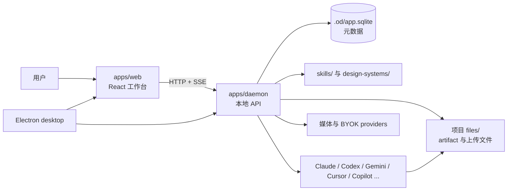
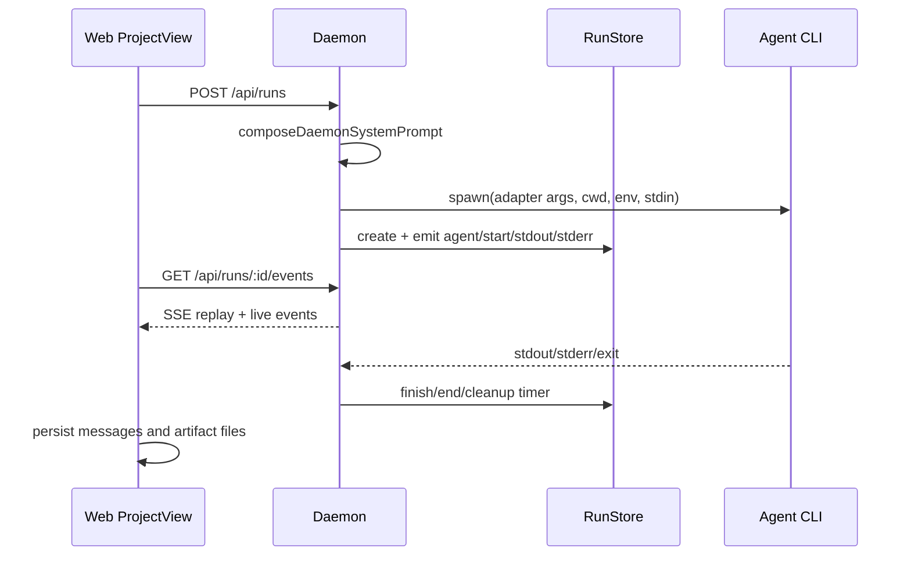
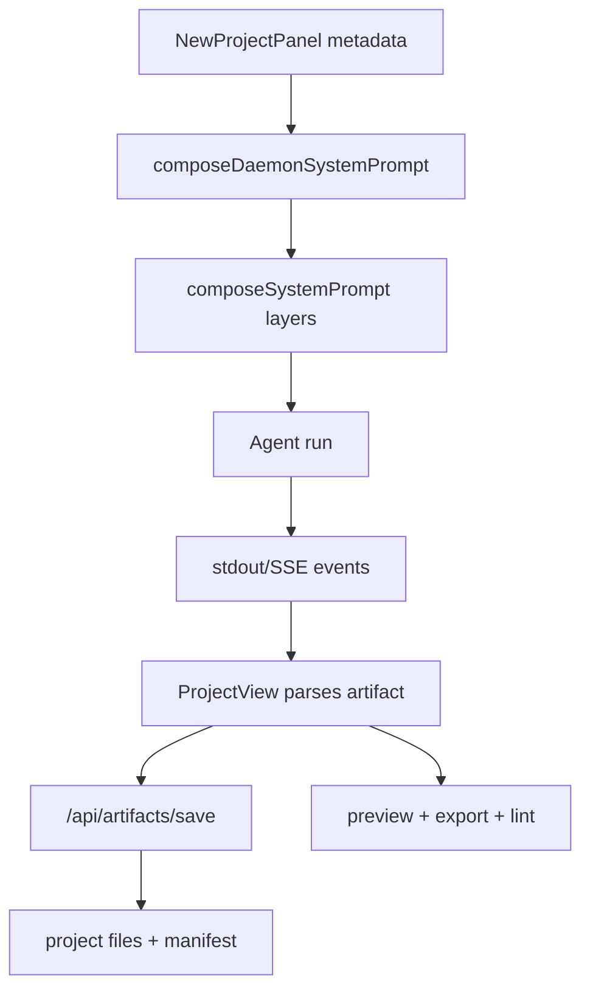
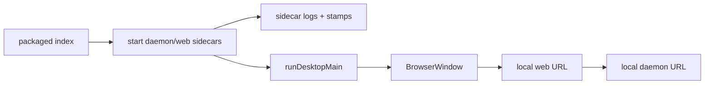

# Open Design Full Wiki

来源仓库：https://github.com/nexu-io/open-design
分析提交：`9d700ec74fc671af845d68af472f7c5c6e0fcfc9`

---

相关源文件

- [README.md](../../../project-repos/open-design/README.md) - 项目定位、核心特性、架构图、quickstart、仓库结构和路线图。
- [package.json](../../../project-repos/open-design/package.json) - 包元数据、CLI bin、脚本和引擎约束。
- [pnpm-workspace.yaml](../../../project-repos/open-design/pnpm-workspace.yaml) - workspace 包范围。
- [docs/architecture.md](../../../project-repos/open-design/docs/architecture.md) - 架构文档入口。

# 项目概览

Open Design 的核心定位是“本地优先的设计 agent 工作台”：用户在一个桌面/Web 界面里创建设计项目，选择 agent、skill、design system、模板或媒体模型，然后由本地 daemon 把请求转交给 Claude Code、Codex、Gemini、Cursor、Copilot 等 CLI。仓库 README 明确把它描述为开源、本地优先、带 12 个 CLI、skills 和 design systems 的系统，而不是只服务单一模型的聊天壳。[README.md:1-3](../../../project-repos/open-design/README.md)

## 它解决的对象

| 对象 | 在系统中的含义 | 主要来源 |
| --- | --- | --- |
| Project | 一个本地创作空间，包含对话、文件、artifact、preview comments、tabs 和 deployment 记录。 | `apps/daemon/src/db.ts`、`apps/daemon/src/projects.ts` |
| Agent | 运行在本机的代码/设计 agent CLI，由 daemon 检测并统一成 adapter。 | `apps/daemon/src/agents.ts` |
| Skill | 文件系统里的 `SKILL.md`，描述某类产物的工作流、触发器、资产和 OD 扩展字段。 | `docs/skills-protocol.md`、`apps/daemon/src/skills.ts` |
| Design System | `DESIGN.md` 文件，提供可注入 prompt 的颜色、字体、间距和组件规则。 | `apps/daemon/src/design-systems.ts` |
| Artifact | agent 输出的 HTML/媒体/文档文件及 `.artifact.json` manifest，供预览、导出和 lint。 | `apps/web/src/artifacts/manifest.ts` |
| Media Job | image/video/audio surface 通过 `od media generate` 分发给 provider 或 HyperFrames。 | `apps/daemon/src/media.ts` |

## 仓库形态

根 `package.json` 声明包名 `open-design`、`od` CLI bin 和 `tools-dev/tools-pack` 等脚本，同时约束 Node `~24.0.0`、pnpm `>=10.33.2 <11`。[package.json:1-25](../../../project-repos/open-design/package.json) [package.json:31-40](../../../project-repos/open-design/package.json) 这意味着它不是一个单包前端项目，而是一个 pnpm monorepo：Web app、daemon、desktop、packaged app、shared packages、tools、skills、design systems、docs、e2e 都在同一仓库维护。

README 的 “At a glance” 把系统能力压缩为几个维度：支持 12 个 agent CLI、BYOK 路径、skills、design systems、媒体生成、artifact 生命周期和桌面壳。[README.md:49-66](../../../project-repos/open-design/README.md) 这些维度正好对应后续页面的拆分：运行时、daemon API、Web 工作台、skills/design systems、媒体和打包发布。

## 创作闭环

Open Design 的主循环不是“用户输入 -> 模型回答”这么简单，而是一个受约束的设计流程。README 把关键机制概括为：先问结构化问题、用 TodoWrite 暴露计划、注入 seed/checklist、最后交付 artifact。[README.md:32-40](../../../project-repos/open-design/README.md) 源码中这条闭环落在三个地方：

1. Web 创建项目时收集 metadata、skill、design system、模板和媒体选项。
2. Daemon 组合 system prompt，把 discovery、官方设计 prompt、design system、craft、skill、metadata、deck/media 特殊契约按顺序注入。
3. Agent 运行产生事件流和 artifact，Web 解析、保存、预览并提供导出。

## 维护时的优先级

Open Design 的“事实来源”分布在代码和 Markdown 协议中。维护时应优先看运行代码，再回看文档说明：

- 路由和状态边界以 `apps/daemon/src/server.ts`、`db.ts`、`projects.ts` 为准。
- Agent 能力以 `apps/daemon/src/agents.ts` 的 adapter 列表和 `docs/agent-adapters.md` 的设计意图共同判断。
- Skill 字段以 `docs/skills-protocol.md` 解释，实际解析以 `apps/daemon/src/skills.ts` 为准。
- Web 的真实用户体验以 `apps/web/src/components/ProjectView.tsx`、`FileViewer.tsx`、`PreviewModal.tsx` 为准。
- 打包和开发生命周期以 `tools/dev/src/index.ts`、`apps/packaged/src/sidecars.ts` 为准。

## 相关页面

- [系统架构与拓扑](system-architecture.md)
- [Agent 适配器与运行链路](agent-runtime.md)
- [Skills、Design Systems 与 Craft 注入](skills-design-systems.md)

---

相关源文件

- [docs/architecture.md](../../../project-repos/open-design/docs/architecture.md) - 官方架构文档、拓扑、组件图、API 边界和部署说明。
- [apps/daemon/src/server.ts](../../../project-repos/open-design/apps/daemon/src/server.ts) - daemon 启动、HTTP API 和 agent run 编排。
- [apps/web/src/App.tsx](../../../project-repos/open-design/apps/web/src/App.tsx) - Web bootstrap 和顶层状态。
- [apps/desktop/src/main/runtime.ts](../../../project-repos/open-design/apps/desktop/src/main/runtime.ts) - Electron runtime 与 Web sidecar 连接。

# 系统架构与拓扑

Open Design 有三种运行拓扑：全本地 Web + daemon、桌面 app 内嵌 Web/daemon，以及静态/托管 Web 连接到用户本机 daemon。[docs/architecture.md:13-49](../../../project-repos/open-design/docs/architecture.md) 这三个拓扑共享同一套核心边界：Web 只负责体验和预览，daemon 负责文件系统、SQLite、agent spawn、模型代理和媒体 dispatch，agent CLI 负责真正生成或修改项目文件。

## 分层职责

| 层 | 责任 | 不应承担的责任 |
| --- | --- | --- |
| Web app | 项目入口、agent/skill/DS 选择、对话、运行事件展示、artifact 预览、导出、评论。 | 不直接访问任意本机路径，不直接 spawn agent。 |
| Daemon | 项目和文件边界、SQLite、API、run 生命周期、prompt 组合、agent adapter、BYOK proxy、media dispatcher。 | 不把 UI 状态写死，不直接承担 artifact 渲染体验。 |
| Agent CLI | 按注入的 prompt/skill/design system 修改项目文件并输出 artifact。 | 不负责持久化元数据，不绕过 daemon 写跨项目文件。 |
| Desktop/packaged | 管理 Web 与 daemon sidecar、窗口、IPC、平台打包和协议入口。 | 不重新实现业务 API。 |

架构文档中的组件图把 Web、daemon、SQLite、project files、agents、providers 和 deployment target 连在一起，强调本地 daemon 是能力汇聚点。[docs/architecture.md:53-95](../../../project-repos/open-design/docs/architecture.md)

## Daemon 是中枢

`startServer` 创建 Express app、设置 JSON 限制、打开 SQLite、预热 agent 检测，然后挂载健康检查、项目、skills、design systems、prompt templates、media、app-config、artifact、runs、proxy 等路由。[apps/daemon/src/server.ts:612-639](../../../project-repos/open-design/apps/daemon/src/server.ts) 这让 daemon 同时成为：

- 本地持久化层：`.od/app.sqlite` 存项目元数据，项目文件留在文件系统；`app-config.json` 存 onboarding、agent、模型、skill 和 design system 偏好。
- 能力注册层：扫描 skills/design systems/prompt templates。
- 运行编排层：组合 prompt、spawn agent、维护 run 事件。
- 安全边界层：限制项目路径、限制 raw/upload/delete、限制 BYOK proxy 目标。

## Web 是状态聚合器

Web 顶层 `App` 在启动阶段探测 daemon，随后加载 agents、skills、design systems、projects、templates、prompt templates 和版本信息。[apps/web/src/App.tsx:77-138](../../../project-repos/open-design/apps/web/src/App.tsx) 这说明 Web 没有内建静态能力表；它把 daemon 当前探测到的本机能力作为事实来源。这对本地优先体验很关键：安装或移除 agent CLI 后，UI 应跟随 daemon 探测结果变化。

## 三种部署的差别

架构文档描述的三种拓扑差异主要在“Web 从哪里来”和“daemon 如何被启动”：

| 拓扑 | Web 来源 | Daemon 来源 | 典型场景 |
| --- | --- | --- | --- |
| Local web + local daemon | 本地 Vite/静态 Web | 本地 Node daemon | 开发和高级用户本地运行。 |
| Desktop app | Electron 窗口加载本地 Web sidecar | packaged sidecar | 非工程用户安装 app。 |
| Hosted/static Web | 远端静态资源 | 用户本机 daemon | 轻量分发 UI，同时保留本机 agent 权限。 |

这种设计的代价是跨进程和跨 origin 的状态同步更复杂：Web 要处理 daemon 不可用、run 恢复、SSE 重连、文件预览 iframe sandbox、桌面 IPC 等情况。好处是 agent 执行和文件写入始终停留在用户本机。

## 相关页面

- [Daemon API、本地数据与安全边界](daemon-api.md)
- [Web 工作台、预览与导出](web-workspace.md)
- [Desktop、Sidecar 与本地生命周期](desktop-packaging-lifecycle.md)

---

相关源文件

- [docs/agent-adapters.md](../../../project-repos/open-design/docs/agent-adapters.md) - adapter 设计、能力探测、skill 注入策略和 fallback。
- [apps/daemon/src/agents.ts](../../../project-repos/open-design/apps/daemon/src/agents.ts) - agent adapter 定义、PATH 探测、模型探测和 spawn 参数。
- [apps/daemon/src/server.ts](../../../project-repos/open-design/apps/daemon/src/server.ts) - `startChatRun`、runs 路由和 legacy chat 路由。
- [apps/daemon/src/runs.ts](../../../project-repos/open-design/apps/daemon/src/runs.ts) - run store、事件保留、SSE replay、取消。
- [apps/web/src/providers/daemon.ts](../../../project-repos/open-design/apps/web/src/providers/daemon.ts) - 前端创建 run、消费 SSE、重连和事件翻译。

# Agent 适配器与运行链路

Open Design 把不同 CLI 统一成一套 adapter 模型。文档中给出的接口包括 `id/name/description/detect/buildArgs/parseEvent` 等能力，目标是让 Web 层不用理解每个 CLI 的参数和流格式。[docs/agent-adapters.md:15-64](../../../project-repos/open-design/docs/agent-adapters.md)

## Adapter 目录

`apps/daemon/src/agents.ts` 覆盖多个本地 agent：Claude、Codex、Devin ACP、Gemini、OpenCode、Hermes/Kimi、Cursor、Qwen、Copilot、Pi、Kiro 等。不同 adapter 的关键差异是命令名、参数、stdin/流式输出协议、是否支持 `--add-dir` 或模型枚举。[apps/daemon/src/agents.ts:115-565](../../../project-repos/open-design/apps/daemon/src/agents.ts)

| Agent | 典型执行方式 | 维护关注点 |
| --- | --- | --- |
| Claude | `-p`、stream-json、`--add-dir`、stdin | 支持额外允许目录和结构化事件。 |
| Codex | `codex exec --json --skip-git-repo-check --full-auto -C` | 参数更偏自动执行，需要 cwd 正确。 |
| Gemini/OpenCode/Cursor/Qwen/Copilot | 各自 CLI 参数和模型能力不同 | UI 只展示 daemon 探测到的可用能力。 |
| ACP 类 | 通过 ACP 会话通信 | 事件解析和取消行为不同。 |

可执行文件解析、模型缓存和 agent 探测集中在文件尾部：`resolveOnPath/executable`、`fetchModels`、`probe/detectAgents`、`getAgentDef` 等函数负责把本机环境转成 UI 可消费的 agent 列表。[apps/daemon/src/agents.ts:568-755](../../../project-repos/open-design/apps/daemon/src/agents.ts)

## Run 生命周期

运行链路从 Web 发起：前端调用 daemon 创建 run，然后订阅 `/api/runs/:id/events` 的 SSE。`streamViaDaemon` 创建 run 后消费事件流，并把 daemon 事件转换成 UI 消息、stdout/stderr、artifact 和终态。[apps/web/src/providers/daemon.ts:76-151](../../../project-repos/open-design/apps/web/src/providers/daemon.ts) [apps/web/src/providers/daemon.ts:182-338](../../../project-repos/open-design/apps/web/src/providers/daemon.ts)

Daemon 端的 `startChatRun` 做了真正的编排：校验 agent、解析项目 cwd、加载附件、组合 system prompt、设置允许目录、模型/reasoning/env，然后 spawn 子进程并把输出转成 run events。[apps/daemon/src/server.ts:2162-2493](../../../project-repos/open-design/apps/daemon/src/server.ts)

## 事件保留与恢复

`runs.ts` 把 run 的事件存在内存里，默认每个 run 最多保留 2000 条事件，结束后 30 分钟清理；SSE 支持 `Last-Event-ID` 或 `after` 参数重放，取消时会 kill 子进程。[apps/daemon/src/runs.ts:4-38](../../../project-repos/open-design/apps/daemon/src/runs.ts) [apps/daemon/src/runs.ts:97-130](../../../project-repos/open-design/apps/daemon/src/runs.ts) Web 的 ProjectView 也有 reattach 逻辑，用于页面刷新或切换后恢复仍可恢复的 run。[apps/web/src/components/ProjectView.tsx:510-708](../../../project-repos/open-design/apps/web/src/components/ProjectView.tsx)

这套设计的优点是简单且可调试：daemon 不需要持久化每条 stdout 事件，Web 可以在短时间内恢复运行状态。限制也很明确：进程重启会丢失内存中的 run event，长时间离线后只能回到已落盘的 messages/files/artifacts。

## Skill 注入与 agent 差异

Adapter 文档把 skill 注入分成多种策略：有的 CLI 支持直接传 system prompt，有的需要写入上下文或通过 stdin 注入。[docs/agent-adapters.md:98-121](../../../project-repos/open-design/docs/agent-adapters.md) Open Design 的做法是尽量在 daemon 侧合成一个完整 system prompt，然后用 adapter 能力传给对应 CLI；UI 则通过 agent 能力和 fallback 提示告诉用户当前 agent 是否适合当前模式。[docs/agent-adapters.md:238-267](../../../project-repos/open-design/docs/agent-adapters.md)

## 相关页面

- [Prompt 栈、发现表单与 Artifact 交付](prompt-artifact-flow.md)
- [Daemon API、本地数据与安全边界](daemon-api.md)

---

相关源文件

- [apps/daemon/src/server.ts](../../../project-repos/open-design/apps/daemon/src/server.ts) - daemon 路由主体。
- [apps/daemon/src/db.ts](../../../project-repos/open-design/apps/daemon/src/db.ts) - SQLite schema 和迁移。
- [apps/daemon/src/app-config.ts](../../../project-repos/open-design/apps/daemon/src/app-config.ts) - daemon 侧 app preferences 持久化、过滤和并发写入。
- [packages/contracts/src/api/app-config.ts](../../../project-repos/open-design/packages/contracts/src/api/app-config.ts) - Web/daemon 共享的 app-config API 类型。
- [apps/daemon/src/projects.ts](../../../project-repos/open-design/apps/daemon/src/projects.ts) - 项目文件读写、归档、路径校验。
- [apps/daemon/src/media.ts](../../../project-repos/open-design/apps/daemon/src/media.ts) - 媒体生成 dispatcher 和文件安全校验。

# Daemon API、本地数据与安全边界

Daemon 是 Open Design 的本机权限边界。它既提供业务 API，也把本地文件、SQLite、agent spawn、media provider、BYOK proxy 统一在一个进程里。因此维护 daemon 时，必须同时关注功能和路径/网络安全。

## API 面

`server.ts` 的路由覆盖多个资源域：

| 路由域 | 代表路由 | 职责 |
| --- | --- | --- |
| 健康与版本 | `/health`、版本信息 | Web 判断 daemon 是否可用。 |
| Projects | project list/create、conversation、messages、comments | 管理项目元数据和默认会话。 |
| Import | Claude Design ZIP import | 把外部设计项目导入本地结构。 |
| Agents/Skills/DS | `/api/agents`、`/api/skills`、`/api/design-systems` | 暴露本机能力和文件协议资产。 |
| Prompt templates | `/api/prompt-templates` | 图像/视频 prompt 模板目录。 |
| Artifacts/files | save/lint/archive/raw/upload/delete | 保存和读取项目文件。 |
| Runs | `/api/runs`、`/events`、cancel、legacy `/api/chat` | agent 运行生命周期。 |
| Media | media config/models/generate/wait | 图像、视频、音频生成。 |
| App config | `/api/app-config` | daemon 持久化 onboarding、agent、模型、skill 和 design system 偏好。 |
| BYOK proxy | Anthropic/OpenAI proxy | 使用用户 key 代理请求并做目标限制。 |

具体入口分布在 `server.ts`：agents/skills 在 1097-1122 行，design systems 和 prompt templates 在 1208-1241 行，artifact 和文件路由在 1347-1807 行，media/app-config 在 1822-2021 行，runs 路由在 2495-2536 行，BYOK proxy 在 2568-2763 行。[apps/daemon/src/server.ts:1097-1122](../../../project-repos/open-design/apps/daemon/src/server.ts) [apps/daemon/src/server.ts:1208-1241](../../../project-repos/open-design/apps/daemon/src/server.ts) [apps/daemon/src/server.ts:1347-1807](../../../project-repos/open-design/apps/daemon/src/server.ts) [apps/daemon/src/server.ts:1822-2021](../../../project-repos/open-design/apps/daemon/src/server.ts) [apps/daemon/src/server.ts:2495-2536](../../../project-repos/open-design/apps/daemon/src/server.ts)

## SQLite 只存元数据

`db.ts` 明确把 SQLite 用作 metadata store，项目文件仍保存在磁盘上。[apps/daemon/src/db.ts:1-7](../../../project-repos/open-design/apps/daemon/src/db.ts) `openDb` 在 `.od/app.sqlite` 下启用 WAL 和外键，然后执行迁移。[apps/daemon/src/db.ts:16-28](../../../project-repos/open-design/apps/daemon/src/db.ts) schema 覆盖 projects、templates、conversations、messages、preview_comments、tabs、deployments 等表，并通过后续列添加保持向前兼容。[apps/daemon/src/db.ts:38-183](../../../project-repos/open-design/apps/daemon/src/db.ts)

## App config 持久化

最新主线新增了 daemon-backed app preferences：Web 通过 `GET/PUT /api/app-config` 同步 onboarding、agent、per-agent model/reasoning、skill 和 design system 选择，daemon 把它们写入 `<dataDir>/app-config.json`，从而在浏览器 storage 清空或 origin 变化后保留启动配置。[apps/daemon/src/app-config.ts:1-8](../../../project-repos/open-design/apps/daemon/src/app-config.ts) 允许字段集中在 `ALLOWED_KEYS`，读写时会过滤未知键、验证 `agentModels` 形状，并用 per-dataDir 写锁串行化 read-modify-write。[apps/daemon/src/app-config.ts:27-97](../../../project-repos/open-design/apps/daemon/src/app-config.ts) [apps/daemon/src/app-config.ts:99-153](../../../project-repos/open-design/apps/daemon/src/app-config.ts)

HTTP 层对 app-config 做同源检查：`/api/app-config` 只接受本地同源或可信 Web port 的请求，跨 origin 会被拒绝。[apps/daemon/src/server.ts:1857-1883](../../../project-repos/open-design/apps/daemon/src/server.ts) 共享 contract 定义 `AppConfigPrefs` 和更新请求形状，避免 Web/daemon 字段漂移。[packages/contracts/src/api/app-config.ts:1-18](../../../project-repos/open-design/packages/contracts/src/api/app-config.ts)

这个边界有两个含义：

- 备份/迁移项目时不能只拿 SQLite，也要拿项目文件目录。
- Debug run 或 artifact 问题时，要同时看 DB message/tabs 和项目 files。

## 项目文件边界

`projects.ts` 用 `projectDir`、`listProjectFiles`、`readProjectFile`、`writeProjectFile`、`resolveSafe`、`validateProjectPath` 等函数把文件操作限制在 project root 内。[apps/daemon/src/projects.ts:21-39](../../../project-repos/open-design/apps/daemon/src/projects.ts) [apps/daemon/src/projects.ts:162-223](../../../project-repos/open-design/apps/daemon/src/projects.ts) [apps/daemon/src/projects.ts:258-285](../../../project-repos/open-design/apps/daemon/src/projects.ts) 打包归档时会排除 dotfiles 和 `.artifact.json`。[apps/daemon/src/projects.ts:75-137](../../../project-repos/open-design/apps/daemon/src/projects.ts)

需要特别注意：源码中存在项目目录删除/文件删除实现，但本次 DeepWiki 生成没有执行任何删除命令。维护该区域时应把“用户项目文件是否可被 agent 或 API 意外删改”作为风险点单独测试。

## BYOK proxy 与 SSRF 边界

Daemon 末尾实现了 Anthropic/OpenAI BYOK proxy，并有目标地址防护：阻断 localhost、link-local 和 RFC1918 私网地址。[apps/daemon/src/server.ts:2568-2763](../../../project-repos/open-design/apps/daemon/src/server.ts) 这很关键，因为 Web UI 和 agent 都可能触发网络请求；如果 proxy 允许任意 URL，会把用户本机网络暴露给远端内容或 prompt 注入。

## Media 文件安全

`media.ts` 也有路径和类型边界：生成结果必须落在项目 image/video/audio 路径规则内，扩展名受白名单限制，provider/stub 路径由 config 控制。[apps/daemon/src/media.ts:1-38](../../../project-repos/open-design/apps/daemon/src/media.ts) [apps/daemon/src/media.ts:93-156](../../../project-repos/open-design/apps/daemon/src/media.ts) [apps/daemon/src/media.ts:192-260](../../../project-repos/open-design/apps/daemon/src/media.ts)

## 维护检查表

- 新增路由时先确认 project id、path、body size 和 content-type 限制。
- 新增文件写入时复用 `resolveSafe`/`validateProjectPath`，不要手写路径拼接。
- 新增 provider/proxy 时显式写出允许的 host、scheme、超时和错误透传策略。
- 改 run 事件时同时更新 daemon event schema 和 Web provider 翻译逻辑。

## 相关页面

- [Agent 适配器与运行链路](agent-runtime.md)
- [图像、视频、音频生成与模板库](media-generation.md)

---

相关源文件

- [apps/web/src/App.tsx](../../../project-repos/open-design/apps/web/src/App.tsx) - Web app bootstrap、配置和主视图切换。
- [apps/web/src/state/config.ts](../../../project-repos/open-design/apps/web/src/state/config.ts) - localStorage 配置、daemon config 同步、媒体 provider 同步和迁移。
- [apps/web/src/types.ts](../../../project-repos/open-design/apps/web/src/types.ts) - AppConfig、agentModels、onboarding 等前端类型。
- [apps/web/src/components/ProjectView.tsx](../../../project-repos/open-design/apps/web/src/components/ProjectView.tsx) - 项目对话、run、artifact、文件和评论主流程。
- [apps/web/src/components/FileWorkspace.tsx](../../../project-repos/open-design/apps/web/src/components/FileWorkspace.tsx) - 文件树、上传、打开和删除 UI。
- [apps/web/src/runtime/srcdoc.ts](../../../project-repos/open-design/apps/web/src/runtime/srcdoc.ts) - iframe srcdoc 包装、storage shim、评论桥和 deck bridge。
- [apps/web/src/artifacts/manifest.ts](../../../project-repos/open-design/apps/web/src/artifacts/manifest.ts) - artifact manifest 推断和验证。
- [apps/web/src/runtime/exports.ts](../../../project-repos/open-design/apps/web/src/runtime/exports.ts) - HTML/ZIP/Markdown/PDF/PPTX 导出。

# Web 工作台、预览与导出

Web 工作台是用户看到的 Open Design。它不直接读写任意本机资源，而是围绕 daemon API 聚合项目、agent、skills、design systems、prompt templates 和 artifact 状态。

## Bootstrap

`App.tsx` 的顶层 state 包含 config、daemon 状态、agents、skills、design systems、projects、templates 和 prompt templates。[apps/web/src/App.tsx:49-64](../../../project-repos/open-design/apps/web/src/App.tsx) 启动后它探测 daemon，加载 agents/skills/design systems/projects/templates/prompt templates/version，并同时读取 daemon app-config；daemon 侧配置会覆盖 onboarding、agent、skill、design system 和 per-agent model 偏好，然后再写回本地与 daemon 保持同步。[apps/web/src/App.tsx:86-188](../../../project-repos/open-design/apps/web/src/App.tsx) 项目创建、ZIP import、配置保存和媒体 provider 同步也在顶层协调。[apps/web/src/App.tsx:228-285](../../../project-repos/open-design/apps/web/src/App.tsx)

最终渲染会在 `ProjectView` 和 `EntryView` 之间切换，并挂载 settings、pet overlay 等应用级 UI。[apps/web/src/App.tsx:398-470](../../../project-repos/open-design/apps/web/src/App.tsx)

## 配置同步

`state/config.ts` 仍以 localStorage 保存完整 `AppConfig`，但新增 `fetchDaemonConfig` 和 `syncConfigToDaemon`，只把 onboarding、agentId、agentModels、skillId、designSystemId 这些非敏感偏好同步到 daemon。[apps/web/src/state/config.ts:219-276](../../../project-repos/open-design/apps/web/src/state/config.ts) `AppConfig` 类型中也显式记录 per-CLI model picker 状态，老配置没有该字段时回落到 agent 默认模型。[apps/web/src/types.ts:140-155](../../../project-repos/open-design/apps/web/src/types.ts)

## 项目视图

`ProjectView` 是创作主链路。它维护 conversations、messages、comments、artifact、files、tabs、run refs 等状态。[apps/web/src/components/ProjectView.tsx:95-163](../../../project-repos/open-design/apps/web/src/components/ProjectView.tsx) 页面加载时拉取会话、消息和评论；发送消息时准备附件、metadata、agent 参数并落库；streaming 期间解析 daemon 事件并持久化 agent 产出的文件。[apps/web/src/components/ProjectView.tsx:164-217](../../../project-repos/open-design/apps/web/src/components/ProjectView.tsx) [apps/web/src/components/ProjectView.tsx:710-999](../../../project-repos/open-design/apps/web/src/components/ProjectView.tsx)

当 agent 产出 artifact 时，前端会解析、更新 live artifact，并在保存文件时处理文件名冲突。[apps/web/src/components/ProjectView.tsx:782-859](../../../project-repos/open-design/apps/web/src/components/ProjectView.tsx) [apps/web/src/components/ProjectView.tsx:1019-1035](../../../project-repos/open-design/apps/web/src/components/ProjectView.tsx)

## 预览 iframe

`srcdoc.ts` 负责把 HTML fragment 或完整 document 包成 iframe 可执行的 srcdoc，同时注入 base、sandbox shim、deck bridge 和 comment bridge。[apps/web/src/runtime/srcdoc.ts:1-37](../../../project-repos/open-design/apps/web/src/runtime/srcdoc.ts) 其中 storage shim 让 sandbox iframe 里的 localStorage/sessionStorage 调用不会破坏预览；comment bridge 用 postMessage 提取点击目标；deck bridge 支持滚动式和 class visibility 式 deck。[apps/web/src/runtime/srcdoc.ts:59-205](../../../project-repos/open-design/apps/web/src/runtime/srcdoc.ts)

这个设计把“预览能运行”和“不能越权访问父页面”分开处理：iframe 允许脚本执行，但通过 srcdoc 包装和 bridge 控制交互面。

## Artifact manifest 与导出

`manifest.ts` 定义 artifact 版本、允许的 kind/renderer/export/status，并提供 HTML artifact manifest 创建、解析、校验和 legacy 推断。[apps/web/src/artifacts/manifest.ts:9-42](../../../project-repos/open-design/apps/web/src/artifacts/manifest.ts) [apps/web/src/artifacts/manifest.ts:72-183](../../../project-repos/open-design/apps/web/src/artifacts/manifest.ts)

`exports.ts` 负责导出模型：PDF/HTML/ZIP/Markdown 在浏览器侧处理，PPTX 走 server-side 或桌面能力。[apps/web/src/runtime/exports.ts:1-13](../../../project-repos/open-design/apps/web/src/runtime/exports.ts) HTML/ZIP/MD、项目 zip fallback 和 PDF 打印链路分别在对应函数中实现。[apps/web/src/runtime/exports.ts:40-67](../../../project-repos/open-design/apps/web/src/runtime/exports.ts) [apps/web/src/runtime/exports.ts:102-129](../../../project-repos/open-design/apps/web/src/runtime/exports.ts) [apps/web/src/runtime/exports.ts:161-205](../../../project-repos/open-design/apps/web/src/runtime/exports.ts)

## 文件工作区

`FileWorkspace` 展示项目文件、处理打开请求、上传文件和删除文件。[apps/web/src/components/FileWorkspace.tsx:43-68](../../../project-repos/open-design/apps/web/src/components/FileWorkspace.tsx) [apps/web/src/components/FileWorkspace.tsx:151-232](../../../project-repos/open-design/apps/web/src/components/FileWorkspace.tsx) 对用户来说它是项目文件的可见面；对系统来说它必须和 daemon 的路径校验保持一致。

## 相关页面

- [Prompt 栈、发现表单与 Artifact 交付](prompt-artifact-flow.md)
- [Daemon API、本地数据与安全边界](daemon-api.md)

---

相关源文件

- [README.md](../../../project-repos/open-design/README.md) - skills、design systems、visual directions 和设计系统目录说明。
- [docs/skills-protocol.md](../../../project-repos/open-design/docs/skills-protocol.md) - `SKILL.md` 基础格式和 OD 扩展协议。
- [docs/modes.md](../../../project-repos/open-design/docs/modes.md) - prototype/deck/template/design-system 四类模式。
- [apps/daemon/src/skills.ts](../../../project-repos/open-design/apps/daemon/src/skills.ts) - skill 扫描、frontmatter 字段解析、mode/surface/scenario 推断。
- [apps/daemon/src/design-systems.ts](../../../project-repos/open-design/apps/daemon/src/design-systems.ts) - `DESIGN.md` 扫描与 swatch 提取。
- [apps/daemon/src/prompts/system.ts](../../../project-repos/open-design/apps/daemon/src/prompts/system.ts) - design system、craft、skill 和 metadata 的 prompt 注入顺序。

# Skills、Design Systems 与 Craft 注入

Open Design 的可扩展性主要来自文件协议，而不是数据库配置。`SKILL.md` 定义工作流，`DESIGN.md` 定义品牌/视觉规则，craft references 定义跨品牌的执行约束。Daemon 扫描这些文件后，把它们组合进 agent 的 system prompt。

## Skill 协议

`docs/skills-protocol.md` 把 skill 定义成兼容 Codex/Claude 风格的 Markdown 文件，并在 frontmatter 中添加 OD 扩展。[docs/skills-protocol.md:1-11](../../../project-repos/open-design/docs/skills-protocol.md) 基础格式包含名称、描述、触发器和正文；OD 扩展在 `od:` 下声明 mode、surface、craft、platform、scenario、preview、designSystemRequired、defaultFor 等字段。[docs/skills-protocol.md:15-105](../../../project-repos/open-design/docs/skills-protocol.md)

当没有 `od:` 字段时，文档定义了默认推断策略；发现优先级则覆盖内置、项目、本地等来源。[docs/skills-protocol.md:107-146](../../../project-repos/open-design/docs/skills-protocol.md) 模式文档把 prototype、deck、template、design-system 四种主模式分别展开，说明每种模式期待的 artifact 和 UI 行为。[docs/modes.md:1-220](../../../project-repos/open-design/docs/modes.md)

## 实际解析

`apps/daemon/src/skills.ts` 会重新扫描项目 skills，并解析 id、name、description、triggers、mode、surface、craft、platform、scenario、preview、designSystemRequired、defaultFor、upstream、featured、fidelity、speakerNotes、animations、examplePrompt、body、dir 等字段。[apps/daemon/src/skills.ts:1-67](../../../project-repos/open-design/apps/daemon/src/skills.ts) 文件中还有 side-file preamble、craft requires 归一化、mode/surface/platform/scenario 推断等逻辑。[apps/daemon/src/skills.ts:69-120](../../../project-repos/open-design/apps/daemon/src/skills.ts) [apps/daemon/src/skills.ts:178-249](../../../project-repos/open-design/apps/daemon/src/skills.ts)

因此维护 skill 时要同时看两层：协议文档告诉你字段语义，`skills.ts` 告诉你 UI 和 daemon 实际会读到什么。

## Design System 解析

`apps/daemon/src/design-systems.ts` 扫描 `design-systems/*/DESIGN.md`，返回 title、category、summary、swatches、surface、body 等字段。[apps/daemon/src/design-systems.ts:1-40](../../../project-repos/open-design/apps/daemon/src/design-systems.ts) 它还提供单个 design system 读取、summary/category/surface 推断和颜色 swatch 提取。[apps/daemon/src/design-systems.ts:43-167](../../../project-repos/open-design/apps/daemon/src/design-systems.ts)

README 把 design systems 作为目录资产列出，并记录 catalog/provenance；visual directions 则提供无品牌输入时的默认视觉分支。[README.md:442-487](../../../project-repos/open-design/README.md)

## Prompt 注入顺序

`composeSystemPrompt` 的注释直接说明了 prompt 栈：discovery/philosophy、官方设计 prompt、active design system、craft references、active skill、metadata、deck framework、media contract。[apps/daemon/src/prompts/system.ts:1-31](../../../project-repos/open-design/apps/daemon/src/prompts/system.ts) 实现中 design system 先于 craft，craft 先于 skill；deck framework 在 deck 项目且无 skill seed 时最后注入；media surface 则追加 media contract。[apps/daemon/src/prompts/system.ts:109-190](../../../project-repos/open-design/apps/daemon/src/prompts/system.ts)

这个顺序非常重要：

1. Discovery 规则先压住通用设计 prompt，确保先问表单。
2. Design system 作为品牌 token 的权威来源。
3. Craft 作为跨品牌的执行规则，但 token 冲突时让品牌胜出。
4. Skill 提供当前产物类型的具体工作流和 seed/checklist。
5. Deck/media 特殊契约最后覆盖更泛化的 HTML artifact 指令。

## 本次技能镜像

源仓库包含 55 个 tracked `SKILL.md`（54 个在 `skills/` 下，1 个在 `docs/examples/saas-landing-skill/` 下）。本 DeepWiki 在 `skills/**/SKILL.md` 下生成中文镜像，保留命令、路径、代码块、frontmatter 键和协议字段，便于中文读者浏览技能库。

## 相关页面

- [Prompt 栈、发现表单与 Artifact 交付](prompt-artifact-flow.md)
- [Web 工作台、预览与导出](web-workspace.md)

---

相关源文件

- [apps/daemon/src/prompts/system.ts](../../../project-repos/open-design/apps/daemon/src/prompts/system.ts) - prompt 组合器。
- [apps/daemon/src/prompts/discovery.ts](../../../project-repos/open-design/apps/daemon/src/prompts/discovery.ts) - discovery form、direction picker、TodoWrite 和 critique 规则。
- [apps/daemon/src/server.ts](../../../project-repos/open-design/apps/daemon/src/server.ts) - `composeDaemonSystemPrompt`、artifact save/lint、run 启动。
- [apps/web/src/components/NewProjectPanel.tsx](../../../project-repos/open-design/apps/web/src/components/NewProjectPanel.tsx) - 新建项目 metadata、skill、design system、媒体选项。
- [apps/web/src/components/ProjectView.tsx](../../../project-repos/open-design/apps/web/src/components/ProjectView.tsx) - 发送消息、解析 artifact、保存文件。

# Prompt 栈、发现表单与 Artifact 交付

Open Design 的 prompt 不是一段固定系统词，而是由 daemon 按项目上下文组合出来的分层契约。它的目标是降低“模型自由发挥”的不确定性：先问清楚，再用方向/品牌/skill/checklist 限制输出，最后以 artifact 文件作为交付边界。

## Discovery 优先

`discovery.ts` 把新设计任务拆成三步：第 1 轮必须输出 `<question-form id="discovery">`，第 2 轮根据 brand 答案决定是否走 direction picker 或 brand-spec extraction，第 3 轮开始 TodoWrite、执行、检查和 artifact 输出。[apps/daemon/src/prompts/discovery.ts:10-23](../../../project-repos/open-design/apps/daemon/src/prompts/discovery.ts) 表单字段包括产物类型、主平台、受众、视觉调性、品牌上下文、规模和约束，并要求 JSON 有效、问题少而具体。[apps/daemon/src/prompts/discovery.ts:34-79](../../../project-repos/open-design/apps/daemon/src/prompts/discovery.ts)

这解释了 README 中强调的问题表单：它不是 UI 装饰，而是 prompt 协议的一部分。[README.md:32-40](../../../project-repos/open-design/README.md)

## Prompt 分层

`composeSystemPrompt` 的主体按顺序追加 discovery、官方设计 prompt、design system、craft、skill、metadata、deck framework 和 media contract。[apps/daemon/src/prompts/system.ts:109-190](../../../project-repos/open-design/apps/daemon/src/prompts/system.ts) metadata 渲染会把新建项目面板收集到的 kind、fidelity、speakerNotes、animations、template、image/video/audio 选项变成 agent 可读的上下文；未知字段会要求 agent 在 discovery form 里追问。[apps/daemon/src/prompts/system.ts:193-240](../../../project-repos/open-design/apps/daemon/src/prompts/system.ts)

Daemon 侧还有 `composeDaemonSystemPrompt`，负责读取 active skill、craft、design system、template 后调用 prompt composer。[apps/daemon/src/server.ts:2089-2160](../../../project-repos/open-design/apps/daemon/src/server.ts)

## 新建项目 metadata

`NewProjectPanel` 的状态覆盖 tab、design system、metadata、media models、prompt templates 等。[apps/web/src/components/NewProjectPanel.tsx:73-124](../../../project-repos/open-design/apps/web/src/components/NewProjectPanel.tsx) 它会根据当前 tab 决定是否显示 design system picker，按 tab 过滤 skill，并在创建时把 metadata 组装进项目。[apps/web/src/components/NewProjectPanel.tsx:125-175](../../../project-repos/open-design/apps/web/src/components/NewProjectPanel.tsx) [apps/web/src/components/NewProjectPanel.tsx:220-259](../../../project-repos/open-design/apps/web/src/components/NewProjectPanel.tsx)

这条链路意味着：Web 的创建表单不是只影响 UI 初始状态，它会改变 daemon 注入给 agent 的 prompt 内容。

## Artifact 保存与 lint

Agent 输出后，ProjectView 会解析 artifact 并更新 live artifact；随后通过 daemon 保存为项目文件，并处理文件名冲突。[apps/web/src/components/ProjectView.tsx:782-859](../../../project-repos/open-design/apps/web/src/components/ProjectView.tsx) [apps/web/src/components/ProjectView.tsx:1019-1035](../../../project-repos/open-design/apps/web/src/components/ProjectView.tsx) Daemon 则提供 `/api/artifacts/save` 和 `/api/artifacts/lint`，分别负责文件落盘和产物检查。[apps/daemon/src/server.ts:1361-1387](../../../project-repos/open-design/apps/daemon/src/server.ts)

## 风险点

- 新增 metadata 字段时，需要同时更新 `NewProjectPanel`、prompt composer 和 agent 预期行为。
- 修改 artifact 语法或 manifest 时，需要同时更新解析、保存、预览、导出、lint。
- 修改 discovery 规则时，要验证新建项目第一轮、已有项目 tweak、media surface 和 deck surface 是否仍能按预期跳转。

## 相关页面

- [Skills、Design Systems 与 Craft 注入](skills-design-systems.md)
- [Web 工作台、预览与导出](web-workspace.md)

---

相关源文件

- [README.md](../../../project-repos/open-design/README.md) - media generation、prompt gallery、HyperFrames 说明。
- [apps/daemon/src/media.ts](../../../project-repos/open-design/apps/daemon/src/media.ts) - provider dispatcher、路径校验和生成逻辑。
- [apps/daemon/src/media-models.ts](../../../project-repos/open-design/apps/daemon/src/media-models.ts) - image/video/audio 模型表。
- [apps/daemon/src/prompt-templates.ts](../../../project-repos/open-design/apps/daemon/src/prompt-templates.ts) - prompt template 扫描和验证。
- [apps/daemon/src/prompts/media-contract.ts](../../../project-repos/open-design/apps/daemon/src/prompts/media-contract.ts) - media surface 的 agent 执行契约。
- [apps/daemon/src/server.ts](../../../project-repos/open-design/apps/daemon/src/server.ts) - media config/models/generate/wait 路由。

# 图像、视频、音频生成与模板库

Open Design 把媒体生成视为非 HTML surface：agent 不应该在 `<artifact>` 里伪造二进制内容，而是通过 daemon 的 media dispatcher 写入真实文件。README 也把 media generation、prompt gallery 和 HyperFrames 列为项目的核心扩展能力。[README.md:489-560](../../../project-repos/open-design/README.md)

## Dispatcher 模型

`media.ts` 顶部说明了 dispatcher contract：支持 openai、volcengine、grok 等 provider，同时对 stub 路径做 gating。[apps/daemon/src/media.ts:1-38](../../../project-repos/open-design/apps/daemon/src/media.ts) 默认值和 stub 开关在 62-90 行；项目 image 路径和扩展名校验在 93-156 行；`generateMedia` 会校验 surface/model/options 并分发到允许模型。[apps/daemon/src/media.ts:62-156](../../../project-repos/open-design/apps/daemon/src/media.ts) [apps/daemon/src/media.ts:192-260](../../../project-repos/open-design/apps/daemon/src/media.ts)

Daemon 的 media routes 提供模型/config/generate/wait 等接口，和 Web 创建项目时选择的 image/video/audio metadata 对接。[apps/daemon/src/server.ts:1822-2021](../../../project-repos/open-design/apps/daemon/src/server.ts)

## Prompt Templates

`prompt-templates.ts` 扫描 `prompt-templates/{image,video}` 并保留 source attribution。[apps/daemon/src/prompt-templates.ts:1-9](../../../project-repos/open-design/apps/daemon/src/prompt-templates.ts) 列表、读取和字段校验分别处理 title、summary、category、tags、model、aspect、source 等信息。[apps/daemon/src/prompt-templates.ts:14-107](../../../project-repos/open-design/apps/daemon/src/prompt-templates.ts)

这让媒体项目可以从模板开始，而不是只靠用户一句自然语言 prompt。模板信息也会进入 project metadata，再被 prompt composer 注入给 agent。[apps/daemon/src/prompts/system.ts:224-240](../../../project-repos/open-design/apps/daemon/src/prompts/system.ts)

## Media Contract

`media-contract.ts` 明确把 media surface 的唯一执行路径定义为 `od media generate`，并说明 daemon 会写入文件、FileViewer 自动拾取，agent 只负责 prompt 和叙述。[apps/daemon/src/prompts/media-contract.ts:1-20](../../../project-repos/open-design/apps/daemon/src/prompts/media-contract.ts) 契约还说明了 daemon 注入的 `OD_BIN`、`OD_PROJECT_ID`、`OD_PROJECT_DIR`、`OD_DAEMON_URL` 环境变量，以及命令参数和返回 JSON。[apps/daemon/src/prompts/media-contract.ts:58-103](../../../project-repos/open-design/apps/daemon/src/prompts/media-contract.ts)

对于长任务，generate 可能快速返回 `{taskId}`，随后 agent 通过 `od media wait` 循环长轮询，直到 done/failed/running 终态。[apps/daemon/src/prompts/media-contract.ts:180-219](../../../project-repos/open-design/apps/daemon/src/prompts/media-contract.ts)

## HyperFrames 特例

Media contract 对 `hyperframes-html` 做了 carve-out：composition HTML 由 agent 编写，但 Chrome-bound render 在 daemon 进程执行，以避免某些 agent shell sandbox 下的 Chrome 子进程问题。[apps/daemon/src/prompts/media-contract.ts:116-171](../../../project-repos/open-design/apps/daemon/src/prompts/media-contract.ts) 这也是为什么媒体链路同时需要 agent、daemon 和项目文件目录三方协同。

## 相关页面

- [Prompt 栈、发现表单与 Artifact 交付](prompt-artifact-flow.md)
- [Daemon API、本地数据与安全边界](daemon-api.md)

---

相关源文件

- [apps/desktop/src/main/index.ts](../../../project-repos/open-design/apps/desktop/src/main/index.ts) - Electron main 入口和 IPC handler。
- [apps/desktop/src/main/runtime.ts](../../../project-repos/open-design/apps/desktop/src/main/runtime.ts) - BrowserWindow、Web runtime 轮询、PPTX 保存。
- [apps/packaged/src/index.ts](../../../project-repos/open-design/apps/packaged/src/index.ts) - packaged app 启动、config/stamp、sidecar 和 protocol。
- [apps/packaged/src/sidecars.ts](../../../project-repos/open-design/apps/packaged/src/sidecars.ts) - daemon/web sidecar spawn、日志和健康等待。
- [tools/dev/src/index.ts](../../../project-repos/open-design/tools/dev/src/index.ts) - 本地开发生命周期 CLI。

# Desktop、Sidecar 与本地生命周期

Open Design 的桌面形态不是单独的一套业务实现，而是把 Web app 和 daemon 作为 sidecar 管起来，再用 Electron 提供窗口、IPC 和平台能力。

## Electron runtime

`apps/desktop/src/main/index.ts` 的 `runDesktopMain` 会创建 desktop runtime，并注册 JSON IPC handler，用于 STATUS、EVAL、SCREENSHOT、CONSOLE、CLICK、SHUTDOWN 等操作。[apps/desktop/src/main/index.ts:81-139](../../../project-repos/open-design/apps/desktop/src/main/index.ts) `runtime.ts` 创建 BrowserWindow 时启用 sandbox、contextIsolation，并关闭 nodeIntegration；窗口会轮询 web URL 直到可用。[apps/desktop/src/main/runtime.ts:207-260](../../../project-repos/open-design/apps/desktop/src/main/runtime.ts)

PPTX save-as 等桌面专属能力也留在 runtime 侧，而不是塞进 Web 浏览器环境。[apps/desktop/src/main/runtime.ts:183-204](../../../project-repos/open-design/apps/desktop/src/main/runtime.ts)

## Packaged sidecars

`apps/packaged/src/index.ts` 读取 packaged config 和 stamp，解析路径，启动 sidecars，注册协议，然后进入 desktop main。[apps/packaged/src/index.ts:59-99](../../../project-repos/open-design/apps/packaged/src/index.ts) `sidecars.ts` 中的 spawn 逻辑负责设置 stamps、日志、env 和子进程生命周期；后续函数启动 packaged daemon/web sidecars 并等待健康状态。[apps/packaged/src/sidecars.ts:133-184](../../../project-repos/open-design/apps/packaged/src/sidecars.ts) [apps/packaged/src/sidecars.ts:200-260](../../../project-repos/open-design/apps/packaged/src/sidecars.ts)

## tools-dev 生命周期

`tools/dev/src/index.ts` 是开发期入口。它包含平台判断、foreground 输出、logged command、sidecar runtime/daemon/web spawn、desktop build、node_modules symlink 和 web runtime 启动等逻辑。[tools/dev/src/index.ts:1-32](../../../project-repos/open-design/tools/dev/src/index.ts) [tools/dev/src/index.ts:247-267](../../../project-repos/open-design/tools/dev/src/index.ts) [tools/dev/src/index.ts:382-506](../../../project-repos/open-design/tools/dev/src/index.ts)

命令层支持 start/status/stop/restart/logs/inspect/check 等操作，用来把多进程开发环境压成一个 CLI。[tools/dev/src/index.ts:907-975](../../../project-repos/open-design/tools/dev/src/index.ts)

## 维护边界

- Desktop 只应承载平台能力和窗口/IPC，不要复制 daemon 业务逻辑。
- Sidecar 健康检查和日志路径是排查 packaged app 问题的第一入口。
- `tools-dev` 修改通常会影响本地开发、CI prebuild 和 release 打包，应联动验证。
- 任何对子进程 env、端口、cwd 的修改，都要同时检查 Web bootstrap 和 daemon URL 配置。

## 相关页面

- [系统架构与拓扑](system-architecture.md)
- [测试、CI、发布与运维边界](testing-release-ops.md)

---

相关源文件

- [package.json](../../../project-repos/open-design/package.json) - 根脚本、CLI bin 和引擎约束。
- [e2e/package.json](../../../project-repos/open-design/e2e/package.json) - E2E/test 脚本。
- [e2e/specs/app.spec.ts](../../../project-repos/open-design/e2e/specs/app.spec.ts) - Playwright/Vitest 场景和 mock run。
- [apps/daemon/tests/app-config.test.ts](../../../project-repos/open-design/apps/daemon/tests/app-config.test.ts) - app-config 读写过滤、并发语义和同源保护测试。
- [.github/workflows/ci.yml](../../../project-repos/open-design/.github/workflows/ci.yml) - CI 验证流程。
- [.github/workflows/release-stable.yml](../../../project-repos/open-design/.github/workflows/release-stable.yml) - 稳定版手动发布。
- [.github/workflows/release-beta.yml](../../../project-repos/open-design/.github/workflows/release-beta.yml) - beta 手动发布。

# 测试、CI、发布与运维边界

Open Design 的质量边界覆盖 TypeScript 类型、monorepo 构建、E2E mock、sidecar prebuild 和平台打包。它的测试不是只跑一个前端命令，因为 daemon、desktop、packaged 和 web 都会影响最终体验。

## 根脚本

根 `package.json` 定义 `od` CLI bin、`tools-dev`、`tools-pack`、build、test、typecheck、lint/residual 等脚本。[package.json:9-25](../../../project-repos/open-design/package.json) Node/pnpm 引擎约束也在根包里，CI 和本地开发都应遵守。[package.json:31-40](../../../project-repos/open-design/package.json)

## E2E 覆盖

`e2e/package.json` 提供 vitest、typecheck、Playwright 和 live adapter test 等脚本。[e2e/package.json:6-12](../../../project-repos/open-design/e2e/package.json) `e2e/specs/app.spec.ts` 通过 localStorage mock、agents mock 和 run artifact SSE mock 覆盖入口流、问题表单限制和 artifact 交付。[e2e/specs/app.spec.ts:5-43](../../../project-repos/open-design/e2e/specs/app.spec.ts) [e2e/specs/app.spec.ts:93-174](../../../project-repos/open-design/e2e/specs/app.spec.ts) [e2e/specs/app.spec.ts:231-260](../../../project-repos/open-design/e2e/specs/app.spec.ts)

## App config 测试

最新主线增加了 app-config 单元测试，覆盖缺失/损坏 JSON、未知键过滤、无效字段过滤、合并与清空、agentModels 校验，以及 corrupted existing file 的写入恢复。[apps/daemon/tests/app-config.test.ts:30-187](../../../project-repos/open-design/apps/daemon/tests/app-config.test.ts) HTTP guard 测试则验证无 Origin 的同源请求、可信 Web port、恶意 Origin 和错误 Host 的通过/拒绝行为。[apps/daemon/tests/app-config.test.ts:219-354](../../../project-repos/open-design/apps/daemon/tests/app-config.test.ts)

## CI

`.github/workflows/ci.yml` 的 validate job 会设置 pnpm/Node、安装依赖、prebuild daemon/desktop/web sidecar，然后执行 typecheck、residual、test 和 build。[.github/workflows/ci.yml:27-87](../../../project-repos/open-design/.github/workflows/ci.yml)

这说明 PR 不能只验证 Web 编译；daemon 和 desktop sidecar 预构建也是主线质量门。

## 发布

稳定版发布是手动 workflow，支持 `mac_signed` 输入，先生成 metadata，再做 verify，然后构建 mac 和 Windows 包。[.github/workflows/release-stable.yml:1-100](../../../project-repos/open-design/.github/workflows/release-stable.yml) beta 发布也走手动 workflow，metadata 和 mac/win beta 构建分开。[.github/workflows/release-beta.yml:1-168](../../../project-repos/open-design/.github/workflows/release-beta.yml)

发布 workflow 中的注释显示某些测试会因 i18n drift 等原因被策略性跳过或分层处理，因此判断发布质量时要看 workflow 的真实步骤，而不是只看 package scripts。

## 运维排查顺序

| 症状 | 优先检查 |
| --- | --- |
| Web 打不开 daemon | daemon `/health`、Web bootstrap 配置、sidecar logs。 |
| Agent 不出现 | `apps/daemon/src/agents.ts` 探测、PATH、模型缓存、adapter detect。 |
| Run 中断或 UI 不恢复 | run store TTL、SSE replay、ProjectView reattach。 |
| Artifact 不能预览 | manifest 解析、srcdoc sandbox、FileViewer/PreviewModal。 |
| 桌面包启动失败 | packaged sidecar stamp/log、BrowserWindow web URL 轮询、平台 env。 |
| CI 失败但本地正常 | Node/pnpm 版本、prebuild sidecar、workflow 是否跳过某类测试。 |

## 相关页面

- [Desktop、Sidecar 与本地生命周期](desktop-packaging-lifecycle.md)
- [Agent 适配器与运行链路](agent-runtime.md)
