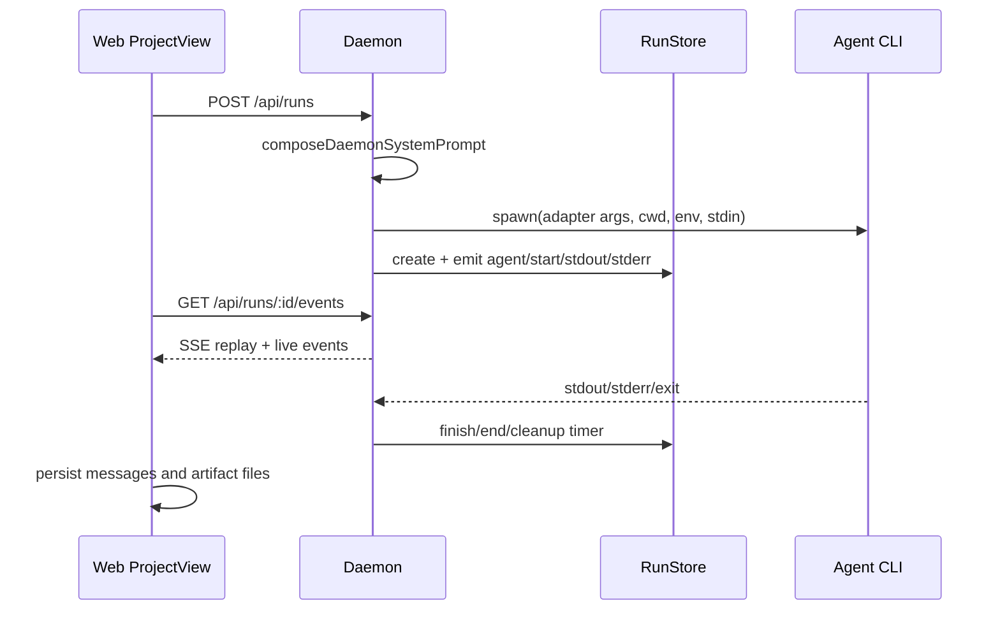

相关源文件

- [docs/agent-adapters.md](../../../project-repos/open-design/docs/agent-adapters.md) - adapter 设计、能力探测、skill 注入策略和 fallback。
- [apps/daemon/src/agents.ts](../../../project-repos/open-design/apps/daemon/src/agents.ts) - agent adapter 定义、PATH 探测、模型探测和 spawn 参数。
- [apps/daemon/src/server.ts](../../../project-repos/open-design/apps/daemon/src/server.ts) - `startChatRun`、runs 路由和 legacy chat 路由。
- [apps/daemon/src/runs.ts](../../../project-repos/open-design/apps/daemon/src/runs.ts) - run store、事件保留、SSE replay、取消。
- [apps/web/src/providers/daemon.ts](../../../project-repos/open-design/apps/web/src/providers/daemon.ts) - 前端创建 run、消费 SSE、重连和事件翻译。

# Agent 适配器与运行链路

Open Design 把不同 CLI 统一成一套 adapter 模型。文档中给出的接口包括 `id/name/description/detect/buildArgs/parseEvent` 等能力，目标是让 Web 层不用理解每个 CLI 的参数和流格式。[docs/agent-adapters.md:15-64](../../../project-repos/open-design/docs/agent-adapters.md)

## Adapter 目录

`apps/daemon/src/agents.ts` 覆盖多个本地 agent：Claude、Codex、Devin ACP、Gemini、OpenCode、Hermes/Kimi、Cursor、Qwen、Copilot、Pi、Kiro 等。不同 adapter 的关键差异是命令名、参数、stdin/流式输出协议、是否支持 `--add-dir` 或模型枚举。[apps/daemon/src/agents.ts:115-565](../../../project-repos/open-design/apps/daemon/src/agents.ts)

| Agent | 典型执行方式 | 维护关注点 |
| --- | --- | --- |
| Claude | `-p`、stream-json、`--add-dir`、stdin | 支持额外允许目录和结构化事件。 |
| Codex | `codex exec --json --skip-git-repo-check --full-auto -C` | 参数更偏自动执行，需要 cwd 正确。 |
| Gemini/OpenCode/Cursor/Qwen/Copilot | 各自 CLI 参数和模型能力不同 | UI 只展示 daemon 探测到的可用能力。 |
| ACP 类 | 通过 ACP 会话通信 | 事件解析和取消行为不同。 |

可执行文件解析、模型缓存和 agent 探测集中在文件尾部：`resolveOnPath/executable`、`fetchModels`、`probe/detectAgents`、`getAgentDef` 等函数负责把本机环境转成 UI 可消费的 agent 列表。[apps/daemon/src/agents.ts:568-755](../../../project-repos/open-design/apps/daemon/src/agents.ts)

## Run 生命周期

运行链路从 Web 发起：前端调用 daemon 创建 run，然后订阅 `/api/runs/:id/events` 的 SSE。`streamViaDaemon` 创建 run 后消费事件流，并把 daemon 事件转换成 UI 消息、stdout/stderr、artifact 和终态。[apps/web/src/providers/daemon.ts:76-151](../../../project-repos/open-design/apps/web/src/providers/daemon.ts) [apps/web/src/providers/daemon.ts:182-338](../../../project-repos/open-design/apps/web/src/providers/daemon.ts)

Daemon 端的 `startChatRun` 做了真正的编排：校验 agent、解析项目 cwd、加载附件、组合 system prompt、设置允许目录、模型/reasoning/env，然后 spawn 子进程并把输出转成 run events。[apps/daemon/src/server.ts:2162-2493](../../../project-repos/open-design/apps/daemon/src/server.ts)

## 事件保留与恢复

`runs.ts` 把 run 的事件存在内存里，默认每个 run 最多保留 2000 条事件，结束后 30 分钟清理；SSE 支持 `Last-Event-ID` 或 `after` 参数重放，取消时会 kill 子进程。[apps/daemon/src/runs.ts:4-38](../../../project-repos/open-design/apps/daemon/src/runs.ts) [apps/daemon/src/runs.ts:97-130](../../../project-repos/open-design/apps/daemon/src/runs.ts) Web 的 ProjectView 也有 reattach 逻辑，用于页面刷新或切换后恢复仍可恢复的 run。[apps/web/src/components/ProjectView.tsx:510-708](../../../project-repos/open-design/apps/web/src/components/ProjectView.tsx)

这套设计的优点是简单且可调试：daemon 不需要持久化每条 stdout 事件，Web 可以在短时间内恢复运行状态。限制也很明确：进程重启会丢失内存中的 run event，长时间离线后只能回到已落盘的 messages/files/artifacts。

## Skill 注入与 agent 差异

Adapter 文档把 skill 注入分成多种策略：有的 CLI 支持直接传 system prompt，有的需要写入上下文或通过 stdin 注入。[docs/agent-adapters.md:98-121](../../../project-repos/open-design/docs/agent-adapters.md) Open Design 的做法是尽量在 daemon 侧合成一个完整 system prompt，然后用 adapter 能力传给对应 CLI；UI 则通过 agent 能力和 fallback 提示告诉用户当前 agent 是否适合当前模式。[docs/agent-adapters.md:238-267](../../../project-repos/open-design/docs/agent-adapters.md)

## 相关页面

- [Prompt 栈、发现表单与 Artifact 交付](prompt-artifact-flow.md)
- [Daemon API、本地数据与安全边界](daemon-api.md)
