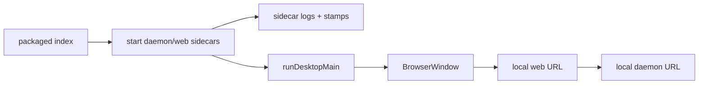

相关源文件

- [apps/desktop/src/main/index.ts](https://github.com/nexu-io/open-design/blob/9d700ec74fc671af845d68af472f7c5c6e0fcfc9/apps/desktop/src/main/index.ts) - Electron main 入口和 IPC handler。
- [apps/desktop/src/main/runtime.ts](https://github.com/nexu-io/open-design/blob/9d700ec74fc671af845d68af472f7c5c6e0fcfc9/apps/desktop/src/main/runtime.ts) - BrowserWindow、Web runtime 轮询、PPTX 保存。
- [apps/packaged/src/index.ts](https://github.com/nexu-io/open-design/blob/9d700ec74fc671af845d68af472f7c5c6e0fcfc9/apps/packaged/src/index.ts) - packaged app 启动、config/stamp、sidecar 和 protocol。
- [apps/packaged/src/sidecars.ts](https://github.com/nexu-io/open-design/blob/9d700ec74fc671af845d68af472f7c5c6e0fcfc9/apps/packaged/src/sidecars.ts) - daemon/web sidecar spawn、日志和健康等待。
- [tools/dev/src/index.ts](https://github.com/nexu-io/open-design/blob/9d700ec74fc671af845d68af472f7c5c6e0fcfc9/tools/dev/src/index.ts) - 本地开发生命周期 CLI。

# Desktop、Sidecar 与本地生命周期

Open Design 的桌面形态不是单独的一套业务实现，而是把 Web app 和 daemon 作为 sidecar 管起来，再用 Electron 提供窗口、IPC 和平台能力。

## Electron runtime

`apps/desktop/src/main/index.ts` 的 `runDesktopMain` 会创建 desktop runtime，并注册 JSON IPC handler，用于 STATUS、EVAL、SCREENSHOT、CONSOLE、CLICK、SHUTDOWN 等操作。[apps/desktop/src/main/index.ts:81-139](https://github.com/nexu-io/open-design/blob/9d700ec74fc671af845d68af472f7c5c6e0fcfc9/apps/desktop/src/main/index.ts) `runtime.ts` 创建 BrowserWindow 时启用 sandbox、contextIsolation，并关闭 nodeIntegration；窗口会轮询 web URL 直到可用。[apps/desktop/src/main/runtime.ts:207-260](https://github.com/nexu-io/open-design/blob/9d700ec74fc671af845d68af472f7c5c6e0fcfc9/apps/desktop/src/main/runtime.ts)

PPTX save-as 等桌面专属能力也留在 runtime 侧，而不是塞进 Web 浏览器环境。[apps/desktop/src/main/runtime.ts:183-204](https://github.com/nexu-io/open-design/blob/9d700ec74fc671af845d68af472f7c5c6e0fcfc9/apps/desktop/src/main/runtime.ts)

## Packaged sidecars

`apps/packaged/src/index.ts` 读取 packaged config 和 stamp，解析路径，启动 sidecars，注册协议，然后进入 desktop main。[apps/packaged/src/index.ts:59-99](https://github.com/nexu-io/open-design/blob/9d700ec74fc671af845d68af472f7c5c6e0fcfc9/apps/packaged/src/index.ts) `sidecars.ts` 中的 spawn 逻辑负责设置 stamps、日志、env 和子进程生命周期；后续函数启动 packaged daemon/web sidecars 并等待健康状态。[apps/packaged/src/sidecars.ts:133-184](https://github.com/nexu-io/open-design/blob/9d700ec74fc671af845d68af472f7c5c6e0fcfc9/apps/packaged/src/sidecars.ts) [apps/packaged/src/sidecars.ts:200-260](https://github.com/nexu-io/open-design/blob/9d700ec74fc671af845d68af472f7c5c6e0fcfc9/apps/packaged/src/sidecars.ts)

## tools-dev 生命周期

`tools/dev/src/index.ts` 是开发期入口。它包含平台判断、foreground 输出、logged command、sidecar runtime/daemon/web spawn、desktop build、node_modules symlink 和 web runtime 启动等逻辑。[tools/dev/src/index.ts:1-32](https://github.com/nexu-io/open-design/blob/9d700ec74fc671af845d68af472f7c5c6e0fcfc9/tools/dev/src/index.ts) [tools/dev/src/index.ts:247-267](https://github.com/nexu-io/open-design/blob/9d700ec74fc671af845d68af472f7c5c6e0fcfc9/tools/dev/src/index.ts) [tools/dev/src/index.ts:382-506](https://github.com/nexu-io/open-design/blob/9d700ec74fc671af845d68af472f7c5c6e0fcfc9/tools/dev/src/index.ts)

命令层支持 start/status/stop/restart/logs/inspect/check 等操作，用来把多进程开发环境压成一个 CLI。[tools/dev/src/index.ts:907-975](https://github.com/nexu-io/open-design/blob/9d700ec74fc671af845d68af472f7c5c6e0fcfc9/tools/dev/src/index.ts)

## 维护边界

- Desktop 只应承载平台能力和窗口/IPC，不要复制 daemon 业务逻辑。
- Sidecar 健康检查和日志路径是排查 packaged app 问题的第一入口。
- `tools-dev` 修改通常会影响本地开发、CI prebuild 和 release 打包，应联动验证。
- 任何对子进程 env、端口、cwd 的修改，都要同时检查 Web bootstrap 和 daemon URL 配置。

## 相关页面

- [系统架构与拓扑](system-architecture.md)
- [测试、CI、发布与运维边界](testing-release-ops.md)
