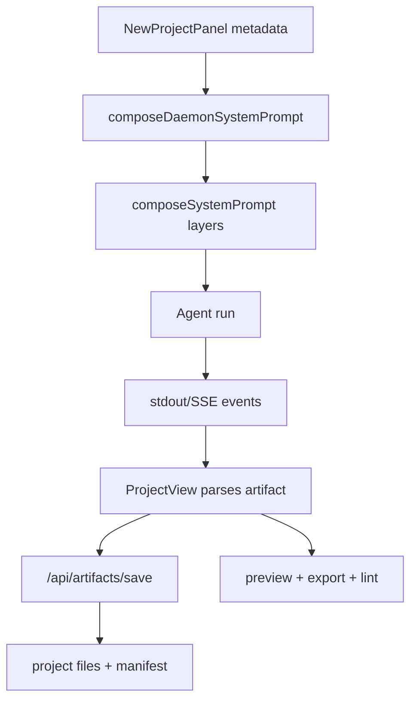

相关源文件

- [apps/daemon/src/prompts/system.ts](../../../project-repos/open-design/apps/daemon/src/prompts/system.ts) - prompt 组合器。
- [apps/daemon/src/prompts/discovery.ts](../../../project-repos/open-design/apps/daemon/src/prompts/discovery.ts) - discovery form、direction picker、TodoWrite 和 critique 规则。
- [apps/daemon/src/server.ts](../../../project-repos/open-design/apps/daemon/src/server.ts) - `composeDaemonSystemPrompt`、artifact save/lint、run 启动。
- [apps/web/src/components/NewProjectPanel.tsx](../../../project-repos/open-design/apps/web/src/components/NewProjectPanel.tsx) - 新建项目 metadata、skill、design system、媒体选项。
- [apps/web/src/components/ProjectView.tsx](../../../project-repos/open-design/apps/web/src/components/ProjectView.tsx) - 发送消息、解析 artifact、保存文件。

# Prompt 栈、发现表单与 Artifact 交付

Open Design 的 prompt 不是一段固定系统词，而是由 daemon 按项目上下文组合出来的分层契约。它的目标是降低“模型自由发挥”的不确定性：先问清楚，再用方向/品牌/skill/checklist 限制输出，最后以 artifact 文件作为交付边界。

## Discovery 优先

`discovery.ts` 把新设计任务拆成三步：第 1 轮必须输出 `<question-form id="discovery">`，第 2 轮根据 brand 答案决定是否走 direction picker 或 brand-spec extraction，第 3 轮开始 TodoWrite、执行、检查和 artifact 输出。[apps/daemon/src/prompts/discovery.ts:10-23](../../../project-repos/open-design/apps/daemon/src/prompts/discovery.ts) 表单字段包括产物类型、主平台、受众、视觉调性、品牌上下文、规模和约束，并要求 JSON 有效、问题少而具体。[apps/daemon/src/prompts/discovery.ts:34-79](../../../project-repos/open-design/apps/daemon/src/prompts/discovery.ts)

这解释了 README 中强调的问题表单：它不是 UI 装饰，而是 prompt 协议的一部分。[README.md:32-40](../../../project-repos/open-design/README.md)

## Prompt 分层

`composeSystemPrompt` 的主体按顺序追加 discovery、官方设计 prompt、design system、craft、skill、metadata、deck framework 和 media contract。[apps/daemon/src/prompts/system.ts:109-190](../../../project-repos/open-design/apps/daemon/src/prompts/system.ts) metadata 渲染会把新建项目面板收集到的 kind、fidelity、speakerNotes、animations、template、image/video/audio 选项变成 agent 可读的上下文；未知字段会要求 agent 在 discovery form 里追问。[apps/daemon/src/prompts/system.ts:193-240](../../../project-repos/open-design/apps/daemon/src/prompts/system.ts)

Daemon 侧还有 `composeDaemonSystemPrompt`，负责读取 active skill、craft、design system、template 后调用 prompt composer。[apps/daemon/src/server.ts:2089-2160](../../../project-repos/open-design/apps/daemon/src/server.ts)

## 新建项目 metadata

`NewProjectPanel` 的状态覆盖 tab、design system、metadata、media models、prompt templates 等。[apps/web/src/components/NewProjectPanel.tsx:73-124](../../../project-repos/open-design/apps/web/src/components/NewProjectPanel.tsx) 它会根据当前 tab 决定是否显示 design system picker，按 tab 过滤 skill，并在创建时把 metadata 组装进项目。[apps/web/src/components/NewProjectPanel.tsx:125-175](../../../project-repos/open-design/apps/web/src/components/NewProjectPanel.tsx) [apps/web/src/components/NewProjectPanel.tsx:220-259](../../../project-repos/open-design/apps/web/src/components/NewProjectPanel.tsx)

这条链路意味着：Web 的创建表单不是只影响 UI 初始状态，它会改变 daemon 注入给 agent 的 prompt 内容。

## Artifact 保存与 lint

Agent 输出后，ProjectView 会解析 artifact 并更新 live artifact；随后通过 daemon 保存为项目文件，并处理文件名冲突。[apps/web/src/components/ProjectView.tsx:782-859](../../../project-repos/open-design/apps/web/src/components/ProjectView.tsx) [apps/web/src/components/ProjectView.tsx:1019-1035](../../../project-repos/open-design/apps/web/src/components/ProjectView.tsx) Daemon 则提供 `/api/artifacts/save` 和 `/api/artifacts/lint`，分别负责文件落盘和产物检查。[apps/daemon/src/server.ts:1361-1387](../../../project-repos/open-design/apps/daemon/src/server.ts)

## 风险点

- 新增 metadata 字段时，需要同时更新 `NewProjectPanel`、prompt composer 和 agent 预期行为。
- 修改 artifact 语法或 manifest 时，需要同时更新解析、保存、预览、导出、lint。
- 修改 discovery 规则时，要验证新建项目第一轮、已有项目 tweak、media surface 和 deck surface 是否仍能按预期跳转。

## 相关页面

- [Skills、Design Systems 与 Craft 注入](skills-design-systems.md)
- [Web 工作台、预览与导出](web-workspace.md)
