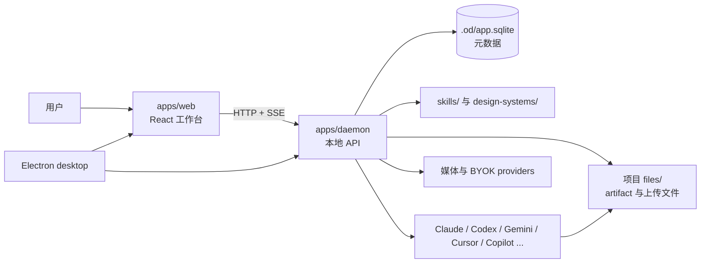

相关源文件

- [docs/architecture.md](../../../project-repos/open-design/docs/architecture.md) - 官方架构文档、拓扑、组件图、API 边界和部署说明。
- [apps/daemon/src/server.ts](../../../project-repos/open-design/apps/daemon/src/server.ts) - daemon 启动、HTTP API 和 agent run 编排。
- [apps/web/src/App.tsx](../../../project-repos/open-design/apps/web/src/App.tsx) - Web bootstrap 和顶层状态。
- [apps/desktop/src/main/runtime.ts](../../../project-repos/open-design/apps/desktop/src/main/runtime.ts) - Electron runtime 与 Web sidecar 连接。

# 系统架构与拓扑

Open Design 有三种运行拓扑：全本地 Web + daemon、桌面 app 内嵌 Web/daemon，以及静态/托管 Web 连接到用户本机 daemon。[docs/architecture.md:13-49](../../../project-repos/open-design/docs/architecture.md) 这三个拓扑共享同一套核心边界：Web 只负责体验和预览，daemon 负责文件系统、SQLite、agent spawn、模型代理和媒体 dispatch，agent CLI 负责真正生成或修改项目文件。

## 分层职责

| 层 | 责任 | 不应承担的责任 |
| --- | --- | --- |
| Web app | 项目入口、agent/skill/DS 选择、对话、运行事件展示、artifact 预览、导出、评论。 | 不直接访问任意本机路径，不直接 spawn agent。 |
| Daemon | 项目和文件边界、SQLite、API、run 生命周期、prompt 组合、agent adapter、BYOK proxy、media dispatcher。 | 不把 UI 状态写死，不直接承担 artifact 渲染体验。 |
| Agent CLI | 按注入的 prompt/skill/design system 修改项目文件并输出 artifact。 | 不负责持久化元数据，不绕过 daemon 写跨项目文件。 |
| Desktop/packaged | 管理 Web 与 daemon sidecar、窗口、IPC、平台打包和协议入口。 | 不重新实现业务 API。 |

架构文档中的组件图把 Web、daemon、SQLite、project files、agents、providers 和 deployment target 连在一起，强调本地 daemon 是能力汇聚点。[docs/architecture.md:53-95](../../../project-repos/open-design/docs/architecture.md)

## Daemon 是中枢

`startServer` 创建 Express app、设置 JSON 限制、打开 SQLite、预热 agent 检测，然后挂载健康检查、项目、skills、design systems、prompt templates、media、app-config、artifact、runs、proxy 等路由。[apps/daemon/src/server.ts:612-639](../../../project-repos/open-design/apps/daemon/src/server.ts) 这让 daemon 同时成为：

- 本地持久化层：`.od/app.sqlite` 存项目元数据，项目文件留在文件系统；`app-config.json` 存 onboarding、agent、模型、skill 和 design system 偏好。
- 能力注册层：扫描 skills/design systems/prompt templates。
- 运行编排层：组合 prompt、spawn agent、维护 run 事件。
- 安全边界层：限制项目路径、限制 raw/upload/delete、限制 BYOK proxy 目标。

## Web 是状态聚合器

Web 顶层 `App` 在启动阶段探测 daemon，随后加载 agents、skills、design systems、projects、templates、prompt templates 和版本信息。[apps/web/src/App.tsx:77-138](../../../project-repos/open-design/apps/web/src/App.tsx) 这说明 Web 没有内建静态能力表；它把 daemon 当前探测到的本机能力作为事实来源。这对本地优先体验很关键：安装或移除 agent CLI 后，UI 应跟随 daemon 探测结果变化。

## 三种部署的差别

架构文档描述的三种拓扑差异主要在“Web 从哪里来”和“daemon 如何被启动”：

| 拓扑 | Web 来源 | Daemon 来源 | 典型场景 |
| --- | --- | --- | --- |
| Local web + local daemon | 本地 Vite/静态 Web | 本地 Node daemon | 开发和高级用户本地运行。 |
| Desktop app | Electron 窗口加载本地 Web sidecar | packaged sidecar | 非工程用户安装 app。 |
| Hosted/static Web | 远端静态资源 | 用户本机 daemon | 轻量分发 UI，同时保留本机 agent 权限。 |

这种设计的代价是跨进程和跨 origin 的状态同步更复杂：Web 要处理 daemon 不可用、run 恢复、SSE 重连、文件预览 iframe sandbox、桌面 IPC 等情况。好处是 agent 执行和文件写入始终停留在用户本机。

## 相关页面

- [Daemon API、本地数据与安全边界](daemon-api.md)
- [Web 工作台、预览与导出](web-workspace.md)
- [Desktop、Sidecar 与本地生命周期](desktop-packaging-lifecycle.md)
