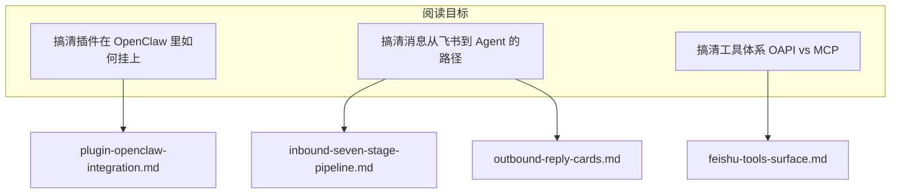
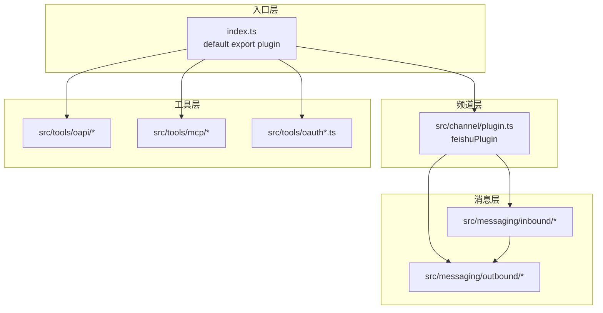
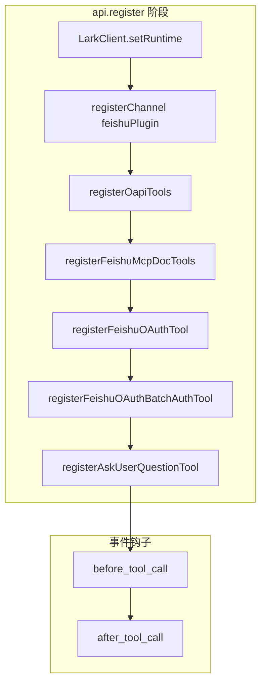
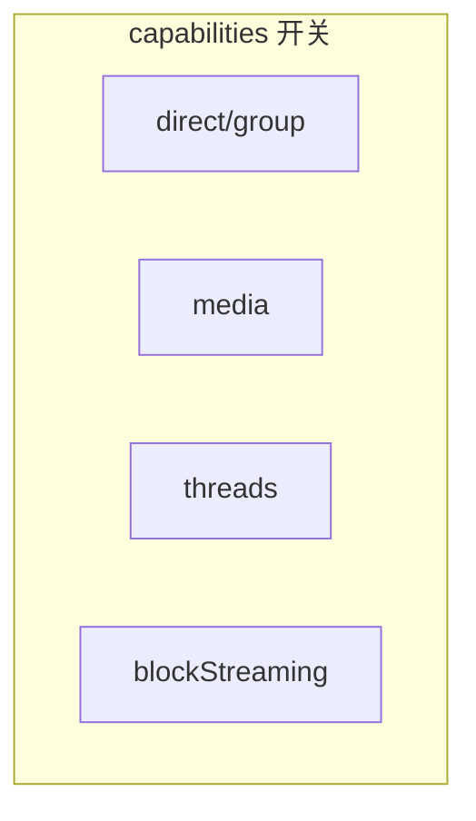
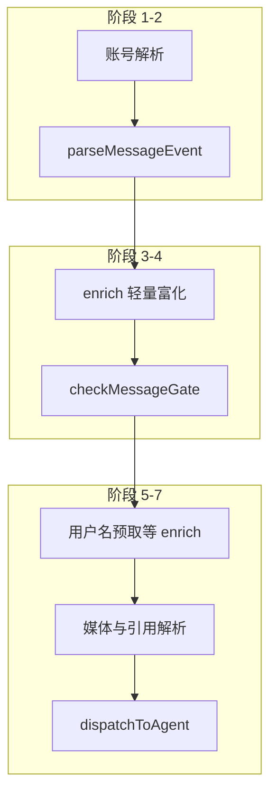
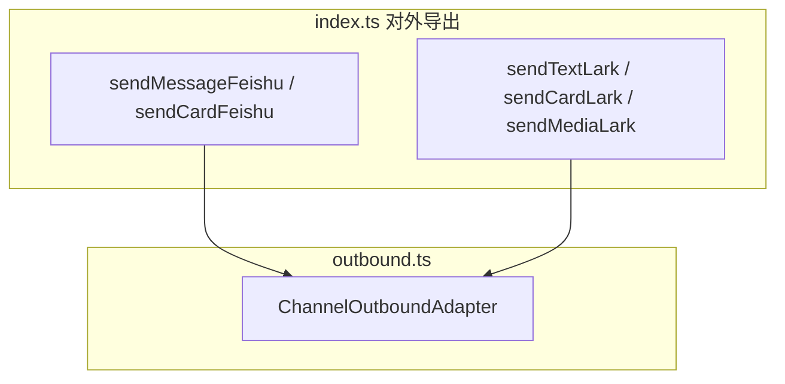
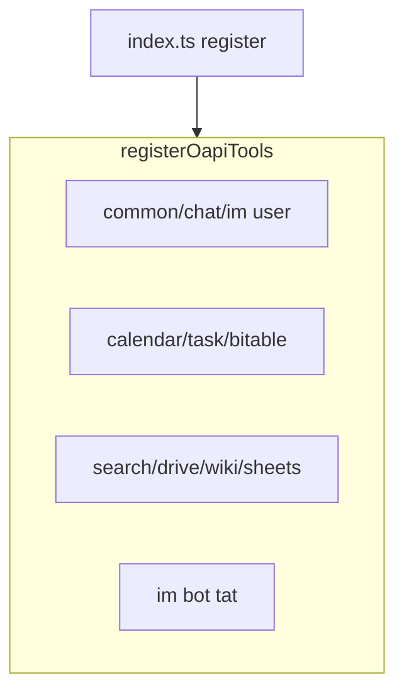
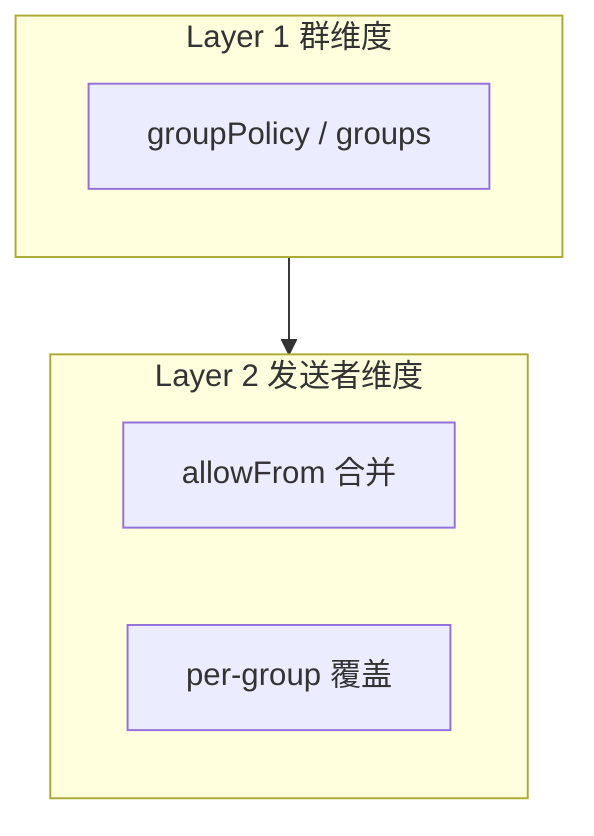
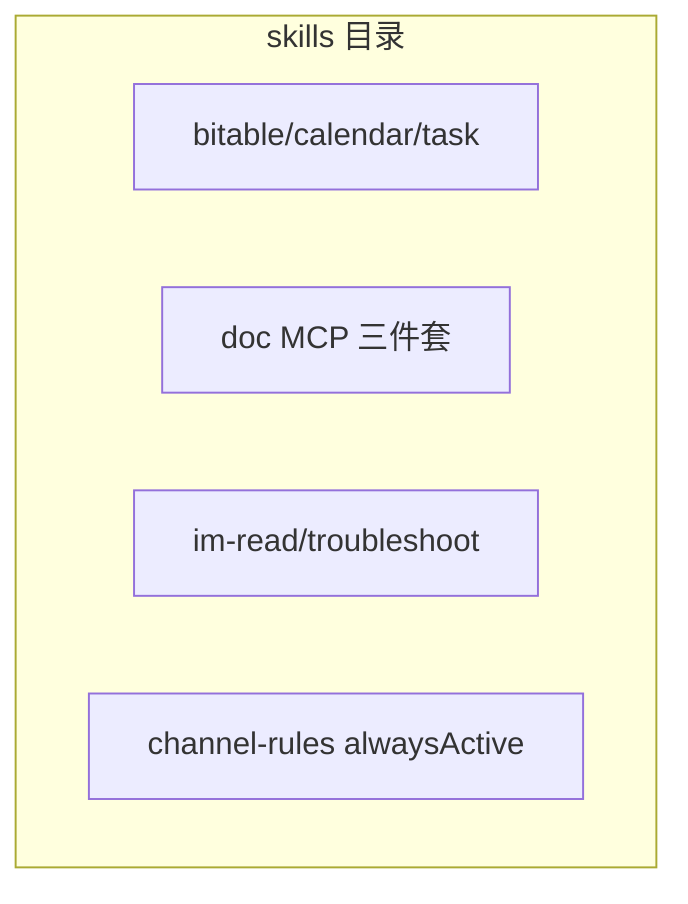
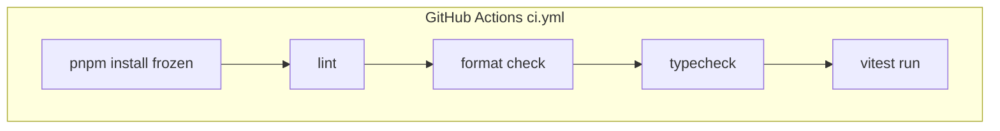

# openclaw-lark DeepWiki 导出

来源: https://github.com/larksuite/openclaw-lark @ a584cc5e387983bb6ef38dab1f97c9d9e6bba9f1

---

<details>
<summary>相关源文件</summary>

生成本页时使用的主要源文件：

- [README.md](../../../project-repos/openclaw-lark/README.md)
- [README.zh.md](../../../project-repos/openclaw-lark/README.zh.md)
- [package.json](../../../project-repos/openclaw-lark/package.json)
- [openclaw.plugin.json](../../../project-repos/openclaw-lark/openclaw.plugin.json)
- [LICENSE](../../../project-repos/openclaw-lark/LICENSE)

</details>

# 项目概览

`@larksuite/openclaw-lark` 是飞书/Lark 开放平台团队维护的 **OpenClaw 官方频道插件**：把飞书会话作为 OpenClaw 的 `feishu` 通道，向 Agent 暴露消息读写、云文档、多维表格、电子表格、日历与任务等能力，并配套交互式卡片、流式回复、权限策略与按群配置（白名单、技能绑定、自定义系统提示词等）。

下文区分 **用户文档表述** 与 **机器可读 manifest**：阅读排障时应以 `package.json`、`openclaw.plugin.json` 与源码为准。

## 能力矩阵与产品边界

README 以表格汇总能力类别（消息、文档、Base、Sheets、Calendar、Tasks）以及卡片、流式、权限策略、群组高级配置等横切能力；同时用显著篇幅提示模型幻觉、提示词注入与「以用户身份在授权范围内执行」的合规与安全风险，并建议将机器人作为私聊助手、避免拉入群聊。

Sources: [README.zh.md:9-33](../../../project-repos/openclaw-lark/README.zh.md#L9-L33), [README.md:30-37](../../../project-repos/openclaw-lark/README.md#L30-L37)

<details class="source-snippets">
<summary>引用源码</summary>

<!-- source-snippets:start -->

#### `README.zh.md:9-33`

```markdown
这是 OpenClaw 的官方  Lark/飞书 插件，由 Lark/飞书开放平台团队开发和维护。它将你的 OpenClaw Agent 无缝对接到  Lark/飞书 工作区，赋予其直接读写消息、文档、多维表格、日历、任务等应用的能力。

## 特性

本插件为 OpenClaw 提供了全面的 Lark/飞书集成能力，主要包括：

| 类别 | 能力 |
|------|------|
| 💬 消息 | 消息读取（群聊/单聊历史、话题回复）、消息发送、消息回复、消息搜索、图片/文件下载 |
| 📄 文档 | 创建云文档、更新云文档、读取云文档内容 |
| 📊 多维表格 | 创建/管理多维表格、数据表、字段、记录（增删改查、批量操作、高级筛选）、视图 |
| 📈 电子表格 | 创建、编辑、查看电子表格 |
| 📅 日历日程 | 日历管理、日程管理（创建/查询/修改/删除/搜索）、参会人管理、忙闲查询 |
| ✅ 任务 | 任务管理（创建/查询/更新/完成）、清单管理、子任务、评论 |

此外，插件还支持：
- **📱 交互式卡片**：实时状态更新（思考中/生成中/完成状态），提供敏感操作的确认按钮
- **🌊 流式回复**：在消息卡片中提供实时的流式响应
- **🔒 权限策略**：为私聊和群聊提供灵活的访问控制策略
- **⚙️ 高级群组配置**：每个群聊的独立设置，包括白名单、技能绑定和自定义系统提示词

## 安全与风险提示（使用前必读）
本插件对接 OpenClaw AI 自动化能力，存在模型幻觉、执行不可控、提示词注入等固有风险；授权飞书权限后，OpenClaw 将以您的用户身份在授权范围内执行操作，可能导致敏感数据泄露、越权操作等高风险后果，请您谨慎操作和使用。
为降低上述风险，插件已在多个层面启用默认安全保护以降低上述风险，但上述风险仍然存在。我们强烈建议不要主动修改任何默认安全配置；一旦放开相关限制，上述风险将显著提高，由此产生的后果需由您自行承担。
我们建议您将接入 OpenClaw 的飞书机器人作为私人对话助手使用，请勿将其拉入群聊或允许其他用户与其交互，以避免权限被滥用或数据泄露。
```

#### `README.md:30-37`

```markdown
## Security & Risk Warnings (Read Before Use)

This plugin integrates with OpenClaw AI automation capabilities and carries inherent risks such as model hallucinations, unpredictable execution, and prompt injection. After you authorize Lark/Feishu permissions, OpenClaw will act under your user identity within the authorized scope, which may lead to high-risk consequences such as leakage of sensitive data or unauthorized operations. Please use with caution.

To reduce these risks, the plugin enables default security protections at multiple layers. However, these risks still exist. We strongly recommend that you do not proactively modify any default security settings; once relevant restrictions are relaxed, the risks will increase significantly, and you will bear the consequences.

We recommend using the Lark/Feishu bot connected to OpenClaw as a private conversational assistant. Do not add it to group chats or allow other users to interact with it, to avoid abuse of permissions or data leakage.

```

<!-- source-snippets:end -->
</details>

## 运行环境与版本约束

`package.json` 要求 **Node.js >= 22**，使用 **pnpm** 作为 `packageManager`，构建入口为 `tsdown`，测试为 `vitest`。

OpenClaw 侧版本阈值在文档与 `package.json` 中 **表述不一致**（均为仓库客观事实，阅读时请勿混用）：

- 中文 README 写明需 **OpenClaw 2026.2.26 及以上**，并给出 `npm install -g openclaw` 升级示例。
- `package.json` 的 `peerDependencies` 声明为 **`openclaw >= 2026.3.22`**（`peerDependenciesMeta` 中将 `openclaw` 标为 optional，便于插件包独立开发构建）。

Sources: [README.zh.md:47-57](../../../project-repos/openclaw-lark/README.zh.md#L47-L57), [package.json:28-55](../../../project-repos/openclaw-lark/package.json#L28-L55)

<details class="source-snippets">
<summary>引用源码</summary>

<!-- source-snippets:start -->

#### `README.zh.md:47-57`

````markdown
## 安装与要求

在开始之前，请确保你已准备好以下各项：

- **Node.js**: `v22` 或更高版本。
- **OpenClaw**: OpenClaw 已成功安装并可运行。详情请访问 [OpenClaw 官方网站](https://openclaw.ai)。

> **注意**：OpenClaw 版本需在 **2026.2.26** 及以上，可通过 `openclaw -v` 命令查看。如果低于该版本可能出现异常，执行以下命令升级：
> ```bash
> npm install -g openclaw
> ```
````

#### `package.json:28-55`

```json
  "engines": {
    "node": ">=22"
  },
  "scripts": {
    "build": "tsdown",
    "release": "node scripts/release.mjs",
    "test": "vitest run",
    "test:watch": "vitest",
    "lint": "eslint src/ index.ts",
    "lint:fix": "eslint src/ index.ts --fix",
    "typecheck": "tsc --noEmit",
    "format": "prettier --write src/**/*.ts",
    "format:check": "prettier --check src/**/*.ts"
  },
  "dependencies": {
    "@larksuiteoapi/node-sdk": "^1.60.0",
    "@sinclair/typebox": "0.34.48",
    "image-size": "^2.0.2",
    "undici-types": "^8.1.0",
    "zod": "^4.3.6"
  },
  "peerDependencies": {
    "openclaw": ">=2026.3.22"
  },
  "peerDependenciesMeta": {
    "openclaw": {
      "optional": true
    }
```

<!-- source-snippets:end -->
</details>

## 插件清单与对外形态

`openclaw.plugin.json` 声明插件 `id`、支持的 `channels`、随包 `skills` 目录，以及 `channelConfigs.feishu` 的空 schema 占位（具体校验在运行时由代码侧 JSON Schema 提供，见频道配置章节）。

npm `files` 字段包含 `bin/`、`dist/`、`skills/`、`openclaw.plugin.json` 等，用于发布物裁剪。

Sources: [openclaw.plugin.json:1-17](../../../project-repos/openclaw-lark/openclaw.plugin.json#L1-L17), [package.json:16-26](../../../project-repos/openclaw-lark/package.json#L16-L26)

<details class="source-snippets">
<summary>引用源码</summary>

<!-- source-snippets:start -->

#### `openclaw.plugin.json:1-17`

```json
{
  "id": "openclaw-lark",
  "channels": ["feishu"],
  "skills": ["./skills"],
  "configSchema": {
    "type": "object",
    "additionalProperties": false,
    "properties": {}
  },
  "channelConfigs": {
    "feishu": {
      "schema": {
        "type": "object"
      }
    }
  }
}
```

#### `package.json:16-26`

```json
  "bin": {
    "openclaw-lark": "bin/openclaw-lark.js"
  },
  "files": [
    "bin/",
    "dist/",
    "skills/",
    "openclaw.plugin.json",
    "README.md",
    "LICENSE"
  ],
```

<!-- source-snippets:end -->
</details>

## 对外文档与贡献入口

README 指向飞书官方使用指南文档链接；贡献指引与 Issue/PR 链接在英文 README 中给出（中文 README 同步贡献段落）。

Sources: [README.md:64-72](../../../project-repos/openclaw-lark/README.md#L64-L72), [README.zh.md:59-66](../../../project-repos/openclaw-lark/README.zh.md#L59-L66)

<details class="source-snippets">
<summary>引用源码</summary>

<!-- source-snippets:start -->

#### `README.md:64-72`

```markdown
## Usage Guide

[How to Use the Official Lark/Feishu Plugin for OpenClaw](https://bytedance.larkoffice.com/docx/MFK7dDFLFoVlOGxWCv5cTXKmnMh)

## Contributing

Community contributions are welcome! If you find a bug or have feature suggestions, please submit an [Issue](https://github.com/larksuite/openclaw-larksuite/issues) or a [Pull Request](https://github.com/larksuite/openclaw-larksuite/pulls).

For major changes, we recommend discussing with us first via an Issue.
```

#### `README.zh.md:59-66`

```markdown
## 使用说明
[OpenClaw  Lark/飞书官方插件使用指南](https://bytedance.larkoffice.com/docx/MFK7dDFLFoVlOGxWCv5cTXKmnMh)

## 贡献

我们欢迎社区的贡献！如果你发现 Bug 或有功能建议，请随时提交 [Issue](https://github.com/larksuite/openclaw-larksuite/issues) 或 [Pull Request](https://github.com/larksuite/openclaw-larksuite/pulls)。

对于较大的改动，我们建议你先通过 Issue 与我们讨论。
```

<!-- source-snippets:end -->
</details>

## 阅读路线建议



Sources: [README.zh.md:11-28](../../../project-repos/openclaw-lark/README.zh.md#L11-L28), [package.json:74-96](../../../project-repos/openclaw-lark/package.json#L74-L96)

<details class="source-snippets">
<summary>引用源码</summary>

<!-- source-snippets:start -->

#### `README.zh.md:11-28`

```markdown
## 特性

本插件为 OpenClaw 提供了全面的 Lark/飞书集成能力，主要包括：

| 类别 | 能力 |
|------|------|
| 💬 消息 | 消息读取（群聊/单聊历史、话题回复）、消息发送、消息回复、消息搜索、图片/文件下载 |
| 📄 文档 | 创建云文档、更新云文档、读取云文档内容 |
| 📊 多维表格 | 创建/管理多维表格、数据表、字段、记录（增删改查、批量操作、高级筛选）、视图 |
| 📈 电子表格 | 创建、编辑、查看电子表格 |
| 📅 日历日程 | 日历管理、日程管理（创建/查询/修改/删除/搜索）、参会人管理、忙闲查询 |
| ✅ 任务 | 任务管理（创建/查询/更新/完成）、清单管理、子任务、评论 |

此外，插件还支持：
- **📱 交互式卡片**：实时状态更新（思考中/生成中/完成状态），提供敏感操作的确认按钮
- **🌊 流式回复**：在消息卡片中提供实时的流式响应
- **🔒 权限策略**：为私聊和群聊提供灵活的访问控制策略
- **⚙️ 高级群组配置**：每个群聊的独立设置，包括白名单、技能绑定和自定义系统提示词
```

#### `package.json:74-96`

```json
  },
  "openclaw": {
    "extensions": [
      "./dist/index.mjs"
    ],
    "channel": {
      "id": "openclaw-lark",
      "label": "Feishu",
      "selectionLabel": "Lark/Feishu (飞书)",
      "docsPath": "/channels/feishu",
      "docsLabel": "feishu",
      "blurb": "飞书/Lark enterprise messaging with doc/wiki/drive/task/calendar tools.",
      "aliases": [
        "lark"
      ],
      "order": 35,
      "quickstartAllowFrom": true
    },
    "install": {
      "npmSpec": "@larksuite/openclaw-lark",
      "localPath": "extensions/feishu",
      "defaultChoice": "npm"
    }
```

<!-- source-snippets:end -->
</details>

## 相关页面

- [系统架构](system-architecture.md)
- [OpenClaw 插件注册与运行时](plugin-openclaw-integration.md)
- [飞书工具面：OAPI、MCP 文档与交互](feishu-tools-surface.md)

---

<details>
<summary>相关源文件</summary>

生成本页时使用的主要源文件：

- [index.ts](../../../project-repos/openclaw-lark/index.ts)
- [src/channel/plugin.ts](../../../project-repos/openclaw-lark/src/channel/plugin.ts)
- [src/tools/oapi/index.ts](../../../project-repos/openclaw-lark/src/tools/oapi/index.ts)
- [src/messaging/inbound/handler.ts](../../../project-repos/openclaw-lark/src/messaging/inbound/handler.ts)
- [src/messaging/outbound/outbound.ts](../../../project-repos/openclaw-lark/src/messaging/outbound/outbound.ts)

</details>

# 系统架构

本仓库在源码层面可粗分为四层：**插件入口与 OpenClaw 契约**（`index.ts`）、**频道实现**（`src/channel/*`）、**消息子系统**（`src/messaging/*`）、**工具子系统**（`src/tools/*`），外加 **卡片与追踪**（`src/card/*`）、**命令与诊断**（`src/commands/*`）、**核心基础设施**（`src/core/*`）。

## 顶层依赖方向



`index.ts` 在注释中明确：注册 `feishu` 频道，并注册 doc/wiki/drive 等工具族（与 OAPI 分组实现相互印证）。

Sources: [index.ts:5-9](../../../project-repos/openclaw-lark/index.ts#L5-L9), [index.ts:104-128](../../../project-repos/openclaw-lark/index.ts#L104-L128)

<details class="source-snippets">
<summary>引用源码</summary>

<!-- source-snippets:start -->

#### `index.ts:5-9`

```typescript
 * OpenClaw Lark/Feishu plugin entry point.
 *
 * Registers the Feishu channel and all tool families:
 * doc, wiki, drive, perm, bitable, task, calendar.
 */
```

#### `index.ts:104-128`

```typescript
const plugin = {
  id: 'openclaw-lark',
  name: 'Feishu',
  description: 'Lark/Feishu channel plugin with im/doc/wiki/drive/task/calendar tools',
  configSchema: emptyPluginConfigSchema(),
  register(api: OpenClawPluginApi): void {
    LarkClient.setRuntime(api.runtime);
    api.registerChannel({ plugin: feishuPlugin });

    // ========================================

    // Register OAPI tools (calendar, task - using Feishu Open API directly)
    registerOapiTools(api);

    // Register MCP doc tools (using Model Context Protocol)
    registerFeishuMcpDocTools(api);

    // Register OAuth tool (UAT device flow authorization)
    registerFeishuOAuthTool(api);

    // Register OAuth batch auth tool (batch authorization for all app scopes)
    registerFeishuOAuthBatchAuthTool(api);

    // Register AskUserQuestion tool (interactive card-based user prompting)
    registerAskUserQuestionTool(api);
```

<!-- source-snippets:end -->
</details>

## 频道插件在架构中的位置

`feishuPlugin` 实现 OpenClaw SDK 的 `ChannelPlugin`：包含 `meta`、`pairing`、`capabilities`、`agentPrompt`、`groups`、`reload`、`configSchema`、`config`、`security`、`setup`、`messaging`、`directory`、`outbound`、`threading` 等分区，是 **运行时编排** 的中枢之一。

Sources: [src/channel/plugin.ts:12-15](../../../project-repos/openclaw-lark/src/channel/plugin.ts#L12-L15), [src/channel/plugin.ts:78-123](../../../project-repos/openclaw-lark/src/channel/plugin.ts#L78-L123)

<details class="source-snippets">
<summary>引用源码</summary>

<!-- source-snippets:start -->

#### `src/channel/plugin.ts:12-15`

```typescript
import type { ChannelPlugin, ClawdbotConfig } from 'openclaw/plugin-sdk';
import type { ChannelThreadingToolContext } from 'openclaw/plugin-sdk/channel-contract';
import { DEFAULT_ACCOUNT_ID } from 'openclaw/plugin-sdk/account-id';
import { PAIRING_APPROVED_MESSAGE } from 'openclaw/plugin-sdk/channel-status';
```

#### `src/channel/plugin.ts:78-123`

```typescript
export const feishuPlugin: ChannelPlugin<LarkAccount> = {
  id: 'feishu',

  meta: {
    ...meta,
  },

  // -------------------------------------------------------------------------
  // Pairing
  // -------------------------------------------------------------------------

  pairing: {
    idLabel: 'feishuUserId',
    normalizeAllowEntry: (entry) => entry.replace(/^(feishu|user|open_id):/i, ''),
    notifyApproval: async ({ cfg, id }) => {
      const accountId = getDefaultLarkAccountId(cfg);
      pluginLog.info('notifyApproval called', { id, accountId });

      // 1. 发送配对成功消息（保持现有行为）
      await sendMessageFeishu({
        cfg,
        to: id,
        text: PAIRING_APPROVED_MESSAGE,
        accountId,
      });

      // 2. 触发 onboarding
      try {
        await triggerOnboarding({ cfg, userOpenId: id, accountId });
        pluginLog.info('onboarding completed', { id });
      } catch (err) {
        pluginLog.warn('onboarding failed', { id, error: String(err) });
      }
    },
  },

  // -------------------------------------------------------------------------
  // Capabilities
  // -------------------------------------------------------------------------

  capabilities: {
    chatTypes: ['direct', 'group'],
    media: true,
    reactions: true,
    threads: true,
    polls: false,
```

<!-- source-snippets:end -->
</details>

## 工具子系统的两条主线

`registerOapiTools` 将「直接调用飞书 Open API」的工具成组注册（IM user、Calendar、Task、Bitable、Search、Drive、Wiki、Sheets、IM bot 等），与 MCP 文档工具区分。

Sources: [src/tools/oapi/index.ts:5-95](../../../project-repos/openclaw-lark/src/tools/oapi/index.ts#L5-L95)

<details class="source-snippets">
<summary>引用源码</summary>

<!-- source-snippets:start -->

#### `src/tools/oapi/index.ts:5-95`

```typescript
 * OAPI Tools Index
 *
 * This module registers all tools that directly use Feishu Open API (OAPI).
 * These tools are placed here to distinguish them from MCP-based tools.
 */

import type { OpenClawPluginApi } from 'openclaw/plugin-sdk';
import { registerFeishuImTools as registerFeishuImBotTools } from '../tat/im/index';
import {
  registerFeishuCalendarCalendarTool,
  registerFeishuCalendarEventAttendeeTool,
  registerFeishuCalendarEventTool,
  registerFeishuCalendarFreebusyTool,
} from './calendar/index';
import {
  registerFeishuTaskAgentTool,
  registerFeishuTaskAttachmentTool,
  registerFeishuTaskCommentTool,
  registerFeishuTaskSectionTool,
  registerFeishuTaskSubtaskTool,
  registerFeishuTaskTaskTool,
  registerFeishuTaskTasklistTool,
} from './task/index';
import {
  registerFeishuBitableAppTableFieldTool,
  registerFeishuBitableAppTableRecordTool,
  registerFeishuBitableAppTableTool,
  registerFeishuBitableAppTableViewTool,
  registerFeishuBitableAppTool,
} from './bitable/index';
import { registerGetUserTool, registerSearchUserTool } from './common/index';
// import { registerFeishuMailTools } from "./mail/index";
import { registerFeishuSearchTools } from './search/index';
import { registerFeishuDriveTools } from './drive/index';
import { registerFeishuWikiTools } from './wiki/index';

import { registerFeishuSheetsTools } from './sheets/index';
// import { registerFeishuOkrTools } from "./okr/index";
import { registerFeishuChatTools } from './chat/index';
import { registerFeishuImTools as registerFeishuImUserTools } from './im/index';

export function registerOapiTools(api: OpenClawPluginApi): void {
  // Common tools
  registerGetUserTool(api);
  registerSearchUserTool(api);

  // Chat tools
  registerFeishuChatTools(api);

  // IM tools (user identity)
  registerFeishuImUserTools(api);

  // Calendar tools
  registerFeishuCalendarCalendarTool(api);
  registerFeishuCalendarEventTool(api);
  registerFeishuCalendarEventAttendeeTool(api);
  registerFeishuCalendarFreebusyTool(api);

  // Task tools
  registerFeishuTaskTaskTool(api);
  registerFeishuTaskTasklistTool(api);
  registerFeishuTaskAttachmentTool(api);
  registerFeishuTaskSectionTool(api);
  registerFeishuTaskCommentTool(api);
  registerFeishuTaskSubtaskTool(api);
  registerFeishuTaskAgentTool(api);

  // Bitable tools
  registerFeishuBitableAppTool(api);
  registerFeishuBitableAppTableTool(api);
  registerFeishuBitableAppTableRecordTool(api);
  registerFeishuBitableAppTableFieldTool(api);
  registerFeishuBitableAppTableViewTool(api);

  // Search tools
  registerFeishuSearchTools(api);

  // Drive tools
  registerFeishuDriveTools(api);

  // Wiki tools
  registerFeishuWikiTools(api);

  // Sheets tools
  registerFeishuSheetsTools(api);

  // IM tools (bot identity)
  registerFeishuImBotTools(api);

  api.logger.debug?.('Registered all OAPI tools (calendar, task, bitable, search, drive, wiki, sheets, im)');
}
```

<!-- source-snippets:end -->
</details>

## 入站编排与出站适配

`handler.ts` 将入站处理描述为 **七个阶段**（账号解析、事件解析、发送者富化、策略门禁、用户名预取、内容解析、Agent 分发），最终调用 `dispatch.ts`。

`plugin.ts` 将 `outbound` 指向 `feishuOutbound`（定义于 `src/messaging/outbound/outbound.ts`），完成频道对外发送路径的装配。

Sources: [src/messaging/inbound/handler.ts:5-14](../../../project-repos/openclaw-lark/src/messaging/inbound/handler.ts#L5-L14), [src/channel/plugin.ts:247-252](../../../project-repos/openclaw-lark/src/channel/plugin.ts#L247-L252)

<details class="source-snippets">
<summary>引用源码</summary>

<!-- source-snippets:start -->

#### `src/messaging/inbound/handler.ts:5-14`

```typescript
 * Inbound message handling pipeline for the Lark/Feishu channel plugin.
 *
 * Orchestrates a seven-stage pipeline:
 *   1. Account resolution
 *   2. Event parsing         → parse.ts (merge_forward expanded in-place)
 *   3. Sender enrichment     → enrich.ts (lightweight, before gate)
 *   4. Policy gate           → gate.ts
 *   5. User name prefetch    → enrich.ts (batch cache warm-up)
 *   6. Content resolution    → enrich.ts (media / quote, parallel)
 *   7. Agent dispatch        → dispatch.ts
```

#### `src/channel/plugin.ts:247-252`

```typescript
  // -------------------------------------------------------------------------
  // Outbound
  // -------------------------------------------------------------------------

  outbound: feishuOutbound,

```

<!-- source-snippets:end -->
</details>

## 相关页面

- [项目概览](overview.md)
- [OpenClaw 插件注册与运行时](plugin-openclaw-integration.md)
- [入站消息七阶段流水线](inbound-seven-stage-pipeline.md)

---

<details>
<summary>相关源文件</summary>

生成本页时使用的主要源文件：

- [index.ts](../../../project-repos/openclaw-lark/index.ts)
- [src/commands/index.ts](../../../project-repos/openclaw-lark/src/commands/index.ts)
- [src/commands/diagnose.ts](../../../project-repos/openclaw-lark/src/commands/diagnose.ts)
- [bin/openclaw-lark.js](../../../project-repos/openclaw-lark/bin/openclaw-lark.js)
- [package.json](../../../project-repos/openclaw-lark/package.json)

</details>

# OpenClaw 插件注册与运行时

`index.ts` 导出默认对象 `plugin`：`register(api)` 中依次完成 **运行时注入**、**频道注册**、**工具注册**、**生命周期钩子**、**CLI 子命令**、**聊天命令**与 **多账号安全检查**。

## register 主流程



Sources: [index.ts:104-162](../../../project-repos/openclaw-lark/index.ts#L104-L162)

<details class="source-snippets">
<summary>引用源码</summary>

<!-- source-snippets:start -->

#### `index.ts:104-162`

```typescript
const plugin = {
  id: 'openclaw-lark',
  name: 'Feishu',
  description: 'Lark/Feishu channel plugin with im/doc/wiki/drive/task/calendar tools',
  configSchema: emptyPluginConfigSchema(),
  register(api: OpenClawPluginApi): void {
    LarkClient.setRuntime(api.runtime);
    api.registerChannel({ plugin: feishuPlugin });

    // ========================================

    // Register OAPI tools (calendar, task - using Feishu Open API directly)
    registerOapiTools(api);

    // Register MCP doc tools (using Model Context Protocol)
    registerFeishuMcpDocTools(api);

    // Register OAuth tool (UAT device flow authorization)
    registerFeishuOAuthTool(api);

    // Register OAuth batch auth tool (batch authorization for all app scopes)
    registerFeishuOAuthBatchAuthTool(api);

    // Register AskUserQuestion tool (interactive card-based user prompting)
    registerAskUserQuestionTool(api);

    api.on('before_tool_call', (event, ctx) => {
      recordToolUseStart({
        sessionKey: ctx.sessionKey,
        toolName: event.toolName,
        toolParams: event.params,
        toolCallId: event.toolCallId ?? ctx.toolCallId,
        runId: event.runId ?? ctx.runId,
      });
      if (!event.toolName.startsWith('feishu_')) return;
      const paramsPreview = sanitizeParamsForLog(event.params);
      log.info(`tool call: ${event.toolName} session=${ctx.sessionKey ?? '-'} params=${paramsPreview}`);
    });

    api.on('after_tool_call', (event, ctx) => {
      recordToolUseEnd({
        sessionKey: ctx.sessionKey,
        toolName: event.toolName,
        toolParams: event.params,
        toolCallId: event.toolCallId ?? ctx.toolCallId,
        runId: event.runId ?? ctx.runId,
        result: event.result,
        error: event.error,
        durationMs: event.durationMs,
      });
      if (!event.toolName.startsWith('feishu_')) return;
      if (event.error) {
        log.error(
          `tool fail: ${event.toolName} session=${ctx.sessionKey ?? '-'} ${event.error} (${event.durationMs ?? 0}ms)`,
        );
      } else {
        log.info(`tool done: ${event.toolName} session=${ctx.sessionKey ?? '-'} ok (${event.durationMs ?? 0}ms)`);
      }
    });
```

<!-- source-snippets:end -->
</details>

## 工具调用观测与日志

`before_tool_call` / `after_tool_call` 对 `feishu_` 前缀工具记录结构化日志，并通过 `recordToolUseStart` / `recordToolUseEnd` 维护工具调用追踪数据，供卡片层消费。

Sources: [index.ts:130-161](../../../project-repos/openclaw-lark/index.ts#L130-L161), [index.ts:29-31](../../../project-repos/openclaw-lark/index.ts#L29-L31)

<details class="source-snippets">
<summary>引用源码</summary>

<!-- source-snippets:start -->

#### `index.ts:130-161`

```typescript
    api.on('before_tool_call', (event, ctx) => {
      recordToolUseStart({
        sessionKey: ctx.sessionKey,
        toolName: event.toolName,
        toolParams: event.params,
        toolCallId: event.toolCallId ?? ctx.toolCallId,
        runId: event.runId ?? ctx.runId,
      });
      if (!event.toolName.startsWith('feishu_')) return;
      const paramsPreview = sanitizeParamsForLog(event.params);
      log.info(`tool call: ${event.toolName} session=${ctx.sessionKey ?? '-'} params=${paramsPreview}`);
    });

    api.on('after_tool_call', (event, ctx) => {
      recordToolUseEnd({
        sessionKey: ctx.sessionKey,
        toolName: event.toolName,
        toolParams: event.params,
        toolCallId: event.toolCallId ?? ctx.toolCallId,
        runId: event.runId ?? ctx.runId,
        result: event.result,
        error: event.error,
        durationMs: event.durationMs,
      });
      if (!event.toolName.startsWith('feishu_')) return;
      if (event.error) {
        log.error(
          `tool fail: ${event.toolName} session=${ctx.sessionKey ?? '-'} ${event.error} (${event.durationMs ?? 0}ms)`,
        );
      } else {
        log.info(`tool done: ${event.toolName} session=${ctx.sessionKey ?? '-'} ok (${event.durationMs ?? 0}ms)`);
      }
```

#### `index.ts:29-31`

```typescript
import { emitSecurityWarnings } from './src/core/security-check';
import { recordToolUseEnd, recordToolUseStart } from './src/card/tool-use-trace-store';
import { sanitizeParamsForLog } from './src/card/reasoning-utils';
```

<!-- source-snippets:end -->
</details>

## CLI：`feishu-diagnose` 与 `openclaw-lark` bin

插件向 OpenClaw CLI 注册 `feishu-diagnose`：支持无参诊断与 `--trace <messageId>` 追踪，可选 `--analyze` 做追踪分析。

npm `bin` 字段提供 `openclaw-lark`，其脚本通过 `npx` 拉起 `@larksuite/openclaw-lark-tools`（可用 `--tools-version` 固定版本），用于把「工具链 CLI」与插件包解耦分发。

Sources: [index.ts:164-202](../../../project-repos/openclaw-lark/index.ts#L164-L202), [bin/openclaw-lark.js:1-39](../../../project-repos/openclaw-lark/bin/openclaw-lark.js#L1-L39), [package.json:16-17](../../../project-repos/openclaw-lark/package.json#L16-L17)

<details class="source-snippets">
<summary>引用源码</summary>

<!-- source-snippets:start -->

#### `index.ts:164-202`

```typescript
    // ---- Diagnostic commands ----

    // CLI: openclaw feishu-diagnose [--trace <messageId>]
    api.registerCli(
      (ctx) => {
        ctx.program
          .command('feishu-diagnose')
          .description('运行飞书插件诊断，检查配置、连通性和权限状态')
          .option('--trace <messageId>', '按 message_id 追踪完整处理链路')
          .option('--analyze', '分析追踪日志（需配合 --trace 使用）')
          .action(async (opts: { trace?: string; analyze?: boolean }) => {
            try {
              if (opts.trace) {
                const lines = await traceByMessageId(opts.trace);
                // eslint-disable-next-line no-console -- CLI 命令直接输出到终端
                console.log(formatTraceOutput(lines, opts.trace));
                if (opts.analyze && lines.length > 0) {
                  // eslint-disable-next-line no-console -- CLI 命令直接输出到终端
                  console.log(analyzeTrace(lines, opts.trace));
                }
              } else {
                const report = await runDiagnosis({
                  config: ctx.config,
                  logger: ctx.logger,
                });
                // eslint-disable-next-line no-console -- CLI 命令直接输出到终端
                console.log(formatDiagReportCli(report));
                if (report.overallStatus === 'unhealthy') {
                  process.exitCode = 1;
                }
              }
            } catch (err) {
              ctx.logger.error(`诊断命令执行失败: ${err}`);
              process.exitCode = 1;
            }
          });
      },
      { commands: ['feishu-diagnose'] },
    );
```

#### `bin/openclaw-lark.js:1-39`

```javascript
#!/usr/bin/env node
import { createRequire } from 'node:module';
import { dirname, join } from 'node:path';

const mod = ['child', 'process'].join('_');
const { execFileSync } = createRequire(import.meta.url)(`node:${mod}`);

// --tools-version <ver> lets the user pin a specific version
const args = process.argv.slice(2);
let version = 'latest';

const vIdx = args.indexOf('--tools-version');
if (vIdx !== -1) {
  version = args[vIdx + 1];
  // Remove --tools-version <ver> from forwarded args
  args.splice(vIdx, 2);
}

const allArgs = ['--yes', '--prefer-online', `@larksuite/openclaw-lark-tools@${version}`, ...args];

try {
  if (process.platform === 'win32') {
    // On Windows, npx is a .cmd shim that can be broken or trigger
    // DEP0190. Bypass it entirely: run node with the npx-cli.js
    // script located next to the running node binary.
    const npxCli = join(dirname(process.execPath), 'node_modules', 'npm', 'bin', 'npx-cli.js');
    execFileSync(process.execPath, [npxCli, ...allArgs], {
      stdio: 'inherit',
      env: {
        ...process.env,
        NODE_OPTIONS: [process.env.NODE_OPTIONS, '--disable-warning=DEP0190'].filter(Boolean).join(' '),
      },
    });
  } else {
    execFileSync('npx', allArgs, { stdio: 'inherit' });
  }
} catch (error) {
  process.exit(error.status ?? 1);
}
```

#### `package.json:16-17`

```json
  "bin": {
    "openclaw-lark": "bin/openclaw-lark.js"
```

<!-- source-snippets:end -->
</details>

## 聊天命令注册

`registerCommands(api)` 负责在飞书会话中暴露 `/feishu_diagnose`、`/feishu_doctor`、`/feishu_auth`、`/feishu` 等命令（详见 `src/commands/index.ts` 头部注释与 i18n 文案表）。

Sources: [index.ts:204-205](../../../project-repos/openclaw-lark/index.ts#L204-L205), [src/commands/index.ts:4-6](../../../project-repos/openclaw-lark/src/commands/index.ts#L4-L6)

<details class="source-snippets">
<summary>引用源码</summary>

<!-- source-snippets:start -->

#### `index.ts:204-205`

```typescript
    // Chat commands: /feishu_diagnose, /feishu_doctor, /feishu_auth, /feishu
    registerCommands(api);
```

#### `src/commands/index.ts:4-6`

```typescript
 *
 * Register all chat commands (/feishu_diagnose, /feishu_doctor, /feishu_auth, /feishu).
 */
```

<!-- source-snippets:end -->
</details>

## package.json 中的 OpenClaw 扩展声明

`package.json` 的 `openclaw` 字段声明 `extensions` 指向构建产物 `./dist/index.mjs`，并描述 `channel` 元数据（`id`、`label`、`docsPath`、`aliases`、`order` 等）与 `install` 提示（`npmSpec`、`localPath`、`defaultChoice`）。这与 `feishuPlugin.meta` 中的展示字段形成 **发布侧与运行时侧** 的双重来源，排查展示不一致时需要对照两处。

Sources: [package.json:75-96](../../../project-repos/openclaw-lark/package.json#L75-L96), [src/channel/plugin.ts:63-72](../../../project-repos/openclaw-lark/src/channel/plugin.ts#L63-L72)

<details class="source-snippets">
<summary>引用源码</summary>

<!-- source-snippets:start -->

#### `package.json:75-96`

```json
  "openclaw": {
    "extensions": [
      "./dist/index.mjs"
    ],
    "channel": {
      "id": "openclaw-lark",
      "label": "Feishu",
      "selectionLabel": "Lark/Feishu (飞书)",
      "docsPath": "/channels/feishu",
      "docsLabel": "feishu",
      "blurb": "飞书/Lark enterprise messaging with doc/wiki/drive/task/calendar tools.",
      "aliases": [
        "lark"
      ],
      "order": 35,
      "quickstartAllowFrom": true
    },
    "install": {
      "npmSpec": "@larksuite/openclaw-lark",
      "localPath": "extensions/feishu",
      "defaultChoice": "npm"
    }
```

#### `src/channel/plugin.ts:63-72`

```typescript
const meta = {
  id: 'feishu',
  label: 'Feishu',
  selectionLabel: 'Lark/Feishu (\u98DE\u4E66)',
  docsPath: '/channels/feishu',
  docsLabel: 'feishu',
  blurb: '\u98DE\u4E66/Lark enterprise messaging.',
  aliases: ['lark'],
  order: 70,
};
```

<!-- source-snippets:end -->
</details>

## 相关页面

- [系统架构](system-architecture.md)
- [飞书工具面：OAPI、MCP 文档与交互](feishu-tools-surface.md)
- [测试、CI 与质量门禁](testing-ci-and-quality.md)

---

<details>
<summary>相关源文件</summary>

生成本页时使用的主要源文件：

- [src/channel/plugin.ts](../../../project-repos/openclaw-lark/src/channel/plugin.ts)
- [src/core/config-schema.ts](../../../project-repos/openclaw-lark/src/core/config-schema.ts)
- [src/channel/config-adapter.ts](../../../project-repos/openclaw-lark/src/channel/config-adapter.ts)
- [src/messaging/outbound/outbound.ts](../../../project-repos/openclaw-lark/src/messaging/outbound/outbound.ts)

</details>

# 频道契约、能力与配置

`feishuPlugin` 把飞书侧能力映射为 OpenClaw `ChannelPlugin` 契约：`capabilities` 声明支持的会话类型与特性位；`configSchema` 暴露 JSON Schema；`config` 适配器负责账号列举、启用/删除与 allowlist 格式化；`security.collectWarnings` 把账号级风险提示汇总给核心。

## 能力与 Agent 提示



`capabilities` 声明 `chatTypes: ['direct','group']`，并打开 `media`、`reactions`、`threads`、`nativeCommands`、`blockStreaming` 等开关。

`agentPrompt.messageToolHints` 返回一组 **面向模型的操作提示**（例如飞书 target 省略规则、交互卡片、表情类型需使用大写枚举名、删除类 action 的 message_id 选择等）。

Sources: [src/channel/plugin.ts:118-138](../../../project-repos/openclaw-lark/src/channel/plugin.ts#L118-L138)

<details class="source-snippets">
<summary>引用源码</summary>

<!-- source-snippets:start -->

#### `src/channel/plugin.ts:118-138`

```typescript
  capabilities: {
    chatTypes: ['direct', 'group'],
    media: true,
    reactions: true,
    threads: true,
    polls: false,
    nativeCommands: true,
    blockStreaming: true,
  },

  // -------------------------------------------------------------------------
  // Agent prompt
  // -------------------------------------------------------------------------

  agentPrompt: {
    messageToolHints: () => [
      '- Feishu targeting: omit `target` to reply to the current conversation (auto-inferred). Explicit targets: `user:open_id` or `chat:chat_id`.',
      '- Feishu supports interactive cards for rich messages.',
      '- Feishu reactions use UPPERCASE emoji type names (e.g. `OK`,`THUMBSUP`,`THANKS`,`MUSCLE`,`FINGERHEART`,`APPLAUSE`,`FISTBUMP`,`JIAYI`,`DONE`,`SMILE`,`BLUSH` ), not Unicode emoji characters.',
      "- Feishu `action=delete`/`action=unsend` only deletes messages sent by the bot. When the user quotes a message and says 'delete this', use the **quoted message's** message_id, not the user's own message_id.",
    ],
```

<!-- source-snippets:end -->
</details>

## 群组工具策略与配置热更新

`groups.resolveToolPolicy` 绑定到 `resolveFeishuGroupToolPolicy`（见入站策略相关模块）。

`reload.configPrefixes` 设为 `['channels.feishu']`，表示该频道关注顶层配置中飞书段落的变化以触发重载路径（具体重载语义由 OpenClaw 核心解释）。

Sources: [src/channel/plugin.ts:145-153](../../../project-repos/openclaw-lark/src/channel/plugin.ts#L145-L153)

<details class="source-snippets">
<summary>引用源码</summary>

<!-- source-snippets:start -->

#### `src/channel/plugin.ts:145-153`

```typescript
  groups: {
    resolveToolPolicy: resolveFeishuGroupToolPolicy,
  },

  // -------------------------------------------------------------------------
  // Reload
  // -------------------------------------------------------------------------

  reload: { configPrefixes: ['channels.feishu'] },
```

<!-- source-snippets:end -->
</details>

## JSON Schema：从 Zod 生成

`config-schema.ts` 以 Zod 描述飞书配置（含 `dmPolicy`、`groupPolicy`、`connectionMode`、`replyMode` 等枚举/联合类型），为运行时校验与默认值提供单一来源；`plugin.ts` 将 `FEISHU_CONFIG_JSON_SCHEMA` 挂到 `configSchema.schema`。

Sources: [src/core/config-schema.ts:5-33](../../../project-repos/openclaw-lark/src/core/config-schema.ts#L5-L33), [src/channel/plugin.ts:155-161](../../../project-repos/openclaw-lark/src/channel/plugin.ts#L155-L161)

<details class="source-snippets">
<summary>引用源码</summary>

<!-- source-snippets:start -->

#### `src/core/config-schema.ts:5-33`

```typescript
 * Zod-based configuration schema for the OpenClaw Lark/Feishu channel plugin.
 *
 * Provides runtime validation, sensible defaults, and cross-field refinements
 * so that every consuming module can rely on well-typed configuration objects.
 */

import { toJSONSchema, z } from 'zod';

export { z };

// ---------------------------------------------------------------------------
// Shared micro-schemas
// ---------------------------------------------------------------------------

const DmPolicyEnum = z.enum(['open', 'pairing', 'allowlist', 'disabled']);
const GroupPolicyEnum = z.enum(['open', 'allowlist', 'disabled']);
const ConnectionModeEnum = z.enum(['websocket', 'webhook']);
const ReplyModeValue = z.enum(['auto', 'static', 'streaming']);
const ReplyModeSchema = z
  .union([
    ReplyModeValue,
    z.object({
      default: ReplyModeValue.optional(),
      group: ReplyModeValue.optional(),
      direct: ReplyModeValue.optional(),
    }),
  ])
  .optional();
const ChunkModeEnum = z.enum(['newline', 'paragraph', 'none']);
```

#### `src/channel/plugin.ts:155-161`

```typescript
  // -------------------------------------------------------------------------
  // Config schema (JSON Schema)
  // -------------------------------------------------------------------------

  configSchema: {
    schema: FEISHU_CONFIG_JSON_SCHEMA,
  },
```

<!-- source-snippets:end -->
</details>

## 账号配置合并与隔离警告

`config-adapter.ts` 集中处理「默认账号字段」与 `accounts` 命名账号的 patch 合并，并在流程中调用 `collectIsolationWarnings`，与多租户/多账号安全章节形成闭环。

Sources: [src/channel/config-adapter.ts:5-17](../../../project-repos/openclaw-lark/src/channel/config-adapter.ts#L5-L17), [src/channel/config-adapter.ts:17-18](../../../project-repos/openclaw-lark/src/channel/config-adapter.ts#L17-L18)

<details class="source-snippets">
<summary>引用源码</summary>

<!-- source-snippets:start -->

#### `src/channel/config-adapter.ts:5-17`

```typescript
 * Configuration merge helpers for Feishu account management.
 *
 * Centralises the pattern of merging a partial configuration patch
 * into the Feishu section of the top-level ClawdbotConfig, handling
 * both the default account (top-level fields) and named accounts
 * (nested under `accounts`).
 */

import type { ClawdbotConfig } from 'openclaw/plugin-sdk';
import { DEFAULT_ACCOUNT_ID } from 'openclaw/plugin-sdk/account-id';
import type { FeishuConfig } from '../core/types';
import { getLarkAccount, getLarkAccountIds } from '../core/accounts';
import { collectIsolationWarnings } from '../core/security-check';
```

#### `src/channel/config-adapter.ts:17-18`

```typescript
import { collectIsolationWarnings } from '../core/security-check';

```

<!-- source-snippets:end -->
</details>

## 出站适配器与 `channelData.feishu`

`outbound.ts` 定义 `ChannelOutboundAdapter`，并文档化 `ReplyPayload.channelData.feishu` 可承载的飞书原生内容（卡片 v1/v2 等）。这是 **Agent 输出如何映射回飞书消息形态** 的关键契约文件。

Sources: [src/messaging/outbound/outbound.ts:3-12](../../../project-repos/openclaw-lark/src/messaging/outbound/outbound.ts#L3-L12), [src/messaging/outbound/outbound.ts:30-38](../../../project-repos/openclaw-lark/src/messaging/outbound/outbound.ts#L30-L38)

<details class="source-snippets">
<summary>引用源码</summary>

<!-- source-snippets:start -->

#### `src/messaging/outbound/outbound.ts:3-12`

```typescript
/**
 * Copyright (c) 2026 ByteDance Ltd. and/or its affiliates
 * SPDX-License-Identifier: MIT
 *
 * Outbound message adapter for the Lark/Feishu channel plugin.
 *
 * Exposes a `ChannelOutboundAdapter` that the OpenClaw core uses to deliver
 * agent-generated replies back to Feishu chats. The adapter translates SDK
 * parameters and delegates to standalone sending functions.
 */
```

#### `src/messaging/outbound/outbound.ts:30-38`

```typescript
/**
 * Channel-specific payload for Feishu, carried in `ReplyPayload.channelData.feishu`.
 *
 * Callers (skills, tools, programmatic code) populate this structure to send
 * Feishu-native content that the standard text/media path cannot express.
 *
 * Both card v1 (Message Card) and v2 (CardKit) formats are supported.
 * The Feishu server distinguishes the version by the presence of `schema: "2.0"`.
 *
```

<!-- source-snippets:end -->
</details>

## 相关页面

- [OpenClaw 插件注册与运行时](plugin-openclaw-integration.md)
- [安全策略与多账号隔离](security-and-governance.md)
- [入站消息七阶段流水线](inbound-seven-stage-pipeline.md)

---

<details>
<summary>相关源文件</summary>

生成本页时使用的主要源文件：

- [src/messaging/inbound/handler.ts](../../../project-repos/openclaw-lark/src/messaging/inbound/handler.ts)
- [src/messaging/inbound/parse.ts](../../../project-repos/openclaw-lark/src/messaging/inbound/parse.ts)
- [src/messaging/inbound/gate.ts](../../../project-repos/openclaw-lark/src/messaging/inbound/gate.ts)
- [src/messaging/inbound/dispatch.ts](../../../project-repos/openclaw-lark/src/messaging/inbound/dispatch.ts)
- [src/messaging/inbound/policy.ts](../../../project-repos/openclaw-lark/src/messaging/inbound/policy.ts)

</details>

# 入站消息七阶段流水线

`handleFeishuMessage` 是飞书事件进入 OpenClaw Agent 的 **总编排函数**：源码注释将其拆为七个阶段，从账号解析、解析与富化、策略门禁，到最终 `dispatchToAgent`。

## 七阶段总览



Sources: [src/messaging/inbound/handler.ts:5-14](../../../project-repos/openclaw-lark/src/messaging/inbound/handler.ts#L5-L14), [src/messaging/inbound/handler.ts:50-66](../../../project-repos/openclaw-lark/src/messaging/inbound/handler.ts#L50-L66)

<details class="source-snippets">
<summary>引用源码</summary>

<!-- source-snippets:start -->

#### `src/messaging/inbound/handler.ts:5-14`

```typescript
 * Inbound message handling pipeline for the Lark/Feishu channel plugin.
 *
 * Orchestrates a seven-stage pipeline:
 *   1. Account resolution
 *   2. Event parsing         → parse.ts (merge_forward expanded in-place)
 *   3. Sender enrichment     → enrich.ts (lightweight, before gate)
 *   4. Policy gate           → gate.ts
 *   5. User name prefetch    → enrich.ts (batch cache warm-up)
 *   6. Content resolution    → enrich.ts (media / quote, parallel)
 *   7. Agent dispatch        → dispatch.ts
```

#### `src/messaging/inbound/handler.ts:50-66`

```typescript
export async function handleFeishuMessage(params: {
  cfg: ClawdbotConfig;
  event: FeishuMessageEvent;
  botOpenId?: string;
  runtime?: RuntimeEnv;
  chatHistories?: Map<string, HistoryEntry[]>;
  accountId?: string;
  /** Override the message ID used for reply threading (typing indicators,
   *  card replies, etc.).  Useful for synthetic messages whose message_id
   *  is not a real Feishu message ID. */
  replyToMessageId?: string;
  /** When true, skip the policy gate (mention requirement, allowlist).
   *  Used for synthetic messages that are not real user messages. */
  forceMention?: boolean;
  /** When true, skip the typing indicator for this dispatch (e.g. reactions). */
  skipTyping?: boolean;
}): Promise<void> {
```

<!-- source-snippets:end -->
</details>

## 多账号配置隔离（构造 account 级 cfg）

`handler.ts` 在账号解析后构造 **account 级别的 `ClawdbotConfig` 视图**，用于让 SDK 的 `resolveGroupPolicy` / `resolveRequireMention` 等逻辑读取到 per-account 覆盖值（注释解释：SDK 默认从顶层 `cfg.channels.feishu` 读取，而多账号需要独立策略）。

Sources: [src/messaging/inbound/handler.ts:74-79](../../../project-repos/openclaw-lark/src/messaging/inbound/handler.ts#L74-L79)

<details class="source-snippets">
<summary>引用源码</summary>

<!-- source-snippets:start -->

#### `src/messaging/inbound/handler.ts:74-79`

```typescript
  // ★ 多账号配置隔离：构造 account 级别的 ClawdbotConfig
  //
  //   在多账号场景下，每个 account 可以独立配置 groupPolicy / requireMention
  //   等策略。但 SDK 的 resolveGroupPolicy / resolveRequireMention 等函数从
  //   cfg.channels.feishu 读取配置，而 cfg 是顶层全局配置，不包含 per-account
  //   的覆盖值。
```

<!-- source-snippets:end -->
</details>

## 策略门禁：群与发送者两层模型

`gate.ts` 文档化群聊访问 **Layer 1（哪些群允许）** 与 **Layer 2（群内哪些发送者允许）**，并说明与 Telegram 插件一致的两层模型；同时导出 `resolveRespondToMentionAll` 的优先级链（群配置 > 默认群配置 > 账号配置 > false）。

Sources: [src/messaging/inbound/gate.ts:5-24](../../../project-repos/openclaw-lark/src/messaging/inbound/gate.ts#L5-L24), [src/messaging/inbound/gate.ts:41-56](../../../project-repos/openclaw-lark/src/messaging/inbound/gate.ts#L41-L56)

<details class="source-snippets">
<summary>引用源码</summary>

<!-- source-snippets:start -->

#### `src/messaging/inbound/gate.ts:5-24`

```typescript
 * Policy gate for inbound Feishu messages.
 *
 * Determines whether a parsed message should be processed or rejected
 * based on group/DM access policies, sender allowlists, and mention
 * requirements.
 *
 * Group access follows the same two-layer model as Telegram:
 *
 *   Layer 1 – Which GROUPS are allowed (SDK `resolveGroupPolicy`):
 *     - No `groups` configured + `groupPolicy: "open"` → any group passes
 *     - `groupPolicy: "allowlist"` or `groups` configured → acts as allowlist
 *       (explicit group IDs or `"*"` wildcard)
 *     - `groupPolicy: "disabled"` → all groups blocked
 *
 *   Layer 2 – Which SENDERS are allowed within a group:
 *     - Per-group `groupPolicy` overrides global for sender filtering
 *     - `groupAllowFrom` (global) + per-group `allowFrom` are merged
 *     - `"open"` → any sender; `"allowlist"` → check merged list;
 *       `"disabled"` → block all senders
 */
```

#### `src/messaging/inbound/gate.ts:41-56`

```typescript
/**
 * Resolve the effective `respondToMentionAll` setting.
 *
 * Precedence: per-group > default ("*") group > global account config > false.
 */
export function resolveRespondToMentionAll(params: {
  groupConfig?: { respondToMentionAll?: boolean };
  defaultConfig?: { respondToMentionAll?: boolean };
  accountFeishuCfg?: { respondToMentionAll?: boolean };
}): boolean {
  return (
    params.groupConfig?.respondToMentionAll ??
    params.defaultConfig?.respondToMentionAll ??
    params.accountFeishuCfg?.respondToMentionAll ??
    false
  );
```

<!-- source-snippets:end -->
</details>

## Agent 分发：命令路径与评论目标等特殊分支

`dispatch.ts` 说明其职责：构造 agent envelope、拼接历史上下文，并走系统命令 vs 正常流式/静态回复路径；并拆分 `dispatch-context.ts`、`dispatch-builders.ts`、`dispatch-commands.ts` 等模块。

其中 **评论目标** 无法走标准 IM 流式卡片路径，因此使用 SDK 的 buffered block dispatcher，并通过 Drive 评论回复 API 发送（源码注释直接写明约束）。

Sources: [src/messaging/inbound/dispatch.ts:5-15](../../../project-repos/openclaw-lark/src/messaging/inbound/dispatch.ts#L5-L15), [src/messaging/inbound/dispatch.ts:70-76](../../../project-repos/openclaw-lark/src/messaging/inbound/dispatch.ts#L70-L76)

<details class="source-snippets">
<summary>引用源码</summary>

<!-- source-snippets:start -->

#### `src/messaging/inbound/dispatch.ts:5-15`

```typescript
 * Agent dispatch for inbound Feishu messages.
 *
 * Builds the agent envelope, prepends chat history context, and
 * dispatches through the appropriate reply path (system command
 * vs. normal streaming/static flow).
 *
 * Implementation details are split across focused modules:
 * - dispatch-context.ts  — DispatchContext type, route/session/event
 * - dispatch-builders.ts — pure payload/body/envelope construction
 * - dispatch-commands.ts — system command & permission notification
 */
```

#### `src/messaging/inbound/dispatch.ts:70-76`

```typescript
/**
 * Dispatch a comment-target message via the buffered block dispatcher.
 *
 * Comment targets cannot use the streaming card flow (IM APIs don't
 * understand comment:... targets). Instead we use the SDK's buffered
 * block dispatcher with a deliver callback that sends via the Drive
 * comment reply API.
```

<!-- source-snippets:end -->
</details>

## 群组工具策略入口

`policy.ts` 被 `handler.ts` 与 `gate.ts` 引用，用于解析群配置、allowlist 与 sender policy 上下文；与 `plugin.ts` 中 `groups.resolveToolPolicy` 形成「工具可见性/群策略」相关闭环。

Sources: [src/messaging/inbound/handler.ts:40-42](../../../project-repos/openclaw-lark/src/messaging/inbound/handler.ts#L40-L42), [src/channel/plugin.ts:145-147](../../../project-repos/openclaw-lark/src/channel/plugin.ts#L145-L147)

<details class="source-snippets">
<summary>引用源码</summary>

<!-- source-snippets:start -->

#### `src/messaging/inbound/handler.ts:40-42`

```typescript
import { injectInboundHandler } from './handler-registry';
import { dispatchToAgent } from './dispatch';
import { resolveFeishuGroupConfig, splitLegacyGroupAllowFrom } from './policy';
```

#### `src/channel/plugin.ts:145-147`

```typescript
  groups: {
    resolveToolPolicy: resolveFeishuGroupToolPolicy,
  },
```

<!-- source-snippets:end -->
</details>

## 相关页面

- [出站回复、卡片与流式输出](outbound-reply-cards.md)
- [安全策略与多账号隔离](security-and-governance.md)
- [系统架构](system-architecture.md)

---

<details>
<summary>相关源文件</summary>

生成本页时使用的主要源文件：

- [src/messaging/outbound/send.ts](../../../project-repos/openclaw-lark/src/messaging/outbound/send.ts)
- [src/messaging/outbound/deliver.ts](../../../project-repos/openclaw-lark/src/messaging/outbound/deliver.ts)
- [src/card/reply-dispatcher.ts](../../../project-repos/openclaw-lark/src/card/reply-dispatcher.ts)
- [src/card/tool-use-trace-store.ts](../../../project-repos/openclaw-lark/src/card/tool-use-trace-store.ts)
- [src/card/tool-use-config.ts](../../../project-repos/openclaw-lark/src/card/tool-use-config.ts)

</details>

# 出站回复、卡片与流式输出

出站路径的核心目标：把 Agent 输出 **交付回飞书会话**，并在需要时使用 **消息卡片** 承载流式更新、工具执行过程与用户交互（例如确认按钮）。

## dispatch 与 reply-dispatcher 的关系

`dispatch.ts` 引入 `createFeishuReplyDispatcher`、`resolveToolUseDisplayConfig`、`startToolUseTraceRun` / `clearToolUseTraceRun` 等符号，用于把一次 Agent 回复与 **卡片调度器**、**工具调用可视化配置**、**追踪 run** 绑定起来。

Sources: [src/messaging/inbound/dispatch.ts:24-33](../../../project-repos/openclaw-lark/src/messaging/inbound/dispatch.ts#L24-L33)

<details class="source-snippets">
<summary>引用源码</summary>

<!-- source-snippets:start -->

#### `src/messaging/inbound/dispatch.ts:24-33`

```typescript
import { createFeishuReplyDispatcher } from '../../card/reply-dispatcher';
import {
  buildQueueKey,
  registerActiveDispatcher,
  threadScopedKey,
  unregisterActiveDispatcher,
} from '../../channel/chat-queue';
import { resolveToolUseDisplayConfig } from '../../card/tool-use-config';
import { clearToolUseTraceRun, startToolUseTraceRun } from '../../card/tool-use-trace-store';
import { isLikelyAbortText } from '../../channel/abort-detect';
```

<!-- source-snippets:end -->
</details>

## 发送与交付分层



`index.ts` 对外 re-export 了 `sendMessageFeishu`、`sendCardFeishu`、`updateCardFeishu`、`editMessageFeishu` 以及 `sendTextLark` / `sendCardLark` / `sendMediaLark` 等函数，体现「底层发送原语」与「按类型 deliver」的分层。

Sources: [index.ts:39-57](../../../project-repos/openclaw-lark/index.ts#L39-L57)

<details class="source-snippets">
<summary>引用源码</summary>

<!-- source-snippets:start -->

#### `index.ts:39-57`

```typescript
export { monitorFeishuProvider } from './src/channel/monitor';
export { sendMessageFeishu, sendCardFeishu, updateCardFeishu, editMessageFeishu } from './src/messaging/outbound/send';
export { getMessageFeishu } from './src/messaging/outbound/fetch';
export {
  uploadImageLark,
  uploadFileLark,
  sendImageLark,
  sendFileLark,
  sendAudioLark,
  uploadAndSendMediaLark,
} from './src/messaging/outbound/media';
export {
  sendTextLark,
  sendCardLark,
  sendMediaLark,
  type SendTextLarkParams,
  type SendCardLarkParams,
  type SendMediaLarkParams,
} from './src/messaging/outbound/deliver';
```

<!-- source-snippets:end -->
</details>

## 工具调用追踪：与插件钩子联动

插件在 `before_tool_call` / `after_tool_call` 中调用 `recordToolUseStart` / `recordToolUseEnd`（见 `src/card/tool-use-trace-store.ts`），为卡片层提供一次 run 的工具时间线数据。

Sources: [index.ts:130-151](../../../project-repos/openclaw-lark/index.ts#L130-L151)

<details class="source-snippets">
<summary>引用源码</summary>

<!-- source-snippets:start -->

#### `index.ts:130-151`

```typescript
    api.on('before_tool_call', (event, ctx) => {
      recordToolUseStart({
        sessionKey: ctx.sessionKey,
        toolName: event.toolName,
        toolParams: event.params,
        toolCallId: event.toolCallId ?? ctx.toolCallId,
        runId: event.runId ?? ctx.runId,
      });
      if (!event.toolName.startsWith('feishu_')) return;
      const paramsPreview = sanitizeParamsForLog(event.params);
      log.info(`tool call: ${event.toolName} session=${ctx.sessionKey ?? '-'} params=${paramsPreview}`);
    });

    api.on('after_tool_call', (event, ctx) => {
      recordToolUseEnd({
        sessionKey: ctx.sessionKey,
        toolName: event.toolName,
        toolParams: event.params,
        toolCallId: event.toolCallId ?? ctx.toolCallId,
        runId: event.runId ?? ctx.runId,
        result: event.result,
        error: event.error,
```

<!-- source-snippets:end -->
</details>

## `channelData.feishu`：卡片版本与扩展载荷

`outbound.ts` 详细说明 `ReplyPayload.channelData.feishu` 可携带卡片数据，并指出飞书服务端通过是否出现 `schema: "2.0"` 区分卡片版本（v1 Message Card vs v2 CardKit）。这与 README 中「交互式卡片 / 流式回复」的产品描述在机制层对齐。

Sources: [src/messaging/outbound/outbound.ts:30-38](../../../project-repos/openclaw-lark/src/messaging/outbound/outbound.ts#L30-L38), [README.zh.md:24-28](../../../project-repos/openclaw-lark/README.zh.md#L24-L28)

<details class="source-snippets">
<summary>引用源码</summary>

<!-- source-snippets:start -->

#### `src/messaging/outbound/outbound.ts:30-38`

```typescript
/**
 * Channel-specific payload for Feishu, carried in `ReplyPayload.channelData.feishu`.
 *
 * Callers (skills, tools, programmatic code) populate this structure to send
 * Feishu-native content that the standard text/media path cannot express.
 *
 * Both card v1 (Message Card) and v2 (CardKit) formats are supported.
 * The Feishu server distinguishes the version by the presence of `schema: "2.0"`.
 *
```

#### `README.zh.md:24-28`

```markdown
此外，插件还支持：
- **📱 交互式卡片**：实时状态更新（思考中/生成中/完成状态），提供敏感操作的确认按钮
- **🌊 流式回复**：在消息卡片中提供实时的流式响应
- **🔒 权限策略**：为私聊和群聊提供灵活的访问控制策略
- **⚙️ 高级群组配置**：每个群聊的独立设置，包括白名单、技能绑定和自定义系统提示词
```

<!-- source-snippets:end -->
</details>

## 相关页面

- [入站消息七阶段流水线](inbound-seven-stage-pipeline.md)
- [飞书工具面：OAPI、MCP 文档与交互](feishu-tools-surface.md)
- [OpenClaw 插件注册与运行时](plugin-openclaw-integration.md)

---

<details>
<summary>相关源文件</summary>

生成本页时使用的主要源文件：

- [src/tools/oapi/index.ts](../../../project-repos/openclaw-lark/src/tools/oapi/index.ts)
- [src/tools/mcp/doc/index.ts](../../../project-repos/openclaw-lark/src/tools/mcp/doc/index.ts)
- [src/tools/oauth.ts](../../../project-repos/openclaw-lark/src/tools/oauth.ts)
- [src/tools/ask-user-question.ts](../../../project-repos/openclaw-lark/src/tools/ask-user-question.ts)
- [src/tools/mcp/shared.ts](../../../project-repos/openclaw-lark/src/tools/mcp/shared.ts)

</details>

# 飞书工具面：OAPI、MCP 文档与交互

插件工具族可分为三条主线：**直连飞书开放平台的 OAPI 工具**、**通过 MCP 暴露的文档 create/fetch/update**、以及 **OAuth / 批量授权 / 交互式提问** 等横切工具。

## OAPI 工具注册全景

`registerOapiTools` 依次注册：

- 通用：`get_user`、`search_user`
- 会话：`chat`
- IM（用户身份）：`im`
- 日历：`calendar` / `event` / `event_attendee` / `freebusy`
- 任务：task、tasklist、attachment、section、comment、subtask、agent
- 多维表格：`bitable` 全系列
- 搜索：`search`
- 云盘：`drive`
- 知识库：`wiki`
- 电子表格：`sheets`
- IM（机器人身份，TAT）：`tat/im`

Sources: [src/tools/oapi/index.ts:46-94](../../../project-repos/openclaw-lark/src/tools/oapi/index.ts#L46-L94)

<details class="source-snippets">
<summary>引用源码</summary>

<!-- source-snippets:start -->

#### `src/tools/oapi/index.ts:46-94`

```typescript
export function registerOapiTools(api: OpenClawPluginApi): void {
  // Common tools
  registerGetUserTool(api);
  registerSearchUserTool(api);

  // Chat tools
  registerFeishuChatTools(api);

  // IM tools (user identity)
  registerFeishuImUserTools(api);

  // Calendar tools
  registerFeishuCalendarCalendarTool(api);
  registerFeishuCalendarEventTool(api);
  registerFeishuCalendarEventAttendeeTool(api);
  registerFeishuCalendarFreebusyTool(api);

  // Task tools
  registerFeishuTaskTaskTool(api);
  registerFeishuTaskTasklistTool(api);
  registerFeishuTaskAttachmentTool(api);
  registerFeishuTaskSectionTool(api);
  registerFeishuTaskCommentTool(api);
  registerFeishuTaskSubtaskTool(api);
  registerFeishuTaskAgentTool(api);

  // Bitable tools
  registerFeishuBitableAppTool(api);
  registerFeishuBitableAppTableTool(api);
  registerFeishuBitableAppTableRecordTool(api);
  registerFeishuBitableAppTableFieldTool(api);
  registerFeishuBitableAppTableViewTool(api);

  // Search tools
  registerFeishuSearchTools(api);

  // Drive tools
  registerFeishuDriveTools(api);

  // Wiki tools
  registerFeishuWikiTools(api);

  // Sheets tools
  registerFeishuSheetsTools(api);

  // IM tools (bot identity)
  registerFeishuImBotTools(api);

  api.logger.debug?.('Registered all OAPI tools (calendar, task, bitable, search, drive, wiki, sheets, im)');
```

<!-- source-snippets:end -->
</details>



Sources: [index.ts:115-116](../../../project-repos/openclaw-lark/index.ts#L115-L116)

<details class="source-snippets">
<summary>引用源码</summary>

<!-- source-snippets:start -->

#### `index.ts:115-116`

```typescript
    // Register OAPI tools (calendar, task - using Feishu Open API directly)
    registerOapiTools(api);
```

<!-- source-snippets:end -->
</details>

## MCP 文档工具：与 OAPI 的边界

`registerFeishuMcpDocTools` 明确：**仅保留 create/fetch/update**；`search/list` 已由 OAPI 版本替代，因此不再注册 MCP 侧对应工具。

注册前会检查：

- `api.config` 是否存在
- 是否存在启用账号
- `resolveAnyEnabledToolsConfig` 得到的 `doc` 开关是否为真

并从配置提取 `mcp_url` 作为 endpoint override（`extractMcpUrlFromConfig` + `setMcpEndpointOverride`）。

Sources: [src/tools/mcp/doc/index.ts:17-50](../../../project-repos/openclaw-lark/src/tools/mcp/doc/index.ts#L17-L50)

<details class="source-snippets">
<summary>引用源码</summary>

<!-- source-snippets:start -->

#### `src/tools/mcp/doc/index.ts:17-50`

```typescript
/**
 * 注册 MCP Doc 工具（仅保留 create/fetch/update，search/list 已由 OAPI 替代）
 */
export function registerFeishuMcpDocTools(api: OpenClawPluginApi): void {
  if (!api.config) {
    api.logger.debug?.('feishu_doc: No config available, skipping');
    return;
  }

  const accounts = getEnabledLarkAccounts(api.config);
  if (accounts.length === 0) {
    api.logger.debug?.('feishu_doc: No Feishu accounts configured, skipping');
    return;
  }

  // 沿用现有 doc 开关：若所有账户都关闭 doc 工具，则 MCP doc 工具也不注册
  const toolsCfg = resolveAnyEnabledToolsConfig(accounts);
  if (!toolsCfg.doc) {
    api.logger.debug?.('feishu_doc: doc tool disabled in all accounts');
    return;
  }

  // 将 mcp_url（若配置）缓存为全局 override，供后续工具调用使用
  const mcpEndpoint = extractMcpUrlFromConfig(api.config);
  setMcpEndpointOverride(mcpEndpoint);

  // 注册工具（search/list 已由 OAPI 版本替代，不再注册）
  const registered: string[] = [];
  if (registerFetchDocTool(api)) registered.push('feishu_fetch_doc');
  if (registerCreateDocTool(api)) registered.push('feishu_create_doc');
  if (registerUpdateDocTool(api)) registered.push('feishu_update_doc');
  if (registered.length > 0) {
    api.logger.debug?.(`feishu_doc: Registered ${registered.join(', ')}`);
  }
```

<!-- source-snippets:end -->
</details>

## OAuth 与交互式用户提问

`index.ts` 同时注册 `registerFeishuOAuthTool`（UAT device flow）与 `registerFeishuOAuthBatchAuthTool`（批量授权应用 scope），以及 `registerAskUserQuestionTool`（基于卡片的用户提问）。

Sources: [index.ts:121-128](../../../project-repos/openclaw-lark/index.ts#L121-L128)

<details class="source-snippets">
<summary>引用源码</summary>

<!-- source-snippets:start -->

#### `index.ts:121-128`

```typescript
    // Register OAuth tool (UAT device flow authorization)
    registerFeishuOAuthTool(api);

    // Register OAuth batch auth tool (batch authorization for all app scopes)
    registerFeishuOAuthBatchAuthTool(api);

    // Register AskUserQuestion tool (interactive card-based user prompting)
    registerAskUserQuestionTool(api);
```

<!-- source-snippets:end -->
</details>

## MCP 共享工具：endpoint 与配置解析

`registerFeishuMcpDocTools` 从 `../shared` 引入 `extractMcpUrlFromConfig` 与 `setMcpEndpointOverride`，用于从 OpenClaw 配置提取 MCP URL 并在进程内缓存 override，供后续 MCP 工具调用链复用。

Sources: [src/tools/mcp/doc/index.ts:10-15](../../../project-repos/openclaw-lark/src/tools/mcp/doc/index.ts#L10-L15), [src/tools/mcp/shared.ts:1-40](../../../project-repos/openclaw-lark/src/tools/mcp/shared.ts#L1-L40)

<details class="source-snippets">
<summary>引用源码</summary>

<!-- source-snippets:start -->

#### `src/tools/mcp/doc/index.ts:10-15`

```typescript
import { getEnabledLarkAccounts } from '../../../core/accounts';
import { resolveAnyEnabledToolsConfig } from '../../../core/tools-config';
import { extractMcpUrlFromConfig, setMcpEndpointOverride } from '../shared';
import { registerFetchDocTool } from './fetch';
import { registerCreateDocTool } from './create';
import { registerUpdateDocTool } from './update';
```

#### `src/tools/mcp/shared.ts:1-40`

```typescript
/**
 * Copyright (c) 2026 ByteDance Ltd. and/or its affiliates
 * SPDX-License-Identifier: MIT
 *
 * MCP 工具的共享代码（所有业务域共享）
 * 包含：MCP 客户端、类型定义、通用辅助函数
 */

import fs from 'node:fs';
import path from 'node:path';
import type { OpenClawPluginApi } from 'openclaw/plugin-sdk';
import type { TSchema } from '@sinclair/typebox';
import { createToolContext, formatToolResult, registerTool } from '../helpers';
import { handleInvokeErrorWithAutoAuth } from '../oapi/helpers';
import { getUserAgent } from '../../core/version';
import { mcpDomain } from '../../core/domains';
import type { LarkBrand } from '../../core/types';

// ---------------------------------------------------------------------------
// 类型定义
// ---------------------------------------------------------------------------

export interface McpRpcSuccess {
  jsonrpc: '2.0';
  id: number | string;
  result: unknown;
}

export interface McpRpcError {
  jsonrpc: '2.0';
  id: number | string | null;
  error: { code: number; message: string; data?: unknown };
}

export type McpRpcResponse = McpRpcSuccess | McpRpcError;

import type { ToolActionKey } from '../../core/scope-manager';

export interface McpToolConfig<T = unknown> {
  name: string;
```

<!-- source-snippets:end -->
</details>

## 相关页面

- [OpenClaw 插件注册与运行时](plugin-openclaw-integration.md)
- [随包技能与文档资产](bundled-skills.md)
- [出站回复、卡片与流式输出](outbound-reply-cards.md)

---

<details>
<summary>相关源文件</summary>

生成本页时使用的主要源文件：

- [src/messaging/inbound/gate.ts](../../../project-repos/openclaw-lark/src/messaging/inbound/gate.ts)
- [src/core/security-check.ts](../../../project-repos/openclaw-lark/src/core/security-check.ts)
- [README.zh.md](../../../project-repos/openclaw-lark/README.zh.md)
- [src/messaging/inbound/policy.ts](../../../project-repos/openclaw-lark/src/messaging/inbound/policy.ts)

</details>

# 安全策略与多账号隔离

本插件同时承担两类安全叙事：一类来自 **产品 README 的风险提示**（模型幻觉、提示词注入、以用户身份执行操作等），另一类来自 **代码内的策略与多租户隔离诊断**（群/发送者门禁、`bindings` 与 `session.dmScope` 等）。

## 入站门禁：群与发送者两层模型



`gate.ts` 将飞书群消息访问描述为两层：

1. **哪些群允许进入处理**（与 SDK `resolveGroupPolicy` 对齐）
2. **群内哪些发送者允许触发 Agent**（全局 `groupAllowFrom` 与 per-group `allowFrom` 合并，并支持 per-group `groupPolicy` 覆盖）

Sources: [src/messaging/inbound/gate.ts:11-24](../../../project-repos/openclaw-lark/src/messaging/inbound/gate.ts#L11-L24)

<details class="source-snippets">
<summary>引用源码</summary>

<!-- source-snippets:start -->

#### `src/messaging/inbound/gate.ts:11-24`

```typescript
 * Group access follows the same two-layer model as Telegram:
 *
 *   Layer 1 – Which GROUPS are allowed (SDK `resolveGroupPolicy`):
 *     - No `groups` configured + `groupPolicy: "open"` → any group passes
 *     - `groupPolicy: "allowlist"` or `groups` configured → acts as allowlist
 *       (explicit group IDs or `"*"` wildcard)
 *     - `groupPolicy: "disabled"` → all groups blocked
 *
 *   Layer 2 – Which SENDERS are allowed within a group:
 *     - Per-group `groupPolicy` overrides global for sender filtering
 *     - `groupAllowFrom` (global) + per-group `allowFrom` are merged
 *     - `"open"` → any sender; `"allowlist"` → check merged list;
 *       `"disabled"` → block all senders
 */
```

<!-- source-snippets:end -->
</details>

## 多账号隔离：从配置结构推断风险

`checkMultiAccountIsolation` 在「启用账号数 > 1 且 appId 集合 > 1」时进入分析：

- 若不存在 `bindings`（或没有 feishu 的 accountId 绑定）→ `shared-implicit`（隐式共享，风险）
- 若部分账号未绑定 → `shared-implicit`
- 若所有绑定指向同一 `agentId` → `shared-explicit`（显式共享）
- 若绑定指向多个 agent → `isolated`

Sources: [src/core/security-check.ts:34-67](../../../project-repos/openclaw-lark/src/core/security-check.ts#L34-L67)

<details class="source-snippets">
<summary>引用源码</summary>

<!-- source-snippets:start -->

#### `src/core/security-check.ts:34-67`

```typescript
/**
 * Diagnose whether multiple enabled accounts from different tenants
 * are properly isolated via agent bindings.
 */
export function checkMultiAccountIsolation(cfg: ClawdbotConfig): IsolationStatus {
  const accounts = getEnabledLarkAccounts(cfg);
  if (accounts.length <= 1) return { mode: 'not-applicable' };

  const appIds = new Set(accounts.map((a) => (a.configured ? a.appId : undefined)).filter((id): id is string => !!id));
  if (appIds.size <= 1) return { mode: 'not-applicable' };

  const feishuBindings = cfg.bindings?.filter((b) => b.match?.channel === 'feishu' && b.match?.accountId);

  if (!feishuBindings || feishuBindings.length === 0) {
    return { mode: 'shared-implicit', accounts, unboundAccounts: accounts };
  }

  const boundAccountIds = new Set(feishuBindings.map((b) => b.match!.accountId!));
  const unboundAccounts = accounts.filter((a) => !boundAccountIds.has(a.accountId));

  if (unboundAccounts.length > 0) {
    return { mode: 'shared-implicit', accounts, unboundAccounts };
  }

  const agentIds = new Set(feishuBindings.map((b) => b.agentId));
  if (agentIds.size === 1) {
    return {
      mode: 'shared-explicit',
      accounts,
      sharedAgentId: agentIds.values().next().value!,
    };
  }

  return { mode: 'isolated', accounts };
```

<!-- source-snippets:end -->
</details>

## 私聊会话串混：`session.dmScope` 建议

`needsDmScopeFix` 在多租户场景下检查 `session.dmScope` 是否为推荐的 `per-account-channel-peer`；`getDmScopeFixCommand` 返回 `openclaw config set ...` 修复命令字符串。

Sources: [src/core/security-check.ts:89-107](../../../project-repos/openclaw-lark/src/core/security-check.ts#L89-L107)

<details class="source-snippets">
<summary>引用源码</summary>

<!-- source-snippets:start -->

#### `src/core/security-check.ts:89-107`

```typescript
const RECOMMENDED_DM_SCOPE = 'per-account-channel-peer';

/**
 * Check whether `session.dmScope` is set to per-account isolation.
 *
 * Without this setting, different bots talking to the same user share
 * the same session — even if agent bindings are configured.
 */
export function needsDmScopeFix(cfg: ClawdbotConfig): boolean {
  if (!isMultiTenant(cfg)) return false;
  // eslint-disable-next-line @typescript-eslint/no-explicit-any
  return (cfg as any).session?.dmScope !== RECOMMENDED_DM_SCOPE;
}

/** Return the fix command string, or null if not needed. */
export function getDmScopeFixCommand(cfg: ClawdbotConfig): string | null {
  if (!needsDmScopeFix(cfg)) return null;
  return `openclaw config set session.dmScope "${RECOMMENDED_DM_SCOPE}"`;
}
```

<!-- source-snippets:end -->
</details>

## README 侧的用户责任与使用建议

中文 README 明确要求用户理解风险，并建议将机器人作为 **私人对话助手**，避免拉入群聊或允许他人交互；同时声明默认安全保护与「不要主动放宽限制」的立场。

Sources: [README.zh.md:30-34](../../../project-repos/openclaw-lark/README.zh.md#L30-L34)

<details class="source-snippets">
<summary>引用源码</summary>

<!-- source-snippets:start -->

#### `README.zh.md:30-34`

```markdown
## 安全与风险提示（使用前必读）
本插件对接 OpenClaw AI 自动化能力，存在模型幻觉、执行不可控、提示词注入等固有风险；授权飞书权限后，OpenClaw 将以您的用户身份在授权范围内执行操作，可能导致敏感数据泄露、越权操作等高风险后果，请您谨慎操作和使用。
为降低上述风险，插件已在多个层面启用默认安全保护以降低上述风险，但上述风险仍然存在。我们强烈建议不要主动修改任何默认安全配置；一旦放开相关限制，上述风险将显著提高，由此产生的后果需由您自行承担。
我们建议您将接入 OpenClaw 的飞书机器人作为私人对话助手使用，请勿将其拉入群聊或允许其他用户与其交互，以避免权限被滥用或数据泄露。
请您充分知悉全部使用风险，使用本插件即视为您自愿承担相关所有责任。
```

<!-- source-snippets:end -->
</details>

## 相关页面

- [入站消息七阶段流水线](inbound-seven-stage-pipeline.md)
- [频道契约、能力与配置](channel-capabilities-config.md)
- [项目概览](overview.md)

---

<details>
<summary>相关源文件</summary>

生成本页时使用的主要源文件：

- [openclaw.plugin.json](../../../project-repos/openclaw-lark/openclaw.plugin.json)
- [skills/feishu-bitable/SKILL.md](../../../project-repos/openclaw-lark/skills/feishu-bitable/SKILL.md)
- [skills/feishu-channel-rules/SKILL.md](../../../project-repos/openclaw-lark/skills/feishu-channel-rules/SKILL.md)
- [skills/feishu-create-doc/SKILL.md](../../../project-repos/openclaw-lark/skills/feishu-create-doc/SKILL.md)
- [package.json](../../../project-repos/openclaw-lark/package.json)

</details>

# 随包技能与文档资产

本仓库在发布物中包含 `skills/` 目录，并在 `openclaw.plugin.json` 中通过 `"skills": ["./skills"]` 声明为插件技能根目录，供 OpenClaw 在运行时加载与编排。

## 插件清单中的 skills 字段

`openclaw.plugin.json` 同时声明：

- `id: openclaw-lark`
- `channels: ["feishu"]`
- `skills: ["./skills"]`
- `configSchema` 与 `channelConfigs.feishu` 的占位 schema

Sources: [openclaw.plugin.json:1-17](../../../project-repos/openclaw-lark/openclaw.plugin.json#L1-L17)

<details class="source-snippets">
<summary>引用源码</summary>

<!-- source-snippets:start -->

#### `openclaw.plugin.json:1-17`

```json
{
  "id": "openclaw-lark",
  "channels": ["feishu"],
  "skills": ["./skills"],
  "configSchema": {
    "type": "object",
    "additionalProperties": false,
    "properties": {}
  },
  "channelConfigs": {
    "feishu": {
      "schema": {
        "type": "object"
      }
    }
  }
}
```

<!-- source-snippets:end -->
</details>

## 技能包主题分布（按目录名）



仓库 `skills/` 下当前包含（以目录名为准）：

- `feishu-bitable`：多维表格字段/记录/筛选/批量与错误码排障
- `feishu-calendar`：日历/日程/参会人/忙闲与会议室异步预约说明
- `feishu-channel-rules`：Lark 输出风格规范（`alwaysActive: true`）
- `feishu-create-doc` / `feishu-fetch-doc` / `feishu-update-doc`：MCP 文档创建、读取、更新（含 Lark-flavored Markdown 规则）
- `feishu-im-read`：用户身份读消息与资源下载组合
- `feishu-task`：任务/清单/附件/Agent 注册等工作流
- `feishu-troubleshoot`：FAQ 与 `/feishu doctor` 诊断指引

Sources: [package.json:18-22](../../../project-repos/openclaw-lark/package.json#L18-L22)

<details class="source-snippets">
<summary>引用源码</summary>

<!-- source-snippets:start -->

#### `package.json:18-22`

```json
  },
  "files": [
    "bin/",
    "dist/",
    "skills/",
```

<!-- source-snippets:end -->
</details>

## `feishu-bitable`：典型 Skill 结构

`feishu-bitable/SKILL.md` 采用「执行前必读 → 意图索引表 → 核心约束 → 场景示例 → 常见错误码」结构，并引用同目录 `references/*.md` 作为深度附录（字段 property、记录值结构、完整示例）。

Sources: [skills/feishu-bitable/SKILL.md:14-45](../../../project-repos/openclaw-lark/skills/feishu-bitable/SKILL.md#L14-L45)

<details class="source-snippets">
<summary>引用源码</summary>

<!-- source-snippets:start -->

#### `skills/feishu-bitable/SKILL.md:14-45`

```markdown
# Feishu Bitable (多维表格) SKILL

## 🚨 执行前必读

- ✅ **创建数据表**：支持两种模式 — ① 明确需求时，在 `create` 时通过 `table.fields` 一次性定义字段（减少 API 调用）；② 探索式场景时，使用默认表 + 逐步修改字段（更稳定，易调整）
- ⚠️ **默认表的空行坑**：`app.create` 自带的默认表中会有空记录（空行）！插入数据前建议先调用 `feishu_bitable_app_table_record.list` + `batch_delete` 删除空行，避免数据污染
- ✅ **写记录前**：先调用 `feishu_bitable_app_table_field.list` 获取字段 type/ui_type
- ✅ **人员字段**：默认 open_id（ou_...），值必须是 `[{id:"ou_xxx"}]`（数组对象）
- ✅ **日期字段**：毫秒时间戳（例如 `1674206443000`），不是秒
- ✅ **单选字段**：字符串（例如 `"选项1"`），不是数组
- ✅ **多选字段**：字符串数组（例如 `["选项1", "选项2"]`）
- ✅ **附件字段**：必须先上传到当前多维表格，使用返回的 file_token
- ✅ **批量上限**：单次 ≤ 500 条，超过需分批（批量操作是原子性的）
- ✅ **并发限制**：同一数据表不支持并发写，需串行调用 + 延迟 0.5-1 秒

---

## 📋 快速索引：意图 → 工具 → 必填参数

| 用户意图 | 工具 | action | 必填参数 | 常用可选 |
|---------|------|--------|---------|---------|
| 查表有哪些字段 | feishu_bitable_app_table_field | list | app_token, table_id | - |
| 查记录 | feishu_bitable_app_table_record | list | app_token, table_id | filter, sort, field_names |
| 新增一行 | feishu_bitable_app_table_record | create | app_token, table_id, fields | - |
| 批量导入 | feishu_bitable_app_table_record | batch_create | app_token, table_id, records (≤500) | - |
| 更新一行 | feishu_bitable_app_table_record | update | app_token, table_id, record_id, fields | - |
| 批量更新 | feishu_bitable_app_table_record | batch_update | app_token, table_id, records (≤500) | - |
| 创建多维表格 | feishu_bitable_app | create | name | folder_token |
| 创建数据表 | feishu_bitable_app_table | create | app_token, name | fields |
| 创建字段 | feishu_bitable_app_table_field | create | app_token, table_id, field_name, type | property |
| 创建视图 | feishu_bitable_app_table_view | create | app_token, table_id, view_name, view_type | - |

```

<!-- source-snippets:end -->
</details>

## `feishu-channel-rules`：会话级始终激活规则

该 skill 在 frontmatter 中声明 `alwaysActive: true`，用于约束模型在飞书会话中的输出风格（短句、少仪式感、注意飞书 Markdown 差异等）。

Sources: [skills/feishu-channel-rules/SKILL.md:1-18](../../../project-repos/openclaw-lark/skills/feishu-channel-rules/SKILL.md#L1-L18)

<details class="source-snippets">
<summary>引用源码</summary>

<!-- source-snippets:start -->

#### `skills/feishu-channel-rules/SKILL.md:1-18`

```markdown
---
name: feishu-channel-rules
description: |
  Lark/Feishu channel output rules. Always active in Lark conversations.
alwaysActive: true
---

# Lark Output Rules

## Writing Style

- Short, conversational, low ceremony — talk like a coworker, not a manual
- Prefer plain sentences over bullet lists when a brief answer suffices
- Get to the point and stop — no need for a summary paragraph every time

## Note

- Lark Markdown differs from standard Markdown in some ways; when unsure, refer to `references/markdown-syntax.md`
```

<!-- source-snippets:end -->
</details>

## 本 DeepWiki 的中文技能副本

为便于审阅，本输出目录同步提供 `project-wiki/openclaw-lark/skills/**/SKILL.md` 的中文副本（与源仓库技能一一对应；其中 `feishu-channel-rules` 将英文说明译为中文，其余以源文件中文内容为主）。

## 相关页面

- [飞书工具面：OAPI、MCP 文档与交互](feishu-tools-surface.md)
- [项目概览](overview.md)
- [测试、CI 与质量门禁](testing-ci-and-quality.md)

---

<details>
<summary>相关源文件</summary>

生成本页时使用的主要源文件：

- [.github/workflows/ci.yml](../../../project-repos/openclaw-lark/.github/workflows/ci.yml)
- [package.json](../../../project-repos/openclaw-lark/package.json)
- [vitest.config.ts](../../../project-repos/openclaw-lark/vitest.config.ts)
- [tsconfig.json](../../../project-repos/openclaw-lark/tsconfig.json)
- [eslint.config.js](../../../project-repos/openclaw-lark/eslint.config.js)

</details>

# 测试、CI 与质量门禁

仓库使用 **pnpm + Vitest + ESLint + Prettier + TypeScript** 作为基础质量栈，并在 GitHub Actions 上对 `main` 的 push/PR 执行冻结安装与全套检查。

## CI 工作流步骤

`.github/workflows/ci.yml` 在 `ubuntu-latest` 上使用 Node 22：

1. `corepack enable`
2. `pnpm install --frozen-lockfile`
3. `pnpm lint`
4. `pnpm format:check`
5. `pnpm typecheck`
6. `pnpm test`

并配置 concurrency，避免同一 PR/分支重复运行浪费资源。

Sources: [github/workflows/ci.yml:1-41](../../../project-repos/openclaw-lark/.github/workflows/ci.yml#L1-L41)

<details class="source-snippets">
<summary>引用源码</summary>

<!-- source-snippets:start -->

#### `github/workflows/ci.yml:1-41`

```yaml
name: CI

on:
  push:
    branches: [main]
  pull_request:
    branches: [main]

concurrency:
  group: ${{ github.workflow }}-${{ github.event.pull_request.number || github.sha }}
  cancel-in-progress: true

jobs:
  ci:
    name: Lint & Type Check & Test
    runs-on: ubuntu-latest
    timeout-minutes: 10

    steps:
      - uses: actions/checkout@v4

      - run: corepack enable

      - uses: actions/setup-node@v4
        with:
          node-version: 22
          cache: pnpm

      - run: pnpm install --frozen-lockfile

      - name: Lint
        run: pnpm lint

      - name: Format check
        run: pnpm format:check

      - name: Type check
        run: pnpm typecheck

      - name: Test
        run: pnpm test
```

<!-- source-snippets:end -->
</details>



## package.json scripts 映射

`package.json` 将本地开发命令标准化为：

- `build`: `tsdown`
- `test`: `vitest run`
- `lint` / `lint:fix`
- `typecheck`
- `format` / `format:check`

Sources: [package.json:31-40](../../../project-repos/openclaw-lark/package.json#L31-L40)

<details class="source-snippets">
<summary>引用源码</summary>

<!-- source-snippets:start -->

#### `package.json:31-40`

```json
  "scripts": {
    "build": "tsdown",
    "release": "node scripts/release.mjs",
    "test": "vitest run",
    "test:watch": "vitest",
    "lint": "eslint src/ index.ts",
    "lint:fix": "eslint src/ index.ts --fix",
    "typecheck": "tsc --noEmit",
    "format": "prettier --write src/**/*.ts",
    "format:check": "prettier --check src/**/*.ts"
```

<!-- source-snippets:end -->
</details>

## 测试目录与类型

`tests/` 下包含针对 dispatch、mention、tool-use trace、VC 事件、markdown 样式、账户合并等场景的单元测试文件（文件名即意图索引，例如 `dispatch-tool-use-init.test.ts`）。

Sources: [tests/mention-all.test.ts:1-5](../../../project-repos/openclaw-lark/tests/mention-all.test.ts#L1-L5), [tests/dispatch-tool-use-init.test.ts:1-5](../../../project-repos/openclaw-lark/tests/dispatch-tool-use-init.test.ts#L1-L5)

<details class="source-snippets">
<summary>引用源码</summary>

<!-- source-snippets:start -->

#### `tests/mention-all.test.ts:1-5`

```typescript
/**
 * Copyright (c) 2026 ByteDance Ltd. and/or its affiliates
 * SPDX-License-Identifier: MIT
 *
 * Tests for @all (mention_all) support in group chats.
```

#### `tests/dispatch-tool-use-init.test.ts:1-5`

```typescript
import { beforeEach, describe, expect, it, vi } from 'vitest';

const {
  buildDispatchContextMock,
  buildMessageBodyMock,
```

<!-- source-snippets:end -->
</details>

## 相关页面

- [OpenClaw 插件注册与运行时](plugin-openclaw-integration.md)
- [项目概览](overview.md)
- [随包技能与文档资产](bundled-skills.md)

