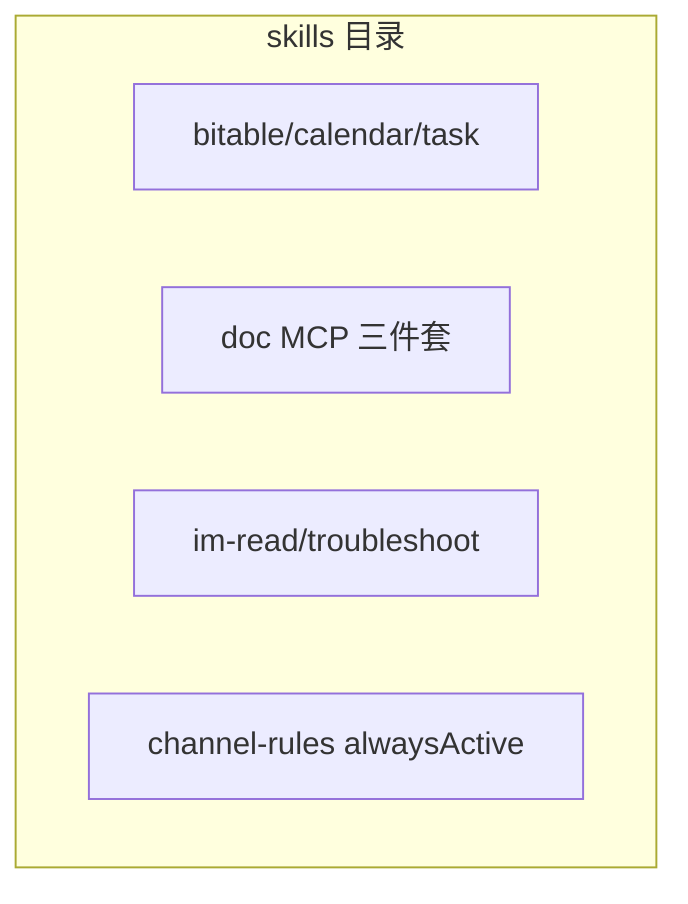

<details>
<summary>相关源文件</summary>

生成本页时使用的主要源文件：

- [openclaw.plugin.json](../../../project-repos/openclaw-lark/openclaw.plugin.json)
- [skills/feishu-bitable/SKILL.md](../../../project-repos/openclaw-lark/skills/feishu-bitable/SKILL.md)
- [skills/feishu-channel-rules/SKILL.md](../../../project-repos/openclaw-lark/skills/feishu-channel-rules/SKILL.md)
- [skills/feishu-create-doc/SKILL.md](../../../project-repos/openclaw-lark/skills/feishu-create-doc/SKILL.md)
- [package.json](../../../project-repos/openclaw-lark/package.json)

</details>

# 随包技能与文档资产

本仓库在发布物中包含 `skills/` 目录，并在 `openclaw.plugin.json` 中通过 `"skills": ["./skills"]` 声明为插件技能根目录，供 OpenClaw 在运行时加载与编排。

## 插件清单中的 skills 字段

`openclaw.plugin.json` 同时声明：

- `id: openclaw-lark`
- `channels: ["feishu"]`
- `skills: ["./skills"]`
- `configSchema` 与 `channelConfigs.feishu` 的占位 schema

Sources: [openclaw.plugin.json:1-17](../../../project-repos/openclaw-lark/openclaw.plugin.json#L1-L17)

<details class="source-snippets">
<summary>引用源码</summary>

<!-- source-snippets:start -->

#### `openclaw.plugin.json:1-17`

```json
{
  "id": "openclaw-lark",
  "channels": ["feishu"],
  "skills": ["./skills"],
  "configSchema": {
    "type": "object",
    "additionalProperties": false,
    "properties": {}
  },
  "channelConfigs": {
    "feishu": {
      "schema": {
        "type": "object"
      }
    }
  }
}
```

<!-- source-snippets:end -->
</details>

## 技能包主题分布（按目录名）



仓库 `skills/` 下当前包含（以目录名为准）：

- `feishu-bitable`：多维表格字段/记录/筛选/批量与错误码排障
- `feishu-calendar`：日历/日程/参会人/忙闲与会议室异步预约说明
- `feishu-channel-rules`：Lark 输出风格规范（`alwaysActive: true`）
- `feishu-create-doc` / `feishu-fetch-doc` / `feishu-update-doc`：MCP 文档创建、读取、更新（含 Lark-flavored Markdown 规则）
- `feishu-im-read`：用户身份读消息与资源下载组合
- `feishu-task`：任务/清单/附件/Agent 注册等工作流
- `feishu-troubleshoot`：FAQ 与 `/feishu doctor` 诊断指引

Sources: [package.json:18-22](../../../project-repos/openclaw-lark/package.json#L18-L22)

<details class="source-snippets">
<summary>引用源码</summary>

<!-- source-snippets:start -->

#### `package.json:18-22`

```json
  },
  "files": [
    "bin/",
    "dist/",
    "skills/",
```

<!-- source-snippets:end -->
</details>

## `feishu-bitable`：典型 Skill 结构

`feishu-bitable/SKILL.md` 采用「执行前必读 → 意图索引表 → 核心约束 → 场景示例 → 常见错误码」结构，并引用同目录 `references/*.md` 作为深度附录（字段 property、记录值结构、完整示例）。

Sources: [skills/feishu-bitable/SKILL.md:14-45](../../../project-repos/openclaw-lark/skills/feishu-bitable/SKILL.md#L14-L45)

<details class="source-snippets">
<summary>引用源码</summary>

<!-- source-snippets:start -->

#### `skills/feishu-bitable/SKILL.md:14-45`

```markdown
# Feishu Bitable (多维表格) SKILL

## 🚨 执行前必读

- ✅ **创建数据表**：支持两种模式 — ① 明确需求时，在 `create` 时通过 `table.fields` 一次性定义字段（减少 API 调用）；② 探索式场景时，使用默认表 + 逐步修改字段（更稳定，易调整）
- ⚠️ **默认表的空行坑**：`app.create` 自带的默认表中会有空记录（空行）！插入数据前建议先调用 `feishu_bitable_app_table_record.list` + `batch_delete` 删除空行，避免数据污染
- ✅ **写记录前**：先调用 `feishu_bitable_app_table_field.list` 获取字段 type/ui_type
- ✅ **人员字段**：默认 open_id（ou_...），值必须是 `[{id:"ou_xxx"}]`（数组对象）
- ✅ **日期字段**：毫秒时间戳（例如 `1674206443000`），不是秒
- ✅ **单选字段**：字符串（例如 `"选项1"`），不是数组
- ✅ **多选字段**：字符串数组（例如 `["选项1", "选项2"]`）
- ✅ **附件字段**：必须先上传到当前多维表格，使用返回的 file_token
- ✅ **批量上限**：单次 ≤ 500 条，超过需分批（批量操作是原子性的）
- ✅ **并发限制**：同一数据表不支持并发写，需串行调用 + 延迟 0.5-1 秒

---

## 📋 快速索引：意图 → 工具 → 必填参数

| 用户意图 | 工具 | action | 必填参数 | 常用可选 |
|---------|------|--------|---------|---------|
| 查表有哪些字段 | feishu_bitable_app_table_field | list | app_token, table_id | - |
| 查记录 | feishu_bitable_app_table_record | list | app_token, table_id | filter, sort, field_names |
| 新增一行 | feishu_bitable_app_table_record | create | app_token, table_id, fields | - |
| 批量导入 | feishu_bitable_app_table_record | batch_create | app_token, table_id, records (≤500) | - |
| 更新一行 | feishu_bitable_app_table_record | update | app_token, table_id, record_id, fields | - |
| 批量更新 | feishu_bitable_app_table_record | batch_update | app_token, table_id, records (≤500) | - |
| 创建多维表格 | feishu_bitable_app | create | name | folder_token |
| 创建数据表 | feishu_bitable_app_table | create | app_token, name | fields |
| 创建字段 | feishu_bitable_app_table_field | create | app_token, table_id, field_name, type | property |
| 创建视图 | feishu_bitable_app_table_view | create | app_token, table_id, view_name, view_type | - |

```

<!-- source-snippets:end -->
</details>

## `feishu-channel-rules`：会话级始终激活规则

该 skill 在 frontmatter 中声明 `alwaysActive: true`，用于约束模型在飞书会话中的输出风格（短句、少仪式感、注意飞书 Markdown 差异等）。

Sources: [skills/feishu-channel-rules/SKILL.md:1-18](../../../project-repos/openclaw-lark/skills/feishu-channel-rules/SKILL.md#L1-L18)

<details class="source-snippets">
<summary>引用源码</summary>

<!-- source-snippets:start -->

#### `skills/feishu-channel-rules/SKILL.md:1-18`

```markdown
---
name: feishu-channel-rules
description: |
  Lark/Feishu channel output rules. Always active in Lark conversations.
alwaysActive: true
---

# Lark Output Rules

## Writing Style

- Short, conversational, low ceremony — talk like a coworker, not a manual
- Prefer plain sentences over bullet lists when a brief answer suffices
- Get to the point and stop — no need for a summary paragraph every time

## Note

- Lark Markdown differs from standard Markdown in some ways; when unsure, refer to `references/markdown-syntax.md`
```

<!-- source-snippets:end -->
</details>

## 本 DeepWiki 的中文技能副本

为便于审阅，本输出目录同步提供 `project-wiki/openclaw-lark/skills/**/SKILL.md` 的中文副本（与源仓库技能一一对应；其中 `feishu-channel-rules` 将英文说明译为中文，其余以源文件中文内容为主）。

## 相关页面

- [飞书工具面：OAPI、MCP 文档与交互](feishu-tools-surface.md)
- [项目概览](overview.md)
- [测试、CI 与质量门禁](testing-ci-and-quality.md)
