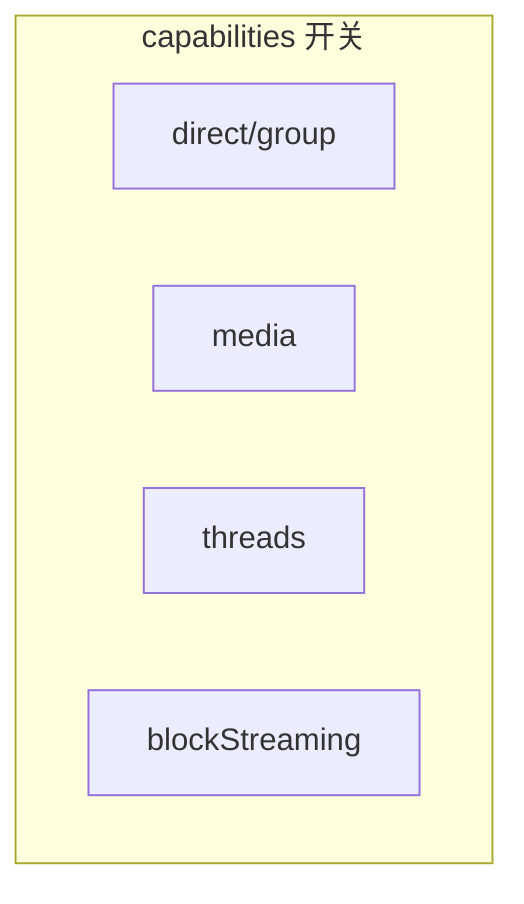

<details>
<summary>相关源文件</summary>

生成本页时使用的主要源文件：

- [src/channel/plugin.ts](../../../project-repos/openclaw-lark/src/channel/plugin.ts)
- [src/core/config-schema.ts](../../../project-repos/openclaw-lark/src/core/config-schema.ts)
- [src/channel/config-adapter.ts](../../../project-repos/openclaw-lark/src/channel/config-adapter.ts)
- [src/messaging/outbound/outbound.ts](../../../project-repos/openclaw-lark/src/messaging/outbound/outbound.ts)

</details>

# 频道契约、能力与配置

`feishuPlugin` 把飞书侧能力映射为 OpenClaw `ChannelPlugin` 契约：`capabilities` 声明支持的会话类型与特性位；`configSchema` 暴露 JSON Schema；`config` 适配器负责账号列举、启用/删除与 allowlist 格式化；`security.collectWarnings` 把账号级风险提示汇总给核心。

## 能力与 Agent 提示



`capabilities` 声明 `chatTypes: ['direct','group']`，并打开 `media`、`reactions`、`threads`、`nativeCommands`、`blockStreaming` 等开关。

`agentPrompt.messageToolHints` 返回一组 **面向模型的操作提示**（例如飞书 target 省略规则、交互卡片、表情类型需使用大写枚举名、删除类 action 的 message_id 选择等）。

Sources: [src/channel/plugin.ts:118-138](../../../project-repos/openclaw-lark/src/channel/plugin.ts#L118-L138)

<details class="source-snippets">
<summary>引用源码</summary>

<!-- source-snippets:start -->

#### `src/channel/plugin.ts:118-138`

```typescript
  capabilities: {
    chatTypes: ['direct', 'group'],
    media: true,
    reactions: true,
    threads: true,
    polls: false,
    nativeCommands: true,
    blockStreaming: true,
  },

  // -------------------------------------------------------------------------
  // Agent prompt
  // -------------------------------------------------------------------------

  agentPrompt: {
    messageToolHints: () => [
      '- Feishu targeting: omit `target` to reply to the current conversation (auto-inferred). Explicit targets: `user:open_id` or `chat:chat_id`.',
      '- Feishu supports interactive cards for rich messages.',
      '- Feishu reactions use UPPERCASE emoji type names (e.g. `OK`,`THUMBSUP`,`THANKS`,`MUSCLE`,`FINGERHEART`,`APPLAUSE`,`FISTBUMP`,`JIAYI`,`DONE`,`SMILE`,`BLUSH` ), not Unicode emoji characters.',
      "- Feishu `action=delete`/`action=unsend` only deletes messages sent by the bot. When the user quotes a message and says 'delete this', use the **quoted message's** message_id, not the user's own message_id.",
    ],
```

<!-- source-snippets:end -->
</details>

## 群组工具策略与配置热更新

`groups.resolveToolPolicy` 绑定到 `resolveFeishuGroupToolPolicy`（见入站策略相关模块）。

`reload.configPrefixes` 设为 `['channels.feishu']`，表示该频道关注顶层配置中飞书段落的变化以触发重载路径（具体重载语义由 OpenClaw 核心解释）。

Sources: [src/channel/plugin.ts:145-153](../../../project-repos/openclaw-lark/src/channel/plugin.ts#L145-L153)

<details class="source-snippets">
<summary>引用源码</summary>

<!-- source-snippets:start -->

#### `src/channel/plugin.ts:145-153`

```typescript
  groups: {
    resolveToolPolicy: resolveFeishuGroupToolPolicy,
  },

  // -------------------------------------------------------------------------
  // Reload
  // -------------------------------------------------------------------------

  reload: { configPrefixes: ['channels.feishu'] },
```

<!-- source-snippets:end -->
</details>

## JSON Schema：从 Zod 生成

`config-schema.ts` 以 Zod 描述飞书配置（含 `dmPolicy`、`groupPolicy`、`connectionMode`、`replyMode` 等枚举/联合类型），为运行时校验与默认值提供单一来源；`plugin.ts` 将 `FEISHU_CONFIG_JSON_SCHEMA` 挂到 `configSchema.schema`。

Sources: [src/core/config-schema.ts:5-33](../../../project-repos/openclaw-lark/src/core/config-schema.ts#L5-L33), [src/channel/plugin.ts:155-161](../../../project-repos/openclaw-lark/src/channel/plugin.ts#L155-L161)

<details class="source-snippets">
<summary>引用源码</summary>

<!-- source-snippets:start -->

#### `src/core/config-schema.ts:5-33`

```typescript
 * Zod-based configuration schema for the OpenClaw Lark/Feishu channel plugin.
 *
 * Provides runtime validation, sensible defaults, and cross-field refinements
 * so that every consuming module can rely on well-typed configuration objects.
 */

import { toJSONSchema, z } from 'zod';

export { z };

// ---------------------------------------------------------------------------
// Shared micro-schemas
// ---------------------------------------------------------------------------

const DmPolicyEnum = z.enum(['open', 'pairing', 'allowlist', 'disabled']);
const GroupPolicyEnum = z.enum(['open', 'allowlist', 'disabled']);
const ConnectionModeEnum = z.enum(['websocket', 'webhook']);
const ReplyModeValue = z.enum(['auto', 'static', 'streaming']);
const ReplyModeSchema = z
  .union([
    ReplyModeValue,
    z.object({
      default: ReplyModeValue.optional(),
      group: ReplyModeValue.optional(),
      direct: ReplyModeValue.optional(),
    }),
  ])
  .optional();
const ChunkModeEnum = z.enum(['newline', 'paragraph', 'none']);
```

#### `src/channel/plugin.ts:155-161`

```typescript
  // -------------------------------------------------------------------------
  // Config schema (JSON Schema)
  // -------------------------------------------------------------------------

  configSchema: {
    schema: FEISHU_CONFIG_JSON_SCHEMA,
  },
```

<!-- source-snippets:end -->
</details>

## 账号配置合并与隔离警告

`config-adapter.ts` 集中处理「默认账号字段」与 `accounts` 命名账号的 patch 合并，并在流程中调用 `collectIsolationWarnings`，与多租户/多账号安全章节形成闭环。

Sources: [src/channel/config-adapter.ts:5-17](../../../project-repos/openclaw-lark/src/channel/config-adapter.ts#L5-L17), [src/channel/config-adapter.ts:17-18](../../../project-repos/openclaw-lark/src/channel/config-adapter.ts#L17-L18)

<details class="source-snippets">
<summary>引用源码</summary>

<!-- source-snippets:start -->

#### `src/channel/config-adapter.ts:5-17`

```typescript
 * Configuration merge helpers for Feishu account management.
 *
 * Centralises the pattern of merging a partial configuration patch
 * into the Feishu section of the top-level ClawdbotConfig, handling
 * both the default account (top-level fields) and named accounts
 * (nested under `accounts`).
 */

import type { ClawdbotConfig } from 'openclaw/plugin-sdk';
import { DEFAULT_ACCOUNT_ID } from 'openclaw/plugin-sdk/account-id';
import type { FeishuConfig } from '../core/types';
import { getLarkAccount, getLarkAccountIds } from '../core/accounts';
import { collectIsolationWarnings } from '../core/security-check';
```

#### `src/channel/config-adapter.ts:17-18`

```typescript
import { collectIsolationWarnings } from '../core/security-check';

```

<!-- source-snippets:end -->
</details>

## 出站适配器与 `channelData.feishu`

`outbound.ts` 定义 `ChannelOutboundAdapter`，并文档化 `ReplyPayload.channelData.feishu` 可承载的飞书原生内容（卡片 v1/v2 等）。这是 **Agent 输出如何映射回飞书消息形态** 的关键契约文件。

Sources: [src/messaging/outbound/outbound.ts:3-12](../../../project-repos/openclaw-lark/src/messaging/outbound/outbound.ts#L3-L12), [src/messaging/outbound/outbound.ts:30-38](../../../project-repos/openclaw-lark/src/messaging/outbound/outbound.ts#L30-L38)

<details class="source-snippets">
<summary>引用源码</summary>

<!-- source-snippets:start -->

#### `src/messaging/outbound/outbound.ts:3-12`

```typescript
/**
 * Copyright (c) 2026 ByteDance Ltd. and/or its affiliates
 * SPDX-License-Identifier: MIT
 *
 * Outbound message adapter for the Lark/Feishu channel plugin.
 *
 * Exposes a `ChannelOutboundAdapter` that the OpenClaw core uses to deliver
 * agent-generated replies back to Feishu chats. The adapter translates SDK
 * parameters and delegates to standalone sending functions.
 */
```

#### `src/messaging/outbound/outbound.ts:30-38`

```typescript
/**
 * Channel-specific payload for Feishu, carried in `ReplyPayload.channelData.feishu`.
 *
 * Callers (skills, tools, programmatic code) populate this structure to send
 * Feishu-native content that the standard text/media path cannot express.
 *
 * Both card v1 (Message Card) and v2 (CardKit) formats are supported.
 * The Feishu server distinguishes the version by the presence of `schema: "2.0"`.
 *
```

<!-- source-snippets:end -->
</details>

## 相关页面

- [OpenClaw 插件注册与运行时](plugin-openclaw-integration.md)
- [安全策略与多账号隔离](security-and-governance.md)
- [入站消息七阶段流水线](inbound-seven-stage-pipeline.md)
