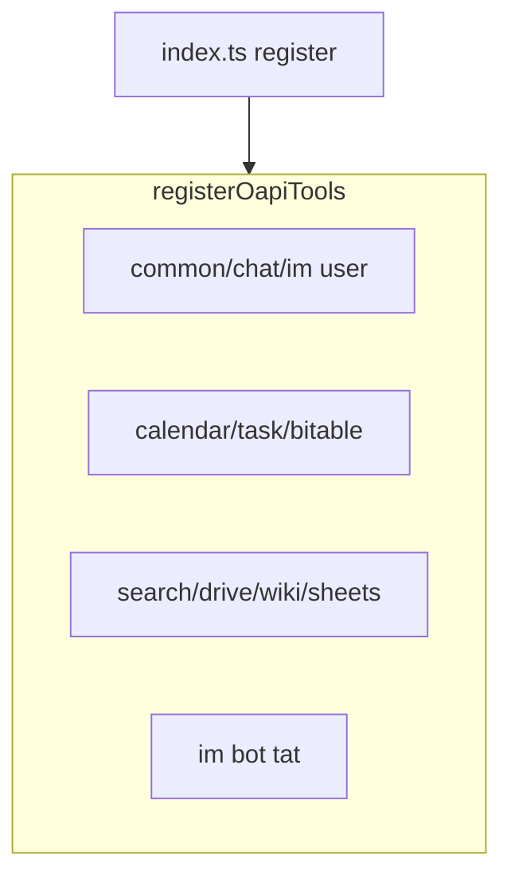

<details>
<summary>相关源文件</summary>

生成本页时使用的主要源文件：

- [src/tools/oapi/index.ts](../../../project-repos/openclaw-lark/src/tools/oapi/index.ts)
- [src/tools/mcp/doc/index.ts](../../../project-repos/openclaw-lark/src/tools/mcp/doc/index.ts)
- [src/tools/oauth.ts](../../../project-repos/openclaw-lark/src/tools/oauth.ts)
- [src/tools/ask-user-question.ts](../../../project-repos/openclaw-lark/src/tools/ask-user-question.ts)
- [src/tools/mcp/shared.ts](../../../project-repos/openclaw-lark/src/tools/mcp/shared.ts)

</details>

# 飞书工具面：OAPI、MCP 文档与交互

插件工具族可分为三条主线：**直连飞书开放平台的 OAPI 工具**、**通过 MCP 暴露的文档 create/fetch/update**、以及 **OAuth / 批量授权 / 交互式提问** 等横切工具。

## OAPI 工具注册全景

`registerOapiTools` 依次注册：

- 通用：`get_user`、`search_user`
- 会话：`chat`
- IM（用户身份）：`im`
- 日历：`calendar` / `event` / `event_attendee` / `freebusy`
- 任务：task、tasklist、attachment、section、comment、subtask、agent
- 多维表格：`bitable` 全系列
- 搜索：`search`
- 云盘：`drive`
- 知识库：`wiki`
- 电子表格：`sheets`
- IM（机器人身份，TAT）：`tat/im`

Sources: [src/tools/oapi/index.ts:46-94](../../../project-repos/openclaw-lark/src/tools/oapi/index.ts#L46-L94)

<details class="source-snippets">
<summary>引用源码</summary>

<!-- source-snippets:start -->

#### `src/tools/oapi/index.ts:46-94`

```typescript
export function registerOapiTools(api: OpenClawPluginApi): void {
  // Common tools
  registerGetUserTool(api);
  registerSearchUserTool(api);

  // Chat tools
  registerFeishuChatTools(api);

  // IM tools (user identity)
  registerFeishuImUserTools(api);

  // Calendar tools
  registerFeishuCalendarCalendarTool(api);
  registerFeishuCalendarEventTool(api);
  registerFeishuCalendarEventAttendeeTool(api);
  registerFeishuCalendarFreebusyTool(api);

  // Task tools
  registerFeishuTaskTaskTool(api);
  registerFeishuTaskTasklistTool(api);
  registerFeishuTaskAttachmentTool(api);
  registerFeishuTaskSectionTool(api);
  registerFeishuTaskCommentTool(api);
  registerFeishuTaskSubtaskTool(api);
  registerFeishuTaskAgentTool(api);

  // Bitable tools
  registerFeishuBitableAppTool(api);
  registerFeishuBitableAppTableTool(api);
  registerFeishuBitableAppTableRecordTool(api);
  registerFeishuBitableAppTableFieldTool(api);
  registerFeishuBitableAppTableViewTool(api);

  // Search tools
  registerFeishuSearchTools(api);

  // Drive tools
  registerFeishuDriveTools(api);

  // Wiki tools
  registerFeishuWikiTools(api);

  // Sheets tools
  registerFeishuSheetsTools(api);

  // IM tools (bot identity)
  registerFeishuImBotTools(api);

  api.logger.debug?.('Registered all OAPI tools (calendar, task, bitable, search, drive, wiki, sheets, im)');
```

<!-- source-snippets:end -->
</details>



Sources: [index.ts:115-116](../../../project-repos/openclaw-lark/index.ts#L115-L116)

<details class="source-snippets">
<summary>引用源码</summary>

<!-- source-snippets:start -->

#### `index.ts:115-116`

```typescript
    // Register OAPI tools (calendar, task - using Feishu Open API directly)
    registerOapiTools(api);
```

<!-- source-snippets:end -->
</details>

## MCP 文档工具：与 OAPI 的边界

`registerFeishuMcpDocTools` 明确：**仅保留 create/fetch/update**；`search/list` 已由 OAPI 版本替代，因此不再注册 MCP 侧对应工具。

注册前会检查：

- `api.config` 是否存在
- 是否存在启用账号
- `resolveAnyEnabledToolsConfig` 得到的 `doc` 开关是否为真

并从配置提取 `mcp_url` 作为 endpoint override（`extractMcpUrlFromConfig` + `setMcpEndpointOverride`）。

Sources: [src/tools/mcp/doc/index.ts:17-50](../../../project-repos/openclaw-lark/src/tools/mcp/doc/index.ts#L17-L50)

<details class="source-snippets">
<summary>引用源码</summary>

<!-- source-snippets:start -->

#### `src/tools/mcp/doc/index.ts:17-50`

```typescript
/**
 * 注册 MCP Doc 工具（仅保留 create/fetch/update，search/list 已由 OAPI 替代）
 */
export function registerFeishuMcpDocTools(api: OpenClawPluginApi): void {
  if (!api.config) {
    api.logger.debug?.('feishu_doc: No config available, skipping');
    return;
  }

  const accounts = getEnabledLarkAccounts(api.config);
  if (accounts.length === 0) {
    api.logger.debug?.('feishu_doc: No Feishu accounts configured, skipping');
    return;
  }

  // 沿用现有 doc 开关：若所有账户都关闭 doc 工具，则 MCP doc 工具也不注册
  const toolsCfg = resolveAnyEnabledToolsConfig(accounts);
  if (!toolsCfg.doc) {
    api.logger.debug?.('feishu_doc: doc tool disabled in all accounts');
    return;
  }

  // 将 mcp_url（若配置）缓存为全局 override，供后续工具调用使用
  const mcpEndpoint = extractMcpUrlFromConfig(api.config);
  setMcpEndpointOverride(mcpEndpoint);

  // 注册工具（search/list 已由 OAPI 版本替代，不再注册）
  const registered: string[] = [];
  if (registerFetchDocTool(api)) registered.push('feishu_fetch_doc');
  if (registerCreateDocTool(api)) registered.push('feishu_create_doc');
  if (registerUpdateDocTool(api)) registered.push('feishu_update_doc');
  if (registered.length > 0) {
    api.logger.debug?.(`feishu_doc: Registered ${registered.join(', ')}`);
  }
```

<!-- source-snippets:end -->
</details>

## OAuth 与交互式用户提问

`index.ts` 同时注册 `registerFeishuOAuthTool`（UAT device flow）与 `registerFeishuOAuthBatchAuthTool`（批量授权应用 scope），以及 `registerAskUserQuestionTool`（基于卡片的用户提问）。

Sources: [index.ts:121-128](../../../project-repos/openclaw-lark/index.ts#L121-L128)

<details class="source-snippets">
<summary>引用源码</summary>

<!-- source-snippets:start -->

#### `index.ts:121-128`

```typescript
    // Register OAuth tool (UAT device flow authorization)
    registerFeishuOAuthTool(api);

    // Register OAuth batch auth tool (batch authorization for all app scopes)
    registerFeishuOAuthBatchAuthTool(api);

    // Register AskUserQuestion tool (interactive card-based user prompting)
    registerAskUserQuestionTool(api);
```

<!-- source-snippets:end -->
</details>

## MCP 共享工具：endpoint 与配置解析

`registerFeishuMcpDocTools` 从 `../shared` 引入 `extractMcpUrlFromConfig` 与 `setMcpEndpointOverride`，用于从 OpenClaw 配置提取 MCP URL 并在进程内缓存 override，供后续 MCP 工具调用链复用。

Sources: [src/tools/mcp/doc/index.ts:10-15](../../../project-repos/openclaw-lark/src/tools/mcp/doc/index.ts#L10-L15), [src/tools/mcp/shared.ts:1-40](../../../project-repos/openclaw-lark/src/tools/mcp/shared.ts#L1-L40)

<details class="source-snippets">
<summary>引用源码</summary>

<!-- source-snippets:start -->

#### `src/tools/mcp/doc/index.ts:10-15`

```typescript
import { getEnabledLarkAccounts } from '../../../core/accounts';
import { resolveAnyEnabledToolsConfig } from '../../../core/tools-config';
import { extractMcpUrlFromConfig, setMcpEndpointOverride } from '../shared';
import { registerFetchDocTool } from './fetch';
import { registerCreateDocTool } from './create';
import { registerUpdateDocTool } from './update';
```

#### `src/tools/mcp/shared.ts:1-40`

```typescript
/**
 * Copyright (c) 2026 ByteDance Ltd. and/or its affiliates
 * SPDX-License-Identifier: MIT
 *
 * MCP 工具的共享代码（所有业务域共享）
 * 包含：MCP 客户端、类型定义、通用辅助函数
 */

import fs from 'node:fs';
import path from 'node:path';
import type { OpenClawPluginApi } from 'openclaw/plugin-sdk';
import type { TSchema } from '@sinclair/typebox';
import { createToolContext, formatToolResult, registerTool } from '../helpers';
import { handleInvokeErrorWithAutoAuth } from '../oapi/helpers';
import { getUserAgent } from '../../core/version';
import { mcpDomain } from '../../core/domains';
import type { LarkBrand } from '../../core/types';

// ---------------------------------------------------------------------------
// 类型定义
// ---------------------------------------------------------------------------

export interface McpRpcSuccess {
  jsonrpc: '2.0';
  id: number | string;
  result: unknown;
}

export interface McpRpcError {
  jsonrpc: '2.0';
  id: number | string | null;
  error: { code: number; message: string; data?: unknown };
}

export type McpRpcResponse = McpRpcSuccess | McpRpcError;

import type { ToolActionKey } from '../../core/scope-manager';

export interface McpToolConfig<T = unknown> {
  name: string;
```

<!-- source-snippets:end -->
</details>

## 相关页面

- [OpenClaw 插件注册与运行时](plugin-openclaw-integration.md)
- [随包技能与文档资产](bundled-skills.md)
- [出站回复、卡片与流式输出](outbound-reply-cards.md)
