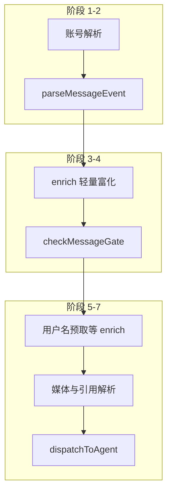

<details>
<summary>相关源文件</summary>

生成本页时使用的主要源文件：

- [src/messaging/inbound/handler.ts](../../../project-repos/openclaw-lark/src/messaging/inbound/handler.ts)
- [src/messaging/inbound/parse.ts](../../../project-repos/openclaw-lark/src/messaging/inbound/parse.ts)
- [src/messaging/inbound/gate.ts](../../../project-repos/openclaw-lark/src/messaging/inbound/gate.ts)
- [src/messaging/inbound/dispatch.ts](../../../project-repos/openclaw-lark/src/messaging/inbound/dispatch.ts)
- [src/messaging/inbound/policy.ts](../../../project-repos/openclaw-lark/src/messaging/inbound/policy.ts)

</details>

# 入站消息七阶段流水线

`handleFeishuMessage` 是飞书事件进入 OpenClaw Agent 的 **总编排函数**：源码注释将其拆为七个阶段，从账号解析、解析与富化、策略门禁，到最终 `dispatchToAgent`。

## 七阶段总览



Sources: [src/messaging/inbound/handler.ts:5-14](../../../project-repos/openclaw-lark/src/messaging/inbound/handler.ts#L5-L14), [src/messaging/inbound/handler.ts:50-66](../../../project-repos/openclaw-lark/src/messaging/inbound/handler.ts#L50-L66)

<details class="source-snippets">
<summary>引用源码</summary>

<!-- source-snippets:start -->

#### `src/messaging/inbound/handler.ts:5-14`

```typescript
 * Inbound message handling pipeline for the Lark/Feishu channel plugin.
 *
 * Orchestrates a seven-stage pipeline:
 *   1. Account resolution
 *   2. Event parsing         → parse.ts (merge_forward expanded in-place)
 *   3. Sender enrichment     → enrich.ts (lightweight, before gate)
 *   4. Policy gate           → gate.ts
 *   5. User name prefetch    → enrich.ts (batch cache warm-up)
 *   6. Content resolution    → enrich.ts (media / quote, parallel)
 *   7. Agent dispatch        → dispatch.ts
```

#### `src/messaging/inbound/handler.ts:50-66`

```typescript
export async function handleFeishuMessage(params: {
  cfg: ClawdbotConfig;
  event: FeishuMessageEvent;
  botOpenId?: string;
  runtime?: RuntimeEnv;
  chatHistories?: Map<string, HistoryEntry[]>;
  accountId?: string;
  /** Override the message ID used for reply threading (typing indicators,
   *  card replies, etc.).  Useful for synthetic messages whose message_id
   *  is not a real Feishu message ID. */
  replyToMessageId?: string;
  /** When true, skip the policy gate (mention requirement, allowlist).
   *  Used for synthetic messages that are not real user messages. */
  forceMention?: boolean;
  /** When true, skip the typing indicator for this dispatch (e.g. reactions). */
  skipTyping?: boolean;
}): Promise<void> {
```

<!-- source-snippets:end -->
</details>

## 多账号配置隔离（构造 account 级 cfg）

`handler.ts` 在账号解析后构造 **account 级别的 `ClawdbotConfig` 视图**，用于让 SDK 的 `resolveGroupPolicy` / `resolveRequireMention` 等逻辑读取到 per-account 覆盖值（注释解释：SDK 默认从顶层 `cfg.channels.feishu` 读取，而多账号需要独立策略）。

Sources: [src/messaging/inbound/handler.ts:74-79](../../../project-repos/openclaw-lark/src/messaging/inbound/handler.ts#L74-L79)

<details class="source-snippets">
<summary>引用源码</summary>

<!-- source-snippets:start -->

#### `src/messaging/inbound/handler.ts:74-79`

```typescript
  // ★ 多账号配置隔离：构造 account 级别的 ClawdbotConfig
  //
  //   在多账号场景下，每个 account 可以独立配置 groupPolicy / requireMention
  //   等策略。但 SDK 的 resolveGroupPolicy / resolveRequireMention 等函数从
  //   cfg.channels.feishu 读取配置，而 cfg 是顶层全局配置，不包含 per-account
  //   的覆盖值。
```

<!-- source-snippets:end -->
</details>

## 策略门禁：群与发送者两层模型

`gate.ts` 文档化群聊访问 **Layer 1（哪些群允许）** 与 **Layer 2（群内哪些发送者允许）**，并说明与 Telegram 插件一致的两层模型；同时导出 `resolveRespondToMentionAll` 的优先级链（群配置 > 默认群配置 > 账号配置 > false）。

Sources: [src/messaging/inbound/gate.ts:5-24](../../../project-repos/openclaw-lark/src/messaging/inbound/gate.ts#L5-L24), [src/messaging/inbound/gate.ts:41-56](../../../project-repos/openclaw-lark/src/messaging/inbound/gate.ts#L41-L56)

<details class="source-snippets">
<summary>引用源码</summary>

<!-- source-snippets:start -->

#### `src/messaging/inbound/gate.ts:5-24`

```typescript
 * Policy gate for inbound Feishu messages.
 *
 * Determines whether a parsed message should be processed or rejected
 * based on group/DM access policies, sender allowlists, and mention
 * requirements.
 *
 * Group access follows the same two-layer model as Telegram:
 *
 *   Layer 1 – Which GROUPS are allowed (SDK `resolveGroupPolicy`):
 *     - No `groups` configured + `groupPolicy: "open"` → any group passes
 *     - `groupPolicy: "allowlist"` or `groups` configured → acts as allowlist
 *       (explicit group IDs or `"*"` wildcard)
 *     - `groupPolicy: "disabled"` → all groups blocked
 *
 *   Layer 2 – Which SENDERS are allowed within a group:
 *     - Per-group `groupPolicy` overrides global for sender filtering
 *     - `groupAllowFrom` (global) + per-group `allowFrom` are merged
 *     - `"open"` → any sender; `"allowlist"` → check merged list;
 *       `"disabled"` → block all senders
 */
```

#### `src/messaging/inbound/gate.ts:41-56`

```typescript
/**
 * Resolve the effective `respondToMentionAll` setting.
 *
 * Precedence: per-group > default ("*") group > global account config > false.
 */
export function resolveRespondToMentionAll(params: {
  groupConfig?: { respondToMentionAll?: boolean };
  defaultConfig?: { respondToMentionAll?: boolean };
  accountFeishuCfg?: { respondToMentionAll?: boolean };
}): boolean {
  return (
    params.groupConfig?.respondToMentionAll ??
    params.defaultConfig?.respondToMentionAll ??
    params.accountFeishuCfg?.respondToMentionAll ??
    false
  );
```

<!-- source-snippets:end -->
</details>

## Agent 分发：命令路径与评论目标等特殊分支

`dispatch.ts` 说明其职责：构造 agent envelope、拼接历史上下文，并走系统命令 vs 正常流式/静态回复路径；并拆分 `dispatch-context.ts`、`dispatch-builders.ts`、`dispatch-commands.ts` 等模块。

其中 **评论目标** 无法走标准 IM 流式卡片路径，因此使用 SDK 的 buffered block dispatcher，并通过 Drive 评论回复 API 发送（源码注释直接写明约束）。

Sources: [src/messaging/inbound/dispatch.ts:5-15](../../../project-repos/openclaw-lark/src/messaging/inbound/dispatch.ts#L5-L15), [src/messaging/inbound/dispatch.ts:70-76](../../../project-repos/openclaw-lark/src/messaging/inbound/dispatch.ts#L70-L76)

<details class="source-snippets">
<summary>引用源码</summary>

<!-- source-snippets:start -->

#### `src/messaging/inbound/dispatch.ts:5-15`

```typescript
 * Agent dispatch for inbound Feishu messages.
 *
 * Builds the agent envelope, prepends chat history context, and
 * dispatches through the appropriate reply path (system command
 * vs. normal streaming/static flow).
 *
 * Implementation details are split across focused modules:
 * - dispatch-context.ts  — DispatchContext type, route/session/event
 * - dispatch-builders.ts — pure payload/body/envelope construction
 * - dispatch-commands.ts — system command & permission notification
 */
```

#### `src/messaging/inbound/dispatch.ts:70-76`

```typescript
/**
 * Dispatch a comment-target message via the buffered block dispatcher.
 *
 * Comment targets cannot use the streaming card flow (IM APIs don't
 * understand comment:... targets). Instead we use the SDK's buffered
 * block dispatcher with a deliver callback that sends via the Drive
 * comment reply API.
```

<!-- source-snippets:end -->
</details>

## 群组工具策略入口

`policy.ts` 被 `handler.ts` 与 `gate.ts` 引用，用于解析群配置、allowlist 与 sender policy 上下文；与 `plugin.ts` 中 `groups.resolveToolPolicy` 形成「工具可见性/群策略」相关闭环。

Sources: [src/messaging/inbound/handler.ts:40-42](../../../project-repos/openclaw-lark/src/messaging/inbound/handler.ts#L40-L42), [src/channel/plugin.ts:145-147](../../../project-repos/openclaw-lark/src/channel/plugin.ts#L145-L147)

<details class="source-snippets">
<summary>引用源码</summary>

<!-- source-snippets:start -->

#### `src/messaging/inbound/handler.ts:40-42`

```typescript
import { injectInboundHandler } from './handler-registry';
import { dispatchToAgent } from './dispatch';
import { resolveFeishuGroupConfig, splitLegacyGroupAllowFrom } from './policy';
```

#### `src/channel/plugin.ts:145-147`

```typescript
  groups: {
    resolveToolPolicy: resolveFeishuGroupToolPolicy,
  },
```

<!-- source-snippets:end -->
</details>

## 相关页面

- [出站回复、卡片与流式输出](outbound-reply-cards.md)
- [安全策略与多账号隔离](security-and-governance.md)
- [系统架构](system-architecture.md)
