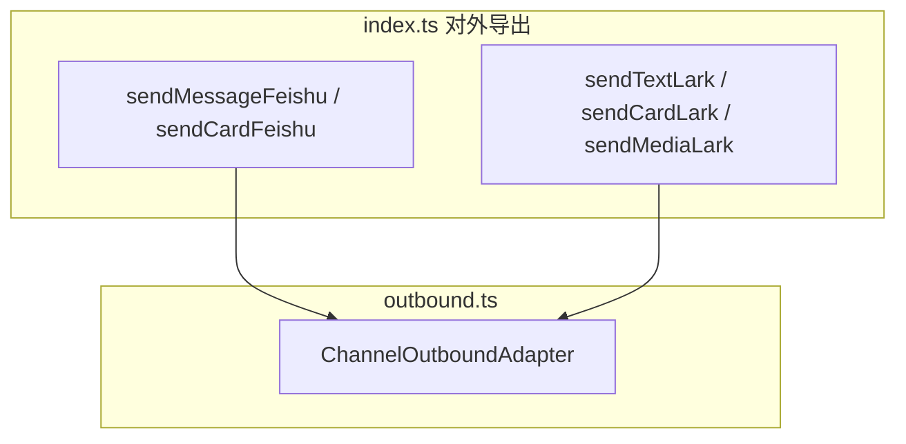

<details>
<summary>相关源文件</summary>

生成本页时使用的主要源文件：

- [src/messaging/outbound/send.ts](../../../project-repos/openclaw-lark/src/messaging/outbound/send.ts)
- [src/messaging/outbound/deliver.ts](../../../project-repos/openclaw-lark/src/messaging/outbound/deliver.ts)
- [src/card/reply-dispatcher.ts](../../../project-repos/openclaw-lark/src/card/reply-dispatcher.ts)
- [src/card/tool-use-trace-store.ts](../../../project-repos/openclaw-lark/src/card/tool-use-trace-store.ts)
- [src/card/tool-use-config.ts](../../../project-repos/openclaw-lark/src/card/tool-use-config.ts)

</details>

# 出站回复、卡片与流式输出

出站路径的核心目标：把 Agent 输出 **交付回飞书会话**，并在需要时使用 **消息卡片** 承载流式更新、工具执行过程与用户交互（例如确认按钮）。

## dispatch 与 reply-dispatcher 的关系

`dispatch.ts` 引入 `createFeishuReplyDispatcher`、`resolveToolUseDisplayConfig`、`startToolUseTraceRun` / `clearToolUseTraceRun` 等符号，用于把一次 Agent 回复与 **卡片调度器**、**工具调用可视化配置**、**追踪 run** 绑定起来。

Sources: [src/messaging/inbound/dispatch.ts:24-33](../../../project-repos/openclaw-lark/src/messaging/inbound/dispatch.ts#L24-L33)

<details class="source-snippets">
<summary>引用源码</summary>

<!-- source-snippets:start -->

#### `src/messaging/inbound/dispatch.ts:24-33`

```typescript
import { createFeishuReplyDispatcher } from '../../card/reply-dispatcher';
import {
  buildQueueKey,
  registerActiveDispatcher,
  threadScopedKey,
  unregisterActiveDispatcher,
} from '../../channel/chat-queue';
import { resolveToolUseDisplayConfig } from '../../card/tool-use-config';
import { clearToolUseTraceRun, startToolUseTraceRun } from '../../card/tool-use-trace-store';
import { isLikelyAbortText } from '../../channel/abort-detect';
```

<!-- source-snippets:end -->
</details>

## 发送与交付分层



`index.ts` 对外 re-export 了 `sendMessageFeishu`、`sendCardFeishu`、`updateCardFeishu`、`editMessageFeishu` 以及 `sendTextLark` / `sendCardLark` / `sendMediaLark` 等函数，体现「底层发送原语」与「按类型 deliver」的分层。

Sources: [index.ts:39-57](../../../project-repos/openclaw-lark/index.ts#L39-L57)

<details class="source-snippets">
<summary>引用源码</summary>

<!-- source-snippets:start -->

#### `index.ts:39-57`

```typescript
export { monitorFeishuProvider } from './src/channel/monitor';
export { sendMessageFeishu, sendCardFeishu, updateCardFeishu, editMessageFeishu } from './src/messaging/outbound/send';
export { getMessageFeishu } from './src/messaging/outbound/fetch';
export {
  uploadImageLark,
  uploadFileLark,
  sendImageLark,
  sendFileLark,
  sendAudioLark,
  uploadAndSendMediaLark,
} from './src/messaging/outbound/media';
export {
  sendTextLark,
  sendCardLark,
  sendMediaLark,
  type SendTextLarkParams,
  type SendCardLarkParams,
  type SendMediaLarkParams,
} from './src/messaging/outbound/deliver';
```

<!-- source-snippets:end -->
</details>

## 工具调用追踪：与插件钩子联动

插件在 `before_tool_call` / `after_tool_call` 中调用 `recordToolUseStart` / `recordToolUseEnd`（见 `src/card/tool-use-trace-store.ts`），为卡片层提供一次 run 的工具时间线数据。

Sources: [index.ts:130-151](../../../project-repos/openclaw-lark/index.ts#L130-L151)

<details class="source-snippets">
<summary>引用源码</summary>

<!-- source-snippets:start -->

#### `index.ts:130-151`

```typescript
    api.on('before_tool_call', (event, ctx) => {
      recordToolUseStart({
        sessionKey: ctx.sessionKey,
        toolName: event.toolName,
        toolParams: event.params,
        toolCallId: event.toolCallId ?? ctx.toolCallId,
        runId: event.runId ?? ctx.runId,
      });
      if (!event.toolName.startsWith('feishu_')) return;
      const paramsPreview = sanitizeParamsForLog(event.params);
      log.info(`tool call: ${event.toolName} session=${ctx.sessionKey ?? '-'} params=${paramsPreview}`);
    });

    api.on('after_tool_call', (event, ctx) => {
      recordToolUseEnd({
        sessionKey: ctx.sessionKey,
        toolName: event.toolName,
        toolParams: event.params,
        toolCallId: event.toolCallId ?? ctx.toolCallId,
        runId: event.runId ?? ctx.runId,
        result: event.result,
        error: event.error,
```

<!-- source-snippets:end -->
</details>

## `channelData.feishu`：卡片版本与扩展载荷

`outbound.ts` 详细说明 `ReplyPayload.channelData.feishu` 可携带卡片数据，并指出飞书服务端通过是否出现 `schema: "2.0"` 区分卡片版本（v1 Message Card vs v2 CardKit）。这与 README 中「交互式卡片 / 流式回复」的产品描述在机制层对齐。

Sources: [src/messaging/outbound/outbound.ts:30-38](../../../project-repos/openclaw-lark/src/messaging/outbound/outbound.ts#L30-L38), [README.zh.md:24-28](../../../project-repos/openclaw-lark/README.zh.md#L24-L28)

<details class="source-snippets">
<summary>引用源码</summary>

<!-- source-snippets:start -->

#### `src/messaging/outbound/outbound.ts:30-38`

```typescript
/**
 * Channel-specific payload for Feishu, carried in `ReplyPayload.channelData.feishu`.
 *
 * Callers (skills, tools, programmatic code) populate this structure to send
 * Feishu-native content that the standard text/media path cannot express.
 *
 * Both card v1 (Message Card) and v2 (CardKit) formats are supported.
 * The Feishu server distinguishes the version by the presence of `schema: "2.0"`.
 *
```

#### `README.zh.md:24-28`

```markdown
此外，插件还支持：
- **📱 交互式卡片**：实时状态更新（思考中/生成中/完成状态），提供敏感操作的确认按钮
- **🌊 流式回复**：在消息卡片中提供实时的流式响应
- **🔒 权限策略**：为私聊和群聊提供灵活的访问控制策略
- **⚙️ 高级群组配置**：每个群聊的独立设置，包括白名单、技能绑定和自定义系统提示词
```

<!-- source-snippets:end -->
</details>

## 相关页面

- [入站消息七阶段流水线](inbound-seven-stage-pipeline.md)
- [飞书工具面：OAPI、MCP 文档与交互](feishu-tools-surface.md)
- [OpenClaw 插件注册与运行时](plugin-openclaw-integration.md)
