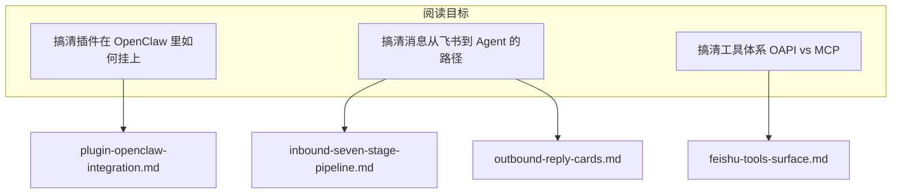

<details>
<summary>相关源文件</summary>

生成本页时使用的主要源文件：

- [README.md](../../../project-repos/openclaw-lark/README.md)
- [README.zh.md](../../../project-repos/openclaw-lark/README.zh.md)
- [package.json](../../../project-repos/openclaw-lark/package.json)
- [openclaw.plugin.json](../../../project-repos/openclaw-lark/openclaw.plugin.json)
- [LICENSE](../../../project-repos/openclaw-lark/LICENSE)

</details>

# 项目概览

`@larksuite/openclaw-lark` 是飞书/Lark 开放平台团队维护的 **OpenClaw 官方频道插件**：把飞书会话作为 OpenClaw 的 `feishu` 通道，向 Agent 暴露消息读写、云文档、多维表格、电子表格、日历与任务等能力，并配套交互式卡片、流式回复、权限策略与按群配置（白名单、技能绑定、自定义系统提示词等）。

下文区分 **用户文档表述** 与 **机器可读 manifest**：阅读排障时应以 `package.json`、`openclaw.plugin.json` 与源码为准。

## 能力矩阵与产品边界

README 以表格汇总能力类别（消息、文档、Base、Sheets、Calendar、Tasks）以及卡片、流式、权限策略、群组高级配置等横切能力；同时用显著篇幅提示模型幻觉、提示词注入与「以用户身份在授权范围内执行」的合规与安全风险，并建议将机器人作为私聊助手、避免拉入群聊。

Sources: [README.zh.md:9-33](../../../project-repos/openclaw-lark/README.zh.md#L9-L33), [README.md:30-37](../../../project-repos/openclaw-lark/README.md#L30-L37)

<details class="source-snippets">
<summary>引用源码</summary>

<!-- source-snippets:start -->

#### `README.zh.md:9-33`

```markdown
这是 OpenClaw 的官方  Lark/飞书 插件，由 Lark/飞书开放平台团队开发和维护。它将你的 OpenClaw Agent 无缝对接到  Lark/飞书 工作区，赋予其直接读写消息、文档、多维表格、日历、任务等应用的能力。

## 特性

本插件为 OpenClaw 提供了全面的 Lark/飞书集成能力，主要包括：

| 类别 | 能力 |
|------|------|
| 💬 消息 | 消息读取（群聊/单聊历史、话题回复）、消息发送、消息回复、消息搜索、图片/文件下载 |
| 📄 文档 | 创建云文档、更新云文档、读取云文档内容 |
| 📊 多维表格 | 创建/管理多维表格、数据表、字段、记录（增删改查、批量操作、高级筛选）、视图 |
| 📈 电子表格 | 创建、编辑、查看电子表格 |
| 📅 日历日程 | 日历管理、日程管理（创建/查询/修改/删除/搜索）、参会人管理、忙闲查询 |
| ✅ 任务 | 任务管理（创建/查询/更新/完成）、清单管理、子任务、评论 |

此外，插件还支持：
- **📱 交互式卡片**：实时状态更新（思考中/生成中/完成状态），提供敏感操作的确认按钮
- **🌊 流式回复**：在消息卡片中提供实时的流式响应
- **🔒 权限策略**：为私聊和群聊提供灵活的访问控制策略
- **⚙️ 高级群组配置**：每个群聊的独立设置，包括白名单、技能绑定和自定义系统提示词

## 安全与风险提示（使用前必读）
本插件对接 OpenClaw AI 自动化能力，存在模型幻觉、执行不可控、提示词注入等固有风险；授权飞书权限后，OpenClaw 将以您的用户身份在授权范围内执行操作，可能导致敏感数据泄露、越权操作等高风险后果，请您谨慎操作和使用。
为降低上述风险，插件已在多个层面启用默认安全保护以降低上述风险，但上述风险仍然存在。我们强烈建议不要主动修改任何默认安全配置；一旦放开相关限制，上述风险将显著提高，由此产生的后果需由您自行承担。
我们建议您将接入 OpenClaw 的飞书机器人作为私人对话助手使用，请勿将其拉入群聊或允许其他用户与其交互，以避免权限被滥用或数据泄露。
```

#### `README.md:30-37`

```markdown
## Security & Risk Warnings (Read Before Use)

This plugin integrates with OpenClaw AI automation capabilities and carries inherent risks such as model hallucinations, unpredictable execution, and prompt injection. After you authorize Lark/Feishu permissions, OpenClaw will act under your user identity within the authorized scope, which may lead to high-risk consequences such as leakage of sensitive data or unauthorized operations. Please use with caution.

To reduce these risks, the plugin enables default security protections at multiple layers. However, these risks still exist. We strongly recommend that you do not proactively modify any default security settings; once relevant restrictions are relaxed, the risks will increase significantly, and you will bear the consequences.

We recommend using the Lark/Feishu bot connected to OpenClaw as a private conversational assistant. Do not add it to group chats or allow other users to interact with it, to avoid abuse of permissions or data leakage.

```

<!-- source-snippets:end -->
</details>

## 运行环境与版本约束

`package.json` 要求 **Node.js >= 22**，使用 **pnpm** 作为 `packageManager`，构建入口为 `tsdown`，测试为 `vitest`。

OpenClaw 侧版本阈值在文档与 `package.json` 中 **表述不一致**（均为仓库客观事实，阅读时请勿混用）：

- 中文 README 写明需 **OpenClaw 2026.2.26 及以上**，并给出 `npm install -g openclaw` 升级示例。
- `package.json` 的 `peerDependencies` 声明为 **`openclaw >= 2026.3.22`**（`peerDependenciesMeta` 中将 `openclaw` 标为 optional，便于插件包独立开发构建）。

Sources: [README.zh.md:47-57](../../../project-repos/openclaw-lark/README.zh.md#L47-L57), [package.json:28-55](../../../project-repos/openclaw-lark/package.json#L28-L55)

<details class="source-snippets">
<summary>引用源码</summary>

<!-- source-snippets:start -->

#### `README.zh.md:47-57`

````markdown
## 安装与要求

在开始之前，请确保你已准备好以下各项：

- **Node.js**: `v22` 或更高版本。
- **OpenClaw**: OpenClaw 已成功安装并可运行。详情请访问 [OpenClaw 官方网站](https://openclaw.ai)。

> **注意**：OpenClaw 版本需在 **2026.2.26** 及以上，可通过 `openclaw -v` 命令查看。如果低于该版本可能出现异常，执行以下命令升级：
> ```bash
> npm install -g openclaw
> ```
````

#### `package.json:28-55`

```json
  "engines": {
    "node": ">=22"
  },
  "scripts": {
    "build": "tsdown",
    "release": "node scripts/release.mjs",
    "test": "vitest run",
    "test:watch": "vitest",
    "lint": "eslint src/ index.ts",
    "lint:fix": "eslint src/ index.ts --fix",
    "typecheck": "tsc --noEmit",
    "format": "prettier --write src/**/*.ts",
    "format:check": "prettier --check src/**/*.ts"
  },
  "dependencies": {
    "@larksuiteoapi/node-sdk": "^1.60.0",
    "@sinclair/typebox": "0.34.48",
    "image-size": "^2.0.2",
    "undici-types": "^8.1.0",
    "zod": "^4.3.6"
  },
  "peerDependencies": {
    "openclaw": ">=2026.3.22"
  },
  "peerDependenciesMeta": {
    "openclaw": {
      "optional": true
    }
```

<!-- source-snippets:end -->
</details>

## 插件清单与对外形态

`openclaw.plugin.json` 声明插件 `id`、支持的 `channels`、随包 `skills` 目录，以及 `channelConfigs.feishu` 的空 schema 占位（具体校验在运行时由代码侧 JSON Schema 提供，见频道配置章节）。

npm `files` 字段包含 `bin/`、`dist/`、`skills/`、`openclaw.plugin.json` 等，用于发布物裁剪。

Sources: [openclaw.plugin.json:1-17](../../../project-repos/openclaw-lark/openclaw.plugin.json#L1-L17), [package.json:16-26](../../../project-repos/openclaw-lark/package.json#L16-L26)

<details class="source-snippets">
<summary>引用源码</summary>

<!-- source-snippets:start -->

#### `openclaw.plugin.json:1-17`

```json
{
  "id": "openclaw-lark",
  "channels": ["feishu"],
  "skills": ["./skills"],
  "configSchema": {
    "type": "object",
    "additionalProperties": false,
    "properties": {}
  },
  "channelConfigs": {
    "feishu": {
      "schema": {
        "type": "object"
      }
    }
  }
}
```

#### `package.json:16-26`

```json
  "bin": {
    "openclaw-lark": "bin/openclaw-lark.js"
  },
  "files": [
    "bin/",
    "dist/",
    "skills/",
    "openclaw.plugin.json",
    "README.md",
    "LICENSE"
  ],
```

<!-- source-snippets:end -->
</details>

## 对外文档与贡献入口

README 指向飞书官方使用指南文档链接；贡献指引与 Issue/PR 链接在英文 README 中给出（中文 README 同步贡献段落）。

Sources: [README.md:64-72](../../../project-repos/openclaw-lark/README.md#L64-L72), [README.zh.md:59-66](../../../project-repos/openclaw-lark/README.zh.md#L59-L66)

<details class="source-snippets">
<summary>引用源码</summary>

<!-- source-snippets:start -->

#### `README.md:64-72`

```markdown
## Usage Guide

[How to Use the Official Lark/Feishu Plugin for OpenClaw](https://bytedance.larkoffice.com/docx/MFK7dDFLFoVlOGxWCv5cTXKmnMh)

## Contributing

Community contributions are welcome! If you find a bug or have feature suggestions, please submit an [Issue](https://github.com/larksuite/openclaw-larksuite/issues) or a [Pull Request](https://github.com/larksuite/openclaw-larksuite/pulls).

For major changes, we recommend discussing with us first via an Issue.
```

#### `README.zh.md:59-66`

```markdown
## 使用说明
[OpenClaw  Lark/飞书官方插件使用指南](https://bytedance.larkoffice.com/docx/MFK7dDFLFoVlOGxWCv5cTXKmnMh)

## 贡献

我们欢迎社区的贡献！如果你发现 Bug 或有功能建议，请随时提交 [Issue](https://github.com/larksuite/openclaw-larksuite/issues) 或 [Pull Request](https://github.com/larksuite/openclaw-larksuite/pulls)。

对于较大的改动，我们建议你先通过 Issue 与我们讨论。
```

<!-- source-snippets:end -->
</details>

## 阅读路线建议



Sources: [README.zh.md:11-28](../../../project-repos/openclaw-lark/README.zh.md#L11-L28), [package.json:74-96](../../../project-repos/openclaw-lark/package.json#L74-L96)

<details class="source-snippets">
<summary>引用源码</summary>

<!-- source-snippets:start -->

#### `README.zh.md:11-28`

```markdown
## 特性

本插件为 OpenClaw 提供了全面的 Lark/飞书集成能力，主要包括：

| 类别 | 能力 |
|------|------|
| 💬 消息 | 消息读取（群聊/单聊历史、话题回复）、消息发送、消息回复、消息搜索、图片/文件下载 |
| 📄 文档 | 创建云文档、更新云文档、读取云文档内容 |
| 📊 多维表格 | 创建/管理多维表格、数据表、字段、记录（增删改查、批量操作、高级筛选）、视图 |
| 📈 电子表格 | 创建、编辑、查看电子表格 |
| 📅 日历日程 | 日历管理、日程管理（创建/查询/修改/删除/搜索）、参会人管理、忙闲查询 |
| ✅ 任务 | 任务管理（创建/查询/更新/完成）、清单管理、子任务、评论 |

此外，插件还支持：
- **📱 交互式卡片**：实时状态更新（思考中/生成中/完成状态），提供敏感操作的确认按钮
- **🌊 流式回复**：在消息卡片中提供实时的流式响应
- **🔒 权限策略**：为私聊和群聊提供灵活的访问控制策略
- **⚙️ 高级群组配置**：每个群聊的独立设置，包括白名单、技能绑定和自定义系统提示词
```

#### `package.json:74-96`

```json
  },
  "openclaw": {
    "extensions": [
      "./dist/index.mjs"
    ],
    "channel": {
      "id": "openclaw-lark",
      "label": "Feishu",
      "selectionLabel": "Lark/Feishu (飞书)",
      "docsPath": "/channels/feishu",
      "docsLabel": "feishu",
      "blurb": "飞书/Lark enterprise messaging with doc/wiki/drive/task/calendar tools.",
      "aliases": [
        "lark"
      ],
      "order": 35,
      "quickstartAllowFrom": true
    },
    "install": {
      "npmSpec": "@larksuite/openclaw-lark",
      "localPath": "extensions/feishu",
      "defaultChoice": "npm"
    }
```

<!-- source-snippets:end -->
</details>

## 相关页面

- [系统架构](system-architecture.md)
- [OpenClaw 插件注册与运行时](plugin-openclaw-integration.md)
- [飞书工具面：OAPI、MCP 文档与交互](feishu-tools-surface.md)
