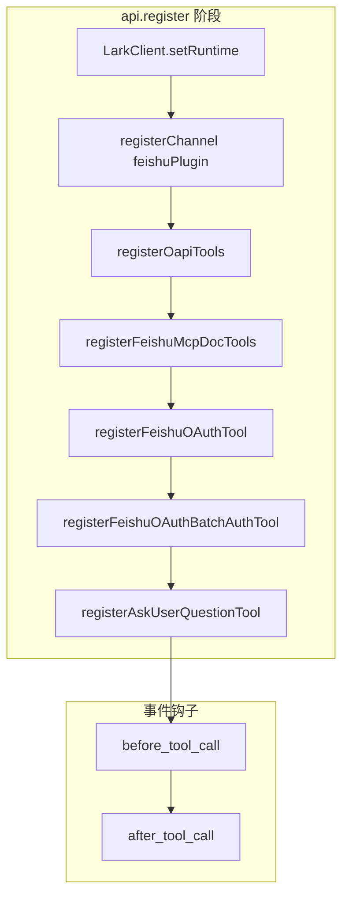

<details>
<summary>相关源文件</summary>

生成本页时使用的主要源文件：

- [index.ts](../../../project-repos/openclaw-lark/index.ts)
- [src/commands/index.ts](../../../project-repos/openclaw-lark/src/commands/index.ts)
- [src/commands/diagnose.ts](../../../project-repos/openclaw-lark/src/commands/diagnose.ts)
- [bin/openclaw-lark.js](../../../project-repos/openclaw-lark/bin/openclaw-lark.js)
- [package.json](../../../project-repos/openclaw-lark/package.json)

</details>

# OpenClaw 插件注册与运行时

`index.ts` 导出默认对象 `plugin`：`register(api)` 中依次完成 **运行时注入**、**频道注册**、**工具注册**、**生命周期钩子**、**CLI 子命令**、**聊天命令**与 **多账号安全检查**。

## register 主流程



Sources: [index.ts:104-162](../../../project-repos/openclaw-lark/index.ts#L104-L162)

<details class="source-snippets">
<summary>引用源码</summary>

<!-- source-snippets:start -->

#### `index.ts:104-162`

```typescript
const plugin = {
  id: 'openclaw-lark',
  name: 'Feishu',
  description: 'Lark/Feishu channel plugin with im/doc/wiki/drive/task/calendar tools',
  configSchema: emptyPluginConfigSchema(),
  register(api: OpenClawPluginApi): void {
    LarkClient.setRuntime(api.runtime);
    api.registerChannel({ plugin: feishuPlugin });

    // ========================================

    // Register OAPI tools (calendar, task - using Feishu Open API directly)
    registerOapiTools(api);

    // Register MCP doc tools (using Model Context Protocol)
    registerFeishuMcpDocTools(api);

    // Register OAuth tool (UAT device flow authorization)
    registerFeishuOAuthTool(api);

    // Register OAuth batch auth tool (batch authorization for all app scopes)
    registerFeishuOAuthBatchAuthTool(api);

    // Register AskUserQuestion tool (interactive card-based user prompting)
    registerAskUserQuestionTool(api);

    api.on('before_tool_call', (event, ctx) => {
      recordToolUseStart({
        sessionKey: ctx.sessionKey,
        toolName: event.toolName,
        toolParams: event.params,
        toolCallId: event.toolCallId ?? ctx.toolCallId,
        runId: event.runId ?? ctx.runId,
      });
      if (!event.toolName.startsWith('feishu_')) return;
      const paramsPreview = sanitizeParamsForLog(event.params);
      log.info(`tool call: ${event.toolName} session=${ctx.sessionKey ?? '-'} params=${paramsPreview}`);
    });

    api.on('after_tool_call', (event, ctx) => {
      recordToolUseEnd({
        sessionKey: ctx.sessionKey,
        toolName: event.toolName,
        toolParams: event.params,
        toolCallId: event.toolCallId ?? ctx.toolCallId,
        runId: event.runId ?? ctx.runId,
        result: event.result,
        error: event.error,
        durationMs: event.durationMs,
      });
      if (!event.toolName.startsWith('feishu_')) return;
      if (event.error) {
        log.error(
          `tool fail: ${event.toolName} session=${ctx.sessionKey ?? '-'} ${event.error} (${event.durationMs ?? 0}ms)`,
        );
      } else {
        log.info(`tool done: ${event.toolName} session=${ctx.sessionKey ?? '-'} ok (${event.durationMs ?? 0}ms)`);
      }
    });
```

<!-- source-snippets:end -->
</details>

## 工具调用观测与日志

`before_tool_call` / `after_tool_call` 对 `feishu_` 前缀工具记录结构化日志，并通过 `recordToolUseStart` / `recordToolUseEnd` 维护工具调用追踪数据，供卡片层消费。

Sources: [index.ts:130-161](../../../project-repos/openclaw-lark/index.ts#L130-L161), [index.ts:29-31](../../../project-repos/openclaw-lark/index.ts#L29-L31)

<details class="source-snippets">
<summary>引用源码</summary>

<!-- source-snippets:start -->

#### `index.ts:130-161`

```typescript
    api.on('before_tool_call', (event, ctx) => {
      recordToolUseStart({
        sessionKey: ctx.sessionKey,
        toolName: event.toolName,
        toolParams: event.params,
        toolCallId: event.toolCallId ?? ctx.toolCallId,
        runId: event.runId ?? ctx.runId,
      });
      if (!event.toolName.startsWith('feishu_')) return;
      const paramsPreview = sanitizeParamsForLog(event.params);
      log.info(`tool call: ${event.toolName} session=${ctx.sessionKey ?? '-'} params=${paramsPreview}`);
    });

    api.on('after_tool_call', (event, ctx) => {
      recordToolUseEnd({
        sessionKey: ctx.sessionKey,
        toolName: event.toolName,
        toolParams: event.params,
        toolCallId: event.toolCallId ?? ctx.toolCallId,
        runId: event.runId ?? ctx.runId,
        result: event.result,
        error: event.error,
        durationMs: event.durationMs,
      });
      if (!event.toolName.startsWith('feishu_')) return;
      if (event.error) {
        log.error(
          `tool fail: ${event.toolName} session=${ctx.sessionKey ?? '-'} ${event.error} (${event.durationMs ?? 0}ms)`,
        );
      } else {
        log.info(`tool done: ${event.toolName} session=${ctx.sessionKey ?? '-'} ok (${event.durationMs ?? 0}ms)`);
      }
```

#### `index.ts:29-31`

```typescript
import { emitSecurityWarnings } from './src/core/security-check';
import { recordToolUseEnd, recordToolUseStart } from './src/card/tool-use-trace-store';
import { sanitizeParamsForLog } from './src/card/reasoning-utils';
```

<!-- source-snippets:end -->
</details>

## CLI：`feishu-diagnose` 与 `openclaw-lark` bin

插件向 OpenClaw CLI 注册 `feishu-diagnose`：支持无参诊断与 `--trace <messageId>` 追踪，可选 `--analyze` 做追踪分析。

npm `bin` 字段提供 `openclaw-lark`，其脚本通过 `npx` 拉起 `@larksuite/openclaw-lark-tools`（可用 `--tools-version` 固定版本），用于把「工具链 CLI」与插件包解耦分发。

Sources: [index.ts:164-202](../../../project-repos/openclaw-lark/index.ts#L164-L202), [bin/openclaw-lark.js:1-39](../../../project-repos/openclaw-lark/bin/openclaw-lark.js#L1-L39), [package.json:16-17](../../../project-repos/openclaw-lark/package.json#L16-L17)

<details class="source-snippets">
<summary>引用源码</summary>

<!-- source-snippets:start -->

#### `index.ts:164-202`

```typescript
    // ---- Diagnostic commands ----

    // CLI: openclaw feishu-diagnose [--trace <messageId>]
    api.registerCli(
      (ctx) => {
        ctx.program
          .command('feishu-diagnose')
          .description('运行飞书插件诊断，检查配置、连通性和权限状态')
          .option('--trace <messageId>', '按 message_id 追踪完整处理链路')
          .option('--analyze', '分析追踪日志（需配合 --trace 使用）')
          .action(async (opts: { trace?: string; analyze?: boolean }) => {
            try {
              if (opts.trace) {
                const lines = await traceByMessageId(opts.trace);
                // eslint-disable-next-line no-console -- CLI 命令直接输出到终端
                console.log(formatTraceOutput(lines, opts.trace));
                if (opts.analyze && lines.length > 0) {
                  // eslint-disable-next-line no-console -- CLI 命令直接输出到终端
                  console.log(analyzeTrace(lines, opts.trace));
                }
              } else {
                const report = await runDiagnosis({
                  config: ctx.config,
                  logger: ctx.logger,
                });
                // eslint-disable-next-line no-console -- CLI 命令直接输出到终端
                console.log(formatDiagReportCli(report));
                if (report.overallStatus === 'unhealthy') {
                  process.exitCode = 1;
                }
              }
            } catch (err) {
              ctx.logger.error(`诊断命令执行失败: ${err}`);
              process.exitCode = 1;
            }
          });
      },
      { commands: ['feishu-diagnose'] },
    );
```

#### `bin/openclaw-lark.js:1-39`

```javascript
#!/usr/bin/env node
import { createRequire } from 'node:module';
import { dirname, join } from 'node:path';

const mod = ['child', 'process'].join('_');
const { execFileSync } = createRequire(import.meta.url)(`node:${mod}`);

// --tools-version <ver> lets the user pin a specific version
const args = process.argv.slice(2);
let version = 'latest';

const vIdx = args.indexOf('--tools-version');
if (vIdx !== -1) {
  version = args[vIdx + 1];
  // Remove --tools-version <ver> from forwarded args
  args.splice(vIdx, 2);
}

const allArgs = ['--yes', '--prefer-online', `@larksuite/openclaw-lark-tools@${version}`, ...args];

try {
  if (process.platform === 'win32') {
    // On Windows, npx is a .cmd shim that can be broken or trigger
    // DEP0190. Bypass it entirely: run node with the npx-cli.js
    // script located next to the running node binary.
    const npxCli = join(dirname(process.execPath), 'node_modules', 'npm', 'bin', 'npx-cli.js');
    execFileSync(process.execPath, [npxCli, ...allArgs], {
      stdio: 'inherit',
      env: {
        ...process.env,
        NODE_OPTIONS: [process.env.NODE_OPTIONS, '--disable-warning=DEP0190'].filter(Boolean).join(' '),
      },
    });
  } else {
    execFileSync('npx', allArgs, { stdio: 'inherit' });
  }
} catch (error) {
  process.exit(error.status ?? 1);
}
```

#### `package.json:16-17`

```json
  "bin": {
    "openclaw-lark": "bin/openclaw-lark.js"
```

<!-- source-snippets:end -->
</details>

## 聊天命令注册

`registerCommands(api)` 负责在飞书会话中暴露 `/feishu_diagnose`、`/feishu_doctor`、`/feishu_auth`、`/feishu` 等命令（详见 `src/commands/index.ts` 头部注释与 i18n 文案表）。

Sources: [index.ts:204-205](../../../project-repos/openclaw-lark/index.ts#L204-L205), [src/commands/index.ts:4-6](../../../project-repos/openclaw-lark/src/commands/index.ts#L4-L6)

<details class="source-snippets">
<summary>引用源码</summary>

<!-- source-snippets:start -->

#### `index.ts:204-205`

```typescript
    // Chat commands: /feishu_diagnose, /feishu_doctor, /feishu_auth, /feishu
    registerCommands(api);
```

#### `src/commands/index.ts:4-6`

```typescript
 *
 * Register all chat commands (/feishu_diagnose, /feishu_doctor, /feishu_auth, /feishu).
 */
```

<!-- source-snippets:end -->
</details>

## package.json 中的 OpenClaw 扩展声明

`package.json` 的 `openclaw` 字段声明 `extensions` 指向构建产物 `./dist/index.mjs`，并描述 `channel` 元数据（`id`、`label`、`docsPath`、`aliases`、`order` 等）与 `install` 提示（`npmSpec`、`localPath`、`defaultChoice`）。这与 `feishuPlugin.meta` 中的展示字段形成 **发布侧与运行时侧** 的双重来源，排查展示不一致时需要对照两处。

Sources: [package.json:75-96](../../../project-repos/openclaw-lark/package.json#L75-L96), [src/channel/plugin.ts:63-72](../../../project-repos/openclaw-lark/src/channel/plugin.ts#L63-L72)

<details class="source-snippets">
<summary>引用源码</summary>

<!-- source-snippets:start -->

#### `package.json:75-96`

```json
  "openclaw": {
    "extensions": [
      "./dist/index.mjs"
    ],
    "channel": {
      "id": "openclaw-lark",
      "label": "Feishu",
      "selectionLabel": "Lark/Feishu (飞书)",
      "docsPath": "/channels/feishu",
      "docsLabel": "feishu",
      "blurb": "飞书/Lark enterprise messaging with doc/wiki/drive/task/calendar tools.",
      "aliases": [
        "lark"
      ],
      "order": 35,
      "quickstartAllowFrom": true
    },
    "install": {
      "npmSpec": "@larksuite/openclaw-lark",
      "localPath": "extensions/feishu",
      "defaultChoice": "npm"
    }
```

#### `src/channel/plugin.ts:63-72`

```typescript
const meta = {
  id: 'feishu',
  label: 'Feishu',
  selectionLabel: 'Lark/Feishu (\u98DE\u4E66)',
  docsPath: '/channels/feishu',
  docsLabel: 'feishu',
  blurb: '\u98DE\u4E66/Lark enterprise messaging.',
  aliases: ['lark'],
  order: 70,
};
```

<!-- source-snippets:end -->
</details>

## 相关页面

- [系统架构](system-architecture.md)
- [飞书工具面：OAPI、MCP 文档与交互](feishu-tools-surface.md)
- [测试、CI 与质量门禁](testing-ci-and-quality.md)
