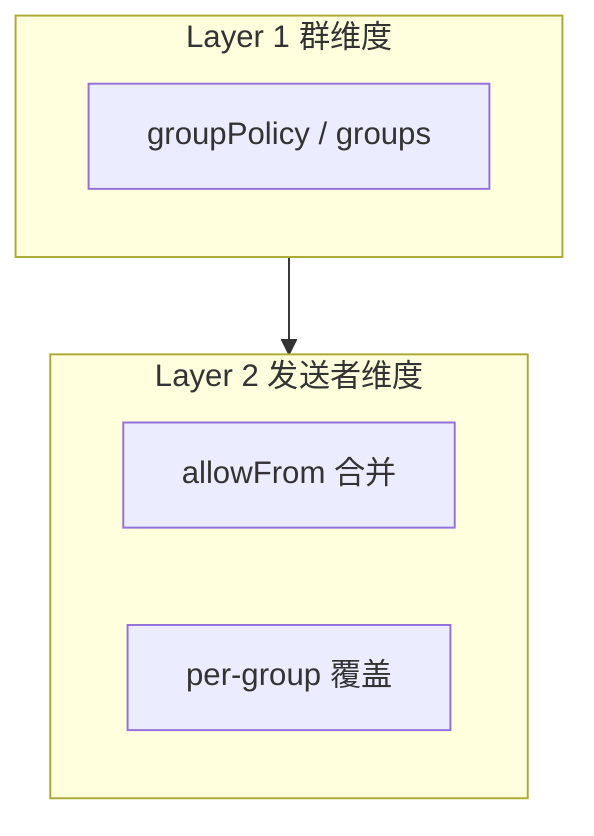

<details>
<summary>相关源文件</summary>

生成本页时使用的主要源文件：

- [src/messaging/inbound/gate.ts](../../../project-repos/openclaw-lark/src/messaging/inbound/gate.ts)
- [src/core/security-check.ts](../../../project-repos/openclaw-lark/src/core/security-check.ts)
- [README.zh.md](../../../project-repos/openclaw-lark/README.zh.md)
- [src/messaging/inbound/policy.ts](../../../project-repos/openclaw-lark/src/messaging/inbound/policy.ts)

</details>

# 安全策略与多账号隔离

本插件同时承担两类安全叙事：一类来自 **产品 README 的风险提示**（模型幻觉、提示词注入、以用户身份执行操作等），另一类来自 **代码内的策略与多租户隔离诊断**（群/发送者门禁、`bindings` 与 `session.dmScope` 等）。

## 入站门禁：群与发送者两层模型



`gate.ts` 将飞书群消息访问描述为两层：

1. **哪些群允许进入处理**（与 SDK `resolveGroupPolicy` 对齐）
2. **群内哪些发送者允许触发 Agent**（全局 `groupAllowFrom` 与 per-group `allowFrom` 合并，并支持 per-group `groupPolicy` 覆盖）

Sources: [src/messaging/inbound/gate.ts:11-24](../../../project-repos/openclaw-lark/src/messaging/inbound/gate.ts#L11-L24)

<details class="source-snippets">
<summary>引用源码</summary>

<!-- source-snippets:start -->

#### `src/messaging/inbound/gate.ts:11-24`

```typescript
 * Group access follows the same two-layer model as Telegram:
 *
 *   Layer 1 – Which GROUPS are allowed (SDK `resolveGroupPolicy`):
 *     - No `groups` configured + `groupPolicy: "open"` → any group passes
 *     - `groupPolicy: "allowlist"` or `groups` configured → acts as allowlist
 *       (explicit group IDs or `"*"` wildcard)
 *     - `groupPolicy: "disabled"` → all groups blocked
 *
 *   Layer 2 – Which SENDERS are allowed within a group:
 *     - Per-group `groupPolicy` overrides global for sender filtering
 *     - `groupAllowFrom` (global) + per-group `allowFrom` are merged
 *     - `"open"` → any sender; `"allowlist"` → check merged list;
 *       `"disabled"` → block all senders
 */
```

<!-- source-snippets:end -->
</details>

## 多账号隔离：从配置结构推断风险

`checkMultiAccountIsolation` 在「启用账号数 > 1 且 appId 集合 > 1」时进入分析：

- 若不存在 `bindings`（或没有 feishu 的 accountId 绑定）→ `shared-implicit`（隐式共享，风险）
- 若部分账号未绑定 → `shared-implicit`
- 若所有绑定指向同一 `agentId` → `shared-explicit`（显式共享）
- 若绑定指向多个 agent → `isolated`

Sources: [src/core/security-check.ts:34-67](../../../project-repos/openclaw-lark/src/core/security-check.ts#L34-L67)

<details class="source-snippets">
<summary>引用源码</summary>

<!-- source-snippets:start -->

#### `src/core/security-check.ts:34-67`

```typescript
/**
 * Diagnose whether multiple enabled accounts from different tenants
 * are properly isolated via agent bindings.
 */
export function checkMultiAccountIsolation(cfg: ClawdbotConfig): IsolationStatus {
  const accounts = getEnabledLarkAccounts(cfg);
  if (accounts.length <= 1) return { mode: 'not-applicable' };

  const appIds = new Set(accounts.map((a) => (a.configured ? a.appId : undefined)).filter((id): id is string => !!id));
  if (appIds.size <= 1) return { mode: 'not-applicable' };

  const feishuBindings = cfg.bindings?.filter((b) => b.match?.channel === 'feishu' && b.match?.accountId);

  if (!feishuBindings || feishuBindings.length === 0) {
    return { mode: 'shared-implicit', accounts, unboundAccounts: accounts };
  }

  const boundAccountIds = new Set(feishuBindings.map((b) => b.match!.accountId!));
  const unboundAccounts = accounts.filter((a) => !boundAccountIds.has(a.accountId));

  if (unboundAccounts.length > 0) {
    return { mode: 'shared-implicit', accounts, unboundAccounts };
  }

  const agentIds = new Set(feishuBindings.map((b) => b.agentId));
  if (agentIds.size === 1) {
    return {
      mode: 'shared-explicit',
      accounts,
      sharedAgentId: agentIds.values().next().value!,
    };
  }

  return { mode: 'isolated', accounts };
```

<!-- source-snippets:end -->
</details>

## 私聊会话串混：`session.dmScope` 建议

`needsDmScopeFix` 在多租户场景下检查 `session.dmScope` 是否为推荐的 `per-account-channel-peer`；`getDmScopeFixCommand` 返回 `openclaw config set ...` 修复命令字符串。

Sources: [src/core/security-check.ts:89-107](../../../project-repos/openclaw-lark/src/core/security-check.ts#L89-L107)

<details class="source-snippets">
<summary>引用源码</summary>

<!-- source-snippets:start -->

#### `src/core/security-check.ts:89-107`

```typescript
const RECOMMENDED_DM_SCOPE = 'per-account-channel-peer';

/**
 * Check whether `session.dmScope` is set to per-account isolation.
 *
 * Without this setting, different bots talking to the same user share
 * the same session — even if agent bindings are configured.
 */
export function needsDmScopeFix(cfg: ClawdbotConfig): boolean {
  if (!isMultiTenant(cfg)) return false;
  // eslint-disable-next-line @typescript-eslint/no-explicit-any
  return (cfg as any).session?.dmScope !== RECOMMENDED_DM_SCOPE;
}

/** Return the fix command string, or null if not needed. */
export function getDmScopeFixCommand(cfg: ClawdbotConfig): string | null {
  if (!needsDmScopeFix(cfg)) return null;
  return `openclaw config set session.dmScope "${RECOMMENDED_DM_SCOPE}"`;
}
```

<!-- source-snippets:end -->
</details>

## README 侧的用户责任与使用建议

中文 README 明确要求用户理解风险，并建议将机器人作为 **私人对话助手**，避免拉入群聊或允许他人交互；同时声明默认安全保护与「不要主动放宽限制」的立场。

Sources: [README.zh.md:30-34](../../../project-repos/openclaw-lark/README.zh.md#L30-L34)

<details class="source-snippets">
<summary>引用源码</summary>

<!-- source-snippets:start -->

#### `README.zh.md:30-34`

```markdown
## 安全与风险提示（使用前必读）
本插件对接 OpenClaw AI 自动化能力，存在模型幻觉、执行不可控、提示词注入等固有风险；授权飞书权限后，OpenClaw 将以您的用户身份在授权范围内执行操作，可能导致敏感数据泄露、越权操作等高风险后果，请您谨慎操作和使用。
为降低上述风险，插件已在多个层面启用默认安全保护以降低上述风险，但上述风险仍然存在。我们强烈建议不要主动修改任何默认安全配置；一旦放开相关限制，上述风险将显著提高，由此产生的后果需由您自行承担。
我们建议您将接入 OpenClaw 的飞书机器人作为私人对话助手使用，请勿将其拉入群聊或允许其他用户与其交互，以避免权限被滥用或数据泄露。
请您充分知悉全部使用风险，使用本插件即视为您自愿承担相关所有责任。
```

<!-- source-snippets:end -->
</details>

## 相关页面

- [入站消息七阶段流水线](inbound-seven-stage-pipeline.md)
- [频道契约、能力与配置](channel-capabilities-config.md)
- [项目概览](overview.md)
