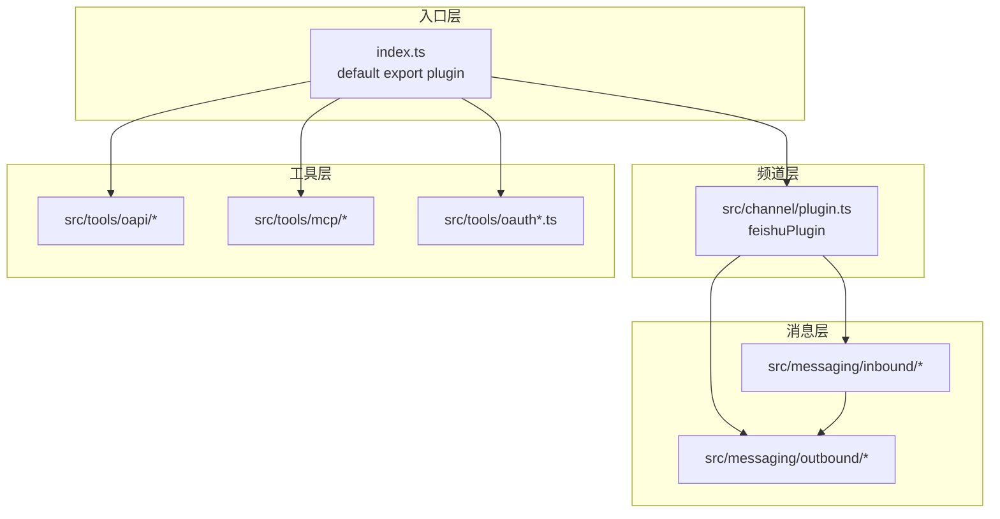

<details>
<summary>相关源文件</summary>

生成本页时使用的主要源文件：

- [index.ts](../../../project-repos/openclaw-lark/index.ts)
- [src/channel/plugin.ts](../../../project-repos/openclaw-lark/src/channel/plugin.ts)
- [src/tools/oapi/index.ts](../../../project-repos/openclaw-lark/src/tools/oapi/index.ts)
- [src/messaging/inbound/handler.ts](../../../project-repos/openclaw-lark/src/messaging/inbound/handler.ts)
- [src/messaging/outbound/outbound.ts](../../../project-repos/openclaw-lark/src/messaging/outbound/outbound.ts)

</details>

# 系统架构

本仓库在源码层面可粗分为四层：**插件入口与 OpenClaw 契约**（`index.ts`）、**频道实现**（`src/channel/*`）、**消息子系统**（`src/messaging/*`）、**工具子系统**（`src/tools/*`），外加 **卡片与追踪**（`src/card/*`）、**命令与诊断**（`src/commands/*`）、**核心基础设施**（`src/core/*`）。

## 顶层依赖方向



`index.ts` 在注释中明确：注册 `feishu` 频道，并注册 doc/wiki/drive 等工具族（与 OAPI 分组实现相互印证）。

Sources: [index.ts:5-9](../../../project-repos/openclaw-lark/index.ts#L5-L9), [index.ts:104-128](../../../project-repos/openclaw-lark/index.ts#L104-L128)

<details class="source-snippets">
<summary>引用源码</summary>

<!-- source-snippets:start -->

#### `index.ts:5-9`

```typescript
 * OpenClaw Lark/Feishu plugin entry point.
 *
 * Registers the Feishu channel and all tool families:
 * doc, wiki, drive, perm, bitable, task, calendar.
 */
```

#### `index.ts:104-128`

```typescript
const plugin = {
  id: 'openclaw-lark',
  name: 'Feishu',
  description: 'Lark/Feishu channel plugin with im/doc/wiki/drive/task/calendar tools',
  configSchema: emptyPluginConfigSchema(),
  register(api: OpenClawPluginApi): void {
    LarkClient.setRuntime(api.runtime);
    api.registerChannel({ plugin: feishuPlugin });

    // ========================================

    // Register OAPI tools (calendar, task - using Feishu Open API directly)
    registerOapiTools(api);

    // Register MCP doc tools (using Model Context Protocol)
    registerFeishuMcpDocTools(api);

    // Register OAuth tool (UAT device flow authorization)
    registerFeishuOAuthTool(api);

    // Register OAuth batch auth tool (batch authorization for all app scopes)
    registerFeishuOAuthBatchAuthTool(api);

    // Register AskUserQuestion tool (interactive card-based user prompting)
    registerAskUserQuestionTool(api);
```

<!-- source-snippets:end -->
</details>
## 频道插件在架构中的位置

`feishuPlugin` 实现 OpenClaw SDK 的 `ChannelPlugin`：包含 `meta`、`pairing`、`capabilities`、`agentPrompt`、`groups`、`reload`、`configSchema`、`config`、`security`、`setup`、`messaging`、`directory`、`outbound`、`threading` 等分区，是 **运行时编排** 的中枢之一。

Sources: [src/channel/plugin.ts:12-15](../../../project-repos/openclaw-lark/src/channel/plugin.ts#L12-L15), [src/channel/plugin.ts:78-123](../../../project-repos/openclaw-lark/src/channel/plugin.ts#L78-L123)

<details class="source-snippets">
<summary>引用源码</summary>

<!-- source-snippets:start -->

#### `src/channel/plugin.ts:12-15`

```typescript
import type { ChannelPlugin, ClawdbotConfig } from 'openclaw/plugin-sdk';
import type { ChannelThreadingToolContext } from 'openclaw/plugin-sdk/channel-contract';
import { DEFAULT_ACCOUNT_ID } from 'openclaw/plugin-sdk/account-id';
import { PAIRING_APPROVED_MESSAGE } from 'openclaw/plugin-sdk/channel-status';
```

#### `src/channel/plugin.ts:78-123`

```typescript
export const feishuPlugin: ChannelPlugin<LarkAccount> = {
  id: 'feishu',

  meta: {
    ...meta,
  },

  // -------------------------------------------------------------------------
  // Pairing
  // -------------------------------------------------------------------------

  pairing: {
    idLabel: 'feishuUserId',
    normalizeAllowEntry: (entry) => entry.replace(/^(feishu|user|open_id):/i, ''),
    notifyApproval: async ({ cfg, id }) => {
      const accountId = getDefaultLarkAccountId(cfg);
      pluginLog.info('notifyApproval called', { id, accountId });

      // 1. 发送配对成功消息（保持现有行为）
      await sendMessageFeishu({
        cfg,
        to: id,
        text: PAIRING_APPROVED_MESSAGE,
        accountId,
      });

      // 2. 触发 onboarding
      try {
        await triggerOnboarding({ cfg, userOpenId: id, accountId });
        pluginLog.info('onboarding completed', { id });
      } catch (err) {
        pluginLog.warn('onboarding failed', { id, error: String(err) });
      }
    },
  },

  // -------------------------------------------------------------------------
  // Capabilities
  // -------------------------------------------------------------------------

  capabilities: {
    chatTypes: ['direct', 'group'],
    media: true,
    reactions: true,
    threads: true,
    polls: false,
```

<!-- source-snippets:end -->
</details>
## 工具子系统的两条主线

`registerOapiTools` 将「直接调用飞书 Open API」的工具成组注册（IM user、Calendar、Task、Bitable、Search、Drive、Wiki、Sheets、IM bot 等），与 MCP 文档工具区分。

Sources: [src/tools/oapi/index.ts:5-95](../../../project-repos/openclaw-lark/src/tools/oapi/index.ts#L5-L95)

<details class="source-snippets">
<summary>引用源码</summary>

<!-- source-snippets:start -->

#### `src/tools/oapi/index.ts:5-95`

```typescript
 * OAPI Tools Index
 *
 * This module registers all tools that directly use Feishu Open API (OAPI).
 * These tools are placed here to distinguish them from MCP-based tools.
 */

import type { OpenClawPluginApi } from 'openclaw/plugin-sdk';
import { registerFeishuImTools as registerFeishuImBotTools } from '../tat/im/index';
import {
  registerFeishuCalendarCalendarTool,
  registerFeishuCalendarEventAttendeeTool,
  registerFeishuCalendarEventTool,
  registerFeishuCalendarFreebusyTool,
} from './calendar/index';
import {
  registerFeishuTaskAgentTool,
  registerFeishuTaskAttachmentTool,
  registerFeishuTaskCommentTool,
  registerFeishuTaskSectionTool,
  registerFeishuTaskSubtaskTool,
  registerFeishuTaskTaskTool,
  registerFeishuTaskTasklistTool,
} from './task/index';
import {
  registerFeishuBitableAppTableFieldTool,
  registerFeishuBitableAppTableRecordTool,
  registerFeishuBitableAppTableTool,
  registerFeishuBitableAppTableViewTool,
  registerFeishuBitableAppTool,
} from './bitable/index';
import { registerGetUserTool, registerSearchUserTool } from './common/index';
// import { registerFeishuMailTools } from "./mail/index";
import { registerFeishuSearchTools } from './search/index';
import { registerFeishuDriveTools } from './drive/index';
import { registerFeishuWikiTools } from './wiki/index';

import { registerFeishuSheetsTools } from './sheets/index';
// import { registerFeishuOkrTools } from "./okr/index";
import { registerFeishuChatTools } from './chat/index';
import { registerFeishuImTools as registerFeishuImUserTools } from './im/index';

export function registerOapiTools(api: OpenClawPluginApi): void {
  // Common tools
  registerGetUserTool(api);
  registerSearchUserTool(api);

  // Chat tools
  registerFeishuChatTools(api);

  // IM tools (user identity)
  registerFeishuImUserTools(api);

  // Calendar tools
  registerFeishuCalendarCalendarTool(api);
  registerFeishuCalendarEventTool(api);
  registerFeishuCalendarEventAttendeeTool(api);
  registerFeishuCalendarFreebusyTool(api);

  // Task tools
  registerFeishuTaskTaskTool(api);
  registerFeishuTaskTasklistTool(api);
  registerFeishuTaskAttachmentTool(api);
  registerFeishuTaskSectionTool(api);
  registerFeishuTaskCommentTool(api);
  registerFeishuTaskSubtaskTool(api);
  registerFeishuTaskAgentTool(api);

  // Bitable tools
  registerFeishuBitableAppTool(api);
  registerFeishuBitableAppTableTool(api);
  registerFeishuBitableAppTableRecordTool(api);
  registerFeishuBitableAppTableFieldTool(api);
  registerFeishuBitableAppTableViewTool(api);

  // Search tools
  registerFeishuSearchTools(api);

  // Drive tools
  registerFeishuDriveTools(api);

  // Wiki tools
  registerFeishuWikiTools(api);

  // Sheets tools
  registerFeishuSheetsTools(api);

  // IM tools (bot identity)
  registerFeishuImBotTools(api);

  api.logger.debug?.('Registered all OAPI tools (calendar, task, bitable, search, drive, wiki, sheets, im)');
}
```

<!-- source-snippets:end -->
</details>
## 入站编排与出站适配

`handler.ts` 将入站处理描述为 **七个阶段**（账号解析、事件解析、发送者富化、策略门禁、用户名预取、内容解析、Agent 分发），最终调用 `dispatch.ts`。

`plugin.ts` 将 `outbound` 指向 `feishuOutbound`（定义于 `src/messaging/outbound/outbound.ts`），完成频道对外发送路径的装配。

Sources: [src/messaging/inbound/handler.ts:5-14](../../../project-repos/openclaw-lark/src/messaging/inbound/handler.ts#L5-L14), [src/channel/plugin.ts:247-252](../../../project-repos/openclaw-lark/src/channel/plugin.ts#L247-L252)

<details class="source-snippets">
<summary>引用源码</summary>

<!-- source-snippets:start -->

#### `src/messaging/inbound/handler.ts:5-14`

```typescript
 * Inbound message handling pipeline for the Lark/Feishu channel plugin.
 *
 * Orchestrates a seven-stage pipeline:
 *   1. Account resolution
 *   2. Event parsing         → parse.ts (merge_forward expanded in-place)
 *   3. Sender enrichment     → enrich.ts (lightweight, before gate)
 *   4. Policy gate           → gate.ts
 *   5. User name prefetch    → enrich.ts (batch cache warm-up)
 *   6. Content resolution    → enrich.ts (media / quote, parallel)
 *   7. Agent dispatch        → dispatch.ts
```

#### `src/channel/plugin.ts:247-252`

```typescript
  // -------------------------------------------------------------------------
  // Outbound
  // -------------------------------------------------------------------------

  outbound: feishuOutbound,

```

<!-- source-snippets:end -->
</details>
## 相关页面

- [项目概览](overview.md)
- [OpenClaw 插件注册与运行时](plugin-openclaw-integration.md)
- [入站消息七阶段流水线](inbound-seven-stage-pipeline.md)
