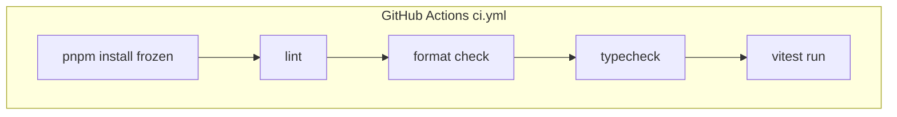

<details>
<summary>相关源文件</summary>

生成本页时使用的主要源文件：

- [.github/workflows/ci.yml](../../../project-repos/openclaw-lark/.github/workflows/ci.yml)
- [package.json](../../../project-repos/openclaw-lark/package.json)
- [vitest.config.ts](../../../project-repos/openclaw-lark/vitest.config.ts)
- [tsconfig.json](../../../project-repos/openclaw-lark/tsconfig.json)
- [eslint.config.js](../../../project-repos/openclaw-lark/eslint.config.js)

</details>

# 测试、CI 与质量门禁

仓库使用 **pnpm + Vitest + ESLint + Prettier + TypeScript** 作为基础质量栈，并在 GitHub Actions 上对 `main` 的 push/PR 执行冻结安装与全套检查。

## CI 工作流步骤

`.github/workflows/ci.yml` 在 `ubuntu-latest` 上使用 Node 22：

1. `corepack enable`
2. `pnpm install --frozen-lockfile`
3. `pnpm lint`
4. `pnpm format:check`
5. `pnpm typecheck`
6. `pnpm test`

并配置 concurrency，避免同一 PR/分支重复运行浪费资源。

Sources: [github/workflows/ci.yml:1-41](../../../project-repos/openclaw-lark/.github/workflows/ci.yml#L1-L41)

<details class="source-snippets">
<summary>引用源码</summary>

<!-- source-snippets:start -->

#### `github/workflows/ci.yml:1-41`

```yaml
name: CI

on:
  push:
    branches: [main]
  pull_request:
    branches: [main]

concurrency:
  group: ${{ github.workflow }}-${{ github.event.pull_request.number || github.sha }}
  cancel-in-progress: true

jobs:
  ci:
    name: Lint & Type Check & Test
    runs-on: ubuntu-latest
    timeout-minutes: 10

    steps:
      - uses: actions/checkout@v4

      - run: corepack enable

      - uses: actions/setup-node@v4
        with:
          node-version: 22
          cache: pnpm

      - run: pnpm install --frozen-lockfile

      - name: Lint
        run: pnpm lint

      - name: Format check
        run: pnpm format:check

      - name: Type check
        run: pnpm typecheck

      - name: Test
        run: pnpm test
```

<!-- source-snippets:end -->
</details>



## package.json scripts 映射

`package.json` 将本地开发命令标准化为：

- `build`: `tsdown`
- `test`: `vitest run`
- `lint` / `lint:fix`
- `typecheck`
- `format` / `format:check`

Sources: [package.json:31-40](../../../project-repos/openclaw-lark/package.json#L31-L40)

<details class="source-snippets">
<summary>引用源码</summary>

<!-- source-snippets:start -->

#### `package.json:31-40`

```json
  "scripts": {
    "build": "tsdown",
    "release": "node scripts/release.mjs",
    "test": "vitest run",
    "test:watch": "vitest",
    "lint": "eslint src/ index.ts",
    "lint:fix": "eslint src/ index.ts --fix",
    "typecheck": "tsc --noEmit",
    "format": "prettier --write src/**/*.ts",
    "format:check": "prettier --check src/**/*.ts"
```

<!-- source-snippets:end -->
</details>

## 测试目录与类型

`tests/` 下包含针对 dispatch、mention、tool-use trace、VC 事件、markdown 样式、账户合并等场景的单元测试文件（文件名即意图索引，例如 `dispatch-tool-use-init.test.ts`）。

Sources: [tests/mention-all.test.ts:1-5](../../../project-repos/openclaw-lark/tests/mention-all.test.ts#L1-L5), [tests/dispatch-tool-use-init.test.ts:1-5](../../../project-repos/openclaw-lark/tests/dispatch-tool-use-init.test.ts#L1-L5)

<details class="source-snippets">
<summary>引用源码</summary>

<!-- source-snippets:start -->

#### `tests/mention-all.test.ts:1-5`

```typescript
/**
 * Copyright (c) 2026 ByteDance Ltd. and/or its affiliates
 * SPDX-License-Identifier: MIT
 *
 * Tests for @all (mention_all) support in group chats.
```

#### `tests/dispatch-tool-use-init.test.ts:1-5`

```typescript
import { beforeEach, describe, expect, it, vi } from 'vitest';

const {
  buildDispatchContextMock,
  buildMessageBodyMock,
```

<!-- source-snippets:end -->
</details>

## 相关页面

- [OpenClaw 插件注册与运行时](plugin-openclaw-integration.md)
- [项目概览](overview.md)
- [随包技能与文档资产](bundled-skills.md)
