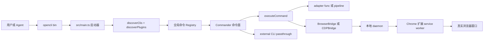

# opencli DeepWiki

本 DeepWiki 面向想理解、维护或扩展 `jackwener/opencli` 的中文读者。它按 DeepWiki-open 风格组织：先给出系统地图，再拆入口、命令注册、浏览器桥接、适配器模型、插件、技能和运维边界。

## 项目定位

`opencli` 把网站、Electron 桌面应用和外部命令行工具统一成 `opencli <site> <command>` 的接口。它的核心不是单一爬虫，而是一套可发现、可验证、可由 Agent 驱动的命令运行时：内置/用户 adapter 负责站点能力，Browser Bridge 负责真实 Chrome 自动化，plugin/external CLI 负责扩展生态。

Sources: [README.md:12-22](README.md#L12-L22), [package.json:1-15](../../project-repos/opencli/package.json#L1-L15), [src/main.ts:27-47](../../project-repos/opencli/src/main.ts#L27-L47)

<details class="source-snippets">
<summary>引用源码</summary>

<!-- source-snippets:start -->

#### `README.md:12-22`

```markdown
1. [系统总览](pages/01-system-overview.md)
2. [启动、发现与命令生命周期](pages/02-startup-discovery-command-lifecycle.md)
3. [Adapter 模型与策略](pages/03-adapter-model-and-strategies.md)
4. [浏览器桥接与 Chrome 扩展](pages/04-browser-bridge-and-extension.md)
5. [Agent 浏览器命令面](pages/05-agent-browser-command-surface.md)
6. [Pipeline、模板与数据抽取](pages/06-pipeline-template-and-data-extraction.md)
7. [Plugin 与外部 CLI Hub](pages/07-plugin-and-external-cli-hub.md)
8. [Skills 与 Agent 工作流](pages/08-skills-and-agent-workflows.md)
9. [测试、发布与日常运维](pages/09-testing-release-and-operations.md)
10. [安全、隐私与边界](pages/10-security-privacy-and-boundaries.md)

```

#### `package.json:1-15`

> 未找到引用文件：`package.json`

#### `src/main.ts:27-47`

> 未找到引用文件：`src/main.ts`

<!-- source-snippets:end -->
</details>

## 阅读顺序

1. [系统总览](pages/01-system-overview.md)
2. [启动、发现与命令生命周期](pages/02-startup-discovery-command-lifecycle.md)
3. [Adapter 模型与策略](pages/03-adapter-model-and-strategies.md)
4. [浏览器桥接与 Chrome 扩展](pages/04-browser-bridge-and-extension.md)
5. [Agent 浏览器命令面](pages/05-agent-browser-command-surface.md)
6. [Pipeline、模板与数据抽取](pages/06-pipeline-template-and-data-extraction.md)
7. [Plugin 与外部 CLI Hub](pages/07-plugin-and-external-cli-hub.md)
8. [Skills 与 Agent 工作流](pages/08-skills-and-agent-workflows.md)
9. [测试、发布与日常运维](pages/09-testing-release-and-operations.md)
10. [安全、隐私与边界](pages/10-security-privacy-and-boundaries.md)

## 生成物

- [00-repo-inventory.md](00-repo-inventory.md)：仓库盘点、语言和目录分布。
- [source-manifest.json](source-manifest.json)：源码文件清单。
- [wiki-structure.json](wiki-structure.json)：页面结构和依赖关系。
- [exports/full-wiki.md](exports/full-wiki.md)：合并版全文。
- [skills/](skills/)：仓库中 skills 的中文审阅副本。

## 一句话架构



Sources: [src/main.ts:96-148](../../project-repos/opencli/src/main.ts#L96-L148), [src/discovery.ts:91-148](../../project-repos/opencli/src/discovery.ts#L91-L148), [src/registry.ts:88-119](../../project-repos/opencli/src/registry.ts#L88-L119), [src/execution.ts:77-153](../../project-repos/opencli/src/execution.ts#L77-L153), [src/browser/bridge.ts:21-45](../../project-repos/opencli/src/browser/bridge.ts#L21-L45)

<details class="source-snippets">
<summary>引用源码</summary>

<!-- source-snippets:start -->

#### `src/main.ts:96-148`

> 未找到引用文件：`src/main.ts`

#### `src/discovery.ts:91-148`

> 未找到引用文件：`src/discovery.ts`

#### `src/registry.ts:88-119`

> 未找到引用文件：`src/registry.ts`

#### `src/execution.ts:77-153`

> 未找到引用文件：`src/execution.ts`

#### `src/browser/bridge.ts:21-45`

> 未找到引用文件：`src/browser/bridge.ts`

<!-- source-snippets:end -->
</details>
