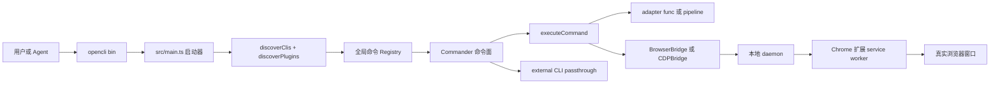
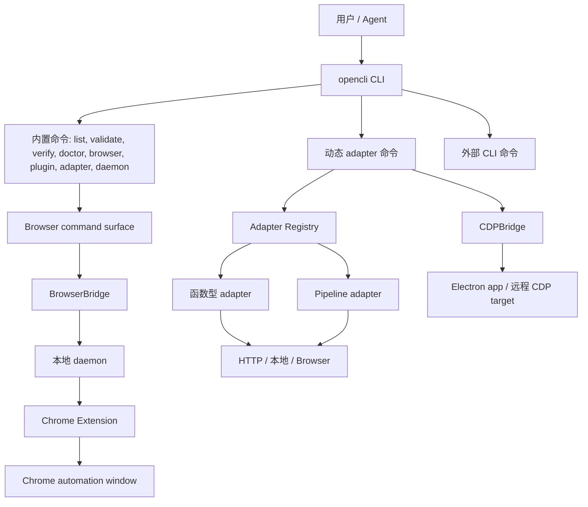
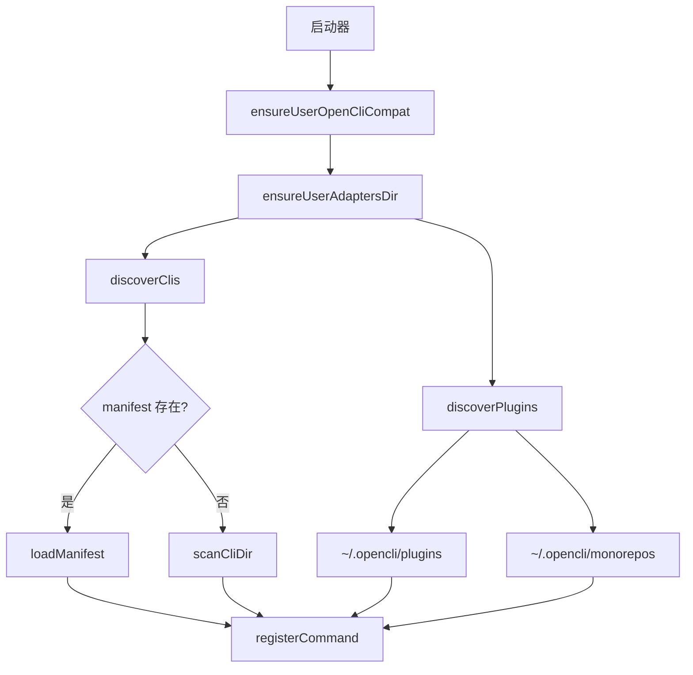
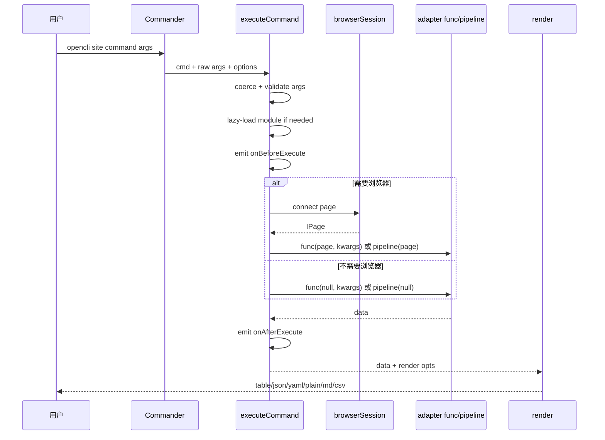
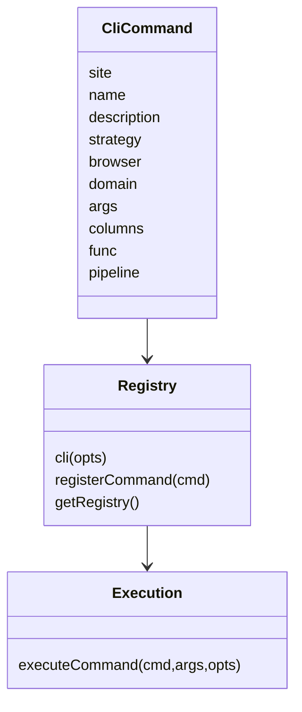
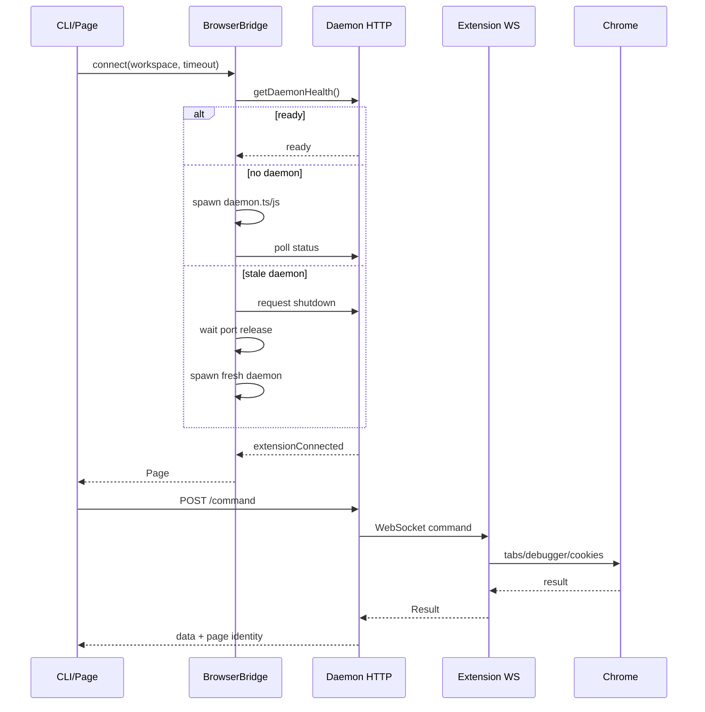
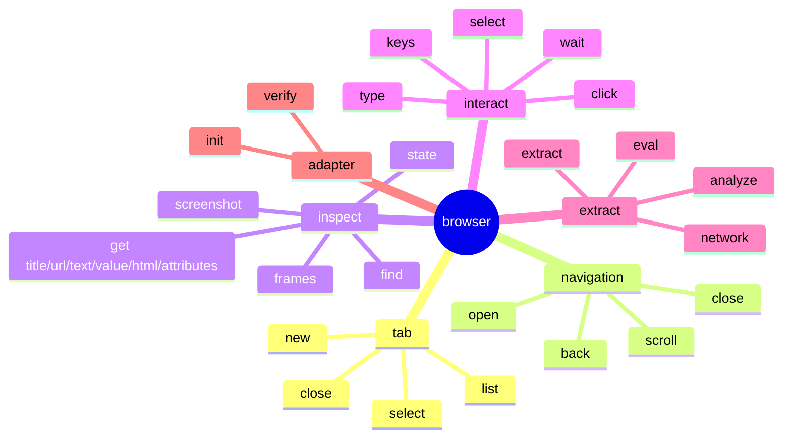
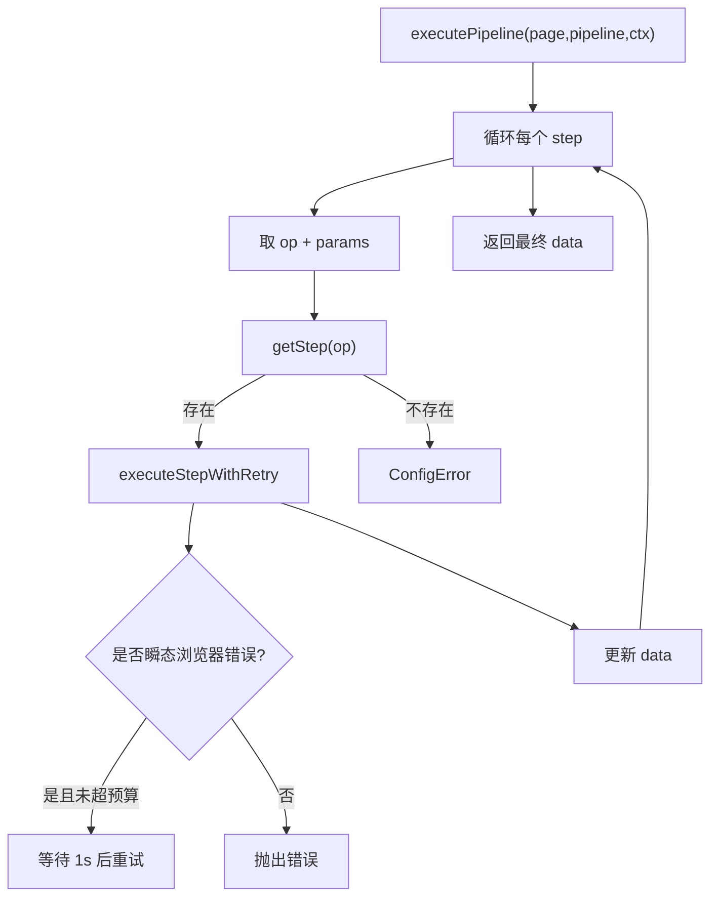
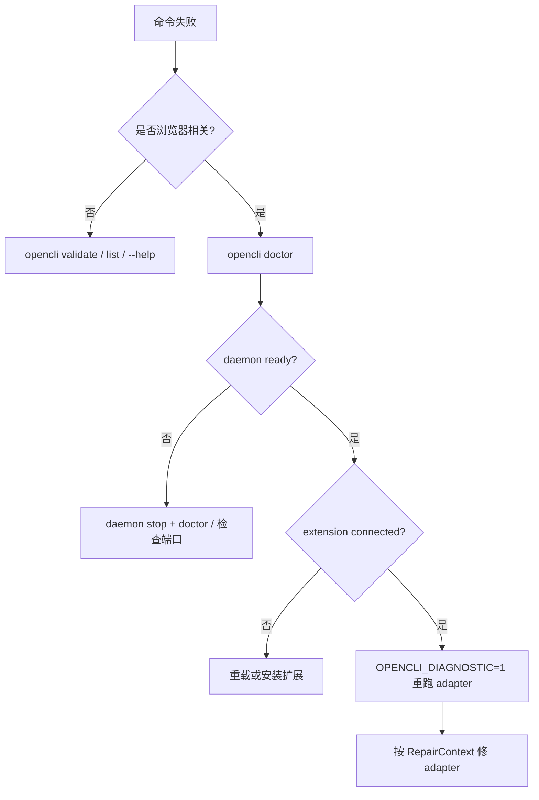

<!-- Source: README.md -->

# opencli DeepWiki

本 DeepWiki 面向想理解、维护或扩展 `jackwener/opencli` 的中文读者。它按 DeepWiki-open 风格组织：先给出系统地图，再拆入口、命令注册、浏览器桥接、适配器模型、插件、技能和运维边界。

## 项目定位

`opencli` 把网站、Electron 桌面应用和外部命令行工具统一成 `opencli <site> <command>` 的接口。它的核心不是单一爬虫，而是一套可发现、可验证、可由 Agent 驱动的命令运行时：内置/用户 adapter 负责站点能力，Browser Bridge 负责真实 Chrome 自动化，plugin/external CLI 负责扩展生态。

Sources: [README.md:12-22](../README.md#L12-L22), [package.json:1-15](../../../project-repos/opencli/package.json#L1-L15), [src/main.ts:27-47](../../../project-repos/opencli/src/main.ts#L27-L47)

<details class="source-snippets">
<summary>引用源码</summary>

<!-- source-snippets:start -->

#### `README.md:12-22`

```markdown
1. [系统总览](pages/01-system-overview.md)
2. [启动、发现与命令生命周期](pages/02-startup-discovery-command-lifecycle.md)
3. [Adapter 模型与策略](pages/03-adapter-model-and-strategies.md)
4. [浏览器桥接与 Chrome 扩展](pages/04-browser-bridge-and-extension.md)
5. [Agent 浏览器命令面](pages/05-agent-browser-command-surface.md)
6. [Pipeline、模板与数据抽取](pages/06-pipeline-template-and-data-extraction.md)
7. [Plugin 与外部 CLI Hub](pages/07-plugin-and-external-cli-hub.md)
8. [Skills 与 Agent 工作流](pages/08-skills-and-agent-workflows.md)
9. [测试、发布与日常运维](pages/09-testing-release-and-operations.md)
10. [安全、隐私与边界](pages/10-security-privacy-and-boundaries.md)

```

#### `package.json:1-15`

> 未找到引用文件：`package.json`

#### `src/main.ts:27-47`

> 未找到引用文件：`src/main.ts`

<!-- source-snippets:end -->
</details>
## 阅读顺序

1. [系统总览](pages/01-system-overview.md)
2. [启动、发现与命令生命周期](pages/02-startup-discovery-command-lifecycle.md)
3. [Adapter 模型与策略](pages/03-adapter-model-and-strategies.md)
4. [浏览器桥接与 Chrome 扩展](pages/04-browser-bridge-and-extension.md)
5. [Agent 浏览器命令面](pages/05-agent-browser-command-surface.md)
6. [Pipeline、模板与数据抽取](pages/06-pipeline-template-and-data-extraction.md)
7. [Plugin 与外部 CLI Hub](pages/07-plugin-and-external-cli-hub.md)
8. [Skills 与 Agent 工作流](pages/08-skills-and-agent-workflows.md)
9. [测试、发布与日常运维](pages/09-testing-release-and-operations.md)
10. [安全、隐私与边界](pages/10-security-privacy-and-boundaries.md)

## 生成物

- [00-repo-inventory.md](00-repo-inventory.md)：仓库盘点、语言和目录分布。
- [source-manifest.json](source-manifest.json)：源码文件清单。
- [wiki-structure.json](wiki-structure.json)：页面结构和依赖关系。
- [exports/full-wiki.md](exports/full-wiki.md)：合并版全文。
- [skills/](skills/)：仓库中 skills 的中文审阅副本。

## 一句话架构



Sources: [src/main.ts:96-148](../../../project-repos/opencli/src/main.ts#L96-L148), [src/discovery.ts:91-148](../../../project-repos/opencli/src/discovery.ts#L91-L148), [src/registry.ts:88-119](../../../project-repos/opencli/src/registry.ts#L88-L119), [src/execution.ts:77-153](../../../project-repos/opencli/src/execution.ts#L77-L153), [src/browser/bridge.ts:21-45](../../../project-repos/opencli/src/browser/bridge.ts#L21-L45)

<details class="source-snippets">
<summary>引用源码</summary>

<!-- source-snippets:start -->

#### `src/main.ts:96-148`

> 未找到引用文件：`src/main.ts`

#### `src/discovery.ts:91-148`

> 未找到引用文件：`src/discovery.ts`

#### `src/registry.ts:88-119`

> 未找到引用文件：`src/registry.ts`

#### `src/execution.ts:77-153`

> 未找到引用文件：`src/execution.ts`

#### `src/browser/bridge.ts:21-45`

> 未找到引用文件：`src/browser/bridge.ts`

<!-- source-snippets:end -->
</details>
---

<!-- Source: pages/01-system-overview.md -->

# 系统总览

<details><summary>相关源文件</summary>

- `README.md`
- `package.json`
- `src/main.ts`
- `src/cli.ts`
- `src/registry.ts`
- `src/discovery.ts`

</details>

## 核心定位

opencli 的目标是把三类能力统一成一个命令面：

- 站点 adapter：`opencli <site> <command>`，内置 adapter 在 `clis/`，用户 adapter 在 `~/.opencli/clis/`。
- 浏览器驱动：`opencli browser *`，用于真实 Chrome 窗口里的点击、输入、抽取、抓包和页面状态读取。
- 外部 CLI passthrough：`opencli gh`、`opencli docker`、`opencli vercel` 等，通过统一入口发现和调用外部工具。

README 对这三类能力有直接描述，package 元数据说明包名是 `@jackwener/opencli`，二进制入口是 `opencli`，运行要求是 Node `>=21`。  
Sources: [README.md:12-22](../README.md#L12-L22), [package.json:1-15](../../../project-repos/opencli/package.json#L1-L15)

<details class="source-snippets">
<summary>引用源码</summary>

<!-- source-snippets:start -->

#### `README.md:12-22`

```markdown
1. [系统总览](pages/01-system-overview.md)
2. [启动、发现与命令生命周期](pages/02-startup-discovery-command-lifecycle.md)
3. [Adapter 模型与策略](pages/03-adapter-model-and-strategies.md)
4. [浏览器桥接与 Chrome 扩展](pages/04-browser-bridge-and-extension.md)
5. [Agent 浏览器命令面](pages/05-agent-browser-command-surface.md)
6. [Pipeline、模板与数据抽取](pages/06-pipeline-template-and-data-extraction.md)
7. [Plugin 与外部 CLI Hub](pages/07-plugin-and-external-cli-hub.md)
8. [Skills 与 Agent 工作流](pages/08-skills-and-agent-workflows.md)
9. [测试、发布与日常运维](pages/09-testing-release-and-operations.md)
10. [安全、隐私与边界](pages/10-security-privacy-and-boundaries.md)

```

#### `package.json:1-15`

> 未找到引用文件：`package.json`

<!-- source-snippets:end -->
</details>
## 系统边界



这个边界里有两个浏览器通道：

- 普通网站自动化走 BrowserBridge，它会确保 daemon 和扩展连接可用。
- Electron app 或显式 CDP endpoint 走 CDPBridge，直接连 WebSocket 调 Chrome DevTools Protocol。

Sources: [src/runtime.ts:7-14](../../../project-repos/opencli/src/runtime.ts#L7-L14), [src/browser/bridge.ts:21-45](../../../project-repos/opencli/src/browser/bridge.ts#L21-L45), [src/browser/cdp.ts:50-92](../../../project-repos/opencli/src/browser/cdp.ts#L50-L92)

<details class="source-snippets">
<summary>引用源码</summary>

<!-- source-snippets:start -->

#### `src/runtime.ts:7-14`

> 未找到引用文件：`src/runtime.ts`

#### `src/browser/bridge.ts:21-45`

> 未找到引用文件：`src/browser/bridge.ts`

#### `src/browser/cdp.ts:50-92`

> 未找到引用文件：`src/browser/cdp.ts`

<!-- source-snippets:end -->
</details>
## 启动时做什么

`src/main.ts` 是实际启动器。它先设置内置和用户 adapter 目录，再处理全局 `--live`、`--focus`、版本、completion 等快路径；完整启动路径会动态导入 CLI、discovery、update check、hooks 等模块，随后确保用户 shim/adapter 目录存在、发现内置/用户/plugin adapter、触发启动 hook，最后调用 `runCli`。  
Sources: [src/main.ts:27-47](../../../project-repos/opencli/src/main.ts#L27-L47), [src/main.ts:49-94](../../../project-repos/opencli/src/main.ts#L49-L94), [src/main.ts:96-148](../../../project-repos/opencli/src/main.ts#L96-L148)

<details class="source-snippets">
<summary>引用源码</summary>

<!-- source-snippets:start -->

#### `src/main.ts:27-47`

> 未找到引用文件：`src/main.ts`

#### `src/main.ts:49-94`

> 未找到引用文件：`src/main.ts`

#### `src/main.ts:96-148`

> 未找到引用文件：`src/main.ts`

<!-- source-snippets:end -->
</details>
## 目录级心智模型

| 目录/文件 | 角色 |
|---|---|
| `src/main.ts` | 启动、快路径和 discovery 编排 |
| `src/cli.ts` | Commander 命令面，内置命令和浏览器子命令都在这里注册 |
| `src/registry.ts` | adapter 的 `cli()` 注册 API、策略枚举和全局 registry |
| `src/execution.ts` | adapter 执行入口，处理参数、浏览器 session、timeout、hook、诊断 |
| `src/browser/` | BrowserBridge、daemon client、Page/CDP Page 抽象 |
| `extension/` | Chrome MV3 扩展，接收 daemon 指令并调用 chrome.debugger/tabs/cookies |
| `clis/` | 内置站点 adapter |
| `skills/` | Agent 使用 opencli 的本地技能说明 |

Sources: [src/cli.ts:370-453](../../../project-repos/opencli/src/cli.ts#L370-L453), [src/registry.ts:7-74](../../../project-repos/opencli/src/registry.ts#L7-L74), [src/execution.ts:1-11](../../../project-repos/opencli/src/execution.ts#L1-L11), [extension/manifest.json:1-38](../../../project-repos/opencli/extension/manifest.json#L1-L38)

<details class="source-snippets">
<summary>引用源码</summary>

<!-- source-snippets:start -->

#### `src/cli.ts:370-453`

> 未找到引用文件：`src/cli.ts`

#### `src/registry.ts:7-74`

> 未找到引用文件：`src/registry.ts`

#### `src/execution.ts:1-11`

> 未找到引用文件：`src/execution.ts`

#### `extension/manifest.json:1-38`

> 未找到引用文件：`extension/manifest.json`

<!-- source-snippets:end -->
</details>
## 命令数量与规模

当前源码清单显示仓库包含大量站点 adapter 和技能文档。构建产物 `cli-manifest.json` 是 adapter 的预编译清单，当前扫描到 628 个命令，覆盖 100+ 站点或应用；仓库盘点中 `.js`、`.ts`、`.md` 是主要文件类型。  
Sources: [src/build-manifest.ts:19-54](../../../project-repos/opencli/src/build-manifest.ts#L19-L54), [src/build-manifest.ts:156-179](../../../project-repos/opencli/src/build-manifest.ts#L156-L179), [00-repo-inventory.md:1-80](../00-repo-inventory.md#L1-L80)

<details class="source-snippets">
<summary>引用源码</summary>

<!-- source-snippets:start -->

#### `src/build-manifest.ts:19-54`

> 未找到引用文件：`src/build-manifest.ts`

#### `src/build-manifest.ts:156-179`

> 未找到引用文件：`src/build-manifest.ts`

#### `00-repo-inventory.md:1-80`

```markdown
# 00 - 仓库盘点

## Source

- Path: `/private/tmp/deepwiki-it-sources/opencli`
- Remote: `https://github.com/jackwener/opencli.git`
- Branch: `main`
- Commit: `d9c96f7e3b0075be222d2c628ff8d4786cc2ebfb`

## File Summary

- Files scanned: 1318
- Top-level directories: `.github`, `autoresearch`, `clis`, `designs`, `docs`, `extension`, `scripts`, `skills`, `src`, `tests`

| Extension | Count |
|-----------|------:|
| `.js` | 895 |
| `.ts` | 196 |
| `.md` | 176 |
| `.yml` | 13 |
| `.json` | 13 |
| `.png` | 5 |
| `.sh` | 4 |
| `[no extension]` | 3 |
| `.txt` | 3 |
| `.html` | 3 |
| `.lock` | 2 |
| `.cjs` | 2 |
| `.mts` | 1 |
| `.mjs` | 1 |
| `.yaml` | 1 |

## Manifests and Build Files

- `extension/package-lock.json`
- `extension/package.json`
- `package-lock.json`
- `package.json`

## Documentation

- `CHANGELOG.md`
- `CONTRIBUTING.md`
- `README.md`
- `README.zh-CN.md`
- `docs/adapters-doc/ones.md`
- `docs/adapters/browser/1688.md`
- `docs/adapters/browser/36kr.md`
- `docs/adapters/browser/51job.md`
- `docs/adapters/browser/amazon.md`
- `docs/adapters/browser/apple-podcasts.md`
- `docs/adapters/browser/arxiv.md`
- `docs/adapters/browser/baidu-scholar.md`
- `docs/adapters/browser/band.md`
- `docs/adapters/browser/barchart.md`
- `docs/adapters/browser/bbc.md`
- `docs/adapters/browser/bilibili.md`
- `docs/adapters/browser/binance.md`
- `docs/adapters/browser/bloomberg.md`
- `docs/adapters/browser/bluesky.md`
- `docs/adapters/browser/boss.md`
- `docs/adapters/browser/chaoxing.md`
- `docs/adapters/browser/chatgpt.md`
- `docs/adapters/browser/cnki.md`
- `docs/adapters/browser/coupang.md`
- `docs/adapters/browser/ctrip.md`
- `docs/adapters/browser/deepseek.md`
- `docs/adapters/browser/devto.md`
- `docs/adapters/browser/dictionary.md`
- `docs/adapters/browser/douban.md`
- `docs/adapters/browser/doubao.md`
- `docs/adapters/browser/douyin.md`
- `docs/adapters/browser/eastmoney.md`
- `docs/adapters/browser/facebook.md`
- `docs/adapters/browser/gemini.md`
- `docs/adapters/browser/gitee.md`
- `docs/adapters/browser/google-scholar.md`
- `docs/adapters/browser/google.md`
- `docs/adapters/browser/gov-law.md`
- `docs/adapters/browser/gov-policy.md`
```

<!-- source-snippets:end -->
</details>
## 最重要的设计取舍

opencli 把“发现”和“执行”分开：

- discovery 负责把内置、用户、本地 plugin 和 monorepo plugin 命令加载进共享 registry。
- Commander Adapter 负责把 registry 中的命令转成 CLI 子命令。
- execution 负责真正调用 `func` 或 `pipeline`，并在需要浏览器时创建页面会话。

这让 adapter 可以很轻：只声明 `site/name/strategy/args/columns/func` 或 `pipeline`，其他跨站点能力由 runtime 提供。  
Sources: [src/discovery.ts:91-148](../../../project-repos/opencli/src/discovery.ts#L91-L148), [src/discovery.ts:184-231](../../../project-repos/opencli/src/discovery.ts#L184-L231), [src/commanderAdapter.ts:30-56](../../../project-repos/opencli/src/commanderAdapter.ts#L30-L56), [src/execution.ts:77-153](../../../project-repos/opencli/src/execution.ts#L77-L153)

<details class="source-snippets">
<summary>引用源码</summary>

<!-- source-snippets:start -->

#### `src/discovery.ts:91-148`

> 未找到引用文件：`src/discovery.ts`

#### `src/discovery.ts:184-231`

> 未找到引用文件：`src/discovery.ts`

#### `src/commanderAdapter.ts:30-56`

> 未找到引用文件：`src/commanderAdapter.ts`

#### `src/execution.ts:77-153`

> 未找到引用文件：`src/execution.ts`

<!-- source-snippets:end -->
</details>
---

<!-- Source: pages/02-startup-discovery-command-lifecycle.md -->

# 启动、发现与命令生命周期

<details><summary>相关源文件</summary>

- `src/main.ts`
- `src/discovery.ts`
- `src/commanderAdapter.ts`
- `src/execution.ts`
- `src/hooks.ts`
- `src/output.ts`

</details>

## 启动阶段

opencli 的启动器先确定两个 adapter 根目录：

- 内置目录：包内 `clis/`
- 用户目录：`~/.opencli/clis`

随后它处理几个不需要完整加载 adapter 的快路径：`--version`、`completion`、manifest completion。这样 shell completion 和版本查询不会为动态 import、插件 discovery 支付完整成本。  
Sources: [src/main.ts:27-47](../../../project-repos/opencli/src/main.ts#L27-L47), [src/main.ts:49-94](../../../project-repos/opencli/src/main.ts#L49-L94)

<details class="source-snippets">
<summary>引用源码</summary>

<!-- source-snippets:start -->

#### `src/main.ts:27-47`

> 未找到引用文件：`src/main.ts`

#### `src/main.ts:49-94`

> 未找到引用文件：`src/main.ts`

<!-- source-snippets:end -->
</details>
完整启动路径才会导入 CLI、discovery、版本检查和 hook 模块，并按顺序执行：安装 Node 网络兼容层、确保用户 shim、确保用户 adapters 目录、发现内置和用户 adapter、发现插件、检查更新、发 `onStartup` hook，最后 `runCli`。  
Sources: [src/main.ts:96-148](../../../project-repos/opencli/src/main.ts#L96-L148)

<details class="source-snippets">
<summary>引用源码</summary>

<!-- source-snippets:start -->

#### `src/main.ts:96-148`

> 未找到引用文件：`src/main.ts`

<!-- source-snippets:end -->
</details>
## Discovery 层



`discoverClis()` 优先读 manifest；没有 manifest 时扫描目录。用户运行时目录固定在 `~/.opencli` 下，插件目录为 `~/.opencli/plugins`，monorepo 插件则通过 `~/.opencli/monorepos` 和 symlink 管理。  
Sources: [src/discovery.ts:21-26](../../../project-repos/opencli/src/discovery.ts#L21-L26), [src/discovery.ts:91-108](../../../project-repos/opencli/src/discovery.ts#L91-L108), [src/discovery.ts:110-148](../../../project-repos/opencli/src/discovery.ts#L110-L148), [src/discovery.ts:184-231](../../../project-repos/opencli/src/discovery.ts#L184-L231)

<details class="source-snippets">
<summary>引用源码</summary>

<!-- source-snippets:start -->

#### `src/discovery.ts:21-26`

> 未找到引用文件：`src/discovery.ts`

#### `src/discovery.ts:91-108`

> 未找到引用文件：`src/discovery.ts`

#### `src/discovery.ts:110-148`

> 未找到引用文件：`src/discovery.ts`

#### `src/discovery.ts:184-231`

> 未找到引用文件：`src/discovery.ts`

<!-- source-snippets:end -->
</details>
## Registry 到 Commander

adapter 使用 `cli(opts)` 注册命令。注册时会规范化策略、浏览器需求、预导航行为和别名，然后把 canonical `site/name` 与 alias 都写入共享 registry。  
Sources: [src/registry.ts:95-119](../../../project-repos/opencli/src/registry.ts#L95-L119), [src/registry.ts:133-163](../../../project-repos/opencli/src/registry.ts#L133-L163), [src/registry.ts:165-195](../../../project-repos/opencli/src/registry.ts#L165-L195)

<details class="source-snippets">
<summary>引用源码</summary>

<!-- source-snippets:start -->

#### `src/registry.ts:95-119`

> 未找到引用文件：`src/registry.ts`

#### `src/registry.ts:133-163`

> 未找到引用文件：`src/registry.ts`

#### `src/registry.ts:165-195`

> 未找到引用文件：`src/registry.ts`

<!-- source-snippets:end -->
</details>
Commander Adapter 把每个 `CliCommand` 变成 CLI 子命令：

- 逐个注册 positional args 和 named options。
- 默认增加 `-f/--format` 和 `-v/--verbose`。
- action 回调中收集参数和 option 来源，调用 `executeCommand`，再渲染输出。

Sources: [src/commanderAdapter.ts:30-56](../../../project-repos/opencli/src/commanderAdapter.ts#L30-L56), [src/commanderAdapter.ts:58-125](../../../project-repos/opencli/src/commanderAdapter.ts#L58-L125), [src/commanderAdapter.ts:165-179](../../../project-repos/opencli/src/commanderAdapter.ts#L165-L179)

<details class="source-snippets">
<summary>引用源码</summary>

<!-- source-snippets:start -->

#### `src/commanderAdapter.ts:30-56`

> 未找到引用文件：`src/commanderAdapter.ts`

#### `src/commanderAdapter.ts:58-125`

> 未找到引用文件：`src/commanderAdapter.ts`

#### `src/commanderAdapter.ts:165-179`

> 未找到引用文件：`src/commanderAdapter.ts`

<!-- source-snippets:end -->
</details>
## 执行路径



`executeCommand` 是单一执行入口。它负责 lazy-load manifest command、热加载用户 adapter、执行函数型 adapter 或 pipeline adapter，并在 browser command 需要时创建 browser session。  
Sources: [src/execution.ts:33-75](../../../project-repos/opencli/src/execution.ts#L33-L75), [src/execution.ts:77-133](../../../project-repos/opencli/src/execution.ts#L77-L133), [src/execution.ts:155-276](../../../project-repos/opencli/src/execution.ts#L155-L276)

<details class="source-snippets">
<summary>引用源码</summary>

<!-- source-snippets:start -->

#### `src/execution.ts:33-75`

> 未找到引用文件：`src/execution.ts`

#### `src/execution.ts:77-133`

> 未找到引用文件：`src/execution.ts`

#### `src/execution.ts:155-276`

> 未找到引用文件：`src/execution.ts`

<!-- source-snippets:end -->
</details>
## Hook 和诊断切入点

插件可以注册 `onStartup`、`onBeforeExecute`、`onAfterExecute`。Hook 存在 `globalThis.__opencli_hooks__`，避免多份模块副本导致 hook store 分裂。hook 执行失败只记录 warning，不阻断主命令。  
Sources: [src/hooks.ts:1-12](../../../project-repos/opencli/src/hooks.ts#L1-L12), [src/hooks.ts:35-50](../../../project-repos/opencli/src/hooks.ts#L35-L50), [src/hooks.ts:69-84](../../../project-repos/opencli/src/hooks.ts#L69-L84)

<details class="source-snippets">
<summary>引用源码</summary>

<!-- source-snippets:start -->

#### `src/hooks.ts:1-12`

> 未找到引用文件：`src/hooks.ts`

#### `src/hooks.ts:35-50`

> 未找到引用文件：`src/hooks.ts`

#### `src/hooks.ts:69-84`

> 未找到引用文件：`src/hooks.ts`

<!-- source-snippets:end -->
</details>
失败时，execution 层会给出 AutoFix 线索；如果启用 `OPENCLI_DIAGNOSTIC=1`，诊断模块会构造带 adapter 源码、页面状态、网络请求和 console error 的 RepairContext。  
Sources: [src/commanderAdapter.ts:137-159](../../../project-repos/opencli/src/commanderAdapter.ts#L137-L159), [src/diagnostic.ts:1-13](../../../project-repos/opencli/src/diagnostic.ts#L1-L13), [src/diagnostic.ts:299-360](../../../project-repos/opencli/src/diagnostic.ts#L299-L360)

<details class="source-snippets">
<summary>引用源码</summary>

<!-- source-snippets:start -->

#### `src/commanderAdapter.ts:137-159`

> 未找到引用文件：`src/commanderAdapter.ts`

#### `src/diagnostic.ts:1-13`

> 未找到引用文件：`src/diagnostic.ts`

#### `src/diagnostic.ts:299-360`

> 未找到引用文件：`src/diagnostic.ts`

<!-- source-snippets:end -->
</details>
## 输出格式

输出渲染支持 `table/json/plain/markdown/csv/yaml`。如果 stdout 不是 TTY 且用户没有显式传 `-f`，默认 table 会降级成 yaml，便于管道消费。  
Sources: [src/output.ts:30-48](../../../project-repos/opencli/src/output.ts#L30-L48), [src/output.ts:50-79](../../../project-repos/opencli/src/output.ts#L50-L79), [src/output.ts:81-138](../../../project-repos/opencli/src/output.ts#L81-L138)

<details class="source-snippets">
<summary>引用源码</summary>

<!-- source-snippets:start -->

#### `src/output.ts:30-48`

> 未找到引用文件：`src/output.ts`

#### `src/output.ts:50-79`

> 未找到引用文件：`src/output.ts`

#### `src/output.ts:81-138`

> 未找到引用文件：`src/output.ts`

<!-- source-snippets:end -->
</details>
## 常见调试入口

| 问题 | 入口 |
|---|---|
| 命令没有出现 | `discoverClis`、manifest、`registerCommand` |
| 命令出现但参数不对 | `commanderAdapter.ts` 的 args/options 注册 |
| adapter 没执行 | `executeCommand` 的 lazy-load 或 func/pipeline 分支 |
| 输出格式异常 | `output.ts` 的 render 分支 |
| 插件影响执行 | `hooks.ts` 的 before/after hook |

Sources: [src/discovery.ts:150-182](../../../project-repos/opencli/src/discovery.ts#L150-L182), [src/commanderAdapter.ts:58-125](../../../project-repos/opencli/src/commanderAdapter.ts#L58-L125), [src/execution.ts:77-153](../../../project-repos/opencli/src/execution.ts#L77-L153), [src/output.ts:40-47](../../../project-repos/opencli/src/output.ts#L40-L47)

<details class="source-snippets">
<summary>引用源码</summary>

<!-- source-snippets:start -->

#### `src/discovery.ts:150-182`

> 未找到引用文件：`src/discovery.ts`

#### `src/commanderAdapter.ts:58-125`

> 未找到引用文件：`src/commanderAdapter.ts`

#### `src/execution.ts:77-153`

> 未找到引用文件：`src/execution.ts`

#### `src/output.ts:40-47`

> 未找到引用文件：`src/output.ts`

<!-- source-snippets:end -->
</details>
---

<!-- Source: pages/03-adapter-model-and-strategies.md -->

# Adapter 模型与策略

<details><summary>相关源文件</summary>

- `src/registry.ts`
- `src/capabilityRouting.ts`
- `src/execution.ts`
- `src/build-manifest.ts`
- `src/validate.ts`

</details>

## Adapter 是什么

在 opencli 中，adapter 是一个向 registry 注册的命令定义。它声明站点、命令名、描述、参数、输出列、鉴权/浏览器策略，以及执行逻辑。执行逻辑可以是 `func`，也可以是 YAML 风格的 `pipeline`。  
Sources: [src/registry.ts:16-74](../../../project-repos/opencli/src/registry.ts#L16-L74), [src/registry.ts:95-119](../../../project-repos/opencli/src/registry.ts#L95-L119)

<details class="source-snippets">
<summary>引用源码</summary>

<!-- source-snippets:start -->

#### `src/registry.ts:16-74`

> 未找到引用文件：`src/registry.ts`

#### `src/registry.ts:95-119`

> 未找到引用文件：`src/registry.ts`

<!-- source-snippets:end -->
</details>
最小心智模型：



## Strategy 决定能力边界

策略枚举包括：

| 策略 | 含义 |
|---|---|
| `PUBLIC` | 不依赖浏览器登录态，通常可直接 HTTP |
| `LOCAL` | 本地或开发环境接口 |
| `COOKIE` | 需要从已登录浏览器读取 cookie |
| `HEADER` | 需要浏览器上下文中的 header/token |
| `INTERCEPT` | 需要通过浏览器抓真实请求 |
| `UI` | 需要 DOM 交互 |

Sources: [src/registry.ts:7-14](../../../project-repos/opencli/src/registry.ts#L7-L14)

<details class="source-snippets">
<summary>引用源码</summary>

<!-- source-snippets:start -->

#### `src/registry.ts:7-14`

> 未找到引用文件：`src/registry.ts`

<!-- source-snippets:end -->
</details>
`normalizeCommand` 会把 strategy 转成 browser 和 navigateBefore 等运行字段。例如需要 cookie、header、intercept、UI 的命令通常需要浏览器上下文；pipeline 中出现浏览器专属步骤也会触发浏览器 session。  
Sources: [src/registry.ts:133-163](../../../project-repos/opencli/src/registry.ts#L133-L163), [src/capabilityRouting.ts:3-14](../../../project-repos/opencli/src/capabilityRouting.ts#L3-L14), [src/capabilityRouting.ts:23-31](../../../project-repos/opencli/src/capabilityRouting.ts#L23-L31)

<details class="source-snippets">
<summary>引用源码</summary>

<!-- source-snippets:start -->

#### `src/registry.ts:133-163`

> 未找到引用文件：`src/registry.ts`

#### `src/capabilityRouting.ts:3-14`

> 未找到引用文件：`src/capabilityRouting.ts`

#### `src/capabilityRouting.ts:23-31`

> 未找到引用文件：`src/capabilityRouting.ts`

<!-- source-snippets:end -->
</details>
## func 与 pipeline

`executeCommand` 先处理参数，再决定是否创建页面。执行时：

- 如果是 lazy command，先导入模块并从 registry 找到真正命令。
- 如果有 `func`，直接调用函数。
- 如果有 `pipeline`，交给 pipeline executor。
- 如果命令需要浏览器，会在调用前做预导航和 session 准备。

Sources: [src/execution.ts:33-75](../../../project-repos/opencli/src/execution.ts#L33-L75), [src/execution.ts:77-133](../../../project-repos/opencli/src/execution.ts#L77-L133), [src/execution.ts:135-153](../../../project-repos/opencli/src/execution.ts#L135-L153), [src/execution.ts:155-276](../../../project-repos/opencli/src/execution.ts#L155-L276)

<details class="source-snippets">
<summary>引用源码</summary>

<!-- source-snippets:start -->

#### `src/execution.ts:33-75`

> 未找到引用文件：`src/execution.ts`

#### `src/execution.ts:77-133`

> 未找到引用文件：`src/execution.ts`

#### `src/execution.ts:135-153`

> 未找到引用文件：`src/execution.ts`

#### `src/execution.ts:155-276`

> 未找到引用文件：`src/execution.ts`

<!-- source-snippets:end -->
</details>
## Manifest 的作用

构建时的 manifest 编译器会扫描 `clis/`，导入 JS adapter 并捕获 registry 中新增的命令，然后写成 `cli-manifest.json`。运行时优先用 manifest 以降低启动时扫描和 import 成本。  
Sources: [src/build-manifest.ts:19-54](../../../project-repos/opencli/src/build-manifest.ts#L19-L54), [src/build-manifest.ts:58-105](../../../project-repos/opencli/src/build-manifest.ts#L58-L105), [src/build-manifest.ts:107-154](../../../project-repos/opencli/src/build-manifest.ts#L107-L154), [src/build-manifest.ts:156-179](../../../project-repos/opencli/src/build-manifest.ts#L156-L179)

<details class="source-snippets">
<summary>引用源码</summary>

<!-- source-snippets:start -->

#### `src/build-manifest.ts:19-54`

> 未找到引用文件：`src/build-manifest.ts`

#### `src/build-manifest.ts:58-105`

> 未找到引用文件：`src/build-manifest.ts`

#### `src/build-manifest.ts:107-154`

> 未找到引用文件：`src/build-manifest.ts`

#### `src/build-manifest.ts:156-179`

> 未找到引用文件：`src/build-manifest.ts`

<!-- source-snippets:end -->
</details>
## 校验规则

`validate` 不再扫文件本身，而是校验已加载 registry。它检查：

- registry 是否为空。
- browser command 是否缺 domain。
- pipeline step 名是否在已知集合内。
- 命令是否至少有 `func`、`pipeline` 或 `_lazy`。
- 参数是否重名，positional 参数顺序是否异常。

Sources: [src/validate.ts:27-45](../../../project-repos/opencli/src/validate.ts#L27-L45), [src/validate.ts:81-133](../../../project-repos/opencli/src/validate.ts#L81-L133)

<details class="source-snippets">
<summary>引用源码</summary>

<!-- source-snippets:start -->

#### `src/validate.ts:27-45`

> 未找到引用文件：`src/validate.ts`

#### `src/validate.ts:81-133`

> 未找到引用文件：`src/validate.ts`

<!-- source-snippets:end -->
</details>
## Adapter 输出契约

adapter 的 `columns` 应和返回对象 key 对齐。最终输出由 `output.ts` 统一渲染成 table、json、plain、markdown、csv 或 yaml。Agent 场景优先使用 `-f json`，因为它避免 table 渲染和颜色文本干扰。  
Sources: [src/output.ts:20-28](../../../project-repos/opencli/src/output.ts#L20-L28), [src/output.ts:30-48](../../../project-repos/opencli/src/output.ts#L30-L48), [skills/opencli-usage/SKILL.md:56-73](../skills/opencli-usage/SKILL.md#L56-L73)

<details class="source-snippets">
<summary>引用源码</summary>

<!-- source-snippets:start -->

#### `src/output.ts:20-28`

> 未找到引用文件：`src/output.ts`

#### `src/output.ts:30-48`

> 未找到引用文件：`src/output.ts`

#### `skills/opencli-usage/SKILL.md:56-73`

```markdown
不要硬编码 adapter 列表。站点和命令数每周都会变化，`opencli list -f json` 是事实来源；它每个命令输出 `{site, name, aliases, description, strategy, browser, args, columns, ...}`。

## 通用 flag

| flag | 效果 |
|---|---|
| `-f, --format <fmt>` | `table`（TTY 默认）、`yaml`（非 TTY 默认）、`json`、`plain`、`md`、`csv`。Agent 通常应显式传 `-f json`。 |
| `-v, --verbose` | 输出 debug 日志和失败栈，并为进程设置 `OPENCLI_VERBOSE=1`。 |

命令专属 flag（如 `--limit`、`--tab`、`--filter`）不是通用的；用 `<site> <command> --help` 查询。

## 输出格式

- `json`：2 空格缩进，Agent 默认首选。
- `plain`：对 chat 类命令打印单个主字段（`response`/`content`/`text`/`value`），适合管道。
- `yaml`：非 TTY 且未显式 `-f` 时的 fallback。
- `table`：彩色表格，给人看。
- `md`、`csv`：直接表格化导出。
```

<!-- source-snippets:end -->
</details>
## 编写 adapter 的推荐路径

仓库内的 adapter-author skill 建议从站点侦察、API 发现、endpoint 验证、字段解码、columns 设计，再到 `opencli browser init` 和 `opencli browser verify`。它强调 memory 命中后也必须重新验证 endpoint，不要直接写 adapter。  
Sources: [skills/opencli-adapter-author/SKILL.md:29-100](../skills/opencli-adapter-author/SKILL.md#L29-L100), [skills/opencli-adapter-author/SKILL.md:104-151](../skills/opencli-adapter-author/SKILL.md#L104-L151)

<details class="source-snippets">
<summary>引用源码</summary>

<!-- source-snippets:start -->

#### `skills/opencli-adapter-author/SKILL.md:29-100`

````markdown
## 顶层决策树

```
START
  │
  ▼
┌──────────────────────────┐
│ opencli doctor 通？      │── no ──→ 修桥接（doctor 输出里的提示）
└──────────────────────────┘
  │ yes
  ▼
┌────────────────────────────────────────────────────┐
│ 读站点记忆：                                        │
│   1. ~/.opencli/sites/<site>/endpoints.json         │
│   2. ~/.opencli/sites/<site>/notes.md               │
│   3. references/site-memory/<site>.md               │
└────────────────────────────────────────────────────┘
  │ 命中 endpoint + 字段 → 直接跳到【endpoint 验证】（不跳写 adapter！memory 可能过期）
  │ 没命中 → 继续
  ▼
┌──────────────────────────┐
│ 站点侦察（site-recon）    │  → Pattern A/B/C/D/E
└──────────────────────────┘
  │
  ▼
┌──────────────────────────┐
│ API 发现（api-discovery）│  §1 network → §2 state → §3 bundle → §4 token → §5 intercept
└──────────────────────────┘
  │ 拿到候选 endpoint
  ▼
┌────────────────────────────────────────────┐
│ 直接 fetch 验证 endpoint（memory 命中也要跑）│── 401/403 ──→ 回到 §4 排 token
│ 数据非空 + 200                              │── 空/HTML ──→ 回到 site-recon 换 Pattern
│ memory 里的值还活着吗？                     │── 站点换版 ──→ 标记旧 endpoint，回 api-discovery
└────────────────────────────────────────────┘
  │ OK
  ▼
┌───────────────────────────────────────┐
│ 字段解码（memory 里的 field-map 也要抽查）│  自解释 → 直接 / 已知代号 → field-conventions / 未知 → decode-playbook
│ 比一条已知字段和网页肉眼值，确认没错位     │
└───────────────────────────────────────┘
  │
  ▼
┌──────────────────────────┐
│ 设计 columns (output)    │  对照 output-design.md 的命名 / 类型 / 顺序
└──────────────────────────┘
  │
  ▼
┌──────────────────────────┐
│ opencli browser init      │  生成 ~/.opencli/clis/<site>/<name>.js 骨架
│ 复制最像的邻居 adapter    │
│ 改 name / URL / 映射三处  │
└──────────────────────────┘
  │
  ▼
┌──────────────────────────┐
│ opencli browser verify    │── 失败 ──→ autofix skill，回对应步骤
└──────────────────────────┘
  │ 成功
  ▼
┌──────────────────────────┐
│ 字段 vs 网页肉眼对一遍   │── 数值不对 ──→ 回字段解码
└──────────────────────────┘
  │ 对得上
  ▼
┌──────────────────────────┐
│ 回写 ~/.opencli/sites/   │  endpoints / field-map / notes / fixtures
└──────────────────────────┘
  │
  ▼
DONE
```
````

#### `skills/opencli-adapter-author/SKILL.md:104-151`

````markdown
## Runbook（一步一步勾选）

```
[ ] 1. opencli doctor 返回 "Everything looks good"
[ ] 2. 读站点记忆：
       [ ] ~/.opencli/sites/<site>/endpoints.json 存在？里面有想要的 endpoint？
       [ ] references/site-memory/<site>.md 存在？看"已知 endpoint"节
       [ ] 命中后：**跳到第 5（endpoint 验证） + 第 7（字段核对）**，不能直接跳第 9 写 adapter
       [ ] memory 写入超过 30 天（看 `verified_at`）→ 当作过期，按冷启动走 Step 3 → 4
[ ] 3. 侦察（site-recon.md）：
       [ ] **首选**：`opencli browser analyze <url>` 一步拿 pattern + 反爬 + 最近 adapter + next step
       [ ] `analyze` 结论模糊时再手跑：`open` → `wait time 2` (或 `wait xhr <regex>`) → `network`
       [ ] 定 Pattern（A / B / C / D / E）
[ ] 4. API 发现（api-discovery.md）按 Pattern 选 §：
       [ ] Pattern A → §1 network 精读
       [ ] Pattern B → §2 state 抽取 + §1 深层数据
       [ ] Pattern C → §3 bundle / script src 搜索
       [ ] Pattern D → §4 token 来源 + 降级 §5
       [ ] Pattern E → 找 HTTP 轮询接口；找不到才 §5
[ ] 5. 直接 fetch 候选 endpoint 验证：
       [ ] 返回 200
       [ ] 响应含目标数据（不是 HTML / 广告）
[ ] 6. 定鉴权策略：裸 fetch 通 → PUBLIC；要 cookie → COOKIE；要 header → HEADER；拿不到签名 → INTERCEPT
[ ] 7. 字段解码：
       [ ] 自解释 → 直接用 key
       [ ] 已知代号 → field-conventions.md 查表
       [ ] 未知代号 → field-decode-playbook.md（排序键对比 / 结构差分 / 常量排查）
[ ] 8. 设计 columns（output-design.md）：
       [ ] 命名 camelCase 且对齐邻居 adapter
       [ ] 类型 / 单位 / 百分比格式清楚
       [ ] 顺序：识别列 → 业务数字 → metadata
[ ] 9. 写 adapter（adapter-template.md）：
       [ ] opencli browser init <site>/<name>
       [ ] 找同站点或同类型最像的 adapter，cp 过来
       [ ] 改 name / URL / 字段映射
[ ] 10. opencli browser verify <site>/<name>
        [ ] 首轮通过后立刻 `--write-fixture` 生成 `~/.opencli/sites/<site>/verify/<cmd>.json` 种子
        [ ] 手改种子：加 `patterns`（URL / 日期 / ID 格式）+ `notEmpty`（核心字段）+ 收紧 `rowCount`
        [ ] 再跑一次 `opencli browser verify <site>/<name>`，确认 ✓ matches fixture
[ ] 11. 字段值 vs 网页肉眼比对（别只看 "Adapter works!"）
[ ] 12. 回写站点记忆（**verify 通过 + 肉眼比对对得上之后**，schema 见 `references/site-memory.md`）：
        [ ] `endpoints.json`：以 endpoint 的短名为 key，value = `{url, method, params.{required,optional}, response, verified_at: YYYY-MM-DD, notes}`
        [ ] `field-map.json`：只追加新代号。key = 字段代号，value = `{meaning, verified_at: YYYY-MM-DD, source}`；**已存在的 key 不要覆盖**，有冲突先和网页肉眼值对齐再写
        [ ] `notes.md`：顶部追加一段 `## YYYY-MM-DD by <agent/user>`，写本次写 adapter 时遇到的新坑 / 新结论
        [ ] `verify/<cmd>.json`：**必填。** `opencli browser verify` 的期望值（args / rowCount / columns / types / patterns / notEmpty），Step 10 已经让你生成了，这里只是 checklist
        [ ] `fixtures/<cmd>-<YYYYMMDDHHMM>.json`：存一份该 endpoint 的完整响应样本（去掉 cookie / token / 用户私有字段再存），给后续字段对比 / 离线 replay 用
        [ ] 调试过程中如果在 repo / adapter 目录 dump 过临时文件（`.dbg-*.html` / `raw-*.json` / 等），**在 commit 前清干净**——这些本来就该落在 `~/.opencli/sites/<site>/fixtures/` 或 `/tmp/`
```
````

<!-- source-snippets:end -->
</details>
---

<!-- Source: pages/04-browser-bridge-and-extension.md -->

# 浏览器桥接与 Chrome 扩展

<details><summary>相关源文件</summary>

- `src/browser/bridge.ts`
- `src/browser/daemon-client.ts`
- `src/browser/page.ts`
- `extension/src/background.ts`
- `extension/src/cdp.ts`
- `extension/manifest.json`

</details>

## 两条浏览器路径

opencli 有两类浏览器运行时：

- `BrowserBridge`：普通网站自动化。CLI 通过本地 daemon 与 Chrome 扩展通信，扩展再调用 Chrome APIs 和 `chrome.debugger`。
- `CDPBridge`：直接连 CDP WebSocket，主要用于 Electron app 或显式 `OPENCLI_CDP_ENDPOINT`。

Sources: [src/runtime.ts:7-14](../../../project-repos/opencli/src/runtime.ts#L7-L14), [src/browser/bridge.ts:21-45](../../../project-repos/opencli/src/browser/bridge.ts#L21-L45), [src/browser/cdp.ts:50-92](../../../project-repos/opencli/src/browser/cdp.ts#L50-L92)

<details class="source-snippets">
<summary>引用源码</summary>

<!-- source-snippets:start -->

#### `src/runtime.ts:7-14`

> 未找到引用文件：`src/runtime.ts`

#### `src/browser/bridge.ts:21-45`

> 未找到引用文件：`src/browser/bridge.ts`

#### `src/browser/cdp.ts:50-92`

> 未找到引用文件：`src/browser/cdp.ts`

<!-- source-snippets:end -->
</details>
## BrowserBridge 生命周期



`BrowserBridge` 不在 `close()` 时杀 daemon，daemon 是持久进程。它只清理当前 Page 引用；真实窗口关闭由 Page/extension 命令控制。  
Sources: [src/browser/bridge.ts:33-60](../../../project-repos/opencli/src/browser/bridge.ts#L33-L60)

<details class="source-snippets">
<summary>引用源码</summary>

<!-- source-snippets:start -->

#### `src/browser/bridge.ts:33-60`

> 未找到引用文件：`src/browser/bridge.ts`

<!-- source-snippets:end -->
</details>
## Daemon client 协议

CLI 端通过 `daemon-client.ts` 用 HTTP 调 daemon。命令统一为 `DaemonCommand`，action 包含 `exec`、`navigate`、`tabs`、`cookies`、`screenshot`、`close-window`、`sessions`、`set-file-input`、`insert-text`、`bind-current`、`network-capture-*`、`cdp`、`frames`。  
Sources: [src/browser/daemon-client.ts:22-55](../../../project-repos/opencli/src/browser/daemon-client.ts#L22-L55)

<details class="source-snippets">
<summary>引用源码</summary>

<!-- source-snippets:start -->

#### `src/browser/daemon-client.ts:22-55`

> 未找到引用文件：`src/browser/daemon-client.ts`

<!-- source-snippets:end -->
</details>
发送命令时最多重试 4 次：网络错误固定延迟重试，浏览器瞬态错误根据分类建议延迟重试。page-scoped 命令可以返回 `page` identity，后续调用会带上它避免猜测目标 tab。  
Sources: [src/browser/daemon-client.ts:129-185](../../../project-repos/opencli/src/browser/daemon-client.ts#L129-L185), [src/browser/daemon-client.ts:187-208](../../../project-repos/opencli/src/browser/daemon-client.ts#L187-L208), [src/browser/page.ts:40-67](../../../project-repos/opencli/src/browser/page.ts#L40-L67)

<details class="source-snippets">
<summary>引用源码</summary>

<!-- source-snippets:start -->

#### `src/browser/daemon-client.ts:129-185`

> 未找到引用文件：`src/browser/daemon-client.ts`

#### `src/browser/daemon-client.ts:187-208`

> 未找到引用文件：`src/browser/daemon-client.ts`

#### `src/browser/page.ts:40-67`

> 未找到引用文件：`src/browser/page.ts`

<!-- source-snippets:end -->
</details>
## Page 抽象

`Page` 是 CLI 侧的浏览器对象。它把高级操作转成 daemon action：

- `goto` 调 `navigate`，记住返回的 page identity，然后注入 stealth 和 DOM stability 等待。
- `evaluate` 调 `exec`，遇到 target navigation 可延迟重试。
- `tabs/newTab/closeTab/selectTab` 调 `tabs` action。
- `screenshot`、`setFileInput`、`insertText`、`frames`、`cdp` 都是明确 action。

Sources: [src/browser/page.ts:59-104](../../../project-repos/opencli/src/browser/page.ts#L59-L104), [src/browser/page.ts:126-140](../../../project-repos/opencli/src/browser/page.ts#L126-L140), [src/browser/page.ts:157-213](../../../project-repos/opencli/src/browser/page.ts#L157-L213), [src/browser/page.ts:215-280](../../../project-repos/opencli/src/browser/page.ts#L215-L280)

<details class="source-snippets">
<summary>引用源码</summary>

<!-- source-snippets:start -->

#### `src/browser/page.ts:59-104`

> 未找到引用文件：`src/browser/page.ts`

#### `src/browser/page.ts:126-140`

> 未找到引用文件：`src/browser/page.ts`

#### `src/browser/page.ts:157-213`

> 未找到引用文件：`src/browser/page.ts`

#### `src/browser/page.ts:215-280`

> 未找到引用文件：`src/browser/page.ts`

<!-- source-snippets:end -->
</details>
## 扩展侧分发

Chrome 扩展是 MV3 service worker。它启动后会探测 `/ping`、打开 WebSocket，发送 hello 和版本兼容信息，然后等待 daemon 下发 command。  
Sources: [extension/src/background.ts:40-87](../../../project-repos/opencli/extension/src/background.ts#L40-L87), [extension/src/protocol.ts:24-96](../../../project-repos/opencli/extension/src/protocol.ts#L24-L96)

<details class="source-snippets">
<summary>引用源码</summary>

<!-- source-snippets:start -->

#### `extension/src/background.ts:40-87`

> 未找到引用文件：`extension/src/background.ts`

#### `extension/src/protocol.ts:24-96`

> 未找到引用文件：`extension/src/protocol.ts`

<!-- source-snippets:end -->
</details>
扩展的 `handleCommand` 是 action dispatcher：根据 command action 分发到 exec、navigate、tabs、cookies、screenshot、cdp、sessions、file input、insert text、bind current、network capture、frames 等 handler。  
Sources: [extension/src/background.ts:301-350](../../../project-repos/opencli/extension/src/background.ts#L301-L350)

<details class="source-snippets">
<summary>引用源码</summary>

<!-- source-snippets:start -->

#### `extension/src/background.ts:301-350`

> 未找到引用文件：`extension/src/background.ts`

<!-- source-snippets:end -->
</details>
## 自动化窗口与 tab 绑定

扩展维护 workspace 级 automation session。它会解析 page identity 到 tabId，校验 tab 仍在 automation window 中；若 tab 漂移到其他窗口，会尝试移回。导航只允许 http/https，并在跳转前按需 detach debugger。  
Sources: [extension/src/background.ts:452-557](../../../project-repos/opencli/extension/src/background.ts#L452-L557), [extension/src/background.ts:615-713](../../../project-repos/opencli/extension/src/background.ts#L615-L713)

<details class="source-snippets">
<summary>引用源码</summary>

<!-- source-snippets:start -->

#### `extension/src/background.ts:452-557`

> 未找到引用文件：`extension/src/background.ts`

#### `extension/src/background.ts:615-713`

> 未找到引用文件：`extension/src/background.ts`

<!-- source-snippets:end -->
</details>
## CDP 能力与限制

扩展侧 CDP helper 使用 `chrome.debugger` attach tab，并对 attach/evaluate 做重试。它只允许 http/https/about:blank/data 等可调试 URL。网络 capture 对响应体设置 8 MiB 上限，请求体 1 MiB 上限。  
Sources: [extension/src/cdp.ts:13-18](../../../project-repos/opencli/extension/src/cdp.ts#L13-L18), [extension/src/cdp.ts:44-83](../../../project-repos/opencli/extension/src/cdp.ts#L44-L83), [extension/src/cdp.ts:141-183](../../../project-repos/opencli/extension/src/cdp.ts#L141-L183)

<details class="source-snippets">
<summary>引用源码</summary>

<!-- source-snippets:start -->

#### `extension/src/cdp.ts:13-18`

> 未找到引用文件：`extension/src/cdp.ts`

#### `extension/src/cdp.ts:44-83`

> 未找到引用文件：`extension/src/cdp.ts`

#### `extension/src/cdp.ts:141-183`

> 未找到引用文件：`extension/src/cdp.ts`

<!-- source-snippets:end -->
</details>
CDP passthrough 不是任意方法开放。`handleCdp` 只允许 allowlist 中的 DOM、Accessibility、Input、Page、Runtime.enable、Emulation 方法；`Runtime.evaluate` 走 `exec` action。  
Sources: [extension/src/background.ts:816-860](../../../project-repos/opencli/extension/src/background.ts#L816-L860)

<details class="source-snippets">
<summary>引用源码</summary>

<!-- source-snippets:start -->

#### `extension/src/background.ts:816-860`

> 未找到引用文件：`extension/src/background.ts`

<!-- source-snippets:end -->
</details>
## 扩展权限

扩展 manifest 声明权限包括 `debugger`、`tabs`、`cookies`、`activeTab`、`alarms`，host permissions 是 `<all_urls>`。这解释了为什么 doctor 和用户安装指引是关键运维步骤。  
Sources: [extension/manifest.json:1-15](../../../project-repos/opencli/extension/manifest.json#L1-L15), [src/doctor.ts:90-157](../../../project-repos/opencli/src/doctor.ts#L90-L157)

<details class="source-snippets">
<summary>引用源码</summary>

<!-- source-snippets:start -->

#### `extension/manifest.json:1-15`

> 未找到引用文件：`extension/manifest.json`

#### `src/doctor.ts:90-157`

> 未找到引用文件：`src/doctor.ts`

<!-- source-snippets:end -->
</details>
---

<!-- Source: pages/05-agent-browser-command-surface.md -->

# Agent 浏览器命令面

<details><summary>相关源文件</summary>

- `src/cli.ts`
- `src/browser/page.ts`
- `skills/opencli-browser/SKILL.md`

</details>

## 设计目标

`opencli browser *` 是给 Agent 使用的真实浏览器控制面。它不要求预先写 adapter，适合临时打开网页、读取状态、点击、输入、抓包和抽取长文。浏览器命令统一走专用 workspace，并把默认 tab identity 持久化到 `~/.opencli/cache/browser-state/`。  
Sources: [src/cli.ts:224-261](../../../project-repos/opencli/src/cli.ts#L224-L261), [src/cli.ts:317-338](../../../project-repos/opencli/src/cli.ts#L317-L338)

<details class="source-snippets">
<summary>引用源码</summary>

<!-- source-snippets:start -->

#### `src/cli.ts:224-261`

> 未找到引用文件：`src/cli.ts`

#### `src/cli.ts:317-338`

> 未找到引用文件：`src/cli.ts`

<!-- source-snippets:end -->
</details>
## 命令族



Sources: [src/cli.ts:478-486](../../../project-repos/opencli/src/cli.ts#L478-L486), [src/cli.ts:570-631](../../../project-repos/opencli/src/cli.ts#L570-L631), [src/cli.ts:647-707](../../../project-repos/opencli/src/cli.ts#L647-L707), [src/cli.ts:782-829](../../../project-repos/opencli/src/cli.ts#L782-L829), [src/cli.ts:1491-1698](../../../project-repos/opencli/src/cli.ts#L1491-L1698)

<details class="source-snippets">
<summary>引用源码</summary>

<!-- source-snippets:start -->

#### `src/cli.ts:478-486`

> 未找到引用文件：`src/cli.ts`

#### `src/cli.ts:570-631`

> 未找到引用文件：`src/cli.ts`

#### `src/cli.ts:647-707`

> 未找到引用文件：`src/cli.ts`

#### `src/cli.ts:782-829`

> 未找到引用文件：`src/cli.ts`

#### `src/cli.ts:1491-1698`

> 未找到引用文件：`src/cli.ts`

<!-- source-snippets:end -->
</details>
## 目标选择契约

交互命令采用 selector-first target contract：`<target>` 可以是 `state/find` 输出的数字 ref，也可以是 CSS selector。CSS 多匹配时，写操作要求显式 `--nth`，读操作可以默认取第一个并返回 `matches_n`。  
Sources: [src/cli.ts:487-510](../../../project-repos/opencli/src/cli.ts#L487-L510), [src/cli.ts:844-880](../../../project-repos/opencli/src/cli.ts#L844-L880), [src/cli.ts:1031-1039](../../../project-repos/opencli/src/cli.ts#L1031-L1039)

<details class="source-snippets">
<summary>引用源码</summary>

<!-- source-snippets:start -->

#### `src/cli.ts:487-510`

> 未找到引用文件：`src/cli.ts`

#### `src/cli.ts:844-880`

> 未找到引用文件：`src/cli.ts`

#### `src/cli.ts:1031-1039`

> 未找到引用文件：`src/cli.ts`

<!-- source-snippets:end -->
</details>
成功响应会包含可机读 envelope，例如点击会返回 `{clicked, target, matches_n, match_level}`，输入会额外返回 `autocomplete`。错误响应也结构化为 `{error: {code, message, hint, candidates}}`。  
Sources: [src/cli.ts:527-538](../../../project-repos/opencli/src/cli.ts#L527-L538), [src/cli.ts:1053-1068](../../../project-repos/opencli/src/cli.ts#L1053-L1068), [src/cli.ts:1070-1099](../../../project-repos/opencli/src/cli.ts#L1070-L1099)

<details class="source-snippets">
<summary>引用源码</summary>

<!-- source-snippets:start -->

#### `src/cli.ts:527-538`

> 未找到引用文件：`src/cli.ts`

#### `src/cli.ts:1053-1068`

> 未找到引用文件：`src/cli.ts`

#### `src/cli.ts:1070-1099`

> 未找到引用文件：`src/cli.ts`

<!-- source-snippets:end -->
</details>
## inspect-first 工作流

opencli-browser skill 明确要求先 `state` 或 `find`，拿到 ref 后再执行 click/type/select。原因是数字 ref 带元素指纹，可以在中等 DOM 漂移时重新识别；页面跳转或 SPA 路由变化后必须重新 `state`。  
Sources: [skills/opencli-browser/SKILL.md:33-53](../skills/opencli-browser/SKILL.md#L33-L53), [skills/opencli-browser/SKILL.md:56-99](../skills/opencli-browser/SKILL.md#L56-L99)

<details class="source-snippets">
<summary>引用源码</summary>

<!-- source-snippets:start -->

#### `skills/opencli-browser/SKILL.md:33-53`

````markdown

## 关键规则

1. **先检查再操作**：先跑 `state` 或 `find`。不要跨会话硬编码 ref 或 selector。
2. **拿到数字 ref 后优先用 ref**：ref 有元素指纹，能抵抗轻微 DOM 漂移；手写 CSS 更脆。
3. **每次写操作后读取 `match_level`**：`exact` 可继续；`stable` 表示软属性漂移但身份稳定；`reidentified` 表示原 ref 消失后找到唯一替代元素，后续操作前要复核。
4. **表单控件用 `compound` 字段**：不要猜日期格式，不要二次 state 只为了拿 select 选项。compound 里有格式、选项、文件 accept/multiple 等。
5. **重要写操作要验证**：`type` 后跑 `get value`，`select` 后跑 `get value`。React controlled input、autocomplete、mask 都可能吞字符。
6. **页面变化后重新 `state`**：导航、提交、SPA route 会使旧 ref 失效。
7. **相关步骤用 `&&` 串起来**：同一 shell 内执行，减少 session 状态竞争。
8. **`eval` 只读**：包装成 IIFE 并返回 JSON。要修改页面时用结构化 `click/type/select/keys`。
9. **优先 network，不要硬刮 DOM**：如果页面数据来自 JSON API，API 通常比渲染 DOM 稳定。

## `<target>` 契约

```text
<target> ::= <numeric-ref> | <css-selector>
```

- **数字 ref**：来自 `state` 或 `find` 的 `[N]`，对轻微 DOM 漂移更稳。
- **CSS selector**：任何 `querySelectorAll` 支持的 selector。写操作必须唯一，或配合 `--nth <n>`。
````

#### `skills/opencli-browser/SKILL.md:56-99`

````markdown

```json
{ "clicked": true, "target": "3", "matches_n": 1, "match_level": "exact" }
```

```json
{ "value": "kalevin@example.com", "matches_n": 1, "match_level": "stable" }
```

`match_level` 含义：

| level | 含义 | 你该做什么 |
|---|---|---|
| `exact` | tag 和强身份一致，最多有软属性漂移 | 继续。 |
| `stable` | tag 和强身份仍一致，但 aria-label、role、text 等软信号漂移 | 可继续；重要写操作后用 `get value` 或 `state` 复核。 |
| `reidentified` | 原 ref 不在了，CLI 找到唯一匹配指纹的替代元素 | 后续链式写操作前先确认点/输的是正确元素。 |

常见错误码：

| code | 含义 |
|---|---|
| `not_found` | 数字 ref 不在 DOM，重新 `state`。 |
| `stale_ref` | ref 存在但元素身份变了，重新 `state`。 |
| `invalid_selector` | CSS 无法被 `querySelectorAll` 接受。 |
| `selector_not_found` | CSS 匹配 0 个元素。 |
| `selector_ambiguous` | CSS 匹配多个且未传 `--nth`。 |
| `selector_nth_out_of_range` | `--nth` 超出范围。 |
| `option_not_found` | select 找不到对应 label/value，envelope 里会有 `available`。 |
| `not_a_select` | 对非 `<select>` 调用了 `select`。 |

## 命令速查

### Inspect

| 命令 | 用途 |
|---|---|
| `browser state` | 页面快照，带 `[N]` ref、滚动提示、hidden interactive 提示和 `compounds (N)`。 |
| `browser find --css <sel> [--limit N] [--text-max N]` | CSS 查询，返回 `{nth, ref, tag, role, text, attrs, visible, compound?}`。 |
| `browser frames` | 列出跨源 iframe，index 可传给 `eval --frame`。 |
| `browser screenshot [path]` | 视口 PNG。没有 path 时输出 base64；只需要结构时优先 `state`。 |

### Get

| 命令 | 返回 |
````

<!-- source-snippets:end -->
</details>
## 页面读取

`browser state` 输出 URL、title 和带 `[N]` 引用的交互元素快照。`browser find --css` 返回 JSON entries。`get html --as json` 能按 depth、children、text budget 输出结构化 DOM 树；长文应优先用 `extract`，它会返回 `next_start_char` 游标。  
Sources: [src/cli.ts:682-690](../../../project-repos/opencli/src/cli.ts#L682-L690), [src/cli.ts:787-828](../../../project-repos/opencli/src/cli.ts#L787-L828), [src/cli.ts:900-1020](../../../project-repos/opencli/src/cli.ts#L900-L1020), [src/cli.ts:1243-1305](../../../project-repos/opencli/src/cli.ts#L1243-L1305)

<details class="source-snippets">
<summary>引用源码</summary>

<!-- source-snippets:start -->

#### `src/cli.ts:682-690`

> 未找到引用文件：`src/cli.ts`

#### `src/cli.ts:787-828`

> 未找到引用文件：`src/cli.ts`

#### `src/cli.ts:900-1020`

> 未找到引用文件：`src/cli.ts`

#### `src/cli.ts:1243-1305`

> 未找到引用文件：`src/cli.ts`

<!-- source-snippets:end -->
</details>
## 网络抓包

`browser open` 会先尝试 session-level capture；如果扩展不支持，会注入 fetch/XHR interceptor 作为 fallback。`browser network` 默认输出 shape preview 和 stable key，并把缓存写到 `~/.opencli/cache/browser-network/`，后续 `--detail <key>` 从缓存取完整 body。  
Sources: [src/cli.ts:635-645](../../../project-repos/opencli/src/cli.ts#L635-L645), [src/cli.ts:647-661](../../../project-repos/opencli/src/cli.ts#L647-L661), [src/cli.ts:1307-1322](../../../project-repos/opencli/src/cli.ts#L1307-L1322), [src/cli.ts:1347-1407](../../../project-repos/opencli/src/cli.ts#L1347-L1407), [src/cli.ts:1409-1489](../../../project-repos/opencli/src/cli.ts#L1409-L1489)

<details class="source-snippets">
<summary>引用源码</summary>

<!-- source-snippets:start -->

#### `src/cli.ts:635-645`

> 未找到引用文件：`src/cli.ts`

#### `src/cli.ts:647-661`

> 未找到引用文件：`src/cli.ts`

#### `src/cli.ts:1307-1322`

> 未找到引用文件：`src/cli.ts`

#### `src/cli.ts:1347-1407`

> 未找到引用文件：`src/cli.ts`

#### `src/cli.ts:1409-1489`

> 未找到引用文件：`src/cli.ts`

<!-- source-snippets:end -->
</details>
## analyze 命令

`browser analyze <url>` 是面向 adapter 作者的站点侦察命令。它打开页面、抓网络、探测 cookie 和常见 initial state，并结合 registry 找最近 adapter，输出 pattern、anti-bot、nearest_adapter、recommended_next_step。  
Sources: [src/cli.ts:709-780](../../../project-repos/opencli/src/cli.ts#L709-L780)

<details class="source-snippets">
<summary>引用源码</summary>

<!-- source-snippets:start -->

#### `src/cli.ts:709-780`

> 未找到引用文件：`src/cli.ts`

<!-- source-snippets:end -->
</details>
## init/verify

`browser init <site>/<command>` 会在 `~/.opencli/clis/<site>/<command>.js` 生成 adapter 骨架。`browser verify <site>/<command>` 会执行用户 adapter、强制 JSON 输出、可写入/更新 fixture，并按 fixture 校验 rows、columns、types、patterns、notEmpty 等规则。  
Sources: [src/cli.ts:1491-1559](../../../project-repos/opencli/src/cli.ts#L1491-L1559), [src/cli.ts:1561-1698](../../../project-repos/opencli/src/cli.ts#L1561-L1698)

<details class="source-snippets">
<summary>引用源码</summary>

<!-- source-snippets:start -->

#### `src/cli.ts:1491-1559`

> 未找到引用文件：`src/cli.ts`

#### `src/cli.ts:1561-1698`

> 未找到引用文件：`src/cli.ts`

<!-- source-snippets:end -->
</details>
## 使用边界

浏览器命令适合临时操作和 adapter 原型验证；一旦逻辑稳定，应沉淀成 adapter。skill 也提醒不要用 `eval` 做写操作，不要复用跨页面 ref，不要让截图替代结构化 state。  
Sources: [skills/opencli-browser/SKILL.md:42-53](../skills/opencli-browser/SKILL.md#L42-L53), [skills/opencli-browser/SKILL.md:324-333](../skills/opencli-browser/SKILL.md#L324-L333)

<details class="source-snippets">
<summary>引用源码</summary>

<!-- source-snippets:start -->

#### `skills/opencli-browser/SKILL.md:42-53`

````markdown
7. **相关步骤用 `&&` 串起来**：同一 shell 内执行，减少 session 状态竞争。
8. **`eval` 只读**：包装成 IIFE 并返回 JSON。要修改页面时用结构化 `click/type/select/keys`。
9. **优先 network，不要硬刮 DOM**：如果页面数据来自 JSON API，API 通常比渲染 DOM 稳定。

## `<target>` 契约

```text
<target> ::= <numeric-ref> | <css-selector>
```

- **数字 ref**：来自 `state` 或 `find` 的 `[N]`，对轻微 DOM 漂移更稳。
- **CSS selector**：任何 `querySelectorAll` 支持的 selector。写操作必须唯一，或配合 `--nth <n>`。
````

#### `skills/opencli-browser/SKILL.md:324-333`

```markdown

```

<!-- source-snippets:end -->
</details>
---

<!-- Source: pages/06-pipeline-template-and-data-extraction.md -->

# Pipeline、模板与数据抽取

<details><summary>相关源文件</summary>

- `src/pipeline/executor.ts`
- `src/pipeline/template.ts`
- `src/capabilityRouting.ts`
- `src/cli.ts`

</details>

## Pipeline 的位置

pipeline 是 adapter 的声明式执行路径。adapter 可以不写 `func`，而是提供步骤数组；执行层把它交给 `executePipeline(page, pipeline, ctx)`。  
Sources: [src/execution.ts:77-133](../../../project-repos/opencli/src/execution.ts#L77-L133), [src/pipeline/index.ts:1-6](../../../project-repos/opencli/src/pipeline/index.ts#L1-L6)

<details class="source-snippets">
<summary>引用源码</summary>

<!-- source-snippets:start -->

#### `src/execution.ts:77-133`

> 未找到引用文件：`src/execution.ts`

#### `src/pipeline/index.ts:1-6`

> 未找到引用文件：`src/pipeline/index.ts`

<!-- source-snippets:end -->
</details>
## 浏览器步骤判定

并不是所有 pipeline 都需要浏览器。`capabilityRouting.ts` 用 `BROWSER_ONLY_STEPS` 判断步骤是否涉及页面操作，包括 `navigate`、`click`、`type`、`wait`、`press`、`snapshot`、`evaluate`、`intercept`、`tap`。如果命令有 `navigateBefore`，即便 pipeline 没出现这些步骤，也会使用浏览器 session。  
Sources: [src/capabilityRouting.ts:3-14](../../../project-repos/opencli/src/capabilityRouting.ts#L3-L14), [src/capabilityRouting.ts:16-31](../../../project-repos/opencli/src/capabilityRouting.ts#L16-L31)

<details class="source-snippets">
<summary>引用源码</summary>

<!-- source-snippets:start -->

#### `src/capabilityRouting.ts:3-14`

> 未找到引用文件：`src/capabilityRouting.ts`

#### `src/capabilityRouting.ts:16-31`

> 未找到引用文件：`src/capabilityRouting.ts`

<!-- source-snippets:end -->
</details>
## 执行器



执行器按顺序执行步骤，上一阶段结果存在 `data` 里。浏览器步骤默认最多重试 2 次，非浏览器步骤默认不重试；只有瞬态浏览器错误才会触发重试。失败时如果 page 支持 `closeWindow`，会尝试清理 automation window。  
Sources: [src/pipeline/executor.ts:20-58](../../../project-repos/opencli/src/pipeline/executor.ts#L20-L58), [src/pipeline/executor.ts:60-84](../../../project-repos/opencli/src/pipeline/executor.ts#L60-L84)

<details class="source-snippets">
<summary>引用源码</summary>

<!-- source-snippets:start -->

#### `src/pipeline/executor.ts:20-58`

> 未找到引用文件：`src/pipeline/executor.ts`

#### `src/pipeline/executor.ts:60-84`

> 未找到引用文件：`src/pipeline/executor.ts`

<!-- source-snippets:end -->
</details>
## 模板表达式

模板引擎支持 `${{ ... }}` 表达式：

- 整个字符串是单个表达式时返回原始值。
- 字符串中嵌入表达式时替换成字符串。
- 可访问 `args`、`data`、`root`、`item`、`index`。
- 支持 pipe filter，如 `default`、`join`、`upper`、`lower`、`truncate`、`replace`、`keys`、`length`、`first`、`last`、`json`、`slugify`、`sanitize` 等。

Sources: [src/pipeline/template.ts:17-32](../../../project-repos/opencli/src/pipeline/template.ts#L17-L32), [src/pipeline/template.ts:34-66](../../../project-repos/opencli/src/pipeline/template.ts#L34-L66), [src/pipeline/template.ts:68-150](../../../project-repos/opencli/src/pipeline/template.ts#L68-L150)

<details class="source-snippets">
<summary>引用源码</summary>

<!-- source-snippets:start -->

#### `src/pipeline/template.ts:17-32`

> 未找到引用文件：`src/pipeline/template.ts`

#### `src/pipeline/template.ts:34-66`

> 未找到引用文件：`src/pipeline/template.ts`

#### `src/pipeline/template.ts:68-150`

> 未找到引用文件：`src/pipeline/template.ts`

<!-- source-snippets:end -->
</details>
## VM 沙箱

当表达式不是简单路径或字面量时，模板引擎会在 `node:vm` 沙箱里求值。它有几层边界：

- 拦截 `constructor`、`__proto__`、`prototype`、`globalThis`、`process`、`require`、`import`、`eval` 等明显逃逸模式。
- 对上下文对象做 JSON deep-copy，切断原型链。
- 编译脚本做 LRU 上限 256。
- 复用 VM context，但每次清理非白名单字段。
- 单次执行 timeout 是 50ms，且禁用字符串/wasm code generation。

Sources: [src/pipeline/template.ts:176-218](../../../project-repos/opencli/src/pipeline/template.ts#L176-L218), [src/pipeline/template.ts:220-237](../../../project-repos/opencli/src/pipeline/template.ts#L220-L237), [src/pipeline/template.ts:239-317](../../../project-repos/opencli/src/pipeline/template.ts#L239-L317)

<details class="source-snippets">
<summary>引用源码</summary>

<!-- source-snippets:start -->

#### `src/pipeline/template.ts:176-218`

> 未找到引用文件：`src/pipeline/template.ts`

#### `src/pipeline/template.ts:220-237`

> 未找到引用文件：`src/pipeline/template.ts`

#### `src/pipeline/template.ts:239-317`

> 未找到引用文件：`src/pipeline/template.ts`

<!-- source-snippets:end -->
</details>
## 浏览器抽取与网络形状

浏览器命令的网络抽取不是 pipeline 专属，但它是 adapter 原型阶段的重要数据来源。`browser network` 会把 body shape 推断出来，默认只输出 key、method、status、url、content-type、size 和 shape，避免把完整 body 直接打进上下文。需要完整 body 时再用 `--detail <key>`。  
Sources: [src/cli.ts:1307-1322](../../../project-repos/opencli/src/cli.ts#L1307-L1322), [src/cli.ts:1347-1407](../../../project-repos/opencli/src/cli.ts#L1347-L1407), [src/cli.ts:1473-1488](../../../project-repos/opencli/src/cli.ts#L1473-L1488)

<details class="source-snippets">
<summary>引用源码</summary>

<!-- source-snippets:start -->

#### `src/cli.ts:1307-1322`

> 未找到引用文件：`src/cli.ts`

#### `src/cli.ts:1347-1407`

> 未找到引用文件：`src/cli.ts`

#### `src/cli.ts:1473-1488`

> 未找到引用文件：`src/cli.ts`

<!-- source-snippets:end -->
</details>
## 数据抽取建议

| 场景 | 首选 |
|---|---|
| 页面结构未知 | `browser state` |
| CSS 已知 | `browser find --css` |
| 长文读取 | `browser extract` |
| JSON API 页面 | `browser network` |
| 需要跨 iframe 读取 | `browser frames` + `browser eval --frame` |
| 可复用站点能力 | 写 adapter，必要时用 pipeline |

Sources: [skills/opencli-browser/SKILL.md:102-171](../skills/opencli-browser/SKILL.md#L102-L171), [skills/opencli-browser/SKILL.md:231-250](../skills/opencli-browser/SKILL.md#L231-L250)

<details class="source-snippets">
<summary>引用源码</summary>

<!-- source-snippets:start -->

#### `skills/opencli-browser/SKILL.md:102-171`

````markdown
| `browser get url` | plain text |
| `browser get text <target> [--nth N]` | `{value, matches_n, match_level}` |
| `browser get value <target> [--nth N]` | `{value, matches_n, match_level}` |
| `browser get attributes <target> [--nth N]` | `{value: {attr: val}, matches_n, match_level}` |
| `browser get html [--selector <css>] [--as html|json] ...` | 原始 HTML 或结构化树，预算截断会报告 `truncated`。 |

### Interact

| 命令 | 说明 |
|---|---|
| `browser click <target> [--nth N]` | 返回 `{clicked, target, matches_n, match_level}`。 |
| `browser type <target> <text> [--nth N]` | 先 click 再 type，返回 `autocomplete` 信号。 |
| `browser select <target> <option> [--nth N]` | 优先按 label 匹配，再按 value。 |
| `browser keys <key>` | `Enter`、`Escape`、`Tab`、`Control+a` 等。 |
| `browser scroll <direction> [--amount px]` | `up` 或 `down`，默认 500 px。 |

### Wait

```bash
browser wait selector "<css>" [--timeout ms]
browser wait text "<substring>" [--timeout ms]
browser wait time <seconds>
browser wait xhr "<regex>" [--timeout ms]
```

默认 timeout 是 `10000` ms。SPA route、登录跳转、懒加载列表需要 wait 后再 `state/get`。

### Extract

- `browser eval <js> [--frame N]`：在页面或跨源 frame 执行表达式。包装成 IIFE，返回 JSON；不要用它改页面。
- `browser extract [--selector <css>] [--chunk-size N] [--start N]`：把长文抽成 Markdown chunk，返回 `next_start_char`，循环直到为 `null`。

### Network

```bash
browser network
browser network --detail <key>
browser network --filter "field1,field2"
browser network --all
browser network --raw
browser network --ttl <ms>
```

列表项包含 `{key, method, status, url, ct, size, shape, body_truncated?}`。detail envelope 包含完整 body 和截断信息。缓存位于 `~/.opencli/cache/browser-network/`。

### Tabs 与 session

| 命令 | 用途 |
|---|---|
| `browser tab list` | 返回 `{index, page, url, title, active}` 数组。 |
| `browser tab new [url]` | 开新 tab 并打印 page identity。 |
| `browser tab select [targetId]` | 设为默认 tab。所有子命令也可传 `--tab <targetId>`。 |
| `browser tab close [targetId]` | 按 page identity 关闭 tab。 |
| `browser back` | 当前 tab 后退。 |
| `browser close` | 关闭 automation window。 |

## 复合表单控件

date/time、select、file input 都带 `compound`。必须使用它，不要 regex 猜属性。

日期族示例：

```json
{
  "control": "date",
  "format": "YYYY-MM-DD",
  "current": "2026-04-21",
  "min": "2026-01-01",
  "max": "2026-12-31"
}
````

#### `skills/opencli-browser/SKILL.md:231-250`

````markdown
opencli browser state
```

通过 network 抽列表：

```bash
opencli browser open "https://news.ycombinator.com"
opencli browser network --filter "title,score"
opencli browser network --detail topstories-a1b2
```

读取长文章：

```bash
opencli browser open "https://blog.example.com/long-post"
opencli browser extract --chunk-size 8000
opencli browser extract --start 8000 --chunk-size 8000
```

跨源 iframe：
````

<!-- source-snippets:end -->
</details>
## 维护风险

Pipeline 的主要风险不是执行顺序，而是模板表达式和浏览器步骤的隐式能力边界。新 step 加入后必须同步：

- `src/pipeline/registry.ts` 的 step 注册。
- `KNOWN_STEP_NAMES`，否则 validate 会报未知 step。
- `BROWSER_ONLY_STEPS`，否则命令可能没有 page 却执行浏览器步骤。

Sources: [src/validate.ts:4-10](../../../project-repos/opencli/src/validate.ts#L4-L10), [src/validate.ts:93-107](../../../project-repos/opencli/src/validate.ts#L93-L107), [src/capabilityRouting.ts:3-14](../../../project-repos/opencli/src/capabilityRouting.ts#L3-L14)

<details class="source-snippets">
<summary>引用源码</summary>

<!-- source-snippets:start -->

#### `src/validate.ts:4-10`

> 未找到引用文件：`src/validate.ts`

#### `src/validate.ts:93-107`

> 未找到引用文件：`src/validate.ts`

#### `src/capabilityRouting.ts:3-14`

> 未找到引用文件：`src/capabilityRouting.ts`

<!-- source-snippets:end -->
</details>
---

<!-- Source: pages/07-plugin-and-external-cli-hub.md -->

# Plugin 与外部 CLI Hub

<details><summary>相关源文件</summary>

- `src/plugin.ts`
- `src/plugin-manifest.ts`
- `src/discovery.ts`
- `src/external.ts`
- `src/cli.ts`

</details>

## 两类扩展

opencli 有两套扩展机制：

- plugin：第三方 opencli adapter 包，安装到 `~/.opencli/plugins`，monorepo clone 到 `~/.opencli/monorepos`。
- external CLI：把已有二进制工具注册到 opencli 入口，调用时透传 stdio 和 exit code。

Sources: [src/plugin.ts:1-8](../../../project-repos/opencli/src/plugin.ts#L1-L8), [src/external.ts:19-31](../../../project-repos/opencli/src/external.ts#L19-L31), [src/cli.ts:1731-1924](../../../project-repos/opencli/src/cli.ts#L1731-L1924), [src/cli.ts:2052-2104](../../../project-repos/opencli/src/cli.ts#L2052-L2104)

<details class="source-snippets">
<summary>引用源码</summary>

<!-- source-snippets:start -->

#### `src/plugin.ts:1-8`

> 未找到引用文件：`src/plugin.ts`

#### `src/external.ts:19-31`

> 未找到引用文件：`src/external.ts`

#### `src/cli.ts:1731-1924`

> 未找到引用文件：`src/cli.ts`

#### `src/cli.ts:2052-2104`

> 未找到引用文件：`src/cli.ts`

<!-- source-snippets:end -->
</details>
## Plugin manifest

插件 manifest 文件名是 `opencli-plugin.json`。它支持单插件和 monorepo 两种模式；monorepo 可以声明多个 subplugin 及其 path、enabled、description、version、opencliVersion。  
Sources: [src/plugin-manifest.ts:1-37](../../../project-repos/opencli/src/plugin-manifest.ts#L1-L37), [src/plugin-manifest.ts:39-83](../../../project-repos/opencli/src/plugin-manifest.ts#L39-L83)

<details class="source-snippets">
<summary>引用源码</summary>

<!-- source-snippets:start -->

#### `src/plugin-manifest.ts:1-37`

> 未找到引用文件：`src/plugin-manifest.ts`

#### `src/plugin-manifest.ts:39-83`

> 未找到引用文件：`src/plugin-manifest.ts`

<!-- source-snippets:end -->
</details>
兼容性检查支持简单 semver range。版本解析和范围包含逻辑在 `plugin-manifest.ts` 中实现，避免安装明显不兼容的插件。  
Sources: [src/plugin-manifest.ts:87-195](../../../project-repos/opencli/src/plugin-manifest.ts#L87-L195)

<details class="source-snippets">
<summary>引用源码</summary>

<!-- source-snippets:start -->

#### `src/plugin-manifest.ts:87-195`

> 未找到引用文件：`src/plugin-manifest.ts`

<!-- source-snippets:end -->
</details>
## Plugin 安装与事务

Plugin 安装涉及 clone、staging、替换目录、symlink 和 lock file。`plugin.ts` 有显式 transaction helper：每一步返回 handle，commit 时 finalize，失败时按相反顺序 rollback。替换目录时先移动到临时路径，再备份旧目录，最后 rename 到目标路径。  
Sources: [src/plugin.ts:227-252](../../../project-repos/opencli/src/plugin.ts#L227-L252), [src/plugin.ts:290-331](../../../project-repos/opencli/src/plugin.ts#L290-L331), [src/plugin.ts:333-377](../../../project-repos/opencli/src/plugin.ts#L333-L377), [src/plugin.ts:379-424](../../../project-repos/opencli/src/plugin.ts#L379-L424)

<details class="source-snippets">
<summary>引用源码</summary>

<!-- source-snippets:start -->

#### `src/plugin.ts:227-252`

> 未找到引用文件：`src/plugin.ts`

#### `src/plugin.ts:290-331`

> 未找到引用文件：`src/plugin.ts`

#### `src/plugin.ts:333-377`

> 未找到引用文件：`src/plugin.ts`

#### `src/plugin.ts:379-424`

> 未找到引用文件：`src/plugin.ts`

<!-- source-snippets:end -->
</details>
安全边界之一是 `resolveRepoContainedPath`：插件子路径必须留在 repo root 内，不能通过 `../` 逃逸。  
Sources: [src/plugin.ts:271-277](../../../project-repos/opencli/src/plugin.ts#L271-L277)

<details class="source-snippets">
<summary>引用源码</summary>

<!-- source-snippets:start -->

#### `src/plugin.ts:271-277`

> 未找到引用文件：`src/plugin.ts`

<!-- source-snippets:end -->
</details>
## Plugin discovery

发现插件时，discovery 会遍历 `~/.opencli/plugins`，处理普通插件和 symlink 插件目录，把命令注册到 registry。monorepo 插件通过 symlink 指向具体 subplugin。  
Sources: [src/discovery.ts:184-231](../../../project-repos/opencli/src/discovery.ts#L184-L231), [src/discovery.ts:243-256](../../../project-repos/opencli/src/discovery.ts#L243-L256)

<details class="source-snippets">
<summary>引用源码</summary>

<!-- source-snippets:start -->

#### `src/discovery.ts:184-231`

> 未找到引用文件：`src/discovery.ts`

#### `src/discovery.ts:243-256`

> 未找到引用文件：`src/discovery.ts`

<!-- source-snippets:end -->
</details>
## CLI 管理命令

`opencli plugin` 子命令包括 install、uninstall、update、list、create。install 成功后会立即 `discoverPlugins()`，让命令在当前进程中可用；list 支持 table 和 JSON 输出。  
Sources: [src/cli.ts:1731-1758](../../../project-repos/opencli/src/cli.ts#L1731-L1758), [src/cli.ts:1760-1834](../../../project-repos/opencli/src/cli.ts#L1760-L1834), [src/cli.ts:1837-1894](../../../project-repos/opencli/src/cli.ts#L1837-L1894), [src/cli.ts:1896-1924](../../../project-repos/opencli/src/cli.ts#L1896-L1924)

<details class="source-snippets">
<summary>引用源码</summary>

<!-- source-snippets:start -->

#### `src/cli.ts:1731-1758`

> 未找到引用文件：`src/cli.ts`

#### `src/cli.ts:1760-1834`

> 未找到引用文件：`src/cli.ts`

#### `src/cli.ts:1837-1894`

> 未找到引用文件：`src/cli.ts`

#### `src/cli.ts:1896-1924`

> 未找到引用文件：`src/cli.ts`

<!-- source-snippets:end -->
</details>
## Adapter override 管理

除了 plugin，用户也可以对内置 adapter 做本地 override：

- `adapter status` 查看 `~/.opencli/clis/` 里哪些站点覆盖了官方 baseline。
- `adapter eject <site>` 把官方 adapter 复制到用户目录。
- `adapter reset [site]` 或 `--all` 删除本地 override，恢复官方版本。

Sources: [src/cli.ts:1926-1960](../../../project-repos/opencli/src/cli.ts#L1926-L1960), [src/cli.ts:1962-1991](../../../project-repos/opencli/src/cli.ts#L1962-L1991), [src/cli.ts:1993-2039](../../../project-repos/opencli/src/cli.ts#L1993-L2039)

<details class="source-snippets">
<summary>引用源码</summary>

<!-- source-snippets:start -->

#### `src/cli.ts:1926-1960`

> 未找到引用文件：`src/cli.ts`

#### `src/cli.ts:1962-1991`

> 未找到引用文件：`src/cli.ts`

#### `src/cli.ts:1993-2039`

> 未找到引用文件：`src/cli.ts`

<!-- source-snippets:end -->
</details>
## External CLI Hub

外部 CLI 配置来自两个位置：

- 内置：包内 `src/external-clis.yaml`
- 用户：`~/.opencli/external-clis.yaml`

加载时用户配置覆盖同名内置项。调用时先检查 binary 是否存在，不存在则尝试执行配置的安装命令，最后用 `spawnSync(binary,args,{stdio:'inherit'})` passthrough。  
Sources: [src/external.ts:35-67](../../../project-repos/opencli/src/external.ts#L35-L67), [src/external.ts:69-87](../../../project-repos/opencli/src/external.ts#L69-L87), [src/external.ts:144-168](../../../project-repos/opencli/src/external.ts#L144-L168), [src/external.ts:170-198](../../../project-repos/opencli/src/external.ts#L170-L198)

<details class="source-snippets">
<summary>引用源码</summary>

<!-- source-snippets:start -->

#### `src/external.ts:35-67`

> 未找到引用文件：`src/external.ts`

#### `src/external.ts:69-87`

> 未找到引用文件：`src/external.ts`

#### `src/external.ts:144-168`

> 未找到引用文件：`src/external.ts`

#### `src/external.ts:170-198`

> 未找到引用文件：`src/external.ts`

<!-- source-snippets:end -->
</details>
## 外部 CLI 安全处理

安装命令不是直接交给 shell。`parseCommand` 会拒绝 `&&`、`||`、管道、重定向、反引号、变量展开、换行等 shell operator，并把命令拆成 binary + args 交给 `execFileSync`。  
Sources: [src/external.ts:89-123](../../../project-repos/opencli/src/external.ts#L89-L123), [src/external.ts:130-142](../../../project-repos/opencli/src/external.ts#L130-L142)

<details class="source-snippets">
<summary>引用源码</summary>

<!-- source-snippets:start -->

#### `src/external.ts:89-123`

> 未找到引用文件：`src/external.ts`

#### `src/external.ts:130-142`

> 未找到引用文件：`src/external.ts`

<!-- source-snippets:end -->
</details>
未知命令不会自动映射到 PATH 上的任意 binary。`command:*` fallback 只提示用户 `opencli register <binary>`，这是显式注册模型。  
Sources: [src/cli.ts:2129-2141](../../../project-repos/opencli/src/cli.ts#L2129-L2141)

<details class="source-snippets">
<summary>引用源码</summary>

<!-- source-snippets:start -->

#### `src/cli.ts:2129-2141`

> 未找到引用文件：`src/cli.ts`

<!-- source-snippets:end -->
</details>
## 何时用哪种扩展

| 需求 | 机制 |
|---|---|
| 给 opencli 增加可发现 adapter | plugin |
| 临时修改官方站点 adapter | adapter eject |
| 统一调用现有系统工具 | external CLI |
| 发布多个插件包在一个 repo | monorepo plugin manifest |
| 只在本机私有使用 | `~/.opencli/clis/<site>/` |

Sources: [skills/opencli-usage/SKILL.md:93-121](../skills/opencli-usage/SKILL.md#L93-L121), [skills/opencli-usage/SKILL.md:123-138](../skills/opencli-usage/SKILL.md#L123-L138)

<details class="source-snippets">
<summary>引用源码</summary>

<!-- source-snippets:start -->

#### `skills/opencli-usage/SKILL.md:93-121`

````markdown
当 adapter 因站点变化失败（selector 漂移、API 轮换、response schema 改动），CLI 会提示 `# AutoFix: re-run with OPENCLI_DIAGNOSTIC=1 ...`。按提示重跑，读取 `RepairContext`，修改 `RepairContext.adapter.sourcePath` 指向的 adapter，然后重试。最多 3 轮修复，完整流程见 `opencli-autofix`。

## 写自己的 adapter

两种存储路径：

- **私有**：`~/.opencli/clis/<site>/<command>.js`，无构建步骤，立即可用，不进入公共包。
- **公共/PR**：`clis/<site>/<command>.js`，用于上游贡献，需要 build。

脚手架和验证：

```bash
opencli browser init <site>/<command>   # 生成骨架
opencli validate [target]               # 校验 registry，无网络无浏览器
opencli verify [target] [--smoke]       # 校验并可选跑 smoke
opencli browser verify <site>/<command> # 通过 bridge 端到端验证
```

adapter 只应导入 `@jackwener/opencli/registry` 和 `@jackwener/opencli/errors`。`columns` 必须和 `func` 返回对象的 key 名和顺序一致。完整流程见 `opencli-adapter-author`。

## Plugins

Plugins 是从 git 拉取的第三方扩展，和主 adapter registry 分离：

```bash
opencli plugin install github:user/repo
opencli plugin list [-f json]
opencli plugin update [name] | --all
opencli plugin uninstall <name>
````

#### `skills/opencli-usage/SKILL.md:123-138`

````markdown
```

## 外部 CLI passthrough

把已有命令行工具包进同一个 `opencli ...` 入口：

```bash
opencli install gh
opencli register my-tool \
    --binary my-tool \
    --install "npm i -g my-tool" \
    --desc "My internal CLI"
opencli gh pr list --limit 5
opencli docker ps
```

````

<!-- source-snippets:end -->
</details>
---

<!-- Source: pages/08-skills-and-agent-workflows.md -->

# Skills 与 Agent 工作流

<details><summary>相关源文件</summary>

- `skills/opencli-usage/SKILL.md`
- `skills/opencli-browser/SKILL.md`
- `skills/opencli-adapter-author/SKILL.md`
- `skills/opencli-autofix/SKILL.md`
- `skills/smart-search/SKILL.md`
- `clis/antigravity/SKILL.md`

</details>

## Skills 目录的作用

仓库把 Agent 使用 opencli 的经验沉淀为 skills。它们不是运行时代码，但会显著影响 Agent 如何选择命令、调试 adapter 和处理浏览器交互。  
Sources: [skills/opencli-usage/SKILL.md:7-16](../skills/opencli-usage/SKILL.md#L7-L16), [skills/opencli-usage/SKILL.md:146-154](../skills/opencli-usage/SKILL.md#L146-L154)

<details class="source-snippets">
<summary>引用源码</summary>

<!-- source-snippets:start -->

#### `skills/opencli-usage/SKILL.md:7-16`

```markdown
# opencli-usage

OpenCLI 把网站、Electron 桌面应用和外部 CLI 统一成 `opencli <site> <command>` 的接口，Agent 可以用它完成任务而不必自己做屏幕抓取。本 skill 是导航层；当你明确要做什么后，再加载下面的专用 skill。

## 三个支柱

- **Adapter 命令**：`opencli <site> <command> [...]`。内置 adapter 在 `clis/`，用户 adapter 在 `~/.opencli/clis/`。每个命令都有策略标签：`PUBLIC | COOKIE | HEADER | INTERCEPT | UI | LOCAL`，用于判断是否需要 Chrome 会话。
- **浏览器驱动**：`opencli browser *` 子命令，例如 `open`、`state`、`click`、`type`、`select`、`find`、`extract`、`network`。没有 adapter 或正在原型验证时使用，详见 `opencli-browser`。
- **外部 CLI 透传**：`opencli gh`、`opencli docker`、`opencli vercel` 等。通过 `opencli install <name>` 从 `external-clis.yaml` 自动安装，或用 `opencli register <name>` 注册自有工具。

```

#### `skills/opencli-usage/SKILL.md:146-154`

````markdown
```

## 下一步加载哪个 skill

| 你要做什么 | 加载 |
|---|---|
| 临时驱动真实浏览器 | `opencli-browser` |
| 写新 adapter 或给已有站点加命令 | `opencli-adapter-author` |
| 修一个失败的 adapter | `opencli-autofix` |
````

<!-- source-snippets:end -->
</details>
本 DeepWiki 已按要求在 `skills/` 目录下生成中文审阅副本，包括：

- `skills/opencli-usage/SKILL.md`
- `skills/opencli-browser/SKILL.md`
- `skills/opencli-adapter-author/SKILL.md`
- `skills/opencli-autofix/SKILL.md`
- `skills/smart-search/SKILL.md`
- `skills/antigravity/SKILL.md`

## opencli-usage：入口地图

`opencli-usage` 是顶层导航 skill。它解释三大支柱：adapter commands、browser driving、external CLI passthrough，并要求不要硬编码 adapter 列表，而是运行 `opencli list -f json` 获取实时 registry。  
Sources: [skills/opencli-usage/SKILL.md:11-16](../skills/opencli-usage/SKILL.md#L11-L16), [skills/opencli-usage/SKILL.md:44-55](../skills/opencli-usage/SKILL.md#L44-L55)

<details class="source-snippets">
<summary>引用源码</summary>

<!-- source-snippets:start -->

#### `skills/opencli-usage/SKILL.md:11-16`

```markdown
## 三个支柱

- **Adapter 命令**：`opencli <site> <command> [...]`。内置 adapter 在 `clis/`，用户 adapter 在 `~/.opencli/clis/`。每个命令都有策略标签：`PUBLIC | COOKIE | HEADER | INTERCEPT | UI | LOCAL`，用于判断是否需要 Chrome 会话。
- **浏览器驱动**：`opencli browser *` 子命令，例如 `open`、`state`、`click`、`type`、`select`、`find`、`extract`、`network`。没有 adapter 或正在原型验证时使用，详见 `opencli-browser`。
- **外部 CLI 透传**：`opencli gh`、`opencli docker`、`opencli vercel` 等。通过 `opencli install <name>` 从 `external-clis.yaml` 自动安装，或用 `opencli register <name>` 注册自有工具。

```

#### `skills/opencli-usage/SKILL.md:44-55`

````markdown
## 发现已安装能力

不要读死文档，先跑命令：

```bash
opencli list                    # 表格，按站点分组
opencli list -f json            # 机器可读，适合 pipe 给 jq 或 Agent
opencli list | grep -i twitter  # 找特定站点
opencli <site> --help           # 查看站点命令和 flag
opencli <site> <command> --help # 查看参数和命令专属 flag
```

````

<!-- source-snippets:end -->
</details>
它还明确了不同 strategy 的前置条件：`PUBLIC/LOCAL` 不依赖浏览器，`COOKIE/HEADER/INTERCEPT/UI` 依赖已登录 Chrome 和 Browser Bridge 扩展。  
Sources: [skills/opencli-usage/SKILL.md:32-43](../skills/opencli-usage/SKILL.md#L32-L43)

<details class="source-snippets">
<summary>引用源码</summary>

<!-- source-snippets:start -->

#### `skills/opencli-usage/SKILL.md:32-43`

```markdown
## 不同命令类型的前置条件

| `opencli list` 上的策略 | 需要什么 |
|---|---|
| `PUBLIC` | 不需要额外环境，纯 HTTP 或公开数据。 |
| `COOKIE` / `HEADER` | Chrome 已登录目标站点，并加载 opencli Browser Bridge 扩展。命令从实时会话捕获凭证，不要求重新登录。 |
| `INTERCEPT` | 同 COOKIE，并打开自动化窗口捕获签名请求。 |
| `UI` | 同 COOKIE，需要完整 DOM 交互。 |
| `LOCAL` | 不需要浏览器，访问本地或开发端点。 |

Electron 桌面应用（cursor、codex、chatwise、notion、discord-app、doubao-app、antigravity、chatgpt-app）通过 CDP 连接正在运行的应用。调用前确保应用已启动。

```

<!-- source-snippets:end -->
</details>
## opencli-browser：真实浏览器操作规范

`opencli-browser` 规定 Agent 使用浏览器命令时必须 inspect-first：先 `state` 或 `find`，再点击、输入或选择。它把 `match_level`、structured error codes、compound controls、network cache 都纳入操作规范。  
Sources: [skills/opencli-browser/SKILL.md:33-53](../skills/opencli-browser/SKILL.md#L33-L53), [skills/opencli-browser/SKILL.md:56-99](../skills/opencli-browser/SKILL.md#L56-L99), [skills/opencli-browser/SKILL.md:149-160](../skills/opencli-browser/SKILL.md#L149-L160)

<details class="source-snippets">
<summary>引用源码</summary>

<!-- source-snippets:start -->

#### `skills/opencli-browser/SKILL.md:33-53`

````markdown

## 关键规则

1. **先检查再操作**：先跑 `state` 或 `find`。不要跨会话硬编码 ref 或 selector。
2. **拿到数字 ref 后优先用 ref**：ref 有元素指纹，能抵抗轻微 DOM 漂移；手写 CSS 更脆。
3. **每次写操作后读取 `match_level`**：`exact` 可继续；`stable` 表示软属性漂移但身份稳定；`reidentified` 表示原 ref 消失后找到唯一替代元素，后续操作前要复核。
4. **表单控件用 `compound` 字段**：不要猜日期格式，不要二次 state 只为了拿 select 选项。compound 里有格式、选项、文件 accept/multiple 等。
5. **重要写操作要验证**：`type` 后跑 `get value`，`select` 后跑 `get value`。React controlled input、autocomplete、mask 都可能吞字符。
6. **页面变化后重新 `state`**：导航、提交、SPA route 会使旧 ref 失效。
7. **相关步骤用 `&&` 串起来**：同一 shell 内执行，减少 session 状态竞争。
8. **`eval` 只读**：包装成 IIFE 并返回 JSON。要修改页面时用结构化 `click/type/select/keys`。
9. **优先 network，不要硬刮 DOM**：如果页面数据来自 JSON API，API 通常比渲染 DOM 稳定。

## `<target>` 契约

```text
<target> ::= <numeric-ref> | <css-selector>
```

- **数字 ref**：来自 `state` 或 `find` 的 `[N]`，对轻微 DOM 漂移更稳。
- **CSS selector**：任何 `querySelectorAll` 支持的 selector。写操作必须唯一，或配合 `--nth <n>`。
````

#### `skills/opencli-browser/SKILL.md:56-99`

````markdown

```json
{ "clicked": true, "target": "3", "matches_n": 1, "match_level": "exact" }
```

```json
{ "value": "kalevin@example.com", "matches_n": 1, "match_level": "stable" }
```

`match_level` 含义：

| level | 含义 | 你该做什么 |
|---|---|---|
| `exact` | tag 和强身份一致，最多有软属性漂移 | 继续。 |
| `stable` | tag 和强身份仍一致，但 aria-label、role、text 等软信号漂移 | 可继续；重要写操作后用 `get value` 或 `state` 复核。 |
| `reidentified` | 原 ref 不在了，CLI 找到唯一匹配指纹的替代元素 | 后续链式写操作前先确认点/输的是正确元素。 |

常见错误码：

| code | 含义 |
|---|---|
| `not_found` | 数字 ref 不在 DOM，重新 `state`。 |
| `stale_ref` | ref 存在但元素身份变了，重新 `state`。 |
| `invalid_selector` | CSS 无法被 `querySelectorAll` 接受。 |
| `selector_not_found` | CSS 匹配 0 个元素。 |
| `selector_ambiguous` | CSS 匹配多个且未传 `--nth`。 |
| `selector_nth_out_of_range` | `--nth` 超出范围。 |
| `option_not_found` | select 找不到对应 label/value，envelope 里会有 `available`。 |
| `not_a_select` | 对非 `<select>` 调用了 `select`。 |

## 命令速查

### Inspect

| 命令 | 用途 |
|---|---|
| `browser state` | 页面快照，带 `[N]` ref、滚动提示、hidden interactive 提示和 `compounds (N)`。 |
| `browser find --css <sel> [--limit N] [--text-max N]` | CSS 查询，返回 `{nth, ref, tag, role, text, attrs, visible, compound?}`。 |
| `browser frames` | 列出跨源 iframe，index 可传给 `eval --frame`。 |
| `browser screenshot [path]` | 视口 PNG。没有 path 时输出 base64；只需要结构时优先 `state`。 |

### Get

| 命令 | 返回 |
````

#### `skills/opencli-browser/SKILL.md:149-160`

```markdown
| 命令 | 用途 |
|---|---|
| `browser tab list` | 返回 `{index, page, url, title, active}` 数组。 |
| `browser tab new [url]` | 开新 tab 并打印 page identity。 |
| `browser tab select [targetId]` | 设为默认 tab。所有子命令也可传 `--tab <targetId>`。 |
| `browser tab close [targetId]` | 按 page identity 关闭 tab。 |
| `browser back` | 当前 tab 后退。 |
| `browser close` | 关闭 automation window。 |

## 复合表单控件

date/time、select、file input 都带 `compound`。必须使用它，不要 regex 猜属性。
```

<!-- source-snippets:end -->
</details>
这个 skill 和 `src/cli.ts` 的实现是对齐的：代码确实为 click/type/select/get 输出结构化 envelope，为网络命令实现 cache 和 `--detail`。  
Sources: [src/cli.ts:1053-1140](../../../project-repos/opencli/src/cli.ts#L1053-L1140), [src/cli.ts:1307-1489](../../../project-repos/opencli/src/cli.ts#L1307-L1489)

<details class="source-snippets">
<summary>引用源码</summary>

<!-- source-snippets:start -->

#### `src/cli.ts:1053-1140`

> 未找到引用文件：`src/cli.ts`

#### `src/cli.ts:1307-1489`

> 未找到引用文件：`src/cli.ts`

<!-- source-snippets:end -->
</details>
## opencli-adapter-author：写 adapter 的闭环

`opencli-adapter-author` 是从站点侦察到 verify 的 runbook。它强调：

- 先 `opencli doctor`。
- 读站点记忆，但命中 endpoint 也必须重新验证。
- 用 `browser analyze`、network、state、bundle、token、intercept 找 endpoint。
- endpoint 200 且有目标数据后再定 strategy。
- 字段解码和网页肉眼值核对之后才回写 memory。

Sources: [skills/opencli-adapter-author/SKILL.md:29-100](../skills/opencli-adapter-author/SKILL.md#L29-L100), [skills/opencli-adapter-author/SKILL.md:104-151](../skills/opencli-adapter-author/SKILL.md#L104-L151)

<details class="source-snippets">
<summary>引用源码</summary>

<!-- source-snippets:start -->

#### `skills/opencli-adapter-author/SKILL.md:29-100`

````markdown
## 顶层决策树

```
START
  │
  ▼
┌──────────────────────────┐
│ opencli doctor 通？      │── no ──→ 修桥接（doctor 输出里的提示）
└──────────────────────────┘
  │ yes
  ▼
┌────────────────────────────────────────────────────┐
│ 读站点记忆：                                        │
│   1. ~/.opencli/sites/<site>/endpoints.json         │
│   2. ~/.opencli/sites/<site>/notes.md               │
│   3. references/site-memory/<site>.md               │
└────────────────────────────────────────────────────┘
  │ 命中 endpoint + 字段 → 直接跳到【endpoint 验证】（不跳写 adapter！memory 可能过期）
  │ 没命中 → 继续
  ▼
┌──────────────────────────┐
│ 站点侦察（site-recon）    │  → Pattern A/B/C/D/E
└──────────────────────────┘
  │
  ▼
┌──────────────────────────┐
│ API 发现（api-discovery）│  §1 network → §2 state → §3 bundle → §4 token → §5 intercept
└──────────────────────────┘
  │ 拿到候选 endpoint
  ▼
┌────────────────────────────────────────────┐
│ 直接 fetch 验证 endpoint（memory 命中也要跑）│── 401/403 ──→ 回到 §4 排 token
│ 数据非空 + 200                              │── 空/HTML ──→ 回到 site-recon 换 Pattern
│ memory 里的值还活着吗？                     │── 站点换版 ──→ 标记旧 endpoint，回 api-discovery
└────────────────────────────────────────────┘
  │ OK
  ▼
┌───────────────────────────────────────┐
│ 字段解码（memory 里的 field-map 也要抽查）│  自解释 → 直接 / 已知代号 → field-conventions / 未知 → decode-playbook
│ 比一条已知字段和网页肉眼值，确认没错位     │
└───────────────────────────────────────┘
  │
  ▼
┌──────────────────────────┐
│ 设计 columns (output)    │  对照 output-design.md 的命名 / 类型 / 顺序
└──────────────────────────┘
  │
  ▼
┌──────────────────────────┐
│ opencli browser init      │  生成 ~/.opencli/clis/<site>/<name>.js 骨架
│ 复制最像的邻居 adapter    │
│ 改 name / URL / 映射三处  │
└──────────────────────────┘
  │
  ▼
┌──────────────────────────┐
│ opencli browser verify    │── 失败 ──→ autofix skill，回对应步骤
└──────────────────────────┘
  │ 成功
  ▼
┌──────────────────────────┐
│ 字段 vs 网页肉眼对一遍   │── 数值不对 ──→ 回字段解码
└──────────────────────────┘
  │ 对得上
  ▼
┌──────────────────────────┐
│ 回写 ~/.opencli/sites/   │  endpoints / field-map / notes / fixtures
└──────────────────────────┘
  │
  ▼
DONE
```
````

#### `skills/opencli-adapter-author/SKILL.md:104-151`

````markdown
## Runbook（一步一步勾选）

```
[ ] 1. opencli doctor 返回 "Everything looks good"
[ ] 2. 读站点记忆：
       [ ] ~/.opencli/sites/<site>/endpoints.json 存在？里面有想要的 endpoint？
       [ ] references/site-memory/<site>.md 存在？看"已知 endpoint"节
       [ ] 命中后：**跳到第 5（endpoint 验证） + 第 7（字段核对）**，不能直接跳第 9 写 adapter
       [ ] memory 写入超过 30 天（看 `verified_at`）→ 当作过期，按冷启动走 Step 3 → 4
[ ] 3. 侦察（site-recon.md）：
       [ ] **首选**：`opencli browser analyze <url>` 一步拿 pattern + 反爬 + 最近 adapter + next step
       [ ] `analyze` 结论模糊时再手跑：`open` → `wait time 2` (或 `wait xhr <regex>`) → `network`
       [ ] 定 Pattern（A / B / C / D / E）
[ ] 4. API 发现（api-discovery.md）按 Pattern 选 §：
       [ ] Pattern A → §1 network 精读
       [ ] Pattern B → §2 state 抽取 + §1 深层数据
       [ ] Pattern C → §3 bundle / script src 搜索
       [ ] Pattern D → §4 token 来源 + 降级 §5
       [ ] Pattern E → 找 HTTP 轮询接口；找不到才 §5
[ ] 5. 直接 fetch 候选 endpoint 验证：
       [ ] 返回 200
       [ ] 响应含目标数据（不是 HTML / 广告）
[ ] 6. 定鉴权策略：裸 fetch 通 → PUBLIC；要 cookie → COOKIE；要 header → HEADER；拿不到签名 → INTERCEPT
[ ] 7. 字段解码：
       [ ] 自解释 → 直接用 key
       [ ] 已知代号 → field-conventions.md 查表
       [ ] 未知代号 → field-decode-playbook.md（排序键对比 / 结构差分 / 常量排查）
[ ] 8. 设计 columns（output-design.md）：
       [ ] 命名 camelCase 且对齐邻居 adapter
       [ ] 类型 / 单位 / 百分比格式清楚
       [ ] 顺序：识别列 → 业务数字 → metadata
[ ] 9. 写 adapter（adapter-template.md）：
       [ ] opencli browser init <site>/<name>
       [ ] 找同站点或同类型最像的 adapter，cp 过来
       [ ] 改 name / URL / 字段映射
[ ] 10. opencli browser verify <site>/<name>
        [ ] 首轮通过后立刻 `--write-fixture` 生成 `~/.opencli/sites/<site>/verify/<cmd>.json` 种子
        [ ] 手改种子：加 `patterns`（URL / 日期 / ID 格式）+ `notEmpty`（核心字段）+ 收紧 `rowCount`
        [ ] 再跑一次 `opencli browser verify <site>/<name>`，确认 ✓ matches fixture
[ ] 11. 字段值 vs 网页肉眼比对（别只看 "Adapter works!"）
[ ] 12. 回写站点记忆（**verify 通过 + 肉眼比对对得上之后**，schema 见 `references/site-memory.md`）：
        [ ] `endpoints.json`：以 endpoint 的短名为 key，value = `{url, method, params.{required,optional}, response, verified_at: YYYY-MM-DD, notes}`
        [ ] `field-map.json`：只追加新代号。key = 字段代号，value = `{meaning, verified_at: YYYY-MM-DD, source}`；**已存在的 key 不要覆盖**，有冲突先和网页肉眼值对齐再写
        [ ] `notes.md`：顶部追加一段 `## YYYY-MM-DD by <agent/user>`，写本次写 adapter 时遇到的新坑 / 新结论
        [ ] `verify/<cmd>.json`：**必填。** `opencli browser verify` 的期望值（args / rowCount / columns / types / patterns / notEmpty），Step 10 已经让你生成了，这里只是 checklist
        [ ] `fixtures/<cmd>-<YYYYMMDDHHMM>.json`：存一份该 endpoint 的完整响应样本（去掉 cookie / token / 用户私有字段再存），给后续字段对比 / 离线 replay 用
        [ ] 调试过程中如果在 repo / adapter 目录 dump 过临时文件（`.dbg-*.html` / `raw-*.json` / 等），**在 commit 前清干净**——这些本来就该落在 `~/.opencli/sites/<site>/fixtures/` 或 `/tmp/`
```
````

<!-- source-snippets:end -->
</details>
## opencli-autofix：失败 adapter 自修复

`opencli-autofix` 只适用于 adapter 可修复失败，例如 selector 漂移、API schema 变化、endpoint 迁移、timeout 等。它设置了硬停止条件：`AUTH_REQUIRED`、`BROWSER_CONNECT`、验证码、限流都不是代码修复问题。  
Sources: [skills/opencli-autofix/SKILL.md:11-24](../skills/opencli-autofix/SKILL.md#L11-L24), [skills/opencli-autofix/SKILL.md:31-50](../skills/opencli-autofix/SKILL.md#L31-L50)

<details class="source-snippets">
<summary>引用源码</summary>

<!-- source-snippets:start -->

#### `skills/opencli-autofix/SKILL.md:11-24`

```markdown
## 安全边界

开始修复前先检查硬停止条件：

- **`AUTH_REQUIRED`**（exit code 77）：停止，不改代码。让用户在 Chrome 中登录目标站点。
- **`BROWSER_CONNECT`**（exit code 69）：停止，不改代码。让用户运行 `opencli doctor`。
- **CAPTCHA / rate limiting**：停止，这不是 adapter 问题。

范围约束：

- **只修改 `RepairContext.adapter.sourcePath` 指向的文件**。这是权威 adapter 位置，可能在 repo 的 `clis/<site>/`，也可能是 npm 安装后的 `~/.opencli/clis/<site>/`。
- **不要修改** `src/`、`extension/`、`tests/`、`package.json` 或 `tsconfig.json`。

重试预算：每次失败最多 **3 轮** diagnose -> fix -> retry。3 轮仍不行就停止，并报告尝试过什么。
```

#### `skills/opencli-autofix/SKILL.md:31-50`

```markdown

## 适用场景

用于可修复错误：

- `SELECTOR`：元素找不到，DOM 变化。
- `EMPTY_RESULT`：API response schema 变化，或数据移动。
- `API_ERROR` / `NETWORK`：endpoint 移动或失效。
- `PAGE_CHANGED`：页面结构不再匹配。
- `COMMAND_EXEC`：adapter 逻辑运行时错误。
- `TIMEOUT`：页面加载方式变化，等待条件错误。

## 进入修复前：空结果不一定是坏了

`EMPTY_RESULT` 和 selector 返回空经常不是 adapter bug。平台可能按反爬策略降级，也可能真实没有结果。先排除：

- 用替代 query 或入口重试。某个词 0 条，另一个更具体的词 20 条，adapter 可能没坏。
- 在普通 Chrome tab 里抽查。用户浏览器可见但 adapter 空，常是登录态、限流或软封禁。
- 注意 soft 404。小红书、微博、抖音等可能 HTTP 200 但 payload 空。
- 搜索 0 结果也是有效答案。如果 endpoint 200 且返回 `results: []`，不要修 adapter。
```

<!-- source-snippets:end -->
</details>
修复流程是：用 `OPENCLI_DIAGNOSTIC=1` 收集 RepairContext，分析 adapter source、DOM snapshot、networkRequests，然后只修改 `RepairContext.adapter.sourcePath`，最多 3 轮重试。  
Sources: [skills/opencli-autofix/SKILL.md:52-90](../skills/opencli-autofix/SKILL.md#L52-L90), [skills/opencli-autofix/SKILL.md:91-147](../skills/opencli-autofix/SKILL.md#L91-L147), [skills/opencli-autofix/SKILL.md:175-191](../skills/opencli-autofix/SKILL.md#L175-L191)

<details class="source-snippets">
<summary>引用源码</summary>

<!-- source-snippets:start -->

#### `skills/opencli-autofix/SKILL.md:52-90`

````markdown
只有空结果跨重试和替代入口都可复现时，才进入 Step 1。

## Step 1：收集诊断上下文

```bash
OPENCLI_DIAGNOSTIC=1 opencli <site> <command> [args...] 2>diagnostic.json
```

stderr 中会在 `___OPENCLI_DIAGNOSTIC___` 标记之间输出 `RepairContext`：

```json
{
  "error": {
    "code": "SELECTOR",
    "message": "Could not find element: .old-selector",
    "hint": "The page UI may have changed."
  },
  "adapter": {
    "site": "example",
    "command": "example/search",
    "sourcePath": "/path/to/clis/example/search.js",
    "source": "// full adapter source code"
  },
  "page": {
    "url": "https://example.com/search",
    "snapshot": "// DOM snapshot with [N] indices",
    "networkRequests": [],
    "consoleErrors": []
  },
  "timestamp": "2025-01-01T00:00:00.000Z"
}
```

提取 JSON：

```bash
cat diagnostic.json | sed -n '/___OPENCLI_DIAGNOSTIC___/{n;p;}'
```

````

#### `skills/opencli-autofix/SKILL.md:91-147`

````markdown
## Step 2：分析失败

读取 diagnostic 和 adapter source，判断根因：

| Error Code | 可能原因 | 修复策略 |
|---|---|---|
| `SELECTOR` | DOM 重构，class/id 改名 | 探索当前 DOM，找新 selector |
| `EMPTY_RESULT` | API schema 改变或数据移动 | 看 network，找新 response path |
| `API_ERROR` | endpoint URL 改变或新参数 | 通过 network intercept 找新 API |
| `AUTH_REQUIRED` | 登录态过期或登录流变化 | 停止，让用户登录 |
| `TIMEOUT` | 页面加载方式变化 | 更新 wait 条件 |
| `PAGE_CHANGED` | 大改版 | 可能需要重写 adapter |

必须回答：

1. adapter 想做什么？
2. 失败时页面是什么样？
3. 有哪些 network request？
4. adapter 预期与页面实际差在哪里？

## Step 3：探索当前网站

用 `opencli browser` 检查实时网站。不要继续调用损坏 adapter。

DOM 变化：

```bash
opencli browser open https://example.com/target-page && opencli browser state
```

API 变化：

```bash
opencli browser open https://example.com/target-page && opencli browser state
opencli browser click <N> && opencli browser network
opencli browser network --filter author,text,likes
opencli browser network --detail <key>
```

## Step 4：修改 adapter

读取 `RepairContext.adapter.sourcePath` 指向的文件，只做定向修复。

常见修复：

```typescript
// selector 改名
// Before: page.evaluate('document.querySelector(".old-class")...')
// After:  page.evaluate('document.querySelector(".new-class")...')
```

```typescript
// endpoint 变化
// Before: const resp = await page.evaluate(`fetch('/api/v1/old-endpoint')...`)
// After:  const resp = await page.evaluate(`fetch('/api/v2/new-endpoint')...`)
```

````

#### `skills/opencli-autofix/SKILL.md:175-191`

````markdown
仍失败则回到 Step 1 收集新诊断。最多 3 轮。

## Step 6：准备上游 issue

如果重试通过，说明本地 adapter 已经偏离上游。准备 GitHub issue，让修复回流 `jackwener/OpenCLI`。

不要为这些情况建 issue：

- `AUTH_REQUIRED`、`BROWSER_CONNECT`、`ARGUMENT`、`CONFIG`
- CAPTCHA 或限流
- 3 轮后仍未修复

只在本地修复已验证通过后准备 issue。模板：

```markdown
## Summary
OpenCLI autofix repaired this adapter locally, and the retry passed.
````

<!-- source-snippets:end -->
</details>
## smart-search：搜索路由器

`smart-search` 已经是中文。它要求每次使用前先 `opencli list -f yaml`，再用站点 help 和命令 help 确认实时签名。默认无指定站点时只选一个 AI 源，信息不足再补 1-2 个专用源，并在答案末尾追加搜索摘要。  
Sources: [skills/smart-search/SKILL.md:10-23](../skills/smart-search/SKILL.md#L10-L23), [skills/smart-search/SKILL.md:24-31](../skills/smart-search/SKILL.md#L24-L31), [skills/smart-search/SKILL.md:64-81](../skills/smart-search/SKILL.md#L64-L81)

<details class="source-snippets">
<summary>引用源码</summary>

<!-- source-snippets:start -->

#### `skills/smart-search/SKILL.md:10-23`

```markdown
## 强制预检

每次使用前，必须先做下面两步：

- 运行 `opencli list -f yaml`
- 用 live registry 确认候选站点是否存在，并检查 `strategy`、`browser`、`domain`

选定站点后，必须再做下面两步：

- 运行 `opencli <site> -h` 查看该站点有哪些子命令
- 若已锁定某个子命令，再运行 `opencli <site> <command> -h` 查看参数、输出列、策略

不要在 skill 文档里硬编码参数或假设命令签名；以 `opencli ... -h` 的实时输出为准。

```

#### `skills/smart-search/SKILL.md:24-31`

```markdown
## 主路由规则

只使用这一条规则，不再维护多套优先级：

1. 当用户明确指定网站、平台或数据源时，直接使用对应网站。
2. 当用户没有指定网站时，优先只选择一个 AI 源：`grok`、`doubao`、`gemini` 三选一。
3. 当 AI 返回内容不足、缺少原始数据、需要权威佐证或需要垂直结果时，再补充 1-2 个专用源。

```

#### `skills/smart-search/SKILL.md:64-81`

````markdown
## 查询结束汇报

每次查询结束后，回答末尾必须追加一段简短的“搜索摘要”，至少包含下面三项：

- 使用了什么网站搜索
- 每个网站搜了什么词
- 每个网站搜了几次

如果有被限频跳过的站点，也要明确写出。

建议使用下面的固定格式：

```md
搜索摘要
- 网站：<site1> | 查询词：<term1> | 次数：<n>
- 网站：<site2> | 查询词：<term2>；<term3> | 次数：<n>
- 已跳过：<site3>，原因：达到频率上限
```
````

<!-- source-snippets:end -->
</details>
## Antigravity skill

`clis/antigravity/SKILL.md` 说明 opencli 可以自动检测、启动并连接 Antigravity Electron app，通过 CDP 控制桌面 UI。能力包括发送消息、读取历史、提取代码、切换模型、清空上下文和 watch。  
Sources: [clis/antigravity/SKILL.md:5-24](../../../project-repos/opencli/clis/antigravity/SKILL.md#L5-L24), [clis/antigravity/SKILL.md:25-38](../../../project-repos/opencli/clis/antigravity/SKILL.md#L25-L38)

<details class="source-snippets">
<summary>引用源码</summary>

<!-- source-snippets:start -->

#### `clis/antigravity/SKILL.md:5-24`

> 未找到引用文件：`clis/antigravity/SKILL.md`

#### `clis/antigravity/SKILL.md:25-38`

> 未找到引用文件：`clis/antigravity/SKILL.md`

<!-- source-snippets:end -->
</details>
## Skill 维护建议

这些 skills 和源码之间有明确对应关系：

| Skill | 对应源码面 |
|---|---|
| `opencli-usage` | `src/cli.ts`、`src/external.ts`、`src/doctor.ts` |
| `opencli-browser` | `src/cli.ts` browser 子命令、`src/browser/*` |
| `opencli-adapter-author` | `src/registry.ts`、`src/validate.ts`、`src/cli.ts browser init/verify` |
| `opencli-autofix` | `src/diagnostic.ts`、`src/execution.ts`、adapter source |
| `smart-search` | live registry 和站点 adapter |
| `antigravity` | `clis/antigravity/*.js`、`src/browser/cdp.ts` |

Sources: [src/cli.ts:1491-1698](../../../project-repos/opencli/src/cli.ts#L1491-L1698), [src/diagnostic.ts:1-13](../../../project-repos/opencli/src/diagnostic.ts#L1-L13), [src/browser/cdp.ts:50-92](../../../project-repos/opencli/src/browser/cdp.ts#L50-L92)

<details class="source-snippets">
<summary>引用源码</summary>

<!-- source-snippets:start -->

#### `src/cli.ts:1491-1698`

> 未找到引用文件：`src/cli.ts`

#### `src/diagnostic.ts:1-13`

> 未找到引用文件：`src/diagnostic.ts`

#### `src/browser/cdp.ts:50-92`

> 未找到引用文件：`src/browser/cdp.ts`

<!-- source-snippets:end -->
</details>
---

<!-- Source: pages/09-testing-release-and-operations.md -->

# 测试、发布与日常运维

<details><summary>相关源文件</summary>

- `package.json`
- `.github/workflows/ci.yml`
- `.github/workflows/release.yml`
- `src/doctor.ts`
- `src/verify.ts`

</details>

## 本地脚本

package 脚本覆盖构建、测试和文档生成。关键脚本包括 `build`、`test`、`test:adapter`、`test:smoke`、`docs:build` 等；运行要求是 Node `>=21`。  
Sources: [package.json:10-15](../../../project-repos/opencli/package.json#L10-L15), [package.json:41-63](../../../project-repos/opencli/package.json#L41-L63)

<details class="source-snippets">
<summary>引用源码</summary>

<!-- source-snippets:start -->

#### `package.json:10-15`

> 未找到引用文件：`package.json`

#### `package.json:41-63`

> 未找到引用文件：`package.json`

<!-- source-snippets:end -->
</details>
## CI 分层

CI 触发条件包括 push、PR、每周一 smoke test 和手动触发。并发组按 ref 取消旧任务。  
Sources: [github/workflows/ci.yml:1-15](../../../project-repos/opencli/github/workflows/ci.yml#L1-L15)

<details class="source-snippets">
<summary>引用源码</summary>

<!-- source-snippets:start -->

#### `github/workflows/ci.yml:1-15`

> 未找到引用文件：`github/workflows/ci.yml`

<!-- source-snippets:end -->
</details>
主要 job：

| Job | 目的 |
|---|---|
| build | 在 Ubuntu/macOS/Windows 上安装依赖、typecheck、build，并校验 `cli-manifest.json` 没漂移 |
| unit-test | Vitest unit/extension shard |
| bun-test | Bun 兼容性检查 |
| adapter-test | focused adapter tests |
| smoke-test | 定时/手动，在 Ubuntu/macOS 上跑真实浏览器 smoke |

Sources: [github/workflows/ci.yml:16-52](../../../project-repos/opencli/github/workflows/ci.yml#L16-L52), [github/workflows/ci.yml:53-77](../../../project-repos/opencli/github/workflows/ci.yml#L53-L77), [github/workflows/ci.yml:78-98](../../../project-repos/opencli/github/workflows/ci.yml#L78-L98), [github/workflows/ci.yml:99-116](../../../project-repos/opencli/github/workflows/ci.yml#L99-L116), [github/workflows/ci.yml:117-155](../../../project-repos/opencli/github/workflows/ci.yml#L117-L155)

<details class="source-snippets">
<summary>引用源码</summary>

<!-- source-snippets:start -->

#### `github/workflows/ci.yml:16-52`

> 未找到引用文件：`github/workflows/ci.yml`

#### `github/workflows/ci.yml:53-77`

> 未找到引用文件：`github/workflows/ci.yml`

#### `github/workflows/ci.yml:78-98`

> 未找到引用文件：`github/workflows/ci.yml`

#### `github/workflows/ci.yml:99-116`

> 未找到引用文件：`github/workflows/ci.yml`

#### `github/workflows/ci.yml:117-155`

> 未找到引用文件：`github/workflows/ci.yml`

<!-- source-snippets:end -->
</details>
## Manifest 漂移门禁

CI build job 在 Linux 上执行 `git diff --exit-code -- cli-manifest.json`。这保证源码 adapter 与提交的 manifest 同步，避免用户或 Agent 在安装包里看到过期命令清单。  
Sources: [github/workflows/ci.yml:41-51](../../../project-repos/opencli/github/workflows/ci.yml#L41-L51)

<details class="source-snippets">
<summary>引用源码</summary>

<!-- source-snippets:start -->

#### `github/workflows/ci.yml:41-51`

> 未找到引用文件：`github/workflows/ci.yml`

<!-- source-snippets:end -->
</details>
## Release 流程

Release 由 `v*` tag 触发。流程包括：

1. checkout 与 Node 22。
2. `npm ci` 和 typecheck。
3. 安装 extension 依赖、构建 extension、打包 release。
4. 生成 extension zip。
5. 创建 GitHub Release 并上传 zip。
6. `npm publish --provenance --access public`。
7. 触发 website rebuild。

Sources: [github/workflows/release.yml:1-12](../../../project-repos/opencli/github/workflows/release.yml#L1-L12), [github/workflows/release.yml:13-58](../../../project-repos/opencli/github/workflows/release.yml#L13-L58), [github/workflows/release.yml:59-64](../../../project-repos/opencli/github/workflows/release.yml#L59-L64)

<details class="source-snippets">
<summary>引用源码</summary>

<!-- source-snippets:start -->

#### `github/workflows/release.yml:1-12`

> 未找到引用文件：`github/workflows/release.yml`

#### `github/workflows/release.yml:13-58`

> 未找到引用文件：`github/workflows/release.yml`

#### `github/workflows/release.yml:59-64`

> 未找到引用文件：`github/workflows/release.yml`

<!-- source-snippets:end -->
</details>
## Doctor

`opencli doctor` 诊断的是 Browser Bridge，不是所有 opencli 能力。它会检查 daemon 是否运行、扩展是否连接、版本是否兼容；`--live` 时会真正创建 BrowserBridge 并执行 `page.evaluate('1 + 1')`。  
Sources: [src/doctor.ts:73-88](../../../project-repos/opencli/src/doctor.ts#L73-L88), [src/doctor.ts:90-119](../../../project-repos/opencli/src/doctor.ts#L90-L119), [src/doctor.ts:121-210](../../../project-repos/opencli/src/doctor.ts#L121-L210)

<details class="source-snippets">
<summary>引用源码</summary>

<!-- source-snippets:start -->

#### `src/doctor.ts:73-88`

> 未找到引用文件：`src/doctor.ts`

#### `src/doctor.ts:90-119`

> 未找到引用文件：`src/doctor.ts`

#### `src/doctor.ts:121-210`

> 未找到引用文件：`src/doctor.ts`

<!-- source-snippets:end -->
</details>
渲染报告会显示 daemon、extension、connectivity、sessions 和 issues。doctor 对 extension 版本过旧、daemon 版本不一致、扩展未连接都有明确提示。  
Sources: [src/doctor.ts:213-273](../../../project-repos/opencli/src/doctor.ts#L213-L273)

<details class="source-snippets">
<summary>引用源码</summary>

<!-- source-snippets:start -->

#### `src/doctor.ts:213-273`

> 未找到引用文件：`src/doctor.ts`

<!-- source-snippets:end -->
</details>
## Validate 与 Verify

`validate` 校验当前 registry 的命令定义。`verify` 先运行 validate，再可选运行 smoke。smoke 会找项目根的 `tests/smoke`，通过 `npx vitest run tests/smoke/ --reporter=dot` 执行。  
Sources: [src/validate.ts:27-79](../../../project-repos/opencli/src/validate.ts#L27-L79), [src/verify.ts:32-47](../../../project-repos/opencli/src/verify.ts#L32-L47), [src/verify.ts:49-93](../../../project-repos/opencli/src/verify.ts#L49-L93)

<details class="source-snippets">
<summary>引用源码</summary>

<!-- source-snippets:start -->

#### `src/validate.ts:27-79`

> 未找到引用文件：`src/validate.ts`

#### `src/verify.ts:32-47`

> 未找到引用文件：`src/verify.ts`

#### `src/verify.ts:49-93`

> 未找到引用文件：`src/verify.ts`

<!-- source-snippets:end -->
</details>
browser-level `opencli browser verify <site>/<command>` 是用户 adapter 端到端验证，它会执行 adapter 并用 fixture 校验输出，更适合 adapter 作者日常闭环。  
Sources: [src/cli.ts:1561-1698](../../../project-repos/opencli/src/cli.ts#L1561-L1698)

<details class="source-snippets">
<summary>引用源码</summary>

<!-- source-snippets:start -->

#### `src/cli.ts:1561-1698`

> 未找到引用文件：`src/cli.ts`

<!-- source-snippets:end -->
</details>
## 运维排障地图



Sources: [src/doctor.ts:121-175](../../../project-repos/opencli/src/doctor.ts#L121-L175), [src/diagnostic.ts:325-360](../../../project-repos/opencli/src/diagnostic.ts#L325-L360), [skills/opencli-autofix/SKILL.md:52-90](../skills/opencli-autofix/SKILL.md#L52-L90)

<details class="source-snippets">
<summary>引用源码</summary>

<!-- source-snippets:start -->

#### `src/doctor.ts:121-175`

> 未找到引用文件：`src/doctor.ts`

#### `src/diagnostic.ts:325-360`

> 未找到引用文件：`src/diagnostic.ts`

#### `skills/opencli-autofix/SKILL.md:52-90`

````markdown
只有空结果跨重试和替代入口都可复现时，才进入 Step 1。

## Step 1：收集诊断上下文

```bash
OPENCLI_DIAGNOSTIC=1 opencli <site> <command> [args...] 2>diagnostic.json
```

stderr 中会在 `___OPENCLI_DIAGNOSTIC___` 标记之间输出 `RepairContext`：

```json
{
  "error": {
    "code": "SELECTOR",
    "message": "Could not find element: .old-selector",
    "hint": "The page UI may have changed."
  },
  "adapter": {
    "site": "example",
    "command": "example/search",
    "sourcePath": "/path/to/clis/example/search.js",
    "source": "// full adapter source code"
  },
  "page": {
    "url": "https://example.com/search",
    "snapshot": "// DOM snapshot with [N] indices",
    "networkRequests": [],
    "consoleErrors": []
  },
  "timestamp": "2025-01-01T00:00:00.000Z"
}
```

提取 JSON：

```bash
cat diagnostic.json | sed -n '/___OPENCLI_DIAGNOSTIC___/{n;p;}'
```

````

<!-- source-snippets:end -->
</details>
---

<!-- Source: pages/10-security-privacy-and-boundaries.md -->

# 安全、隐私与边界

<details><summary>相关源文件</summary>

- `src/diagnostic.ts`
- `src/external.ts`
- `extension/src/background.ts`
- `extension/src/cdp.ts`
- `src/cli.ts`
- `extension/manifest.json`

</details>

## 主要风险面

opencli 连接真实浏览器、读取 cookie、执行页面 JS、抓网络响应、调用外部二进制。这些能力很强，因此源码里也有多层边界：

- 诊断输出脱敏和总量限制。
- 浏览器导航 URL scheme 限制。
- CDP passthrough allowlist。
- 外部 CLI 显式注册和安装命令解析。
- plugin 路径不能逃逸 repo root。

Sources: [src/diagnostic.ts:1-13](../../../project-repos/opencli/src/diagnostic.ts#L1-L13), [extension/src/background.ts:363-366](../../../project-repos/opencli/extension/src/background.ts#L363-L366), [extension/src/background.ts:816-860](../../../project-repos/opencli/extension/src/background.ts#L816-L860), [src/external.ts:89-123](../../../project-repos/opencli/src/external.ts#L89-L123), [src/plugin.ts:271-277](../../../project-repos/opencli/src/plugin.ts#L271-L277)

<details class="source-snippets">
<summary>引用源码</summary>

<!-- source-snippets:start -->

#### `src/diagnostic.ts:1-13`

> 未找到引用文件：`src/diagnostic.ts`

#### `extension/src/background.ts:363-366`

> 未找到引用文件：`extension/src/background.ts`

#### `extension/src/background.ts:816-860`

> 未找到引用文件：`extension/src/background.ts`

#### `src/external.ts:89-123`

> 未找到引用文件：`src/external.ts`

#### `src/plugin.ts:271-277`

> 未找到引用文件：`src/plugin.ts`

<!-- source-snippets:end -->
</details>
## 诊断输出脱敏

`OPENCLI_DIAGNOSTIC=1` 会输出 RepairContext，其中可能包含 adapter source、DOM snapshot、network requests、console errors。诊断模块设置了硬预算：

- 总输出 256 KiB。
- DOM snapshot 100k chars。
- adapter source 50k chars。
- network requests 50 条。
- 单个 request body 4k chars。
- stack 5k chars。

Sources: [src/diagnostic.ts:22-42](../../../project-repos/opencli/src/diagnostic.ts#L22-L42)

<details class="source-snippets">
<summary>引用源码</summary>

<!-- source-snippets:start -->

#### `src/diagnostic.ts:22-42`

> 未找到引用文件：`src/diagnostic.ts`

<!-- source-snippets:end -->
</details>
敏感信息会被处理：

- header 中的 authorization、cookie、set-cookie、csrf、api key 等替换为 `[REDACTED]`。
- URL query 中 token/key/secret/password/auth/session/csrf 等参数脱敏。
- 文本中的 Bearer token、JWT、cookie、token/password 等模式脱敏。

Sources: [src/diagnostic.ts:43-68](../../../project-repos/opencli/src/diagnostic.ts#L43-L68), [src/diagnostic.ts:103-127](../../../project-repos/opencli/src/diagnostic.ts#L103-L127), [src/diagnostic.ts:164-198](../../../project-repos/opencli/src/diagnostic.ts#L164-L198)

<details class="source-snippets">
<summary>引用源码</summary>

<!-- source-snippets:start -->

#### `src/diagnostic.ts:43-68`

> 未找到引用文件：`src/diagnostic.ts`

#### `src/diagnostic.ts:103-127`

> 未找到引用文件：`src/diagnostic.ts`

#### `src/diagnostic.ts:164-198`

> 未找到引用文件：`src/diagnostic.ts`

<!-- source-snippets:end -->
</details>
如果 JSON 超过总预算，先丢 page 中最大的 snapshot/network/captured payload；仍然过大时丢整个 page。  
Sources: [src/diagnostic.ts:335-360](../../../project-repos/opencli/src/diagnostic.ts#L335-L360)

<details class="source-snippets">
<summary>引用源码</summary>

<!-- source-snippets:start -->

#### `src/diagnostic.ts:335-360`

> 未找到引用文件：`src/diagnostic.ts`

<!-- source-snippets:end -->
</details>
## 浏览器导航和调试边界

扩展侧明确区分可调试 URL 和用户可导航 URL。导航只允许 `http://` 和 `https://`；可调试 URL 还允许 `about:blank` 和 `data:`，用于内部空页和调试场景。  
Sources: [extension/src/background.ts:354-366](../../../project-repos/opencli/extension/src/background.ts#L354-L366)

<details class="source-snippets">
<summary>引用源码</summary>

<!-- source-snippets:start -->

#### `extension/src/background.ts:354-366`

> 未找到引用文件：`extension/src/background.ts`

<!-- source-snippets:end -->
</details>
CDP attach 前会确认 tab URL 可调试；如果 tab 已经不可调试，会删除 attach cache 并报错。attach 也会做有限重试，避免被其他扩展暂时占用 debugger 时立即失败。  
Sources: [extension/src/cdp.ts:44-83](../../../project-repos/opencli/extension/src/cdp.ts#L44-L83), [extension/src/cdp.ts:87-139](../../../project-repos/opencli/extension/src/cdp.ts#L87-L139)

<details class="source-snippets">
<summary>引用源码</summary>

<!-- source-snippets:start -->

#### `extension/src/cdp.ts:44-83`

> 未找到引用文件：`extension/src/cdp.ts`

#### `extension/src/cdp.ts:87-139`

> 未找到引用文件：`extension/src/cdp.ts`

<!-- source-snippets:end -->
</details>
## CDP allowlist

daemon 下发的 `cdp` action 不是万能通道。扩展只允许一组方法：

- Agent DOM context：Accessibility、DOM、DOMSnapshot。
- Native input events：Input dispatch。
- Page metrics 与截图。
- `Runtime.enable`。
- screenshot 所需 Emulation 方法。

不在 allowlist 的方法会返回 `CDP method not permitted`。  
Sources: [extension/src/background.ts:816-860](../../../project-repos/opencli/extension/src/background.ts#L816-L860)

<details class="source-snippets">
<summary>引用源码</summary>

<!-- source-snippets:start -->

#### `extension/src/background.ts:816-860`

> 未找到引用文件：`extension/src/background.ts`

<!-- source-snippets:end -->
</details>
## Cookie 读取边界

扩展的 cookie handler 要求传 domain 或 url；没有 scope 会拒绝，避免 dump 全部 cookie。返回字段包括 name、value、domain、path、secure、httpOnly、expirationDate。  
Sources: [extension/src/background.ts:781-799](../../../project-repos/opencli/extension/src/background.ts#L781-L799)

<details class="source-snippets">
<summary>引用源码</summary>

<!-- source-snippets:start -->

#### `extension/src/background.ts:781-799`

> 未找到引用文件：`extension/src/background.ts`

<!-- source-snippets:end -->
</details>
## 外部 CLI 边界

external CLI 只从内置或用户 registry 加载，不会自动执行 PATH 上任意命令。未知命令 fallback 只提示用户注册。  
Sources: [src/external.ts:35-67](../../../project-repos/opencli/src/external.ts#L35-L67), [src/cli.ts:2129-2141](../../../project-repos/opencli/src/cli.ts#L2129-L2141)

<details class="source-snippets">
<summary>引用源码</summary>

<!-- source-snippets:start -->

#### `src/external.ts:35-67`

> 未找到引用文件：`src/external.ts`

#### `src/cli.ts:2129-2141`

> 未找到引用文件：`src/cli.ts`

<!-- source-snippets:end -->
</details>
自动安装命令必须能被安全拆成 binary + args。`parseCommand` 拒绝 shell operator、重定向、变量展开和换行，执行时使用 `execFileSync(binary,args)`。  
Sources: [src/external.ts:89-123](../../../project-repos/opencli/src/external.ts#L89-L123), [src/external.ts:130-142](../../../project-repos/opencli/src/external.ts#L130-L142)

<details class="source-snippets">
<summary>引用源码</summary>

<!-- source-snippets:start -->

#### `src/external.ts:89-123`

> 未找到引用文件：`src/external.ts`

#### `src/external.ts:130-142`

> 未找到引用文件：`src/external.ts`

<!-- source-snippets:end -->
</details>
## 扩展权限现实

扩展 manifest 需要 `debugger`、`tabs`、`cookies` 和 `<all_urls>`，这是它能做真实浏览器自动化的前提。对使用者而言，最重要的操作边界是：只在可信环境加载扩展，不要把诊断输出和抓包缓存上传到不可信位置。  
Sources: [extension/manifest.json:1-15](../../../project-repos/opencli/extension/manifest.json#L1-L15), [src/diagnostic.ts:1-13](../../../project-repos/opencli/src/diagnostic.ts#L1-L13)

<details class="source-snippets">
<summary>引用源码</summary>

<!-- source-snippets:start -->

#### `extension/manifest.json:1-15`

> 未找到引用文件：`extension/manifest.json`

#### `src/diagnostic.ts:1-13`

> 未找到引用文件：`src/diagnostic.ts`

<!-- source-snippets:end -->
</details>
## 安全审阅清单

| 改动类型 | 必查点 |
|---|---|
| 新 browser action | 是否需要 URL scheme 限制、workspace/tab 校验、结构化错误 |
| 新 CDP passthrough | 是否必须加入 allowlist，是否可能读取敏感数据 |
| 新诊断字段 | 是否脱敏、截断、计入总预算 |
| 新 external CLI | 安装命令是否能通过 `parseCommand`，是否需要用户确认 |
| 新 plugin manifest 能力 | path 是否限制在 repo root，lock file 是否事务写入 |
| 新 adapter | 是否避免把 cookie/token、原始抓包、HTML dump 放进 repo |

Sources: [skills/opencli-adapter-author/SKILL.md:144-150](../skills/opencli-adapter-author/SKILL.md#L144-L150), [src/plugin.ts:271-277](../../../project-repos/opencli/src/plugin.ts#L271-L277), [src/external.ts:100-123](../../../project-repos/opencli/src/external.ts#L100-L123)

<details class="source-snippets">
<summary>引用源码</summary>

<!-- source-snippets:start -->

#### `skills/opencli-adapter-author/SKILL.md:144-150`

```markdown
[ ] 12. 回写站点记忆（**verify 通过 + 肉眼比对对得上之后**，schema 见 `references/site-memory.md`）：
        [ ] `endpoints.json`：以 endpoint 的短名为 key，value = `{url, method, params.{required,optional}, response, verified_at: YYYY-MM-DD, notes}`
        [ ] `field-map.json`：只追加新代号。key = 字段代号，value = `{meaning, verified_at: YYYY-MM-DD, source}`；**已存在的 key 不要覆盖**，有冲突先和网页肉眼值对齐再写
        [ ] `notes.md`：顶部追加一段 `## YYYY-MM-DD by <agent/user>`，写本次写 adapter 时遇到的新坑 / 新结论
        [ ] `verify/<cmd>.json`：**必填。** `opencli browser verify` 的期望值（args / rowCount / columns / types / patterns / notEmpty），Step 10 已经让你生成了，这里只是 checklist
        [ ] `fixtures/<cmd>-<YYYYMMDDHHMM>.json`：存一份该 endpoint 的完整响应样本（去掉 cookie / token / 用户私有字段再存），给后续字段对比 / 离线 replay 用
        [ ] 调试过程中如果在 repo / adapter 目录 dump 过临时文件（`.dbg-*.html` / `raw-*.json` / 等），**在 commit 前清干净**——这些本来就该落在 `~/.opencli/sites/<site>/fixtures/` 或 `/tmp/`
```

#### `src/plugin.ts:271-277`

> 未找到引用文件：`src/plugin.ts`

#### `src/external.ts:100-123`

> 未找到引用文件：`src/external.ts`

<!-- source-snippets:end -->
</details>
