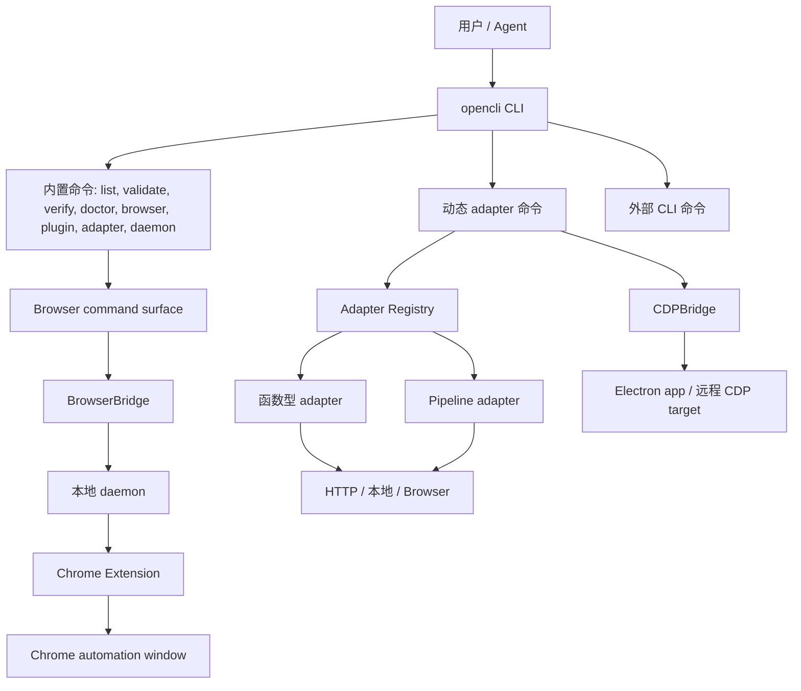

# 系统总览

<details>
<summary>相关源文件</summary>

- `README.md`
- `package.json`
- `src/main.ts`
- `src/cli.ts`
- `src/registry.ts`
- `src/discovery.ts`

</details>

## 核心定位

opencli 的目标是把三类能力统一成一个命令面：

- 站点 adapter：`opencli <site> <command>`，内置 adapter 在 `clis/`，用户 adapter 在 `~/.opencli/clis/`。
- 浏览器驱动：`opencli browser *`，用于真实 Chrome 窗口里的点击、输入、抽取、抓包和页面状态读取。
- 外部 CLI passthrough：`opencli gh`、`opencli docker`、`opencli vercel` 等，通过统一入口发现和调用外部工具。

README 对这三类能力有直接描述，package 元数据说明包名是 `@jackwener/opencli`，二进制入口是 `opencli`，运行要求是 Node `>=21`。  
Sources: [README.md:12-22](../README.md#L12-L22), [package.json:1-15](../../../project-repos/opencli/package.json#L1-L15)

<details class="source-snippets">
<summary>引用源码</summary>

<!-- source-snippets:start -->

#### `README.md:12-22`

```markdown
1. [系统总览](pages/01-system-overview.md)
2. [启动、发现与命令生命周期](pages/02-startup-discovery-command-lifecycle.md)
3. [Adapter 模型与策略](pages/03-adapter-model-and-strategies.md)
4. [浏览器桥接与 Chrome 扩展](pages/04-browser-bridge-and-extension.md)
5. [Agent 浏览器命令面](pages/05-agent-browser-command-surface.md)
6. [Pipeline、模板与数据抽取](pages/06-pipeline-template-and-data-extraction.md)
7. [Plugin 与外部 CLI Hub](pages/07-plugin-and-external-cli-hub.md)
8. [Skills 与 Agent 工作流](pages/08-skills-and-agent-workflows.md)
9. [测试、发布与日常运维](pages/09-testing-release-and-operations.md)
10. [安全、隐私与边界](pages/10-security-privacy-and-boundaries.md)

```

#### `package.json:1-15`

> 未找到引用文件：`package.json`

<!-- source-snippets:end -->
</details>
## 系统边界



这个边界里有两个浏览器通道：

- 普通网站自动化走 BrowserBridge，它会确保 daemon 和扩展连接可用。
- Electron app 或显式 CDP endpoint 走 CDPBridge，直接连 WebSocket 调 Chrome DevTools Protocol。

Sources: [src/runtime.ts:7-14](../../../project-repos/opencli/src/runtime.ts#L7-L14), [src/browser/bridge.ts:21-45](../../../project-repos/opencli/src/browser/bridge.ts#L21-L45), [src/browser/cdp.ts:50-92](../../../project-repos/opencli/src/browser/cdp.ts#L50-L92)

<details class="source-snippets">
<summary>引用源码</summary>

<!-- source-snippets:start -->

#### `src/runtime.ts:7-14`

> 未找到引用文件：`src/runtime.ts`

#### `src/browser/bridge.ts:21-45`

> 未找到引用文件：`src/browser/bridge.ts`

#### `src/browser/cdp.ts:50-92`

> 未找到引用文件：`src/browser/cdp.ts`

<!-- source-snippets:end -->
</details>
## 启动时做什么

`src/main.ts` 是实际启动器。它先设置内置和用户 adapter 目录，再处理全局 `--live`、`--focus`、版本、completion 等快路径；完整启动路径会动态导入 CLI、discovery、update check、hooks 等模块，随后确保用户 shim/adapter 目录存在、发现内置/用户/plugin adapter、触发启动 hook，最后调用 `runCli`。  
Sources: [src/main.ts:27-47](../../../project-repos/opencli/src/main.ts#L27-L47), [src/main.ts:49-94](../../../project-repos/opencli/src/main.ts#L49-L94), [src/main.ts:96-148](../../../project-repos/opencli/src/main.ts#L96-L148)

<details class="source-snippets">
<summary>引用源码</summary>

<!-- source-snippets:start -->

#### `src/main.ts:27-47`

> 未找到引用文件：`src/main.ts`

#### `src/main.ts:49-94`

> 未找到引用文件：`src/main.ts`

#### `src/main.ts:96-148`

> 未找到引用文件：`src/main.ts`

<!-- source-snippets:end -->
</details>
## 目录级心智模型

| 目录/文件 | 角色 |
|---|---|
| `src/main.ts` | 启动、快路径和 discovery 编排 |
| `src/cli.ts` | Commander 命令面，内置命令和浏览器子命令都在这里注册 |
| `src/registry.ts` | adapter 的 `cli()` 注册 API、策略枚举和全局 registry |
| `src/execution.ts` | adapter 执行入口，处理参数、浏览器 session、timeout、hook、诊断 |
| `src/browser/` | BrowserBridge、daemon client、Page/CDP Page 抽象 |
| `extension/` | Chrome MV3 扩展，接收 daemon 指令并调用 chrome.debugger/tabs/cookies |
| `clis/` | 内置站点 adapter |
| `skills/` | Agent 使用 opencli 的本地技能说明 |

Sources: [src/cli.ts:370-453](../../../project-repos/opencli/src/cli.ts#L370-L453), [src/registry.ts:7-74](../../../project-repos/opencli/src/registry.ts#L7-L74), [src/execution.ts:1-11](../../../project-repos/opencli/src/execution.ts#L1-L11), [extension/manifest.json:1-38](../../../project-repos/opencli/extension/manifest.json#L1-L38)

<details class="source-snippets">
<summary>引用源码</summary>

<!-- source-snippets:start -->

#### `src/cli.ts:370-453`

> 未找到引用文件：`src/cli.ts`

#### `src/registry.ts:7-74`

> 未找到引用文件：`src/registry.ts`

#### `src/execution.ts:1-11`

> 未找到引用文件：`src/execution.ts`

#### `extension/manifest.json:1-38`

> 未找到引用文件：`extension/manifest.json`

<!-- source-snippets:end -->
</details>
## 命令数量与规模

当前源码清单显示仓库包含大量站点 adapter 和技能文档。构建产物 `cli-manifest.json` 是 adapter 的预编译清单，当前扫描到 628 个命令，覆盖 100+ 站点或应用；仓库盘点中 `.js`、`.ts`、`.md` 是主要文件类型。  
Sources: [src/build-manifest.ts:19-54](../../../project-repos/opencli/src/build-manifest.ts#L19-L54), [src/build-manifest.ts:156-179](../../../project-repos/opencli/src/build-manifest.ts#L156-L179), [00-repo-inventory.md:1-80](../00-repo-inventory.md#L1-L80)

<details class="source-snippets">
<summary>引用源码</summary>

<!-- source-snippets:start -->

#### `src/build-manifest.ts:19-54`

> 未找到引用文件：`src/build-manifest.ts`

#### `src/build-manifest.ts:156-179`

> 未找到引用文件：`src/build-manifest.ts`

#### `00-repo-inventory.md:1-80`

```markdown
# 00 - 仓库盘点

## Source

- Path: `/private/tmp/deepwiki-it-sources/opencli`
- Remote: `https://github.com/jackwener/opencli.git`
- Branch: `main`
- Commit: `d9c96f7e3b0075be222d2c628ff8d4786cc2ebfb`

## File Summary

- Files scanned: 1318
- Top-level directories: `.github`, `autoresearch`, `clis`, `designs`, `docs`, `extension`, `scripts`, `skills`, `src`, `tests`

| Extension | Count |
|-----------|------:|
| `.js` | 895 |
| `.ts` | 196 |
| `.md` | 176 |
| `.yml` | 13 |
| `.json` | 13 |
| `.png` | 5 |
| `.sh` | 4 |
| `[no extension]` | 3 |
| `.txt` | 3 |
| `.html` | 3 |
| `.lock` | 2 |
| `.cjs` | 2 |
| `.mts` | 1 |
| `.mjs` | 1 |
| `.yaml` | 1 |

## Manifests and Build Files

- `extension/package-lock.json`
- `extension/package.json`
- `package-lock.json`
- `package.json`

## Documentation

- `CHANGELOG.md`
- `CONTRIBUTING.md`
- `README.md`
- `README.zh-CN.md`
- `docs/adapters-doc/ones.md`
- `docs/adapters/browser/1688.md`
- `docs/adapters/browser/36kr.md`
- `docs/adapters/browser/51job.md`
- `docs/adapters/browser/amazon.md`
- `docs/adapters/browser/apple-podcasts.md`
- `docs/adapters/browser/arxiv.md`
- `docs/adapters/browser/baidu-scholar.md`
- `docs/adapters/browser/band.md`
- `docs/adapters/browser/barchart.md`
- `docs/adapters/browser/bbc.md`
- `docs/adapters/browser/bilibili.md`
- `docs/adapters/browser/binance.md`
- `docs/adapters/browser/bloomberg.md`
- `docs/adapters/browser/bluesky.md`
- `docs/adapters/browser/boss.md`
- `docs/adapters/browser/chaoxing.md`
- `docs/adapters/browser/chatgpt.md`
- `docs/adapters/browser/cnki.md`
- `docs/adapters/browser/coupang.md`
- `docs/adapters/browser/ctrip.md`
- `docs/adapters/browser/deepseek.md`
- `docs/adapters/browser/devto.md`
- `docs/adapters/browser/dictionary.md`
- `docs/adapters/browser/douban.md`
- `docs/adapters/browser/doubao.md`
- `docs/adapters/browser/douyin.md`
- `docs/adapters/browser/eastmoney.md`
- `docs/adapters/browser/facebook.md`
- `docs/adapters/browser/gemini.md`
- `docs/adapters/browser/gitee.md`
- `docs/adapters/browser/google-scholar.md`
- `docs/adapters/browser/google.md`
- `docs/adapters/browser/gov-law.md`
- `docs/adapters/browser/gov-policy.md`
```

<!-- source-snippets:end -->
</details>
## 最重要的设计取舍

opencli 把“发现”和“执行”分开：

- discovery 负责把内置、用户、本地 plugin 和 monorepo plugin 命令加载进共享 registry。
- Commander Adapter 负责把 registry 中的命令转成 CLI 子命令。
- execution 负责真正调用 `func` 或 `pipeline`，并在需要浏览器时创建页面会话。

这让 adapter 可以很轻：只声明 `site/name/strategy/args/columns/func` 或 `pipeline`，其他跨站点能力由 runtime 提供。  
Sources: [src/discovery.ts:91-148](../../../project-repos/opencli/src/discovery.ts#L91-L148), [src/discovery.ts:184-231](../../../project-repos/opencli/src/discovery.ts#L184-L231), [src/commanderAdapter.ts:30-56](../../../project-repos/opencli/src/commanderAdapter.ts#L30-L56), [src/execution.ts:77-153](../../../project-repos/opencli/src/execution.ts#L77-L153)

<details class="source-snippets">
<summary>引用源码</summary>

<!-- source-snippets:start -->

#### `src/discovery.ts:91-148`

> 未找到引用文件：`src/discovery.ts`

#### `src/discovery.ts:184-231`

> 未找到引用文件：`src/discovery.ts`

#### `src/commanderAdapter.ts:30-56`

> 未找到引用文件：`src/commanderAdapter.ts`

#### `src/execution.ts:77-153`

> 未找到引用文件：`src/execution.ts`

<!-- source-snippets:end -->
</details>
