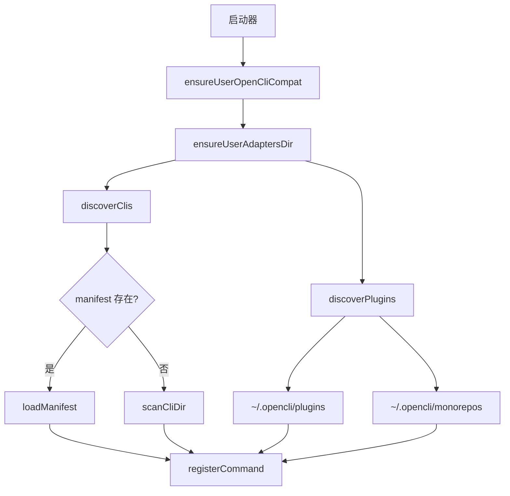
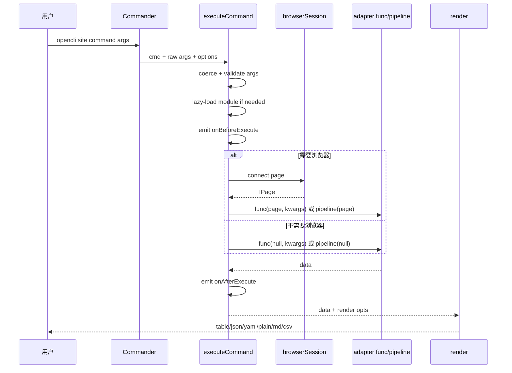

# 启动、发现与命令生命周期

相关源文件

- `src/main.ts`
- `src/discovery.ts`
- `src/commanderAdapter.ts`
- `src/execution.ts`
- `src/hooks.ts`
- `src/output.ts`

## 启动阶段

opencli 的启动器先确定两个 adapter 根目录：

- 内置目录：包内 `clis/`
- 用户目录：`~/.opencli/clis`

随后它处理几个不需要完整加载 adapter 的快路径：`--version`、`completion`、manifest completion。这样 shell completion 和版本查询不会为动态 import、插件 discovery 支付完整成本。  
Sources: [src/main.ts:27-47](../../../project-repos/opencli/src/main.ts#L27-L47), [src/main.ts:49-94](../../../project-repos/opencli/src/main.ts#L49-L94)

引用源码

<!-- source-snippets:start -->

#### `src/main.ts:27-47`

> 未找到引用文件：`src/main.ts`

#### `src/main.ts:49-94`

> 未找到引用文件：`src/main.ts`

<!-- source-snippets:end -->

完整启动路径才会导入 CLI、discovery、版本检查和 hook 模块，并按顺序执行：安装 Node 网络兼容层、确保用户 shim、确保用户 adapters 目录、发现内置和用户 adapter、发现插件、检查更新、发 `onStartup` hook，最后 `runCli`。  
Sources: [src/main.ts:96-148](../../../project-repos/opencli/src/main.ts#L96-L148)

引用源码

<!-- source-snippets:start -->

#### `src/main.ts:96-148`

> 未找到引用文件：`src/main.ts`

<!-- source-snippets:end -->

## Discovery 层

`discoverClis()` 优先读 manifest；没有 manifest 时扫描目录。用户运行时目录固定在 `~/.opencli` 下，插件目录为 `~/.opencli/plugins`，monorepo 插件则通过 `~/.opencli/monorepos` 和 symlink 管理。  
Sources: [src/discovery.ts:21-26](../../../project-repos/opencli/src/discovery.ts#L21-L26), [src/discovery.ts:91-108](../../../project-repos/opencli/src/discovery.ts#L91-L108), [src/discovery.ts:110-148](../../../project-repos/opencli/src/discovery.ts#L110-L148), [src/discovery.ts:184-231](../../../project-repos/opencli/src/discovery.ts#L184-L231)

引用源码

<!-- source-snippets:start -->

#### `src/discovery.ts:21-26`

> 未找到引用文件：`src/discovery.ts`

#### `src/discovery.ts:91-108`

> 未找到引用文件：`src/discovery.ts`

#### `src/discovery.ts:110-148`

> 未找到引用文件：`src/discovery.ts`

#### `src/discovery.ts:184-231`

> 未找到引用文件：`src/discovery.ts`

<!-- source-snippets:end -->

## Registry 到 Commander

adapter 使用 `cli(opts)` 注册命令。注册时会规范化策略、浏览器需求、预导航行为和别名，然后把 canonical `site/name` 与 alias 都写入共享 registry。  
Sources: [src/registry.ts:95-119](../../../project-repos/opencli/src/registry.ts#L95-L119), [src/registry.ts:133-163](../../../project-repos/opencli/src/registry.ts#L133-L163), [src/registry.ts:165-195](../../../project-repos/opencli/src/registry.ts#L165-L195)

引用源码

<!-- source-snippets:start -->

#### `src/registry.ts:95-119`

> 未找到引用文件：`src/registry.ts`

#### `src/registry.ts:133-163`

> 未找到引用文件：`src/registry.ts`

#### `src/registry.ts:165-195`

> 未找到引用文件：`src/registry.ts`

<!-- source-snippets:end -->

Commander Adapter 把每个 `CliCommand` 变成 CLI 子命令：

- 逐个注册 positional args 和 named options。
- 默认增加 `-f/--format` 和 `-v/--verbose`。
- action 回调中收集参数和 option 来源，调用 `executeCommand`，再渲染输出。

Sources: [src/commanderAdapter.ts:30-56](../../../project-repos/opencli/src/commanderAdapter.ts#L30-L56), [src/commanderAdapter.ts:58-125](../../../project-repos/opencli/src/commanderAdapter.ts#L58-L125), [src/commanderAdapter.ts:165-179](../../../project-repos/opencli/src/commanderAdapter.ts#L165-L179)

引用源码

<!-- source-snippets:start -->

#### `src/commanderAdapter.ts:30-56`

> 未找到引用文件：`src/commanderAdapter.ts`

#### `src/commanderAdapter.ts:58-125`

> 未找到引用文件：`src/commanderAdapter.ts`

#### `src/commanderAdapter.ts:165-179`

> 未找到引用文件：`src/commanderAdapter.ts`

<!-- source-snippets:end -->

## 执行路径

`executeCommand` 是单一执行入口。它负责 lazy-load manifest command、热加载用户 adapter、执行函数型 adapter 或 pipeline adapter，并在 browser command 需要时创建 browser session。  
Sources: [src/execution.ts:33-75](../../../project-repos/opencli/src/execution.ts#L33-L75), [src/execution.ts:77-133](../../../project-repos/opencli/src/execution.ts#L77-L133), [src/execution.ts:155-276](../../../project-repos/opencli/src/execution.ts#L155-L276)

引用源码

<!-- source-snippets:start -->

#### `src/execution.ts:33-75`

> 未找到引用文件：`src/execution.ts`

#### `src/execution.ts:77-133`

> 未找到引用文件：`src/execution.ts`

#### `src/execution.ts:155-276`

> 未找到引用文件：`src/execution.ts`

<!-- source-snippets:end -->

## Hook 和诊断切入点

插件可以注册 `onStartup`、`onBeforeExecute`、`onAfterExecute`。Hook 存在 `globalThis.__opencli_hooks__`，避免多份模块副本导致 hook store 分裂。hook 执行失败只记录 warning，不阻断主命令。  
Sources: [src/hooks.ts:1-12](../../../project-repos/opencli/src/hooks.ts#L1-L12), [src/hooks.ts:35-50](../../../project-repos/opencli/src/hooks.ts#L35-L50), [src/hooks.ts:69-84](../../../project-repos/opencli/src/hooks.ts#L69-L84)

引用源码

<!-- source-snippets:start -->

#### `src/hooks.ts:1-12`

> 未找到引用文件：`src/hooks.ts`

#### `src/hooks.ts:35-50`

> 未找到引用文件：`src/hooks.ts`

#### `src/hooks.ts:69-84`

> 未找到引用文件：`src/hooks.ts`

<!-- source-snippets:end -->

失败时，execution 层会给出 AutoFix 线索；如果启用 `OPENCLI_DIAGNOSTIC=1`，诊断模块会构造带 adapter 源码、页面状态、网络请求和 console error 的 RepairContext。  
Sources: [src/commanderAdapter.ts:137-159](../../../project-repos/opencli/src/commanderAdapter.ts#L137-L159), [src/diagnostic.ts:1-13](../../../project-repos/opencli/src/diagnostic.ts#L1-L13), [src/diagnostic.ts:299-360](../../../project-repos/opencli/src/diagnostic.ts#L299-L360)

引用源码

<!-- source-snippets:start -->

#### `src/commanderAdapter.ts:137-159`

> 未找到引用文件：`src/commanderAdapter.ts`

#### `src/diagnostic.ts:1-13`

> 未找到引用文件：`src/diagnostic.ts`

#### `src/diagnostic.ts:299-360`

> 未找到引用文件：`src/diagnostic.ts`

<!-- source-snippets:end -->

## 输出格式

输出渲染支持 `table/json/plain/markdown/csv/yaml`。如果 stdout 不是 TTY 且用户没有显式传 `-f`，默认 table 会降级成 yaml，便于管道消费。  
Sources: [src/output.ts:30-48](../../../project-repos/opencli/src/output.ts#L30-L48), [src/output.ts:50-79](../../../project-repos/opencli/src/output.ts#L50-L79), [src/output.ts:81-138](../../../project-repos/opencli/src/output.ts#L81-L138)

引用源码

<!-- source-snippets:start -->

#### `src/output.ts:30-48`

> 未找到引用文件：`src/output.ts`

#### `src/output.ts:50-79`

> 未找到引用文件：`src/output.ts`

#### `src/output.ts:81-138`

> 未找到引用文件：`src/output.ts`

<!-- source-snippets:end -->

## 常见调试入口

| 问题 | 入口 |
|---|---|
| 命令没有出现 | `discoverClis`、manifest、`registerCommand` |
| 命令出现但参数不对 | `commanderAdapter.ts` 的 args/options 注册 |
| adapter 没执行 | `executeCommand` 的 lazy-load 或 func/pipeline 分支 |
| 输出格式异常 | `output.ts` 的 render 分支 |
| 插件影响执行 | `hooks.ts` 的 before/after hook |

Sources: [src/discovery.ts:150-182](../../../project-repos/opencli/src/discovery.ts#L150-L182), [src/commanderAdapter.ts:58-125](../../../project-repos/opencli/src/commanderAdapter.ts#L58-L125), [src/execution.ts:77-153](../../../project-repos/opencli/src/execution.ts#L77-L153), [src/output.ts:40-47](../../../project-repos/opencli/src/output.ts#L40-L47)

引用源码

<!-- source-snippets:start -->

#### `src/discovery.ts:150-182`

> 未找到引用文件：`src/discovery.ts`

#### `src/commanderAdapter.ts:58-125`

> 未找到引用文件：`src/commanderAdapter.ts`

#### `src/execution.ts:77-153`

> 未找到引用文件：`src/execution.ts`

#### `src/output.ts:40-47`

> 未找到引用文件：`src/output.ts`

<!-- source-snippets:end -->

