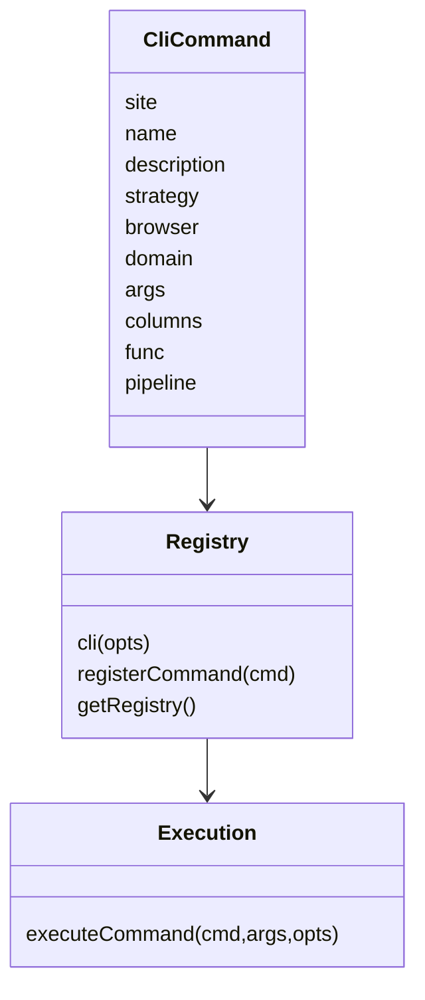

# Adapter 模型与策略

<details><summary>相关源文件</summary>

- `src/registry.ts`
- `src/capabilityRouting.ts`
- `src/execution.ts`
- `src/build-manifest.ts`
- `src/validate.ts`

</details>

## Adapter 是什么

在 opencli 中，adapter 是一个向 registry 注册的命令定义。它声明站点、命令名、描述、参数、输出列、鉴权/浏览器策略，以及执行逻辑。执行逻辑可以是 `func`，也可以是 YAML 风格的 `pipeline`。  
Sources: [src/registry.ts:16-74](../../../project-repos/opencli/src/registry.ts#L16-L74), [src/registry.ts:95-119](../../../project-repos/opencli/src/registry.ts#L95-L119)

<details class="source-snippets">
<summary>引用源码</summary>

<!-- source-snippets:start -->

#### `src/registry.ts:16-74`

> 未找到引用文件：`src/registry.ts`

#### `src/registry.ts:95-119`

> 未找到引用文件：`src/registry.ts`

<!-- source-snippets:end -->
</details>
最小心智模型：



## Strategy 决定能力边界

策略枚举包括：

| 策略 | 含义 |
|---|---|
| `PUBLIC` | 不依赖浏览器登录态，通常可直接 HTTP |
| `LOCAL` | 本地或开发环境接口 |
| `COOKIE` | 需要从已登录浏览器读取 cookie |
| `HEADER` | 需要浏览器上下文中的 header/token |
| `INTERCEPT` | 需要通过浏览器抓真实请求 |
| `UI` | 需要 DOM 交互 |

Sources: [src/registry.ts:7-14](../../../project-repos/opencli/src/registry.ts#L7-L14)

<details class="source-snippets">
<summary>引用源码</summary>

<!-- source-snippets:start -->

#### `src/registry.ts:7-14`

> 未找到引用文件：`src/registry.ts`

<!-- source-snippets:end -->
</details>
`normalizeCommand` 会把 strategy 转成 browser 和 navigateBefore 等运行字段。例如需要 cookie、header、intercept、UI 的命令通常需要浏览器上下文；pipeline 中出现浏览器专属步骤也会触发浏览器 session。  
Sources: [src/registry.ts:133-163](../../../project-repos/opencli/src/registry.ts#L133-L163), [src/capabilityRouting.ts:3-14](../../../project-repos/opencli/src/capabilityRouting.ts#L3-L14), [src/capabilityRouting.ts:23-31](../../../project-repos/opencli/src/capabilityRouting.ts#L23-L31)

<details class="source-snippets">
<summary>引用源码</summary>

<!-- source-snippets:start -->

#### `src/registry.ts:133-163`

> 未找到引用文件：`src/registry.ts`

#### `src/capabilityRouting.ts:3-14`

> 未找到引用文件：`src/capabilityRouting.ts`

#### `src/capabilityRouting.ts:23-31`

> 未找到引用文件：`src/capabilityRouting.ts`

<!-- source-snippets:end -->
</details>
## func 与 pipeline

`executeCommand` 先处理参数，再决定是否创建页面。执行时：

- 如果是 lazy command，先导入模块并从 registry 找到真正命令。
- 如果有 `func`，直接调用函数。
- 如果有 `pipeline`，交给 pipeline executor。
- 如果命令需要浏览器，会在调用前做预导航和 session 准备。

Sources: [src/execution.ts:33-75](../../../project-repos/opencli/src/execution.ts#L33-L75), [src/execution.ts:77-133](../../../project-repos/opencli/src/execution.ts#L77-L133), [src/execution.ts:135-153](../../../project-repos/opencli/src/execution.ts#L135-L153), [src/execution.ts:155-276](../../../project-repos/opencli/src/execution.ts#L155-L276)

<details class="source-snippets">
<summary>引用源码</summary>

<!-- source-snippets:start -->

#### `src/execution.ts:33-75`

> 未找到引用文件：`src/execution.ts`

#### `src/execution.ts:77-133`

> 未找到引用文件：`src/execution.ts`

#### `src/execution.ts:135-153`

> 未找到引用文件：`src/execution.ts`

#### `src/execution.ts:155-276`

> 未找到引用文件：`src/execution.ts`

<!-- source-snippets:end -->
</details>
## Manifest 的作用

构建时的 manifest 编译器会扫描 `clis/`，导入 JS adapter 并捕获 registry 中新增的命令，然后写成 `cli-manifest.json`。运行时优先用 manifest 以降低启动时扫描和 import 成本。  
Sources: [src/build-manifest.ts:19-54](../../../project-repos/opencli/src/build-manifest.ts#L19-L54), [src/build-manifest.ts:58-105](../../../project-repos/opencli/src/build-manifest.ts#L58-L105), [src/build-manifest.ts:107-154](../../../project-repos/opencli/src/build-manifest.ts#L107-L154), [src/build-manifest.ts:156-179](../../../project-repos/opencli/src/build-manifest.ts#L156-L179)

<details class="source-snippets">
<summary>引用源码</summary>

<!-- source-snippets:start -->

#### `src/build-manifest.ts:19-54`

> 未找到引用文件：`src/build-manifest.ts`

#### `src/build-manifest.ts:58-105`

> 未找到引用文件：`src/build-manifest.ts`

#### `src/build-manifest.ts:107-154`

> 未找到引用文件：`src/build-manifest.ts`

#### `src/build-manifest.ts:156-179`

> 未找到引用文件：`src/build-manifest.ts`

<!-- source-snippets:end -->
</details>
## 校验规则

`validate` 不再扫文件本身，而是校验已加载 registry。它检查：

- registry 是否为空。
- browser command 是否缺 domain。
- pipeline step 名是否在已知集合内。
- 命令是否至少有 `func`、`pipeline` 或 `_lazy`。
- 参数是否重名，positional 参数顺序是否异常。

Sources: [src/validate.ts:27-45](../../../project-repos/opencli/src/validate.ts#L27-L45), [src/validate.ts:81-133](../../../project-repos/opencli/src/validate.ts#L81-L133)

<details class="source-snippets">
<summary>引用源码</summary>

<!-- source-snippets:start -->

#### `src/validate.ts:27-45`

> 未找到引用文件：`src/validate.ts`

#### `src/validate.ts:81-133`

> 未找到引用文件：`src/validate.ts`

<!-- source-snippets:end -->
</details>
## Adapter 输出契约

adapter 的 `columns` 应和返回对象 key 对齐。最终输出由 `output.ts` 统一渲染成 table、json、plain、markdown、csv 或 yaml。Agent 场景优先使用 `-f json`，因为它避免 table 渲染和颜色文本干扰。  
Sources: [src/output.ts:20-28](../../../project-repos/opencli/src/output.ts#L20-L28), [src/output.ts:30-48](../../../project-repos/opencli/src/output.ts#L30-L48), [skills/opencli-usage/SKILL.md:56-73](../skills/opencli-usage/SKILL.md#L56-L73)

<details class="source-snippets">
<summary>引用源码</summary>

<!-- source-snippets:start -->

#### `src/output.ts:20-28`

> 未找到引用文件：`src/output.ts`

#### `src/output.ts:30-48`

> 未找到引用文件：`src/output.ts`

#### `skills/opencli-usage/SKILL.md:56-73`

```markdown
不要硬编码 adapter 列表。站点和命令数每周都会变化，`opencli list -f json` 是事实来源；它每个命令输出 `{site, name, aliases, description, strategy, browser, args, columns, ...}`。

## 通用 flag

| flag | 效果 |
|---|---|
| `-f, --format <fmt>` | `table`（TTY 默认）、`yaml`（非 TTY 默认）、`json`、`plain`、`md`、`csv`。Agent 通常应显式传 `-f json`。 |
| `-v, --verbose` | 输出 debug 日志和失败栈，并为进程设置 `OPENCLI_VERBOSE=1`。 |

命令专属 flag（如 `--limit`、`--tab`、`--filter`）不是通用的；用 `<site> <command> --help` 查询。

## 输出格式

- `json`：2 空格缩进，Agent 默认首选。
- `plain`：对 chat 类命令打印单个主字段（`response`/`content`/`text`/`value`），适合管道。
- `yaml`：非 TTY 且未显式 `-f` 时的 fallback。
- `table`：彩色表格，给人看。
- `md`、`csv`：直接表格化导出。
```

<!-- source-snippets:end -->
</details>
## 编写 adapter 的推荐路径

仓库内的 adapter-author skill 建议从站点侦察、API 发现、endpoint 验证、字段解码、columns 设计，再到 `opencli browser init` 和 `opencli browser verify`。它强调 memory 命中后也必须重新验证 endpoint，不要直接写 adapter。  
Sources: [skills/opencli-adapter-author/SKILL.md:29-100](../skills/opencli-adapter-author/SKILL.md#L29-L100), [skills/opencli-adapter-author/SKILL.md:104-151](../skills/opencli-adapter-author/SKILL.md#L104-L151)

<details class="source-snippets">
<summary>引用源码</summary>

<!-- source-snippets:start -->

#### `skills/opencli-adapter-author/SKILL.md:29-100`

````markdown
## 顶层决策树

```
START
  │
  ▼
┌──────────────────────────┐
│ opencli doctor 通？      │── no ──→ 修桥接（doctor 输出里的提示）
└──────────────────────────┘
  │ yes
  ▼
┌────────────────────────────────────────────────────┐
│ 读站点记忆：                                        │
│   1. ~/.opencli/sites/<site>/endpoints.json         │
│   2. ~/.opencli/sites/<site>/notes.md               │
│   3. references/site-memory/<site>.md               │
└────────────────────────────────────────────────────┘
  │ 命中 endpoint + 字段 → 直接跳到【endpoint 验证】（不跳写 adapter！memory 可能过期）
  │ 没命中 → 继续
  ▼
┌──────────────────────────┐
│ 站点侦察（site-recon）    │  → Pattern A/B/C/D/E
└──────────────────────────┘
  │
  ▼
┌──────────────────────────┐
│ API 发现（api-discovery）│  §1 network → §2 state → §3 bundle → §4 token → §5 intercept
└──────────────────────────┘
  │ 拿到候选 endpoint
  ▼
┌────────────────────────────────────────────┐
│ 直接 fetch 验证 endpoint（memory 命中也要跑）│── 401/403 ──→ 回到 §4 排 token
│ 数据非空 + 200                              │── 空/HTML ──→ 回到 site-recon 换 Pattern
│ memory 里的值还活着吗？                     │── 站点换版 ──→ 标记旧 endpoint，回 api-discovery
└────────────────────────────────────────────┘
  │ OK
  ▼
┌───────────────────────────────────────┐
│ 字段解码（memory 里的 field-map 也要抽查）│  自解释 → 直接 / 已知代号 → field-conventions / 未知 → decode-playbook
│ 比一条已知字段和网页肉眼值，确认没错位     │
└───────────────────────────────────────┘
  │
  ▼
┌──────────────────────────┐
│ 设计 columns (output)    │  对照 output-design.md 的命名 / 类型 / 顺序
└──────────────────────────┘
  │
  ▼
┌──────────────────────────┐
│ opencli browser init      │  生成 ~/.opencli/clis/<site>/<name>.js 骨架
│ 复制最像的邻居 adapter    │
│ 改 name / URL / 映射三处  │
└──────────────────────────┘
  │
  ▼
┌──────────────────────────┐
│ opencli browser verify    │── 失败 ──→ autofix skill，回对应步骤
└──────────────────────────┘
  │ 成功
  ▼
┌──────────────────────────┐
│ 字段 vs 网页肉眼对一遍   │── 数值不对 ──→ 回字段解码
└──────────────────────────┘
  │ 对得上
  ▼
┌──────────────────────────┐
│ 回写 ~/.opencli/sites/   │  endpoints / field-map / notes / fixtures
└──────────────────────────┘
  │
  ▼
DONE
```
````

#### `skills/opencli-adapter-author/SKILL.md:104-151`

````markdown
## Runbook（一步一步勾选）

```
[ ] 1. opencli doctor 返回 "Everything looks good"
[ ] 2. 读站点记忆：
       [ ] ~/.opencli/sites/<site>/endpoints.json 存在？里面有想要的 endpoint？
       [ ] references/site-memory/<site>.md 存在？看"已知 endpoint"节
       [ ] 命中后：**跳到第 5（endpoint 验证） + 第 7（字段核对）**，不能直接跳第 9 写 adapter
       [ ] memory 写入超过 30 天（看 `verified_at`）→ 当作过期，按冷启动走 Step 3 → 4
[ ] 3. 侦察（site-recon.md）：
       [ ] **首选**：`opencli browser analyze <url>` 一步拿 pattern + 反爬 + 最近 adapter + next step
       [ ] `analyze` 结论模糊时再手跑：`open` → `wait time 2` (或 `wait xhr <regex>`) → `network`
       [ ] 定 Pattern（A / B / C / D / E）
[ ] 4. API 发现（api-discovery.md）按 Pattern 选 §：
       [ ] Pattern A → §1 network 精读
       [ ] Pattern B → §2 state 抽取 + §1 深层数据
       [ ] Pattern C → §3 bundle / script src 搜索
       [ ] Pattern D → §4 token 来源 + 降级 §5
       [ ] Pattern E → 找 HTTP 轮询接口；找不到才 §5
[ ] 5. 直接 fetch 候选 endpoint 验证：
       [ ] 返回 200
       [ ] 响应含目标数据（不是 HTML / 广告）
[ ] 6. 定鉴权策略：裸 fetch 通 → PUBLIC；要 cookie → COOKIE；要 header → HEADER；拿不到签名 → INTERCEPT
[ ] 7. 字段解码：
       [ ] 自解释 → 直接用 key
       [ ] 已知代号 → field-conventions.md 查表
       [ ] 未知代号 → field-decode-playbook.md（排序键对比 / 结构差分 / 常量排查）
[ ] 8. 设计 columns（output-design.md）：
       [ ] 命名 camelCase 且对齐邻居 adapter
       [ ] 类型 / 单位 / 百分比格式清楚
       [ ] 顺序：识别列 → 业务数字 → metadata
[ ] 9. 写 adapter（adapter-template.md）：
       [ ] opencli browser init <site>/<name>
       [ ] 找同站点或同类型最像的 adapter，cp 过来
       [ ] 改 name / URL / 字段映射
[ ] 10. opencli browser verify <site>/<name>
        [ ] 首轮通过后立刻 `--write-fixture` 生成 `~/.opencli/sites/<site>/verify/<cmd>.json` 种子
        [ ] 手改种子：加 `patterns`（URL / 日期 / ID 格式）+ `notEmpty`（核心字段）+ 收紧 `rowCount`
        [ ] 再跑一次 `opencli browser verify <site>/<name>`，确认 ✓ matches fixture
[ ] 11. 字段值 vs 网页肉眼比对（别只看 "Adapter works!"）
[ ] 12. 回写站点记忆（**verify 通过 + 肉眼比对对得上之后**，schema 见 `references/site-memory.md`）：
        [ ] `endpoints.json`：以 endpoint 的短名为 key，value = `{url, method, params.{required,optional}, response, verified_at: YYYY-MM-DD, notes}`
        [ ] `field-map.json`：只追加新代号。key = 字段代号，value = `{meaning, verified_at: YYYY-MM-DD, source}`；**已存在的 key 不要覆盖**，有冲突先和网页肉眼值对齐再写
        [ ] `notes.md`：顶部追加一段 `## YYYY-MM-DD by <agent/user>`，写本次写 adapter 时遇到的新坑 / 新结论
        [ ] `verify/<cmd>.json`：**必填。** `opencli browser verify` 的期望值（args / rowCount / columns / types / patterns / notEmpty），Step 10 已经让你生成了，这里只是 checklist
        [ ] `fixtures/<cmd>-<YYYYMMDDHHMM>.json`：存一份该 endpoint 的完整响应样本（去掉 cookie / token / 用户私有字段再存），给后续字段对比 / 离线 replay 用
        [ ] 调试过程中如果在 repo / adapter 目录 dump 过临时文件（`.dbg-*.html` / `raw-*.json` / 等），**在 commit 前清干净**——这些本来就该落在 `~/.opencli/sites/<site>/fixtures/` 或 `/tmp/`
```
````

<!-- source-snippets:end -->
</details>
