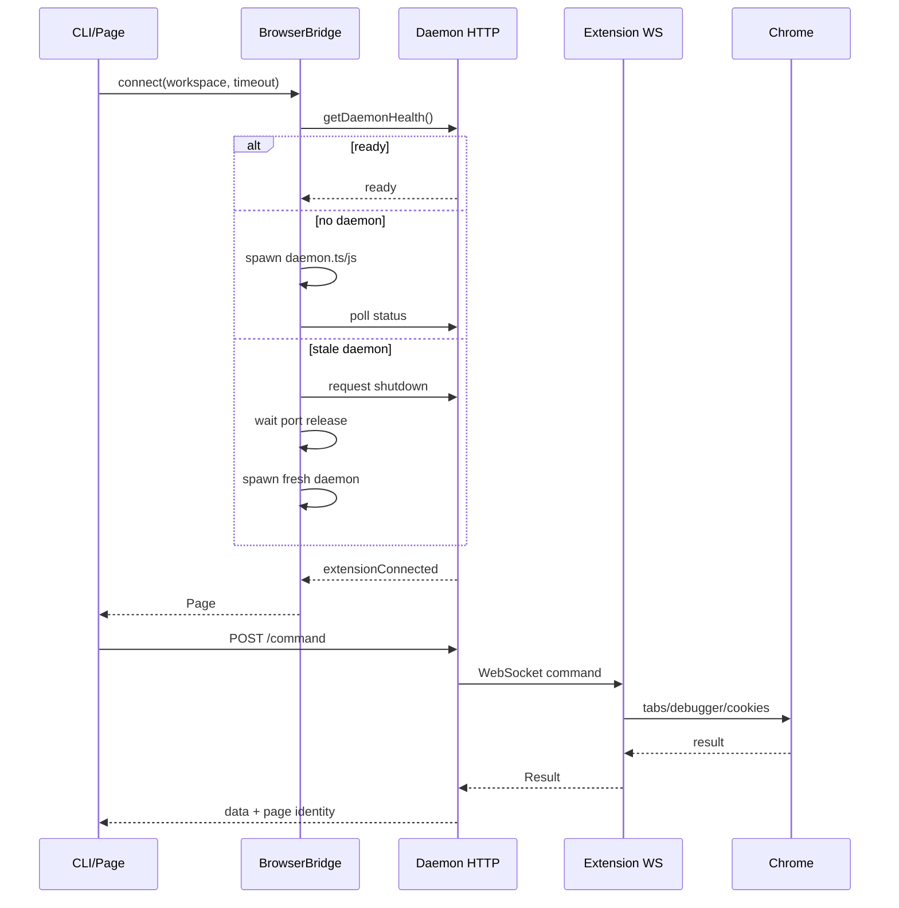

# 浏览器桥接与 Chrome 扩展

相关源文件

- `src/browser/bridge.ts`
- `src/browser/daemon-client.ts`
- `src/browser/page.ts`
- `extension/src/background.ts`
- `extension/src/cdp.ts`
- `extension/manifest.json`

## 两条浏览器路径

opencli 有两类浏览器运行时：

- `BrowserBridge`：普通网站自动化。CLI 通过本地 daemon 与 Chrome 扩展通信，扩展再调用 Chrome APIs 和 `chrome.debugger`。
- `CDPBridge`：直接连 CDP WebSocket，主要用于 Electron app 或显式 `OPENCLI_CDP_ENDPOINT`。

Sources: [src/runtime.ts:7-14](../../../project-repos/opencli/src/runtime.ts#L7-L14), [src/browser/bridge.ts:21-45](../../../project-repos/opencli/src/browser/bridge.ts#L21-L45), [src/browser/cdp.ts:50-92](../../../project-repos/opencli/src/browser/cdp.ts#L50-L92)

引用源码

<!-- source-snippets:start -->

#### `src/runtime.ts:7-14`

> 未找到引用文件：`src/runtime.ts`

#### `src/browser/bridge.ts:21-45`

> 未找到引用文件：`src/browser/bridge.ts`

#### `src/browser/cdp.ts:50-92`

> 未找到引用文件：`src/browser/cdp.ts`

<!-- source-snippets:end -->

## BrowserBridge 生命周期

`BrowserBridge` 不在 `close()` 时杀 daemon，daemon 是持久进程。它只清理当前 Page 引用；真实窗口关闭由 Page/extension 命令控制。  
Sources: [src/browser/bridge.ts:33-60](../../../project-repos/opencli/src/browser/bridge.ts#L33-L60)

引用源码

<!-- source-snippets:start -->

#### `src/browser/bridge.ts:33-60`

> 未找到引用文件：`src/browser/bridge.ts`

<!-- source-snippets:end -->

## Daemon client 协议

CLI 端通过 `daemon-client.ts` 用 HTTP 调 daemon。命令统一为 `DaemonCommand`，action 包含 `exec`、`navigate`、`tabs`、`cookies`、`screenshot`、`close-window`、`sessions`、`set-file-input`、`insert-text`、`bind-current`、`network-capture-*`、`cdp`、`frames`。  
Sources: [src/browser/daemon-client.ts:22-55](../../../project-repos/opencli/src/browser/daemon-client.ts#L22-L55)

引用源码

<!-- source-snippets:start -->

#### `src/browser/daemon-client.ts:22-55`

> 未找到引用文件：`src/browser/daemon-client.ts`

<!-- source-snippets:end -->

发送命令时最多重试 4 次：网络错误固定延迟重试，浏览器瞬态错误根据分类建议延迟重试。page-scoped 命令可以返回 `page` identity，后续调用会带上它避免猜测目标 tab。  
Sources: [src/browser/daemon-client.ts:129-185](../../../project-repos/opencli/src/browser/daemon-client.ts#L129-L185), [src/browser/daemon-client.ts:187-208](../../../project-repos/opencli/src/browser/daemon-client.ts#L187-L208), [src/browser/page.ts:40-67](../../../project-repos/opencli/src/browser/page.ts#L40-L67)

引用源码

<!-- source-snippets:start -->

#### `src/browser/daemon-client.ts:129-185`

> 未找到引用文件：`src/browser/daemon-client.ts`

#### `src/browser/daemon-client.ts:187-208`

> 未找到引用文件：`src/browser/daemon-client.ts`

#### `src/browser/page.ts:40-67`

> 未找到引用文件：`src/browser/page.ts`

<!-- source-snippets:end -->

## Page 抽象

`Page` 是 CLI 侧的浏览器对象。它把高级操作转成 daemon action：

- `goto` 调 `navigate`，记住返回的 page identity，然后注入 stealth 和 DOM stability 等待。
- `evaluate` 调 `exec`，遇到 target navigation 可延迟重试。
- `tabs/newTab/closeTab/selectTab` 调 `tabs` action。
- `screenshot`、`setFileInput`、`insertText`、`frames`、`cdp` 都是明确 action。

Sources: [src/browser/page.ts:59-104](../../../project-repos/opencli/src/browser/page.ts#L59-L104), [src/browser/page.ts:126-140](../../../project-repos/opencli/src/browser/page.ts#L126-L140), [src/browser/page.ts:157-213](../../../project-repos/opencli/src/browser/page.ts#L157-L213), [src/browser/page.ts:215-280](../../../project-repos/opencli/src/browser/page.ts#L215-L280)

引用源码

<!-- source-snippets:start -->

#### `src/browser/page.ts:59-104`

> 未找到引用文件：`src/browser/page.ts`

#### `src/browser/page.ts:126-140`

> 未找到引用文件：`src/browser/page.ts`

#### `src/browser/page.ts:157-213`

> 未找到引用文件：`src/browser/page.ts`

#### `src/browser/page.ts:215-280`

> 未找到引用文件：`src/browser/page.ts`

<!-- source-snippets:end -->

## 扩展侧分发

Chrome 扩展是 MV3 service worker。它启动后会探测 `/ping`、打开 WebSocket，发送 hello 和版本兼容信息，然后等待 daemon 下发 command。  
Sources: [extension/src/background.ts:40-87](../../../project-repos/opencli/extension/src/background.ts#L40-L87), [extension/src/protocol.ts:24-96](../../../project-repos/opencli/extension/src/protocol.ts#L24-L96)

引用源码

<!-- source-snippets:start -->

#### `extension/src/background.ts:40-87`

> 未找到引用文件：`extension/src/background.ts`

#### `extension/src/protocol.ts:24-96`

> 未找到引用文件：`extension/src/protocol.ts`

<!-- source-snippets:end -->

扩展的 `handleCommand` 是 action dispatcher：根据 command action 分发到 exec、navigate、tabs、cookies、screenshot、cdp、sessions、file input、insert text、bind current、network capture、frames 等 handler。  
Sources: [extension/src/background.ts:301-350](../../../project-repos/opencli/extension/src/background.ts#L301-L350)

引用源码

<!-- source-snippets:start -->

#### `extension/src/background.ts:301-350`

> 未找到引用文件：`extension/src/background.ts`

<!-- source-snippets:end -->

## 自动化窗口与 tab 绑定

扩展维护 workspace 级 automation session。它会解析 page identity 到 tabId，校验 tab 仍在 automation window 中；若 tab 漂移到其他窗口，会尝试移回。导航只允许 http/https，并在跳转前按需 detach debugger。  
Sources: [extension/src/background.ts:452-557](../../../project-repos/opencli/extension/src/background.ts#L452-L557), [extension/src/background.ts:615-713](../../../project-repos/opencli/extension/src/background.ts#L615-L713)

引用源码

<!-- source-snippets:start -->

#### `extension/src/background.ts:452-557`

> 未找到引用文件：`extension/src/background.ts`

#### `extension/src/background.ts:615-713`

> 未找到引用文件：`extension/src/background.ts`

<!-- source-snippets:end -->

## CDP 能力与限制

扩展侧 CDP helper 使用 `chrome.debugger` attach tab，并对 attach/evaluate 做重试。它只允许 http/https/about:blank/data 等可调试 URL。网络 capture 对响应体设置 8 MiB 上限，请求体 1 MiB 上限。  
Sources: [extension/src/cdp.ts:13-18](../../../project-repos/opencli/extension/src/cdp.ts#L13-L18), [extension/src/cdp.ts:44-83](../../../project-repos/opencli/extension/src/cdp.ts#L44-L83), [extension/src/cdp.ts:141-183](../../../project-repos/opencli/extension/src/cdp.ts#L141-L183)

引用源码

<!-- source-snippets:start -->

#### `extension/src/cdp.ts:13-18`

> 未找到引用文件：`extension/src/cdp.ts`

#### `extension/src/cdp.ts:44-83`

> 未找到引用文件：`extension/src/cdp.ts`

#### `extension/src/cdp.ts:141-183`

> 未找到引用文件：`extension/src/cdp.ts`

<!-- source-snippets:end -->

CDP passthrough 不是任意方法开放。`handleCdp` 只允许 allowlist 中的 DOM、Accessibility、Input、Page、Runtime.enable、Emulation 方法；`Runtime.evaluate` 走 `exec` action。  
Sources: [extension/src/background.ts:816-860](../../../project-repos/opencli/extension/src/background.ts#L816-L860)

引用源码

<!-- source-snippets:start -->

#### `extension/src/background.ts:816-860`

> 未找到引用文件：`extension/src/background.ts`

<!-- source-snippets:end -->

## 扩展权限

扩展 manifest 声明权限包括 `debugger`、`tabs`、`cookies`、`activeTab`、`alarms`，host permissions 是 `<all_urls>`。这解释了为什么 doctor 和用户安装指引是关键运维步骤。  
Sources: [extension/manifest.json:1-15](../../../project-repos/opencli/extension/manifest.json#L1-L15), [src/doctor.ts:90-157](../../../project-repos/opencli/src/doctor.ts#L90-L157)

引用源码

<!-- source-snippets:start -->

#### `extension/manifest.json:1-15`

> 未找到引用文件：`extension/manifest.json`

#### `src/doctor.ts:90-157`

> 未找到引用文件：`src/doctor.ts`

<!-- source-snippets:end -->

