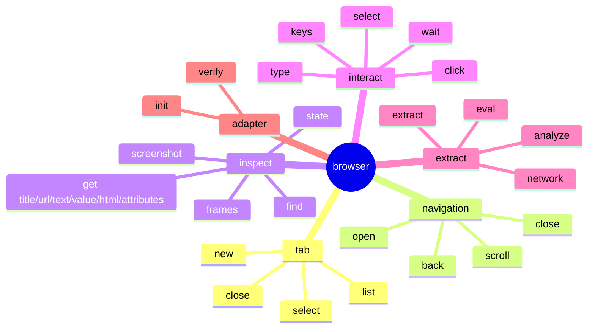

# Agent 浏览器命令面

<details>
<summary>相关源文件</summary>

- `src/cli.ts`
- `src/browser/page.ts`
- `skills/opencli-browser/SKILL.md`

</details>

## 设计目标

`opencli browser *` 是给 Agent 使用的真实浏览器控制面。它不要求预先写 adapter，适合临时打开网页、读取状态、点击、输入、抓包和抽取长文。浏览器命令统一走专用 workspace，并把默认 tab identity 持久化到 `~/.opencli/cache/browser-state/`。  
Sources: [src/cli.ts:224-261](../../../project-repos/opencli/src/cli.ts#L224-L261), [src/cli.ts:317-338](../../../project-repos/opencli/src/cli.ts#L317-L338)

<details class="source-snippets">
<summary>引用源码</summary>

<!-- source-snippets:start -->

#### `src/cli.ts:224-261`

> 未找到引用文件：`src/cli.ts`

#### `src/cli.ts:317-338`

> 未找到引用文件：`src/cli.ts`

<!-- source-snippets:end -->
</details>
## 命令族



Sources: [src/cli.ts:478-486](../../../project-repos/opencli/src/cli.ts#L478-L486), [src/cli.ts:570-631](../../../project-repos/opencli/src/cli.ts#L570-L631), [src/cli.ts:647-707](../../../project-repos/opencli/src/cli.ts#L647-L707), [src/cli.ts:782-829](../../../project-repos/opencli/src/cli.ts#L782-L829), [src/cli.ts:1491-1698](../../../project-repos/opencli/src/cli.ts#L1491-L1698)

<details class="source-snippets">
<summary>引用源码</summary>

<!-- source-snippets:start -->

#### `src/cli.ts:478-486`

> 未找到引用文件：`src/cli.ts`

#### `src/cli.ts:570-631`

> 未找到引用文件：`src/cli.ts`

#### `src/cli.ts:647-707`

> 未找到引用文件：`src/cli.ts`

#### `src/cli.ts:782-829`

> 未找到引用文件：`src/cli.ts`

#### `src/cli.ts:1491-1698`

> 未找到引用文件：`src/cli.ts`

<!-- source-snippets:end -->
</details>
## 目标选择契约

交互命令采用 selector-first target contract：`<target>` 可以是 `state/find` 输出的数字 ref，也可以是 CSS selector。CSS 多匹配时，写操作要求显式 `--nth`，读操作可以默认取第一个并返回 `matches_n`。  
Sources: [src/cli.ts:487-510](../../../project-repos/opencli/src/cli.ts#L487-L510), [src/cli.ts:844-880](../../../project-repos/opencli/src/cli.ts#L844-L880), [src/cli.ts:1031-1039](../../../project-repos/opencli/src/cli.ts#L1031-L1039)

<details class="source-snippets">
<summary>引用源码</summary>

<!-- source-snippets:start -->

#### `src/cli.ts:487-510`

> 未找到引用文件：`src/cli.ts`

#### `src/cli.ts:844-880`

> 未找到引用文件：`src/cli.ts`

#### `src/cli.ts:1031-1039`

> 未找到引用文件：`src/cli.ts`

<!-- source-snippets:end -->
</details>
成功响应会包含可机读 envelope，例如点击会返回 `{clicked, target, matches_n, match_level}`，输入会额外返回 `autocomplete`。错误响应也结构化为 `{error: {code, message, hint, candidates&#125;&#125;`。  
Sources: [src/cli.ts:527-538](../../../project-repos/opencli/src/cli.ts#L527-L538), [src/cli.ts:1053-1068](../../../project-repos/opencli/src/cli.ts#L1053-L1068), [src/cli.ts:1070-1099](../../../project-repos/opencli/src/cli.ts#L1070-L1099)

<details class="source-snippets">
<summary>引用源码</summary>

<!-- source-snippets:start -->

#### `src/cli.ts:527-538`

> 未找到引用文件：`src/cli.ts`

#### `src/cli.ts:1053-1068`

> 未找到引用文件：`src/cli.ts`

#### `src/cli.ts:1070-1099`

> 未找到引用文件：`src/cli.ts`

<!-- source-snippets:end -->
</details>
## inspect-first 工作流

opencli-browser skill 明确要求先 `state` 或 `find`，拿到 ref 后再执行 click/type/select。原因是数字 ref 带元素指纹，可以在中等 DOM 漂移时重新识别；页面跳转或 SPA 路由变化后必须重新 `state`。  
Sources: [skills/opencli-browser/SKILL.md:33-53](../skills/opencli-browser/SKILL.md#L33-L53), [skills/opencli-browser/SKILL.md:56-99](../skills/opencli-browser/SKILL.md#L56-L99)

<details class="source-snippets">
<summary>引用源码</summary>

<!-- source-snippets:start -->

#### `skills/opencli-browser/SKILL.md:33-53`

````markdown

## 关键规则

1. **先检查再操作**：先跑 `state` 或 `find`。不要跨会话硬编码 ref 或 selector。
2. **拿到数字 ref 后优先用 ref**：ref 有元素指纹，能抵抗轻微 DOM 漂移；手写 CSS 更脆。
3. **每次写操作后读取 `match_level`**：`exact` 可继续；`stable` 表示软属性漂移但身份稳定；`reidentified` 表示原 ref 消失后找到唯一替代元素，后续操作前要复核。
4. **表单控件用 `compound` 字段**：不要猜日期格式，不要二次 state 只为了拿 select 选项。compound 里有格式、选项、文件 accept/multiple 等。
5. **重要写操作要验证**：`type` 后跑 `get value`，`select` 后跑 `get value`。React controlled input、autocomplete、mask 都可能吞字符。
6. **页面变化后重新 `state`**：导航、提交、SPA route 会使旧 ref 失效。
7. **相关步骤用 `&&` 串起来**：同一 shell 内执行，减少 session 状态竞争。
8. **`eval` 只读**：包装成 IIFE 并返回 JSON。要修改页面时用结构化 `click/type/select/keys`。
9. **优先 network，不要硬刮 DOM**：如果页面数据来自 JSON API，API 通常比渲染 DOM 稳定。

## `<target>` 契约

```text
<target> ::= <numeric-ref> | <css-selector>
```

- **数字 ref**：来自 `state` 或 `find` 的 `[N]`，对轻微 DOM 漂移更稳。
- **CSS selector**：任何 `querySelectorAll` 支持的 selector。写操作必须唯一，或配合 `--nth <n>`。
````

#### `skills/opencli-browser/SKILL.md:56-99`

````markdown

```json
{ "clicked": true, "target": "3", "matches_n": 1, "match_level": "exact" }
```

```json
{ "value": "kalevin@example.com", "matches_n": 1, "match_level": "stable" }
```

`match_level` 含义：

| level | 含义 | 你该做什么 |
|---|---|---|
| `exact` | tag 和强身份一致，最多有软属性漂移 | 继续。 |
| `stable` | tag 和强身份仍一致，但 aria-label、role、text 等软信号漂移 | 可继续；重要写操作后用 `get value` 或 `state` 复核。 |
| `reidentified` | 原 ref 不在了，CLI 找到唯一匹配指纹的替代元素 | 后续链式写操作前先确认点/输的是正确元素。 |

常见错误码：

| code | 含义 |
|---|---|
| `not_found` | 数字 ref 不在 DOM，重新 `state`。 |
| `stale_ref` | ref 存在但元素身份变了，重新 `state`。 |
| `invalid_selector` | CSS 无法被 `querySelectorAll` 接受。 |
| `selector_not_found` | CSS 匹配 0 个元素。 |
| `selector_ambiguous` | CSS 匹配多个且未传 `--nth`。 |
| `selector_nth_out_of_range` | `--nth` 超出范围。 |
| `option_not_found` | select 找不到对应 label/value，envelope 里会有 `available`。 |
| `not_a_select` | 对非 `<select>` 调用了 `select`。 |

## 命令速查

### Inspect

| 命令 | 用途 |
|---|---|
| `browser state` | 页面快照，带 `[N]` ref、滚动提示、hidden interactive 提示和 `compounds (N)`。 |
| `browser find --css <sel> [--limit N] [--text-max N]` | CSS 查询，返回 `{nth, ref, tag, role, text, attrs, visible, compound?}`。 |
| `browser frames` | 列出跨源 iframe，index 可传给 `eval --frame`。 |
| `browser screenshot [path]` | 视口 PNG。没有 path 时输出 base64；只需要结构时优先 `state`。 |

### Get

| 命令 | 返回 |
````

<!-- source-snippets:end -->
</details>
## 页面读取

`browser state` 输出 URL、title 和带 `[N]` 引用的交互元素快照。`browser find --css` 返回 JSON entries。`get html --as json` 能按 depth、children、text budget 输出结构化 DOM 树；长文应优先用 `extract`，它会返回 `next_start_char` 游标。  
Sources: [src/cli.ts:682-690](../../../project-repos/opencli/src/cli.ts#L682-L690), [src/cli.ts:787-828](../../../project-repos/opencli/src/cli.ts#L787-L828), [src/cli.ts:900-1020](../../../project-repos/opencli/src/cli.ts#L900-L1020), [src/cli.ts:1243-1305](../../../project-repos/opencli/src/cli.ts#L1243-L1305)

<details class="source-snippets">
<summary>引用源码</summary>

<!-- source-snippets:start -->

#### `src/cli.ts:682-690`

> 未找到引用文件：`src/cli.ts`

#### `src/cli.ts:787-828`

> 未找到引用文件：`src/cli.ts`

#### `src/cli.ts:900-1020`

> 未找到引用文件：`src/cli.ts`

#### `src/cli.ts:1243-1305`

> 未找到引用文件：`src/cli.ts`

<!-- source-snippets:end -->
</details>
## 网络抓包

`browser open` 会先尝试 session-level capture；如果扩展不支持，会注入 fetch/XHR interceptor 作为 fallback。`browser network` 默认输出 shape preview 和 stable key，并把缓存写到 `~/.opencli/cache/browser-network/`，后续 `--detail <key>` 从缓存取完整 body。  
Sources: [src/cli.ts:635-645](../../../project-repos/opencli/src/cli.ts#L635-L645), [src/cli.ts:647-661](../../../project-repos/opencli/src/cli.ts#L647-L661), [src/cli.ts:1307-1322](../../../project-repos/opencli/src/cli.ts#L1307-L1322), [src/cli.ts:1347-1407](../../../project-repos/opencli/src/cli.ts#L1347-L1407), [src/cli.ts:1409-1489](../../../project-repos/opencli/src/cli.ts#L1409-L1489)

<details class="source-snippets">
<summary>引用源码</summary>

<!-- source-snippets:start -->

#### `src/cli.ts:635-645`

> 未找到引用文件：`src/cli.ts`

#### `src/cli.ts:647-661`

> 未找到引用文件：`src/cli.ts`

#### `src/cli.ts:1307-1322`

> 未找到引用文件：`src/cli.ts`

#### `src/cli.ts:1347-1407`

> 未找到引用文件：`src/cli.ts`

#### `src/cli.ts:1409-1489`

> 未找到引用文件：`src/cli.ts`

<!-- source-snippets:end -->
</details>
## analyze 命令

`browser analyze <url>` 是面向 adapter 作者的站点侦察命令。它打开页面、抓网络、探测 cookie 和常见 initial state，并结合 registry 找最近 adapter，输出 pattern、anti-bot、nearest_adapter、recommended_next_step。  
Sources: [src/cli.ts:709-780](../../../project-repos/opencli/src/cli.ts#L709-L780)

<details class="source-snippets">
<summary>引用源码</summary>

<!-- source-snippets:start -->

#### `src/cli.ts:709-780`

> 未找到引用文件：`src/cli.ts`

<!-- source-snippets:end -->
</details>
## init/verify

`browser init <site>/<command>` 会在 `~/.opencli/clis/<site>/<command>.js` 生成 adapter 骨架。`browser verify <site>/<command>` 会执行用户 adapter、强制 JSON 输出、可写入/更新 fixture，并按 fixture 校验 rows、columns、types、patterns、notEmpty 等规则。  
Sources: [src/cli.ts:1491-1559](../../../project-repos/opencli/src/cli.ts#L1491-L1559), [src/cli.ts:1561-1698](../../../project-repos/opencli/src/cli.ts#L1561-L1698)

<details class="source-snippets">
<summary>引用源码</summary>

<!-- source-snippets:start -->

#### `src/cli.ts:1491-1559`

> 未找到引用文件：`src/cli.ts`

#### `src/cli.ts:1561-1698`

> 未找到引用文件：`src/cli.ts`

<!-- source-snippets:end -->
</details>
## 使用边界

浏览器命令适合临时操作和 adapter 原型验证；一旦逻辑稳定，应沉淀成 adapter。skill 也提醒不要用 `eval` 做写操作，不要复用跨页面 ref，不要让截图替代结构化 state。  
Sources: [skills/opencli-browser/SKILL.md:42-53](../skills/opencli-browser/SKILL.md#L42-L53), [skills/opencli-browser/SKILL.md:324-333](../skills/opencli-browser/SKILL.md#L324-L333)

<details class="source-snippets">
<summary>引用源码</summary>

<!-- source-snippets:start -->

#### `skills/opencli-browser/SKILL.md:42-53`

````markdown
7. **相关步骤用 `&&` 串起来**：同一 shell 内执行，减少 session 状态竞争。
8. **`eval` 只读**：包装成 IIFE 并返回 JSON。要修改页面时用结构化 `click/type/select/keys`。
9. **优先 network，不要硬刮 DOM**：如果页面数据来自 JSON API，API 通常比渲染 DOM 稳定。

## `<target>` 契约

```text
<target> ::= <numeric-ref> | <css-selector>
```

- **数字 ref**：来自 `state` 或 `find` 的 `[N]`，对轻微 DOM 漂移更稳。
- **CSS selector**：任何 `querySelectorAll` 支持的 selector。写操作必须唯一，或配合 `--nth <n>`。
````

#### `skills/opencli-browser/SKILL.md:324-333`

```markdown

```

<!-- source-snippets:end -->
</details>
