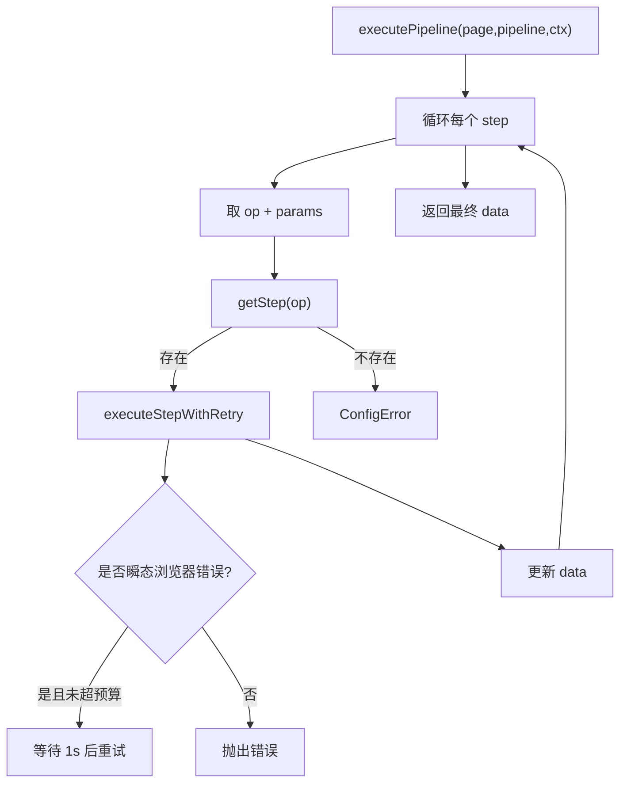

# Pipeline、模板与数据抽取

<details>
<summary>相关源文件</summary>

- `src/pipeline/executor.ts`
- `src/pipeline/template.ts`
- `src/capabilityRouting.ts`
- `src/cli.ts`

</details>

## Pipeline 的位置

pipeline 是 adapter 的声明式执行路径。adapter 可以不写 `func`，而是提供步骤数组；执行层把它交给 `executePipeline(page, pipeline, ctx)`。  
Sources: [src/execution.ts:77-133](../../../project-repos/opencli/src/execution.ts#L77-L133), [src/pipeline/index.ts:1-6](../../../project-repos/opencli/src/pipeline/index.ts#L1-L6)

<details class="source-snippets">
<summary>引用源码</summary>

<!-- source-snippets:start -->

#### `src/execution.ts:77-133`

> 未找到引用文件：`src/execution.ts`

#### `src/pipeline/index.ts:1-6`

> 未找到引用文件：`src/pipeline/index.ts`

<!-- source-snippets:end -->
</details>

## 浏览器步骤判定

并不是所有 pipeline 都需要浏览器。`capabilityRouting.ts` 用 `BROWSER_ONLY_STEPS` 判断步骤是否涉及页面操作，包括 `navigate`、`click`、`type`、`wait`、`press`、`snapshot`、`evaluate`、`intercept`、`tap`。如果命令有 `navigateBefore`，即便 pipeline 没出现这些步骤，也会使用浏览器 session。  
Sources: [src/capabilityRouting.ts:3-14](../../../project-repos/opencli/src/capabilityRouting.ts#L3-L14), [src/capabilityRouting.ts:16-31](../../../project-repos/opencli/src/capabilityRouting.ts#L16-L31)

<details class="source-snippets">
<summary>引用源码</summary>

<!-- source-snippets:start -->

#### `src/capabilityRouting.ts:3-14`

> 未找到引用文件：`src/capabilityRouting.ts`

#### `src/capabilityRouting.ts:16-31`

> 未找到引用文件：`src/capabilityRouting.ts`

<!-- source-snippets:end -->
</details>

## 执行器



执行器按顺序执行步骤，上一阶段结果存在 `data` 里。浏览器步骤默认最多重试 2 次，非浏览器步骤默认不重试；只有瞬态浏览器错误才会触发重试。失败时如果 page 支持 `closeWindow`，会尝试清理 automation window。  
Sources: [src/pipeline/executor.ts:20-58](../../../project-repos/opencli/src/pipeline/executor.ts#L20-L58), [src/pipeline/executor.ts:60-84](../../../project-repos/opencli/src/pipeline/executor.ts#L60-L84)

<details class="source-snippets">
<summary>引用源码</summary>

<!-- source-snippets:start -->

#### `src/pipeline/executor.ts:20-58`

> 未找到引用文件：`src/pipeline/executor.ts`

#### `src/pipeline/executor.ts:60-84`

> 未找到引用文件：`src/pipeline/executor.ts`

<!-- source-snippets:end -->
</details>

## 模板表达式

模板引擎支持 &lt;code v-pre>$&lt;span v-pre>&#123;&#123;&lt;/span> ... &#125;&#125;&lt;/code> 表达式：

- 整个字符串是单个表达式时返回原始值。
- 字符串中嵌入表达式时替换成字符串。
- 可访问 `args`、`data`、`root`、`item`、`index`。
- 支持 pipe filter，如 `default`、`join`、`upper`、`lower`、`truncate`、`replace`、`keys`、`length`、`first`、`last`、`json`、`slugify`、`sanitize` 等。

Sources: [src/pipeline/template.ts:17-32](../../../project-repos/opencli/src/pipeline/template.ts#L17-L32), [src/pipeline/template.ts:34-66](../../../project-repos/opencli/src/pipeline/template.ts#L34-L66), [src/pipeline/template.ts:68-150](../../../project-repos/opencli/src/pipeline/template.ts#L68-L150)

<details class="source-snippets">
<summary>引用源码</summary>

<!-- source-snippets:start -->

#### `src/pipeline/template.ts:17-32`

> 未找到引用文件：`src/pipeline/template.ts`

#### `src/pipeline/template.ts:34-66`

> 未找到引用文件：`src/pipeline/template.ts`

#### `src/pipeline/template.ts:68-150`

> 未找到引用文件：`src/pipeline/template.ts`

<!-- source-snippets:end -->
</details>

## VM 沙箱

当表达式不是简单路径或字面量时，模板引擎会在 `node:vm` 沙箱里求值。它有几层边界：

- 拦截 `constructor`、`__proto__`、`prototype`、`globalThis`、`process`、`require`、`import`、`eval` 等明显逃逸模式。
- 对上下文对象做 JSON deep-copy，切断原型链。
- 编译脚本做 LRU 上限 256。
- 复用 VM context，但每次清理非白名单字段。
- 单次执行 timeout 是 50ms，且禁用字符串/wasm code generation。

Sources: [src/pipeline/template.ts:176-218](../../../project-repos/opencli/src/pipeline/template.ts#L176-L218), [src/pipeline/template.ts:220-237](../../../project-repos/opencli/src/pipeline/template.ts#L220-L237), [src/pipeline/template.ts:239-317](../../../project-repos/opencli/src/pipeline/template.ts#L239-L317)

<details class="source-snippets">
<summary>引用源码</summary>

<!-- source-snippets:start -->

#### `src/pipeline/template.ts:176-218`

> 未找到引用文件：`src/pipeline/template.ts`

#### `src/pipeline/template.ts:220-237`

> 未找到引用文件：`src/pipeline/template.ts`

#### `src/pipeline/template.ts:239-317`

> 未找到引用文件：`src/pipeline/template.ts`

<!-- source-snippets:end -->
</details>

## 浏览器抽取与网络形状

浏览器命令的网络抽取不是 pipeline 专属，但它是 adapter 原型阶段的重要数据来源。`browser network` 会把 body shape 推断出来，默认只输出 key、method、status、url、content-type、size 和 shape，避免把完整 body 直接打进上下文。需要完整 body 时再用 `--detail <key>`。  
Sources: [src/cli.ts:1307-1322](../../../project-repos/opencli/src/cli.ts#L1307-L1322), [src/cli.ts:1347-1407](../../../project-repos/opencli/src/cli.ts#L1347-L1407), [src/cli.ts:1473-1488](../../../project-repos/opencli/src/cli.ts#L1473-L1488)

<details class="source-snippets">
<summary>引用源码</summary>

<!-- source-snippets:start -->

#### `src/cli.ts:1307-1322`

> 未找到引用文件：`src/cli.ts`

#### `src/cli.ts:1347-1407`

> 未找到引用文件：`src/cli.ts`

#### `src/cli.ts:1473-1488`

> 未找到引用文件：`src/cli.ts`

<!-- source-snippets:end -->
</details>

## 数据抽取建议

| 场景 | 首选 |
|---|---|
| 页面结构未知 | `browser state` |
| CSS 已知 | `browser find --css` |
| 长文读取 | `browser extract` |
| JSON API 页面 | `browser network` |
| 需要跨 iframe 读取 | `browser frames` + `browser eval --frame` |
| 可复用站点能力 | 写 adapter，必要时用 pipeline |

Sources: [skills/opencli-browser/SKILL.md:102-171](../skills/opencli-browser/SKILL.md#L102-L171), [skills/opencli-browser/SKILL.md:231-250](../skills/opencli-browser/SKILL.md#L231-L250)

<details class="source-snippets">
<summary>引用源码</summary>

<!-- source-snippets:start -->

#### `skills/opencli-browser/SKILL.md:102-171`

````markdown
| `browser get url` | plain text |
| `browser get text <target> [--nth N]` | `{value, matches_n, match_level}` |
| `browser get value <target> [--nth N]` | `{value, matches_n, match_level}` |
| `browser get attributes <target> [--nth N]` | `{value: {attr: val}, matches_n, match_level}` |
| `browser get html [--selector <css>] [--as html|json] ...` | 原始 HTML 或结构化树，预算截断会报告 `truncated`。 |

### Interact

| 命令 | 说明 |
|---|---|
| `browser click <target> [--nth N]` | 返回 `{clicked, target, matches_n, match_level}`。 |
| `browser type <target> <text> [--nth N]` | 先 click 再 type，返回 `autocomplete` 信号。 |
| `browser select <target> <option> [--nth N]` | 优先按 label 匹配，再按 value。 |
| `browser keys <key>` | `Enter`、`Escape`、`Tab`、`Control+a` 等。 |
| `browser scroll <direction> [--amount px]` | `up` 或 `down`，默认 500 px。 |

### Wait

```bash
browser wait selector "&lt;css&gt;" [--timeout ms]
browser wait text "&lt;substring&gt;" [--timeout ms]
browser wait time &lt;seconds&gt;
browser wait xhr "&lt;regex&gt;" [--timeout ms]
```

默认 timeout 是 `10000` ms。SPA route、登录跳转、懒加载列表需要 wait 后再 `state/get`。

### Extract

- `browser eval <js> [--frame N]`：在页面或跨源 frame 执行表达式。包装成 IIFE，返回 JSON；不要用它改页面。
- `browser extract [--selector <css>] [--chunk-size N] [--start N]`：把长文抽成 Markdown chunk，返回 `next_start_char`，循环直到为 `null`。

### Network

```bash
browser network
browser network --detail &lt;key&gt;
browser network --filter "field1,field2"
browser network --all
browser network --raw
browser network --ttl &lt;ms&gt;
```

列表项包含 `{key, method, status, url, ct, size, shape, body_truncated?}`。detail envelope 包含完整 body 和截断信息。缓存位于 `~/.opencli/cache/browser-network/`。

### Tabs 与 session

| 命令 | 用途 |
|---|---|
| `browser tab list` | 返回 `{index, page, url, title, active}` 数组。 |
| `browser tab new [url]` | 开新 tab 并打印 page identity。 |
| `browser tab select [targetId]` | 设为默认 tab。所有子命令也可传 `--tab <targetId>`。 |
| `browser tab close [targetId]` | 按 page identity 关闭 tab。 |
| `browser back` | 当前 tab 后退。 |
| `browser close` | 关闭 automation window。 |

## 复合表单控件

date/time、select、file input 都带 `compound`。必须使用它，不要 regex 猜属性。

日期族示例：

```json
{
  "control": "date",
  "format": "YYYY-MM-DD",
  "current": "2026-04-21",
  "min": "2026-01-01",
  "max": "2026-12-31"
}
````

#### `skills/opencli-browser/SKILL.md:231-250`

````markdown
opencli browser state
```

通过 network 抽列表：

```bash
opencli browser open "https://news.ycombinator.com"
opencli browser network --filter "title,score"
opencli browser network --detail topstories-a1b2
```

读取长文章：

```bash
opencli browser open "https://blog.example.com/long-post"
opencli browser extract --chunk-size 8000
opencli browser extract --start 8000 --chunk-size 8000
```

跨源 iframe：
````

<!-- source-snippets:end -->
</details>

## 维护风险

Pipeline 的主要风险不是执行顺序，而是模板表达式和浏览器步骤的隐式能力边界。新 step 加入后必须同步：

- `src/pipeline/registry.ts` 的 step 注册。
- `KNOWN_STEP_NAMES`，否则 validate 会报未知 step。
- `BROWSER_ONLY_STEPS`，否则命令可能没有 page 却执行浏览器步骤。

Sources: [src/validate.ts:4-10](../../../project-repos/opencli/src/validate.ts#L4-L10), [src/validate.ts:93-107](../../../project-repos/opencli/src/validate.ts#L93-L107), [src/capabilityRouting.ts:3-14](../../../project-repos/opencli/src/capabilityRouting.ts#L3-L14)

<details class="source-snippets">
<summary>引用源码</summary>

<!-- source-snippets:start -->

#### `src/validate.ts:4-10`

> 未找到引用文件：`src/validate.ts`

#### `src/validate.ts:93-107`

> 未找到引用文件：`src/validate.ts`

#### `src/capabilityRouting.ts:3-14`

> 未找到引用文件：`src/capabilityRouting.ts`

<!-- source-snippets:end -->
</details>
