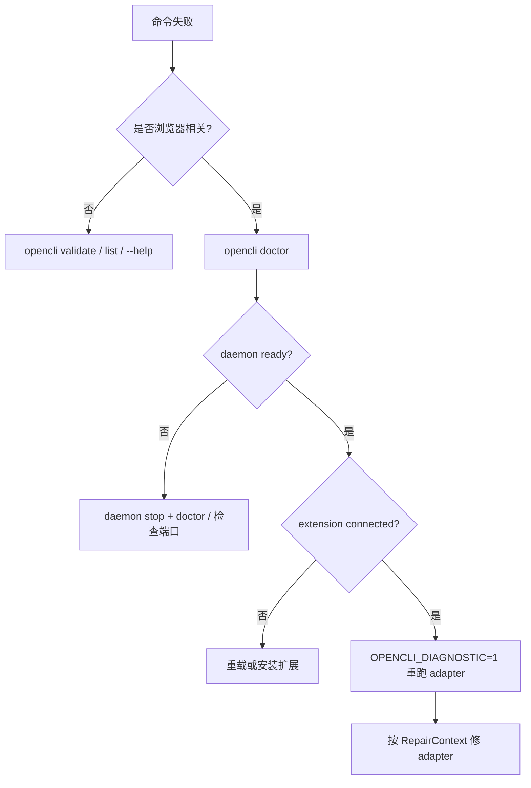

# 测试、发布与日常运维

<details>
<summary>相关源文件</summary>

- `package.json`
- `.github/workflows/ci.yml`
- `.github/workflows/release.yml`
- `src/doctor.ts`
- `src/verify.ts`

</details>

## 本地脚本

package 脚本覆盖构建、测试和文档生成。关键脚本包括 `build`、`test`、`test:adapter`、`test:smoke`、`docs:build` 等；运行要求是 Node `>=21`。  
Sources: [package.json:10-15](../../../project-repos/opencli/package.json#L10-L15), [package.json:41-63](../../../project-repos/opencli/package.json#L41-L63)

<details class="source-snippets">
<summary>引用源码</summary>

<!-- source-snippets:start -->

#### `package.json:10-15`

> 未找到引用文件：`package.json`

#### `package.json:41-63`

> 未找到引用文件：`package.json`

<!-- source-snippets:end -->
</details>

## CI 分层

CI 触发条件包括 push、PR、每周一 smoke test 和手动触发。并发组按 ref 取消旧任务。  
Sources: [github/workflows/ci.yml:1-15](../../../project-repos/opencli/github/workflows/ci.yml#L1-L15)

<details class="source-snippets">
<summary>引用源码</summary>

<!-- source-snippets:start -->

#### `github/workflows/ci.yml:1-15`

> 未找到引用文件：`github/workflows/ci.yml`

<!-- source-snippets:end -->
</details>

主要 job：

| Job | 目的 |
|---|---|
| build | 在 Ubuntu/macOS/Windows 上安装依赖、typecheck、build，并校验 `cli-manifest.json` 没漂移 |
| unit-test | Vitest unit/extension shard |
| bun-test | Bun 兼容性检查 |
| adapter-test | focused adapter tests |
| smoke-test | 定时/手动，在 Ubuntu/macOS 上跑真实浏览器 smoke |

Sources: [github/workflows/ci.yml:16-52](../../../project-repos/opencli/github/workflows/ci.yml#L16-L52), [github/workflows/ci.yml:53-77](../../../project-repos/opencli/github/workflows/ci.yml#L53-L77), [github/workflows/ci.yml:78-98](../../../project-repos/opencli/github/workflows/ci.yml#L78-L98), [github/workflows/ci.yml:99-116](../../../project-repos/opencli/github/workflows/ci.yml#L99-L116), [github/workflows/ci.yml:117-155](../../../project-repos/opencli/github/workflows/ci.yml#L117-L155)

<details class="source-snippets">
<summary>引用源码</summary>

<!-- source-snippets:start -->

#### `github/workflows/ci.yml:16-52`

> 未找到引用文件：`github/workflows/ci.yml`

#### `github/workflows/ci.yml:53-77`

> 未找到引用文件：`github/workflows/ci.yml`

#### `github/workflows/ci.yml:78-98`

> 未找到引用文件：`github/workflows/ci.yml`

#### `github/workflows/ci.yml:99-116`

> 未找到引用文件：`github/workflows/ci.yml`

#### `github/workflows/ci.yml:117-155`

> 未找到引用文件：`github/workflows/ci.yml`

<!-- source-snippets:end -->
</details>

## Manifest 漂移门禁

CI build job 在 Linux 上执行 `git diff --exit-code -- cli-manifest.json`。这保证源码 adapter 与提交的 manifest 同步，避免用户或 Agent 在安装包里看到过期命令清单。  
Sources: [github/workflows/ci.yml:41-51](../../../project-repos/opencli/github/workflows/ci.yml#L41-L51)

<details class="source-snippets">
<summary>引用源码</summary>

<!-- source-snippets:start -->

#### `github/workflows/ci.yml:41-51`

> 未找到引用文件：`github/workflows/ci.yml`

<!-- source-snippets:end -->
</details>

## Release 流程

Release 由 `v*` tag 触发。流程包括：

1. checkout 与 Node 22。
2. `npm ci` 和 typecheck。
3. 安装 extension 依赖、构建 extension、打包 release。
4. 生成 extension zip。
5. 创建 GitHub Release 并上传 zip。
6. `npm publish --provenance --access public`。
7. 触发 website rebuild。

Sources: [github/workflows/release.yml:1-12](../../../project-repos/opencli/github/workflows/release.yml#L1-L12), [github/workflows/release.yml:13-58](../../../project-repos/opencli/github/workflows/release.yml#L13-L58), [github/workflows/release.yml:59-64](../../../project-repos/opencli/github/workflows/release.yml#L59-L64)

<details class="source-snippets">
<summary>引用源码</summary>

<!-- source-snippets:start -->

#### `github/workflows/release.yml:1-12`

> 未找到引用文件：`github/workflows/release.yml`

#### `github/workflows/release.yml:13-58`

> 未找到引用文件：`github/workflows/release.yml`

#### `github/workflows/release.yml:59-64`

> 未找到引用文件：`github/workflows/release.yml`

<!-- source-snippets:end -->
</details>

## Doctor

`opencli doctor` 诊断的是 Browser Bridge，不是所有 opencli 能力。它会检查 daemon 是否运行、扩展是否连接、版本是否兼容；`--live` 时会真正创建 BrowserBridge 并执行 `page.evaluate('1 + 1')`。  
Sources: [src/doctor.ts:73-88](../../../project-repos/opencli/src/doctor.ts#L73-L88), [src/doctor.ts:90-119](../../../project-repos/opencli/src/doctor.ts#L90-L119), [src/doctor.ts:121-210](../../../project-repos/opencli/src/doctor.ts#L121-L210)

<details class="source-snippets">
<summary>引用源码</summary>

<!-- source-snippets:start -->

#### `src/doctor.ts:73-88`

> 未找到引用文件：`src/doctor.ts`

#### `src/doctor.ts:90-119`

> 未找到引用文件：`src/doctor.ts`

#### `src/doctor.ts:121-210`

> 未找到引用文件：`src/doctor.ts`

<!-- source-snippets:end -->
</details>

渲染报告会显示 daemon、extension、connectivity、sessions 和 issues。doctor 对 extension 版本过旧、daemon 版本不一致、扩展未连接都有明确提示。  
Sources: [src/doctor.ts:213-273](../../../project-repos/opencli/src/doctor.ts#L213-L273)

<details class="source-snippets">
<summary>引用源码</summary>

<!-- source-snippets:start -->

#### `src/doctor.ts:213-273`

> 未找到引用文件：`src/doctor.ts`

<!-- source-snippets:end -->
</details>

## Validate 与 Verify

`validate` 校验当前 registry 的命令定义。`verify` 先运行 validate，再可选运行 smoke。smoke 会找项目根的 `tests/smoke`，通过 `npx vitest run tests/smoke/ --reporter=dot` 执行。  
Sources: [src/validate.ts:27-79](../../../project-repos/opencli/src/validate.ts#L27-L79), [src/verify.ts:32-47](../../../project-repos/opencli/src/verify.ts#L32-L47), [src/verify.ts:49-93](../../../project-repos/opencli/src/verify.ts#L49-L93)

<details class="source-snippets">
<summary>引用源码</summary>

<!-- source-snippets:start -->

#### `src/validate.ts:27-79`

> 未找到引用文件：`src/validate.ts`

#### `src/verify.ts:32-47`

> 未找到引用文件：`src/verify.ts`

#### `src/verify.ts:49-93`

> 未找到引用文件：`src/verify.ts`

<!-- source-snippets:end -->
</details>

browser-level `opencli browser verify <site>/<command>` 是用户 adapter 端到端验证，它会执行 adapter 并用 fixture 校验输出，更适合 adapter 作者日常闭环。  
Sources: [src/cli.ts:1561-1698](../../../project-repos/opencli/src/cli.ts#L1561-L1698)

<details class="source-snippets">
<summary>引用源码</summary>

<!-- source-snippets:start -->

#### `src/cli.ts:1561-1698`

> 未找到引用文件：`src/cli.ts`

<!-- source-snippets:end -->
</details>

## 运维排障地图



Sources: [src/doctor.ts:121-175](../../../project-repos/opencli/src/doctor.ts#L121-L175), [src/diagnostic.ts:325-360](../../../project-repos/opencli/src/diagnostic.ts#L325-L360), [skills/opencli-autofix/SKILL.md:52-90](../skills/opencli-autofix/SKILL.md#L52-L90)

<details class="source-snippets">
<summary>引用源码</summary>

<!-- source-snippets:start -->

#### `src/doctor.ts:121-175`

> 未找到引用文件：`src/doctor.ts`

#### `src/diagnostic.ts:325-360`

> 未找到引用文件：`src/diagnostic.ts`

#### `skills/opencli-autofix/SKILL.md:52-90`

````markdown
只有空结果跨重试和替代入口都可复现时，才进入 Step 1。

## Step 1：收集诊断上下文

```bash
OPENCLI_DIAGNOSTIC=1 opencli &lt;site&gt; &lt;command&gt; [args...] 2>diagnostic.json
```

stderr 中会在 `___OPENCLI_DIAGNOSTIC___` 标记之间输出 `RepairContext`：

```json
{
  "error": {
    "code": "SELECTOR",
    "message": "Could not find element: .old-selector",
    "hint": "The page UI may have changed."
  },
  "adapter": {
    "site": "example",
    "command": "example/search",
    "sourcePath": "/path/to/clis/example/search.js",
    "source": "// full adapter source code"
  },
  "page": {
    "url": "https://example.com/search",
    "snapshot": "// DOM snapshot with [N] indices",
    "networkRequests": [],
    "consoleErrors": []
  },
  "timestamp": "2025-01-01T00:00:00.000Z"
}
```

提取 JSON：

```bash
cat diagnostic.json | sed -n '/___OPENCLI_DIAGNOSTIC___/{n;p;}'
```

````

<!-- source-snippets:end -->
</details>
