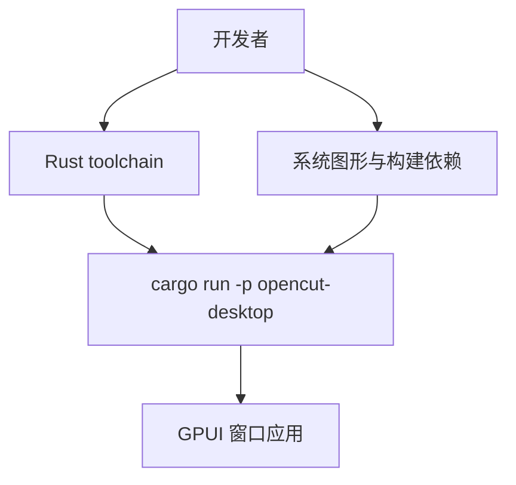

<details>
<summary>相关源文件</summary>

生成本页时使用的主要源文件：

- [apps/desktop/README.md](../../../project-repos/opencut/apps/desktop/README.md)
- [Cargo.toml](../../../project-repos/opencut/Cargo.toml)
- [README.md](../../../project-repos/opencut/README.md)
- [script/setup-rust](../../../project-repos/opencut/script/setup-rust)
- [apps/desktop/Cargo.toml](../../../project-repos/opencut/apps/desktop/Cargo.toml)

</details>

# 桌面端（GPUI）

`apps/desktop` 是 OpenCut 的**原生桌面壳**，基于 [GPUI](https://gpui.rs) 构建；README 标注该方向仍在推进（与 Web 主线的成熟度不同）。

## 本地运行三步

`apps/desktop/README.md` 规定顺序：**安装 Rust**（仓库提供 `./script/setup-rust` 与 Windows PowerShell 等价脚本）→ **安装原生依赖**（`./apps/desktop/script/setup` 或 ps1）→ **`cargo run -p opencut-desktop`**。这与根 `Cargo.toml` 将 `apps/desktop` 纳入 workspace 一致，二进制包名为 `opencut-desktop`、可执行名在 `Cargo.toml` 中为 `opencut`。

## 平台说明

同一份 README 覆盖 Linux（apt/dnf/pacman）、macOS（必要时安装 Xcode CLT）、Windows（检测 VS Build Tools）与 **WSLg** 场景，强调旧版 Windows 上渲染可能受限。该文档与根 README「桌面为可选」叙述互补：多数贡献者可以只开发 `apps/web`。



Sources: [apps/desktop/README.md:1-37](../../../project-repos/opencut/apps/desktop/README.md#L1-L37), [apps/desktop/Cargo.toml:1-12](../../../project-repos/opencut/apps/desktop/Cargo.toml#L1-L12), [README.md:78-82](../../../project-repos/opencut/README.md#L78-L82)

<details class="source-snippets">
<summary>引用源码</summary>

<!-- source-snippets:start -->

#### `apps/desktop/README.md:1-37`

````markdown
# Desktop

The native desktop app, built with [GPUI](https://gpui.rs).

## Getting started

**1. Install Rust:**

```bash
# Linux / macOS / WSL
./script/setup-rust
```

```powershell
# Windows
powershell -ExecutionPolicy Bypass -File .\script\setup-rust.ps1
```

Both scripts skip installation if Rust is already present. On Linux/macOS/WSL only: after a fresh install, reload your shell with `source "$HOME/.cargo/env"`

**2. Install native dependencies:**

```bash
# Linux / macOS / WSL
./apps/desktop/script/setup
```

```powershell
# Windows
powershell -ExecutionPolicy Bypass -File .\apps\desktop\script\setup.ps1
```

**3. Run:**

```bash
cargo run -p opencut-desktop
```
````

#### `apps/desktop/Cargo.toml:1-12`

```toml
[package]
name = "opencut-desktop"
version = "0.1.0"
edition = "2021"

[[bin]]
name = "opencut"
path = "src/main.rs"

[dependencies]
gpui = "0.2.2"
```

#### `README.md:78-82`

```markdown
### Desktop setup

Desktop is opt-in. If you're only working on the web app, skip this entirely.

If you want to get ready for `apps/desktop`, see [`apps/desktop/README.md`](apps/desktop/README.md). It's a two-step setup: Rust toolchain first, then desktop native dependencies.
```

<!-- source-snippets:end -->
</details>
## 相关页面

- [Rust 工作区与 WASM 导出](rust-wasm-bridge.md)
- [系统架构](system-architecture.md)
- [CI、Docker 与发布](ci-docker-deploy.md)
