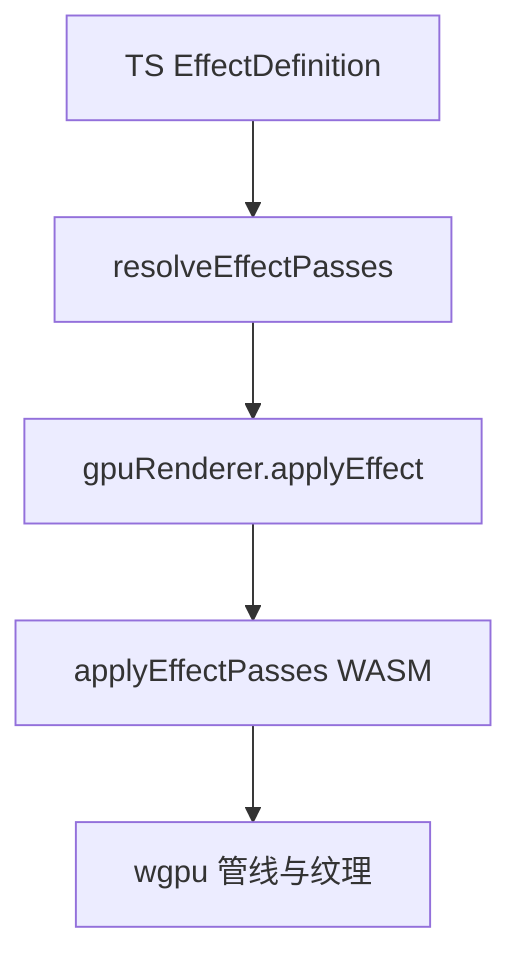

<details>
<summary>相关源文件</summary>

生成本页时使用的主要源文件：

- [apps/web/src/services/renderer/gpu-renderer.ts](../../../project-repos/opencut/apps/web/src/services/renderer/gpu-renderer.ts)
- [docs/effects-renderer.md](../../../project-repos/opencut/docs/effects-renderer.md)
- [rust/crates/gpu/src/lib.rs](../../../project-repos/opencut/rust/crates/gpu/src/lib.rs)
- [rust/crates/gpu/src/context.rs](../../../project-repos/opencut/rust/crates/gpu/src/context.rs)
- [apps/web/package.json](../../../project-repos/opencut/apps/web/package.json)

</details>

# GPU 渲染、特效与预览

OpenCut 的特效系统拆为两层：**TypeScript 定义**（参数 UI、pass 模板、`buildPasses` 动态展开）与 **Rust/wgpu** 侧的设备、纹理与 pass 执行。`docs/effects-renderer.md` 明确要求新增特效时注册 WGSL 文件，并在 pass 解析上统一走 `resolveEffectPasses`。

## Web 入口：gpu-renderer

`gpu-renderer.ts` 将 `EffectPass` 序列化为 `{ shader, uniforms: { name, value }[] }` 后交给 WASM 的 `applyEffectPasses`；`normalizeUniformValue` 将标量归一成单元素数组。初始化失败时仅 `console.warn` 并将 `gpuAvailable` 置为 `false`，后续 `applyEffect` 直接短路返回源画布。



## Rust GPU crate 表面

`rust/crates/gpu/src/lib.rs` 导出 `GpuContext` 与 `wgpu` 本身，并定义 `GPU_TEXTURE_FORMAT` 为 `Bgra8Unorm` 以及内嵌 `fullscreen.wgsl` 常量。`context.rs` 使用 `include_str!` 装载 `blit.wgsl` 等 shader 源，并在适配器不可用时映射到 `GpuError::AdapterUnavailable` 等枚举。文档将「浏览器画布数据进入 GPU」的边界描述为 `copy_external_image_to_texture()` 一类路径，强调坐标系一致性。

## 与已发布 wasm 包的关系

`apps/web/package.json` 将 `opencut-wasm` 固定为 **^0.2.10**，与根 `package.json` 的同名依赖一致；本地若链接自研构建，则走 README 中的 `bun link` 工作流（见 [Rust 工作区与 WASM 导出](rust-wasm-bridge.md)）。

Sources: [apps/web/src/services/renderer/gpu-renderer.ts:1-90](../../../project-repos/opencut/apps/web/src/services/renderer/gpu-renderer.ts#L1-L90), [docs/effects-renderer.md:1-66](../../../project-repos/opencut/docs/effects-renderer.md#L1-L66), [rust/crates/gpu/src/lib.rs:1-21](../../../project-repos/opencut/rust/crates/gpu/src/lib.rs#L1-L21), [rust/crates/gpu/src/context.rs:29-124](../../../project-repos/opencut/rust/crates/gpu/src/context.rs#L29-L124)

<details class="source-snippets">
<summary>引用源码</summary>

<!-- source-snippets:start -->

#### `apps/web/src/services/renderer/gpu-renderer.ts:1-90`

```typescript
import {
	applyEffectPasses,
	applyMaskFeather as applyMaskFeatherWasm,
	initializeGpu,
} from "opencut-wasm";
import type { EffectPass, EffectUniformValue } from "@/effects/types";

let gpuAvailable = false;
let initPromise: Promise<void> | null = null;

export function initializeGpuRenderer(): Promise<void> {
	if (!initPromise) {
		initPromise = initializeGpu()
			.then(() => {
				gpuAvailable = true;
			})
			.catch((error: unknown) => {
				gpuAvailable = false;
				const message = error instanceof Error ? error.message : String(error);
				console.warn(`GPU renderer unavailable: ${message}`);
			});
	}
	return initPromise;
}

export function isGpuAvailable(): boolean {
	return gpuAvailable;
}

export const gpuRenderer = {
	applyEffect({
		source,
		width,
		height,
		passes,
	}: {
		source: OffscreenCanvas;
		width: number;
		height: number;
		passes: EffectPass[];
	}): OffscreenCanvas {
		if (passes.length === 0 || !gpuAvailable) {
			return source;
		}

		return applyEffectPasses({
			source,
			width,
			height,
			passes: serializeEffectPasses(passes),
		});
	},

	applyMaskFeather({
		maskCanvas,
		width,
		height,
		feather,
	}: {
		maskCanvas: OffscreenCanvas;
		width: number;
		height: number;
		feather: number;
	}): OffscreenCanvas {
		if (!gpuAvailable) {
			return maskCanvas;
		}

		return applyMaskFeatherWasm({
			mask: maskCanvas,
			width,
			height,
			feather,
		});
	},
};

function serializeEffectPasses(passes: EffectPass[]) {
	return passes.map((pass) => ({
		shader: pass.shader,
		uniforms: Object.entries(pass.uniforms).map(([name, value]) => ({
			name,
			value: normalizeUniformValue(value),
		})),
	}));
}

function normalizeUniformValue(value: EffectUniformValue): number[] {
	return typeof value === "number" ? [value] : value;
}
```

#### `docs/effects-renderer.md:1-66`

````markdown
# Effects & GPU Renderer

## How to add a new effect

1. Create a new file in `apps/web/src/lib/effects/definitions/` (e.g. `brightness.ts`)
2. Export an `EffectDefinition` — see `blur.ts` as a reference
3. Register it in `apps/web/src/lib/effects/definitions/index.ts`

An effect definition has:
- `type` — unique string identifier
- `name` — display name
- `keywords` — for search
- `params` — user-facing controls (sliders, toggles, etc.)
- `renderer` — GPU pass templates resolved into shader identifiers + uniforms

All effects use the shared GPU renderer. TypeScript decides which shader identifiers to run and which uniforms to pass. Rust/wgpu owns device creation, textures, and pass execution.

## Single-pass vs multi-pass

The renderer supports a `passes` array. Single-pass effects (e.g. color grading) just have one entry. Multi-pass is needed when an effect has to process its own output — blur (H then V), bloom (extract → blur → composite), glow, etc.

```typescript
renderer: {
  passes: [
    { shader: "my-effect-shader", uniforms: ({ effectParams }) => ({ ... }) },
  ],
}
```

### Dynamic pass counts with `buildPasses`

Some effects need a variable number of passes depending on their parameters (e.g. blur needs more iterations at high intensity to keep quality). For these, add a `buildPasses` function to the renderer:

```typescript
renderer: {
  passes: [ /* static fallback — used if buildPasses is absent */ ],
  buildPasses: ({ effectParams, width, height }) => {
    // return EffectPass[] with pre-computed uniforms
  },
}
```

When `buildPasses` is present, all rendering paths use it instead of the static `passes` array. The static array is kept as a structural reference and fallback for effects that don't need dynamic pass counts.

### Resolving passes — always use `resolveEffectPasses`

All code that consumes effect passes should go through the helper, never access `definition.renderer.passes` directly:

```typescript
import { resolveEffectPasses } from "@/lib/effects";

const passes = resolveEffectPasses({ definition, effectParams, width, height });
```

This handles the `buildPasses` vs static `passes` dispatch automatically.

### Pipeline

Linear effect chains go through `gpuRenderer.applyEffect()` in `apps/web/src/services/renderer/gpu-renderer.ts`.

TypeScript resolves `EffectPass[]` from effect definitions. Each pass contains:
- `shader` — a stable identifier such as `"gaussian-blur"`
- `uniforms` — resolved numeric values for that pass

Rust maps the shader identifier to a precompiled WGSL pipeline in `rust/crates/gpu/src/shader_registry.rs`. Non-linear GPU work such as signed-distance-field generation and mask feathering lives in dedicated Rust pipeline modules, not in TypeScript orchestration.

````

#### `rust/crates/gpu/src/lib.rs:1-21`

```rust
mod context;

use thiserror::Error;

pub use context::GpuContext;
pub use wgpu;

pub const GPU_TEXTURE_FORMAT: wgpu::TextureFormat = wgpu::TextureFormat::Bgra8Unorm;
pub const FULLSCREEN_SHADER_SOURCE: &str = include_str!("shaders/fullscreen.wgsl");

#[derive(Debug, Error)]
pub enum GpuError {
    #[error("No WebGPU adapter is available")]
    AdapterUnavailable,
    #[error("Failed to request a WebGPU device: {0}")]
    RequestDevice(#[from] wgpu::RequestDeviceError),
    #[error("Failed to create a WebGPU surface: {0}")]
    CreateSurface(#[from] wgpu::CreateSurfaceError),
    #[error("The output surface does not support the required texture format")]
    UnsupportedSurfaceFormat,
}
```

#### `rust/crates/gpu/src/context.rs:29-124`

```rust
const BLIT_SHADER_SOURCE: &str = include_str!("shaders/blit.wgsl");

const FULLSCREEN_QUAD_POSITIONS: [[f32; 2]; 6] = [
    [-1.0, -1.0],
    [1.0, -1.0],
    [-1.0, 1.0],
    [-1.0, 1.0],
    [1.0, -1.0],
    [1.0, 1.0],
];

pub struct GpuContext {
    instance: wgpu::Instance,
    adapter: wgpu::Adapter,
    device: wgpu::Device,
    queue: wgpu::Queue,
    texture_format: wgpu::TextureFormat,
    fullscreen_quad: wgpu::Buffer,
    linear_sampler: wgpu::Sampler,
    nearest_sampler: wgpu::Sampler,
    texture_sampler_bind_group_layout: wgpu::BindGroupLayout,
    blit_pipeline: wgpu::RenderPipeline,
    supports_external_texture_copies: bool,
    /// The HTML canvas that the WebGL context is bound to. Only populated on the WebGL
    /// fallback path. Used by render_texture_via_gl_canvas to output frames on WebGL.
    #[cfg(all(feature = "wasm", target_arch = "wasm32"))]
    gl_canvas: Option<web_sys::HtmlCanvasElement>,
    #[cfg(all(feature = "wasm", target_arch = "wasm32"))]
    gl_surface: RefCell<Option<CachedCanvasSurface>>,
}

impl GpuContext {
    pub async fn new() -> Result<Self, GpuError> {
        #[cfg(all(feature = "wasm", target_arch = "wasm32"))]
        let (instance, adapter, device, queue, gl_canvas) = Self::acquire_device().await?;
        #[cfg(not(all(feature = "wasm", target_arch = "wasm32")))]
        let (instance, adapter, device, queue) = Self::acquire_device().await?;
        let texture_format = if adapter.get_info().backend == wgpu::Backend::Gl {
            wgpu::TextureFormat::Rgba8Unorm
        } else {
            wgpu::TextureFormat::Bgra8Unorm
        };
        let fullscreen_quad = device.create_buffer_init(&wgpu::util::BufferInitDescriptor {
            label: Some("gpu-fullscreen-quad-buffer"),
            contents: bytemuck::cast_slice(&FULLSCREEN_QUAD_POSITIONS),
            usage: wgpu::BufferUsages::VERTEX,
        });
        let linear_sampler = device.create_sampler(&wgpu::SamplerDescriptor {
            label: Some("gpu-linear-sampler"),
            address_mode_u: wgpu::AddressMode::ClampToEdge,
            address_mode_v: wgpu::AddressMode::ClampToEdge,
            address_mode_w: wgpu::AddressMode::ClampToEdge,
            mag_filter: wgpu::FilterMode::Linear,
            min_filter: wgpu::FilterMode::Linear,
            mipmap_filter: wgpu::MipmapFilterMode::Nearest,
            ..Default::default()
        });
        let nearest_sampler = device.create_sampler(&wgpu::SamplerDescriptor {
            label: Some("gpu-nearest-sampler"),
            address_mode_u: wgpu::AddressMode::ClampToEdge,
            address_mode_v: wgpu::AddressMode::ClampToEdge,
            address_mode_w: wgpu::AddressMode::ClampToEdge,
            mag_filter: wgpu::FilterMode::Nearest,
            min_filter: wgpu::FilterMode::Nearest,
            mipmap_filter: wgpu::MipmapFilterMode::Nearest,
            ..Default::default()
        });
        let texture_sampler_bind_group_layout =
            device.create_bind_group_layout(&wgpu::BindGroupLayoutDescriptor {
                label: Some("gpu-texture-sampler-bind-group-layout"),
                entries: &[
                    wgpu::BindGroupLayoutEntry {
                        binding: 0,
                        visibility: wgpu::ShaderStages::FRAGMENT,
                        ty: wgpu::BindingType::Texture {
                            multisampled: false,
                            view_dimension: wgpu::TextureViewDimension::D2,
                            sample_type: wgpu::TextureSampleType::Float { filterable: true },
                        },
                        count: None,
                    },
                    wgpu::BindGroupLayoutEntry {
                        binding: 1,
                        visibility: wgpu::ShaderStages::FRAGMENT,
                        ty: wgpu::BindingType::Sampler(wgpu::SamplerBindingType::Filtering),
                        count: None,
                    },
                ],
            });
        let vertex_shader_module = device.create_shader_module(wgpu::ShaderModuleDescriptor {
            label: Some("gpu-fullscreen-shader"),
            source: wgpu::ShaderSource::Wgsl(FULLSCREEN_SHADER_SOURCE.into()),
        });
        let blit_shader_module = device.create_shader_module(wgpu::ShaderModuleDescriptor {
            label: Some("gpu-blit-shader"),
            source: wgpu::ShaderSource::Wgsl(BLIT_SHADER_SOURCE.into()),
```

<!-- source-snippets:end -->
</details>
## 相关页面

- [Rust 工作区与 WASM 导出](rust-wasm-bridge.md)
- [时间线、重定时与更新管线](timeline-update-pipeline.md)
- [Web 应用（Next.js）](web-nextjs-stack.md)
