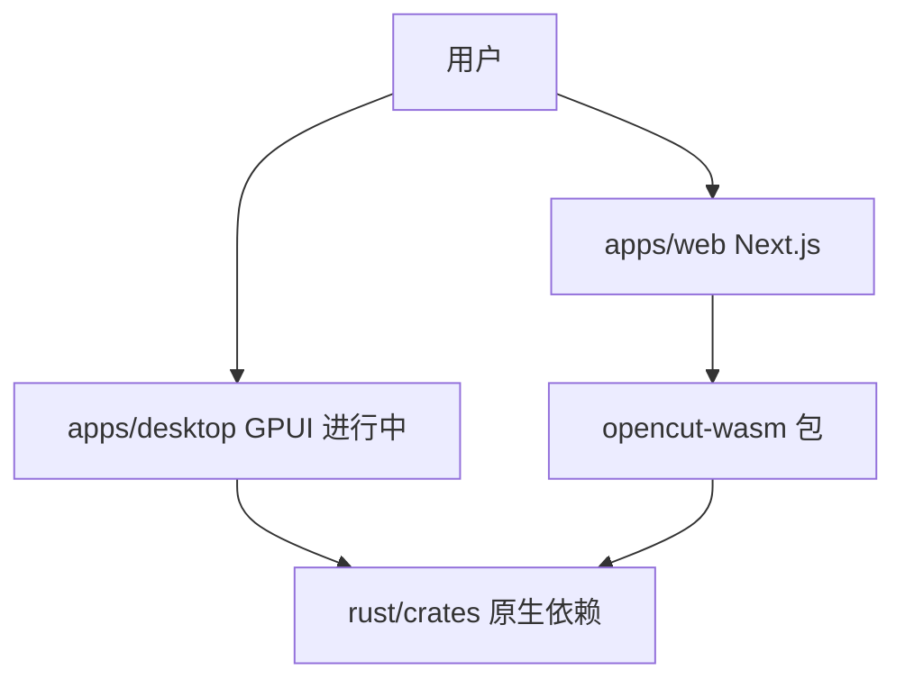

<details>
<summary>相关源文件</summary>

生成本页时使用的主要源文件：

- [README.md](../../../project-repos/opencut/README.md)
- [package.json](../../../project-repos/opencut/package.json)
- [AGENTS.md](../../../project-repos/opencut/AGENTS.md)
- [Cargo.toml](../../../project-repos/opencut/Cargo.toml)
- [turbo.json](../../../project-repos/opencut/turbo.json)

</details>

# 项目概览

OpenCut 定位为**免费、开源**的视频编辑器，覆盖 **Web、桌面与移动**方向；当前仓库以 `apps/web` 的 Next.js 应用为主力，同时在 `rust/` 中沉淀跨平台核心逻辑，并通过 **WebAssembly** 暴露给浏览器。

README 将动机归纳为隐私（素材留在本地）、对标常见商业剪辑器的免费能力，以及「简单易用」的产品取向。工程上，官方明确 **Bun** 为包管理与脚本运行时，并推荐用 **Docker Compose** 拉起 Postgres 与 Redis（也可仅做前端时跳过）。



## 仓库与脚本入口

根 `package.json` 使用 **Turborepo** 任务编排：`dev:web` 过滤 `@opencut/web`，`build:wasm` 调用 `wasm-pack` 构建 `rust/wasm`，`dev:wasm` 用 `cargo-watch` 监听 Rust 变更。工作区声明为 `apps/*` 与 `packages/*`，与 README 中的「`apps/web` Web、`apps/desktop` 桌面、`rust/` 核心」叙述一致。

## 贡献焦点与边界

README 的 Contributing 段落列出**欢迎**与**暂时避免**的区域：时间线、项目管理、性能、Bug 与预览面板外的 UI 改进属于优先；预览面板增强与导出相关重构被标记为进行中，官方建议暂缓大改以免与「新的二进制渲染路径」冲突。

## 架构阅读顺序

`AGENTS.md` 用极短篇幅定义了长期迁移方向：**所有非 UI 逻辑以 `rust/` 为单一真源**，各 `apps/*` 只做交互与平台适配。阅读本 Wiki 时建议先建立该心智模型，再进入 Web 栈、GPU 与时间线页面。

Sources: [README.md:25-36](../../../project-repos/opencut/README.md#L25-L36), [package.json:1-23](../../../project-repos/opencut/package.json#L1-L23), [AGENTS.md:1-17](../../../project-repos/opencut/AGENTS.md#L1-L17)

<details class="source-snippets">
<summary>引用源码</summary>

<!-- source-snippets:start -->

#### `README.md:25-36`

```markdown
## Why?

- **Privacy**: Your videos stay on your device
- **Free features**: Most basic CapCut features are now paywalled 
- **Simple**: People want editors that are easy to use - CapCut proved that

## Project Structure

- `apps/web/`: Next.js web application
- `apps/desktop/`: Native desktop app built with GPUI (in progress)
- `rust/`: Platform-agnostic core: GPU compositor, effects, masks, and WASM bindings. We're actively migrating business logic here from TypeScript.
- `docs/`: Architecture and subsystem documentation
```

#### `package.json:1-23`

```json
{
  "name": "opencut",
  "packageManager": "bun@1.2.18",
  "workspaces": [
    "apps/*",
    "packages/*"
  ],
  "scripts": {
    "build:tools": "turbo run build --filter=@opencut/tools",
    "build:wasm": "wasm-pack build rust/wasm --target bundler --out-dir pkg",
    "build:web": "turbo run build --filter=@opencut/web",
    "deploy:web": "turbo run deploy --filter=@opencut/web",
    "dev:tools": "turbo run dev --filter=@opencut/tools",
    "dev:wasm": "cargo watch -w rust/crates -w rust/wasm/src -s 'wasm-pack build rust/wasm --target bundler --out-dir pkg'",
    "dev:web": "turbo run dev --filter=@opencut/web",
    "format:web": "prettier apps/web/src/services/renderer --write",
    "generate:fonts": "npx tsx apps/web/scripts/generate-font-sprites.ts",
    "lint:web": "eslint apps/web/src --ext .ts,.tsx",
    "lint:web:fix": "eslint apps/web/src --ext .ts,.tsx --fix",
    "preview:web": "turbo run preview --filter=@opencut/web",
    "publish:wasm": "bun run build:wasm && npm publish rust/wasm/pkg --access public",
    "start:tools": "turbo run start --filter=@opencut/tools",
    "test": "bun test"
```

#### `AGENTS.md:1-17`

```markdown
# Agents.md

## Architecture

An ongoing migration is moving all business logic into `rust/`. Each app under `apps/` is a UI shell — it owns rendering, interaction, and platform-specific concerns, but never owns logic. The UI framework for any given app is a replaceable detail.

### `rust/`

The single source of truth for all non-UI code. Everything platform-agnostic belongs here: no components, no hooks, no framework imports.

### `apps/`

Each app is a frontend that calls into Rust. Logic is never duplicated between apps — only UI is, because each platform may use an entirely different framework and language to build it.

- `web/` — Next.js
- `desktop/` — GPUI

```

<!-- source-snippets:end -->
</details>
## 相关页面

- [仓库地图与阅读路线](repository-map.md)
- [系统架构](system-architecture.md)
- [CI、Docker 与发布](ci-docker-deploy.md)
