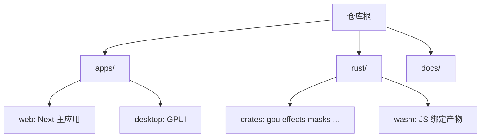

<details>
<summary>相关源文件</summary>

生成本页时使用的主要源文件：

- [README.md](../../../project-repos/opencut/README.md)
- [apps/web/package.json](../../../project-repos/opencut/apps/web/package.json)
- [apps/desktop/Cargo.toml](../../../project-repos/opencut/apps/desktop/Cargo.toml)
- [rust/README.md](../../../project-repos/opencut/rust/README.md)
- [docs/effects-renderer.md](../../../project-repos/opencut/docs/effects-renderer.md)

</details>

# 仓库地图与阅读路线

本页把顶层目录映射到**日常开发任务**，便于新贡献者选择阅读路径。

## 顶层目录职责

README 的「Project Structure」小节给出官方划分：`apps/web` 为 Next.js；`apps/desktop` 为 **GPUI** 原生壳；`rust/` 为与平台无关的核心（GPU 合成、特效、蒙版等），并强调业务逻辑正从 TypeScript **迁移**到 Rust；`docs/` 存放子系统说明（特效渲染、关键帧、动作等）。



## Web 应用包清单

`apps/web/package.json` 将包名设为 `@opencut/web`，脚本包含 `next dev --turbopack`、`next build`、以及 **OpenNext Cloudflare** 的 `preview` 与 `deploy`。依赖侧同时出现 `drizzle-orm`、`better-auth`、`@upstash/redis` 与 `opencut-wasm`，说明该应用同时承担**编辑器前端、服务端数据面与边缘部署**相关职责。

## 桌面与 Rust 工作区

`apps/desktop/Cargo.toml` 将二进制命名为 `opencut`，依赖 **gpui** 固定小版本。根 `Cargo.toml` 的 `members` 列表把 `apps/desktop` 与多个 `rust/crates/*` 及 `rust/wasm` 纳入同一 workspace，与 `rust/README.md` 中「Web 经 WASM、桌面直接依赖 crate」的描述一致。

## 推荐阅读顺序

1. 先读 `AGENTS.md` 与 [系统架构](system-architecture.md) 理解「逻辑在 Rust、UI 在 apps」。
2. 若要改界面与路由： [Web 应用（Next.js）](web-nextjs-stack.md)。
3. 若要改特效或预览 GPU：`docs/effects-renderer.md` 与 [GPU 渲染、特效与预览](gpu-effects-preview.md)。
4. 若要改时间线语义：`docs/keyframes.md` 与 [时间线、重定时与更新管线](timeline-update-pipeline.md)。

Sources: [README.md:31-36](../../../project-repos/opencut/README.md#L31-L36), [apps/web/package.json:1-19](../../../project-repos/opencut/apps/web/package.json#L1-L19), [apps/desktop/Cargo.toml:1-12](../../../project-repos/opencut/apps/desktop/Cargo.toml#L1-L12), [rust/README.md:1-35](../../../project-repos/opencut/rust/README.md#L1-L35)

<details class="source-snippets">
<summary>引用源码</summary>

<!-- source-snippets:start -->

#### `README.md:31-36`

```markdown
## Project Structure

- `apps/web/`: Next.js web application
- `apps/desktop/`: Native desktop app built with GPUI (in progress)
- `rust/`: Platform-agnostic core: GPU compositor, effects, masks, and WASM bindings. We're actively migrating business logic here from TypeScript.
- `docs/`: Architecture and subsystem documentation
```

#### `apps/web/package.json:1-19`

```json
{
  "name": "@opencut/web",
  "version": "0.1.0",
  "private": true,
  "packageManager": "bun@1.2.18",
  "scripts": {
    "dev": "next dev --turbopack",
    "build": "next build",
    "start": "next start",
    "preview": "opennextjs-cloudflare build && opennextjs-cloudflare preview",
    "deploy": "opennextjs-cloudflare build && opennextjs-cloudflare deploy",
    "lint": "eslint src --ext .ts,.tsx",
    "lint:fix": "eslint src --ext .ts,.tsx --fix",
    "format": "prettier src --write",
    "db:generate": "drizzle-kit generate",
    "db:migrate": "drizzle-kit migrate",
    "db:push:local": "cross-env NODE_ENV=development drizzle-kit push",
    "db:push:prod": "cross-env NODE_ENV=production drizzle-kit push"
  },
```

#### `apps/desktop/Cargo.toml:1-12`

```toml
[package]
name = "opencut-desktop"
version = "0.1.0"
edition = "2021"

[[bin]]
name = "opencut"
path = "src/main.rs"

[dependencies]
gpui = "0.2.2"
```

#### `rust/README.md:1-35`

````markdown
# rust/

Shared Rust crates that power OpenCut across platforms (web via WASM, desktop natively).

## Adding a new crate

1. Create it under `rust/crates/`
2. Add `bridge` as a dependency
3. Annotate public functions with `#[export]`

## How `#[export]` works

```rust
use bridge::export;

#[export]
pub fn round_to_frame(time: f64, fps: f64) -> f64 {
    (time * fps).round() / fps
}
```

Without the `wasm` feature, the macro is a no-op. With `--features wasm`, it expands to:

```rust
#[wasm_bindgen(js_name = "roundToFrame")]
pub fn round_to_frame(time: f64, fps: f64) -> f64 { ... }
```

Desktop uses the crates directly as Cargo dependencies.

## Testing

```bash
cargo test -p <crate>
```
````

<!-- source-snippets:end -->
</details>
## 相关页面

- [项目概览](overview.md)
- [Web 应用（Next.js）](web-nextjs-stack.md)
- [Rust 工作区与 WASM 导出](rust-wasm-bridge.md)
