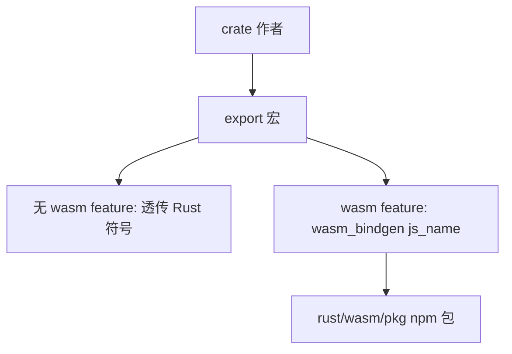

<details>
<summary>相关源文件</summary>

生成本页时使用的主要源文件：

- [Cargo.toml](../../../project-repos/opencut/Cargo.toml)
- [rust/README.md](../../../project-repos/opencut/rust/README.md)
- [rust/wasm/README.md](../../../project-repos/opencut/rust/wasm/README.md)
- [rust/crates/bridge/src/bridge.rs](../../../project-repos/opencut/rust/crates/bridge/src/bridge.rs)
- [package.json](../../../project-repos/opencut/package.json)

</details>

# Rust 工作区与 WASM 导出

根 `Cargo.toml` 将 **resolver = "2"** 并列出 workspace members：`apps/desktop`、多个 `rust/crates/*` 子包以及 `rust/wasm`。这与 `rust/README.md` 的描述一致：共享 crate 同时服务 **WASM 绑定**与 **桌面原生链接**。

## bridge 过程宏

`rust/crates/bridge` 是一个 **proc-macro** crate（`Cargo.toml` 中 `proc-macro = true`）。`#[export]` 属性在 `bridge.rs` 中解析函数或常量：对函数，若带类型参数个数大于一则要求「单结构体选项参数」；在启用 `wasm` feature 时展开为 `wasm_bindgen` 的 `js_name`（蛇形转驼峰）。常量导出则额外生成 getter。该机制把「桌面直接调 Rust」与「JS 调 WASM」的符号策略统一在宏层。



## 根脚本与 wasm-pack

根 `package.json` 的 `build:wasm` 调用 `wasm-pack build rust/wasm --target bundler --out-dir pkg`；`publish:wasm` 在构建后执行 `npm publish rust/wasm/pkg`。`rust/wasm/README.md` 说明默认消费**已发布**的 `opencut-wasm`，本地开发可通过 `bun link` 将 `apps/web` 指到 `rust/wasm/pkg`。

Sources: [Cargo.toml:1-11](../../../project-repos/opencut/Cargo.toml#L1-L11), [rust/README.md:5-35](../../../project-repos/opencut/rust/README.md#L5-L35), [rust/crates/bridge/src/bridge.rs:5-40](../../../project-repos/opencut/rust/crates/bridge/src/bridge.rs#L5-L40), [package.json:9-22](../../../project-repos/opencut/package.json#L9-L22)

<details class="source-snippets">
<summary>引用源码</summary>

<!-- source-snippets:start -->

#### `Cargo.toml:1-11`

```toml
[workspace]
resolver = "2"
members = [
    "apps/desktop",
    "rust/crates/time",
    "rust/crates/bridge",
    "rust/crates/effects",
    "rust/crates/gpu",
    "rust/crates/masks",
    "rust/wasm", "rust/crates/compositor",
]
```

#### `rust/README.md:5-35`

````markdown
## Adding a new crate

1. Create it under `rust/crates/`
2. Add `bridge` as a dependency
3. Annotate public functions with `#[export]`

## How `#[export]` works

```rust
use bridge::export;

#[export]
pub fn round_to_frame(time: f64, fps: f64) -> f64 {
    (time * fps).round() / fps
}
```

Without the `wasm` feature, the macro is a no-op. With `--features wasm`, it expands to:

```rust
#[wasm_bindgen(js_name = "roundToFrame")]
pub fn round_to_frame(time: f64, fps: f64) -> f64 { ... }
```

Desktop uses the crates directly as Cargo dependencies.

## Testing

```bash
cargo test -p <crate>
```
````

#### `rust/crates/bridge/src/bridge.rs:5-40`

```rust
#[proc_macro_attribute]
pub fn export(_attr: TokenStream, item: TokenStream) -> TokenStream {
    match parse_macro_input!(item as Item) {
        Item::Fn(function) => export_fn(function),
        Item::Const(constant) => export_const(constant),
        other => syn::Error::new_spanned(other, "#[export] only supports fn and const items")
            .to_compile_error()
            .into(),
    }
}

fn export_fn(function: ItemFn) -> TokenStream {
    let param_count = function
        .sig
        .inputs
        .iter()
        .filter(|arg| matches!(arg, FnArg::Typed(_)))
        .count();

    if param_count > 1 {
        return syn::Error::new_spanned(
            &function.sig.inputs,
            "#[export] functions must accept a single options struct, not positional arguments. \
             Wrap parameters in a struct: `fn foo(FooOptions { a, b }: FooOptions)`",
        )
        .to_compile_error()
        .into();
    }

    let js_name = snake_to_camel(&function.sig.ident.to_string());

    quote! {
        #[cfg_attr(feature = "wasm", ::wasm_bindgen::prelude::wasm_bindgen(js_name = #js_name))]
        #function
    }
    .into()
```

#### `package.json:9-22`

```json
    "build:tools": "turbo run build --filter=@opencut/tools",
    "build:wasm": "wasm-pack build rust/wasm --target bundler --out-dir pkg",
    "build:web": "turbo run build --filter=@opencut/web",
    "deploy:web": "turbo run deploy --filter=@opencut/web",
    "dev:tools": "turbo run dev --filter=@opencut/tools",
    "dev:wasm": "cargo watch -w rust/crates -w rust/wasm/src -s 'wasm-pack build rust/wasm --target bundler --out-dir pkg'",
    "dev:web": "turbo run dev --filter=@opencut/web",
    "format:web": "prettier apps/web/src/services/renderer --write",
    "generate:fonts": "npx tsx apps/web/scripts/generate-font-sprites.ts",
    "lint:web": "eslint apps/web/src --ext .ts,.tsx",
    "lint:web:fix": "eslint apps/web/src --ext .ts,.tsx --fix",
    "preview:web": "turbo run preview --filter=@opencut/web",
    "publish:wasm": "bun run build:wasm && npm publish rust/wasm/pkg --access public",
    "start:tools": "turbo run start --filter=@opencut/tools",
```

<!-- source-snippets:end -->
</details>
## 相关页面

- [系统架构](system-architecture.md)
- [GPU 渲染、特效与预览](gpu-effects-preview.md)
- [桌面端（GPUI）](desktop-gpui.md)
