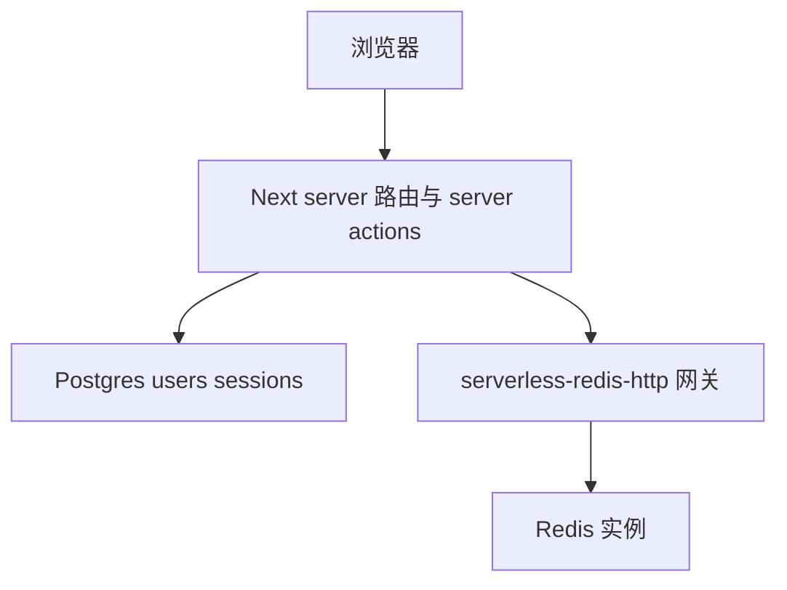

<details>
<summary>相关源文件</summary>

生成本页时使用的主要源文件：

- [apps/web/src/db/schema.ts](../../../project-repos/opencut/apps/web/src/db/schema.ts)
- [apps/web/src/env/web.ts](../../../project-repos/opencut/apps/web/src/env/web.ts)
- [docker-compose.yml](../../../project-repos/opencut/docker-compose.yml)
- [apps/web/package.json](../../../project-repos/opencut/apps/web/package.json)
- [turbo.json](../../../project-repos/opencut/turbo.json)

</details>

# 服务端、认证与数据层

`apps/web` 同时承载编辑器前端与 **服务端数据面**：`drizzle-orm` 描述 Postgres schema，`better-auth` 与 Upstash Redis 相关依赖出现在 `package.json`；`web.ts` 在进程启动时做强校验。

## Drizzle schema 概览

`schema.ts` 定义 `users`、`sessions`、`accounts`、`feedback`、`verifications` 等表，并对多数表调用 `.enableRLS()`。`users` 表含注释「todo: implement fully anonymous sign-in for privacy」，表明认证产品形态仍在演进。字段命名采用 camelCase 列映射到 snake_case 列名（`emailVerified` → `email_verified`）。

## 与 Docker Compose 的对齐

`docker-compose.yml` 中 `web` 服务环境变量写入 `DATABASE_URL=postgresql://opencut:opencut@db:5432/opencut`，与本地默认 db 服务一致；同时注入 `BETTER_AUTH_SECRET`、`UPSTASH_REDIS_REST_URL`（指向 `serverless-redis-http`）与 `UPSTASH_REDIS_REST_TOKEN`。这与 `webEnvSchema` 中要求的键一一对应。



## Turbo 构建期 env 透传

根 `turbo.json` 的 `build` 任务列出 `DATABASE_URL`、`BETTER_AUTH_SECRET`、Upstash 与 Marble、Freesound 等键，确保在 **turbo 缓存与远程构建**场景下环境指纹参与哈希；这与 `apps/web/Dockerfile` 在 builder 阶段显式 `ENV` 桩值的做法互补。

Sources: [apps/web/src/db/schema.ts:1-49](../../../project-repos/opencut/apps/web/src/db/schema.ts#L1-L49), [apps/web/src/env/web.ts:13-26](../../../project-repos/opencut/apps/web/src/env/web.ts#L13-L26), [docker-compose.yml:62-72](../../../project-repos/opencut/docker-compose.yml#L62-L72), [turbo.json:7-18](../../../project-repos/opencut/turbo.json#L7-L18)

<details class="source-snippets">
<summary>引用源码</summary>

<!-- source-snippets:start -->

#### `apps/web/src/db/schema.ts:1-49`

```typescript
import { pgTable, text, timestamp, boolean } from "drizzle-orm/pg-core";

export const users = pgTable("users", {
	id: text("id").primaryKey(),

	// todo: implement fully anonymous sign-in for privacy
	// we don't have any auth flows currently so this is fine for now
	name: text("name").notNull(),
	email: text("email").notNull().unique(),
	emailVerified: boolean("email_verified").default(false).notNull(),
	image: text("image"),
	createdAt: timestamp("created_at")
		.$defaultFn(() => /* @__PURE__ */ new Date())
		.notNull(),
	updatedAt: timestamp("updated_at")
		.$defaultFn(() => /* @__PURE__ */ new Date())
		.notNull(),
}).enableRLS();

export const sessions = pgTable("sessions", {
	id: text("id").primaryKey(),
	expiresAt: timestamp("expires_at").notNull(),
	token: text("token").notNull().unique(),
	createdAt: timestamp("created_at").notNull(),
	updatedAt: timestamp("updated_at").notNull(),
	ipAddress: text("ip_address"),
	userAgent: text("user_agent"),
	userId: text("user_id")
		.notNull()
		.references(() => users.id, { onDelete: "cascade" }),
}).enableRLS();

export const accounts = pgTable("accounts", {
	id: text("id").primaryKey(),
	accountId: text("account_id").notNull(),
	providerId: text("provider_id").notNull(),
	userId: text("user_id")
		.notNull()
		.references(() => users.id, { onDelete: "cascade" }),
	accessToken: text("access_token"),
	refreshToken: text("refresh_token"),
	idToken: text("id_token"),
	accessTokenExpiresAt: timestamp("access_token_expires_at"),
	refreshTokenExpiresAt: timestamp("refresh_token_expires_at"),
	scope: text("scope"),
	password: text("password"),
	createdAt: timestamp("created_at").notNull(),
	updatedAt: timestamp("updated_at").notNull(),
}).enableRLS();
```

#### `apps/web/src/env/web.ts:13-26`

```typescript
	// Server
	DATABASE_URL: z.string().refine(
		(url) =>
			url.startsWith("postgres://") || url.startsWith("postgresql://"),
		"DATABASE_URL must be a postgres:// or postgresql:// URL",
	),

	BETTER_AUTH_SECRET: z.string(),
	UPSTASH_REDIS_REST_URL: z.url(),
	UPSTASH_REDIS_REST_TOKEN: z.string(),
	MARBLE_WORKSPACE_KEY: z.string(),
	FREESOUND_CLIENT_ID: z.string(),
	FREESOUND_API_KEY: z.string(),
});
```

#### `docker-compose.yml:62-72`

```yaml
    environment:
      - NODE_ENV=production
      - DATABASE_URL=postgresql://opencut:opencut@db:5432/opencut
      - BETTER_AUTH_SECRET=your-production-secret-key-here
      - UPSTASH_REDIS_REST_URL=http://serverless-redis-http:80
      - UPSTASH_REDIS_REST_TOKEN=example_token
      - NEXT_PUBLIC_SITE_URL=http://localhost:3100
      - NEXT_PUBLIC_MARBLE_API_URL=https://api.marblecms.com
      - MARBLE_WORKSPACE_KEY=${MARBLE_WORKSPACE_KEY:-placeholder}
      - FREESOUND_CLIENT_ID=${FREESOUND_CLIENT_ID}
      - FREESOUND_API_KEY=${FREESOUND_API_KEY}
```

#### `turbo.json:7-18`

```json
			"env": [
				"NODE_ENV",
				"NEXT_PUBLIC_SITE_URL",
				"NEXT_PUBLIC_MARBLE_API_URL",
				"DATABASE_URL",
				"BETTER_AUTH_SECRET",
				"UPSTASH_REDIS_REST_URL",
				"UPSTASH_REDIS_REST_TOKEN",
				"MARBLE_WORKSPACE_KEY",
				"FREESOUND_CLIENT_ID",
				"FREESOUND_API_KEY"
			]
```

<!-- source-snippets:end -->
</details>

## 相关页面

- [Web 应用（Next.js）](web-nextjs-stack.md)
- [CI、Docker 与发布](ci-docker-deploy.md)
- [本地存储与版本迁移](storage-migrations.md)
