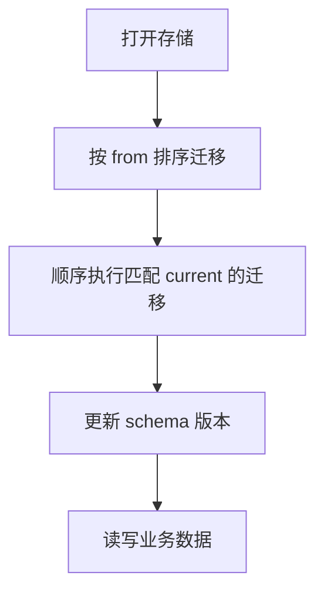

<details>
<summary>相关源文件</summary>

生成本页时使用的主要源文件：

- [apps/web/src/services/storage/service.ts](../../../project-repos/opencut/apps/web/src/services/storage/service.ts)
- [apps/web/src/services/storage/migrations/runner.ts](../../../project-repos/opencut/apps/web/src/services/storage/migrations/runner.ts)
- [apps/web/src/services/storage/use-local-storage.ts](../../../project-repos/opencut/apps/web/src/services/storage/use-local-storage.ts)
- [README.md](../../../project-repos/opencut/README.md)
- [apps/web/src/services/storage/use-storage-persistence.ts](../../../project-repos/opencut/apps/web/src/services/storage/use-storage-persistence.ts)

</details>

# 本地存储与版本迁移

Web 编辑器需要在浏览器内持久化项目、媒体索引与用户偏好；`apps/web/src/services/storage` 目录集中了 **IndexedDB** 访问、版本化迁移与少量 **localStorage** 辅助逻辑。

## 存储服务骨架

`service.ts` 在文件头部从 `./migrations` 引入 `migrations` 与 `runStorageMigrations`，类内部以 `migrationsPromise` 缓存一次性迁移流程，并在打开数据库前 `await` 完成。文件后部（从代码结构看）还包含对 `indexedDB` 可用性的检测分支（例如 `return "indexedDB" in window` 一类守卫），用于在不支持的环境中降级或提示。

## 迁移 runner

`migrations/runner.ts` 将迁移数组按 `from` 版本排序，顺序执行 `from === currentVersion` 的条目；包含对迁移耗时的观测与对话框触发逻辑（从注释可见「首次展示迁移对话框」的时间戳记录）。大量 `v*-to-v*.test.ts` 文件（见仓库盘点）为每个 schema 步进提供回归测试，符合「项目文件版本频繁演进」的编辑器场景。



## localStorage 辅助

`use-local-storage.ts` 对任意 key 做 JSON 序列化读写；`use-storage-persistence.ts` 使用固定 `DISMISSED_KEY` 记录用户是否关闭某提示，属于轻量 UI 状态，与 IndexedDB 中的重数据分离。

Sources: [apps/web/src/services/storage/service.ts:54-91](../../../project-repos/opencut/apps/web/src/services/storage/service.ts#L54-L91), [apps/web/src/services/storage/migrations/runner.ts:24-100](../../../project-repos/opencut/apps/web/src/services/storage/migrations/runner.ts#L24-L100), [apps/web/src/services/storage/use-local-storage.ts:21-38](../../../project-repos/opencut/apps/web/src/services/storage/use-local-storage.ts#L21-L38), [apps/web/src/services/storage/use-storage-persistence.ts:21-41](../../../project-repos/opencut/apps/web/src/services/storage/use-storage-persistence.ts#L21-L41)

<details class="source-snippets">
<summary>引用源码</summary>

<!-- source-snippets:start -->

#### `apps/web/src/services/storage/service.ts:54-91`

```typescript
class StorageService {
	private projectsAdapter: IndexedDBAdapter<SerializedProject>;
	private savedSoundsAdapter: IndexedDBAdapter<SavedSoundsData>;
	private config: StorageConfig;
	private migrationsPromise: Promise<void> | null = null;

	constructor() {
		this.config = {
			projectsDb: "video-editor-projects",
			mediaDb: "video-editor-media",
			savedSoundsDb: "video-editor-saved-sounds",
			version: 1,
		};

		this.projectsAdapter = new IndexedDBAdapter<SerializedProject>({
			dbName: this.config.projectsDb,
			storeName: "projects",
			version: this.config.version,
		});

		this.savedSoundsAdapter = new IndexedDBAdapter<SavedSoundsData>({
			dbName: this.config.savedSoundsDb,
			storeName: "saved-sounds",
			version: this.config.version,
		});
	}

	private async ensureMigrations(): Promise<void> {
		if (this.migrationsPromise) {
			await this.migrationsPromise;
			return;
		}

		this.migrationsPromise = runStorageMigrations({ migrations }).then(
			() => undefined,
		);
		await this.migrationsPromise;
	}
```

#### `apps/web/src/services/storage/migrations/runner.ts:24-100`

```typescript
export async function runStorageMigrations({
	migrations,
	onProgress,
}: {
	migrations: StorageMigration[];
	onProgress?: (progress: MigrationProgress) => void;
}): Promise<StorageMigrationResult> {
	// One-time cleanup: delete the old global version database
	if (!hasCleanedUpMetaDb) {
		try {
			await deleteDatabase({ dbName: "video-editor-meta" });
		} catch {
			// Ignore errors - DB might not exist
		}
		hasCleanedUpMetaDb = true;
	}

	const projectsAdapter = new IndexedDBAdapter<ProjectRecord>(
		"video-editor-projects",
		"projects",
		1,
	);

	const projects = await projectsAdapter.getAll();

	const orderedMigrations = [...migrations].sort((a, b) => a.from - b.from);
	let migratedCount = 0;
	let migrationStartTime: number | null = null;

	for (const project of projects) {
		if (typeof project !== "object" || project === null) {
			continue;
		}

		let projectRecord = project as ProjectRecord;
		const projectId = getProjectId({ project: projectRecord });
		if (!projectId) {
			continue;
		}

		let currentVersion = getProjectVersion({ project: projectRecord });
		const targetVersion = orderedMigrations.at(-1)?.to ?? currentVersion;

		if (currentVersion >= targetVersion) {
			continue;
		}

		// Track when we first showed the migration dialog
		if (migrationStartTime === null) {
			migrationStartTime = Date.now();
		}

		const projectName = getProjectName({ project: projectRecord });
		onProgress?.({
			isMigrating: true,
			fromVersion: currentVersion,
			toVersion: targetVersion,
			projectName,
		});

		for (const migration of orderedMigrations) {
			if (migration.from !== currentVersion) {
				continue;
			}

			const result = await migration.run({
				projectId,
				project: projectRecord,
			});

			if (result.skipped) {
				break;
			}

			await projectsAdapter.set(projectId, result.project);
			migratedCount++;
			currentVersion = migration.to;
```

#### `apps/web/src/services/storage/use-local-storage.ts:21-38`

```typescript
			const storedValue = localStorage.getItem(key);
			if (storedValue !== null) {
				const parsedValue = JSON.parse(storedValue) as T;
				valueRef.current = parsedValue;
				setValue(parsedValue);
			}
		} catch {
			// localstorage might be unavailable
		}
		setIsReady(true);
	}, [key]);

	// sync to localstorage after hydration
	useEffect(() => {
		if (!isReady) return;

		try {
			localStorage.setItem(key, JSON.stringify(value));
```

#### `apps/web/src/services/storage/use-storage-persistence.ts:21-41`

```typescript
			const dismissed = localStorage.getItem(DISMISSED_KEY) === "true";
			if (dismissed) return;

			if (isFirefox()) {
				setShowDialog(true);
			} else {
				await navigator.storage.persist();
			}
		};

		run();
	}, []);

	const onConfirm = async () => {
		setShowDialog(false);
		await navigator.storage.persist();
	};

	const onDismiss = () => {
		setShowDialog(false);
		localStorage.setItem(DISMISSED_KEY, "true");
```

<!-- source-snippets:end -->
</details>
## 相关页面

- [时间线、重定时与更新管线](timeline-update-pipeline.md)
- [Web 应用（Next.js）](web-nextjs-stack.md)
- [服务端、认证与数据层](server-auth-data.md)
