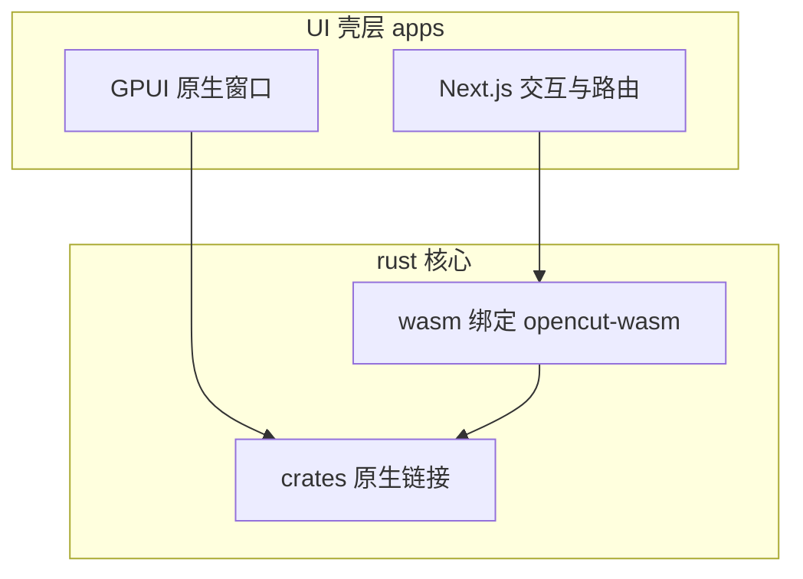

<details>
<summary>相关源文件</summary>

生成本页时使用的主要源文件：

- [AGENTS.md](../../../project-repos/opencut/AGENTS.md)
- [Cargo.toml](../../../project-repos/opencut/Cargo.toml)
- [package.json](../../../project-repos/opencut/package.json)
- [apps/web/src/services/renderer/gpu-renderer.ts](../../../project-repos/opencut/apps/web/src/services/renderer/gpu-renderer.ts)
- [docker-compose.yml](../../../project-repos/opencut/docker-compose.yml)

</details>

# 系统架构

OpenCut 的长期架构目标在 `AGENTS.md` 中写得很直白：**所有业务逻辑迁入 `rust/`**，`apps/*` 只是可替换 UI 壳；同一逻辑不在多个 app 间复制，只有因平台而异的展示与交互会分叉。

## 逻辑与 UI 的边界

文档将 `rust/` 描述为**唯一非 UI 代码源**（禁止组件、Hook 与框架导入），`apps/` 各自选择框架：`web` 用 Next.js，`desktop` 用 GPUI。该约束解释了为何 Web 侧大量「编排型」代码仍位于 TypeScript（例如特效参数 UI、时间线编辑），而数值密集与 GPU 相关路径持续向 **WASM / wgpu** 收敛。



## Web 侧如何「下潜」到 Rust

`apps/web/src/services/renderer/gpu-renderer.ts` 从 `opencut-wasm` 引入 `initializeGpu`、`applyEffectPasses` 与 `applyMaskFeather`，在模块级维护 `gpuAvailable` 与一次性 `initPromise`。对外暴露 `initializeGpuRenderer`、`isGpuAvailable` 以及 `gpuRenderer.applyEffect` / `applyMaskFeather`：当 GPU 不可用或 passes 为空时直接返回源 `OffscreenCanvas`，属于典型的**渐进降级**策略。

## 运行拓扑（本地与容器）

`docker-compose.yml` 将 **Postgres 17**、**Redis 7**、`serverless-redis-http` 与基于 `apps/web/Dockerfile` 构建的 `web` 服务置于同一默认网络，并对 db/redis/web 配置健康检查；`web` 服务将容器内 `3000` 映射到宿主 `3100`，与 README「自托管在 3100」一致。该拓扑支撑 Drizzle 所需的关系库与 Upstash 兼容的 HTTP Redis 网关。

Sources: [AGENTS.md:3-16](../../../project-repos/opencut/AGENTS.md#L3-L16), [apps/web/src/services/renderer/gpu-renderer.ts:1-76](../../../project-repos/opencut/apps/web/src/services/renderer/gpu-renderer.ts#L1-L76), [docker-compose.yml:1-78](../../../project-repos/opencut/docker-compose.yml#L1-L78)

<details class="source-snippets">
<summary>引用源码</summary>

<!-- source-snippets:start -->

#### `AGENTS.md:3-16`

```markdown
## Architecture

An ongoing migration is moving all business logic into `rust/`. Each app under `apps/` is a UI shell — it owns rendering, interaction, and platform-specific concerns, but never owns logic. The UI framework for any given app is a replaceable detail.

### `rust/`

The single source of truth for all non-UI code. Everything platform-agnostic belongs here: no components, no hooks, no framework imports.

### `apps/`

Each app is a frontend that calls into Rust. Logic is never duplicated between apps — only UI is, because each platform may use an entirely different framework and language to build it.

- `web/` — Next.js
- `desktop/` — GPUI
```

#### `apps/web/src/services/renderer/gpu-renderer.ts:1-76`

```typescript
import {
	applyEffectPasses,
	applyMaskFeather as applyMaskFeatherWasm,
	initializeGpu,
} from "opencut-wasm";
import type { EffectPass, EffectUniformValue } from "@/effects/types";

let gpuAvailable = false;
let initPromise: Promise<void> | null = null;

export function initializeGpuRenderer(): Promise<void> {
	if (!initPromise) {
		initPromise = initializeGpu()
			.then(() => {
				gpuAvailable = true;
			})
			.catch((error: unknown) => {
				gpuAvailable = false;
				const message = error instanceof Error ? error.message : String(error);
				console.warn(`GPU renderer unavailable: ${message}`);
			});
	}
	return initPromise;
}

export function isGpuAvailable(): boolean {
	return gpuAvailable;
}

export const gpuRenderer = {
	applyEffect({
		source,
		width,
		height,
		passes,
	}: {
		source: OffscreenCanvas;
		width: number;
		height: number;
		passes: EffectPass[];
	}): OffscreenCanvas {
		if (passes.length === 0 || !gpuAvailable) {
			return source;
		}

		return applyEffectPasses({
			source,
			width,
			height,
			passes: serializeEffectPasses(passes),
		});
	},

	applyMaskFeather({
		maskCanvas,
		width,
		height,
		feather,
	}: {
		maskCanvas: OffscreenCanvas;
		width: number;
		height: number;
		feather: number;
	}): OffscreenCanvas {
		if (!gpuAvailable) {
			return maskCanvas;
		}

		return applyMaskFeatherWasm({
			mask: maskCanvas,
			width,
			height,
			feather,
		});
	},
};
```

#### `docker-compose.yml:1-78`

```yaml
services:
  db:
    image: postgres:17
    restart: unless-stopped
    environment:
      POSTGRES_USER: opencut
      POSTGRES_PASSWORD: opencut
      POSTGRES_DB: opencut
    volumes:
      - postgres_data:/var/lib/postgresql/data
    ports:
      - "5432:5432"
    healthcheck:
      test: ["CMD-SHELL", "pg_isready -U opencut"]
      interval: 30s
      timeout: 10s
      retries: 5
      start_period: 10s

  redis:
    image: redis:7-alpine
    restart: unless-stopped
    ports:
      - "6379:6379"
    healthcheck:
      test: ["CMD", "redis-cli", "ping"]
      interval: 30s
      timeout: 10s
      retries: 5
      start_period: 10s

  serverless-redis-http:
    image: hiett/serverless-redis-http:latest
    ports:
      - "8079:80"
    environment:
      SRH_MODE: env
      SRH_TOKEN: example_token
      SRH_CONNECTION_STRING: "redis://redis:6379"
    depends_on:
      redis:
        condition: service_healthy
    healthcheck:
      test: ["CMD-SHELL", "wget --spider -q http://127.0.0.1:80 || exit 1"]
      interval: 30s
      timeout: 10s
      retries: 5
      start_period: 10s

  web:
    build:
      context: .
      dockerfile: ./apps/web/Dockerfile
      args:
        - FREESOUND_CLIENT_ID=${FREESOUND_CLIENT_ID}
        - FREESOUND_API_KEY=${FREESOUND_API_KEY}
        - NEXT_PUBLIC_MARBLE_API_URL=${NEXT_PUBLIC_MARBLE_API_URL:-https://api.marblecms.com}
        - MARBLE_WORKSPACE_KEY=${MARBLE_WORKSPACE_KEY:-build-placeholder}
    restart: unless-stopped
    ports:
      - "3100:3000"
    environment:
      - NODE_ENV=production
      - DATABASE_URL=postgresql://opencut:opencut@db:5432/opencut
      - BETTER_AUTH_SECRET=your-production-secret-key-here
      - UPSTASH_REDIS_REST_URL=http://serverless-redis-http:80
      - UPSTASH_REDIS_REST_TOKEN=example_token
      - NEXT_PUBLIC_SITE_URL=http://localhost:3100
      - NEXT_PUBLIC_MARBLE_API_URL=https://api.marblecms.com
      - MARBLE_WORKSPACE_KEY=${MARBLE_WORKSPACE_KEY:-placeholder}
      - FREESOUND_CLIENT_ID=${FREESOUND_CLIENT_ID}
      - FREESOUND_API_KEY=${FREESOUND_API_KEY}
    depends_on:
      db:
        condition: service_healthy
      serverless-redis-http:
        condition: service_healthy
    healthcheck:
```

<!-- source-snippets:end -->
</details>
## 相关页面

- [Rust 工作区与 WASM 导出](rust-wasm-bridge.md)
- [Web 应用（Next.js）](web-nextjs-stack.md)
- [GPU 渲染、特效与预览](gpu-effects-preview.md)
