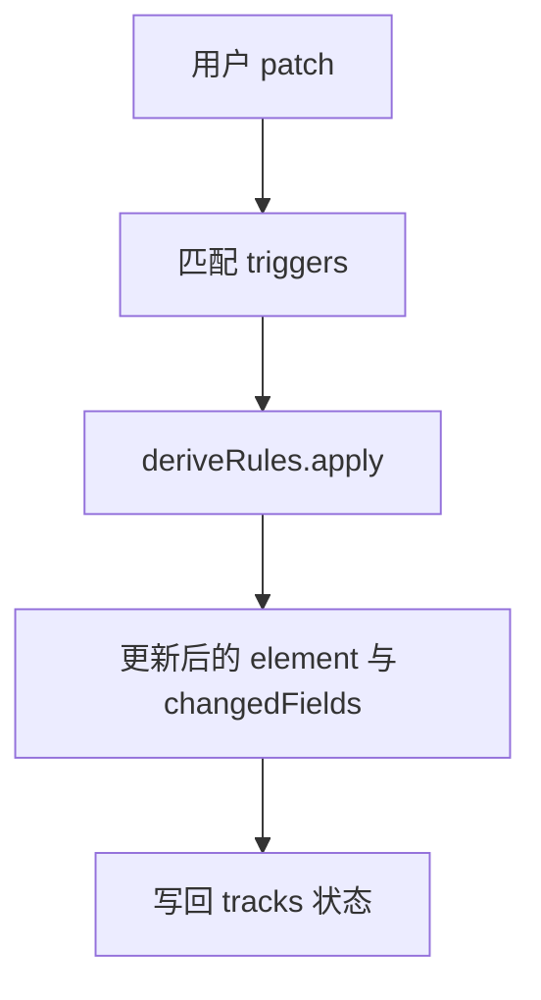

<details>
<summary>相关源文件</summary>

生成本页时使用的主要源文件：

- [apps/web/src/timeline/update-pipeline.ts](../../../project-repos/opencut/apps/web/src/timeline/update-pipeline.ts)
- [docs/keyframes.md](../../../project-repos/opencut/docs/keyframes.md)
- [apps/web/src/timeline/__tests__/update-pipeline.test.ts](../../../project-repos/opencut/apps/web/src/timeline/__tests__/update-pipeline.test.ts)
- [README.md](../../../project-repos/opencut/README.md)
- [docs/effects-renderer.md](../../../project-repos/opencut/docs/effects-renderer.md)

</details>

# 时间线、重定时与更新管线

时间线编辑在 OpenCut 中不仅是 UI 状态，还涉及**元素补丁**经规则链重写后的结构化结果；`update-pipeline.ts` 将「字段级变更」映射为对 `TimelineElement` 的派生更新（例如重定时 `retime` 与裁剪边界联动）。

## 更新规则模型

文件开头定义 `ElementUpdateRule`：`triggers` 为触发字段列表，`apply` 接收 `element`、`originalElement`、`patch` 与 `tracks` 上下文。`deriveRules` 数组首条规则处理 `retime`：在元素可重定时前提下，对 `rate` 调用 `clampRetimeRate`，并结合 `getSourceDuration` 与 `getSourceSpanAtClipTime` 等 helper 推导源时间轴上的跨度。该设计把「单字段编辑」与「跨字段一致性」封装在可组合规则中，便于单元测试覆盖。



## 关键帧子系统（文档索引）

`docs/keyframes.md` 将关键帧拆为四层：**数据模型**（`ElementAnimations` 与 channel 类型）、**property-registry**（可读写字段路径）、**resolve**（在给定本地时间求值）以及 **Renderer**（`src/services/renderer/` 在绘制前解析动画值）。新增可动画属性需要同时改 `ANIMATION_PROPERTY_PATHS` 与 registry 条目。该文档为阅读渲染代码时的「地图」。

## 测试锚点

`update-pipeline.test.ts` 使用 `bun:test` 与 `@/wasm` 的 `mediaTime` / `ZERO_MEDIA_TIME` 构造最小 `VideoElement` 与 `SceneTracks`，直接调用 `applyElementUpdate` 断言变换结果，说明管线逻辑可在不启动浏览器的情况下验证。

Sources: [apps/web/src/timeline/update-pipeline.ts:1-60](../../../project-repos/opencut/apps/web/src/timeline/update-pipeline.ts#L1-L60), [docs/keyframes.md:1-38](../../../project-repos/opencut/docs/keyframes.md#L1-L38), [apps/web/src/timeline/__tests__/update-pipeline.test.ts:1-50](../../../project-repos/opencut/apps/web/src/timeline/__tests__/update-pipeline.test.ts#L1-L50)

<details class="source-snippets">
<summary>引用源码</summary>

<!-- source-snippets:start -->

#### `apps/web/src/timeline/update-pipeline.ts:1-60`

```typescript
import { clampAnimationsToDuration } from "@/animation";
import {
	clampRetimeRate,
	getSourceSpanAtClipTime,
	getTimelineDurationForSourceSpan,
} from "@/retime";
import type { RetimeConfig, SceneTracks, TimelineElement } from "@/timeline";
import { isRetimableElement } from "@/timeline";
import { ZERO_MEDIA_TIME, roundMediaTime } from "@/wasm";

type ElementUpdateField = keyof TimelineElement | string;

export interface ElementUpdateContext {
	tracks: SceneTracks;
	trackId: string;
}

interface ElementUpdateRuleResult {
	element: TimelineElement;
	changedFields?: ElementUpdateField[];
}

interface ElementUpdateRuleParams {
	element: TimelineElement;
	originalElement: TimelineElement;
	patch: Partial<TimelineElement>;
	context: ElementUpdateContext;
}

interface ElementUpdateRule {
	triggers: ElementUpdateField[];
	apply: (params: ElementUpdateRuleParams) => ElementUpdateRuleResult;
}

const deriveRules: ElementUpdateRule[] = [
	{
		triggers: ["retime"],
		apply: ({ element, originalElement, patch }) => {
			if (!("retime" in patch) || !isRetimableElement(element)) {
				return { element };
			}

			const nextRetime = patch.retime
				? {
						...patch.retime,
						rate: clampRetimeRate({ rate: patch.retime.rate }),
					}
				: undefined;

			const sourceDuration = getSourceDuration({
				trimStart: originalElement.trimStart,
				trimEnd: originalElement.trimEnd,
				duration: originalElement.duration,
				sourceDuration: isRetimableElement(originalElement)
					? originalElement.sourceDuration
					: undefined,
				retime: isRetimableElement(originalElement)
					? originalElement.retime
					: undefined,
			});
```

#### `docs/keyframes.md:1-38`

````markdown
# Keyframe System

Keyframes allow element properties to change over time. The system is split into three layers: the **data model** (how keyframes are stored), the **registry** (which properties support keyframes and how to read/write them), and the **UI** (hooks and components that wire it all together).

## How It Works

### Data model

Every `BaseTimelineElement` has an optional `animations?: ElementAnimations` field:

```typescript
interface ElementAnimations {
    channels: Record<string, AnimationChannel | undefined>;
}
```

A channel is a typed bucket of keyframes keyed by property path (e.g. `"opacity"`, `"background.color"`). Three channel types exist: `NumberAnimationChannel`, `ColorAnimationChannel`, and `DiscreteAnimationChannel`.

### Registry

`src/lib/animation/property-registry.ts` defines which property paths are animatable and how to read/write their values on an element. `src/types/animation.ts` holds the canonical list of valid paths in `ANIMATION_PROPERTY_PATHS`.

### Resolver

`src/lib/animation/resolve.ts` provides functions that return the effective value of a property at a given local time — falling back to the element's static value when no keyframes exist.

### Renderer

Nodes in `src/services/renderer/` call the resolve functions before drawing so that animated properties interpolate correctly during export and preview.

### UI

Two hooks in `src/components/editor/panels/properties/hooks/` handle the keyframe-aware field logic:

- `useKeyframedNumberProperty` — for numeric fields (opacity, position, scale, etc.)
- `useKeyframedColorProperty` — for color pickers

Both hooks handle the toggle/add/remove keyframe flow and automatically switch between writing to the static property and writing to the animation channel depending on whether keyframes are active.
````

#### `apps/web/src/timeline/__tests__/update-pipeline.test.ts:1-50`

```typescript
import { describe, expect, test } from "bun:test";
import type { Transform } from "@/rendering";
import type { SceneTracks, VideoElement } from "@/timeline";
import { applyElementUpdate } from "@/timeline/update-pipeline";
import { mediaTime, ZERO_MEDIA_TIME } from "@/wasm";

function buildTransform(): Transform {
	return {
		scaleX: 1,
		scaleY: 1,
		position: { x: 0, y: 0 },
		rotate: 0,
	};
}

function buildVideoElement(overrides: Partial<VideoElement> = {}): VideoElement {
	return {
		id: "video-1",
		type: "video",
		name: "Video 1",
		startTime: ZERO_MEDIA_TIME,
		duration: mediaTime({ ticks: 10 }),
		trimStart: ZERO_MEDIA_TIME,
		trimEnd: ZERO_MEDIA_TIME,
		mediaId: "media-1",
		params: {
			"transform.positionX": 0,
			"transform.positionY": 0,
			"transform.scaleX": 1,
			"transform.scaleY": 1,
			"transform.rotate": 0,
			opacity: 1,
		},
		...overrides,
	};
}

function buildTracks(element: VideoElement): SceneTracks {
	return {
		overlay: [],
		main: {
			id: "main-track",
			type: "video",
			name: "Main",
			muted: false,
			hidden: false,
			elements: [element],
		},
		audio: [],
	};
```

<!-- source-snippets:end -->
</details>
## 相关页面

- [GPU 渲染、特效与预览](gpu-effects-preview.md)
- [本地存储与版本迁移](storage-migrations.md)
- [项目概览](overview.md)
