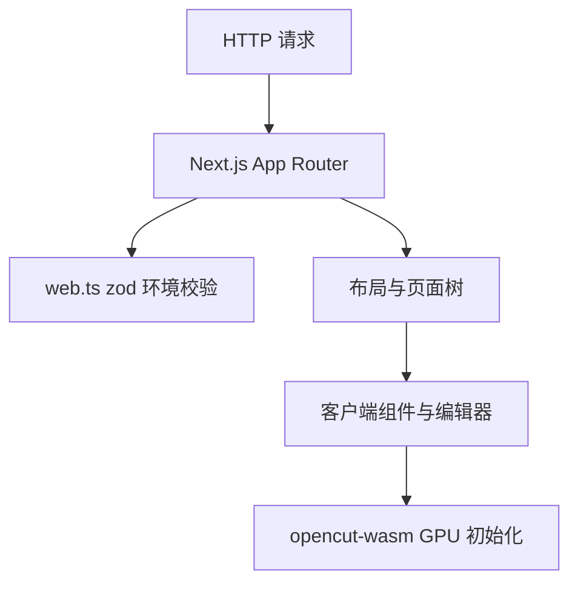

<details>
<summary>相关源文件</summary>

生成本页时使用的主要源文件：

- [apps/web/package.json](../../../project-repos/opencut/apps/web/package.json)
- [apps/web/src/env/web.ts](../../../project-repos/opencut/apps/web/src/env/web.ts)
- [apps/web/src/app/layout.tsx](../../../project-repos/opencut/apps/web/src/app/layout.tsx)
- [apps/web/next.config.ts](../../../project-repos/opencut/apps/web/next.config.ts)
- [apps/web/open-next.config.ts](../../../project-repos/opencut/apps/web/open-next.config.ts)

</details>

# Web 应用（Next.js）

`apps/web` 是 OpenCut 的主工程：Next **16.1.x**、React 19、Tailwind 4，并通过 **OpenNext Cloudflare** 扩展部署路径；同一包内集成 **Drizzle**、**better-auth** 与 **Upstash Redis** 相关依赖。

## 脚本与构建产物

`package.json` 中 `dev` 使用 `next dev --turbopack`；`build` 为标准 `next build`；`preview` 与 `deploy` 均先执行 `opennextjs-cloudflare build` 再调用对应子命令。数据库相关脚本使用 `drizzle-kit` 的 `generate` / `migrate` / `push`，并通过 `cross-env` 区分 `NODE_ENV`。

## 环境变量契约

`src/env/web.ts` 使用 **zod** 在启动期解析 `process.env`：强制校验 `DATABASE_URL` 以 `postgres://` 或 `postgresql://` 开头、`BETTER_AUTH_SECRET` 非空字符串、Upstash 的 URL 与 token、以及 `NEXT_PUBLIC_MARBLE_API_URL` 等站点与 CMS 相关变量。`NEXT_PUBLIC_SITE_URL` 默认为 `http://localhost:3000`。这解释了为何 Docker 构建阶段需要为 zod 提供「桩」环境变量（见 Dockerfile 页）。

## 根布局与观测脚本

`src/app/layout.tsx` 组合 `ThemeProvider`（`next-themes`）、`TooltipProvider`、`Toaster`，并在 `development` 下注入 `react-scan`；生产路径包含 **BotId** 客户端与 **Databuddy** 分析脚本（开发环境通过 `webEnv.NODE_ENV` 禁用部分追踪）。`metadata` 由 `baseMetaData` 导出。`next.config.ts` 启用 `reactStrictMode`、`productionBrowserSourceMaps` 与 `output: "standalone"`，与多阶段 Docker 镜像中复制 `.next/standalone` 的做法一致。



Sources: [apps/web/package.json:6-19](../../../project-repos/opencut/apps/web/package.json#L6-L19), [apps/web/src/env/web.ts:1-30](../../../project-repos/opencut/apps/web/src/env/web.ts#L1-L30), [apps/web/src/app/layout.tsx:14-66](../../../project-repos/opencut/apps/web/src/app/layout.tsx#L14-L66), [apps/web/next.config.ts:5-12](../../../project-repos/opencut/apps/web/next.config.ts#L5-L12)

<details class="source-snippets">
<summary>引用源码</summary>

<!-- source-snippets:start -->

#### `apps/web/package.json:6-19`

```json
  "scripts": {
    "dev": "next dev --turbopack",
    "build": "next build",
    "start": "next start",
    "preview": "opennextjs-cloudflare build && opennextjs-cloudflare preview",
    "deploy": "opennextjs-cloudflare build && opennextjs-cloudflare deploy",
    "lint": "eslint src --ext .ts,.tsx",
    "lint:fix": "eslint src --ext .ts,.tsx --fix",
    "format": "prettier src --write",
    "db:generate": "drizzle-kit generate",
    "db:migrate": "drizzle-kit migrate",
    "db:push:local": "cross-env NODE_ENV=development drizzle-kit push",
    "db:push:prod": "cross-env NODE_ENV=production drizzle-kit push"
  },
```

#### `apps/web/src/env/web.ts:1-30`

```typescript
import { z } from "zod";

const webEnvSchema = z.object({
	// Node
	NODE_ENV: z.enum(["development", "production", "test"]),
	ANALYZE: z.string().optional(),
	NEXT_RUNTIME: z.enum(["nodejs", "edge"]).optional(),

	// Public
	NEXT_PUBLIC_SITE_URL: z.url().default("http://localhost:3000"),
	NEXT_PUBLIC_MARBLE_API_URL: z.url(),

	// Server
	DATABASE_URL: z.string().refine(
		(url) =>
			url.startsWith("postgres://") || url.startsWith("postgresql://"),
		"DATABASE_URL must be a postgres:// or postgresql:// URL",
	),

	BETTER_AUTH_SECRET: z.string(),
	UPSTASH_REDIS_REST_URL: z.url(),
	UPSTASH_REDIS_REST_TOKEN: z.string(),
	MARBLE_WORKSPACE_KEY: z.string(),
	FREESOUND_CLIENT_ID: z.string(),
	FREESOUND_API_KEY: z.string(),
});

export type WebEnv = z.infer<typeof webEnvSchema>;

export const webEnv = webEnvSchema.parse(process.env);
```

#### `apps/web/src/app/layout.tsx:14-66`

```tsx
export const metadata = baseMetaData;

const protectedRoutes = [
	{
		path: "/none",
		method: "GET",
	},
];

export default function RootLayout({
	children,
}: Readonly<{
	children: React.ReactNode;
}>) {
	return (
		<html lang="en" suppressHydrationWarning>
			<head>
				<BotIdClient protect={protectedRoutes} />
				{process.env.NODE_ENV === "development" && (
					<>
						<Script
							src="//unpkg.com/react-scan/dist/auto.global.js"
							crossOrigin="anonymous"
							strategy="beforeInteractive"
						/>
					</>
				)}
			</head>
			<body className={`${siteFont.className} font-sans antialiased`}>
				<ThemeProvider
					attribute="class"
					defaultTheme="system"
					disableTransitionOnChange={true}
				>
					<TooltipProvider>
						<Toaster />
						<Script
							src="https://cdn.databuddy.cc/databuddy.js"
							strategy="afterInteractive"
							async
							data-client-id="UP-Wcoy5arxFeK7oyjMMZ"
							data-disabled={webEnv.NODE_ENV === "development"}
							data-track-attributes={false}
							data-track-errors={true}
							data-track-outgoing-links={false}
							data-track-web-vitals={false}
							data-track-sessions={false}
						/>
						{children}
					</TooltipProvider>
				</ThemeProvider>
			</body>
		</html>
```

#### `apps/web/next.config.ts:5-12`

```typescript
const nextConfig: NextConfig = {
	compiler: {
		removeConsole: process.env.NODE_ENV === "production",
	},
	reactStrictMode: true,
	productionBrowserSourceMaps: true,
	output: "standalone",
	images: {
```

<!-- source-snippets:end -->
</details>
## 相关页面

- [GPU 渲染、特效与预览](gpu-effects-preview.md)
- [服务端、认证与数据层](server-auth-data.md)
- [CI、Docker 与发布](ci-docker-deploy.md)
