# OpenHuman DeepWiki

Commit: `225b1dabf611a0972d69ff73553780cf0753da13`

---


## 概览


<details>
<summary>相关源文件</summary>

生成本页时使用的主要源文件：

- [README.md](../../project-repos/openhuman/README.md)
- [Cargo.toml](../../project-repos/openhuman/Cargo.toml)
- [package.json](../../project-repos/openhuman/package.json)

</details>

# 项目概览

大多数 AI 助手在第一次对话时是"冷启动"的：它不知道你的邮件、代码仓库、Slack 频道或昨天的会议记录。OpenHuman 的赌注是——**在几分钟内通过自动同步与本地记忆树，让 Agent 拥有与你工作栈一致的上下文**，而不是等你手工喂插件。

项目定位是 **Personal AI super intelligence**：本地优先的 Memory Tree + Obsidian 风格 Markdown vault，配合托管服务完成账号登录、模型路由、Web 搜索代理与 Composio 集成 OAuth。桌面端用 **React + Tauri v2** 呈现 UI-first 体验，**Rust 核心**承载全部业务逻辑。

**与同类方案的差异**：
- 对比 Hermes / OpenClaw：OpenHuman 强调 **20 分钟 auto-fetch** 周期拉取已连接集成，无需用户反复 prompt。
- 对比纯 Chat 客户端：内置 **TokenJuice** 在工具输出进入 LLM 前做规则化压缩，官方宣称可降 token 成本与延迟。
- 对比插件型 Agent：118+ Composio 集成 + 原生 coder 工具集 + MCP + 语音/Meet Agent 开箱即用。

**规模快照**（commit `225b1da`）：约 4038 个 tracked 文件；Rust 1821、TS 713、TSX 621；单 crate `openhuman` 下 100+ 领域模块；pnpm monorepo + Tauri 多平台壳层。

## 核心能力矩阵

| 能力域 | 关键模块 | 用户可见价值 |
|--------|----------|--------------|
| 记忆 | `memory_tree`, `memory_store` | 本地 SQLite + wiki `.md`，≤3k token 分块 |
| Agent | `agent`, `agent_orchestration` | 多 Agent 编排、工具策略、审批 |
| 推理 | `inference`, `routing` | 云端路由 + Ollama 本地可选 |
| 集成 | `composio`, `integrations` | OAuth 一键连接 Gmail/Notion/GitHub 等 |
| 通道 | `channels` | Telegram/Discord/WhatsApp 等双向消息 |
| 后台 | `subconscious` | 无用户输入时的持续思考与 escalation |
| 压缩 | `tokenjuice` | git/npm/cargo 等工具输出规则化瘦身 |

## 新手阅读路线

1. [系统架构](system-architecture.md) — 三层分工与数据流总览  
2. [Memory Tree 流水线](memory-tree-pipeline.md) — 理解"为什么 Agent 记得住你"  
3. [Agent 编排](agent-orchestration.md) + [工具与 MCP](tools-mcp.md) — 对话如何驱动行动  
4. [安全与隐私](security-privacy.md) — 本地/云端边界  
5. [质量与重构](quality-risks-refactor.md) — 二次开发前必读风险面

## 相关页面

- [系统架构](system-architecture.md)
- [Memory Tree 流水线](memory-tree-pipeline.md)
- [安全与隐私边界](security-privacy.md)

Sources: [README.md:1-80](../../../project-repos/openhuman/README.md#L1-L80)

<details class="source-snippets">
<summary>引用源码</summary>

<!-- source-snippets:start -->

#### `README.md:1-80`

````markdown
<h1 align="center">OpenHuman</h1>

<p align="center">
 
</p>

<p align="center" style="display: inline-block">
	<a href="https://trendshift.io/repositories/23680" target="_blank" style="display: inline-block">
		
	</a>
	<a href="https://www.producthunt.com/products/openhuman?embed=true&amp;utm_source=badge-top-post-badge&amp;utm_medium=badge&amp;utm_campaign=badge-openhuman" target="_blank" rel="noopener noreferrer">
		
		</a>
		<a href="https://www.producthunt.com/products/openhuman?embed=true&amp;utm_source=badge-top-post-badge&amp;utm_medium=badge&amp;utm_campaign=badge-openhuman" target="_blank" rel="noopener noreferrer">
			
		</a>
</p>
<p align="center" style="display: inline-block">
 <a href="https://www.producthunt.com/products/openhuman?embed=true&amp;utm_source=badge-top-post-topic-badge&amp;utm_medium=badge&amp;utm_campaign=badge-openhuman" target="_blank" rel="noopener noreferrer">
  
  </a>
  <a href="https://www.producthunt.com/products/openhuman?embed=true&amp;utm_source=badge-top-post-topic-badge&amp;utm_medium=badge&amp;utm_campaign=badge-openhuman" target="_blank" rel="noopener noreferrer">
   
   </a>
 </p>


<p align="center">
 <strong>OpenHuman is your Personal AI super intelligence: local memory, managed services where needed, simple and powerful.</strong>
</p>


<p align="center">
 <a href="https://discord.tinyhumans.ai/">Discord</a> •
 <a href="https://www.reddit.com/r/tinyhumansai/">Reddit</a> •
 <a href="https://x.com/intent/follow?screen_name=tinyhumansai">X/Twitter</a> •
 <a href="https://tinyhumans.gitbook.io/openhuman/">Docs</a> •
 <a href="https://x.com/intent/follow?screen_name=senamakel">Follow @senamakel (Creator)</a>
</p>

<p align="center">
  🇺🇸 <a href="./README.md">English</a> | 🇨🇳 <a href="./README.zh-CN.md">简体中文</a> | 🇯🇵 <a href="./README.ja-JP.md">日本語</a> | 🇰🇷 <a href="./README.ko.md">한국어</a> | 🇩🇪 <a href="./README.de.md">Deutsch</a>
</p>


<p align="center">
 
 <a href="https://github.com/tinyhumansai/openhuman/releases/latest"></a>
 <a href="https://github.com/tinyhumansai/openhuman/stargazers"></a>
 <a href="./LICENSE"></a>
 <a href="./README.zh-CN.md"></a>
 <a href="./README.ja-JP.md"></a>
 <a href="./README.ko.md"></a>
 <a href="./README.de.md"></a>
</p>

> **Early Beta**: Under active development. Expect rough edges.

> **Local + managed services, upfront:** OpenHuman stores its Memory Tree, Obsidian-style Markdown vault, workspace config, and local runtime state on your machine. The default managed experience still uses OpenHuman-hosted services for account sign-in, model routing, web search proxying, and managed integration/OAuth flows through the Composio connector layer. Choose custom/local settings if you want to bring your own model, search, or Composio credentials; some real-time triggers and hosted features still require the managed backend.

# Install

Download installers from [tinyhumans.ai/openhuman](https://tinyhumans.ai/openhuman?utm_source=github&utm_medium=readme) or from the [GitHub Releases](https://github.com/tinyhumansai/openhuman/releases/latest) page. For terminal installs, the native package paths below are preferred — they ride your OS package-manager's signing chain.

## Recommended install (native packages)

These paths verify the artifact through your OS package manager's signing chain (Homebrew bottle hash, signed apt repo, MSI signature).

**macOS (Homebrew tap):**

```bash
brew tap tinyhumansai/core
brew install openhuman
```

**Linux (Debian/Ubuntu — signed apt repo):**

```bash
sudo apt-get install -y --no-install-recommends gnupg2 curl ca-certificates
curl -fsSL https://tinyhumansai.github.io/openhuman/apt/KEY.gpg \
````

<!-- source-snippets:end -->
</details>


---


## 架构


<details>
<summary>相关源文件</summary>

生成本页时使用的主要源文件：

- [gitbooks/developing/architecture/README.zh-CN.md](../../project-repos/openhuman/gitbooks/developing/architecture/README.zh-CN.md)
- [src/lib.rs](../../project-repos/openhuman/src/lib.rs)
- [docs/SECURITY_AUDIT.md](../../project-repos/openhuman/docs/SECURITY_AUDIT.md)

</details>

# 系统架构

OpenHuman 采用 **Presentation → Shell → Core** 三层架构，业务权威集中在 Rust `openhuman` crate，前端与 Tauri 只做交付与 IPC。

**关键设计决策**：核心不再以独立 sidecar 二进制为主路径——在桌面形态下，tokio 任务嵌入 Tauri 进程（见 `docs/SECURITY_AUDIT.md`），JSON-RPC 与 Socket.IO 双通道供 UI 流式交互。

## 分层架构图

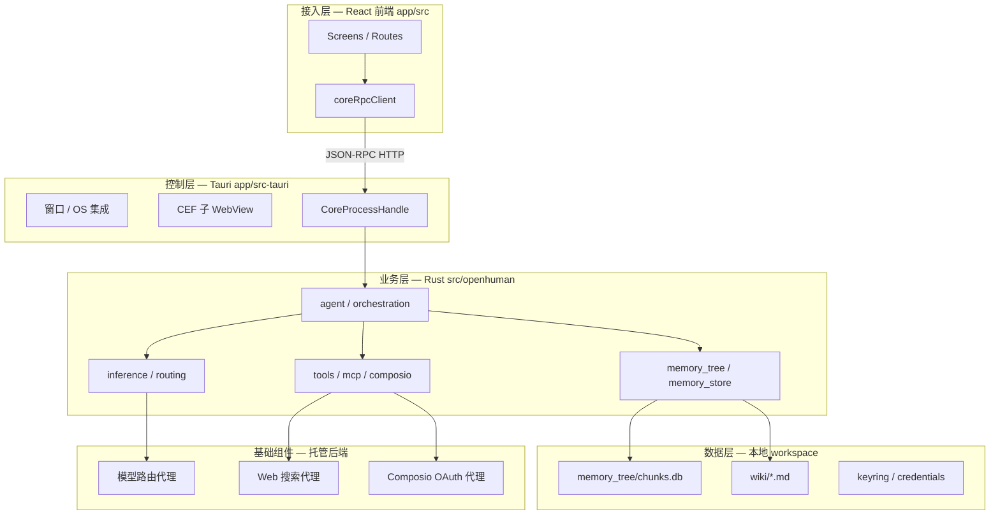

上图把 **UI 无业务逻辑** 的约束可视化：`app/src` 通过 `coreRpcClient` 调用方法名如 `openhuman.*`、`inference.*`，不在前端复刻 Memory Tree 或工具执行。

## 架构模式判定

| 维度 | 判定 | 依据 |
|------|------|------|
| 整体 | 桌面单体 + 领域模块化 | 单 crate 100+ `pub mod`，非微服务 |
| UI | SPA + 路由 | React Router，Provider 注入 |
| 通信 | JSON-RPC 2.0 + Socket.IO | `src/core/jsonrpc.rs`, `socket` |
| 数据 | 本地 SQLite 多库 + 文件 vault | `chunks.db`, unified memory store |
| 扩展 | 工具注册表 + MCP + Skills 元数据 | `tool_registry`, `mcp_registry` |

## 模块职责边界

**Rust 核心**（`src/openhuman/mod.rs`）按领域拆分：配置/凭证、Agent 运行时、记忆子系统、通道、推理、安全沙箱（`cwd_jail`）、语音/Meet 等。`src/core/` 提供 CLI、JSON-RPC 分发、事件总线。

**Tauri 壳层**负责 sidecar/embedded core 生命周期、CEF 集成账号 WebView、系统托盘与更新。

**React 前端**（`app/src/`）组织 screens、channels 配置 UI、Memory Tree 浏览；`utils/tauriCommands/*` 按域封装 RPC。

## 优缺点与选型合理性

**优势**：本地记忆与 vault 降低隐私顾虑；Rust 统一工具/记忆/推理减少跨语言一致性 bug；TokenJuice 与 auto-fetch 针对 token 成本与冷启动两大痛点。

**局限**：默认依赖托管后端（模型/搜索/Composio），完全离线需自备密钥与基础设施；GPLv3 许可证影响商业闭源衍生；Early Beta 下 API 与 schema 仍在快速演进。

## 服务依赖调用图

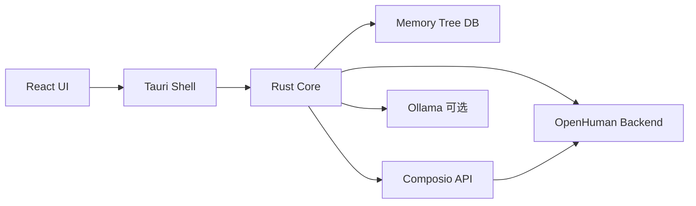

边只连具体节点：Composio 默认经托管代理，direct mode 可直连 Composio API key。

## 相关页面

- [Tauri 桌面壳层](tauri-shell.md)
- [Rust 核心运行时](rust-core-runtime.md)
- [JSON-RPC 通信桥](json-rpc-bridge.md)
- [Memory Tree 流水线](memory-tree-pipeline.md)

Sources: [gitbooks/developing/architecture/README.zh-CN.md:1-80](../../../project-repos/openhuman/gitbooks/developing/architecture/README.zh-CN.md#L1-L80)

<details class="source-snippets">
<summary>引用源码</summary>

<!-- source-snippets:start -->

#### `gitbooks/developing/architecture/README.zh-CN.md:1-80`

````markdown
---
description: >-
  OpenHuman 系统的高层轮廓（桌面壳层、Rust 核心、Memory Tree、Agent 循环）。指向仓库中的深度开发者架构文档。
icon: code-branch
lang: zh-CN
---

# 架构

OpenHuman 基于 GNU GPL3 开源。本页是系统的高层轮廓；深度开发者架构参考位于仓库中的 [深度架构文档](../architecture.zh-CN.md)。

## 系统形态

OpenHuman 是一款 **React + Tauri v2 桌面应用**，搭配一个承担重活的 **Rust 核心**。

```text
┌──────────────────────────────────────────────────┐
│ Tauri 壳层 (app/src-tauri/)                      │
│ • 窗口管理、OS 集成、sidecar 生命周期            │
│ • 用于集成提供商的 CEF 子 WebView                │
└──────────────────────────────────────────────────┘
 │ JSON-RPC (HTTP) ↕
┌──────────────────────────────────────────────────┐
│ Rust 核心 (openhuman 二进制, src/)               │
│ • Memory Tree 流水线                             │
│ • 集成适配器 + 自动获取调度器                    │
│ • 提供商路由器（模型路由）                       │
│ • TokenJuice 压缩                              │
│ • 原生工具（搜索、获取、文件系统、git…）         │
│ • 语音（STT 输入、TTS 输出、Meet Agent）         │
└──────────────────────────────────────────────────┘
 │
┌──────────────────────────────────────────────────┐
│ React 前端 (app/src/)                            │
│ • 页面、导航                                     │
│ • 通过 coreRpcClient 与核心通信                  │
│ • 无业务逻辑 —— 仅负责展示                       │
└──────────────────────────────────────────────────┘
```

**逻辑归属：**

* **Rust 核心**。所有业务逻辑。Memory Tree、集成、模型路由、工具、语音。具有权威性。
* **Tauri 壳层**。窗口管理、进程生命周期、IPC。是交付载体，不是功能的栖身之所。
* **React 前端**。UI 与编排。通过 JSON-RPC 调用核心。

## 数据流

1. **连接**。通过 OAuth 接入[集成](../../features/integrations/README.zh-CN.md)。后端保存 token；核心永远不会以明文形式看到它。
2. **自动获取**。每二十分钟，[调度器](../../features/obsidian-wiki/auto-fetch.zh-CN.md)会遍历每个活跃连接，并要求每个原生提供商进行同步。
3. **规范化**。提供商输出（邮件页面、GitHub diff、Slack 频道转储）被归一化为带来源标签的 Markdown。
4. **分块**。Markdown 被拆分为 ≤3k token 的确定性块。
5. **存储**。块存入 SQLite (`<workspace>/memory_tree/chunks.db`)，并以 `.md` 文件形式存入 `<workspace>/wiki/`。
6. **评分**。后台工作线程运行嵌入、实体提取、热度评分。
7. **摘要**。从块池中构建并刷新来源 / 主题 / 全局摘要树。
8. **检索**。当你提问时，Agent 查询 Memory Tree（搜索 / 钻取 / 主题 / 全局 / 获取）。
9. **压缩**。工具输出和大型源数据在进入 LLM 上下文前经过 [TokenJuice](../../features/token-compression.zh-CN.md) 处理。
10. **路由**。[路由器](../../features/model-routing/) 根据任务提示选择合适的提供商 + 模型。

## 隐私边界

留在你机器上的数据：

* Memory Tree SQLite 数据库。
* Obsidian Markdown 仓库。
* 音频捕获缓冲区和任何本地模型状态。

经过 OpenHuman 后端的数据（在一个订阅下）：

* LLM 调用（模型提供商）。
* 网页搜索智能体。
* 集成 OAuth 和工具智能体。
* TTS 流。

完整图景请参阅 [隐私与安全](../../features/privacy-and-security.zh-CN.md)。

## 开源

* **仓库：** [github.com/tinyhumansai/openhuman](https://github.com/tinyhumansai/openhuman)。GNU GPL3。
* 欢迎提交 **Issue 和 PR**。项目处于早期测试阶段。
````

<!-- source-snippets:end -->
</details>


---

<details>
<summary>相关源文件</summary>

生成本页时使用的主要源文件：

- [app/src-tauri/Cargo.toml](../../project-repos/openhuman/app/src-tauri/Cargo.toml)
- [gitbooks/developing/architecture/README.md](../../project-repos/openhuman/gitbooks/developing/architecture/README.md)

</details>

# Tauri 桌面壳层

Tauri v2 是 OpenHuman 的 **OS 集成层**：窗口、托盘、自动更新、CEF 子 WebView，以及 Rust core 的启动/健康检查。

桌面构建位于 `app/src-tauri/`（另有 `src-tauri-mobile` 面向 iOS/Android）。根 `Cargo.toml` 定义 `openhuman-core` 二进制；Tauri 通过 `CoreProcessHandle` 在同一进程或受控生命周期内托管 core HTTP 服务。

## 壳层职责

| 职责 | 典型位置 | 说明 |
|------|----------|------|
| 窗口与路由 | Tauri + React | 前端路由，非业务 |
| Core 令牌 | `invoke('core_rpc_token')` | 桌面 bearer 内存持有，不写 env |
| CEF WebView | 集成 OAuth | Gmail 等需浏览器登录态 |
| Sidecar 生命周期 | core 启停 | 与 UI boot gate 联动 |
| 打包发布 | `.github/workflows/build*.yml` | dmg/deb/msi/AppImage |

**Insight**：安全审计文档指出桌面 bearer 在 `CoreProcessHandle::new()` 生成，经 `run_server_embedded_with_ready` 注入嵌入式 server——与 CLI/Docker 读 `OPENHUMAN_CORE_TOKEN` 或 `core.token` 文件的路径刻意分离，减少 token 泄露到子进程环境。

## 与核心的边界

壳层 **不应** 实现 Memory Tree 逻辑或工具执行。任何"在 Tauri command 里直接调 SQLite"的反模式都应视为架构违规——UI 一律走 JSON-RPC 方法命名空间。

## 相关页面

- [系统架构](system-architecture.md)
- [JSON-RPC 通信桥](json-rpc-bridge.md)
- [React 前端](react-frontend.md)

Sources: [app/src-tauri/Cargo.toml:1-80](../../../project-repos/openhuman/app/src-tauri/Cargo.toml#L1-L80)

<details class="source-snippets">
<summary>引用源码</summary>

<!-- source-snippets:start -->

#### `app/src-tauri/Cargo.toml:1-80`

```toml
[package]
name = "OpenHuman"
version = "0.57.3"
description = "OpenHuman - AI-powered Super Assistant"
authors = ["OpenHuman"]
edition = "2021"
default-run = "OpenHuman"
autobins = false

# See more keys and their definitions at https://doc.rust-lang.org/cargo/reference/manifest.html

[lib]
# The `_lib` suffix may seem redundant but it is necessary
# to make the lib name unique and wouldn't conflict with the bin name.
# This seems to be only an issue on Windows, see https://github.com/rust-lang/cargo/issues/8519
name = "openhuman"
crate-type = ["staticlib", "cdylib", "rlib"]

[[bin]]
name = "OpenHuman"
path = "src/main.rs"

[build-dependencies]
tauri-build = { version = "2", features = [] }
serde_json = "1"

[dependencies]
# Tauri core and plugins.
#
# The only supported runtime is CEF (Chromium Embedded Framework) via
# `tauri-runtime-cef` — CI builds, release installers, and local `cargo tauri
# dev` all run against CEF. The `[patch.crates-io]` block at the bottom of this
# file pins every tauri crate and plugin to the `feat/cef` branch on github so
# CEF symbols are in scope, and `cef-dll-sys`'s build script auto-downloads the
# Chromium runtime for the current target on first build.
tauri = { version = "2.10", default-features = false, features = [
    "cef",
    "common-controls-v6",
    "devtools",
    "macos-private-api",
    "tray-icon",
    "unstable",
    "webview-data-url",
] }
tauri-plugin-deep-link = "2.0.0"
tauri-plugin-global-shortcut = "2"
tauri-plugin-notification = { path = "vendor/tauri-plugin-notification" }
tauri-plugin-opener = "2"
# Prevents a second launch from racing into CEF init and hitting the
# `cef::initialize(...) != 1` cache-lock panic seen in production
# (Sentry OPENHUMAN-TAURI-A). The plugin acquires a per-identifier
# lock before any tauri::Builder work happens, so the secondary
# process exits cleanly after handing its argv to the primary. The `deep-link`
# feature forwards second-launch deep-link payloads to the primary instance on
# Windows/Linux, which is required for hot-instance OAuth callbacks.
tauri-plugin-single-instance = { version = "2", features = ["deep-link"] }
# Auto-update for the Tauri shell itself. The core sidecar already has its own
# updater (see `core_update.rs`); this plugin handles the .app/.exe/.AppImage
# bundle. Both are needed because shipping a new RPC method requires both
# pieces in lockstep, and on macOS the .app bundle is what carries TCC grants.
tauri-plugin-updater = "2"
serde = { version = "1", features = ["derive"] }
serde_json = "1"
toml = "0.8"
directories = "5"
# Used by gmail/cdp_fetch for decoding binary IO.read chunks. Base64 is
# only emitted by CDP IO.read when the stream contains non-UTF-8 bytes,
# but we opt into the feature to stay robust against unexpected responses.
base64 = "0.22"
tokio = { version = "1", features = ["rt-multi-thread", "process", "sync", "time", "net"] }
tokio-util = { version = "0.7", features = ["rt"] }
# WebSocket client + server for two uses:
# - Client: Chrome DevTools Protocol connections to the embedded CEF
#   instance over `--remote-debugging-port=9222` (IndexedDB reads,
#   `Runtime.evaluate` for the WhatsApp recipe, DOMSnapshot / Network
#   calls for the Gmail connector).
# - Server: the `webview_apis` bridge at 127.0.0.1 that accepts
#   JSON-RPC frames from the core sidecar so core-side handlers can
#   reach the live-webview connectors via CDP.
tokio-tungstenite = { version = "0.24", default-features = false, features = ["connect", "handshake"] }
```

<!-- source-snippets:end -->
</details>


---

<details>
<summary>相关源文件</summary>

生成本页时使用的主要源文件：

- [app/package.json](../../project-repos/openhuman/app/package.json)
- [app/src/services/coreRpcClient.ts](../../project-repos/openhuman/app/src/services/coreRpcClient.ts)

</details>

# React 前端

前端是 **纯展示 + RPC 编排层**：Arco/React 组件、路由、国际化与 E2E 测试覆盖，但不复制 Rust 域逻辑。

## 技术栈

- React + TypeScript + Vite（经 `openhuman-app` 包）
- `@tauri-apps/api` 2.x 调用 native command
- `coreRpcClient.ts` 统一 JSON-RPC 2.0 请求

## coreRpcClient 行为

`callCoreRpc(method, params)` 解析流程：

1. 解析 core URL（`CORE_RPC_URL` / 持久化配置）
2. 桌面模式经 Tauri relay 或直连 HTTP
3. 附带 bearer token（`getStoredCoreToken`）
4. 超时默认 30s，慢 RPC 可 per-call override（如 `app_state_snapshot`）

iOS/remote profile 可通过 `setActiveCoreTransport` 切换 `CoreTransport`，同一 API 面多端复用。

## 目录要点

| 路径 | 作用 |
|------|------|
| `app/src/screens/` | 主功能页面 |
| `app/src/components/channels/` | 通道配置 UI |
| `app/src/utils/tauriCommands/` | 按域封装 RPC |
| `app/src/chat/` | 对话与 prompt injection guard |

**Insight**：`normalizeRpcMethod` 与后端 controller 注册表对齐——前端方法字符串是稳定契约，重构 Rust 内部模块不应改 method 名。

## 相关页面

- [JSON-RPC 通信桥](json-rpc-bridge.md)
- [Tauri 桌面壳层](tauri-shell.md)
- [消息通道](channels-messaging.md)

Sources: [app/package.json:1-80](../../../project-repos/openhuman/app/package.json#L1-L80)

<details class="source-snippets">
<summary>引用源码</summary>

<!-- source-snippets:start -->

#### `app/package.json:1-80`

```json
{
  "name": "openhuman-app",
  "version": "0.57.3",
  "type": "module",
  "engines": {
    "node": ">=24.0.0"
  },
  "scripts": {
    "dev": "vite",
    "dev:web": "vite",
    "dev:app": "pnpm tauri:ensure && export CEF_PATH=\"$HOME/Library/Caches/tauri-cef\" && bash ../scripts/setup-chromium-safe-storage.sh && source ../scripts/load-dotenv.sh && APPLE_SIGNING_IDENTITY='OpenHuman Dev Signer' cargo tauri dev",
    "dev:app:win": "\"C:/Program Files/Git/bin/bash.exe\" ../scripts/run-dev-win.sh",
    "dev:cef": "pnpm dev:app",
    "dev:wry": "pnpm tauri:ensure && export CEF_PATH=\"$HOME/Library/Caches/tauri-cef\" && source ../scripts/load-dotenv.sh && cargo tauri dev --no-default-features --features wry",
    "core:stage": "echo '[core:stage] no-op — core is linked in-process; sidecar removed (PR #1061)'",
    "tauri:ensure": "bash ../scripts/ensure-tauri-cli.sh",
    "tauri:ios:init": "bash ../scripts/ios-init.sh",
    "tauri:ios:dev": "cd src-tauri-mobile && IPHONEOS_DEPLOYMENT_TARGET=${IPHONEOS_DEPLOYMENT_TARGET:-16.0} npx --package=@tauri-apps/cli@^2 tauri ios dev",
    "tauri:ios:build": "cd src-tauri-mobile && IPHONEOS_DEPLOYMENT_TARGET=${IPHONEOS_DEPLOYMENT_TARGET:-16.0} npx --package=@tauri-apps/cli@^2 tauri ios build",
    "tauri:android:init": "bash ../scripts/android-init.sh",
    "tauri:android:dev": "cd src-tauri-mobile && npx --package=@tauri-apps/cli@^2 tauri android dev",
    "tauri:android:build": "cd src-tauri-mobile && npx --package=@tauri-apps/cli@^2 tauri android build",
    "build": "tsc && vite build",
    "build:app": "tsc && vite build",
    "build:app:e2e": "tsc && vite build --mode development",
    "build:web:e2e": "bash ./scripts/e2e-web-build.sh",
    "build:web": "cross-env VITE_OPENHUMAN_TARGET=web tsc && cross-env VITE_OPENHUMAN_TARGET=web vite build",
    "compile": "tsc --noEmit",
    "preview": "vite preview",
    "tauri": "tauri",
    "tauri:build:ui": "pnpm tauri:ensure && export CEF_PATH=\"$HOME/Library/Caches/tauri-cef\" && cargo tauri build -- --bin OpenHuman",
    "macos:build:intel": "pnpm tauri:ensure && export CEF_PATH=\"$HOME/Library/Caches/tauri-cef\" && source ../scripts/load-dotenv.sh && cargo tauri build --bundles app dmg --target x86_64-apple-darwin -- --bin OpenHuman",
    "macos:build:intel:debug": "pnpm tauri:ensure && export CEF_PATH=\"$HOME/Library/Caches/tauri-cef\" && source ../scripts/load-dotenv.sh && cargo tauri build --debug --bundles app dmg --target x86_64-apple-darwin -- --bin OpenHuman",
    "macos:build:debug": "pnpm tauri:ensure && export CEF_PATH=\"$HOME/Library/Caches/tauri-cef\" && source ../scripts/load-dotenv.sh && cargo tauri build --debug --bundles app dmg -- --bin OpenHuman",
    "macos:build:release": "pnpm tauri:ensure && export CEF_PATH=\"$HOME/Library/Caches/tauri-cef\" && source ../scripts/load-dotenv.sh && cargo tauri build --bundles app dmg -- --bin OpenHuman",
    "macos:build:release:signed": "pnpm tauri:ensure && export CEF_PATH=\"$HOME/Library/Caches/tauri-cef\" && source ../scripts/load-env.sh && cargo tauri build --bundles app dmg -- --bin OpenHuman",
    "macos:build:sign:release": "pnpm macos:build:release:signed",
    "macos:run": "open '../target/debug/bundle/macos/OpenHuman.app'",
    "macos:dev": "pnpm macos:build:debug && open '../target/debug/bundle/macos/OpenHuman.app'",
    "test": "vitest run --config test/vitest.config.ts",
    "test:unit": "vitest run --config test/vitest.config.ts",
    "test:unit:watch": "vitest --config test/vitest.config.ts",
    "test:watch": "vitest --config test/vitest.config.ts",
    "test:coverage": "vitest run --config test/vitest.config.ts --coverage",
    "test:rust": "bash ../scripts/test-rust-with-mock.sh",
    "test:e2e:build": "bash ./scripts/e2e-build.sh",
    "test:e2e:web:build": "bash ./scripts/e2e-web-build.sh",
    "test:e2e:web": "pnpm test:e2e:web:build && bash ./scripts/e2e-web-session.sh",
    "test:e2e:mega": "pnpm test:e2e:build && bash ./scripts/e2e-run-spec.sh test/e2e/specs/mega-flow.spec.ts mega-flow",
    "test:e2e:login": "bash ./scripts/e2e-login.sh",
    "test:e2e:auth": "bash ./scripts/e2e-auth.sh",
    "test:e2e:service-connectivity": "OPENHUMAN_SERVICE_MOCK=1 bash ./scripts/e2e-run-spec.sh test/e2e/specs/service-connectivity-flow.spec.ts service-connectivity",
    "test:e2e:skills-registry": "bash ./scripts/e2e-run-spec.sh test/e2e/specs/skills-registry.spec.ts skills-registry",
    "test:e2e:cron-jobs": "bash ./scripts/e2e-run-spec.sh test/e2e/specs/cron-jobs-flow.spec.ts cron-jobs",
    "test:e2e": "pnpm test:e2e:web && pnpm test:e2e:mega",
    "test:e2e:all:flows": "bash ./scripts/e2e-run-all-flows.sh",
    "test:e2e:all": "pnpm test:e2e:web && pnpm test:e2e:all:flows",
    "test:e2e:session": "bash ./scripts/e2e-run-session.sh",
    "test:e2e:session:full": "pnpm test:e2e:build && pnpm test:e2e:session",
    "test:all": "pnpm test:coverage && pnpm test:rust && pnpm test:e2e",
    "rust:check": "cargo check --manifest-path src-tauri/Cargo.toml",
    "rust:format": "cargo fmt --manifest-path ../Cargo.toml --all && cargo fmt --manifest-path src-tauri/Cargo.toml --all",
    "rust:format:check": "cargo fmt --manifest-path ../Cargo.toml --all --check && cargo fmt --manifest-path src-tauri/Cargo.toml --all --check",
    "rust:clippy": "cargo clippy -p openhuman -- -D warnings",
    "format": "prettier --write . && pnpm rust:format",
    "format:check": "prettier --check . && pnpm rust:format:check",
    "lint": "eslint . --ext .ts,.tsx --cache",
    "lint:fix": "eslint . --ext .ts,.tsx --fix --cache",
    "lint:commands-tokens": "bash -c 'command -v rg >/dev/null 2>&1 || { echo \"lint:commands-tokens requires ripgrep. Install: brew install ripgrep (macOS) / apt install ripgrep (Debian/Ubuntu) / see https://github.com/BurntSushi/ripgrep#installation\" >&2; exit 1; }; ! rg -nU \"(bg|text|border|ring|shadow)-(neutral|primary|sage|amber|canvas|stone|slate)\" src/components/commands/'",
    "knip": "knip --config knip.json",
    "knip:production": "knip --config knip.json --production"
  },
  "dependencies": {
    "@noble/ciphers": "^1.2.1",
    "@noble/curves": "^2.2.0",
    "@noble/hashes": "^2.0.1",
    "@noble/secp256k1": "^3.0.0",
    "@radix-ui/react-dialog": "^1.1.15",
    "@reduxjs/toolkit": "^2.11.2",
    "@remotion/player": "4.0.454",
```

<!-- source-snippets:end -->
</details>


---

<details>
<summary>相关源文件</summary>

生成本页时使用的主要源文件：

- [src/rpc/mod.rs](../../project-repos/openhuman/src/rpc/mod.rs)
- [src/core/jsonrpc.rs](../../project-repos/openhuman/src/core/jsonrpc.rs)
- [app/src/services/coreRpcClient.ts](../../project-repos/openhuman/app/src/services/coreRpcClient.ts)

</details>

# JSON-RPC 通信桥

OpenHuman 的控制面是 **JSON-RPC 2.0 over HTTP**，辅以 **Socket.IO** 做流式事件。域模块通过 `RpcOutcome<T>` 统一返回 `{ result, logs }` 形状。

## 全局数据流


## 双通道对比

| 通道 | 用途 | 认证 |
|------|------|------|
| HTTP JSON-RPC | 请求/响应 RPC | HTTP Basic / bearer |
| Socket.IO | Agent 流、通道事件 | Session baked auth |

`src/rpc/dispatch.rs` 的 `try_dispatch` 把 method 字符串路由到各域 `all_*_registered_controllers()` 注册表——新增 RPC 需同时注册 schema 与 handler。

## 错误模型

`StructuredRpcError` 与 sentinel 常量让前端可区分 thread not found、审批 pending 等结构化错误（E2E 见 `tests/json_rpc_e2e.rs`）。

**Insight**：E2E 测试使用独立 token 与 temp auth dir，证明 RPC 层是质量门禁的核心——Playwright flow 大量断言 UI→coreRpcClient→sidecar 全链路。

## 相关页面

- [React 前端](react-frontend.md)
- [Rust 核心运行时](rust-core-runtime.md)
- [Agent 编排与循环](agent-orchestration.md)

Sources: [src/rpc/mod.rs:1-80](../../../project-repos/openhuman/src/rpc/mod.rs#L1-L80)

<details class="source-snippets">
<summary>引用源码</summary>

<!-- source-snippets:start -->

#### `src/rpc/mod.rs:1-80`

```rust
//! Shared types for JSON-RPC / CLI controller surfaces.
//!
//! This module provides the foundational types and utilities for handling
//! RPC outcomes across different domain modules. It ensures a consistent
//! response format for both internal consumption and external presentation.
//!
//! Domain `rpc` modules should use [`RpcOutcome`] to wrap their results,
//! which facilitates consistent logging and error handling.

use serde::Serialize;
use serde_json::json;

mod dispatch;
mod structured_error;

pub use dispatch::try_dispatch;
pub use structured_error::{StructuredRpcError, STRUCTURED_RPC_ERROR_SENTINEL};

/// Successful RPC handler result: serialized JSON value plus optional log lines.
///
/// This type represents the result of a domain-specific RPC call, including
/// any log messages generated during execution.
#[derive(Debug)]
pub struct RpcOutcome<T> {
    /// The actual data returned by the RPC call.
    pub value: T,
    /// A collection of log messages for auditing or debugging.
    pub logs: Vec<String>,
}

impl<T> RpcOutcome<T> {
    /// Creates a new `RpcOutcome` with a value and a list of logs.
    pub fn new(value: T, logs: Vec<String>) -> Self {
        Self { value, logs }
    }
}

impl<T: Serialize> RpcOutcome<T> {
    /// Creates a new `RpcOutcome` with a value and a single log message.
    pub fn single_log(value: T, log: impl Into<String>) -> Self {
        Self {
            value,
            logs: vec![log.into()],
        }
    }

    /// Converts the outcome into a CLI-compatible JSON value.
    ///
    /// The resulting JSON shape matches the core CLI expectations:
    /// - If no logs are present, the value is returned directly.
    /// - If logs are present, an object with `result` and `logs` keys is returned.
    ///
    /// # Errors
    ///
    /// Returns an error if serialization to JSON fails.
    pub fn into_cli_compatible_json(self) -> Result<serde_json::Value, String> {
        let RpcOutcome { value, logs } = self;
        let value = serde_json::to_value(value).map_err(|e| e.to_string())?;
        if logs.is_empty() {
            Ok(value)
        } else {
            Ok(json!({ "result": value, "logs": logs }))
        }
    }
}

#[cfg(test)]
mod tests {
    use super::*;
    use serde_json::json;

    #[test]
    fn new_preserves_value_and_logs() {
        let outcome: RpcOutcome<i64> = RpcOutcome::new(7, vec!["a".into(), "b".into()]);
        assert_eq!(outcome.value, 7);
        assert_eq!(outcome.logs, vec!["a".to_string(), "b".to_string()]);
    }

    #[test]
    fn single_log_stores_exactly_one_log() {
```

<!-- source-snippets:end -->
</details>


---


## 核心运行时


<details>
<summary>相关源文件</summary>

生成本页时使用的主要源文件：

- [src/lib.rs](../../project-repos/openhuman/src/lib.rs)
- [src/openhuman/mod.rs](../../project-repos/openhuman/src/openhuman/mod.rs)
- [Cargo.toml](../../project-repos/openhuman/Cargo.toml)

</details>

# Rust 核心运行时

`openhuman` crate（lib 名 `openhuman_core`）是 **唯一业务权威**。入口 `run_core_from_args` 初始化 keyring master key 后进入 `core::cli`。

## 领域地图（节选）

| 类别 | 模块 | 职责 |
|------|------|------|
| Agent | `agent`, `agent_orchestration`, `agent_tool_policy` | 循环、子 Agent、工具策略 |
| 记忆 | `memory_*`, `memory_tree`, `memory_store` | 分块、同步、检索、图谱 |
| 推理 | `inference`, `routing` | 本地 Ollama + 云端 provider |
| 集成 | `composio`, `integrations`, `memory_sync` | OAuth 工具与定时 sync |
| 通道 | `channels`, `webview_accounts` | 出站/入站消息 |
| 安全 | `security`, `cwd_jail`, `prompt_injection`, `keyring` | 策略、沙箱、密钥 |
| 平台 | `voice`, `meet_agent`, `screen_intelligence` | 语音与会议 Agent |

## 启动路径

1. `openhuman-core` 或 embedded server 启动 `http_host`
2. 加载 workspace config + migrations
3. 注册 RPC controllers、启动 cron/subconscious/memory workers
4. 暴露 health/metrics（Prometheus + OpenTelemetry 可选）

## 核心类结构（概念）

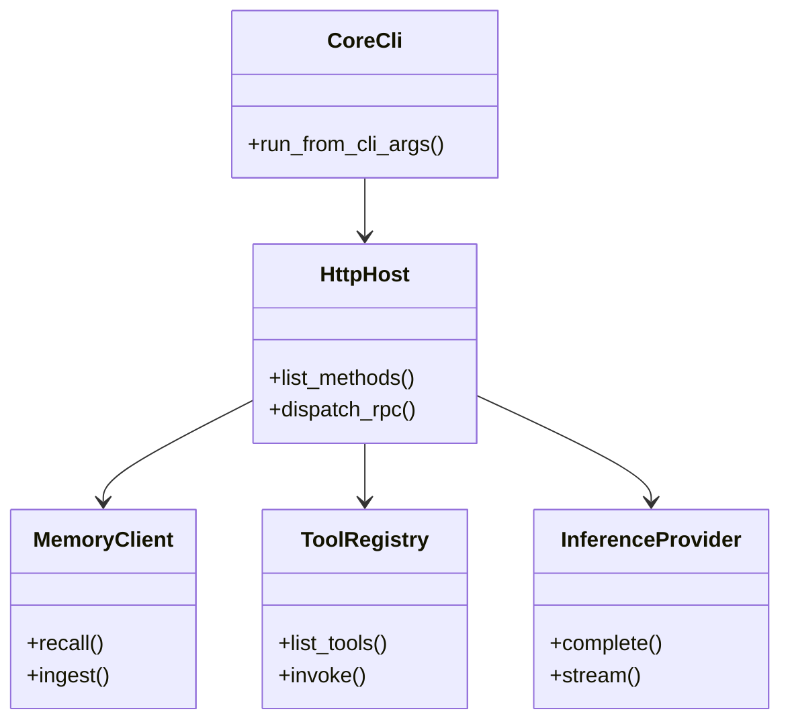

类名为架构抽象；实际 Rust 以 module + trait 组合为主，非 OOP 继承树。

## 相关页面

- [系统架构](system-architecture.md)
- [Agent 编排与循环](agent-orchestration.md)
- [Memory Tree 流水线](memory-tree-pipeline.md)

Sources: [src/lib.rs:1-80](../../../project-repos/openhuman/src/lib.rs#L1-L80)

<details class="source-snippets">
<summary>引用源码</summary>

<!-- source-snippets:start -->

#### `src/lib.rs:1-80`

```rust
//! Core library for the OpenHuman platform.
//!
//! This crate provides the central logic for the OpenHuman core binary, including:
//! - API and RPC handlers for external interactions.
//! - Core system services (CLI, configuration, monitoring).
//! - Domain-specific logic for the OpenHuman agent runtime.

pub mod api;
pub mod core;
pub mod openhuman;
pub mod rpc;

pub use openhuman::config::DaemonConfig;
pub use openhuman::memory_store::{MemoryClient, MemoryState};

/// Runs the core logic based on the provided command-line arguments.
///
/// This is the primary entry point for the OpenHuman binary, delegating to the
/// CLI module for argument parsing and command dispatch.
///
/// # Arguments
///
/// * `args` - A slice of strings containing the command-line arguments.
///
/// # Errors
///
/// Returns an error if command execution fails.
pub fn run_core_from_args(args: &[String]) -> anyhow::Result<()> {
    openhuman::service::apply_startup_restart_delay_from_env();
    openhuman::keyring::init_master_key();
    core::cli::run_from_cli_args(args)
}
```

<!-- source-snippets:end -->
</details>


---

<details>
<summary>相关源文件</summary>

生成本页时使用的主要源文件：

- [src/openhuman/agent_orchestration/mod.rs](../../project-repos/openhuman/src/openhuman/agent_orchestration/mod.rs)
- [src/openhuman/agent/README.md](../../project-repos/openhuman/src/openhuman/agent/README.md)
- [docs/agent-subagent-tool-flow.md](../../project-repos/openhuman/docs/agent-subagent-tool-flow.md)

</details>

# Agent 编排与循环

Agent 层分 **.harness**（prompt、工具过滤、子 Agent 运行循环）与 **agent_orchestration**（多 Worker 控制面）。

## 编排 API 面

`agent_orchestration` 暴露：

- `SpawnAgentRequest` / `SpawnAgentResponse`  
- `FollowUpRequest`, `ResumeAgentRequest`, `WaitAgentOptions`  
- `AgentOrchestrationEvent` 流式状态  

父会话可并行 spawn 多个 sub-agent，各自工具策略由 `agent_tool_policy` 约束。

## 典型对话时序

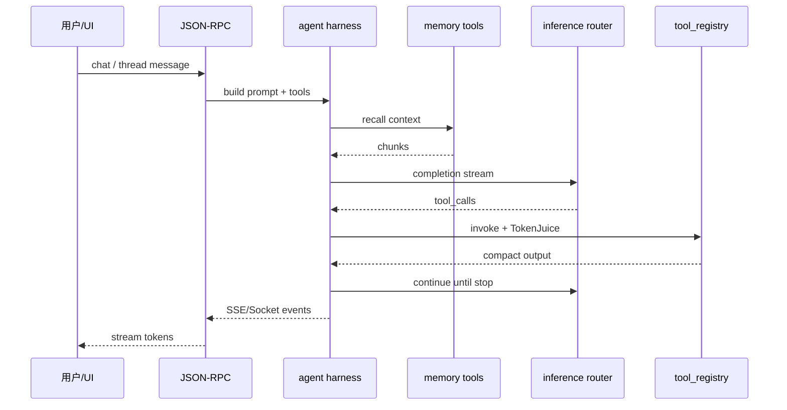

## 审批与策略

高危工具（shell、git push、支付等）走 `approval` 域；`prompt_injection` 与 UI 侧 guard 双层防御。

**Insight**：Skills 在 OpenHuman 中是 **metadata-first**（`skills` 模块），执行仍落 MCP/内置工具——与 Claude Code skills 文件驱动不同，扩展点主要在 tool registry 与 MCP server 安装 UI。

## 相关页面

- [工具系统与 MCP](tools-mcp.md)
- [推理与模型路由](inference-routing.md)
- [安全与隐私边界](security-privacy.md)

Sources: [src/openhuman/agent_orchestration/mod.rs:1-80](../../../project-repos/openhuman/src/openhuman/agent_orchestration/mod.rs#L1-L80)

<details class="source-snippets">
<summary>引用源码</summary>

<!-- source-snippets:start -->

#### `src/openhuman/agent_orchestration/mod.rs:1-80`

```rust
//! High-level agent-to-agent orchestration domain.
//!
//! This module owns the control-plane semantics for coordinating multiple
//! agent workers from one parent session. The lower-level
//! [`crate::openhuman::agent::harness`] module remains responsible for prompt
//! construction, tool filtering, and the actual sub-agent run loop.

mod ops;
pub mod tools;
pub mod types;

#[cfg(test)]
mod ops_tests;

pub use ops::{AgentOrchestrationSession, OrchestrationError};
pub use types::{
    AgentMessage, AgentOrchestrationEvent, AgentSnapshot, AgentStatus, CloseAgentRequest,
    FollowUpRequest, MessageAgentRequest, ResumeAgentRequest, SpawnAgentRequest,
    SpawnAgentResponse, WaitAgentOptions, WaitAgentResponse,
};
```

<!-- source-snippets:end -->
</details>


---

<details>
<summary>相关源文件</summary>

生成本页时使用的主要源文件：

- [src/openhuman/tool_registry/ops.rs](../../project-repos/openhuman/src/openhuman/tool_registry/ops.rs)
- [src/openhuman/mcp_registry](../../project-repos/openhuman/src/openhuman/mcp_registry)
- [docs/MCP_SETUP_AGENT.md](../../project-repos/openhuman/docs/MCP_SETUP_AGENT.md)

</details>

# 工具系统与 MCP

工具面由 **tool_registry**（内置 JsonRpc 工具）+ **MCP client/registry**（用户安装的服务器）+ **Composio**（SaaS 集成）三层组成。

## 工具注册

`ToolRegistryTransport::JsonRpc` 标记可通过 core RPC 调度的内置工具：web_search、filesystem、git、lint 等。`list_tools` 过滤 transport 供 Agent harness 构建 tool schema。

## MCP 架构

| 组件 | 职责 |
|------|------|
| `mcp_registry` |  catalog、安装态 |
| `mcp_client` | stdio/SSE 连接 |
| `mcp_server` | OpenHuman 对外暴露 MCP |
| UI `McpCatalogBrowser` | 用户安装向导 |

前端 `components/channels/mcp/*` 与 E2E `mcp_setup_e2e` 覆盖安装流。

## 工具调用数据流

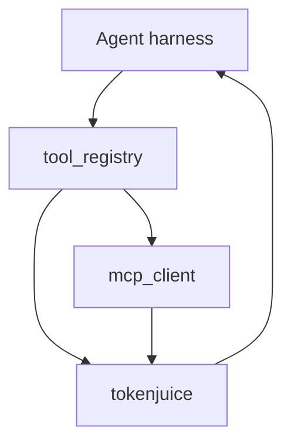

**Insight**：`cwd_jail` + Landlock/bubblewrap（feature flag）限制 shell 工具可见目录——工具能力越大，沙箱越不能省。

## 相关页面

- [Agent 编排与循环](agent-orchestration.md)
- [集成与 Composio](integrations-composio.md)
- [安全与隐私边界](security-privacy.md)

Sources: [src/openhuman/tool_registry/ops.rs:1-80](../../../project-repos/openhuman/src/openhuman/tool_registry/ops.rs#L1-L80)

<details class="source-snippets">
<summary>引用源码</summary>

<!-- source-snippets:start -->

#### `src/openhuman/tool_registry/ops.rs:1-80`

```rust
use std::collections::{BTreeMap, BTreeSet};

use serde_json::{json, Map, Value};

use crate::core::all;
use crate::core::{ControllerSchema, FieldSchema, TypeSchema};
use crate::openhuman::config::Config;
use crate::openhuman::mcp_server::McpToolSpec;
use crate::openhuman::memory_store::chunks::store as chunk_store;
use crate::rpc::RpcOutcome;

use super::providers::capability_provider_diagnostics;
use super::types::{
    McpAllowlistDiagnostics, McpServerAllowlistSummary, McpWriteAuditHealth, ToolPolicyDiagnostics,
    ToolPolicyPosture, ToolRegistryEntry, ToolRegistryHealth, ToolRegistryList,
    ToolRegistryTransport,
};

const REGISTRY_ENTRY_VERSION: &str = env!("CARGO_PKG_VERSION");
const POLICY_SURFACES: &[&str] = &[
    "security.policy_info",
    "approval.list_pending",
    "approval.list_recent_decisions",
    "approval.decide",
    "tool_registry.list",
    "tool_registry.get",
    "tool_registry.diagnostics",
];

/// Return the current read-only tool registry snapshot.
pub fn list_tools() -> RpcOutcome<ToolRegistryList> {
    let tools = registry_entries();
    log::debug!(
        "[tool_registry] list_tools completed entries={}",
        tools.len()
    );
    RpcOutcome::new(ToolRegistryList { tools }, vec![])
}

/// Return redacted diagnostics for policy/tool visibility reviews.
pub async fn diagnostics() -> Result<RpcOutcome<ToolPolicyDiagnostics>, String> {
    log::debug!("[tool_registry] diagnostics loading_config");
    let config = Config::load_or_init().await.map_err(|err| {
        log::warn!("[tool_registry] diagnostics config_load_failed error={err}");
        format!("failed to load config for tool registry diagnostics: {err}")
    })?;
    Ok(diagnostics_for_config(&config))
}

/// Return redacted diagnostics using a specific config snapshot.
pub fn diagnostics_for_config(config: &Config) -> RpcOutcome<ToolPolicyDiagnostics> {
    log::debug!("[tool_registry] diagnostics_for_config start");

    let tools = registry_entries();
    let total_tools = tools.len();
    let enabled_tools = tools.iter().filter(|entry| entry.enabled).count();
    let mcp_stdio_tools = tools
        .iter()
        .filter(|entry| entry.transport == ToolRegistryTransport::McpStdio)
        .count();
    let json_rpc_tools = tools
        .iter()
        .filter(|entry| entry.transport == ToolRegistryTransport::JsonRpc)
        .count();
    let possible_write_surfaces = tools
        .iter()
        .filter(|entry| looks_write_capable(&entry.tool_id))
        .map(|entry| entry.tool_id.clone())
        .collect::<Vec<_>>();
    let policy_surfaces = policy_surface_ids();
    let posture = posture_from_config(config);
    let mcp_allowlists = mcp_allowlists_from_config(config);
    let mcp_write_audit = mcp_write_audit_health(config);
    let recent_denials = super::denials::list(25);
    let capability_providers = capability_provider_diagnostics(config);

    log::trace!(
        "[tool_registry] diagnostics_for_config counted total_tools={} enabled_tools={} mcp_stdio_tools={} json_rpc_tools={} possible_write_surfaces={} policy_surfaces={}",
        total_tools,
        enabled_tools,
```

<!-- source-snippets:end -->
</details>


---


## 记忆系统


<details>
<summary>相关源文件</summary>

生成本页时使用的主要源文件：

- [src/openhuman/memory_store/chunks/store.rs](../../project-repos/openhuman/src/openhuman/memory_store/chunks/store.rs)
- [gitbooks/developing/architecture/README.zh-CN.md](../../project-repos/openhuman/gitbooks/developing/architecture/README.zh-CN.md)

</details>

# Memory Tree 流水线

Memory Tree 解决 **长期上下文如何本地沉淀**：集成数据 → Markdown 分块 → SQLite + Obsidian vault → 嵌入/摘要树 → Agent 检索。

## 十步数据流（官方架构）

1. OAuth 连接集成  
2. 每 20 分钟 scheduler auto-fetch  
3. Provider 输出 canonical Markdown（provenance 标签）  
4. 切分为 ≤3k token chunks  
5. 写入 `memory_tree/chunks.db` + `wiki/*.md`  
6. 后台 embedding、实体、hotness  
7. 构建 source/topic 摘要树（历史 global/topic 树已迁移 purge）  
8. Agent 查询：search / drill / topic / fetch  
9. TokenJuice 压缩大块工具输出  
10. routing 选模型  

## 流水线图

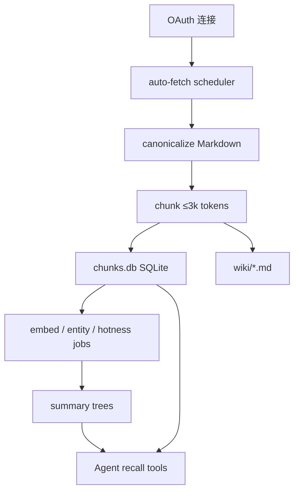

## Chunk 生命周期

`mem_tree_chunks` 状态机：`pending_extraction` → `admitted` → `buffered` → `sealed` 或 `dropped`。Admission gate 过滤低信号内容。

**Insight**：`ConnectionCache`（#2206）把每 5s 轮询的开连接从 ~69K/天 降到单连接复用——说明 Memory Tree worker 并发写 `chunks.db` 曾是生产级 WAL/SHM I/O 告警源；`SQLITE_BUSY_TIMEOUT` 15s 是为 Windows 写锁争用调参。

## 核心业务时序：Auto-fetch _tick

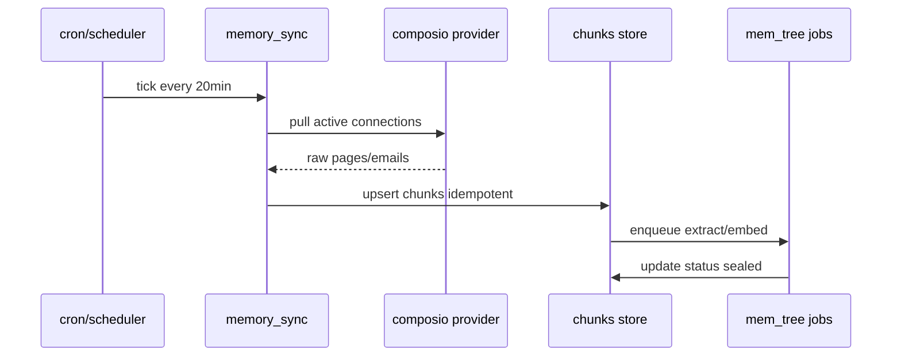

Sources: [src/openhuman/memory_store/chunks/store.rs:54-63](../../../project-repos/openhuman/src/openhuman/memory_store/chunks/store.rs#L54-L63)

<details class="source-snippets">
<summary>引用源码</summary>

<!-- source-snippets:start -->

#### `src/openhuman/memory_store/chunks/store.rs:54-63`

```rust
/// Chunk lifecycle: freshly persisted, awaiting the async extract job.
pub const CHUNK_STATUS_PENDING_EXTRACTION: &str = "pending_extraction";
/// Chunk lifecycle: extract ran and the chunk passed admission.
pub const CHUNK_STATUS_ADMITTED: &str = "admitted";
/// Chunk lifecycle: appended to the L0 buffer of its source tree.
pub const CHUNK_STATUS_BUFFERED: &str = "buffered";
/// Chunk lifecycle: rolled into a sealed L1 summary.
pub const CHUNK_STATUS_SEALED: &str = "sealed";
/// Chunk lifecycle: rejected by the admission gate (too low signal).
pub const CHUNK_STATUS_DROPPED: &str = "dropped";
```

<!-- source-snippets:end -->
</details>

## 相关页面

- [内存存储与数据库模型](memory-store-schema.md)
- [集成与 Composio](integrations-composio.md)
- [TokenJuice 压缩](tokenjuice-compression.md)

Sources: [src/openhuman/memory_store/chunks/store.rs:1-80](../../../project-repos/openhuman/src/openhuman/memory_store/chunks/store.rs#L1-L80)

<details class="source-snippets">
<summary>引用源码</summary>

<!-- source-snippets:start -->

#### `src/openhuman/memory_store/chunks/store.rs:1-80`

```rust
//! SQLite-backed persistence for ingested chunks (Phase 1 / issue #707).
//!
//! The store lives at `<workspace>/memory_tree/chunks.db`. Schema is applied
//! lazily on first access via `with_connection`, so the DB is created on
//! demand without an explicit migration step.
//!
//! Upsert semantics: writes are idempotent on `chunk.id` so re-ingesting the
//! same raw source yields no duplicates.
//!
//! ## Connection cache (#2206)
//!
//! `with_connection()` previously opened a new SQLite connection and re-ran
//! the full schema init (8 tables, 15+ indexes, 8+ migrations) on **every**
//! call. With 4 workers polling every 5 s this amounted to ~69K connection
//! opens/day, and a family of WAL/SHM cold-start I/O codes (1546
//! IOERR_TRUNCATE, 4618 IOERR_SHMOPEN, 4874 IOERR_SHMSIZE, 14 CANTOPEN)
//! flooded Sentry with ~19K events in 4 days.
//!
//! Fix: a process-level `ConnectionCache` keyed by DB path. Each entry holds
//! one `parking_lot::Mutex<Connection>` that is initialised once (schema +
//! migrations + legacy-embedding migration) and then reused for all subsequent
//! calls. A per-entry `CircuitBreaker` stops retrying after 3 consecutive
//! init failures for 30 s so a broken install does not busy-loop.

use anyhow::{Context, Result};
use chrono::{DateTime, TimeZone, Utc};
use rusqlite::{params, Connection, OptionalExtension, Transaction};
use std::collections::{HashMap, HashSet};
#[cfg(test)]
use std::sync::Arc;
use std::time::Duration;

use crate::openhuman::config::Config;
use crate::openhuman::memory::util::redact::{self, redact as redact_value};
use crate::openhuman::memory_store::chunks::types::{Chunk, Metadata, SourceKind, SourceRef};
use crate::openhuman::memory_store::content::StagedChunk;

const DB_DIR: &str = "memory_tree";
const DB_FILE: &str = "chunks.db";
const DEFAULT_LIST_LIMIT: usize = 100;
const MAX_LIST_LIMIT: usize = 10_000;
// 15s gives the busy-handler enough headroom that transient write-lock
// contention (4 job workers + scheduler + ingest producers all writing the
// same `memory_tree/chunks.db`) is absorbed inside rusqlite instead of
// surfacing as `SQLITE_BUSY` to callers. Workers still treat busy as a
// soft signal (see `memory_tree::jobs::worker`) so even if this is
// exceeded, the only effect is a one-poll backoff — but 15s is
// comfortably above realistic peer-write durations and shrinks the rate
// at which we have to fall back to that path. The previous 5s was tight
// enough on contended Windows hosts that we were observing avoidable
// busy returns (see OPENHUMAN-TAURI-BP).
const SQLITE_BUSY_TIMEOUT: Duration = Duration::from_secs(15);

/// Chunk lifecycle: freshly persisted, awaiting the async extract job.
pub const CHUNK_STATUS_PENDING_EXTRACTION: &str = "pending_extraction";
/// Chunk lifecycle: extract ran and the chunk passed admission.
pub const CHUNK_STATUS_ADMITTED: &str = "admitted";
/// Chunk lifecycle: appended to the L0 buffer of its source tree.
pub const CHUNK_STATUS_BUFFERED: &str = "buffered";
/// Chunk lifecycle: rolled into a sealed L1 summary.
pub const CHUNK_STATUS_SEALED: &str = "sealed";
/// Chunk lifecycle: rejected by the admission gate (too low signal).
pub const CHUNK_STATUS_DROPPED: &str = "dropped";

// `PRAGMA foreign_keys = ON` is intentionally NOT in SCHEMA — it is
// a connection-local pragma that resets to off on every new
// `Connection::open`. SCHEMA only runs once per DB path (first-init);
// applying foreign_keys here would leak FK-off into every later
// `with_connection()` call that hits the fast path. The pragma is
// set per-connection in `open_connection()` instead.

/// `PRAGMA user_version` value once the one-shot legacy→sidecar embedding
/// migration (#1574 §7) has run. `0` (fresh/legacy DB) triggers the copy on
/// next open; `>= 1` skips it. Bump only for a new one-shot data migration.
const TREE_EMBEDDING_MIGRATION_VERSION: i64 = 1;

/// `PRAGMA user_version` value once the global/topic-tree purge has run.
/// The global (time-axis) and topic (subject-axis) trees were removed; this
/// one-shot migration deletes their rows + on-disk summary folders. `< 2`
/// triggers the purge on next open; `>= 2` skips it.
```

<!-- source-snippets:end -->
</details>


---

<details>
<summary>相关源文件</summary>

生成本页时使用的主要源文件：

- [src/openhuman/memory_store/chunks/store.rs](../../project-repos/openhuman/src/openhuman/memory_store/chunks/store.rs)
- [src/openhuman/memory_store/unified/init.rs](../../project-repos/openhuman/src/openhuman/memory_store/unified/init.rs)

</details>

# 内存存储与数据库模型

OpenHuman 在 workspace 下使用 **多个 SQLite 库**，而非单一 monolithic DB——按域隔离 WAL 争用与迁移。

## 主要数据库

| 路径 | 核心表 | 用途 |
|------|--------|------|
| `memory_tree/chunks.db` | `mem_tree_chunks`, `mem_tree_summaries`, `mem_tree_jobs`… | Memory Tree 主库 |
| unified memory | `memory_docs`, `vector_chunks`, `episodic_log`… | 对话/向量/图谱 |
| `subconscious/*.db` | `subconscious_tasks`, `subconscious_log`… | 后台任务 |
| `people/` migrations | `people`, `interactions` | 联系人图谱 |

## ER 图（Memory Tree 核心）

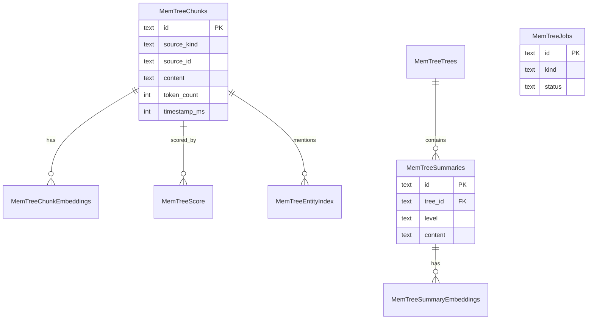

实体名 PascalCase 以兼容 Mermaid 8.x；列名保留下划线语义。

## 迁移策略

- `PRAGMA user_version` 驱动 one-shot 迁移（如 legacy embedding → sidecar、global/topic purge）
- `CREATE TABLE IF NOT EXISTS` + 惰性 `with_connection` 首次打开建库
- Foreign keys 在 **每连接** `open_connection()` 设置，而非只在 SCHEMA 一次

**Insight**：chunk upsert 按 `chunk.id` 幂等——同一 raw source 重 ingest 不产生 duplicate，这对 auto-fetch 重复拉取至关重要。

## 相关页面

- [Memory Tree 流水线](memory-tree-pipeline.md)
- [Subconscious 后台思考](subconscious-background.md)
- [代码质量与重构建议](quality-risks-refactor.md)

Sources: [src/openhuman/memory_store/chunks/store.rs:1-80](../../../project-repos/openhuman/src/openhuman/memory_store/chunks/store.rs#L1-L80)

<details class="source-snippets">
<summary>引用源码</summary>

<!-- source-snippets:start -->

#### `src/openhuman/memory_store/chunks/store.rs:1-80`

```rust
//! SQLite-backed persistence for ingested chunks (Phase 1 / issue #707).
//!
//! The store lives at `<workspace>/memory_tree/chunks.db`. Schema is applied
//! lazily on first access via `with_connection`, so the DB is created on
//! demand without an explicit migration step.
//!
//! Upsert semantics: writes are idempotent on `chunk.id` so re-ingesting the
//! same raw source yields no duplicates.
//!
//! ## Connection cache (#2206)
//!
//! `with_connection()` previously opened a new SQLite connection and re-ran
//! the full schema init (8 tables, 15+ indexes, 8+ migrations) on **every**
//! call. With 4 workers polling every 5 s this amounted to ~69K connection
//! opens/day, and a family of WAL/SHM cold-start I/O codes (1546
//! IOERR_TRUNCATE, 4618 IOERR_SHMOPEN, 4874 IOERR_SHMSIZE, 14 CANTOPEN)
//! flooded Sentry with ~19K events in 4 days.
//!
//! Fix: a process-level `ConnectionCache` keyed by DB path. Each entry holds
//! one `parking_lot::Mutex<Connection>` that is initialised once (schema +
//! migrations + legacy-embedding migration) and then reused for all subsequent
//! calls. A per-entry `CircuitBreaker` stops retrying after 3 consecutive
//! init failures for 30 s so a broken install does not busy-loop.

use anyhow::{Context, Result};
use chrono::{DateTime, TimeZone, Utc};
use rusqlite::{params, Connection, OptionalExtension, Transaction};
use std::collections::{HashMap, HashSet};
#[cfg(test)]
use std::sync::Arc;
use std::time::Duration;

use crate::openhuman::config::Config;
use crate::openhuman::memory::util::redact::{self, redact as redact_value};
use crate::openhuman::memory_store::chunks::types::{Chunk, Metadata, SourceKind, SourceRef};
use crate::openhuman::memory_store::content::StagedChunk;

const DB_DIR: &str = "memory_tree";
const DB_FILE: &str = "chunks.db";
const DEFAULT_LIST_LIMIT: usize = 100;
const MAX_LIST_LIMIT: usize = 10_000;
// 15s gives the busy-handler enough headroom that transient write-lock
// contention (4 job workers + scheduler + ingest producers all writing the
// same `memory_tree/chunks.db`) is absorbed inside rusqlite instead of
// surfacing as `SQLITE_BUSY` to callers. Workers still treat busy as a
// soft signal (see `memory_tree::jobs::worker`) so even if this is
// exceeded, the only effect is a one-poll backoff — but 15s is
// comfortably above realistic peer-write durations and shrinks the rate
// at which we have to fall back to that path. The previous 5s was tight
// enough on contended Windows hosts that we were observing avoidable
// busy returns (see OPENHUMAN-TAURI-BP).
const SQLITE_BUSY_TIMEOUT: Duration = Duration::from_secs(15);

/// Chunk lifecycle: freshly persisted, awaiting the async extract job.
pub const CHUNK_STATUS_PENDING_EXTRACTION: &str = "pending_extraction";
/// Chunk lifecycle: extract ran and the chunk passed admission.
pub const CHUNK_STATUS_ADMITTED: &str = "admitted";
/// Chunk lifecycle: appended to the L0 buffer of its source tree.
pub const CHUNK_STATUS_BUFFERED: &str = "buffered";
/// Chunk lifecycle: rolled into a sealed L1 summary.
pub const CHUNK_STATUS_SEALED: &str = "sealed";
/// Chunk lifecycle: rejected by the admission gate (too low signal).
pub const CHUNK_STATUS_DROPPED: &str = "dropped";

// `PRAGMA foreign_keys = ON` is intentionally NOT in SCHEMA — it is
// a connection-local pragma that resets to off on every new
// `Connection::open`. SCHEMA only runs once per DB path (first-init);
// applying foreign_keys here would leak FK-off into every later
// `with_connection()` call that hits the fast path. The pragma is
// set per-connection in `open_connection()` instead.

/// `PRAGMA user_version` value once the one-shot legacy→sidecar embedding
/// migration (#1574 §7) has run. `0` (fresh/legacy DB) triggers the copy on
/// next open; `>= 1` skips it. Bump only for a new one-shot data migration.
const TREE_EMBEDDING_MIGRATION_VERSION: i64 = 1;

/// `PRAGMA user_version` value once the global/topic-tree purge has run.
/// The global (time-axis) and topic (subject-axis) trees were removed; this
/// one-shot migration deletes their rows + on-disk summary folders. `< 2`
/// triggers the purge on next open; `>= 2` skips it.
```

<!-- source-snippets:end -->
</details>


---

<details>
<summary>相关源文件</summary>

生成本页时使用的主要源文件：

- [src/openhuman/subconscious/mod.rs](../../project-repos/openhuman/src/openhuman/subconscious/mod.rs)
- [src/openhuman/subconscious/store.rs](../../project-repos/openhuman/src/openhuman/subconscious/store.rs)

</details>

# Subconscious 后台思考

Subconscious 是 **用户不输入时的后台认知引擎**：定时 tick、reflection、escalation，把 Gmail/Notion 等 source chunk 合成 situation report 供后续 Agent 使用。

## 数据表（节选）

- `subconscious_tasks` — 周期任务  
- `subconscious_log` — 决策日志  
- `subconscious_escalations` — 需用户Attention  
- `subconscious_reflections` — 反思条目  

`SubconsciousEngine` 与 cron/heartbeat 协同；E2E fixture 在 `tests/fixtures/subconscious/`。

## 时序：Background tick

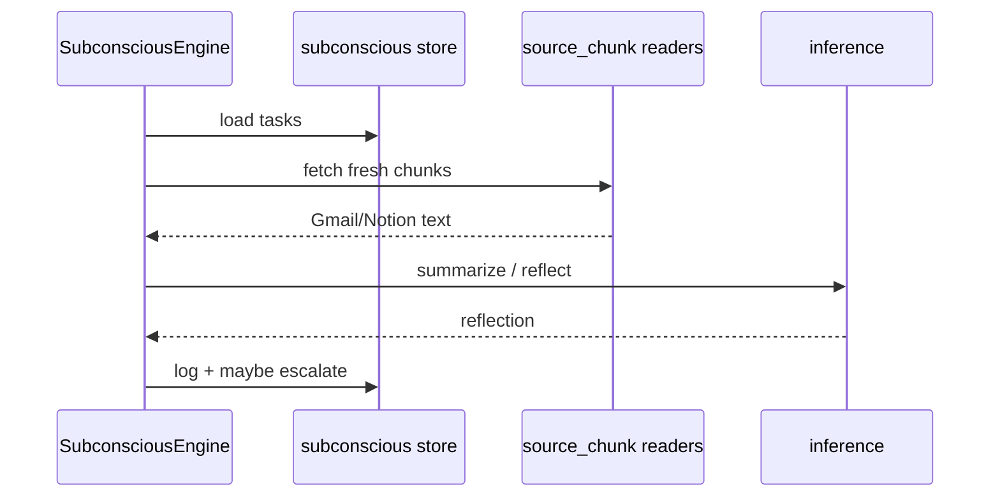

**Insight**：与 Memory Tree auto-fetch 分工——Memory Tree 偏 **结构化长期记忆**，Subconscious 偏 **主动推理与 escalation**，避免把所有后台 LLM 都塞进 ingest pipeline。

## 相关页面

- [Memory Tree 流水线](memory-tree-pipeline.md)
- [Agent 编排与循环](agent-orchestration.md)
- [推理与模型路由](inference-routing.md)

Sources: [src/openhuman/subconscious/mod.rs:1-80](../../../project-repos/openhuman/src/openhuman/subconscious/mod.rs#L1-L80)

<details class="source-snippets">
<summary>引用源码</summary>

<!-- source-snippets:start -->

#### `src/openhuman/subconscious/mod.rs:1-80`

```rust
pub mod engine;
pub mod executor;
pub mod global;
pub mod prompt;
pub mod reflection;
pub mod reflection_store;
mod schemas;
pub mod situation_report;
pub mod source_chunk;
pub mod store;
pub mod types;

// Keep decision_log for potential future dedup queries against the log table.
pub mod decision_log;

#[cfg(test)]
mod integration_tests;

pub use engine::SubconsciousEngine;
pub use reflection::{Reflection, ReflectionKind, MAX_REFLECTIONS_PER_TICK};
pub use schemas::{
    all_controller_schemas as all_subconscious_controller_schemas,
    all_registered_controllers as all_subconscious_registered_controllers,
};
pub use source_chunk::SourceChunk;
pub use types::{
    Escalation, EscalationStatus, SubconsciousLogEntry, SubconsciousStatus, SubconsciousTask,
    TaskRecurrence, TaskSource, TickDecision, TickResult,
};
```

<!-- source-snippets:end -->
</details>


---


## 推理与集成


<details>
<summary>相关源文件</summary>

生成本页时使用的主要源文件：

- [src/openhuman/inference/mod.rs](../../project-repos/openhuman/src/openhuman/inference/mod.rs)
- [gitbooks/features/model-routing/README.md](../../project-repos/openhuman/gitbooks/features/model-routing/README.md)

</details>

# 推理与模型路由

`inference` 模块统一 **本地 Ollama/LM Studio/Whisper/Piper** 与 **云端 provider 路由**。

## 子模块

| 路径 | 职责 |
|------|------|
| `inference/local/` | 本地模型下载、生命周期 |
| `inference/provider/` | trait、可靠性、fallback |
| `inference/voice/` | STT/TTS 推理 |
| `inference/http/` | OpenAI 兼容 `/v1/chat/completions` |

RPC 命名空间保持 `inference.*` 与 `local_ai.*` 向后兼容。

## 路由决策流

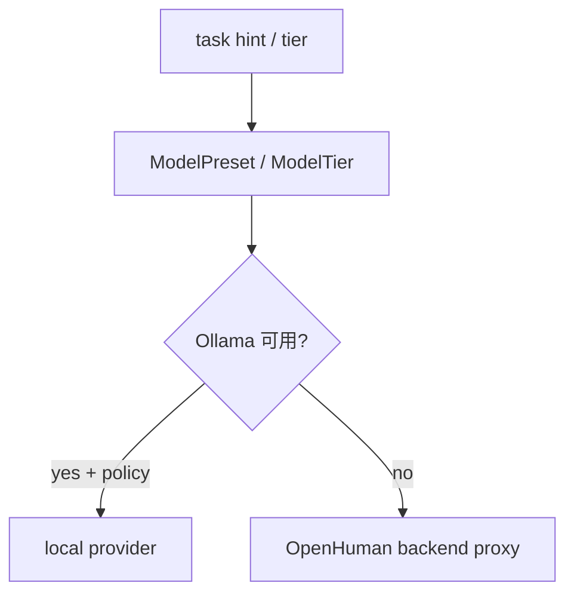

`routing::quality` 用 Aho-Corasick 检测 local model refusal/空噪声，避免坏回复进入用户可见流。

**Insight**：DeviceProfile 与 scheduler_gate 联动——笔记本低电量时 throttle 后台 LLM，体现"human in the loop"的资源感知。

## 相关页面

- [TokenJuice 压缩](tokenjuice-compression.md)
- [Rust 核心运行时](rust-core-runtime.md)
- [语音与 Meet Agent](voice-meet-agent.md)

Sources: [src/openhuman/inference/mod.rs:1-80](../../../project-repos/openhuman/src/openhuman/inference/mod.rs#L1-L80)

<details class="source-snippets">
<summary>引用源码</summary>

<!-- source-snippets:start -->

#### `src/openhuman/inference/mod.rs:1-80`

```rust
//! Unified inference domain.
//!
//! This module is the canonical home for all inference concerns:
//! - `local/`    — Ollama / LM Studio / Whisper / Piper runtime management
//!                 (was `src/openhuman/local_ai/`)
//! - `provider/` — cloud + local provider trait, routing, reliability
//!                 (was `src/openhuman/providers/`)
//! - `voice/`    — transcription (STT) and TTS inference implementations
//!                 (moved from `src/openhuman/voice/`)
//! - `http/`     — OpenAI-compatible `/v1/chat/completions` endpoint
//!
//! The RPC surface remains under the `inference.*` and `local_ai.*` namespaces
//! for backwards compatibility.

pub mod device;
pub mod http;
pub mod local;
pub mod model_context;
pub mod model_ids;
pub mod openai_oauth;
pub mod ops;
pub mod parse;
pub mod paths;
pub mod presets;
pub mod provider;
mod schemas;
pub mod sentiment;
pub mod types;
pub mod voice;

pub use ops as rpc;
pub use schemas::{
    all_controller_schemas as all_inference_controller_schemas,
    all_registered_controllers as all_inference_registered_controllers,
};

// Re-export the types that external callers (voice, agent, etc.) import from inference
pub use device::DeviceProfile;
pub use local::all_local_ai_controller_schemas;
pub use local::all_local_ai_registered_controllers;
pub use model_context::context_window_for_model;
pub use presets::{ModelPreset, ModelTier, VisionMode};
pub use sentiment::SentimentResult;
pub use types::{
    LocalAiAssetStatus, LocalAiAssetsStatus, LocalAiDownloadProgressItem, LocalAiDownloadsProgress,
    LocalAiEmbeddingResult, LocalAiSpeechResult, LocalAiStatus, LocalAiTtsResult,
};

// Test helpers (re-exported for sibling test files that use inference_test_guard)
#[cfg(test)]
pub(crate) fn inference_test_guard() -> std::sync::MutexGuard<'static, ()> {
    local::inference_test_guard()
}
```

<!-- source-snippets:end -->
</details>


---

<details>
<summary>相关源文件</summary>

生成本页时使用的主要源文件：

- [src/openhuman/tokenjuice/mod.rs](../../project-repos/openhuman/src/openhuman/tokenjuice/mod.rs)
- [gitbooks/features/token-compression.md](../../project-repos/openhuman/gitbooks/features/token-compression.md)

</details>

# TokenJuice 压缩

TokenJuice 是 **工具输出进入 LLM 前的 compaction 引擎**（Rust 移植自 vincentkoc/tokenjuice）。

## 三层规则叠加

1. **Builtin** — `include_str!` 嵌入 JSON 规则  
2. **User** — `~/.config/tokenjuice/rules/`  
3. **Project** — `.tokenjuice/rules/`（cwd 相对）  

同 `id` 规则高优先级覆盖低优先级。

## 处理管线

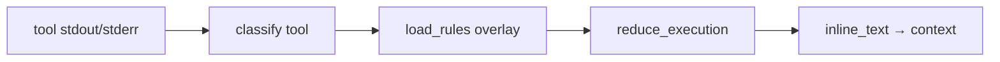

`compact_tool_output` 在 agent loop 调用，统计 `CompactionStats` 可观测节省比例。HTML→Markdown、URL 缩短等对 scrape/email 类工具尤为关键（Cargo.toml 注释：弃用 html2md 因 10KB 邮件 HTML 峰值堆 ~894MB）。

**Insight**：CJK/emoji 按 grapheme 保留——压缩不是简单截断字节，避免多语言用户上下文被 silently 破坏。

## 相关页面

- [Memory Tree 流水线](memory-tree-pipeline.md)
- [Agent 编排与循环](agent-orchestration.md)
- [推理与模型路由](inference-routing.md)

Sources: [src/openhuman/tokenjuice/mod.rs:1-80](../../../project-repos/openhuman/src/openhuman/tokenjuice/mod.rs#L1-L80)

<details class="source-snippets">
<summary>引用源码</summary>

<!-- source-snippets:start -->

#### `src/openhuman/tokenjuice/mod.rs:1-80`

````rust
//! # TokenJuice — terminal-output compaction engine
//!
//! Rust port of [vincentkoc/tokenjuice](https://github.com/vincentkoc/tokenjuice).
//!
//! Compacts verbose tool output (git, npm, cargo, docker, …) using
//! JSON-configured rules before it enters an LLM context window.
//!
//! ## Quick start
//!
//! ```rust
//! use openhuman_core::openhuman::tokenjuice::{
//!     reduce::reduce_execution_with_rules,
//!     rules::load_builtin_rules,
//!     types::{ReduceOptions, ToolExecutionInput},
//! };
//!
//! let rules = load_builtin_rules();
//! let input = ToolExecutionInput {
//!     tool_name: "bash".to_owned(),
//!     argv: Some(vec!["git".to_owned(), "status".to_owned()]),
//!     stdout: Some("On branch main\n\tmodified:   src/lib.rs\n".to_owned()),
//!     ..Default::default()
//! };
//! let result = reduce_execution_with_rules(input, &rules, &ReduceOptions::default());
//! println!("{}", result.inline_text);
//! // → "M: src/lib.rs"
//! ```
//!
//! ## Scope (v1 — library only)
//!
//! This module is purely a library.  It has no JSON-RPC surface, no CLI, and
//! no artifact store.  Those surfaces can be layered on later when a caller
//! inside `openhuman` needs them.
//!
//! ## Three-layer rule overlay
//!
//! Rules are loaded from three sources in ascending priority order:
//! 1. **Builtin** — vendored JSON files embedded via `include_str!`.
//! 2. **User** — `~/.config/tokenjuice/rules/` (loaded from disk).
//! 3. **Project** — `.tokenjuice/rules/` relative to `cwd` (loaded from disk).
//!
//! When two layers define the same rule `id`, the higher-priority layer wins.

pub mod classify;
pub mod reduce;
pub mod rules;
pub mod text;
pub mod tool_integration;
pub mod types;

#[cfg(test)]
#[path = "text_tests.rs"]
mod text_tests;

pub use reduce::reduce_execution_with_rules;
pub use rules::{load_builtin_rules, load_rules, LoadRuleOptions};
pub use tool_integration::{compact_tool_output, CompactionStats};
pub use types::{CompactResult, ReduceOptions, ToolExecutionInput};
````

<!-- source-snippets:end -->
</details>


---

<details>
<summary>相关源文件</summary>

生成本页时使用的主要源文件：

- [src/openhuman/composio](../../project-repos/openhuman/src/openhuman/composio)
- [README.md](../../project-repos/openhuman/README.md)
- [gitbooks/features/integrations/README.md](../../project-repos/openhuman/gitbooks/features/integrations/README.md)

</details>

# 集成与 Composio

118+ 第三方集成通过 **Composio connector layer** 暴露为 typed tools。默认 **managed mode**：OAuth 与 tool call 经 OpenHuman 后端代理；**direct mode** 自备 Composio API key。

## 集成生命周期

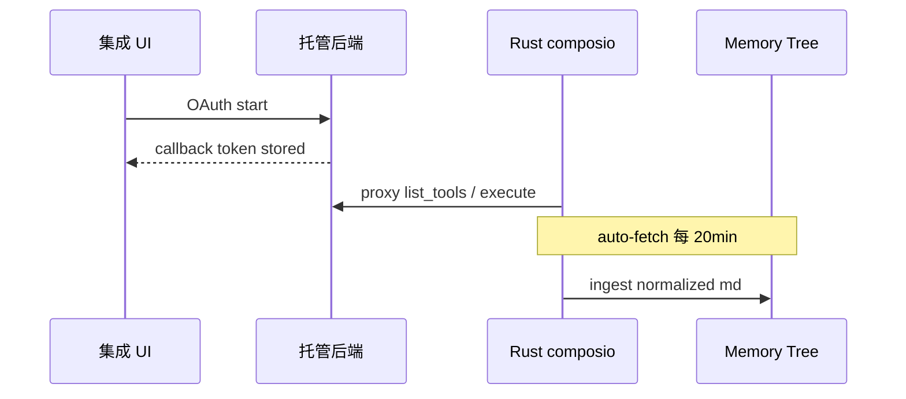

`memory_sync` 与各 provider reader（Gmail、Notion、Slack…）把远程对象映射为 `SourceKind` + `SourceRef`，再进入 chunk pipeline。

## CEF WebView

部分集成需 **CEF 子 WebView**（`webview_accounts`）完成登录态；cookie 表独立持久化。

**Insight**：Post-OAuth retry E2E（`composio_post_oauth_retry_e2e`）说明连接态 flaky 是一等公民——集成域测试文件数量极大，反映 Composio 栈是回归热点。

## 相关页面

- [Memory Tree 流水线](memory-tree-pipeline.md)
- [消息通道](channels-messaging.md)
- [安全与隐私边界](security-privacy.md)

Sources: [src/openhuman/composio:1-80](../../../project-repos/openhuman/src/openhuman/composio#L1-L80)

<details class="source-snippets">
<summary>引用源码</summary>

<!-- source-snippets:start -->

#### `src/openhuman/composio:1-80`

> 引用目标是目录，无法展开源码片段：`src/openhuman/composio`

<!-- source-snippets:end -->
</details>


---


## 通道与体验


<details>
<summary>相关源文件</summary>

生成本页时使用的主要源文件：

- [src/openhuman/channels](../../project-repos/openhuman/src/openhuman/channels)
- [gitbooks/features/integrations/README.md](../../project-repos/openhuman/gitbooks/features/integrations/README.md)

</details>

# 消息通道

`channels` 域实现 **双向消息**：Telegram、Discord、Matrix（feature）、WhatsApp Web（feature）、Yuanbao 等。

## 模式

- **Inbound**：webhook/long-poll → 归一化为 thread message → Agent  
- **Outbound**：Agent 回复 → channel adapter → 平台 API  
- **Credential channels**：用户自填 bot token / webhook URL  

UI 在 `app/src/components/channels/` 提供配置与状态 badge；RPC 封装在 `tauriCommands`。

## 与 Memory 的交叉

通道消息可进入 memory_conversations 索引（FTS5 + 跨脚本 tokenize），与 Memory Tree 的"文档型"记忆互补。

**Insight**：Telegram inline approvals 有独立 design spec（`docs/superpowers/specs/2026-05-23-telegram-inline-approvals-design.md`）——通道不仅是通知，还是 **移动审批面**。

## 相关页面

- [集成与 Composio](integrations-composio.md)
- [Agent 编排与循环](agent-orchestration.md)
- [React 前端](react-frontend.md)

Sources: [src/openhuman/channels:1-80](../../../project-repos/openhuman/src/openhuman/channels#L1-L80)

<details class="source-snippets">
<summary>引用源码</summary>

<!-- source-snippets:start -->

#### `src/openhuman/channels:1-80`

> 引用目标是目录，无法展开源码片段：`src/openhuman/channels`

<!-- source-snippets:end -->
</details>


---

<details>
<summary>相关源文件</summary>

生成本页时使用的主要源文件：

- [src/openhuman/voice](../../project-repos/openhuman/src/openhuman/voice)
- [src/openhuman/meet_agent](../../project-repos/openhuman/src/openhuman/meet_agent)
- [gitbooks/features/mascot/README.md](../../project-repos/openhuman/gitbooks/features/mascot/README.md)

</details>

# 语音与 Meet Agent

语音栈在 `inference/voice/` 与顶层 `voice`、`meet`、`meet_agent` 协作：**Whisper STT**（macOS Metal 加速）+ **ElevenLabs TTS** + mascot lip-sync + **Google Meet 真实参会 Agent**。

## 组件关系

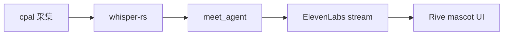

Meet Agent 作为会议参与者，依赖 screen_intelligence / 视觉模型 tier。

**Insight**：`whisper-rs-sys` 使用 tinyhumansai fork patch 修复 Windows MSVC CRT `/MD` vs `/MT` LNK2038——原生语音是跨平台发布硬门槛。

## 相关页面

- [推理与模型路由](inference-routing.md)
- [React 前端](react-frontend.md)
- [系统架构](system-architecture.md)

Sources: [src/openhuman/voice:1-80](../../../project-repos/openhuman/src/openhuman/voice#L1-L80)

<details class="source-snippets">
<summary>引用源码</summary>

<!-- source-snippets:start -->

#### `src/openhuman/voice:1-80`

> 引用目标是目录，无法展开源码片段：`src/openhuman/voice`

<!-- source-snippets:end -->
</details>


---


## 安全与工程


<details>
<summary>相关源文件</summary>

生成本页时使用的主要源文件：

- [docs/SECURITY_AUDIT.md](../../project-repos/openhuman/docs/SECURITY_AUDIT.md)
- [docs/PROMPT_INJECTION_GUARD.md](../../project-repos/openhuman/docs/PROMPT_INJECTION_GUARD.md)
- [src/openhuman/security](../../project-repos/openhuman/src/openhuman/security)
- [src/openhuman/keyring](../../project-repos/openhuman/src/openhuman/keyring)

</details>

# 安全与隐私边界

OpenHuman 的隐私叙事是 **本地 Memory Tree + vault 不上传**，但 **LLM/搜索/Composio 默认走订阅后端**——二次开发必须看清 trust boundary。

## 本地 vs 云端

| 数据 | 位置 |
|------|------|
| chunks.db、wiki md | 本机 workspace |
| 音频缓冲、Ollama 权重 | 本机 |
| LLM prompt/ completion | 默认云端代理 |
| Web search | 云端代理 |
| Composio OAuth token | 后端存储；core 不明文见 token |

## 攻击面（审计摘要）

- JSON-RPC Basic Auth / bearer — 依赖 token 不泄露到 env（桌面）  
- Prompt injection — Rust + 前端 `promptInjectionGuard`  
- Shell 工具 — `security` policy + `cwd_jail`  
- MCP — 第三方 server 等同用户安装代码  

## 风险模块图

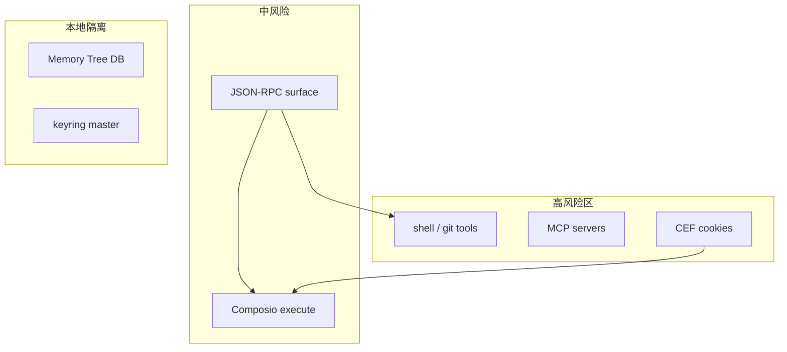

**Insight**：keyring master key 在 `run_core_from_args` 最早初始化——任何 RPC 处理前加密域已就绪，避免 half-initialized 窗口写明文凭证。

## 相关页面

- [代码质量与重构建议](quality-risks-refactor.md)
- [工具系统与 MCP](tools-mcp.md)
- [JSON-RPC 通信桥](json-rpc-bridge.md)

Sources: [docs/SECURITY_AUDIT.md:1-80](../../../project-repos/openhuman/docs/SECURITY_AUDIT.md#L1-L80)

<details class="source-snippets">
<summary>引用源码</summary>

<!-- source-snippets:start -->

#### `docs/SECURITY_AUDIT.md:1-80`

````markdown
# OpenHuman Security Audit — Architecture & Data Flow Analysis

> Date: 2026-05-21
> Author: JAYcodr (fork analysis, not an official audit)
> Scope: Architecture overview, trust boundaries, credential flow, attack surface

---

## 1. System Overview

OpenHuman is a desktop AI assistant with a **Rust core** running in-process inside a Tauri desktop host, and a **React/TypeScript frontend**. Communication between frontend and core happens via two channels:

| Channel | Protocol | Auth |
|---|---|---|
| Primary | Socket.IO (bidirectional streaming) | Session-baked connection auth |
| Secondary | HTTP JSON-RPC | Basic Auth (`WWW-Authenticate` realm) |

**No sidecar binary** — core runs as a tokio task inside the Tauri process (`core_process.rs`).

---

## 2. Module Map

### Core (`src/openhuman/`) — 66 domains

| Category | Domains |
|---|---|
| Agent | `agent`, `agent_experience`, `agent_tool_policy` |
| Memory | `memory` (stm_recall, docs), `embeddings`, `learning`, `workspace` |
| Skills | `skills` (metadata-only), `mcp_client`, `mcp_clients`, `mcp_server`, `composio` |
| Channels | `channels` (dispatch), `telegram`, `discord`, `whatsapp_data`, `webview_accounts` |
| Infrastructure | `http_host`, `socket` (Socket.IO server), `runtime_node`, `runtime_python` |
| Business Logic | `billing`, `credentials`, `vault`, `encryption`, `notifications`, `webhooks`, `approval`, `cron`, `meet`, `meet_agent`, `team`, `threads`, `todos` |
| UI-adjacent | `accessibility`, `autocomplete`, `screen_intelligence`, `voice` |
| Other | `config`, `health`, `heartbeat`, `doctor`, `migration`, `update`, `security`, `prompt_injection` |

### Transport (`src/core/`)

| File | Role |
|---|---|
| `src/core/jsonrpc.rs` | JSON-RPC over HTTP, method dispatch |
| `src/core/socketio.rs` | Socket.IO server, `WebChannelEvent` struct for streaming |
| `src/core/auth.rs` | HTTP Basic Auth handler |
| `src/openhuman/http_host/rpc.rs` | JSON-RPC endpoint (`list()` function) |
| `src/openhuman/http_host/auth.rs` | `WWW-Authenticate` header, `unauthorized_response()` |

### Event Bus (`src/core/event_bus/`)

Typed pub/sub + in-process typed request/response:

```text
publish_global(DomainEvent)           → fire-and-forget broadcast
register_native_global(method, handler) → one-to-one typed dispatch
request_native_global(method, req)   → call and wait for response
```

**Domain events:** `agent`, `memory`, `channel`, `skill`, `tool`, `webhook`, `mcp_client`, `system`, `approval`, `cron`, `triage`

---

## 3. Credential & Token Flows

### Core RPC Auth

- HTTP JSON-RPC protected by **HTTP Basic Auth**
- Realm: `"OpenHuman Hosted Directory"`
- Per-launch bearer token, transported differently per deployment shape:
  - **Desktop / Tauri shell**: bearer is generated in `CoreProcessHandle::new()` and held in-memory as `CoreProcessHandle.rpc_token: Arc<String>`, then handed to the embedded server via an internal in-memory handle (`run_server_embedded_with_ready(rpc_token: Some(_))`). **Not** published to the process environment.
  - **Standalone CLI / Docker / cloud**: bearer is read from the `OPENHUMAN_CORE_TOKEN` env var (via `init_rpc_token`) or from the `{workspace}/core.token` file. This is the operator-supplied configuration surface for those deployments and is intentional.
- Frontend obtains bearer via `invoke('core_rpc_token')` Tauri command

### Stored Credentials

- `credentials` domain manages credential storage
- `encryption` domain handles at-rest encryption
- `auth-profiles.json` — auth data referenced by `settings.ai.apiKeysEncrypted` i18n key

### MCP Server Auth

- Composio API key stored via `settings.composio.apiKeyStoredPlaceholder`
````

<!-- source-snippets:end -->
</details>


---

<details>
<summary>相关源文件</summary>

生成本页时使用的主要源文件：

- [.github/workflows/build-desktop.yml](../../project-repos/openhuman/.github/workflows/build-desktop.yml)
- [.github/workflows/release-production.yml](../../project-repos/openhuman/.github/workflows/release-production.yml)
- [CONTRIBUTING.md](../../project-repos/openhuman/CONTRIBUTING.md)

</details>

# CI/CD 与发布

Monorepo CI 覆盖 **Rust + TS + Tauri 多平台 + E2E**。

## 工作流矩阵（节选）

| Workflow | 作用 |
|----------|------|
| `pr-ci.yml` / `test.yml` | 单元与 Rust check |
| `typecheck.yml` | TS compile |
| `build-desktop.yml` | macOS/Linux 桌面产物 |
| `build-windows.yml` | Windows MSI |
| `e2e-playwright.yml` | UI 全链路 |
| `release-production.yml` | 正式发布 |
| `coverage.yml` | 覆盖率门禁 |

贡献者路径：`pnpm install` → submodule init → `pnpm dev` / `pnpm --filter openhuman-app dev:app` → `cargo check -p openhuman --lib`。

## 发布渠道

- GitHub Releases（dmg/deb/AppImage/msi）  
- Homebrew tap `tinyhumansai/core`  
- 签名 apt repo  

**Insight**：`tauri-cef-pin-guard.yml` 单独守卫 CEF 版本 pin——浏览器内核与 Tauri 强耦合，升级需专门 workflow 防 drift。

## 相关页面

- [Tauri 桌面壳层](tauri-shell.md)
- [代码质量与重构建议](quality-risks-refactor.md)
- [项目概览](overview.md)

Sources: [github/workflows/build-desktop.yml:1-80](../../../project-repos/openhuman/.github/workflows/build-desktop.yml#L1-L80)

<details class="source-snippets">
<summary>引用源码</summary>

<!-- source-snippets:start -->

#### `github/workflows/build-desktop.yml:1-80`

```yaml
---
# Reusable workflow that owns the desktop build + sign + Sentry-DIF +
# artifact-upload matrix. Both `release-production.yml` and
# `release-staging.yml` `uses:` this workflow so the build code lives in
# exactly one place. Variation between the two flows (release vs debug
# profile, mac notarization on/off, GH Release vs Actions-artifact
# uploads, standalone-CLI sidecar build, env labels for telegram /
# Sentry / API base URL) is driven by inputs below.
#
# `secrets: inherit` on the caller side gives this workflow access to
# the repo's secrets without having to enumerate them; vars are read
# directly from the `vars` context.
name: Build Desktop (reusable)
on:
  workflow_call:
    inputs:
      build_ref:
        description: Git ref to check out for the build (tag or SHA).
        type: string
        required: true
      tag:
        description:
          Tag name used by GH Release uploads (e.g. v1.2.4) and by the staging
          standalone CLI artifact name (e.g. v1.2.4-staging).
        type: string
        required: true
      version:
        description: Plain SemVer version (no v prefix), used in SENTRY_RELEASE.
        type: string
        required: true
      sha:
        description: Full commit SHA the build is pinned to.
        type: string
        required: true
      short_sha:
        description:
          12-char prefix of `sha` matching the runtime truncation in config.ts /
          vite.config.ts / main.rs / app/src-tauri/src/lib.rs.
        type: string
        required: true
      base_url:
        description: Backend API base URL baked into the bundle.
        type: string
        required: true
      app_env:
        description: APP_ENVIRONMENT label baked into the bundle (production | staging).
        type: string
        required: true
      build_profile:
        description: Cargo profile to build (release | debug).
        type: string
        required: true
      telegram_bot_username:
        description: Telegram bot handle baked into the bundle.
        type: string
        required: true
      with_macos_signing:
        description:
          When true, run the sign + notarize + repackage-DMG path for the macOS
          matrix entries. Default true — both production and staging ship
          notarized macOS bundles so Gatekeeper accepts the staging build the
          same way it accepts production. Disable only for fast local-style
          dry runs that intentionally skip Apple's notary service.
        type: boolean
        default: true
      with_release_upload:
        description:
          When true, upload installer assets to the GitHub Release identified by
          `tag`. When false, upload bundles as Actions artifacts instead.
        type: boolean
        default: false
      release_id:
        description:
          Release ID used by the macOS re-upload script. Only consulted when
          `with_release_upload` and `with_macos_signing` are both true.
        type: string
        default: ""
      build_sidecar:
        description:
          When true, build the standalone openhuman-core CLI binary alongside
```

<!-- source-snippets:end -->
</details>


---

<details>
<summary>相关源文件</summary>

生成本页时使用的主要源文件：

- [docs/TEST-COVERAGE-MATRIX.md](../../project-repos/openhuman/docs/TEST-COVERAGE-MATRIX.md)
- [docs/SECURITY_AUDIT.md](../../project-repos/openhuman/docs/SECURITY_AUDIT.md)
- [Cargo.toml](../../project-repos/openhuman/Cargo.toml)

</details>

# 代码质量与重构建议

工业级审计结论：**工程成熟度高（测试矩阵庞大）但域复杂度极高**，新贡献者应先选垂直 slice 而非横切 refactor。

## 质量评分（10 分制）

| 维度 | 分数 | 理由 |
|------|------|------|
| 可维护性 | 7 | 模块边界清晰，但 100+ domain 认知负担大 |
| 可扩展性 | 8 | tool_registry + MCP + composio 插件面成熟 |
| 健壮性 | 7 | 大量 e2e/raw_coverage，Beta 仍可能有 schema 变动 |
| 安全性 | 6.5 | 有 audit 与 jail，但 MCP/CEF/Composio 扩大面 |
| 性能 | 7 | TokenJuice + SQLite cache 优化到位；多 worker 写锁仍需关注 |

## 优先修复项

1. **SQLite 写争用** — 继续监控 `chunks.db` BUSY；考虑读写分离或 queue 单写者  
2. **托管依赖降级路径** — 文档化 fully-local 最小配置矩阵  
3. **RPC 面版本化** — 移动端/远程 transport 与 desktop method 契约测试  
4. **GPL 合规** — 衍生产品 legal review  

## 架构层优化方向

- 将 `openhuman` mega-crate 按 **memory / agent / channels** 拆 workspace crate（长期）  
- 统一 observability story（Sentry + OTEL 已部分接入）  
- Subconscious 与 Memory Tree job queue 合并调度，减 duplicate LLM tick  

## 重构落地方案（分阶段）

**Phase 1（低风险）**：为新 RPC 强制 schema 注册 + Playwright smoke  
**Phase 2**：Memory Tree 单写者 job runner，消除四 worker 轮询  
**Phase 3**：extract `inference` 与 `memory_store` 为独立 crate，缩短 compile time  

**Insight**：`tests/*raw_coverage_e2e.rs` 文件命名揭示团队用 **覆盖率驱动** 补齐 Composio/推理等高风险域——读测试目录比读文档更快建立心理地图。

## 相关页面

- [安全与隐私边界](security-privacy.md)
- [内存存储与数据库模型](memory-store-schema.md)
- [CI/CD 与发布](ci-deployment.md)

Sources: [docs/TEST-COVERAGE-MATRIX.md:1-80](../../../project-repos/openhuman/docs/TEST-COVERAGE-MATRIX.md#L1-L80)

<details class="source-snippets">
<summary>引用源码</summary>

<!-- source-snippets:start -->

#### `docs/TEST-COVERAGE-MATRIX.md:1-80`

```markdown
# Test Coverage Matrix

Canonical mapping of every product feature to its test source(s). Drives gap-fill PRs (#967, #968, #969, #970, #971) under epic #773.

**Status legend**

| Symbol | Meaning                                                                 |
| ------ | ----------------------------------------------------------------------- |
| ✅     | Covered — at least one test asserts the behaviour                       |
| 🟡     | Partial — touched by a broader spec, no dedicated assertion             |
| ❌     | Missing — no test today                                                 |
| 🚫     | Not driver-automatable — manual smoke (release-cut checklist, see #971) |

**Layer abbreviations**

| Code | Layer                                                                                |
| ---- | ------------------------------------------------------------------------------------ |
| `RU` | Rust unit (`#[cfg(test)]` inside `src/`)                                             |
| `RI` | Rust integration (`tests/*.rs`)                                                      |
| `VU` | Vitest unit (`app/src/**/*.test.ts(x)`)                                              |
| `WD` | WDIO E2E (`app/test/e2e/specs/*.spec.ts`) — Linux `tauri-driver` + macOS Appium Mac2 |
| `MS` | Manual smoke (release-cut checklist)                                                 |

**Update contract** — when a PR adds, removes, or changes a feature leaf, the matrix row must be updated in the same PR. Tracking guard: see #965.

---

## 0. Application Lifecycle

### 0.1 Application Download

| ID    | Feature                      | Layer | Test path(s)                    | Status | Notes                                 |
| ----- | ---------------------------- | ----- | ------------------------------- | ------ | ------------------------------------- |
| 0.1.1 | Direct Download Access       | MS    | release-manual-smoke (see #971) | 🚫     | DMG hosting + version landing page    |
| 0.1.2 | Version Compatibility Check  | MS    | release-manual-smoke            | 🚫     | Driver cannot assert OS-version gates |
| 0.1.3 | Corrupted Installer Handling | MS    | release-manual-smoke            | 🚫     | Mutated DMG validation; manual repro  |

### 0.2 Installation & Launch

| ID    | Feature                         | Layer | Test path(s)         | Status | Notes                                    |
| ----- | ------------------------------- | ----- | -------------------- | ------ | ---------------------------------------- |
| 0.2.1 | DMG Installation Flow           | MS    | release-manual-smoke | 🚫     | OS-level Finder drag                     |
| 0.2.2 | Gatekeeper Validation           | MS    | release-manual-smoke | 🚫     | OS-level signature check                 |
| 0.2.3 | Code Signing Verification       | MS    | release-manual-smoke | 🚫     | `codesign --verify` capture in checklist |
| 0.2.4 | First Launch Permissions Prompt | MS    | release-manual-smoke | 🚫     | TCC prompts non-driver-automatable       |

### 0.3 Updates & Reinstallation

| ID    | Feature                       | Layer | Test path(s)                                       | Status | Notes                                 |
| ----- | ----------------------------- | ----- | -------------------------------------------------- | ------ | ------------------------------------- |
| 0.3.1 | Auto Update Check             | RU+RI+MS | `src/openhuman/update/` (Rust unit), `tests/json_rpc_e2e.rs`, release smoke | 🟡     | Core check/update policy covered; desktop prompt + release upgrade still manual |
| 0.3.2 | Forced Update Handling        | MS    | release-manual-smoke                               | 🚫     | End-to-end gating verified at release |
| 0.3.3 | Reinstall with Existing State | MS    | release-manual-smoke                               | 🚫     | Workspace persistence on reinstall    |
| 0.3.4 | Clean Uninstall               | MS    | release-manual-smoke                               | 🚫     | OS removal paths                      |

---

## 1. Authentication & Identity

### 1.1 Multi-Provider Authentication

| ID    | Feature           | Layer | Test path(s)                            | Status | Notes                                           |
| ----- | ----------------- | ----- | --------------------------------------- | ------ | ----------------------------------------------- |
| 1.1.1 | Google Login      | WD    | `app/test/e2e/specs/login-flow.spec.ts` | ✅     | Deep-link branch covered                        |
| 1.1.2 | GitHub Login      | WD    | `login-flow.spec.ts`                    | ✅     | Deep-link branch covered                        |
| 1.1.3 | Twitter (X) Login | WD    | `login-flow.spec.ts`                    | 🟡     | Generic OAuth path; assert provider tag in #968 |
| 1.1.4 | Discord Login     | WD    | `login-flow.spec.ts`                    | 🟡     | Same — discord branch unasserted                |

### 1.2 Account Management

| ID    | Feature                    | Layer | Test path(s)                                  | Status | Notes                                        |
| ----- | -------------------------- | ----- | --------------------------------------------- | ------ | -------------------------------------------- |
| 1.2.1 | Account Creation & Mapping | WD+RI | `login-flow.spec.ts`, `tests/json_rpc_e2e.rs` | ✅     |                                              |
| 1.2.2 | Multi-Provider Linking     | WD    | _missing_ — tracked #968                      | ❌     | Need spec linking 4 providers to one account |
| 1.2.3 | Duplicate Account Handling | WD    | _missing_ — tracked #968                      | ❌     | Collision UX path                            |

### 1.3 Session Management

| ID    | Feature                | Layer | Test path(s)                            | Status | Notes                     |
| ----- | ---------------------- | ----- | --------------------------------------- | ------ | ------------------------- |
```

<!-- source-snippets:end -->
</details>


---
