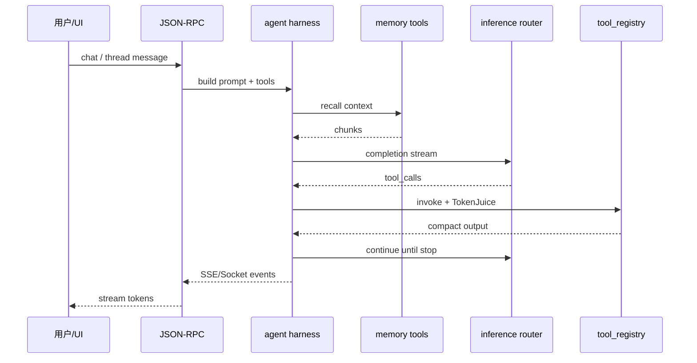

<details>
<summary>相关源文件</summary>

生成本页时使用的主要源文件：

- [src/openhuman/agent_orchestration/mod.rs](../../project-repos/openhuman/src/openhuman/agent_orchestration/mod.rs)
- [src/openhuman/agent/README.md](../../project-repos/openhuman/src/openhuman/agent/README.md)
- [docs/agent-subagent-tool-flow.md](../../project-repos/openhuman/docs/agent-subagent-tool-flow.md)

</details>

# Agent 编排与循环

Agent 层分 **.harness**（prompt、工具过滤、子 Agent 运行循环）与 **agent_orchestration**（多 Worker 控制面）。

## 编排 API 面

`agent_orchestration` 暴露：

- `SpawnAgentRequest` / `SpawnAgentResponse`  
- `FollowUpRequest`, `ResumeAgentRequest`, `WaitAgentOptions`  
- `AgentOrchestrationEvent` 流式状态  

父会话可并行 spawn 多个 sub-agent，各自工具策略由 `agent_tool_policy` 约束。

## 典型对话时序



## 审批与策略

高危工具（shell、git push、支付等）走 `approval` 域；`prompt_injection` 与 UI 侧 guard 双层防御。

**Insight**：Skills 在 OpenHuman 中是 **metadata-first**（`skills` 模块），执行仍落 MCP/内置工具——与 Claude Code skills 文件驱动不同，扩展点主要在 tool registry 与 MCP server 安装 UI。

## 相关页面

- [工具系统与 MCP](tools-mcp.md)
- [推理与模型路由](inference-routing.md)
- [安全与隐私边界](security-privacy.md)

Sources: [src/openhuman/agent_orchestration/mod.rs:1-80](../../../project-repos/openhuman/src/openhuman/agent_orchestration/mod.rs#L1-L80)

<details class="source-snippets">
<summary>引用源码</summary>

<!-- source-snippets:start -->

#### `src/openhuman/agent_orchestration/mod.rs:1-80`

```rust
//! High-level agent-to-agent orchestration domain.
//!
//! This module owns the control-plane semantics for coordinating multiple
//! agent workers from one parent session. The lower-level
//! [`crate::openhuman::agent::harness`] module remains responsible for prompt
//! construction, tool filtering, and the actual sub-agent run loop.

mod ops;
pub mod tools;
pub mod types;

#[cfg(test)]
mod ops_tests;

pub use ops::{AgentOrchestrationSession, OrchestrationError};
pub use types::{
    AgentMessage, AgentOrchestrationEvent, AgentSnapshot, AgentStatus, CloseAgentRequest,
    FollowUpRequest, MessageAgentRequest, ResumeAgentRequest, SpawnAgentRequest,
    SpawnAgentResponse, WaitAgentOptions, WaitAgentResponse,
};
```

<!-- source-snippets:end -->
</details>
