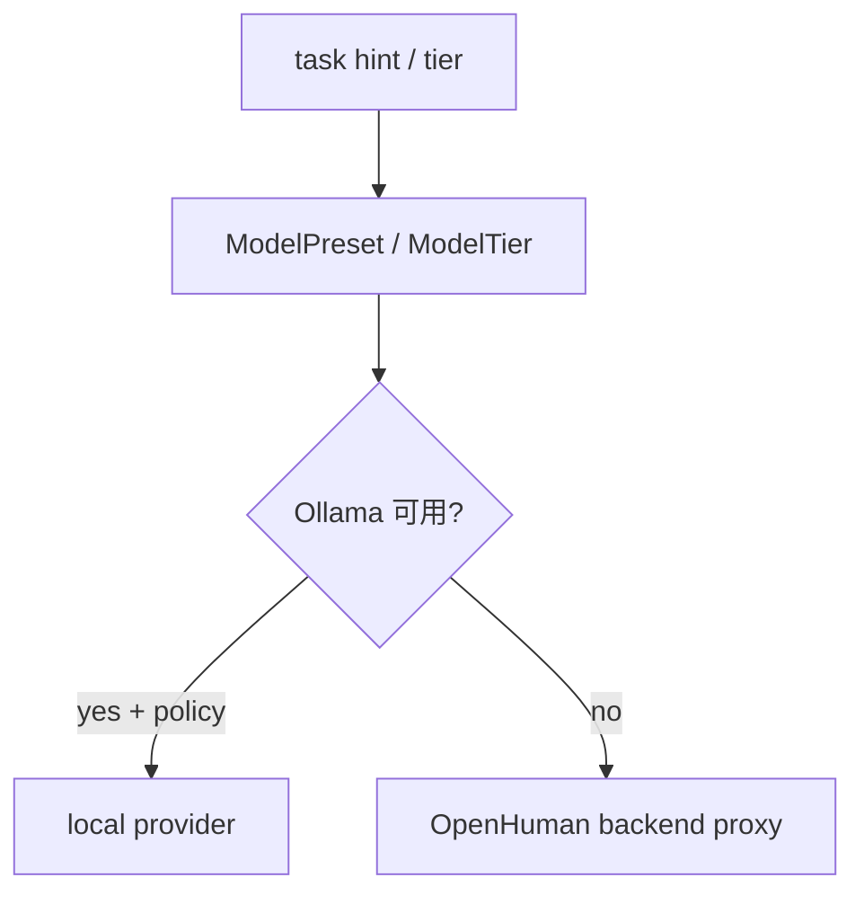

<details>
<summary>相关源文件</summary>

生成本页时使用的主要源文件：

- [src/openhuman/inference/mod.rs](../../project-repos/openhuman/src/openhuman/inference/mod.rs)
- [gitbooks/features/model-routing/README.md](../../project-repos/openhuman/gitbooks/features/model-routing/README.md)

</details>

# 推理与模型路由

`inference` 模块统一 **本地 Ollama/LM Studio/Whisper/Piper** 与 **云端 provider 路由**。

## 子模块

| 路径 | 职责 |
|------|------|
| `inference/local/` | 本地模型下载、生命周期 |
| `inference/provider/` | trait、可靠性、fallback |
| `inference/voice/` | STT/TTS 推理 |
| `inference/http/` | OpenAI 兼容 `/v1/chat/completions` |

RPC 命名空间保持 `inference.*` 与 `local_ai.*` 向后兼容。

## 路由决策流



`routing::quality` 用 Aho-Corasick 检测 local model refusal/空噪声，避免坏回复进入用户可见流。

**Insight**：DeviceProfile 与 scheduler_gate 联动——笔记本低电量时 throttle 后台 LLM，体现"human in the loop"的资源感知。

## 相关页面

- [TokenJuice 压缩](tokenjuice-compression.md)
- [Rust 核心运行时](rust-core-runtime.md)
- [语音与 Meet Agent](voice-meet-agent.md)

Sources: [src/openhuman/inference/mod.rs:1-80](../../../project-repos/openhuman/src/openhuman/inference/mod.rs#L1-L80)

<details class="source-snippets">
<summary>引用源码</summary>

<!-- source-snippets:start -->

#### `src/openhuman/inference/mod.rs:1-80`

```rust
//! Unified inference domain.
//!
//! This module is the canonical home for all inference concerns:
//! - `local/`    — Ollama / LM Studio / Whisper / Piper runtime management
//!                 (was `src/openhuman/local_ai/`)
//! - `provider/` — cloud + local provider trait, routing, reliability
//!                 (was `src/openhuman/providers/`)
//! - `voice/`    — transcription (STT) and TTS inference implementations
//!                 (moved from `src/openhuman/voice/`)
//! - `http/`     — OpenAI-compatible `/v1/chat/completions` endpoint
//!
//! The RPC surface remains under the `inference.*` and `local_ai.*` namespaces
//! for backwards compatibility.

pub mod device;
pub mod http;
pub mod local;
pub mod model_context;
pub mod model_ids;
pub mod openai_oauth;
pub mod ops;
pub mod parse;
pub mod paths;
pub mod presets;
pub mod provider;
mod schemas;
pub mod sentiment;
pub mod types;
pub mod voice;

pub use ops as rpc;
pub use schemas::{
    all_controller_schemas as all_inference_controller_schemas,
    all_registered_controllers as all_inference_registered_controllers,
};

// Re-export the types that external callers (voice, agent, etc.) import from inference
pub use device::DeviceProfile;
pub use local::all_local_ai_controller_schemas;
pub use local::all_local_ai_registered_controllers;
pub use model_context::context_window_for_model;
pub use presets::{ModelPreset, ModelTier, VisionMode};
pub use sentiment::SentimentResult;
pub use types::{
    LocalAiAssetStatus, LocalAiAssetsStatus, LocalAiDownloadProgressItem, LocalAiDownloadsProgress,
    LocalAiEmbeddingResult, LocalAiSpeechResult, LocalAiStatus, LocalAiTtsResult,
};

// Test helpers (re-exported for sibling test files that use inference_test_guard)
#[cfg(test)]
pub(crate) fn inference_test_guard() -> std::sync::MutexGuard<'static, ()> {
    local::inference_test_guard()
}
```

<!-- source-snippets:end -->
</details>
