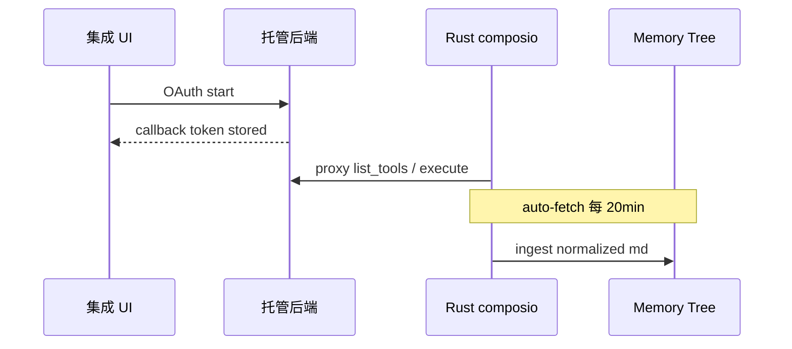

相关源文件

生成本页时使用的主要源文件：

- [src/openhuman/composio](../../project-repos/openhuman/src/openhuman/composio)
- [README.md](../../project-repos/openhuman/README.md)
- [gitbooks/features/integrations/README.md](../../project-repos/openhuman/gitbooks/features/integrations/README.md)

# 集成与 Composio

118+ 第三方集成通过 **Composio connector layer** 暴露为 typed tools。默认 **managed mode**：OAuth 与 tool call 经 OpenHuman 后端代理；**direct mode** 自备 Composio API key。

## 集成生命周期

`memory_sync` 与各 provider reader（Gmail、Notion、Slack…）把远程对象映射为 `SourceKind` + `SourceRef`，再进入 chunk pipeline。

## CEF WebView

部分集成需 **CEF 子 WebView**（`webview_accounts`）完成登录态；cookie 表独立持久化。

**Insight**：Post-OAuth retry E2E（`composio_post_oauth_retry_e2e`）说明连接态 flaky 是一等公民——集成域测试文件数量极大，反映 Composio 栈是回归热点。

## 相关页面

- [Memory Tree 流水线](memory-tree-pipeline.md)
- [消息通道](channels-messaging.md)
- [安全与隐私边界](security-privacy.md)

Sources: [src/openhuman/composio:1-80](../../../project-repos/openhuman/src/openhuman/composio#L1-L80)

引用源码

<!-- source-snippets:start -->

#### `src/openhuman/composio:1-80`

> 引用目标是目录，无法展开源码片段：`src/openhuman/composio`

<!-- source-snippets:end -->

